# Deep Learning - Complete Revision Notes

## 1. Introduction to Deep Learning

### What is Deep Learning?
Deep Learning is a subset of Machine Learning that uses artificial neural networks with multiple layers (deep networks) to progressively extract higher-level features from raw input.

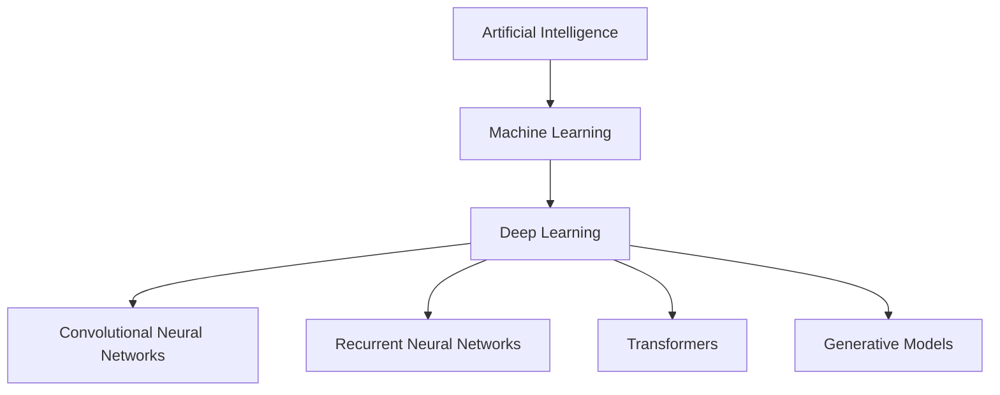

### Deep Learning vs Traditional ML

| Aspect | Traditional ML | Deep Learning |
|--------|---------------|---------------|
| Feature Engineering | Manual | Automatic |
| Data Requirements | Small to Medium | Large |
| Computational Power | Low | High (GPU/TPU) |
| Training Time | Fast | Slow |
| Interpretability | High | Low (Black box) |
| Performance on Complex Tasks | Limited | Excellent |

### Why Deep Learning?

**Advantages**:
- Automatic feature extraction
- Handles unstructured data (images, text, audio)
- State-of-the-art performance on complex tasks
- Scalable with data and compute

**Applications**:
- Computer Vision
- Natural Language Processing
- Speech Recognition
- Autonomous Vehicles
- Healthcare Diagnosis
- Game Playing (AlphaGo)

## 2. Neural Network Fundamentals

### Artificial Neuron (Perceptron)

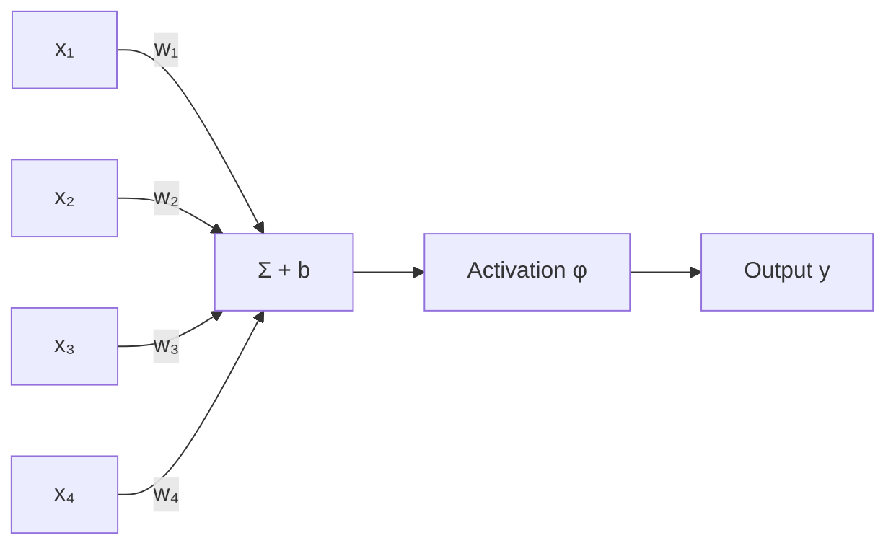

**Mathematical Representation**:
```
z = Σ(wᵢxᵢ) + b
y = φ(z)
```

Where:
- `x` = inputs
- `w` = weights
- `b` = bias
- `φ` = activation function
- `y` = output

### Multi-Layer Perceptron (MLP)

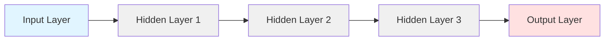

**Architecture Components**:
- **Input Layer**: Raw features
- **Hidden Layers**: Feature transformations (depth = number of hidden layers)
- **Output Layer**: Predictions

**Universal Approximation Theorem**: A neural network with even one hidden layer can approximate any continuous function (given enough neurons).

## 3. Activation Functions

Activation functions introduce non-linearity, enabling networks to learn complex patterns.

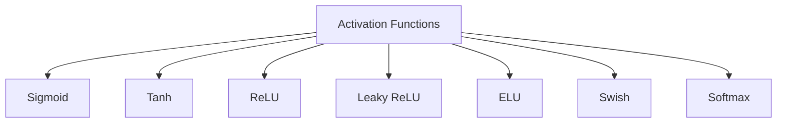

### Common Activation Functions

#### 1. Sigmoid
```
σ(x) = 1 / (1 + e⁻ˣ)
```
- **Range**: (0, 1)
- **Use**: Binary classification output, gates in LSTM
- **Problem**: Vanishing gradient for extreme values

#### 2. Tanh (Hyperbolic Tangent)
```
tanh(x) = (eˣ - e⁻ˣ) / (eˣ + e⁻ˣ)
```
- **Range**: (-1, 1)
- **Use**: Hidden layers (better than sigmoid)
- **Advantage**: Zero-centered output

#### 3. ReLU (Rectified Linear Unit)
```
ReLU(x) = max(0, x)
```
- **Range**: [0, ∞)
- **Use**: Most popular for hidden layers
- **Advantages**: 
  - Simple computation
  - Solves vanishing gradient
  - Sparse activation
- **Problem**: Dying ReLU (neurons output 0 forever)

#### 4. Leaky ReLU
```
LeakyReLU(x) = max(αx, x)  where α ≈ 0.01
```
- **Advantage**: Prevents dying ReLU problem
- Small gradient for negative values

#### 5. ELU (Exponential Linear Unit)
```
ELU(x) = x if x > 0
         α(eˣ - 1) if x ≤ 0
```
- **Advantages**: Negative values push mean closer to zero
- Smooth gradient

#### 6. Swish (SiLU)
```
Swish(x) = x · σ(βx)
```
- **Use**: Modern architectures (often outperforms ReLU)
- Self-gated activation

#### 7. Softmax
```
Softmax(xᵢ) = eˣⁱ / Σⱼ eˣʲ
```
- **Use**: Multi-class classification output
- Converts logits to probabilities (sum = 1)

### Activation Function Selection Guide

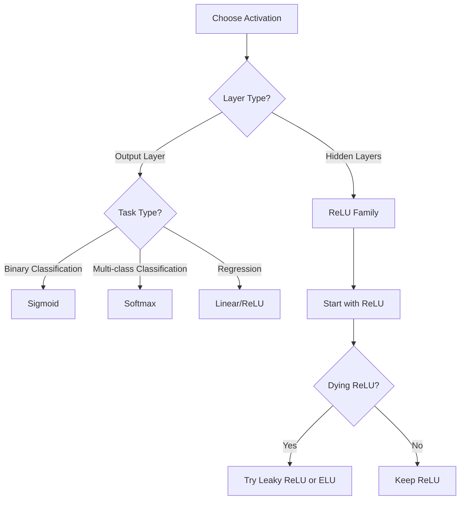

## 4. Forward Propagation

Forward propagation is the process of calculating outputs from inputs through the network.

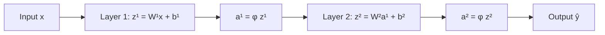

**Step-by-Step Process**:

For each layer `l`:
1. **Linear Transformation**: `z[l] = W[l] · a[l-1] + b[l]`
2. **Activation**: `a[l] = φ(z[l])`

Where:
- `W[l]` = weight matrix for layer l
- `b[l]` = bias vector for layer l
- `a[l]` = activation output from layer l
- `a[0]` = input features x

**Example: 3-Layer Network**
```
Input: x ∈ ℝⁿ

Layer 1: z¹ = W¹x + b¹
         a¹ = ReLU(z¹)

Layer 2: z² = W²a¹ + b²
         a² = ReLU(z²)

Output:  z³ = W³a² + b³
         ŷ = Softmax(z³)
```

## 5. Loss Functions

Loss functions measure the difference between predictions and actual values.

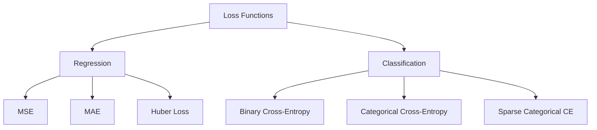

### Regression Loss Functions

#### 1. Mean Squared Error (MSE)
```
L = (1/n) Σ(yᵢ - ŷᵢ)²
```
- Most common for regression
- Sensitive to outliers

#### 2. Mean Absolute Error (MAE)
```
L = (1/n) Σ|yᵢ - ŷᵢ|
```
- More robust to outliers
- Less smooth gradient

#### 3. Huber Loss
```
L = { ½(y - ŷ)²           if |y - ŷ| ≤ δ
    { δ|y - ŷ| - ½δ²      otherwise
```
- Combines MSE and MAE
- Robust to outliers

### Classification Loss Functions

#### 1. Binary Cross-Entropy
```
L = -(1/n) Σ[yᵢlog(ŷᵢ) + (1-yᵢ)log(1-ŷᵢ)]
```
- **Use**: Binary classification
- Output layer: Sigmoid activation

#### 2. Categorical Cross-Entropy
```
L = -(1/n) Σᵢ Σⱼ yᵢⱼ log(ŷᵢⱼ)
```
- **Use**: Multi-class classification with one-hot encoded labels
- Output layer: Softmax activation

#### 3. Sparse Categorical Cross-Entropy
- Same as categorical but accepts integer labels instead of one-hot
- More memory efficient

## 6. Backpropagation

Backpropagation computes gradients of the loss with respect to all parameters using the chain rule.

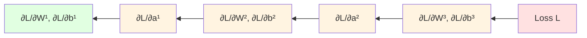

### Algorithm Steps

**Forward Pass**:
1. Compute activations for all layers
2. Calculate loss L

**Backward Pass** (for each layer from output to input):
1. Compute gradient of loss w.r.t. layer output: `∂L/∂a[l]`
2. Compute gradient w.r.t. pre-activation: `∂L/∂z[l] = ∂L/∂a[l] · φ'(z[l])`
3. Compute gradients w.r.t. parameters:
   - `∂L/∂W[l] = ∂L/∂z[l] · a[l-1]ᵀ`
   - `∂L/∂b[l] = ∂L/∂z[l]`
4. Compute gradient w.r.t. previous layer: `∂L/∂a[l-1] = W[l]ᵀ · ∂L/∂z[l]`

**Update Parameters**:
```
W[l] = W[l] - α · ∂L/∂W[l]
b[l] = b[l] - α · ∂L/∂b[l]
```

### Chain Rule Example

For a 2-layer network:
```
x → z¹ = W¹x + b¹ → a¹ = σ(z¹) → z² = W²a¹ + b² → ŷ = σ(z²) → L

∂L/∂W² = ∂L/∂ŷ · ∂ŷ/∂z² · ∂z²/∂W²
∂L/∂W¹ = ∂L/∂ŷ · ∂ŷ/∂z² · ∂z²/∂a¹ · ∂a¹/∂z¹ · ∂z¹/∂W¹
```

## 7. Optimization Algorithms

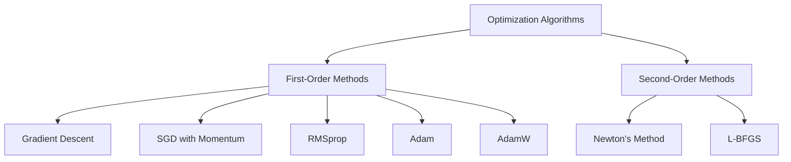

### Gradient Descent Variants

#### 1. Batch Gradient Descent
```
θ = θ - α · ∇J(θ)
```
- Uses entire dataset
- Stable but slow
- Guaranteed convergence for convex functions

#### 2. Stochastic Gradient Descent (SGD)
```
θ = θ - α · ∇J(θ; x⁽ⁱ⁾, y⁽ⁱ⁾)
```
- Updates after each sample
- Fast but noisy
- Can escape local minima

#### 3. Mini-Batch Gradient Descent
```
θ = θ - α · ∇J(θ; x⁽ⁱ:ⁱ⁺ᵇ⁾, y⁽ⁱ:ⁱ⁺ᵇ⁾)
```
- Updates after small batches (32, 64, 128, 256)
- Balance of speed and stability
- **Most commonly used**

### Advanced Optimizers

#### 1. Momentum
```
v = βv + ∇J(θ)
θ = θ - αv
```
- Accelerates in consistent directions
- Dampens oscillations
- Typical β = 0.9

#### 2. RMSprop
```
s = βs + (1-β)(∇J(θ))²
θ = θ - α · ∇J(θ) / (√s + ε)
```
- Adapts learning rate per parameter
- Good for non-stationary objectives
- Typical β = 0.999

#### 3. Adam (Adaptive Moment Estimation)
```
m = β₁m + (1-β₁)∇J(θ)        # First moment (mean)
v = β₂v + (1-β₂)(∇J(θ))²     # Second moment (variance)
m̂ = m / (1-β₁ᵗ)               # Bias correction
v̂ = v / (1-β₂ᵗ)
θ = θ - α · m̂ / (√v̂ + ε)
```
- **Most popular optimizer**
- Combines momentum and RMSprop
- Default: β₁=0.9, β₂=0.999, α=0.001

#### 4. AdamW
- Adam with decoupled weight decay
- Better generalization than Adam
- Preferred for transformers

### Optimizer Comparison

| Optimizer | Convergence Speed | Memory | Use Case |
|-----------|------------------|--------|----------|
| SGD | Slow | Low | Simple problems |
| SGD + Momentum | Medium | Low | Computer vision |
| RMSprop | Fast | Medium | RNNs |
| Adam | Fast | Medium | General purpose |
| AdamW | Fast | Medium | Transformers, NLP |

### Learning Rate Strategies

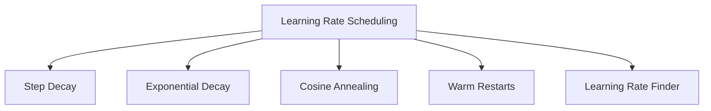

**Step Decay**: Reduce by factor every N epochs
```
α = α₀ · decayᵉᵖᵒᶜʰ/ˢᵗᵉᵖ
```

**Exponential Decay**:
```
α = α₀ · e⁻ᵏᵗ
```

**Cosine Annealing**:
```
α = α_min + ½(α_max - α_min)(1 + cos(πt/T))
```

## 8. Regularization Techniques

Regularization prevents overfitting and improves generalization.

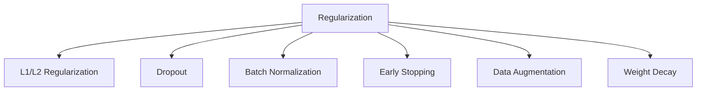

### 1. L1 and L2 Regularization

**L2 Regularization (Weight Decay)**:
```
L = L_original + λ Σ(wᵢ²)
```
- Penalizes large weights
- Smooth weight decay

**L1 Regularization**:
```
L = L_original + λ Σ|wᵢ|
```
- Sparse weights (some become exactly 0)
- Feature selection

### 2. Dropout

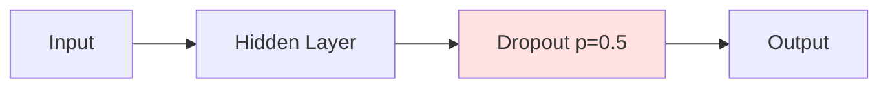

**How it works**:
- During training: Randomly drop neurons with probability p
- During inference: Use all neurons, scale by (1-p)

**Mathematical**:
```
Training: h = φ(Wx) · mask,  where mask ~ Bernoulli(1-p)
Inference: h = (1-p) · φ(Wx)
```

**Benefits**:
- Prevents co-adaptation of neurons
- Ensemble effect
- Typical values: p = 0.2 to 0.5

### 3. Batch Normalization

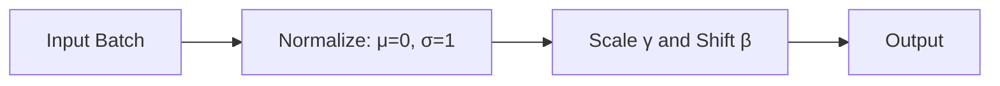

**Algorithm**:
```
μ_B = (1/m) Σ xᵢ                    # Batch mean
σ²_B = (1/m) Σ (xᵢ - μ_B)²         # Batch variance
x̂ᵢ = (xᵢ - μ_B) / √(σ²_B + ε)     # Normalize
yᵢ = γx̂ᵢ + β                        # Scale and shift
```

**Benefits**:
- Faster training (higher learning rates)
- Reduces internal covariate shift
- Acts as regularization
- Less sensitive to initialization

**Where to apply**: After linear transformation, before activation

### 4. Layer Normalization

Similar to Batch Norm but normalizes across features (not batch).
- **Use**: Transformers, RNNs
- Better for small batches or sequence models

### 5. Early Stopping

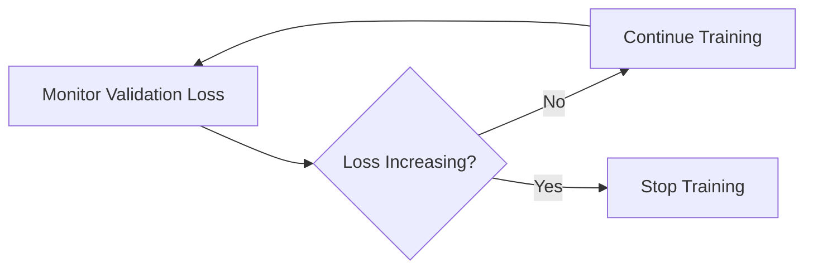

- Stop training when validation loss stops improving
- Prevents overfitting
- Typical patience: 10-20 epochs

### 6. Data Augmentation

**Computer Vision**:
- Random crops, flips, rotations
- Color jittering
- Cutout, Mixup

**NLP**:
- Synonym replacement
- Back translation
- Random insertion/deletion

## 9. Weight Initialization

Proper initialization is crucial for training deep networks.

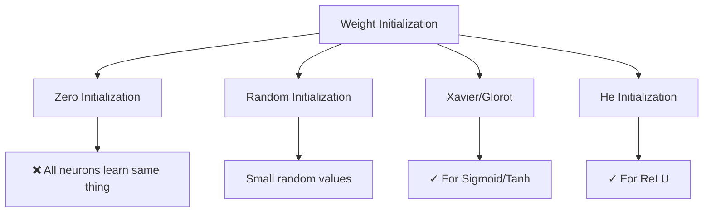

### Common Strategies

#### 1. Zero Initialization
```
W = 0
```
- **Problem**: All neurons compute same output and get same gradient
- **Never use this!**

#### 2. Small Random Values
```
W ~ N(0, 0.01)
```
- Works for shallow networks
- Too small for deep networks

#### 3. Xavier/Glorot Initialization
```
W ~ U[-√(6/(nᵢₙ + n_out)), √(6/(nᵢₙ + n_out))]
```
or
```
W ~ N(0, 2/(nᵢₙ + n_out))
```
- **Use**: Sigmoid, Tanh activations
- Maintains variance across layers

#### 4. He Initialization
```
W ~ N(0, 2/nᵢₙ)
```
- **Use**: ReLU and variants
- **Most commonly used**
- Accounts for ReLU killing half the neurons

#### 5. LeCun Initialization
```
W ~ N(0, 1/nᵢₙ)
```
- **Use**: SELU activation

### Bias Initialization
```
b = 0
```
- Usually initialized to zero
- Sometimes small positive values for ReLU

## 10. Convolutional Neural Networks (CNN)

CNNs are designed for processing grid-like data (images).

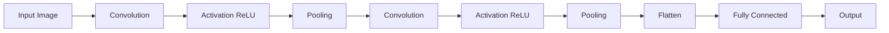

### Key Components

#### 1. Convolutional Layer

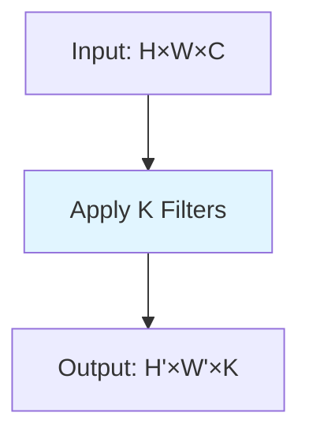

**Operation**:
- Slide filter/kernel over input
- Compute dot product at each position
- Produce feature map

**Parameters**:
- **Filter size**: 3×3, 5×5, 7×7 (3×3 most common)
- **Stride**: Step size (usually 1)
- **Padding**: 
  - Valid: No padding
  - Same: Pad to keep dimensions

**Output size**:
```
H_out = (H_in - K + 2P) / S + 1
W_out = (W_in - K + 2P) / S + 1
```
Where K=kernel size, P=padding, S=stride

**Number of parameters**:
```
Params = K × K × C_in × C_out + C_out (bias)
```

#### 2. Pooling Layer

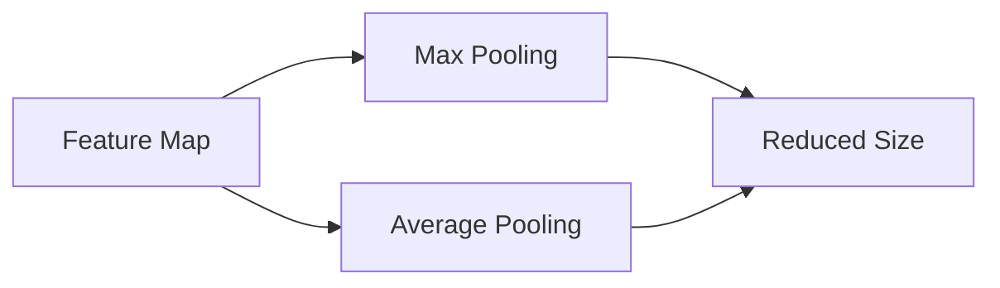

**Max Pooling**:
- Take maximum value in each window
- Typical: 2×2 with stride 2
- Reduces spatial dimensions by half
- Provides translation invariance

**Average Pooling**:
- Take average value
- Smoother downsampling
- Used in some architectures (GoogleNet)

**Global Average Pooling**:
- Average entire feature map to single value
- Used before final classification
- Reduces parameters

#### 3. Fully Connected Layer

- Connects every neuron to every neuron in next layer
- Usually at end of network
- Most parameters are here

### CNN Architecture Pattern

```
Input → [Conv → ReLU → Pool] × N → Flatten → [FC → ReLU] × M → FC → Softmax
```

### Popular CNN Architectures

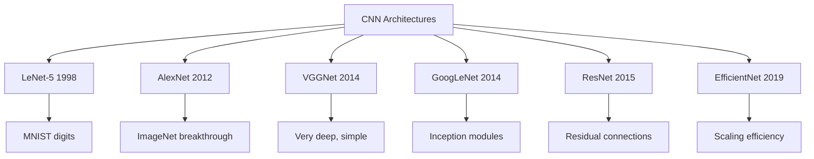

#### LeNet-5 (1998)
```
Input(32×32) → Conv(6) → Pool → Conv(16) → Pool → FC(120) → FC(84) → FC(10)
```
- First successful CNN
- Used for digit recognition

#### AlexNet (2012)
```
Input(224×224×3) → Conv(96) → Pool → Conv(256) → Pool → Conv(384) → Conv(384) → Conv(256) → Pool → FC(4096) → FC(4096) → FC(1000)
```
- 60M parameters
- ReLU activation
- Dropout
- Data augmentation
- GPU training

#### VGG-16/19 (2014)
```
[Conv3×3(64)]×2 → Pool → [Conv3×3(128)]×2 → Pool → [Conv3×3(256)]×3 → Pool → [Conv3×3(512)]×3 → Pool → [Conv3×3(512)]×3 → Pool → FC×3
```
- Only 3×3 convolutions
- Very deep (16-19 layers)
- 138M parameters
- Simple and uniform architecture

#### ResNet (2015)

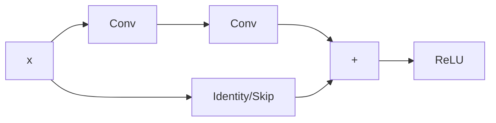

**Residual Block**:
```
H(x) = F(x) + x
```

**Why it works**:
- Solves vanishing gradient problem
- Easier to optimize
- Can train very deep networks (50, 101, 152 layers)

**Variants**:
- ResNet-50, ResNet-101, ResNet-152
- 26M parameters (ResNet-50)

### CNN Design Principles

1. **Stacking layers**: Deeper is often better
2. **Small filters**: 3×3 is standard (multiple 3×3 > one 7×7)
3. **Increase channels**: Double channels when spatial size halves
4. **Pooling**: Max pooling most common (2×2, stride 2)
5. **Batch normalization**: After conv, before activation
6. **Skip connections**: For very deep networks

## 11. Recurrent Neural Networks (RNN)

RNNs process sequential data by maintaining hidden state.

```mermaid
graph LR
    A[x₁] --> B[RNN]
    B --> C[h₁]
    C --> D[y₁]
    
    E[x₂] --> F[RNN]
    C --> F
    F --> G[h₂]
    G --> H[y₂]
    
    I[x₃] --> J[RNN]
    G --> J
    J --> K[h₃]
    K --> L[y₃]
```

### Basic RNN

**Forward Pass**:
```
hₜ = tanh(Wₕₕ·hₜ₋₁ + Wₓₕ·xₜ + bₕ)
yₜ = Wₕᵧ·hₜ + bᵧ
```

**Components**:
- `hₜ`: Hidden state at time t
- `xₜ`: Input at time t
- `yₜ`: Output at time t
- Weights are shared across time steps

### Problems with Basic RNN

```mermaid
graph TD
    A[RNN Problems] --> B[Vanishing Gradient]
    A --> C[Exploding Gradient]
    B --> D[Can't learn long-term dependencies]
    C --> E[Unstable training]
    
    D --> F[Solution: LSTM/GRU]
    E --> G[Solution: Gradient Clipping]
```

**Vanishing Gradient**:
- Gradients shrink exponentially with time
- Can't learn dependencies > 10 steps

**Exploding Gradient**:
- Gradients grow exponentially
- Solution: Gradient clipping

## 12. Long Short-Term Memory (LSTM)

LSTMs solve vanishing gradient problem with gating mechanisms.

```mermaid
graph TD
    A[LSTM Cell] --> B[Forget Gate]
    A --> C[Input Gate]
    A --> D[Output Gate]
    A --> E[Cell State]
    
    B --> F[What to forget from memory]
    C --> G[What new info to store]
    D --> H[What to output]
    E --> I[Long-term memory highway]
```

### LSTM Architecture

**Gates**:
```
Forget gate:  fₜ = σ(Wf·[hₜ₋₁, xₜ] + bf)
Input gate:   iₜ = σ(Wi·[hₜ₋₁, xₜ] + bi)
Output gate:  oₜ = σ(Wo·[hₜ₋₁, xₜ] + bo)
```

**Cell state update**:
```
C̃ₜ = tanh(Wc·[hₜ₋₁, xₜ] + bc)    # Candidate values
Cₜ = fₜ ⊙ Cₜ₋₁ + iₜ ⊙ C̃ₜ           # Update cell state
hₜ = oₜ ⊙ tanh(Cₜ)                 # Output
```

Where ⊙ is element-wise multiplication

**Key Innovation**: Cell state Cₜ acts as "memory highway" with minimal transformations

### Gated Recurrent Unit (GRU)

Simpler variant of LSTM with fewer parameters.

```mermaid
graph LR
    A[GRU] --> B[Reset Gate]
    A --> C[Update Gate]
    B --> D[How much past to forget]
    C --> E[How much to update]
```

**Gates**:
```
Reset gate:   rₜ = σ(Wr·[hₜ₋₁, xₜ])
Update gate:  zₜ = σ(Wz·[hₜ₋₁, xₜ])
```

**Hidden state**:
```
h̃ₜ = tanh(W·[rₜ ⊙ hₜ₋₁, xₜ])
hₜ = (1 - zₜ) ⊙ hₜ₋₁ + zₜ ⊙ h̃ₜ
```

**LSTM vs GRU**:
- GRU: Fewer parameters, faster training
- LSTM: More expressive, better for complex sequences
- GRU often performs similarly to LSTM