# Machine Learning - Complete Revision Notes

## 1. Introduction to Machine Learning

### What is Machine Learning?
Machine Learning is a subset of Artificial Intelligence that enables systems to learn and improve from experience without being explicitly programmed. It focuses on developing algorithms that can access data and use it to learn for themselves.


### Types of Machine Learning

#### 1. Supervised Learning
- **Definition**: Learning with labeled data
- **Goal**: Map input to output based on example input-output pairs
- **Examples**: Classification, Regression

#### 2. Unsupervised Learning
- **Definition**: Learning patterns from unlabeled data
- **Goal**: Discover hidden patterns or data groupings
- **Examples**: Clustering, Dimensionality Reduction

#### 3. Reinforcement Learning
- **Definition**: Learning through interaction with environment
- **Goal**: Maximize cumulative reward
- **Examples**: Game AI, Robotics


## 2. Supervised Learning

### Classification vs Regression


### Linear Regression

**Formula**: `y = mx + b` or `y = θ₀ + θ₁x₁ + θ₂x₂ + ... + θₙxₙ`

**Cost Function (MSE)**:
```
J(θ) = (1/2m) Σ(hθ(x⁽ⁱ⁾) - y⁽ⁱ⁾)²
```

**Key Concepts**:
- Hypothesis function predicts output
- Cost function measures error
- Gradient descent optimizes parameters

**Gradient Descent Update Rule**:
```
θⱼ := θⱼ - α(∂/∂θⱼ)J(θ)
```
where α is the learning rate

### Logistic Regression

**Sigmoid Function**:
```
σ(z) = 1 / (1 + e⁻ᶻ)
```

**Cost Function (Binary Cross-Entropy)**:
```
J(θ) = -(1/m) Σ[y⁽ⁱ⁾log(hθ(x⁽ⁱ⁾)) + (1-y⁽ⁱ⁾)log(1-hθ(x⁽ⁱ⁾))]
```

**Use Cases**: Binary classification problems (Yes/No, Spam/Not Spam)


## 3. Classification Algorithms

### Decision Trees

**How it works**:
1. Select best feature to split data
2. Create decision node
3. Recursively split subsets
4. Stop when criteria met

**Splitting Criteria**:
- **Gini Impurity**: `Gini = 1 - Σ(pᵢ)²`
- **Entropy**: `Entropy = -Σ(pᵢ log₂(pᵢ))`
- **Information Gain**: `IG = Entropy(parent) - Weighted Average Entropy(children)`


**Advantages**:
- Easy to interpret
- No feature scaling needed
- Handles non-linear relationships

**Disadvantages**:
- Prone to overfitting
- Unstable (small data changes affect structure)

### Random Forest

**Ensemble Method**: Combines multiple decision trees


**Key Features**:
- Bagging (Bootstrap Aggregating)
- Random feature selection
- Reduces overfitting
- High accuracy

### Support Vector Machines (SVM)

**Goal**: Find optimal hyperplane that maximizes margin between classes


**Key Concepts**:
- **Support Vectors**: Points closest to hyperplane
- **Margin**: Distance between hyperplane and nearest points
- **Kernel Trick**: Transform to higher dimensions for non-linear separation

**Common Kernels**:
- Linear: `K(x, x') = x · x'`
- Polynomial: `K(x, x') = (x · x' + c)ᵈ`
- RBF (Gaussian): `K(x, x') = exp(-γ||x - x'||²)`

### K-Nearest Neighbors (KNN)

**Algorithm**:
1. Choose K neighbors
2. Calculate distance to all points
3. Select K nearest neighbors
4. Vote for classification or average for regression


**Distance Metrics**:
- **Euclidean**: `√Σ(xᵢ - yᵢ)²`
- **Manhattan**: `Σ|xᵢ - yᵢ|`
- **Minkowski**: `(Σ|xᵢ - yᵢ|ᵖ)^(1/p)`

**Choosing K**:
- Small K: More complex, prone to noise
- Large K: Smoother boundaries, may miss patterns
- Odd K preferred for binary classification

### Naive Bayes

**Bayes Theorem**:
```
P(A|B) = P(B|A) × P(A) / P(B)
```

**Assumption**: Features are independent given class

**Types**:
- Gaussian Naive Bayes (continuous data)
- Multinomial Naive Bayes (discrete counts)
- Bernoulli Naive Bayes (binary features)

## 4. Unsupervised Learning

### K-Means Clustering

**Algorithm Steps**:
1. Initialize K centroids randomly
2. Assign each point to nearest centroid
3. Recalculate centroids
4. Repeat until convergence


**Cost Function (Inertia)**:
```
J = ΣΣ ||x⁽ⁱ⁾ - μₖ||²
```

**Choosing K**: Elbow Method - plot inertia vs K

### Hierarchical Clustering

**Types**:
- **Agglomerative** (bottom-up): Start with individual points, merge clusters
- **Divisive** (top-down): Start with one cluster, split recursively


**Linkage Methods**:
- Single: Minimum distance between clusters
- Complete: Maximum distance
- Average: Average distance
- Ward: Minimizes variance

### Principal Component Analysis (PCA)

**Goal**: Reduce dimensionality while preserving variance

**Steps**:
1. Standardize data
2. Compute covariance matrix
3. Calculate eigenvectors and eigenvalues
4. Select top K eigenvectors
5. Transform data to new space


**Variance Explained**: Choose components that explain 95%+ of variance

## 5. Model Evaluation

### Classification Metrics

**Confusion Matrix**:
```
                Predicted
              Pos    Neg
Actual  Pos   TP     FN
        Neg   FP     TN
```


**Key Metrics**:
- **Accuracy**: `(TP + TN) / Total`
- **Precision**: `TP / (TP + FP)` - Of predicted positives, how many are correct?
- **Recall (Sensitivity)**: `TP / (TP + FN)` - Of actual positives, how many found?
- **F1-Score**: `2 × (Precision × Recall) / (Precision + Recall)`
- **Specificity**: `TN / (TN + FP)`

**ROC Curve**: Plot True Positive Rate vs False Positive Rate
- **AUC** (Area Under Curve): Higher is better (1.0 = perfect)

### Regression Metrics

- **MSE** (Mean Squared Error): `(1/n)Σ(yᵢ - ŷᵢ)²`
- **RMSE** (Root MSE): `√MSE`
- **MAE** (Mean Absolute Error): `(1/n)Σ|yᵢ - ŷᵢ|`
- **R² Score**: `1 - (SS_res / SS_tot)` (0 to 1, higher is better)

### Cross-Validation

**K-Fold Cross-Validation**:


**Advantages**:
- Uses all data for training and testing
- Reduces overfitting assessment bias
- More reliable performance estimate

## 6. Overfitting and Underfitting


### Underfitting (High Bias)
- Model too simple
- Poor performance on training and test data
- **Solutions**: Add features, increase model complexity

### Overfitting (High Variance)
- Model too complex, learns noise
- Good on training, poor on test data
- **Solutions**: 
  - More training data
  - Regularization
  - Reduce features
  - Cross-validation
  - Early stopping

### Bias-Variance Tradeoff

```
Total Error = Bias² + Variance + Irreducible Error
```

## 7. Regularization

### L1 Regularization (Lasso)

**Cost Function**:
```
J(θ) = MSE + λΣ|θⱼ|
```

**Properties**:
- Feature selection (some coefficients → 0)
- Sparse models

### L2 Regularization (Ridge)

**Cost Function**:
```
J(θ) = MSE + λΣθⱼ²
```

**Properties**:
- Shrinks coefficients
- Doesn't eliminate features
- Handles multicollinearity

### Elastic Net

Combines L1 and L2: `λ₁Σ|θⱼ| + λ₂Σθⱼ²`


## 8. Feature Engineering

### Feature Scaling

**Normalization** (Min-Max Scaling):
```
x' = (x - min) / (max - min)
```
Result: [0, 1] range

**Standardization** (Z-score):
```
x' = (x - μ) / σ
```
Result: Mean=0, SD=1


### Feature Encoding

**One-Hot Encoding**: Convert categorical to binary columns
- Example: Color [Red, Blue, Green] → 3 binary columns

**Label Encoding**: Assign integers to categories
- Example: [Low, Medium, High] → [0, 1, 2]

**Ordinal Encoding**: For ordered categories

### Feature Selection Methods

1. **Filter Methods**: Statistical tests (Chi-square, correlation)
2. **Wrapper Methods**: Use model performance (Forward/Backward selection)
3. **Embedded Methods**: During training (Lasso, tree-based importance)

## 9. Neural Networks Basics

### Perceptron

```mermaid
graph LR
    A[x₁] -->|w₁| D[Σ]
    B[x₂] -->|w₂| D
    C[x₃] -->|w₃| D
    D --> E[Activation]
    E --> F[Output]
```



**Components**:
- Inputs: x₁, x₂, ..., xₙ
- Weights: w₁, w₂, ..., wₙ
- Bias: b
- Activation function
- Output: y

### Multi-Layer Perceptron (MLP)


### Activation Functions

**Sigmoid**: `σ(x) = 1/(1+e⁻ˣ)`
- Output: (0, 1)
- Use: Binary classification output

**Tanh**: `tanh(x) = (eˣ - e⁻ˣ)/(eˣ + e⁻ˣ)`
- Output: (-1, 1)
- Zero-centered

**ReLU**: `f(x) = max(0, x)`
- Most popular
- Solves vanishing gradient
- Fast computation

**Softmax**: For multi-class output
```
σ(xᵢ) = eˣⁱ / Σeˣʲ
```

### Backpropagation


**Process**:
1. Forward propagation: Calculate predictions
2. Compute loss
3. Backward propagation: Calculate gradients
4. Update weights using gradient descent

## 10. Optimization Algorithms

### Gradient Descent Variants

**Batch Gradient Descent**:
- Uses entire dataset
- Slow but stable

**Stochastic Gradient Descent (SGD)**:
- One sample at a time
- Fast but noisy

**Mini-Batch Gradient Descent**:
- Small batches (32, 64, 128)
- Balance of speed and stability


### Advanced Optimizers

**Momentum**:
- Accelerates in relevant direction
- Reduces oscillations

**Adam** (Adaptive Moment Estimation):
- Combines momentum and RMSprop
- Adaptive learning rates
- Most popular choice

**Learning Rate Scheduling**:
- Decay learning rate over time
- Step decay, exponential decay

## 11. Ensemble Methods

```mermaid
graph TD
    A[Ensemble Learning] --> B[Bagging]
    A --> C[Boosting]
    A --> D[Stacking]
    B --> E[Random Forest]
    C --> F[AdaBoost]
    C --> G[Gradient Boosting]
    C --> H[XGBoost]
```

### Bagging (Bootstrap Aggregating)
- Train models on random subsets
- Average predictions
- Reduces variance
- Example: Random Forest

### Boosting
- Sequential training
- Each model corrects previous errors
- Reduces bias
- Examples: AdaBoost, Gradient Boosting, XGBoost

**AdaBoost**:
- Weights misclassified samples higher
- Combines weak learners

**Gradient Boosting**:
- Builds trees sequentially
- Each tree fits residual errors

**XGBoost**:
- Optimized gradient boosting
- Regularization built-in
- Parallel processing

### Stacking
- Train multiple models
- Meta-model learns from their predictions

## 12. Hyperparameter Tuning

### Methods

**Grid Search**:
- Exhaustive search over parameter grid
- Computationally expensive

**Random Search**:
- Random combinations
- More efficient than grid search

**Bayesian Optimization**:
- Probabilistic model guides search
- More efficient

```mermaid
graph LR
    A[Hyperparameter Space] --> B{Search Method}
    B -->|Grid Search| C[Try All Combinations]
    B -->|Random Search| D[Sample Randomly]
    B -->|Bayesian| E[Smart Sampling]
    C --> F[Best Parameters]
    D --> F
    E --> F
```

### Common Hyperparameters

**General**:
- Learning rate
- Batch size
- Number of epochs

**Tree-based**:
- Max depth
- Min samples split
- Number of estimators

**Neural Networks**:
- Number of layers
- Neurons per layer
- Dropout rate
- Activation functions

## 13. ML Workflow

```mermaid
graph TD
    A[Problem Definition] --> B[Data Collection]
    B --> C[Data Exploration EDA]
    C --> D[Data Preprocessing]
    D --> E[Feature Engineering]
    E --> F[Model Selection]
    F --> G[Model Training]
    G --> H[Model Evaluation]
    H --> I{Good Performance?}
    I -->|No| J[Tune Hyperparameters]
    J --> G
    I -->|Yes| K[Model Deployment]
    K --> L[Monitor & Maintain]
```

### Steps Breakdown

1. **Problem Definition**: Classification, regression, clustering?
2. **Data Collection**: Gather relevant data
3. **EDA**: Understand data distribution, correlations, outliers
4. **Preprocessing**: Handle missing values, outliers, scaling
5. **Feature Engineering**: Create, select, transform features
6. **Model Selection**: Choose appropriate algorithms
7. **Training**: Fit model on training data
8. **Evaluation**: Test on validation/test set
9. **Tuning**: Optimize hyperparameters
10. **Deployment**: Production environment
11. **Monitoring**: Track performance, retrain as needed

## 14. Important Concepts

### Train-Test Split
- Typical split: 70-30 or 80-20
- Training set: Learn patterns
- Validation set: Tune hyperparameters
- Test set: Final evaluation

### Data Preprocessing Checklist
- Handle missing values (imputation, removal)
- Remove duplicates
- Handle outliers
- Feature scaling
- Encode categorical variables
- Handle imbalanced datasets

### Handling Imbalanced Data
- **SMOTE**: Synthetic Minority Over-sampling
- **Undersampling**: Reduce majority class
- **Class weights**: Penalize misclassification differently
- **Ensemble methods**: Balanced bagging

### Curse of Dimensionality
- High dimensions → sparse data
- More features ≠ better performance
- Solutions: Feature selection, PCA, regularization

## 15. Quick Reference Formulas

### Distance Metrics
```
Euclidean: √Σ(xᵢ - yᵢ)²
Manhattan: Σ|xᵢ - yᵢ|
Cosine Similarity: (A·B)/(||A|| ||B||)
```

### Probability
```
Bayes: P(A|B) = P(B|A)P(A)/P(B)
Conditional Probability: P(A|B) = P(A∩B)/P(B)
```

### Information Theory
```
Entropy: H(X) = -Σ P(x)log₂P(x)
Information Gain: IG = H(parent) - Σ(|Dᵥ|/|D|)H(Dᵥ)
Gini: 1 - Σpᵢ²
```

## 16. Algorithm Comparison Cheat Sheet

| Algorithm | Type | Pros | Cons | Use When |
|-----------|------|------|------|----------|
| Linear Regression | Regression | Simple, interpretable | Linear relationships only | Linear data |
| Logistic Regression | Classification | Fast, interpretable | Linear boundaries | Binary classification |
| Decision Tree | Both | Interpretable, no scaling | Overfits easily | Need interpretability |
| Random Forest | Both | Accurate, robust | Slow, less interpretable | High accuracy needed |
| SVM | Both | Effective in high dims | Slow on large data | Small-medium datasets |
| KNN | Both | Simple, no training | Slow prediction, memory | Small datasets |
| Naive Bayes | Classification | Fast, works with little data | Independence assumption | Text classification |
| K-Means | Clustering | Fast, scalable | Needs K specified | Clear cluster structure |
| Neural Networks | Both | Handles complex patterns | Needs lots of data | Large datasets, images |

## 17. Best Practices

### Model Development
1. Start simple, increase complexity
2. Establish baseline performance
3. Use cross-validation
4. Monitor both training and validation metrics
5. Document experiments and results

### Avoiding Common Pitfalls
- **Data leakage**: Don't use test data in training
- **Feature scaling**: Scale before distance-based algorithms
- **Imbalanced data**: Don't rely on accuracy alone
- **Overfitting**: Use regularization and validation
- **Random seed**: Set for reproducibility

### Performance Tips
- More data > better algorithm (usually)
- Feature engineering > algorithm tuning
- Ensemble methods often outperform single models
- Domain knowledge is crucial
- Simple models are easier to maintain

## 18. Quick Decision Guide

```mermaid
graph TD
    A[Start: What's your task?] --> B{Labeled Data?}
    B -->|Yes| C{Output Type?}
    B -->|No| D[Unsupervised Learning]
    C -->|Continuous| E[Regression]
    C -->|Discrete| F[Classification]
    D --> G{Goal?}
    G -->|Group Similar| H[Clustering]
    G -->|Reduce Dimensions| I[PCA]
    E --> J[Linear/Polynomial Regression]
    F --> K{Binary or Multi-class?}
    K -->|Binary| L[Logistic Regression, SVM]
    K -->|Multi-class| M[Random Forest, Neural Networks]
    H --> N[K-Means, Hierarchical]
```

## Summary

Machine Learning is a vast field with many algorithms and techniques. Key takeaways:

- **Choose the right algorithm** for your problem type
- **Preprocess data** thoroughly (garbage in = garbage out)
- **Evaluate properly** using appropriate metrics
- **Prevent overfitting** with regularization and validation
- **Start simple** and increase complexity as needed
- **Iterate continuously** - ML is experimental

Remember: Understanding the fundamentals is more important than memorizing every algorithm. Focus on when and why to use each technique.

**Good luck with your revision! 🚀**