# Artificial Intelligence & Machine Learning
## Complete Overview, Use Cases & Mind Maps

## 1. The AI Landscape - Complete Hierarchy

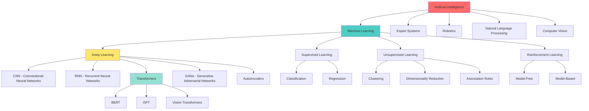

## 2. AI vs ML vs DL vs Data Science

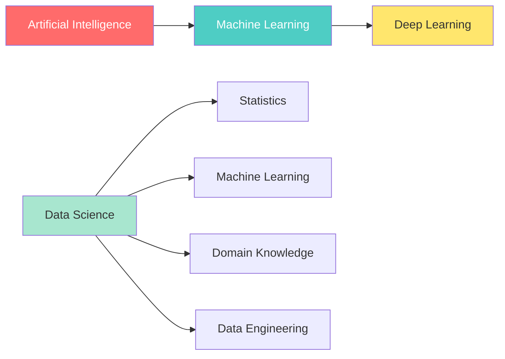

### Definitions

**Artificial Intelligence (AI)**
- Broad field: Making machines intelligent
- Any technique that enables computers to mimic human behavior
- Includes rule-based systems, search algorithms, reasoning

**Machine Learning (ML)**
- Subset of AI
- Learning from data without explicit programming
- Statistical approaches to pattern recognition

**Deep Learning (DL)**
- Subset of ML
- Neural networks with multiple layers
- Automatic feature extraction

**Data Science**
- Interdisciplinary field
- Extract insights from data
- Includes ML + Statistics + Domain Expertise + Visualization

| Aspect | AI | ML | Deep Learning | Data Science |
|--------|----|----|---------------|--------------|
| **Scope** | Broadest | Subset of AI | Subset of ML | Parallel field |
| **Goal** | Mimic intelligence | Learn patterns | Complex patterns | Extract insights |
| **Data Needs** | Varies | Medium | Large | Varies |
| **Techniques** | Rules, Search, ML | Algorithms | Neural Networks | Stats, ML, Viz |
| **Example** | Chess AI | Spam filter | Face recognition | Customer analysis |

## 3. Machine Learning - Detailed Breakdown

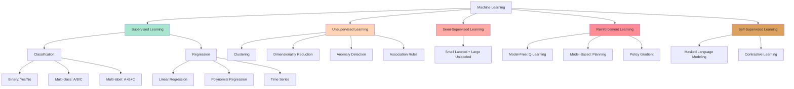

### Supervised Learning Algorithms

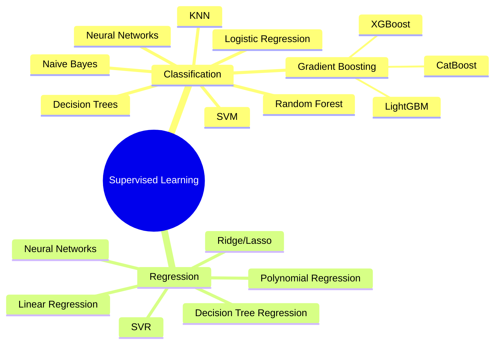

### Unsupervised Learning Algorithms

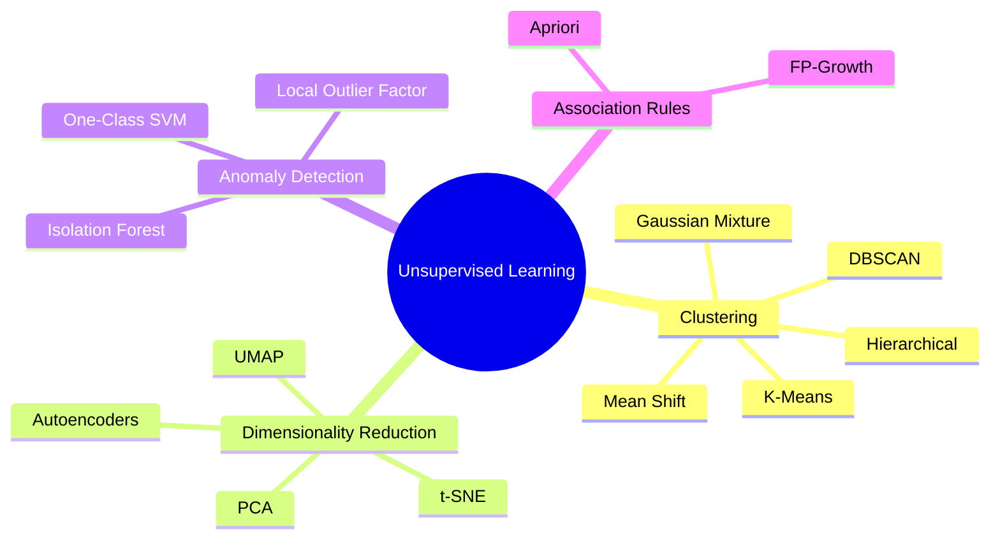

## 4. Deep Learning Architecture Map

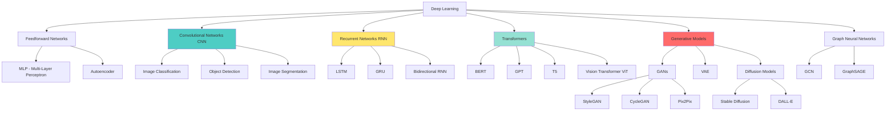

## 5. AI Applications by Industry

```mermaid
graph TD
    A[AI Applications] --> B[Healthcare]
    A --> C[Finance]
    A --> D[Retail & E-commerce]
    A --> E[Transportation]
    A --> F[Manufacturing]
    A --> G[Entertainment]
    A --> H[Agriculture]
    A --> I[Education]
    A --> J[Cybersecurity]
    A --> K[Energy]
    
    B --> B1[Disease Diagnosis]
    B --> B2[Drug Discovery]
    B --> B3[Medical Imaging]
    B --> B4[Patient Monitoring]
    
    C --> C1[Fraud Detection]
    C --> C2[Algorithmic Trading]
    C --> C3[Credit Scoring]
    C --> C4[Risk Assessment]
    
    D --> D1[Recommendation Systems]
    D --> D2[Demand Forecasting]
    D --> D3[Price Optimization]
    D --> D4[Customer Segmentation]
    
    E --> E1[Autonomous Vehicles]
    E --> E2[Route Optimization]
    E --> E3[Traffic Prediction]
    E --> E4[Ride Sharing]
    
    F --> F1[Predictive Maintenance]
    F --> F2[Quality Control]
    F --> F3[Supply Chain Optimization]
    F --> F4[Robotics]
    
    G --> G1[Content Recommendation]
    G --> G2[Content Generation]
    G --> G3[Voice Synthesis]
    G --> G4[Game AI]
    
    H --> H1[Crop Monitoring]
    H --> H2[Yield Prediction]
    H --> H3[Disease Detection]
    H --> H4[Precision Farming]
    
    I --> I1[Personalized Learning]
    I --> I2[Auto Grading]
    I --> I3[Tutoring Systems]
    I --> I4[Content Creation]
    
    J --> J1[Threat Detection]
    J --> J2[Intrusion Prevention]
    J --> J3[Malware Analysis]
    J --> J4[Vulnerability Assessment]
    
    K --> K1[Smart Grids]
    K --> K2[Energy Consumption Forecasting]
    K --> K3[Equipment Monitoring]
    K --> K4[Renewable Energy Optimization]
    
    style B fill:#ff6b6b
    style C fill:#4ecdc4
    style D fill:#ffe66d
    style E fill:#95e1d3
```

## 6. Computer Vision Applications

```mermaid
graph TD
    A[Computer Vision] --> B[Image Classification]
    A --> C[Object Detection]
    A --> D[Image Segmentation]
    A --> E[Face Recognition]
    A --> F[Pose Estimation]
    A --> G[Image Generation]
    A --> H[Video Analysis]
    A --> I[Medical Imaging]
    
    B --> B1[Scene Recognition]
    B --> B2[Product Categorization]
    B --> B3[Quality Inspection]
    
    C --> C1[Self-Driving Cars]
    C --> C2[Surveillance]
    C --> C3[Retail Analytics]
    
    D --> D1[Semantic Segmentation]
    D --> D2[Instance Segmentation]
    D --> D3[Panoptic Segmentation]
    
    E --> E1[Security Systems]
    E --> E2[Phone Unlock]
    E --> E3[Attendance Systems]
    
    F --> F1[Sports Analysis]
    F --> F2[AR/VR Applications]
    F --> F3[Fitness Apps]
    
    G --> G1[Art Generation]
    G --> G2[Photo Enhancement]
    G --> G3[Style Transfer]
    
    H --> H1[Action Recognition]
    H --> H2[Motion Tracking]
    H --> H3[Video Summarization]
    
    I --> I1[X-ray Analysis]
    I --> I2[MRI/CT Scan Analysis]
    I --> I3[Cancer Detection]
    
    style A fill:#4ecdc4
```

**Popular Architectures**:
- **Image Classification**: ResNet, EfficientNet, Vision Transformer
- **Object Detection**: YOLO, Faster R-CNN, RetinaNet
- **Segmentation**: U-Net, Mask R-CNN, DeepLab
- **Face Recognition**: FaceNet, ArcFace
- **Generation**: StyleGAN, Stable Diffusion, DALL-E

## 7. Natural Language Processing (NLP)

```mermaid
graph TD
    A[Natural Language Processing] --> B[Text Classification]
    A --> C[Named Entity Recognition]
    A --> D[Machine Translation]
    A --> E[Question Answering]
    A --> F[Text Generation]
    A --> G[Sentiment Analysis]
    A --> H[Text Summarization]
    A --> I[Speech Recognition]
    
    B --> B1[Spam Detection]
    B --> B2[Topic Classification]
    B --> B3[Intent Detection]
    
    C --> C1[Person Names]
    C --> C2[Locations]
    C --> C3[Organizations]
    C --> C4[Dates/Times]
    
    D --> D1[Google Translate]
    D --> D2[DeepL]
    
    E --> E1[ChatGPT]
    E --> E2[Search Engines]
    E --> E3[Virtual Assistants]
    
    F --> F1[Story Writing]
    F --> F2[Code Generation]
    F --> F3[Creative Content]
    
    G --> G1[Product Reviews]
    G --> G2[Social Media Monitoring]
    G --> G3[Customer Feedback]
    
    H --> H1[Extractive]
    H --> H2[Abstractive]
    
    I --> I1[Voice Assistants]
    I --> I2[Transcription Services]
    
    style A fill:#ffe66d
```

**Key Technologies**:
- **Traditional**: Bag of Words, TF-IDF, Word2Vec, GloVe
- **Modern**: BERT, GPT, T5, LLaMA, Claude
- **Applications**: ChatGPT, Google Translate, Grammarly, Siri

## 8. Reinforcement Learning Use Cases

```mermaid
graph TD
    A[Reinforcement Learning] --> B[Gaming]
    A --> C[Robotics]
    A --> D[Autonomous Vehicles]
    A --> E[Finance]
    A --> F[Healthcare]
    A --> G[Resource Management]
    
    B --> B1[AlphaGo]
    B --> B2[Atari Games]
    B --> B3[StarCraft II]
    B --> B4[Dota 2]
    
    C --> C1[Robot Navigation]
    C --> C2[Manipulation Tasks]
    C --> C3[Grasping Objects]
    
    D --> D1[Path Planning]
    D --> D2[Decision Making]
    D --> D3[Traffic Control]
    
    E --> E1[Portfolio Management]
    E --> E2[Trading Strategies]
    E --> E3[Option Pricing]
    
    F --> F1[Treatment Planning]
    F --> F2[Drug Dosage]
    F --> F3[Personalized Medicine]
    
    G --> G1[Energy Management]
    G --> G2[Datacenter Cooling]
    G --> G3[Traffic Light Control]
    
    style A fill:#ff8b94
```

**Key Algorithms**:
- Q-Learning
- Deep Q-Network (DQN)
- Policy Gradient
- Actor-Critic
- Proximal Policy Optimization (PPO)
- AlphaZero

## 9. Generative AI Landscape

```mermaid
graph TD
    A[Generative AI] --> B[Text Generation]
    A --> C[Image Generation]
    A --> D[Audio Generation]
    A --> E[Video Generation]
    A --> F[Code Generation]
    A --> G[3D Generation]
    
    B --> B1[GPT-4]
    B --> B2[Claude]
    B --> B3[LLaMA]
    B --> B4[Gemini]
    
    C --> C1[Stable Diffusion]
    C --> C2[DALL-E 3]
    C --> C3[Midjourney]
    C --> C4[Adobe Firefly]
    
    D --> D1[Music: Suno, Udio]
    D --> D2[Speech: ElevenLabs]
    D --> D3[Sound Effects]
    
    E --> E1[Runway]
    E --> E2[Pika]
    E --> E3[Sora OpenAI]
    
    F --> F1[GitHub Copilot]
    F --> F2[Cursor]
    F --> F3[Replit AI]
    
    G --> G1[Point-E]
    G --> G2[Shap-E]
    G --> G3[3D Asset Generation]
    
    style A fill:#ff6b6b
    style B fill:#4ecdc4
    style C fill:#ffe66d
```

**Technologies Behind**:
- **Transformers**: GPT, BERT, T5
- **Diffusion Models**: Stable Diffusion, DALL-E
- **GANs**: StyleGAN, BigGAN
- **VAEs**: Variational Autoencoders

## 10. AI Tech Stack by Layer

```mermaid
graph TD
    A[AI Tech Stack] --> B[Hardware Layer]
    A --> C[Framework Layer]
    A --> D[Model Layer]
    A --> E[Application Layer]
    A --> F[Tools & Platforms]
    
    B --> B1[GPUs: NVIDIA A100, H100]
    B --> B2[TPUs: Google Cloud TPU]
    B --> B3[CPUs: Intel, AMD]
    B --> B4[NPUs: Apple Neural Engine]
    
    C --> C1[TensorFlow]
    C --> C2[PyTorch]
    C --> C3[JAX]
    C --> C4[Keras]
    
    D --> D1[Pre-trained Models]
    D --> D2[Fine-tuned Models]
    D --> D3[Custom Models]
    
    E --> E1[ChatGPT]
    E --> E2[GitHub Copilot]
    E --> E3[Midjourney]
    E --> E4[Industry Solutions]
    
    F --> F1[Hugging Face]
    F --> F2[Weights & Biases]
    F --> F3[MLflow]
    F --> F4[SageMaker]
    
    style B fill:#ffd3b6
    style C fill:#4ecdc4
    style D fill:#ffe66d
    style E fill:#95e1d3
```

## 11. Real-World Use Cases by Domain

### Healthcare

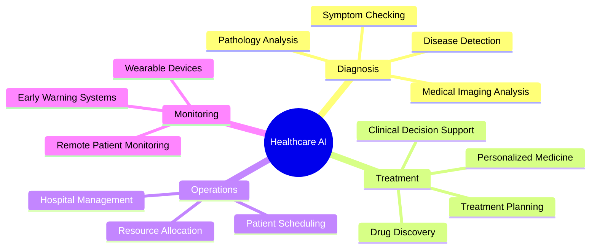

**Examples**:
- **IBM Watson Health**: Cancer diagnosis
- **Google DeepMind**: Protein folding (AlphaFold)
- **PathAI**: Pathology analysis
- **Babylon Health**: Symptom checker

### Finance

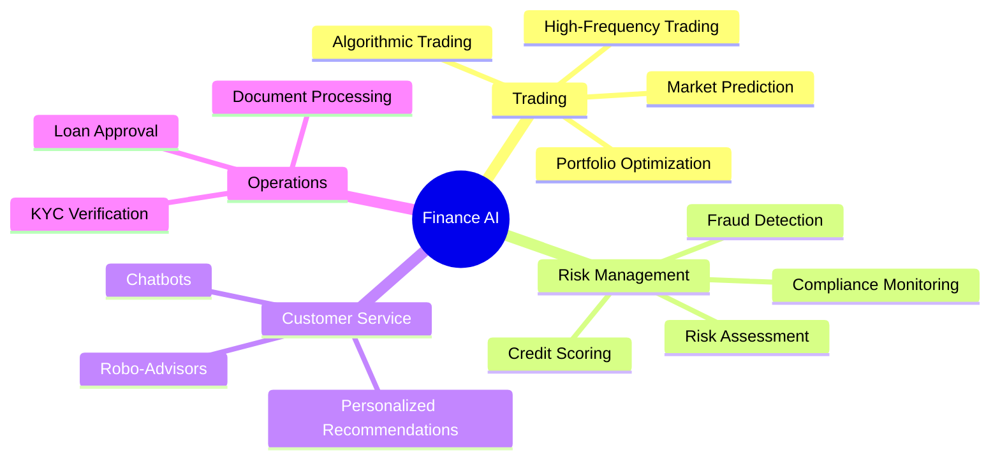

**Examples**:
- **JPMorgan COIN**: Contract analysis
- **Stripe Radar**: Fraud detection
- **Betterment**: Robo-advisory
- **Affirm**: Credit decisions

### Retail & E-commerce

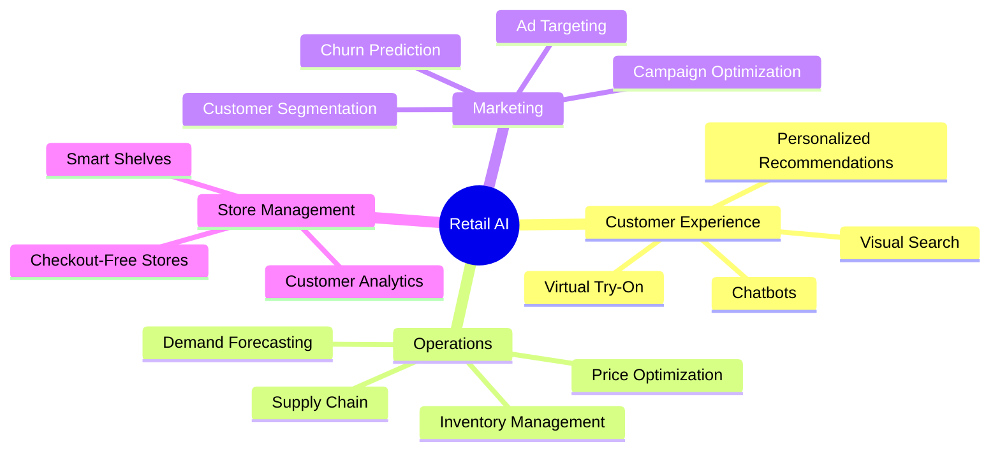

**Examples**:
- **Amazon**: Product recommendations
- **Amazon Go**: Checkout-free shopping
- **Stitch Fix**: Personal styling
- **Shopify**: E-commerce optimization

### Transportation

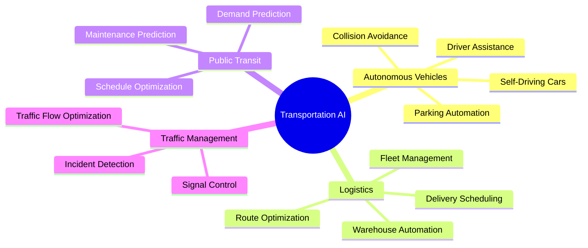

**Examples**:
- **Tesla Autopilot**: Self-driving
- **Waymo**: Autonomous taxis
- **Uber**: Route optimization
- **UPS ORION**: Delivery optimization

## 12. AI Model Types & When to Use

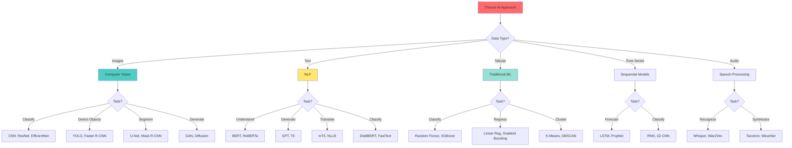

## 13. AI Project Workflow

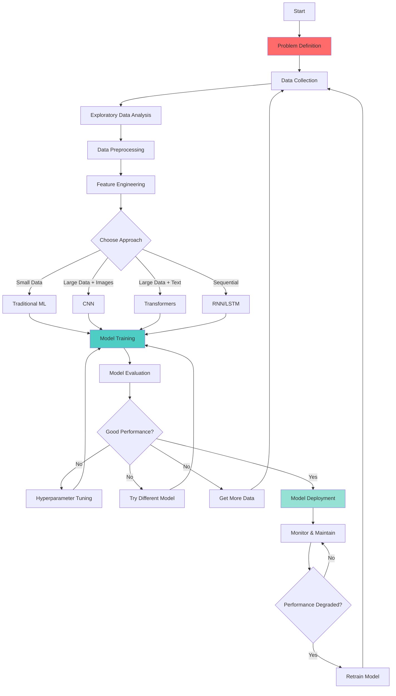

## 14. ML Algorithm Selection Guide

### Problem Type Decision Tree

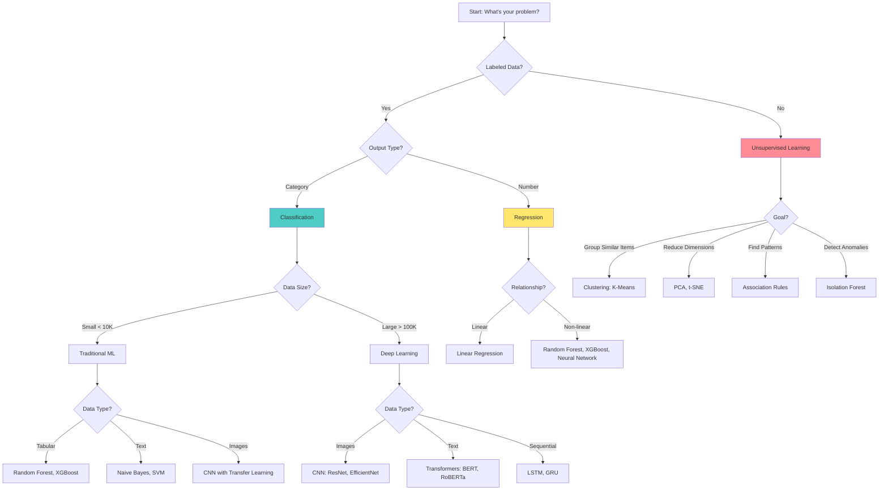

## 15. Popular AI Tools & Platforms

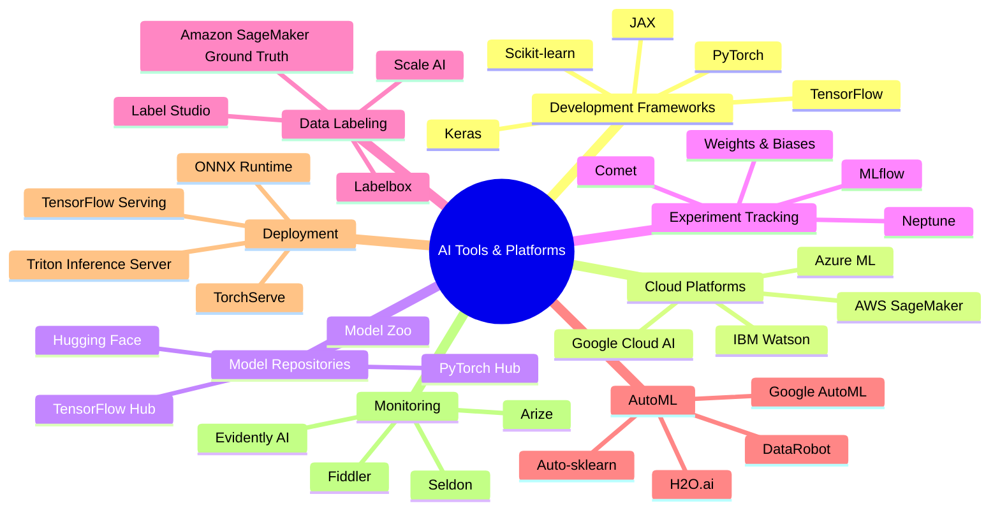

## 16. Emerging AI Trends & Future

```mermaid
graph TD
    A[Emerging AI Trends] --> B[Foundation Models]
    A --> C[Multimodal AI]
    A --> D[Edge AI]
    A --> E[Federated Learning]
    A --> F[Explainable AI]
    A --> G[AI Ethics & Safety]
    A --> H[Quantum ML]
    
    B --> B1[GPT-4, Claude]
    B --> B2[General Purpose Models]
    B --> B3[Fine-tuning for Specific Tasks]
    
    C --> C1[Text + Image + Audio]
    C --> C2[GPT-4V, Gemini]
    C --> C3[Unified Understanding]
    
    D --> D1[On-Device AI]
    D --> D2[Mobile ML]
    D --> D3[IoT Intelligence]
    
    E --> E1[Privacy-Preserving ML]
    E --> E2[Distributed Training]
    E --> E3[Healthcare Collaboration]
    
    F --> F1[Model Interpretability]
    F --> F2[LIME, SHAP]
    F --> F3[Attention Visualization]
    
    G --> G1[Bias Detection]
    G --> G2[Fairness Metrics]
    G --> G3[AI Alignment]
    
    H --> H1[Quantum Computing + ML]
    H --> H2[Speed Optimization]
    
    style A fill:#ff6b6b
```

### Future Applications (2024-2030)

```mermaid
mindmap
  root((Future AI))
    Healthcare
      AI Doctors
      Personalized Genetics
      Brain-Computer Interfaces
      Nano-robots
    Work
      AI Assistants
      Automated Programming
      Creative AI Partners
      Virtual Colleagues
    Daily Life
      Smart Homes
      Personal AI Tutors
      AI Companions
      Augmented Reality
    Transportation
      Flying Taxis
      Autonomous Everything
      Smart Cities
      Traffic Elimination
    Science
      Drug Discovery
      Climate Modeling
      Space Exploration
      Material Design
```

## 17. Data Requirements by AI Type

| AI Type | Minimum Data | Optimal Data | Data Quality | Computational Needs |
|---------|--------------|--------------|--------------|-------------------|
| **Traditional ML** | 100s-1000s samples | 10K+ samples | High quality needed | Low (CPU) |
| **Deep Learning** | 10K+ samples | 100K+ samples | Can handle noise | High (GPU) |
| **Transfer Learning** | 100s samples | 1K+ samples | High quality needed | Medium (GPU) |
| **Few-Shot Learning** | <10 samples | 10-100 samples | Very high quality | High (GPU) |
| **Zero-Shot Learning** | 0 samples | Training on related tasks | N/A | High (GPU) |
| **Reinforcement Learning** | Simulation or millions of steps | Unlimited | Generated data | Very High (GPU/TPU) |

## 18. Key Metrics by AI Task

```mermaid
graph TD
    A[AI Metrics] --> B[Classification]
    A --> C[Regression]
    A --> D[Clustering]
    A --> E[Generation]
    A --> F[Ranking]
    
    B --> B1[Accuracy]
    B --> B2[Precision/Recall]
    B --> B3[F1-Score]
    B --> B4[ROC-AUC]
    B --> B5[Confusion Matrix]
    
    C --> C1[MSE/RMSE]
    C --> C2[MAE]
    C --> C3[R² Score]
    C --> C4[MAPE]
    
    D --> D1[Silhouette Score]
    D --> D2[Davies-Bouldin Index]
    D --> D3[Calinski-Harabasz]
    
    E --> E1[Perplexity]
    E --> E2[BLEU Score]
    E --> E3[Inception Score]
    E --> E4[FID Score]
    
    F --> F1[NDCG]
    F --> F2[MAP]
    F --> F3[MRR]
    
    style A fill:#4ecdc4
```

## 19. When NOT to Use AI/ML

```mermaid
graph TD
    A[Should You Use AI?] --> B{Rules-Based Solution?}
    B -->|Yes| C[Use Traditional Programming]
    
    A --> D{Sufficient Data?}
    D -->|No| E[Collect More Data First]
    
    A --> F{Interpretability Critical?}
    F -->|Yes| G{Deep Learning Needed?}
    G -->|Yes| H[Consider: Use Explainable AI or Simpler Models]
    G -->|No| I[Use Traditional ML]
    
    A --> J{Real-Time Constraints?}
    J -->|Yes| K[Consider: Edge Computing, Model Optimization]
    
    A --> L{Cost vs Benefit?}
    L -->|High Cost, Low Benefit|