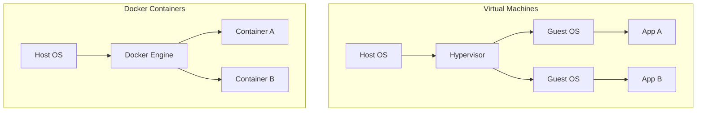
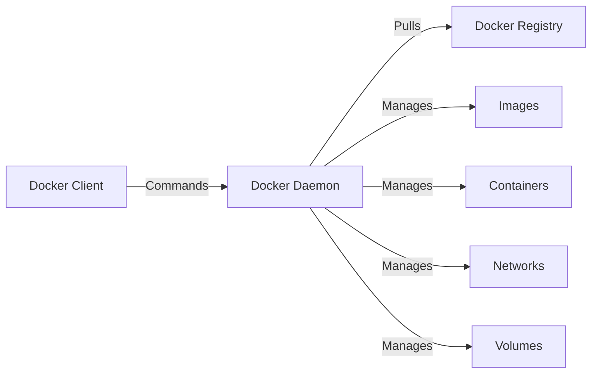
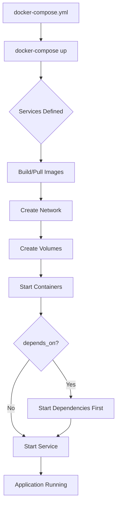
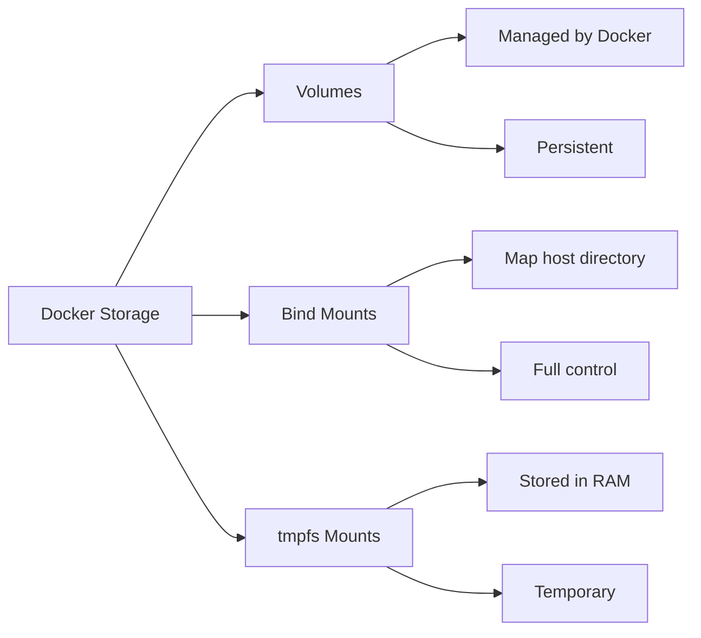
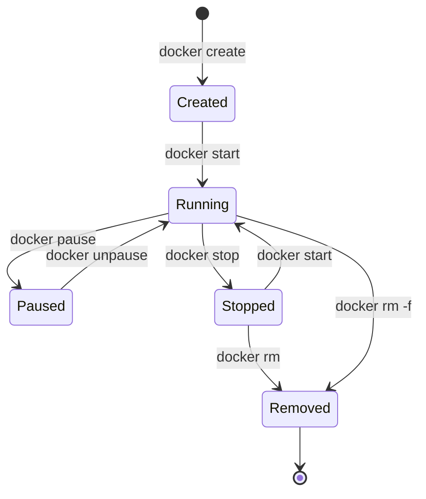

# Docker Learning Guide

## Introduction to Docker

Docker is a platform for developing, shipping, and running applications in containers. Containers package software with all dependencies, ensuring consistency across different environments.

::: info Key Benefits
- **Consistency**: Same environment everywhere (dev, test, prod)
- **Isolation**: Applications run independently
- **Lightweight**: Shares OS kernel, faster than VMs
- **Portable**: Run anywhere Docker is installed
- **Scalable**: Easy to scale applications up or down
:::

## Docker vs Virtual Machines



| Feature | Docker | Virtual Machine |
|---------|--------|-----------------|
| **Size** | MBs | GBs |
| **Startup** | Seconds | Minutes |
| **Performance** | Near native | Slower |
| **Isolation** | Process-level | Full OS |

## Installation

::: code-group
```bash [Linux]
# Ubuntu/Debian
curl -fsSL https://get.docker.com -o get-docker.sh
sudo sh get-docker.sh

# Add user to docker group
sudo usermod -aG docker $USER
```

```bash [macOS]
# Download Docker Desktop from docker.com
# Or use Homebrew
brew install --cask docker
```

```bash [Windows]
# Download Docker Desktop from docker.com
# Requires WSL 2 backend
```
:::

**Verify Installation:**
```bash
docker --version
docker run hello-world
```

## Core Concepts

### Docker Architecture



::: tip Key Components
- **Docker Client**: CLI tool (`docker` command)
- **Docker Daemon**: Background service that manages containers
- **Docker Registry**: Repository for images (Docker Hub)
- **Docker Image**: Read-only template for containers
- **Docker Container**: Running instance of an image
:::

## Working with Images

### Finding Images

```bash
# Search Docker Hub
docker search nginx

# Pull an image
docker pull nginx
docker pull nginx:1.21  # Specific version

# List local images
docker images
docker image ls
```

### Managing Images

```bash
# Remove an image
docker rmi nginx
docker rmi <image-id>

# Remove unused images
docker image prune

# View image details
docker inspect nginx

# Tag an image
docker tag nginx:latest myapp:v1.0

# Save/load images
docker save nginx > nginx.tar
docker load < nginx.tar
```

## Working with Containers

### Running Containers

```bash
# Basic run
docker run nginx

# Run in detached mode
docker run -d nginx

# Run with name
docker run -d --name my-nginx nginx

# Run with port mapping
docker run -d -p 8080:80 nginx

# Run with environment variables
docker run -d -e MYSQL_ROOT_PASSWORD=secret mysql

# Run with volume
docker run -d -v /host/path:/container/path nginx

# Interactive terminal
docker run -it ubuntu /bin/bash

# Remove container after exit
docker run --rm ubuntu echo "Hello"
```

::: warning Port Mapping
`-p HOST_PORT:CONTAINER_PORT`
Example: `-p 8080:80` maps container port 80 to host port 8080
:::

### Managing Containers

```bash
# List running containers
docker ps

# List all containers (including stopped)
docker ps -a

# Stop a container
docker stop my-nginx
docker stop <container-id>

# Start a stopped container
docker start my-nginx

# Restart a container
docker restart my-nginx

# Remove a container
docker rm my-nginx

# Remove a running container (force)
docker rm -f my-nginx

# Remove all stopped containers
docker container prune
```

### Inspecting Containers

```bash
# View logs
docker logs my-nginx
docker logs -f my-nginx  # Follow logs

# View container details
docker inspect my-nginx

# View resource usage
docker stats my-nginx

# Execute command in running container
docker exec my-nginx ls /usr/share/nginx/html

# Interactive shell
docker exec -it my-nginx /bin/bash

# Copy files to/from container
docker cp file.txt my-nginx:/path/
docker cp my-nginx:/path/file.txt ./
```

## Dockerfile

### Creating a Dockerfile

A Dockerfile is a text file with instructions to build a Docker image.

```dockerfile
# Base image
FROM node:18-alpine

# Set working directory
WORKDIR /app

# Copy package files
COPY package*.json ./

# Install dependencies
RUN npm install

# Copy application files
COPY . .

# Expose port
EXPOSE 3000

# Set environment variable
ENV NODE_ENV=production

# Define startup command
CMD ["node", "app.js"]
```

### Dockerfile Instructions

| Instruction | Description | Example |
|-------------|-------------|---------|
| `FROM` | Base image | `FROM ubuntu:22.04` |
| `WORKDIR` | Set working directory | `WORKDIR /app` |
| `COPY` | Copy files | `COPY . .` |
| `ADD` | Copy files (with URL/tar support) | `ADD file.tar.gz /app/` |
| `RUN` | Execute commands | `RUN apt-get update` |
| `CMD` | Default command | `CMD ["python", "app.py"]` |
| `ENTRYPOINT` | Configure executable | `ENTRYPOINT ["nginx"]` |
| `EXPOSE` | Document port | `EXPOSE 8080` |
| `ENV` | Set environment variable | `ENV PORT=3000` |
| `ARG` | Build-time variable | `ARG VERSION=1.0` |
| `VOLUME` | Create mount point | `VOLUME /data` |
| `USER` | Set user | `USER appuser` |
| `LABEL` | Add metadata | `LABEL version="1.0"` |

### Building Images

```bash
# Build image
docker build -t myapp:1.0 .

# Build with build arguments
docker build --build-arg VERSION=1.0 -t myapp .

# Build without cache
docker build --no-cache -t myapp .

# Build from specific Dockerfile
docker build -f Dockerfile.prod -t myapp .

# View build history
docker history myapp
```

::: tip Best Practices
- Use specific base image versions
- Minimize layers by combining RUN commands
- Use `.dockerignore` to exclude files
- Order instructions from least to most frequently changing
- Use multi-stage builds for smaller images
:::

### Multi-Stage Builds

```dockerfile
# Build stage
FROM node:18 AS builder
WORKDIR /app
COPY package*.json ./
RUN npm install
COPY . .
RUN npm run build

# Production stage
FROM node:18-alpine
WORKDIR /app
COPY --from=builder /app/dist ./dist
COPY --from=builder /app/node_modules ./node_modules
CMD ["node", "dist/index.js"]
```

## Docker Compose

Docker Compose is a tool for defining and running multi-container applications.

### docker-compose.yml

```yaml
version: '3.8'

services:
  web:
    build: .
    ports:
      - "3000:3000"
    environment:
      - NODE_ENV=production
      - DB_HOST=db
    depends_on:
      - db
    volumes:
      - ./src:/app/src
    networks:
      - app-network

  db:
    image: postgres:15
    environment:
      - POSTGRES_USER=admin
      - POSTGRES_PASSWORD=secret
      - POSTGRES_DB=myapp
    volumes:
      - db-data:/var/lib/postgresql/data
    networks:
      - app-network

  redis:
    image: redis:7-alpine
    networks:
      - app-network

volumes:
  db-data:

networks:
  app-network:
    driver: bridge
```

### Docker Compose Commands

```bash
# Start services
docker-compose up
docker-compose up -d  # Detached mode

# Stop services
docker-compose down

# Stop and remove volumes
docker-compose down -v

# View logs
docker-compose logs
docker-compose logs -f web

# List running services
docker-compose ps

# Execute command in service
docker-compose exec web bash

# Build/rebuild services
docker-compose build
docker-compose up --build

# Scale services
docker-compose up -d --scale web=3

# View config
docker-compose config
```

## Docker Compose Application Flow



## Volumes

Volumes persist data generated and used by containers.

### Types of Volumes



### Volume Commands

```bash
# Create volume
docker volume create my-volume

# List volumes
docker volume ls

# Inspect volume
docker volume inspect my-volume

# Remove volume
docker volume rm my-volume

# Remove unused volumes
docker volume prune

# Use volume in container
docker run -d -v my-volume:/data nginx

# Bind mount
docker run -d -v /host/path:/container/path nginx

# Read-only volume
docker run -d -v my-volume:/data:ro nginx
```

::: warning Volume Persistence
Volumes persist even after containers are deleted. Use `docker-compose down -v` to remove volumes.
:::

## Networks

Docker networking allows containers to communicate.

### Network Types

```bash
# Bridge (default) - Containers on same host
docker network create --driver bridge my-bridge

# Host - Use host network directly
docker run --network host nginx

# None - No network
docker run --network none nginx

# Overlay - Multi-host networking (Swarm)
docker network create --driver overlay my-overlay
```

### Network Commands

```bash
# List networks
docker network ls

# Inspect network
docker network inspect bridge

# Create network
docker network create my-network

# Connect container to network
docker network connect my-network my-container

# Disconnect from network
docker network disconnect my-network my-container

# Remove network
docker network rm my-network

# Run container on specific network
docker run -d --network my-network nginx
```

### Container Communication

```bash
# Containers on same network can communicate by name
docker network create app-net
docker run -d --name db --network app-net postgres
docker run -d --name web --network app-net nginx

# Web container can access db via: db:5432
```

## Common Use Cases

### Web Application with Database

```yaml
version: '3.8'

services:
  app:
    build: .
    ports:
      - "3000:3000"
    environment:
      - DATABASE_URL=postgresql://db:5432/myapp
    depends_on:
      - db

  db:
    image: postgres:15
    environment:
      POSTGRES_DB: myapp
      POSTGRES_PASSWORD: secret
    volumes:
      - postgres-data:/var/lib/postgresql/data

volumes:
  postgres-data:
```

### Development Environment

```yaml
version: '3.8'

services:
  dev:
    build:
      context: .
      dockerfile: Dockerfile.dev
    volumes:
      - .:/app
      - /app/node_modules
    ports:
      - "3000:3000"
    environment:
      - NODE_ENV=development
    command: npm run dev
```

### Nginx Reverse Proxy

```dockerfile
FROM nginx:alpine

COPY nginx.conf /etc/nginx/nginx.conf
COPY html /usr/share/nginx/html

EXPOSE 80

CMD ["nginx", "-g", "daemon off;"]
```

## Docker Lifecycle



## Best Practices

::: tip Image Optimization
1. **Use minimal base images**: `alpine`, `slim` variants
2. **Multi-stage builds**: Reduce final image size
3. **Combine RUN commands**: Reduce layers
4. **Clean up in same layer**: Remove cache after install
5. **Use .dockerignore**: Exclude unnecessary files
:::

```dockerfile
# Bad - Multiple layers
RUN apt-get update
RUN apt-get install -y python3
RUN apt-get clean

# Good - Single layer with cleanup
RUN apt-get update && \
    apt-get install -y python3 && \
    apt-get clean && \
    rm -rf /var/lib/apt/lists/*
```

::: warning Security Best Practices
- Don't run containers as root
- Use specific image versions, not `latest`
- Scan images for vulnerabilities
- Keep base images updated
- Don't store secrets in images
- Use secrets management for sensitive data
:::

```dockerfile
# Run as non-root user
FROM node:18-alpine
RUN addgroup -g 1001 -S appuser && \
    adduser -u 1001 -S appuser -G appuser
USER appuser
WORKDIR /home/appuser/app
```

## Environment Variables

```bash
# Pass environment variables
docker run -e VAR1=value1 -e VAR2=value2 myapp

# From file
docker run --env-file .env myapp

# In docker-compose.yml
services:
  app:
    environment:
      - NODE_ENV=production
    env_file:
      - .env
```

## Docker Registry

### Docker Hub

```bash
# Login to Docker Hub
docker login

# Tag image for registry
docker tag myapp:latest username/myapp:latest

# Push to Docker Hub
docker push username/myapp:latest

# Pull from Docker Hub
docker pull username/myapp:latest

# Logout
docker logout
```

### Private Registry

```bash
# Run private registry
docker run -d -p 5000:5000 --name registry registry:2

# Tag for private registry
docker tag myapp:latest localhost:5000/myapp:latest

# Push to private registry
docker push localhost:5000/myapp:latest

# Pull from private registry
docker pull localhost:5000/myapp:latest
```

## Cleanup Commands

```bash
# Remove all stopped containers
docker container prune

# Remove all unused images
docker image prune -a

# Remove all unused volumes
docker volume prune

# Remove all unused networks
docker network prune

# Remove everything
docker system prune -a --volumes

# View disk usage
docker system df
```

## Debugging and Troubleshooting

```bash
# View container logs
docker logs -f container-name

# Inspect container
docker inspect container-name

# Check container processes
docker top container-name

# Monitor resource usage
docker stats

# View events
docker events

# Execute shell in running container
docker exec -it container-name sh

# Check container health
docker inspect --format='{{.State.Health.Status}}' container-name
```

::: details Health Checks
```dockerfile
FROM nginx:alpine

HEALTHCHECK --interval=30s --timeout=3s \
  CMD wget --quiet --tries=1 --spider http://localhost/ || exit 1
```
:::

## Quick Reference Cheat Sheet

### Essential Commands

| Command | Description |
|---------|-------------|
| `docker run` | Create and start container |
| `docker ps` | List containers |
| `docker images` | List images |
| `docker build` | Build image from Dockerfile |
| `docker pull` | Download image |
| `docker push` | Upload image |
| `docker stop` | Stop container |
| `docker rm` | Remove container |
| `docker rmi` | Remove image |
| `docker logs` | View container logs |
| `docker exec` | Execute command in container |

### Common Flags

| Flag | Description |
|------|-------------|
| `-d` | Detached mode |
| `-it` | Interactive terminal |
| `-p` | Port mapping |
| `-v` | Volume mounting |
| `-e` | Environment variable |
| `--name` | Container name |
| `--rm` | Auto-remove on exit |
| `-f` | Force |
| `--network` | Connect to network |

## Example: Complete Application

**Dockerfile:**
```dockerfile
FROM node:18-alpine AS build
WORKDIR /app
COPY package*.json ./
RUN npm ci
COPY . .
RUN npm run build

FROM node:18-alpine
WORKDIR /app
RUN addgroup -g 1001 appuser && \
    adduser -u 1001 -S appuser -G appuser
COPY --from=build --chown=appuser:appuser /app/dist ./dist
COPY --from=build --chown=appuser:appuser /app/node_modules ./node_modules
COPY --chown=appuser:appuser package*.json ./
USER appuser
EXPOSE 3000
HEALTHCHECK --interval=30s --timeout=3s \
  CMD wget --quiet --tries=1 --spider http://localhost:3000/health || exit 1
CMD ["node", "dist/index.js"]
```

**docker-compose.yml:**
```yaml
version: '3.8'

services:
  app:
    build: .
    ports:
      - "3000:3000"
    environment:
      - DATABASE_URL=postgresql://postgres:secret@db:5432/myapp
      - REDIS_URL=redis://redis:6379
    depends_on:
      - db
      - redis
    restart: unless-stopped

  db:
    image: postgres:15-alpine
    environment:
      POSTGRES_DB: myapp
      POSTGRES_PASSWORD: secret
    volumes:
      - db-data:/var/lib/postgresql/data
    restart: unless-stopped

  redis:
    image: redis:7-alpine
    restart: unless-stopped

volumes:
  db-data:
```

**.dockerignore:**
```
node_modules
npm-debug.log
.git
.env
*.md
.dockerignore
Dockerfile
docker-compose.yml
```

---

**Happy Containerizing! 🐳**