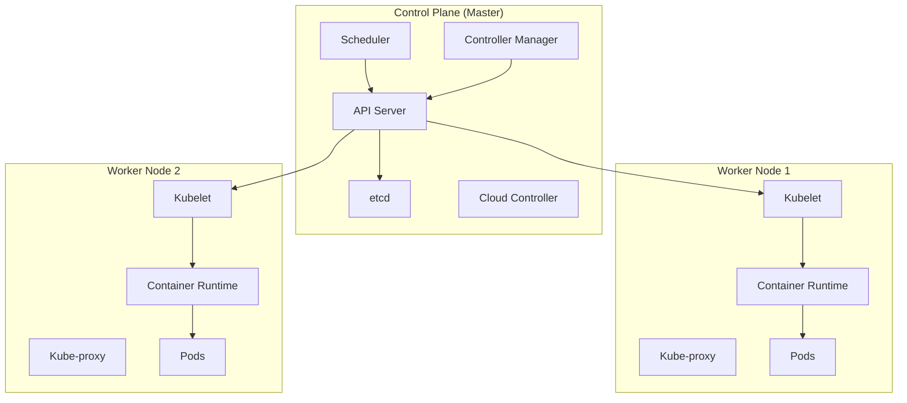
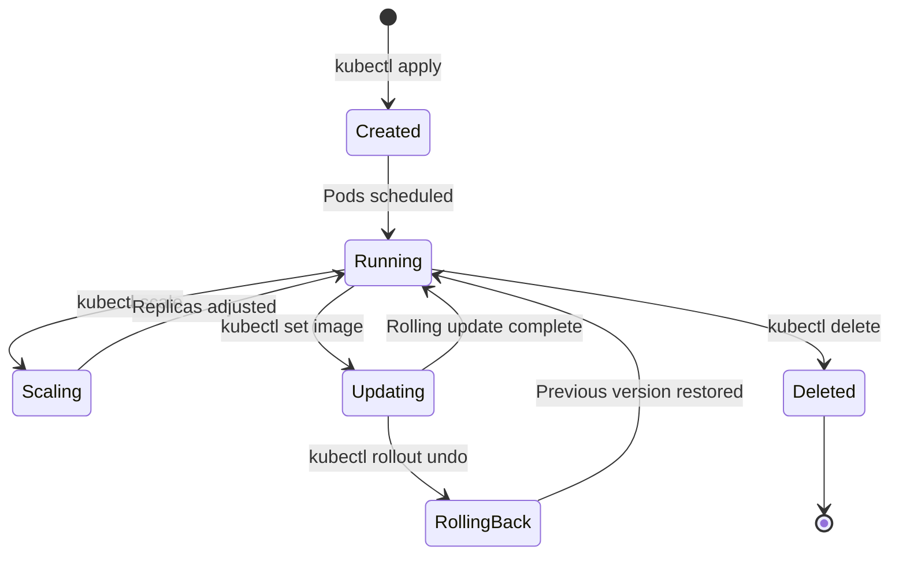
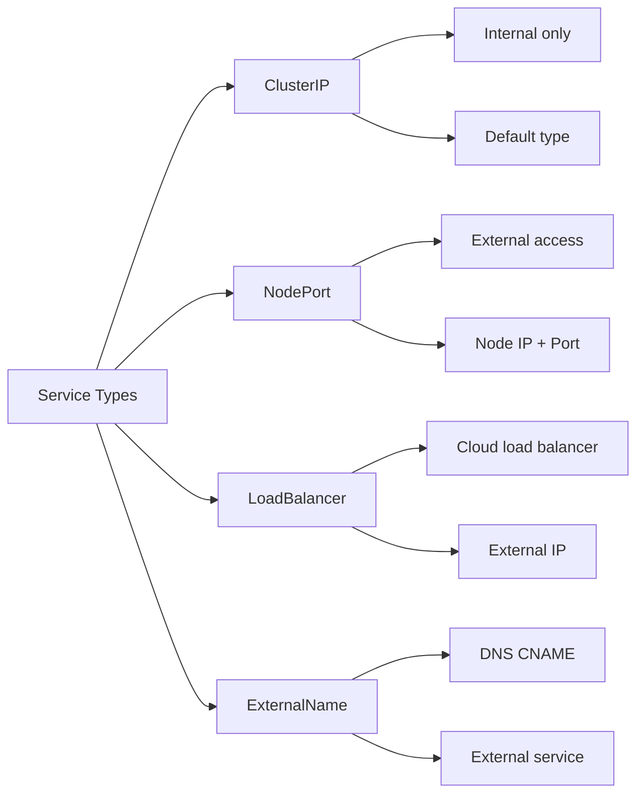
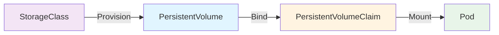

# Kubernetes Learning Guide

## Introduction to Kubernetes

Kubernetes (K8s) is an open-source container orchestration platform that automates deployment, scaling, and management of containerized applications.

::: info Key Features
- **Automated Deployment**: Deploy containers across clusters
- **Self-Healing**: Automatically restarts failed containers
- **Auto-Scaling**: Scale applications based on demand
- **Load Balancing**: Distribute traffic across containers
- **Rolling Updates**: Zero-downtime deployments
- **Service Discovery**: Automatic DNS and networking
:::

## Why Kubernetes?

| Challenge | Kubernetes Solution |
|-----------|-------------------|
| Manual container management | Automated orchestration |
| Scaling issues | Horizontal auto-scaling |
| Downtime during updates | Rolling updates & rollbacks |
| Resource inefficiency | Optimal resource allocation |
| Service discovery | Built-in DNS & service mesh |

## Kubernetes Architecture



### Control Plane Components

::: tip Master Node Components
- **API Server**: Entry point for all REST commands
- **etcd**: Distributed key-value store for cluster data
- **Scheduler**: Assigns pods to nodes
- **Controller Manager**: Maintains desired cluster state
- **Cloud Controller Manager**: Integrates with cloud providers
:::

### Worker Node Components

::: tip Node Components
- **Kubelet**: Agent that runs on each node
- **Kube-proxy**: Network proxy for services
- **Container Runtime**: Docker, containerd, CRI-O
- **Pods**: Smallest deployable units
:::

## Installation

### Minikube (Local Development)

::: code-group
```bash [Linux]
# Install Minikube
curl -LO https://storage.googleapis.com/minikube/releases/latest/minikube-linux-amd64
sudo install minikube-linux-amd64 /usr/local/bin/minikube

# Start cluster
minikube start
```

```bash [macOS]
# Using Homebrew
brew install minikube

# Start cluster
minikube start
```

```bash [Windows]
# Using Chocolatey
choco install minikube

# Start cluster
minikube start
```
:::

### kubectl (Kubernetes CLI)

```bash
# Install kubectl
curl -LO "https://dl.k8s.io/release/$(curl -L -s https://dl.k8s.io/release/stable.txt)/bin/linux/amd64/kubectl"
sudo install -o root -g root -m 0755 kubectl /usr/local/bin/kubectl

# Verify installation
kubectl version --client

# Check cluster info
kubectl cluster-info
```

### Production Cluster Options

| Option | Description |
|--------|-------------|
| **kubeadm** | Bootstrap production clusters |
| **kops** | Production-grade K8s on AWS |
| **EKS** | Amazon Elastic Kubernetes Service |
| **GKE** | Google Kubernetes Engine |
| **AKS** | Azure Kubernetes Service |
| **OpenShift** | Red Hat's Kubernetes platform |

## Core Concepts

### Pods

Pods are the smallest deployable units in Kubernetes. A pod can contain one or more containers.

```yaml
apiVersion: v1
kind: Pod
metadata:
  name: nginx-pod
  labels:
    app: nginx
spec:
  containers:
  - name: nginx
    image: nginx:1.21
    ports:
    - containerPort: 80
```

```bash
# Create pod
kubectl apply -f pod.yaml

# List pods
kubectl get pods

# Describe pod
kubectl describe pod nginx-pod

# View logs
kubectl logs nginx-pod

# Execute command in pod
kubectl exec -it nginx-pod -- /bin/bash

# Delete pod
kubectl delete pod nginx-pod
```

### ReplicaSets

ReplicaSets ensure a specified number of pod replicas are running.

```yaml
apiVersion: apps/v1
kind: ReplicaSet
metadata:
  name: nginx-replicaset
spec:
  replicas: 3
  selector:
    matchLabels:
      app: nginx
  template:
    metadata:
      labels:
        app: nginx
    spec:
      containers:
      - name: nginx
        image: nginx:1.21
        ports:
        - containerPort: 80
```

::: warning Direct Use
ReplicaSets are rarely used directly. Use Deployments instead for better management.
:::

### Deployments

Deployments provide declarative updates for Pods and ReplicaSets.

```yaml
apiVersion: apps/v1
kind: Deployment
metadata:
  name: nginx-deployment
  labels:
    app: nginx
spec:
  replicas: 3
  selector:
    matchLabels:
      app: nginx
  template:
    metadata:
      labels:
        app: nginx
    spec:
      containers:
      - name: nginx
        image: nginx:1.21
        ports:
        - containerPort: 80
        resources:
          requests:
            memory: "64Mi"
            cpu: "250m"
          limits:
            memory: "128Mi"
            cpu: "500m"
```

```bash
# Create deployment
kubectl apply -f deployment.yaml

# List deployments
kubectl get deployments

# Scale deployment
kubectl scale deployment nginx-deployment --replicas=5

# Update image
kubectl set image deployment/nginx-deployment nginx=nginx:1.22

# Rollout status
kubectl rollout status deployment/nginx-deployment

# Rollout history
kubectl rollout history deployment/nginx-deployment

# Rollback
kubectl rollout undo deployment/nginx-deployment

# Delete deployment
kubectl delete deployment nginx-deployment
```

## Deployment Lifecycle



### Services

Services expose applications running on pods to the network.

```yaml
apiVersion: v1
kind: Service
metadata:
  name: nginx-service
spec:
  type: LoadBalancer
  selector:
    app: nginx
  ports:
  - protocol: TCP
    port: 80
    targetPort: 80
```

### Service Types



**ClusterIP (Default):**
```yaml
apiVersion: v1
kind: Service
metadata:
  name: my-service
spec:
  type: ClusterIP
  selector:
    app: myapp
  ports:
  - port: 80
    targetPort: 8080
```

**NodePort:**
```yaml
apiVersion: v1
kind: Service
metadata:
  name: my-nodeport-service
spec:
  type: NodePort
  selector:
    app: myapp
  ports:
  - port: 80
    targetPort: 8080
    nodePort: 30007  # Optional: 30000-32767
```

**LoadBalancer:**
```yaml
apiVersion: v1
kind: Service
metadata:
  name: my-loadbalancer
spec:
  type: LoadBalancer
  selector:
    app: myapp
  ports:
  - port: 80
    targetPort: 8080
```

```bash
# Create service
kubectl apply -f service.yaml

# List services
kubectl get services
kubectl get svc

# Describe service
kubectl describe service nginx-service

# Get service endpoints
kubectl get endpoints nginx-service

# Delete service
kubectl delete service nginx-service
```

### Namespaces

Namespaces provide isolation for resources in a cluster.

```yaml
apiVersion: v1
kind: Namespace
metadata:
  name: development
```

```bash
# List namespaces
kubectl get namespaces
kubectl get ns

# Create namespace
kubectl create namespace development

# Set default namespace
kubectl config set-context --current --namespace=development

# List resources in namespace
kubectl get pods -n development

# List all resources across namespaces
kubectl get pods --all-namespaces
kubectl get pods -A

# Delete namespace
kubectl delete namespace development
```

::: tip Default Namespaces
- `default`: Default namespace for resources
- `kube-system`: System components
- `kube-public`: Publicly readable resources
- `kube-node-lease`: Node heartbeat data
:::

## ConfigMaps and Secrets

### ConfigMaps

Store non-sensitive configuration data.

```yaml
apiVersion: v1
kind: ConfigMap
metadata:
  name: app-config
data:
  database_host: "db.example.com"
  database_port: "5432"
  app_mode: "production"
```

**Using ConfigMap in Pod:**
```yaml
apiVersion: v1
kind: Pod
metadata:
  name: myapp-pod
spec:
  containers:
  - name: myapp
    image: myapp:latest
    env:
    - name: DATABASE_HOST
      valueFrom:
        configMapKeyRef:
          name: app-config
          key: database_host
    volumeMounts:
    - name: config-volume
      mountPath: /etc/config
  volumes:
  - name: config-volume
    configMap:
      name: app-config
```

```bash
# Create from file
kubectl create configmap app-config --from-file=config.properties

# Create from literal
kubectl create configmap app-config --from-literal=key1=value1

# List ConfigMaps
kubectl get configmaps
kubectl get cm

# View ConfigMap
kubectl describe configmap app-config
```

### Secrets

Store sensitive data like passwords and tokens.

```yaml
apiVersion: v1
kind: Secret
metadata:
  name: db-secret
type: Opaque
data:
  username: YWRtaW4=  # base64 encoded
  password: cGFzc3dvcmQ=  # base64 encoded
```

```bash
# Create secret
kubectl create secret generic db-secret \
  --from-literal=username=admin \
  --from-literal=password=password

# Create from file
kubectl create secret generic tls-secret \
  --from-file=tls.crt --from-file=tls.key

# List secrets
kubectl get secrets

# View secret (values hidden)
kubectl describe secret db-secret

# Decode secret
kubectl get secret db-secret -o jsonpath='{.data.password}' | base64 -d
```

**Using Secret in Pod:**
```yaml
apiVersion: v1
kind: Pod
metadata:
  name: myapp-pod
spec:
  containers:
  - name: myapp
    image: myapp:latest
    env:
    - name: DB_USERNAME
      valueFrom:
        secretKeyRef:
          name: db-secret
          key: username
    - name: DB_PASSWORD
      valueFrom:
        secretKeyRef:
          name: db-secret
          key: password
```

::: danger Security Warning
Secrets are base64 encoded, NOT encrypted. Use external secret management solutions like Vault for production.
:::

## Volumes

### Volume Types

| Type | Description | Use Case |
|------|-------------|----------|
| **emptyDir** | Temporary, deleted with pod | Scratch space |
| **hostPath** | Mount from host filesystem | Testing only |
| **persistentVolumeClaim** | Abstract storage | Production data |
| **configMap** | Inject config files | Configuration |
| **secret** | Inject sensitive data | Credentials |
| **nfs** | Network File System | Shared storage |

### Persistent Volumes (PV)

```yaml
apiVersion: v1
kind: PersistentVolume
metadata:
  name: pv-storage
spec:
  capacity:
    storage: 10Gi
  accessModes:
  - ReadWriteOnce
  persistentVolumeReclaimPolicy: Retain
  storageClassName: standard
  hostPath:
    path: /mnt/data
```

### Persistent Volume Claims (PVC)

```yaml
apiVersion: v1
kind: PersistentVolumeClaim
metadata:
  name: pvc-storage
spec:
  accessModes:
  - ReadWriteOnce
  resources:
    requests:
      storage: 5Gi
  storageClassName: standard
```

### Using PVC in Pod

```yaml
apiVersion: v1
kind: Pod
metadata:
  name: pod-with-pvc
spec:
  containers:
  - name: app
    image: nginx
    volumeMounts:
    - name: storage
      mountPath: /usr/share/nginx/html
  volumes:
  - name: storage
    persistentVolumeClaim:
      claimName: pvc-storage
```

```bash
# List PVs
kubectl get pv

# List PVCs
kubectl get pvc

# Describe PVC
kubectl describe pvc pvc-storage
```

## Storage Workflow



## StatefulSets

For stateful applications requiring stable network identities and persistent storage.

```yaml
apiVersion: apps/v1
kind: StatefulSet
metadata:
  name: mysql
spec:
  serviceName: mysql
  replicas: 3
  selector:
    matchLabels:
      app: mysql
  template:
    metadata:
      labels:
        app: mysql
    spec:
      containers:
      - name: mysql
        image: mysql:8.0
        ports:
        - containerPort: 3306
        volumeMounts:
        - name: data
          mountPath: /var/lib/mysql
        env:
        - name: MYSQL_ROOT_PASSWORD
          valueFrom:
            secretKeyRef:
              name: mysql-secret
              key: password
  volumeClaimTemplates:
  - metadata:
      name: data
    spec:
      accessModes: [ "ReadWriteOnce" ]
      resources:
        requests:
          storage: 10Gi
```

::: tip StatefulSet vs Deployment
- **StatefulSet**: Ordered, stable pod identities (mysql-0, mysql-1)
- **Deployment**: Interchangeable pod replicas
:::

## DaemonSets

Ensures a pod runs on all (or selected) nodes.

```yaml
apiVersion: apps/v1
kind: DaemonSet
metadata:
  name: fluentd
spec:
  selector:
    matchLabels:
      app: fluentd
  template:
    metadata:
      labels:
        app: fluentd
    spec:
      containers:
      - name: fluentd
        image: fluentd:latest
        resources:
          limits:
            memory: 200Mi
          requests:
            cpu: 100m
            memory: 200Mi
```

::: info Common DaemonSet Use Cases
- Log collection (Fluentd, Logstash)
- Monitoring agents (Prometheus Node Exporter)
- Network plugins (Calico, Weave)
:::

## Jobs and CronJobs

### Jobs

Run pods to completion.

```yaml
apiVersion: batch/v1
kind: Job
metadata:
  name: batch-job
spec:
  completions: 5
  parallelism: 2
  template:
    spec:
      containers:
      - name: worker
        image: busybox
        command: ["echo", "Processing batch job"]
      restartPolicy: Never
  backoffLimit: 4
```

### CronJobs

Schedule jobs at specific times.

```yaml
apiVersion: batch/v1
kind: CronJob
metadata:
  name: backup-job
spec:
  schedule: "0 2 * * *"  # Daily at 2 AM
  jobTemplate:
    spec:
      template:
        spec:
          containers:
          - name: backup
            image: backup-tool:latest
            command: ["/bin/sh", "-c", "backup.sh"]
          restartPolicy: OnFailure
```

```bash
# List jobs
kubectl get jobs

# List cronjobs
kubectl get cronjobs

# Trigger cronjob manually
kubectl create job --from=cronjob/backup-job manual-backup
```

## Ingress

Manages external access to services, typically HTTP/HTTPS.

```yaml
apiVersion: networking.k8s.io/v1
kind: Ingress
metadata:
  name: app-ingress
  annotations:
    nginx.ingress.kubernetes.io/rewrite-target: /
spec:
  ingressClassName: nginx
  rules:
  - host: myapp.example.com
    http:
      paths:
      - path: /
        pathType: Prefix
        backend:
          service:
            name: app-service
            port:
              number: 80
      - path: /api
        pathType: Prefix
        backend:
          service:
            name: api-service
            port:
              number: 8080
  tls:
  - hosts:
    - myapp.example.com
    secretName: tls-secret
```

### Ingress Controller

```bash
# Install Nginx Ingress Controller
kubectl apply -f https://raw.githubusercontent.com/kubernetes/ingress-nginx/controller-v1.8.1/deploy/static/provider/cloud/deploy.yaml

# List ingress
kubectl get ingress

# Describe ingress
kubectl describe ingress app-ingress
```

## Resource Management

### Resource Requests and Limits

```yaml
apiVersion: v1
kind: Pod
metadata:
  name: resource-pod
spec:
  containers:
  - name: app
    image: myapp:latest
    resources:
      requests:
        memory: "64Mi"
        cpu: "250m"
      limits:
        memory: "128Mi"
        cpu: "500m"
```

::: tip Resource Units
- **CPU**: 1000m = 1 CPU core
- **Memory**: Mi (Mebibyte), Gi (Gibibyte)
- **Requests**: Minimum guaranteed resources
- **Limits**: Maximum allowed resources
:::

### Horizontal Pod Autoscaler (HPA)

```yaml
apiVersion: autoscaling/v2
kind: HorizontalPodAutoscaler
metadata:
  name: app-hpa
spec:
  scaleTargetRef:
    apiVersion: apps/v1
    kind: Deployment
    name: app-deployment
  minReplicas: 2
  maxReplicas: 10
  metrics:
  - type: Resource
    resource:
      name: cpu
      target:
        type: Utilization
        averageUtilization: 70
```

```bash
# Create HPA
kubectl autoscale deployment app-deployment --cpu-percent=70 --min=2 --max=10

# List HPAs
kubectl get hpa

# Watch HPA
kubectl get hpa -w
```

## Health Checks

### Liveness Probe

Determines if container should be restarted.

```yaml
apiVersion: v1
kind: Pod
metadata:
  name: health-check-pod
spec:
  containers:
  - name: app
    image: myapp:latest
    livenessProbe:
      httpGet:
        path: /health
        port: 8080
      initialDelaySeconds: 30
      periodSeconds: 10
      timeoutSeconds: 5
      failureThreshold: 3
```

### Readiness Probe

Determines if pod is ready to receive traffic.

```yaml
apiVersion: v1
kind: Pod
metadata:
  name: readiness-pod
spec:
  containers:
  - name: app
    image: myapp:latest
    readinessProbe:
      httpGet:
        path: /ready
        port: 8080
      initialDelaySeconds: 10
      periodSeconds: 5
```

### Startup Probe

For slow-starting containers.

```yaml
startupProbe:
  httpGet:
    path: /startup
    port: 8080
  failureThreshold: 30
  periodSeconds: 10
```

::: info Probe Types
- **HTTP GET**: Check HTTP endpoint
- **TCP Socket**: Check if port is open
- **Exec**: Execute command in container
:::

## Kubectl Commands Reference

### Basic Commands

```bash
# Get resources
kubectl get <resource>
kubectl get pods
kubectl get deployments
kubectl get services
kubectl get all

# Describe resource
kubectl describe <resource> <name>
kubectl describe pod nginx-pod

# Create resource
kubectl create -f file.yaml
kubectl apply -f file.yaml

# Delete resource
kubectl delete <resource> <name>
kubectl delete -f file.yaml

# Edit resource
kubectl edit <resource> <name>
```

### Advanced Commands

```bash
# Logs
kubectl logs <pod-name>
kubectl logs -f <pod-name>  # Follow
kubectl logs <pod-name> -c <container-name>  # Multi-container

# Execute commands
kubectl exec <pod-name> -- <command>
kubectl exec -it <pod-name> -- /bin/bash

# Port forwarding
kubectl port-forward <pod-name> 8080:80

# Copy files
kubectl cp <pod-name>:/path/file ./file
kubectl cp ./file <pod-name>:/path/file

# Resource usage
kubectl top nodes
kubectl top pods

# Debugging
kubectl debug <pod-name> -it --image=busybox
```

### Context and Configuration

```bash
# View contexts
kubectl config get-contexts

# Switch context
kubectl config use-context <context-name>

# View current config
kubectl config view

# Set namespace
kubectl config set-context --current --namespace=<namespace>
```

## Labels and Selectors

```yaml
apiVersion: v1
kind: Pod
metadata:
  name: labeled-pod
  labels:
    app: myapp
    environment: production
    tier: frontend
spec:
  containers:
  - name: nginx
    image: nginx
```

```bash
# Filter by label
kubectl get pods -l app=myapp
kubectl get pods -l environment=production,tier=frontend

# Filter by multiple labels
kubectl get pods -l 'app in (myapp, otherapp)'
kubectl get pods -l 'environment!=production'

# Show labels
kubectl get pods --show-labels

# Add label
kubectl label pod nginx-pod version=v1

# Remove label
kubectl label pod nginx-pod version-
```

## Complete Application Example

**namespace.yaml:**
```yaml
apiVersion: v1
kind: Namespace
metadata:
  name: myapp
```

**deployment.yaml:**
```yaml
apiVersion: apps/v1
kind: Deployment
metadata:
  name: webapp
  namespace: myapp
spec:
  replicas: 3
  selector:
    matchLabels:
      app: webapp
  template:
    metadata:
      labels:
        app: webapp
    spec:
      containers:
      - name: webapp
        image: mywebapp:1.0
        ports:
        - containerPort: 8080
        env:
        - name: DATABASE_URL
          valueFrom:
            configMapKeyRef:
              name: app-config
              key: database_url
        - name: DB_PASSWORD
          valueFrom:
            secretKeyRef:
              name: db-secret
              key: password
        resources:
          requests:
            memory: "128Mi"
            cpu: "250m"
          limits:
            memory: "256Mi"
            cpu: "500m"
        livenessProbe:
          httpGet:
            path: /health
            port: 8080
          initialDelaySeconds: 30
          periodSeconds: 10
        readinessProbe:
          httpGet:
            path: /ready
            port: 8080
          initialDelaySeconds: 10
          periodSeconds: 5
```

**service.yaml:**
```yaml
apiVersion: v1
kind: Service
metadata:
  name: webapp-service
  namespace: myapp
spec:
  type: ClusterIP
  selector:
    app: webapp
  ports:
  - port: 80
    targetPort: 8080
```

**ingress.yaml:**
```yaml
apiVersion: networking.k8s.io/v1
kind: Ingress
metadata:
  name: webapp-ingress
  namespace: myapp
  annotations:
    cert-manager.io/cluster-issuer: letsencrypt-prod
spec:
  ingressClassName: nginx
  rules:
  - host: myapp.example.com
    http:
      paths:
      - path: /
        pathType: Prefix
        backend:
          service:
            name: webapp-service
            port:
              number: 80
  tls:
  - hosts:
    - myapp.example.com
    secretName: webapp-tls
```

**configmap.yaml:**
```yaml
apiVersion: v1
kind: ConfigMap
metadata:
  name: app-config
  namespace: myapp
data:
  database_url: "postgresql://db.myapp.svc.cluster.local:5432/myapp"
  log_level: "info"
```

**Deploy the application:**
```bash
kubectl apply -f namespace.yaml
kubectl apply -f configmap.yaml
kubectl create secret generic db-secret -n myapp \
  --from-literal=password=secretpassword
kubectl apply -f deployment.yaml
kubectl apply -f service.yaml
kubectl apply -f ingress.yaml

# Verify deployment
kubectl get all -n myapp
kubectl get ingress -n myapp
```

## Best Practices

::: tip Deployment Best Practices
1. **Use Deployments** instead of bare pods
2. **Set resource limits** to prevent resource exhaustion
3. **Use namespaces** for logical separation
4. **Label everything** for better organization
5. **Use health probes** for reliability
6. **Version your images** - avoid `:latest` tag
7. **Use ConfigMaps/Secrets** for configuration
8. **Implement rolling updates** for zero downtime
:::

::: warning Security Best Practices
- Run containers as non-root users
- Use RBAC for access control
- Enable Pod Security Standards
- Scan images for vulnerabilities
- Use network policies for isolation
- Rotate secrets regularly
- Keep Kubernetes updated
:::

::: danger Common Pitfalls
- Not setting resource limits (leads to OOMKills)
- Using `:latest` tag in production
- Running as root user
- Not using health checks
- Ignoring pod security policies
- Hardcoding configuration
:::

## Troubleshooting Guide

```bash
# Pod not starting
kubectl describe pod <pod-name>
kubectl logs <pod-name>
kubectl get events

# Service not accessible
kubectl get endpoints <service-name>
kubectl describe service <service-name>

# Debugging network issues
kubectl run debug --image=busybox -it --rm -- sh
nslookup <service-name>
wget -O- <service-name>:<port>

# Check resource usage
kubectl top nodes
kubectl top pods

# View cluster events
kubectl get events --sort-by='.lastTimestamp'

# Check API server
kubectl get --raw /healthz
kubectl cluster-info dump
```

## Quick Reference

| Resource | Short Name | Description |
|----------|-----------|-------------|
| pods | po | Application containers |
| services | svc | Network services |
| deployments | deploy | Deployment management |
| replicasets | rs | Replica management |
| statefulsets | sts | Stateful applications |
| daemonsets | ds | Node-level pods |
| jobs | - | Run-to-completion tasks |
| cronjobs | cj | Scheduled jobs |
| namespaces | ns | Virtual clusters |
| configmaps | cm | Configuration data |
| secrets | - | Sensitive data |
| persistentvolumes | pv | Storage volumes |
| persistentvolumeclaims | pvc | Storage requests |
| ingress | ing | HTTP routing |
| nodes | no | Cluster nodes |

---

**Happy Orchestrating! ☸️**