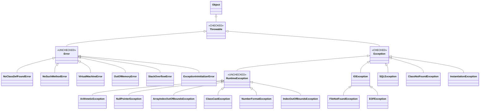

# Java Exception Handling

## Module Overview

Exception handling is a critical mechanism in Java that allows programs to gracefully handle runtime errors and maintain normal program flow. This module covers comprehensive exception handling concepts, from basic try-catch blocks to advanced topics like custom exceptions and try-with-resources.

---

## Introduction to Exception Handling

### What is an Exception?

An **exception** is an event that occurs during program execution and disrupts the normal flow of instructions. When an exception occurs, the program can either handle it gracefully or terminate abnormally.


### Common Causes of Exceptions

::: warning Common Exception Scenarios
- Creating an array with negative size
- Accessing invalid array indices
- Dividing by zero
- Invoking methods on null references
- Recursive method calls without termination condition
- Invalid type conversions
- File not found or I/O errors
:::

### Exception Demonstration

```java
class Lab627 {
    public static void main(String args[]) {
        System.out.println("Main Begin");
        String str = args[0];
        int a = Integer.parseInt(str);
        int x = 10 / a;
        System.out.println("x = " + x);
        System.out.println("Main End");
    }
}
```

**Different execution scenarios:**

| Command | Result | Exception Type |
|---------|--------|---------------|
| `java Lab627` | No arguments provided | `ArrayIndexOutOfBoundsException` |
| `java Lab627 JLC` | Invalid number format | `NumberFormatException` |
| `java Lab627 0` | Division by zero | `ArithmeticException` |
| `java Lab627 10` | ✅ Normal execution | None |

### JVM Exception Handling Flow

```mermaid
sequenceDiagram
    participant JVM
    participant MainThread
    participant main()
    
    JVM->>MainThread: Initialize & Start
    MainThread->>MainThread: Collect Command Line Args
    MainThread->>MainThread: Create String Array
    MainThread->>main(): Call main(args)
    
    alt Exception Occurs
        main()->>main(): Problem Detected
        main()->>main(): Identify Exception Class
        main()->>main(): Create Exception Object
        main()->>main(): Throw Exception
        
        alt Exception Caught
            main()->>main(): Handle in catch block
            main()->>MainThread: Return normally
        else Exception Not Caught
            main()->>MainThread: Return with exception
            MainThread->>MainThread: Display Error Message
            MainThread->>MainThread: Terminate
        end
    else Normal Execution
        main()->>MainThread: Return normally
        MainThread->>MainThread: Terminate normally
    end
    
    MainThread->>JVM: Shutdown
```

::: info Exception Handling Process
1. **Problem Detection**: JVM identifies the issue
2. **Exception Identification**: Determines the appropriate exception class
3. **Object Creation**: Creates an exception object
4. **Exception Throwing**: Throws the exception
5. **Exception Handling**: Either caught by method or handled by main thread
:::

---

## Problem Types

Java categorizes runtime problems into two main types: **Errors** and **Exceptions**.


### Error

::: danger Errors Are Unrecoverable
Errors represent serious problems that applications **should not** attempt to handle. They typically indicate issues with the JVM or system resources.
:::

**Common Error Types:**

| Error | Description |
|-------|-------------|
| `NoClassDefFoundError` | Class definition not found at runtime |
| `NoSuchMethodError` | Required method not found |
| `VirtualMachineError` | JVM is broken or has run out of resources |
| `OutOfMemoryError` | JVM cannot allocate memory for objects |
| `StackOverflowError` | Stack memory exhausted (infinite recursion) |

### Exception

::: tip Exceptions Are Recoverable
Exceptions represent conditions that applications can catch and handle, allowing the program to continue execution.
:::

**Exception Hierarchy:**


---

## Handling Exceptions

### The try-catch Mechanism

Exception handling in Java uses `try` and `catch` blocks to gracefully manage exceptions.

::: info Key Concepts
- **try block**: Contains code that might throw an exception
- **catch block**: Contains code to handle the exception
- A try block can have **zero or more** catch blocks
- When an exception occurs, control transfers to the matching catch block
:::

#### Syntax Variations

**Single catch block:**
```java
try {
    // Statements that may throw exceptions
} catch (ExceptionType refVar) {
    // Exception handling code
}
```

**Multiple catch blocks:**
```java
try {
    // Statements that may throw exceptions
} catch (ExceptionType1 refVar) {
    // Handle ExceptionType1
} catch (ExceptionType2 refVar) {
    // Handle ExceptionType2
}
```

### Basic Exception Handling Example

```java
class Lab628 {
    public static void main(String args[]) {
        System.out.println("Main Begin");
        try {
            String str = args[0];
            int a = Integer.parseInt(str);
            int x = 10 / a;
            System.out.println("x = " + x);
        } catch (Exception ex) {
            System.out.println("Hey, Provide Correct Input");
        }
        System.out.println("Main End");
    }
}
```

::: tip Result
Program executes completely and prints "Main End" even if an exception occurs, because it's properly handled.
:::

### Specific Exception Handling

```java
class Lab629 {
    public static void main(String args[]) {
        System.out.println("Main Begin");
        try {
            String str = args[0];
            int a = Integer.parseInt(str);
            int x = 10 / a;
            System.out.println("x = " + x);
        } catch (ArrayIndexOutOfBoundsException ex) {
            System.out.println("Hey, Provide Input");
        } catch (NumberFormatException ex) {
            System.out.println("Hey, Provide Number Only");
        } catch (ArithmeticException ex) {
            System.out.println("Hey, Provide Non-Zero Number");
        }
        System.out.println("Main End");
    }
}
```

### Catch Block Ordering Rules

::: danger Critical Rule
When using multiple catch blocks with inheritance relationships, **always place child exception types before parent types**.
:::

```java
// ❌ WRONG - Won't compile
try {
    // code
} catch (Exception ex) {              // Parent first
    System.out.println("Hello");
} catch (ArrayIndexOutOfBoundsException ex) {  // Child unreachable
    System.out.println("Provide Input");
}
```

```java
// ✅ CORRECT
try {
    // code
} catch (ArrayIndexOutOfBoundsException ex) {  // Child first
    System.out.println("Provide Input");
} catch (NumberFormatException ex) {
    System.out.println("Provide Number Only");
} catch (Exception ex) {                       // Parent last
    System.out.println("Hello");
}
```

### Important Constraints

::: warning Restrictions
1. **catch parameter must be Throwable**: Cannot use non-Throwable types
   ```java
   // ❌ Invalid
   catch (String str) { }
   ```

2. **try requires catch or finally**: Cannot have try block alone
   ```java
   // ❌ Invalid
   try {
       String str = args[0];
   }
   ```

3. **No statements between blocks**: Nothing allowed between try-catch or catch-catch
   ```java
   // ❌ Invalid
   try {
       int x = 10/0;
   }
   System.out.println("Hello!");  // Not allowed here
   catch (ArithmeticException ex) {
       // ...
   }
   ```

4. **No duplicate catch blocks**: Same exception type cannot appear twice
   ```java
   // ❌ Invalid
   catch (ArithmeticException ex) { }
   catch (ArithmeticException ex) { }  // Duplicate
   ```
:::

### Nested try-catch Blocks

You can nest try-catch-finally blocks within each other for complex exception handling scenarios.

```java
try {
    System.out.println("Outer try");
    try {
        System.out.println("Inner try");
        int x = 10 / 0;
    } catch (ArithmeticException e) {
        System.out.println("Inner catch");
    } finally {
        System.out.println("Inner finally");
    }
} catch (Exception e) {
    System.out.println("Outer catch");
} finally {
    System.out.println("Outer finally");
}
```

**Output Flow:**
```
Outer try
Inner try
Inner catch
Inner finally
Outer finally
```

---

## Multi-Catch Feature (Java 7+)

Java 7 introduced the ability to catch multiple exception types in a single catch block, reducing code duplication.


### Syntax

```java
try {
    // code that may throw exceptions
} catch (ExceptionType1 | ExceptionType2 | ExceptionType3 ex) {
    // Handle all three exception types
}
```

### Example

```java
class Lab641 {
    public static void main(String args[]) {
        System.out.println("Main Begin");
        try {
            String str = args[0];
            int a = Integer.parseInt(str);
            int x = 10 / a;
            System.out.println("x = " + x);
        } catch (ArrayIndexOutOfBoundsException | 
                 NumberFormatException | 
                 ArithmeticException ex) {
            System.out.println("Hey, Hello Guys");
        }
        System.out.println("Main End");
    }
}
```

### Multi-Catch with Multiple Blocks

```java
class Lab642 {
    public static void main(String args[]) {
        System.out.println("Main Begin");
        try {
            String str = args[0];
            int a = Integer.parseInt(str);
            int x = 10 / a;
            System.out.println("x = " + x);
        } catch (ArrayIndexOutOfBoundsException | NumberFormatException ex) {
            System.out.println("Hey, Hello Guys");
        } catch (ArithmeticException ex) {
            System.out.println("Hey, Don't Provide Zero");
        }
        System.out.println("Main End");
    }
}
```

### Multi-Catch Rules

::: danger Restrictions
1. **Exception types must be unique**
   ```java
   // ❌ Invalid - Duplicate type
   catch (ArithmeticException | ArithmeticException ex) { }
   ```

2. **No inheritance relationship allowed**
   ```java
   // ❌ Invalid - Exception is parent of ArithmeticException
   catch (Exception | ArithmeticException ex) { }
   catch (ArithmeticException | Exception ex) { }
   ```
:::

::: tip Benefits
- Reduces code duplication
- More readable and maintainable
- Same handling logic for related exceptions
:::

---

## The finally Block

The `finally` block is used to execute important code regardless of whether an exception occurs or is handled.


### Purpose of finally

::: info Finally Block Guarantees
The finally block **always executes** (with rare exceptions), making it perfect for:
- Closing database connections
- Releasing file handles
- Cleaning up network resources
- Logging cleanup operations
:::

### Syntax Variations

**try-finally (no catch):**
```java
try {
    // Statements
} finally {
    // Always executed
}
```

**try-catch-finally:**
```java
try {
    // Statements
} catch (ExceptionType refVar) {
    // Exception handling
} finally {
    // Always executed
}
```

**try with multiple catch and finally:**
```java
try {
    // Statements
} catch (ExceptionType1 refVar) {
    // Handle type 1
} catch (ExceptionType2 refVar) {
    // Handle type 2
} finally {
    // Always executed
}
```

### Finally Block Examples

#### Without finally - Statement May Not Execute

```java
class Lab646 {
    public static void main(String args[]) {
        System.out.println("Main Begin");
        try {
            int x = 10 / 0;
            System.out.println("x = " + x);
        } catch (NumberFormatException ex) {
            System.out.println("Hey, Don't Divide with Zero");
        }
        System.out.println("Hello Guys"); // May not execute!
        System.out.println("OK Ok");      // May not execute!
        System.out.println("Main End");
    }
}
```

::: danger Problem
If an `ArithmeticException` occurs (not `NumberFormatException`), the catch block won't execute, and the program terminates abnormally. "Hello Guys" never prints.
:::

#### With finally - Guaranteed Execution

```java
class Lab647 {
    public static void main(String args[]) {
        System.out.println("Main Begin");
        try {
            int x = 10 / 0;
            System.out.println("x = " + x);
        } catch (NumberFormatException ex) {
            System.out.println("Hey, Don't Divide with Zero");
        } finally {
            System.out.println("Hello Guys"); // Always executes!
            System.out.println("OK Ok");      // Always executes!
        }
        System.out.println("Main End");
    }
}
```

### Finally with return Statement

Even with return statements, finally block executes before returning.

```java
class Lab650 {
    int show(int a) {
        int x = 0;
        try {
            System.out.println("Try Begin");
            x = 10 / a;
            System.out.println("x = " + x);
            System.out.println("Try End");
            return x;  // Finally executes before this
        } catch (ArithmeticException ex) {
            x = 20;
            System.out.println("Hey, Don't Divide with Zero");
            return x;  // Finally executes before this
        } finally {
            System.out.println("Hello Guys");  // Always executes
            System.out.println("OK Ok");
        }
    }
}
```

**Execution flow with a=2:**
```
Try Begin
x = 5
Try End
Hello Guys
OK Ok
(returns 5)
```

**Execution flow with a=0:**
```
Try Begin
Hey, Don't Divide with Zero
Hello Guys
OK Ok
(returns 20)
```

### When finally Won't Execute

::: warning Rare Exception
The finally block will **NOT** execute only if:
- `System.exit(0)` is called
- JVM crashes
- Infinite loop in try/catch
- Thread is killed
:::

```java
class Lab652 {
    void show(int a) {
        try {
            System.out.println("Try Begin");
            int x = 10 / a;
            System.out.println("x = " + x);
            System.exit(0);  // JVM terminates
        } catch (ArithmeticException ex) {
            System.out.println("Hey, Don't Divide with Zero");
        } finally {
            System.out.println("Hello Guys"); // Won't execute
            System.out.println("OK Ok");
        }
    }
}
```

### Finally Best Practices

::: tip Use Finally For
✅ Closing database connections  
✅ Releasing file handles  
✅ Closing network sockets  
✅ Releasing locks  
✅ Logging operations  
✅ Transaction rollback
:::

::: danger Don't Put in Finally
❌ Return statements (confusing flow)  
❌ Throw statements (masks original exception)  
❌ Complex business logic  
❌ Code that might throw exceptions
:::

---

## Throwable Class Methods

The `java.lang.Throwable` class is the superclass of all errors and exceptions. It provides useful methods for exception handling.


### Common Throwable Methods

| Method | Description |
|--------|-------------|
| `getMessage()` | Returns the detailed message of the exception |
| `getCause()` | Returns the cause of the exception (if any) |
| `printStackTrace()` | Prints stack trace to console |
| `printStackTrace(PrintStream)` | Prints stack trace to specified stream |
| `printStackTrace(PrintWriter)` | Prints stack trace to specified writer |
| `toString()` | Returns string representation of the exception |

### Example: Using Throwable Methods

```java
class Lab654 {
    public static void main(String args[]) {
        System.out.println("Main Begin");
        try {
            Hello h = new Hello();
            h.show();
        } catch (Exception ex) {
            System.out.println("1. " + ex);
            System.out.println("2. " + ex.getMessage());
            System.out.println("3. Stack Trace------->");
            ex.printStackTrace();
        }
        System.out.println("Main End");
    }
}

class Hello {
    void show() {
        System.out.println("Show Begin");
        new A().m1();
        System.out.println("Show End");
    }
}

class A {
    void m1() {
        System.out.println("m1 Begin");
        new B().m2();
        System.out.println("m1 End");
    }
}

class B {
    void m2() {
        System.out.println("m2 Begin");
        new C().m3();
        System.out.println("m2 End");
    }
}

class C {
    void m3() {
        System.out.println("m3 Begin");
        int x = 10 / 0;
        System.out.println("m3 End");
    }
}
```

**Sample Output:**
```
Main Begin
Show Begin
m1 Begin
m2 Begin
m3 Begin
1. java.lang.ArithmeticException: / by zero
2. / by zero
3. Stack Trace------->
java.lang.ArithmeticException: / by zero
    at C.m3(Lab654.java:35)
    at B.m2(Lab654.java:28)
    at A.m1(Lab654.java:21)
    at Hello.show(Lab654.java:14)
    at Lab654.main(Lab654.java:5)
Main End
```

::: info Stack Trace Reading
The stack trace shows the call hierarchy from top (where exception occurred) to bottom (main method). Each line shows:
- Exception type and message
- Class and method name
- File name and line number
:::

---

## Exception Types: Checked vs Unchecked

Java exceptions are categorized into two types based on compiler verification.


### Checked Exceptions (Compile-Time Exceptions)

::: info Definition
**Checked exceptions** are exceptions that the compiler forces you to handle. They are subclasses of `Exception` but NOT subclasses of `RuntimeException`.
:::

**Characteristics:**
- Verified at compile time
- Must be handled or declared
- Usually represent external errors (I/O, network, database)
- Recoverable conditions

**Common Checked Exceptions:**
- `IOException`
- `SQLException`
- `ClassNotFoundException`
- `FileNotFoundException`
- `InterruptedException`

#### Handling Checked Exceptions

You must handle checked exceptions using one of two approaches:

**1. Using try-catch:**
```java
try {
    FileReader fr = new FileReader("file.txt");
} catch (FileNotFoundException ex) {
    System.out.println("File not found");
}
```

**2. Using throws:**
```java
public void readFile() throws FileNotFoundException {
    FileReader fr = new FileReader("file.txt");
}
```

#### Checked Exception Example

```java
class HelloException extends Exception { }

class Hello {
    void show() throws HelloException {
        HelloException ex = new HelloException();
        throw ex;
    }
}

class Lab655 {
    public static void main(String args[]) {
        System.out.println("Main Begin");
        Hello h = new Hello();
        h.show();  // ❌ Compile Error: must be caught or declared
        System.out.println("Main End");
    }
}
```

::: danger Compile Error
```
unreported exception HelloException; must be caught or declared to be thrown
```
:::

**Fixed version:**
```java
class Lab655 {
    public static void main(String args[]) {
        System.out.println("Main Begin");
        Hello h = new Hello();
        try {
            h.show();
        } catch (HelloException ex) {
            System.out.println("Exception handled");
        }
        System.out.println("Main End");
    }
}
```

### Unchecked Exceptions (Runtime Exceptions)

::: info Definition
**Unchecked exceptions** are exceptions that the compiler does NOT force you to handle. They are subclasses of `RuntimeException` or `Error`.
:::

**Characteristics:**
- Not verified at compile time
- Optional to handle or declare
- Usually represent programming errors
- Often preventable with proper coding

**Common Unchecked Exceptions:**
- `ArithmeticException`
- `NullPointerException`
- `ArrayIndexOutOfBoundsException`
- `ClassCastException`
- `IllegalArgumentException`
- `NumberFormatException`

#### Unchecked Exception Example

```java
class HaiException extends RuntimeException { }

class Hai {
    void show() throws HaiException {  // throws is optional
        HaiException ex = new HaiException();
        throw ex;
    }
}

class Lab656 {
    public static void main(String args[]) {
        System.out.println("Main Begin");
        Hai h = new Hai();
        h.show();  // ✅ No compile error (but runtime exception)
        System.out.println("Main End");
    }
}
```

### Comparison Table

| Feature | Checked Exception | Unchecked Exception |
|---------|------------------|---------------------|
| **Compile-time verification** | Yes | No |
| **Must handle/declare** | Mandatory | Optional |
| **Extends** | `Exception` (not `RuntimeException`) | `RuntimeException` or `Error` |
| **Typical cause** | External factors | Programming errors |
| **Examples** | `IOException`, `SQLException` | `NullPointerException`, `ArithmeticException` |
| **When to use** | Recoverable conditions | Programming bugs |

### Complete Exception Hierarchy



### How to Identify Exception Type

::: tip Three Ways to Verify
1. **Compiler check**: If compiler forces handling, it's checked
2. **Check hierarchy**: See if it extends `RuntimeException`
3. **instanceof operator**: Test with `RuntimeException`
:::

```java
class HaiException extends RuntimeException { }
class HelloException extends Exception { }

class Lab657 {
    public static void main(String args[]) {
        Exception ex1 = new HaiException();
        Exception ex2 = new HelloException();
        
        System.out.println(ex1 instanceof RuntimeException); // true (unchecked)
        System.out.println(ex2 instanceof RuntimeException); // false (checked)
    }
}
```

### Catching Unthrown Exceptions

#### Unchecked Exception - Allowed

```java
class Lab658 {
    public static void main(String args[]) {
        try {
            int x = 10 / 0;
        } catch (NullPointerException ex) {  // ✅ OK - unchecked
            System.out.println("Hey, Some Problem");
        }
    }
}
```

#### Checked Exception - Not Allowed

```java
import java.sql.*;

class Lab659 {
    public static void main(String args[]) {
        try {
            int x = 10 / 0;
        } catch (SQLException ex) {  // ❌ Compile Error - checked
            System.out.println("Hey, Some Problem");
        }
    }
}
```

::: danger Compile Error
```
exception SQLException is never thrown in body of corresponding try statement
```
:::

#### Empty try with Unchecked - Allowed

```java
class Lab660 {
    public static void main(String args[]) {
        try {
            // empty
        } catch (NullPointerException ex) {  // ✅ OK - unchecked
            System.out.println("Hey, Some Problem");
        }
    }
}
```

#### Empty try with Checked - Not Allowed

```java
import java.io.*;

class Lab661 {
    public static void main(String args[]) {
        try {
            // empty
        } catch (IOException ex) {  // ❌ Compile Error - checked
            System.out.println("Hey, Some Problem");
        }
    }
}
```

---

## throw Keyword

The `throw` keyword is used to explicitly throw an exception.

### Syntax

```java
throw <throwableObjectReference>;
```

### Characteristics

::: info throw Keyword
- Used to throw exceptions explicitly
- Can throw checked or unchecked exceptions
- Can throw built-in or user-defined exceptions
- Creates an exception object and throws it
:::

### Examples

```java
// Throwing built-in exception
throw new NullPointerException();

// Throwing with message
throw new ArithmeticException("Division by zero");

// Throwing user-defined exception
throw new InvalidAccountNumberException();

// Throwing with data
throw new StudentNotFoundException("JLC-099");
```

### Throw Statement Rules

::: warning Important Rules
1. **Unreachable code after throw**
   ```java
   throw new ArithmeticException();
   System.out.println("Hello"); // ❌ Unreachable code
   ```

2. **Must throw Throwable type**
   ```java
   throw new String("error"); // ❌ Invalid - not Throwable
   ```

3. **Missing return after throw**
   ```java
   int show() {
       throw new ArithmeticException();
       // No need for return statement
   }
   ```
:::

### throw Examples

#### Example 1: Unreachable Code Error

```java
class Test {
    public static void main(String[] args) {
        System.out.println("St1");
        throw new NumberFormatException();
        System.out.println("St2");  // ❌ Compile Error: unreachable
    }
}
```

#### Example 2: Throw in Method

```java
class Abc {
    int show() {
        throw new ArithmeticException();
        // return 0; // Not needed
    }
}

class Test {
    public static void main(String[] args) {
        Abc ob = new Abc();
        int
```