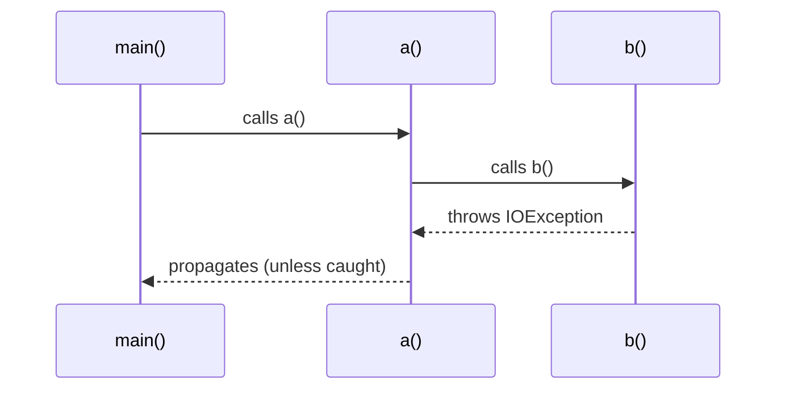
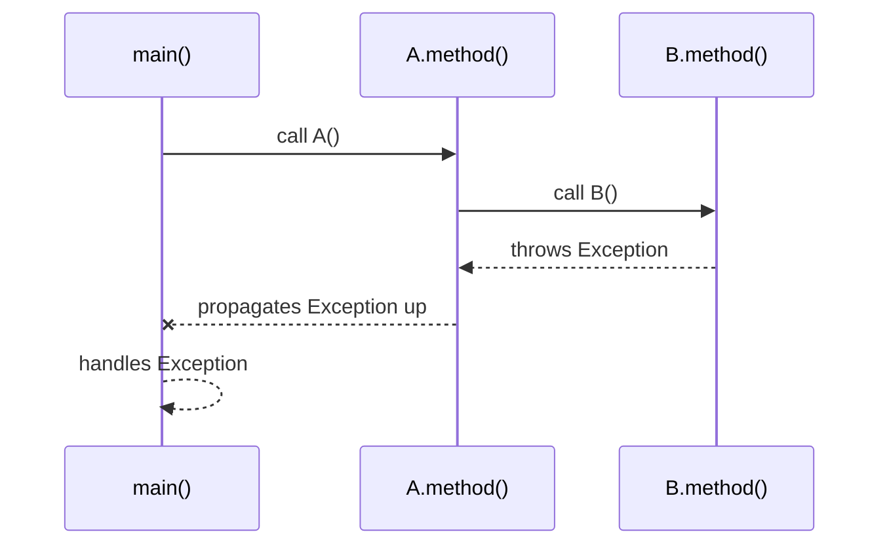

# Java Exception Handling — Deep Dive 

```yaml
---
title: Java Exception Handling — Deep Dive
description: Comprehensive, VitePress-compatible notes on Java Exception Handling with examples, diagrams (Mermaid), best practices, and exercises.
sidebar: auto
sidebarDepth: 2
tags:
  - java
  - exceptions
  - programming
  - vitepress
  - mermaid
---

```

> ⚠️ Note: This single-page document is intentionally long and split into *Parts* (chapters) so you can navigate it like multiple responses inside one file. If you'd like it split into separate VitePress pages/files, tell me and I will generate a multi-file structure in one response.

# Part 1 — Concepts & Basics

## What is an exception?

An **exception** is an event that disrupts normal execution flow of a program. Java models exceptional conditions with objects that extend `java.lang.Throwable`.

* `Throwable` is the root.

  * `Error` — serious problems from which recovery is unlikely (JVM-level, not normally caught).
  * `Exception` — conditions that programs might want to catch and handle.

    * *Checked exceptions* (must be declared or handled)
    * *Unchecked exceptions* (`RuntimeException` and subclasses)

## Why handle exceptions?

* Preserve graceful program behavior.
* Provide meaningful error messages and recovery.
* Release resources (files, sockets, DB connections).
* Implement fault boundaries and fallbacks.

---

## Exception taxonomy (short)

```mermaid
flowchart TD
  A[Throwable]
  A --> B[Error]
  A --> C[Exception]
  C --> D[Checked Exception]
  C --> E[RuntimeException (Unchecked)]
  D --> F[IOException]
  D --> G[SQLException]
  E --> H[NullPointerException]
  E --> I[ArithmeticException]
  E --> J[IndexOutOfBoundsException]
```

---

## Java keywords overview

* `try` — block where exceptions may occur
* `catch` — handle specific exception types
* `finally` — always executes; used for cleanup
* `throw` — explicitly throw an exception instance
* `throws` — declare that a method may throw exceptions
* `try-with-resources` — automatic resource management (ARM)

---

# Part 2 — Mechanics and Examples

## 1) Basic try / catch / finally

```java
public class Basic {
    public static void main(String[] args) {
        try {
            System.out.println("Before");
            int x = 1 / 0; // ArithmeticException
            System.out.println("After"); // never reached
        } catch (ArithmeticException e) {
            System.out.println("Caught: " + e);
        } finally {
            System.out.println("Cleanup in finally");
        }
    }
}
```

**Key notes:**

* `finally` runs even if the catch rethrows or returns (except when JVM exits or thread is killed).
* If both catch and finally modify a return value, the finally’s effect is visible.

## 2) Multiple catches and the exception order

```java
try {
    // risky code
} catch (NullPointerException e) {
    // handle NPE
} catch (RuntimeException e) {
    // handle other runtime exceptions
} catch (Exception e) {
    // generic handler
}
```

**Rule:** Catch more specific subclasses *before* superclasses. Otherwise you'll get a compile-time unreachable-catch error.

## 3) Exception propagation (call stack)



If a method does not catch an exception, it propagates up the call stack until handled or causes program termination.

## 4) `throws` vs `throw`

* `throws` used in method signature to declare checked exceptions:

  ```java
  void readFile() throws IOException { ... }
  ```
* `throw` used to actually raise:

  ```java
  if (x < 0) throw new IllegalArgumentException("x must be >= 0");
  ```

## 5) Try-with-resources (Java 7+)

Automatically closes `AutoCloseable` resources.

```java
try (BufferedReader br = new BufferedReader(new FileReader("file.txt"))) {
    System.out.println(br.readLine());
} catch (IOException e) {
    e.printStackTrace();
}
```

**Mermaid sequence:**

```mermaid
flowchart TB
  A[try-with-resources block starts] --> B[open resources]
  B --> C[use resources]
  C --> D[exception thrown?]
  D -->|yes| E[enter catch]
  E --> F[finally: close resources automatically (suppressed exceptions handled)]
  D -->|no| F
  F --> G[end]
```

**Suppressed exceptions:** If closing resource throws while another exception is active, the closing exception becomes *suppressed* and is attached to the original via `Throwable.addSuppressed()`.

Example of inspecting suppressed exceptions:

```java
try (MyResource r = new MyResource()) {
    throw new RuntimeException("Primary");
} catch (Exception e) {
    System.out.println("Primary: " + e.getMessage());
    for (Throwable s : e.getSuppressed()) {
        System.out.println("Suppressed: " + s.getMessage());
    }
}
```

---

# Part 3 — Advanced Topics

## Checked vs Unchecked — design tradeoffs

**Checked exceptions**

* Pros: force the caller to think about recovery.
* Cons: can lead to verbose APIs and "exception plumbing" with `throws` up the stack.

**Unchecked exceptions**

* Pros: cleaner APIs; used for programming errors.
* Cons: can be overlooked and surface at runtime unexpectedly.

**Design guidance**

* Use checked exceptions for recoverable, expected error conditions (e.g., I/O failure).
* Use unchecked exceptions for programming errors and invariants (e.g., invalid arguments).

## Exception chaining (cause)

Constructors accept a cause:

```java
catch (SQLException e) {
    throw new DataAccessException("Query failed for id " + id, e);
}
```

Inspect with `getCause()`. Use chaining to preserve low-level detail while providing higher-level context.

## Best practices for API designers

* Prefer small, specific exception types (e.g., `InvalidUserInputException`) over generic `Exception`.
* Document exceptions in method javadocs (`@throws`).
* Avoid using checked exceptions for every conceivable error — apply pragmatism.
* For frameworks/libraries, consider wrapping checked exceptions into meaningful runtime exceptions if callers are unlikely to be able to recover.

## Exception design: custom exceptions

```java
public class InsufficientFundsException extends Exception {
    public InsufficientFundsException(String message) { super(message); }
    public InsufficientFundsException(String message, Throwable cause) { super(message, cause); }
}
```

**Pattern:** create both checked and runtime versions (e.g., `XException` and `XRuntimeException`) only when there's a clear reason.

## Logging exceptions

* Log at the level appropriate to the event (WARN, ERROR).
* Include stack trace: use logger’s `error("message", e)` to capture context.
* Avoid logging and rethrowing at the same level without adding value (can cause duplicate noise).

## Performance caveats

* Throwing exceptions is relatively expensive; don't use exceptions for control flow.
* Checking conditions first and only using exceptions for truly exceptional events is good practice.

## Memory & serialization

* Exceptions are serializable.
* Preserve `serialVersionUID` if you create custom exceptions used across serialization boundaries.

---

# Part 4 — Patterns, Anti-Patterns, and Practical Examples

## Patterns

### 1) Fail-fast

Validate arguments early and throw `IllegalArgumentException` or `NullPointerException`:

```java
public void setName(String name) {
    Objects.requireNonNull(name, "name");
    if (name.isBlank()) throw new IllegalArgumentException("name may not be blank");
    this.name = name;
}
```

### 2) Map low-level exceptions to high-level ones

For example when crossing layers (DAO → service → controller):

```java
try {
   dao.save(entity);
} catch (SQLException e) {
   throw new DataAccessException("Could not save entity", e);
}
```

### 3) Graceful fallback

If primary resource fails, try secondary:

```java
try {
    readFromPrimary();
} catch (IOException e) {
    logger.warn("Primary failed, trying backup", e);
    readFromBackup();
}
```

## Anti-Patterns

* Swallowing exceptions:

  ```java
  try { ... } catch (Exception e) { } // BAD: hides bugs
  ```
* Over-catching (catching `Exception` or `Throwable` indiscriminately).
* Using exceptions for normal control flow (e.g., `IndexOutOfBoundsException` as logic).

---

# Part 5 — Deep Examples & Edge Cases

## Example: Exception in constructor

If constructor throws, the object is not created; finalize/cleanup must consider partially-initialized state.

```java
public class Widget {
    private Resource r;
    public Widget() throws IOException {
        r = openResource();
        if (!initOk()) {
            r.close(); // must clean up before throwing
            throw new IOException("init failed");
        }
    }
}
```

## Example: finally with return

```java
public int example() {
    try {
        return 1;
    } finally {
        // modifying state or returning here will override the caller's return
        // avoid returning from finally
    }
}
```

**Rule:** Avoid `return` in `finally`. It obscures control flow and suppresses exceptions.

## Handling `InterruptedException`

* If you catch `InterruptedException`, restore the interrupt status with `Thread.currentThread().interrupt()` if you don't rethrow — otherwise callers won't know the thread was interrupted.

```java
try {
    Thread.sleep(1000);
} catch (InterruptedException e) {
    Thread.currentThread().interrupt(); // propagate the interrupt
}
```

## Example: Rethrowing while preserving type (Java 7+)

Use multi-catch or rethrow with improved type inference.

```java
try {
    // some code
} catch (IOException | SQLException e) {
    throw new MyCustomException("Wrapped", e);
}
```

## Example: Suppressed exceptions inspection

```java
try (MyResource r = new MyResource()) {
    throw new RuntimeException("Primary");
} catch (RuntimeException e) {
    Arrays.stream(e.getSuppressed()).forEach(s -> System.out.println("Suppressed: " + s));
}
```

---

# Part 6 — Diagrams (Mermaid) & Flows

## Exception handling flow

```mermaid
flowchart TD
  Start[Start] --> TryBlock[try { risky code }]
  TryBlock -->|no exception| AfterTry[continue normal flow]
  TryBlock -->|exception X| Catch1[catch (X) { handler }]
  TryBlock -->|exception Y| Catch2[catch (Y) { handler }]
  Catch1 --> Finally[finally { cleanup }]
  Catch2 --> Finally
  AfterTry --> Finally
  Finally --> End[End]
```

## Propagation and stack unwinding



---

# Part 7 — Testing & Debugging Exceptions

## Unit testing exceptions

* JUnit 5:

```java
import static org.junit.jupiter.api.Assertions.*;
import org.junit.jupiter.api.Test;

@Test
void testThrows() {
    Exception e = assertThrows(IllegalArgumentException.class, () -> {
        myService.doSomething(null);
    });
    assertEquals("name must not be null", e.getMessage());
}
```

## Reading stack traces

* The top-most stack frame in the trace is where the exception was thrown.
* Look for your application package classes first — those show the point in your code where it happened.

---

# Part 8 — Common Interview/Exam Questions

## Q: When to use checked vs unchecked?

A: Use checked for recoverable conditions the caller can act on (e.g., missing file). Use unchecked for programming errors and invariants.

## Q: What does `try-with-resources` do with suppressed exceptions?

A: If a resource's `close()` throws while another exception is active, the close exception is **suppressed** and attached to the active exception via `addSuppressed`. Access via `Throwable.getSuppressed()`.

## Q: Why not catch `Throwable`?

A: `Throwable` includes `Error` instances (e.g., `OutOfMemoryError`) which represent unrecoverable JVM conditions. Catching them hides serious problems and can destabilize the system.

---

# Part 9 — Cheatsheet (quick)

```text
// Throwing
throw new IllegalStateException("bad state");

// Declaring
void foo() throws IOException

// Try-with-resources
try (var r = new Resource()) { ... }

// Chaining
catch (IOException e) {
   throw new MyException("context", e);
}

// Inspect suppressed
for (Throwable s : e.getSuppressed()) { ... }
```

---

# Part 10 — Exercises (with brief answers)

### Exercise 1

Write a function `int parse(String s)` that returns integer or throws `NumberFormatException`. Test both valid and invalid inputs.

**Answer hint:** Use `Integer.parseInt(s)` and write unit tests with `assertThrows`.

### Exercise 2

Design a custom checked exception `InvalidDocumentException`, throw it when a document's schema is invalid, and show how a caller can recover.

**Answer hint:** Extend `Exception`, add constructors; caller may catch and log, then show user-friendly message or prompt retry.

### Exercise 3 (tricky)

What happens when both `try` block throws `Exception A` and `finally` block throws `Exception B`? Which is propagated?

**Answer:** The exception from `try` (`A`) is propagated, and the exception in `finally` (`B`) becomes *suppressed* and is available via `A.getSuppressed()`.

---

# Part 11 — FAQs

**Q:** Should I log and rethrow?
**A:** Only when you add meaningful context. Avoid logging and rethrowing the same exception without additional info — it leads to duplicate log entries.

**Q:** Is it OK to convert checked exceptions to runtime exceptions?
**A:** Sometimes — for framework layers or when callers cannot reasonably recover. Document the behavior clearly.

**Q:** How to propagate interrupts properly?
**A:** If you catch `InterruptedException` but cannot rethrow, call `Thread.currentThread().interrupt()` to restore the interrupt status.

---

# Part 12 — References & Further Reading

::: tip
Official Java docs:

* `java.lang.Throwable`, `Exception`, `RuntimeException`
* `try-with-resources` (Java Language Specification)
  :::

::: warning
This document focuses on *practical* usage and idiomatic patterns. Language specification details exist and should be consulted for corner-cases and exact semantics (JLS).
:::

---

# Appendix — Full Example: Robust file processing with mapping and chaining

```java
public class FileProcessor {

    public void process(Path path) {
        try (BufferedReader br = Files.newBufferedReader(path)) {
            String line;
            while ((line = br.readLine()) != null) {
                handleLine(line);
            }
        } catch (IOException e) {
            // Map low-level I/O error to domain-level exception
            throw new FileProcessingException("Failed to process file: " + path, e);
        }
    }

    private void handleLine(String line) {
        try {
            DomainObject obj = DomainParser.parse(line);
            dao.save(obj);
        } catch (ParseException e) {
            // Log and skip bad lines
            logger.warn("Skipping bad line: {}", line, e);
        } catch (DataAccessException e) {
            // This is serious for business logic — rethrow as runtime to allow transaction management to roll back
            throw new RuntimeException("DB error while saving: " + line, e);
        }
    }
}
```
