# Exception Handling in Java

::: info Learning Path
This is Part 1 of a comprehensive guide covering the fundamentals of exception handling in Java.
:::

## Introduction to Exceptions

An **exception** is an event that disrupts the normal flow of program execution. When an error occurs within a method, the method creates an object called an exception object and hands it off to the runtime system. This process is called **throwing an exception**.

### Why Exception Handling?

Exception handling provides a structured way to:
- Separate error-handling code from regular code
- Propagate errors up the call stack
- Group and differentiate error types
- Recover from errors gracefully

::: tip Key Benefit
Without exception handling, programs would need complex error-checking code after every operation, making code difficult to read and maintain.
:::

## Exception Hierarchy

Java's exception hierarchy is built on the `Throwable` class:

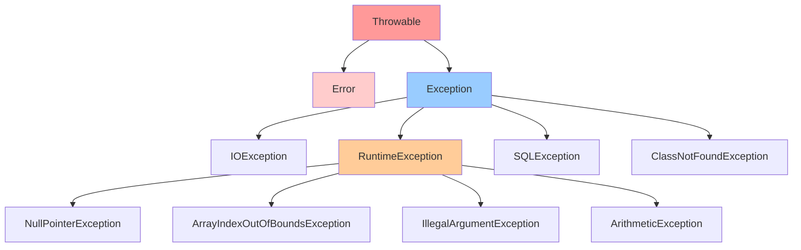

### Understanding the Hierarchy

| Class | Description | Should You Catch? |
|-------|-------------|-------------------|
| **Throwable** | Root of all exceptions and errors | Rarely |
| **Error** | Serious problems (e.g., OutOfMemoryError) | No |
| **Exception** | Conditions that programs should catch | Yes |
| **RuntimeException** | Unchecked exceptions (programming bugs) | Sometimes |

## Types of Exceptions

### 1. Checked Exceptions

**Checked exceptions** must be either caught or declared in the method signature using `throws`.

::: warning Compile-Time Requirement
Code won't compile if checked exceptions aren't handled properly.
:::

**Common Checked Exceptions:**
- `IOException` - Input/output operations fail
- `SQLException` - Database access errors
- `FileNotFoundException` - File doesn't exist
- `ClassNotFoundException` - Class definition not found

**Example:**

```java
import java.io.*;

public class CheckedExceptionExample {
    // Method declares it throws IOException
    public static void readFile(String filename) throws IOException {
        FileReader file = new FileReader(filename);
        BufferedReader reader = new BufferedReader(file);
        
        String line;
        while ((line = reader.readLine()) != null) {
            System.out.println(line);
        }
        
        reader.close();
    }
    
    public static void main(String[] args) {
        try {
            readFile("data.txt");
        } catch (IOException e) {
            System.err.println("Error reading file: " + e.getMessage());
        }
    }
}
```

### 2. Unchecked Exceptions (Runtime Exceptions)

**Unchecked exceptions** extend `RuntimeException` and don't require explicit handling.

::: info When They Occur
These typically indicate programming errors like logic mistakes or improper use of APIs.
:::

**Common Unchecked Exceptions:**
- `NullPointerException` - Accessing null reference
- `ArrayIndexOutOfBoundsException` - Invalid array index
- `ArithmeticException` - Illegal arithmetic operation
- `IllegalArgumentException` - Invalid method argument

**Example:**

```java
public class UncheckedExceptionExample {
    public static void main(String[] args) {
        // NullPointerException
        String text = null;
        // System.out.println(text.length()); // Would crash
        
        // ArrayIndexOutOfBoundsException
        int[] numbers = {1, 2, 3};
        // System.out.println(numbers[5]); // Would crash
        
        // ArithmeticException
        int result = 10 / 0; // Will throw ArithmeticException
    }
}
```

### 3. Errors

**Errors** represent serious problems that applications shouldn't try to catch.

**Common Errors:**
- `OutOfMemoryError` - JVM runs out of memory
- `StackOverflowError` - Stack space exhausted
- `VirtualMachineError` - JVM is broken

```java
public class ErrorExample {
    // This will cause StackOverflowError
    public static void infiniteRecursion() {
        infiniteRecursion(); // Never stops
    }
    
    // This can cause OutOfMemoryError
    public static void memoryLeak() {
        List<byte[]> list = new ArrayList<>();
        while (true) {
            list.add(new byte[1024 * 1024]); // 1MB each iteration
        }
    }
}
```

## Exception Flow

Here's how exceptions propagate through the call stack:

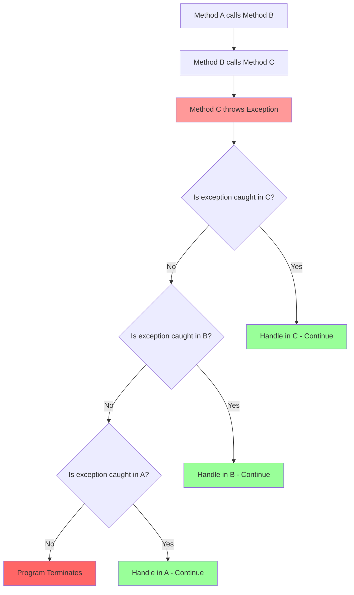

**Code Example:**

```java
public class ExceptionFlowDemo {
    public static void methodA() {
        try {
            System.out.println("Method A: Before calling B");
            methodB();
            System.out.println("Method A: After calling B");
        } catch (ArithmeticException e) {
            System.out.println("Method A: Caught exception - " + e.getMessage());
        }
    }
    
    public static void methodB() {
        System.out.println("Method B: Before calling C");
        methodC();
        System.out.println("Method B: After calling C");
    }
    
    public static void methodC() {
        System.out.println("Method C: About to throw exception");
        int result = 10 / 0; // ArithmeticException thrown here
        System.out.println("Method C: This won't print");
    }
    
    public static void main(String[] args) {
        methodA();
        System.out.println("Main: Program continues");
    }
}
```

**Output:**
```
Method A: Before calling B
Method B: Before calling C
Method C: About to throw exception
Method A: Caught exception - / by zero
Main: Program continues
```

## Basic Exception Handling Syntax

### The try-catch Block

```java
try {
    // Code that might throw an exception
} catch (ExceptionType e) {
    // Code to handle the exception
}
```

### Single catch Example

```java
public class BasicTryCatch {
    public static void main(String[] args) {
        try {
            int[] numbers = {1, 2, 3};
            System.out.println(numbers[5]); // Will throw exception
        } catch (ArrayIndexOutOfBoundsException e) {
            System.out.println("Error: Array index is invalid!");
            System.out.println("Details: " + e.getMessage());
        }
        
        System.out.println("Program continues...");
    }
}
```

### Multiple catch Blocks

You can catch different exception types separately:

```java
import java.io.*;

public class MultipleCatch {
    public static void main(String[] args) {
        try {
            String text = args[0]; // Might throw ArrayIndexOutOfBoundsException
            int number = Integer.parseInt(text); // Might throw NumberFormatException
            int result = 100 / number; // Might throw ArithmeticException
            
            System.out.println("Result: " + result);
            
        } catch (ArrayIndexOutOfBoundsException e) {
            System.out.println("Error: No argument provided");
            
        } catch (NumberFormatException e) {
            System.out.println("Error: Argument is not a valid number");
            
        } catch (ArithmeticException e) {
            System.out.println("Error: Cannot divide by zero");
        }
    }
}
```

::: warning Order Matters
Catch blocks are checked from top to bottom. More specific exceptions must come before more general ones.
:::

### Multi-catch (Java 7+)

Handle multiple exception types in a single catch block:

```java
public class MultiCatch {
    public static void main(String[] args) {
        try {
            // Code that might throw different exceptions
            String text = args[0];
            int number = Integer.parseInt(text);
            int result = 100 / number;
            
        } catch (ArrayIndexOutOfBoundsException | NumberFormatException e) {
            System.out.println("Error: Invalid input - " + e.getMessage());
            
        } catch (ArithmeticException e) {
            System.out.println("Error: Math error - " + e.getMessage());
        }
    }
}
```

## Exception Object Methods

The exception object provides useful information:

| Method | Description | Example Output |
|--------|-------------|----------------|
| `getMessage()` | Returns detail message | "/ by zero" |
| `toString()` | Returns class name + message | "java.lang.ArithmeticException: / by zero" |
| `printStackTrace()` | Prints stack trace | Full trace with line numbers |
| `getCause()` | Returns the cause | Another Throwable or null |

```java
public class ExceptionMethods {
    public static void main(String[] args) {
        try {
            int result = 10 / 0;
        } catch (ArithmeticException e) {
            System.out.println("getMessage(): " + e.getMessage());
            System.out.println("\ntoString(): " + e.toString());
            System.out.println("\nprintStackTrace():");
            e.printStackTrace();
        }
    }
}
```

---

::: tip Next Section
In Part 2, we'll cover the `finally` block, try-with-resources, creating custom exceptions, and best practices.
:::

# Exception Handling in Java - Part 2

::: info Continuation
This is Part 2 covering advanced exception handling concepts including finally, try-with-resources, and custom exceptions.
:::

## The finally Block

The `finally` block **always executes**, whether an exception occurs or not. It's typically used for cleanup operations.

### Syntax

```java
try {
    // Code that might throw exception
} catch (ExceptionType e) {
    // Handle exception
} finally {
    // Always executes (cleanup code)
}
```

### Execution Flow

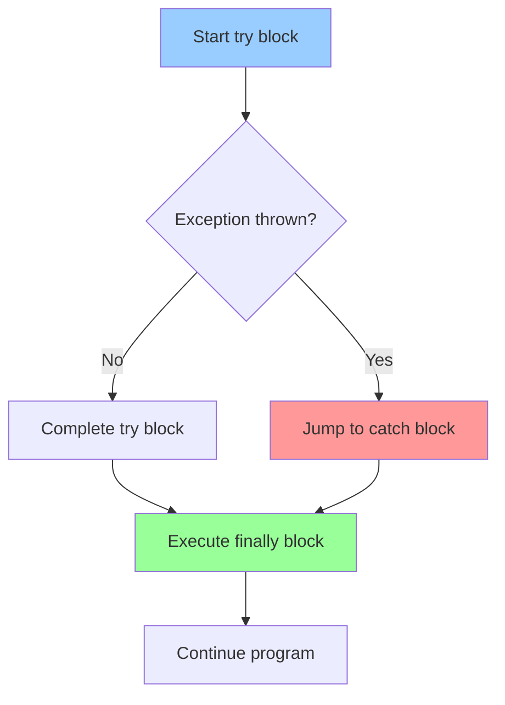

### Basic Example

```java
import java.io.*;

public class FinallyExample {
    public static void main(String[] args) {
        FileReader reader = null;
        
        try {
            reader = new FileReader("data.txt");
            System.out.println("File opened successfully");
            
            // Simulate reading
            int data = reader.read();
            
        } catch (FileNotFoundException e) {
            System.out.println("File not found: " + e.getMessage());
            
        } catch (IOException e) {
            System.out.println("Error reading file: " + e.getMessage());
            
        } finally {
            System.out.println("Finally block executing...");
            
            // Cleanup: Always close the file
            if (reader != null) {
                try {
                    reader.close();
                    System.out.println("File closed successfully");
                } catch (IOException e) {
                    System.out.println("Error closing file");
                }
            }
        }
        
        System.out.println("Program continues");
    }
}
```

### When finally Doesn't Execute

::: danger Important Exception
The `finally` block won't execute only if:
- JVM exits (`System.exit()`)
- Thread dies
- Fatal error causes JVM crash
:::

```java
public class FinallyNotExecuting {
    public static void main(String[] args) {
        try {
            System.out.println("In try block");
            System.exit(0); // JVM exits
        } finally {
            // This won't execute
            System.out.println("In finally block");
        }
    }
}
```

### Return in finally

::: warning Be Careful
If `finally` contains a `return` statement, it overrides any return from `try` or `catch` blocks.
:::

```java
public class FinallyReturn {
    public static int testReturn() {
        try {
            return 1;
        } catch (Exception e) {
            return 2;
        } finally {
            return 3; // This value is returned (not recommended!)
        }
    }
    
    public static void main(String[] args) {
        System.out.println(testReturn()); // Prints: 3
    }
}
```

## Try-with-Resources (Java 7+)

**Try-with-resources** automatically closes resources that implement `AutoCloseable` or `Closeable` interface.

### Syntax

```java
try (ResourceType resource = new ResourceType()) {
    // Use the resource
} catch (ExceptionType e) {
    // Handle exception
}
// Resource is automatically closed here
```

### Benefits

::: tip Advantages
- **Automatic cleanup**: No need for explicit `close()` calls
- **Cleaner code**: No nested try-catch for closing
- **Exception suppression**: Handles exceptions from both try block and close()
:::

### Basic Example

```java
import java.io.*;

public class TryWithResources {
    // Old way - verbose and error-prone
    public static void oldWay(String filename) {
        BufferedReader reader = null;
        try {
            reader = new BufferedReader(new FileReader(filename));
            String line = reader.readLine();
            System.out.println(line);
        } catch (IOException e) {
            e.printStackTrace();
        } finally {
            if (reader != null) {
                try {
                    reader.close();
                } catch (IOException e) {
                    e.printStackTrace();
                }
            }
        }
    }
    
    // New way - clean and safe
    public static void newWay(String filename) {
        try (BufferedReader reader = new BufferedReader(new FileReader(filename))) {
            String line = reader.readLine();
            System.out.println(line);
        } catch (IOException e) {
            e.printStackTrace();
        }
        // reader.close() called automatically
    }
}
```

### Multiple Resources

You can declare multiple resources separated by semicolons:

```java
import java.io.*;

public class MultipleResources {
    public static void copyFile(String source, String destination) {
        try (
            FileInputStream input = new FileInputStream(source);
            FileOutputStream output = new FileOutputStream(destination)
        ) {
            byte[] buffer = new byte[1024];
            int bytesRead;
            
            while ((bytesRead = input.read(buffer)) != -1) {
                output.write(buffer, 0, bytesRead);
            }
            
            System.out.println("File copied successfully");
            
        } catch (IOException e) {
            System.err.println("Error copying file: " + e.getMessage());
        }
        // Both input and output are closed automatically (in reverse order)
    }
}
```

### Custom AutoCloseable Resource

```java
public class CustomResource implements AutoCloseable {
    private String name;
    
    public CustomResource(String name) {
        this.name = name;
        System.out.println(name + " opened");
    }
    
    public void doSomething() {
        System.out.println(name + " is doing something");
    }
    
    @Override
    public void close() {
        System.out.println(name + " closed");
    }
    
    public static void main(String[] args) {
        try (CustomResource resource = new CustomResource("MyResource")) {
            resource.doSomething();
        } catch (Exception e) {
            e.printStackTrace();
        }
        
        System.out.println("Program continues");
    }
}
```

**Output:**
```
MyResource opened
MyResource is doing something
MyResource closed
Program continues
```

## The throws Keyword

The `throws` keyword declares that a method might throw certain exceptions, delegating the handling to the caller.

### Syntax

```java
public void methodName() throws ExceptionType1, ExceptionType2 {
    // Method code
}
```

### Declaration Flow

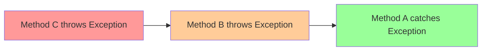

### Example

```java
import java.io.*;

public class ThrowsExample {
    // This method declares it might throw IOException
    public static void readFile(String filename) throws IOException {
        FileReader file = new FileReader(filename);
        BufferedReader reader = new BufferedReader(file);
        
        String line;
        while ((line = reader.readLine()) != null) {
            System.out.println(line);
        }
        
        reader.close();
    }
    
    // This method also declares IOException (propagating it up)
    public static void processFile(String filename) throws IOException {
        System.out.println("Processing file: " + filename);
        readFile(filename); // Might throw IOException
        System.out.println("File processed successfully");
    }
    
    public static void main(String[] args) {
        // Finally, we handle the exception here
        try {
            processFile("data.txt");
        } catch (IOException e) {
            System.err.println("Error: " + e.getMessage());
        }
    }
}
```

### When to Use throws vs try-catch

| Use `throws` When | Use `try-catch` When |
|-------------------|----------------------|
| Method can't handle the exception meaningfully | You can recover from the error |
| Caller has more context to handle it | Error handling is local |
| Writing library/API code | Writing application code |
| Exception is part of method's contract | You want to hide implementation details |

## The throw Keyword

The `throw` keyword is used to explicitly throw an exception.

### Syntax

```java
throw new ExceptionType("Error message");
```

### Example: Validating Input

```java
public class ThrowExample {
    public static void setAge(int age) {
        if (age < 0) {
            throw new IllegalArgumentException("Age cannot be negative: " + age);
        }
        if (age > 150) {
            throw new IllegalArgumentException("Age seems invalid: " + age);
        }
        System.out.println("Age set to: " + age);
    }
    
    public static void divide(int a, int b) {
        if (b == 0) {
            throw new ArithmeticException("Cannot divide by zero");
        }
        System.out.println("Result: " + (a / b));
    }
    
    public static void main(String[] args) {
        try {
            setAge(25);   // OK
            setAge(-5);   // Throws exception
        } catch (IllegalArgumentException e) {
            System.err.println("Error: " + e.getMessage());
        }
        
        try {
            divide(10, 2); // OK
            divide(10, 0); // Throws exception
        } catch (ArithmeticException e) {
            System.err.println("Error: " + e.getMessage());
        }
    }
}
```

### Re-throwing Exceptions

You can catch an exception and re-throw it (possibly after logging):

```java
public class RethrowExample {
    public static void processData(String data) throws Exception {
        try {
            // Some processing
            if (data == null) {
                throw new NullPointerException("Data is null");
            }
            
        } catch (NullPointerException e) {
            // Log the error
            System.err.println("Logging error: " + e.getMessage());
            
            // Re-throw for caller to handle
            throw e;
        }
    }
    
    public static void main(String[] args) {
        try {
            processData(null);
        } catch (Exception e) {
            System.out.println("Caught in main: " + e.getMessage());
        }
    }
}
```

## Creating Custom Exceptions

Custom exceptions help create meaningful error types for your domain.

### Basic Custom Exception

```java
// Custom checked exception
public class InsufficientFundsException extends Exception {
    private double amount;
    
    public InsufficientFundsException(double amount) {
        super("Insufficient funds: needs $" + amount + " more");
        this.amount = amount;
    }
    
    public double getAmount() {
        return amount;
    }
}

// Usage
public class BankAccount {
    private double balance;
    
    public BankAccount(double initialBalance) {
        this.balance = initialBalance;
    }
    
    public void withdraw(double amount) throws InsufficientFundsException {
        if (amount > balance) {
            double shortfall = amount - balance;
            throw new InsufficientFundsException(shortfall);
        }
        balance -= amount;
        System.out.println("Withdrew $" + amount + ", balance: $" + balance);
    }
    
    public static void main(String[] args) {
        BankAccount account = new BankAccount(100.0);
        
        try {
            account.withdraw(50);   // OK
            account.withdraw(75);   // Will throw exception
        } catch (InsufficientFundsException e) {
            System.err.println("Transaction failed: " + e.getMessage());
            System.err.println("Short by: $" + e.getAmount());
        }
    }
}
```

### Exception Hierarchy Best Practice

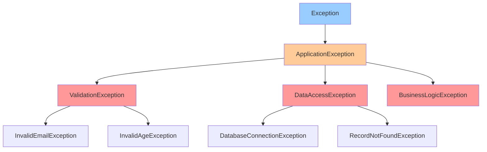

```java
// Base application exception
public class ApplicationException extends Exception {
    public ApplicationException(String message) {
        super(message);
    }
    
    public ApplicationException(String message, Throwable cause) {
        super(message, cause);
    }
}

// Specific exception types
public class ValidationException extends ApplicationException {
    public ValidationException(String message) {
        super(message);
    }
}

public class InvalidEmailException extends ValidationException {
    public InvalidEmailException(String email) {
        super("Invalid email format: " + email);
    }
}

public class DataAccessException extends ApplicationException {
    public DataAccessException(String message, Throwable cause) {
        super(message, cause);
    }
}

// Usage in application
public class UserService {
    public void registerUser(String email, int age) 
            throws ValidationException {
        
        if (!email.contains("@")) {
            throw new InvalidEmailException(email);
        }
        
        if (age < 18) {
            throw new ValidationException("User must be 18 or older");
        }
        
        // Registration logic...
    }
}
```

### Custom Unchecked Exception

```java
// Custom runtime exception (unchecked)
public class ConfigurationException extends RuntimeException {
    public ConfigurationException(String message) {
        super(message);
    }
    
    public ConfigurationException(String message, Throwable cause) {
        super(message, cause);
    }
}

// Usage
public class ConfigLoader {
    public void loadConfig(String filename) {
        if (filename == null || filename.isEmpty()) {
            throw new ConfigurationException("Configuration file name is required");
        }
        
        // Load configuration...
    }
}
```

---

::: tip Next Section
In Part 3, we'll cover exception handling best practices, common anti-patterns, performance considerations, and real-world examples.
:::

# Exception Handling in Java - Part 3

::: info Advanced Topics
This is Part 3 covering best practices, common anti-patterns, performance considerations, and real-world scenarios.
:::

## Best Practices

### 1. Be Specific with Exceptions

::: tip Good Practice
Catch specific exceptions rather than generic ones. This makes your code more maintainable and helps identify issues.
:::

```java
// ❌ BAD: Too generic
public void processFile(String filename) {
    try {
        FileReader file = new FileReader(filename);
        // ... processing
    } catch (Exception e) {  // Catches everything!
        System.out.println("Something went wrong");
    }
}

// ✅ GOOD: Specific exceptions
public void processFile(String filename) {
    try {
        FileReader file = new FileReader(filename);
        // ... processing
    } catch (FileNotFoundException e) {
        System.err.println("File not found: " + filename);
    } catch (IOException e) {
        System.err.println("Error reading file: " + e.getMessage());
    } catch (SecurityException e) {
        System.err.println("Access denied: " + filename);
    }
}
```

### 2. Don't Swallow Exceptions

::: danger Anti-Pattern
Empty catch blocks hide errors and make debugging extremely difficult.
:::

```java
// ❌ BAD: Silent failure
public void loadConfiguration() {
    try {
        config = ConfigLoader.load("config.xml");
    } catch (IOException e) {
        // Silent failure - very dangerous!
    }
}

// ✅ GOOD: Log the error
import java.util.logging.Logger;

public void loadConfiguration() {
    try {
        config = ConfigLoader.load("config.xml");
    } catch (IOException e) {
        logger.error("Failed to load configuration", e);
        // Provide default configuration
        config = getDefaultConfiguration();
    }
}

// ✅ ALSO GOOD: If you really can't handle it, re-throw
public void loadConfiguration() throws ConfigurationException {
    try {
        config = ConfigLoader.load("config.xml");
    } catch (IOException e) {
        throw new ConfigurationException("Cannot load config", e);
    }
}
```

### 3. Use Descriptive Error Messages

```java
// ❌ BAD: Vague message
if (age < 0) {
    throw new IllegalArgumentException("Invalid age");
}

// ✅ GOOD: Detailed message
if (age < 0) {
    throw new IllegalArgumentException(
        "Age must be positive. Provided: " + age
    );
}

// ✅ EXCELLENT: Actionable message
if (age < 0) {
    throw new IllegalArgumentException(
        String.format(
            "Invalid age: %d. Age must be between 0 and 150. " +
            "Please check the input data source.",
            age
        )
    );
}
```

### 4. Clean Up Resources Properly

```java
// ❌ BAD: Resource leak risk
public String readFile(String path) throws IOException {
    FileReader reader = new FileReader(path);
    BufferedReader buffered = new BufferedReader(reader);
    return buffered.readLine(); // If exception occurs, file never closed!
}

// ✅ GOOD: Try-with-resources
public String readFile(String path) throws IOException {
    try (BufferedReader reader = new BufferedReader(new FileReader(path))) {
        return reader.readLine();
    } // Automatically closed
}

// ✅ ALTERNATIVE: Manual cleanup (if try-with-resources not available)
public String readFile(String path) throws IOException {
    BufferedReader reader = null;
    try {
        reader = new BufferedReader(new FileReader(path));
        return reader.readLine();
    } finally {
        if (reader != null) {
            try {
                reader.close();
            } catch (IOException e) {
                // Log but don't throw
                logger.warn("Failed to close file", e);
            }
        }
    }
}
```

### 5. Document Exceptions in Javadoc

```java
/**
 * Transfers funds between two accounts.
 * 
 * @param from The source account
 * @param to The destination account
 * @param amount The amount to transfer
 * @throws IllegalArgumentException if amount is negative or zero
 * @throws InsufficientFundsException if source account has insufficient balance
 * @throws AccountNotFoundException if either account doesn't exist
 * @throws AccountLockedException if either account is locked
 */
public void transferFunds(String from, String to, double amount) 
        throws InsufficientFundsException, 
               AccountNotFoundException, 
               AccountLockedException {
    // Implementation
}
```

### 6. Don't Use Exceptions for Flow Control

::: warning Performance Impact
Exceptions are expensive. Don't use them for normal program flow.
:::

```java
// ❌ BAD: Exception for flow control
public int parseIntBad(String value) {
    try {
        return Integer.parseInt(value);
    } catch (NumberFormatException e) {
        return 0; // Default value
    }
}

// ✅ GOOD: Validate first
public int parseIntGood(String value) {
    if (value == null || value.trim().isEmpty()) {
        return 0;
    }
    
    try {
        return Integer.parseInt(value);
    } catch (NumberFormatException e) {
        throw new IllegalArgumentException("Invalid number: " + value, e);
    }
}

// ✅ BETTER: Return Optional (Java 8+)
public Optional<Integer> parseIntOptional(String value) {
    try {
        return Optional.of(Integer.parseInt(value));
    } catch (NumberFormatException e) {
        return Optional.empty();
    }
}
```

### 7. Preserve Original Exception

```java
// ❌ BAD: Loses original exception
public void processData(String data) throws ProcessingException {
    try {
        // ... processing
    } catch (IOException e) {
        throw new ProcessingException("Failed to process");
        // Original exception is lost!
    }
}

// ✅ GOOD: Chain exceptions
public void processData(String data) throws ProcessingException {
    try {
        // ... processing
    } catch (IOException e) {
        throw new ProcessingException("Failed to process data", e);
        // Original exception preserved as cause
    }
}
```

## Common Anti-Patterns

### 1. Catching Throwable or Error

```java
// ❌ VERY BAD: Catches everything including JVM errors
try {
    // code
} catch (Throwable t) {
    // This catches OutOfMemoryError, StackOverflowError, etc.
}

// ✅ GOOD: Catch Exception only
try {
    // code
} catch (Exception e) {
    // Handles application exceptions only
}
```

### 2. Returning from Finally

```java
// ❌ BAD: Return in finally overrides try/catch
public int calculate() {
    try {
        return 10 / 0; // ArithmeticException
    } catch (ArithmeticException e) {
        return -1; // Error code
    } finally {
        return 0; // This overrides everything!
    }
}

// ✅ GOOD: No return in finally
public int calculate() {
    try {
        return 10 / 0;
    } catch (ArithmeticException e) {
        return -1;
    } finally {
        // Cleanup only, no return
        cleanup();
    }
}
```

### 3. Generic Exception Declarations

```java
// ❌ BAD: Too generic
public void doSomething() throws Exception {
    // Forces caller to handle all exceptions
}

// ✅ GOOD: Specific exceptions
public void doSomething() throws IOException, SQLException {
    // Caller knows what to expect
}
```

### 4. Destructive Wrapping

```java
// ❌ BAD: Destroys stack trace
try {
    riskyOperation();
} catch (Exception e) {
    throw new RuntimeException(e.getMessage()); // Stack trace lost!
}

// ✅ GOOD: Preserves stack trace
try {
    riskyOperation();
} catch (Exception e) {
    throw new RuntimeException("Operation failed", e); // Cause preserved
}
```

### 5. Log and Throw

```java
// ❌ BAD: Double logging
public void processOrder(Order order) throws ProcessingException {
    try {
        // ... processing
    } catch (Exception e) {
        logger.error("Error processing order", e); // Logged here
        throw new ProcessingException("Failed", e); // Will be logged again!
    }
}

// ✅ GOOD: Log or throw, not both
public void processOrder(Order order) throws ProcessingException {
    try {
        // ... processing
    } catch (Exception e) {
        // Just wrap and throw - let caller decide logging
        throw new ProcessingException("Failed to process order", e);
    }
}
```

## Exception Handling Patterns

### 1. Translate Exceptions Pattern

Convert low-level exceptions to domain-specific ones:

```java
public class UserRepository {
    public User findById(Long id) throws UserNotFoundException {
        try {
            // Database operation
            return database.query("SELECT * FROM users WHERE id = ?", id);
        } catch (SQLException e) {
            // Translate database exception to domain exception
            throw new UserNotFoundException("User not found: " + id, e);
        }
    }
}
```

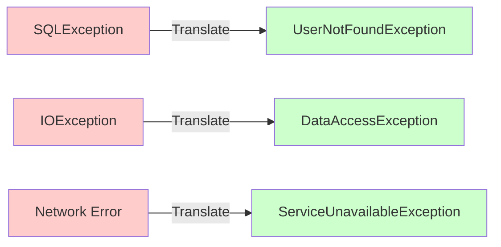

### 2. Let It Fail Pattern

For unrecoverable errors, fail fast and clearly:

```java
public class ApplicationInitializer {
    public void initialize() {
        try {
            loadCriticalConfiguration();
            connectToDatabase();
            startServices();
        } catch (ConfigurationException | DatabaseException e) {
            // Can't recover from these - fail immediately
            logger.fatal("Application initialization failed", e);
            throw new RuntimeException("Startup failed", e);
        }
    }
}
```

### 3. Retry Pattern

Retry transient failures with exponential backoff:

```java
public class ResilientService {
    private static final int MAX_RETRIES = 3;
    private static final long INITIAL_DELAY = 1000; // 1 second
    
    public Response callExternalService(Request request) throws ServiceException {
        int attempt = 0;
        long delay = INITIAL_DELAY;
        
        while (attempt < MAX_RETRIES) {
            try {
                return externalService.call(request);
            } catch (TransientException e) {
                attempt++;
                
                if (attempt >= MAX_RETRIES) {
                    throw new ServiceException("Max retries exceeded", e);
                }
                
                logger.warn("Attempt {} failed, retrying in {}ms", attempt, delay);
                
                try {
                    Thread.sleep(delay);
                } catch (InterruptedException ie) {
                    Thread.currentThread().interrupt();
                    throw new ServiceException("Interrupted during retry", ie);
                }
                
                delay *= 2; // Exponential backoff
            }
        }
        
        throw new ServiceException("Failed after retries");
    }
}
```

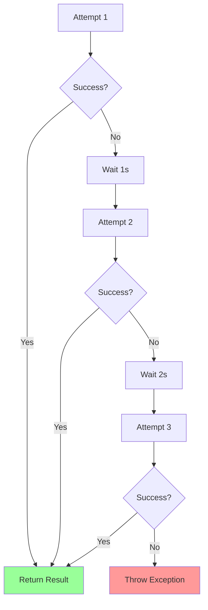

### 4. Circuit Breaker Pattern

Prevent cascading failures:

```java
public class CircuitBreaker {
    private enum State { CLOSED, OPEN, HALF_OPEN }
    
    private State state = State.CLOSED;
    private int failureCount = 0;
    private int successCount = 0;
    private long lastFailureTime = 0;
    
    private static final int FAILURE_THRESHOLD = 5;
    private static final int SUCCESS_THRESHOLD = 2;
    private static final long TIMEOUT = 60000; // 1 minute
    
    public Response call(Supplier<Response> operation) throws ServiceException {
        if (state == State.OPEN) {
            if (System.currentTimeMillis() - lastFailureTime > TIMEOUT) {
                state = State.HALF_OPEN;
                successCount = 0;
            } else {
                throw new ServiceException("Circuit breaker is OPEN");
            }
        }
        
        try {
            Response response = operation.get();
            onSuccess();
            return response;
        } catch (Exception e) {
            onFailure();
            throw new ServiceException("Operation failed", e);
        }
    }
    
    private void onSuccess() {
        if (state == State.HALF_OPEN) {
            successCount++;
            if (successCount >= SUCCESS_THRESHOLD) {
                state = State.CLOSED;
                failureCount = 0;
            }
        }
    }
    
    private void onFailure() {
        failureCount++;
        lastFailureTime = System.currentTimeMillis();
        
        if (failureCount >= FAILURE_THRESHOLD) {
            state = State.OPEN;
        }
    }
}
```

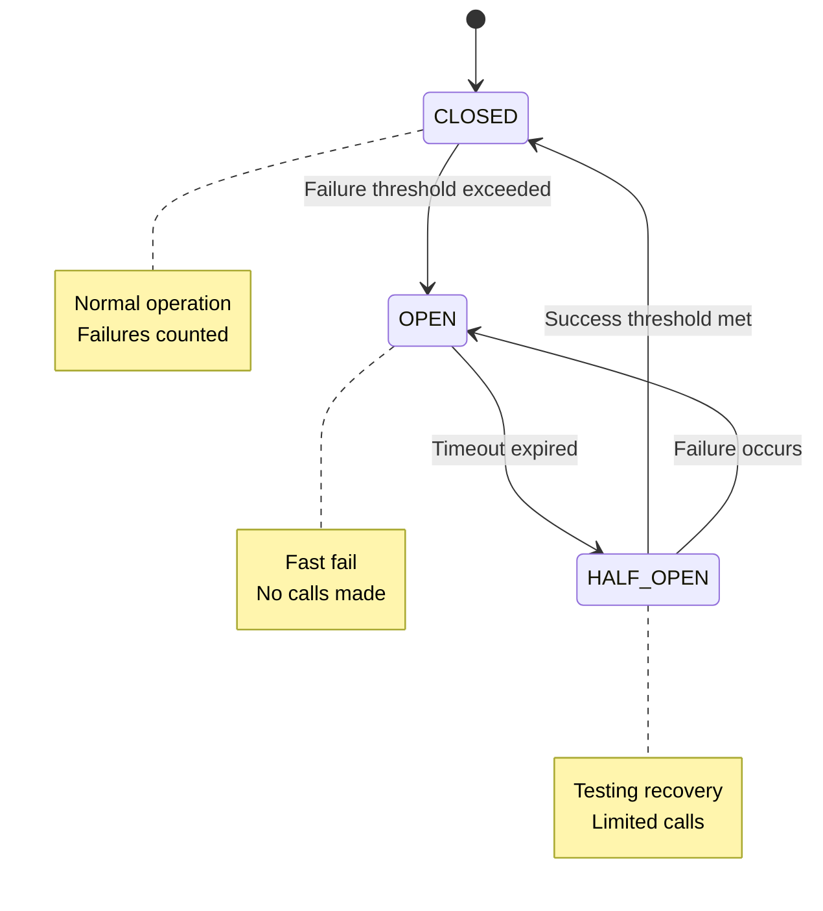

## Real-World Examples

### Example 1: RESTful API Error Handling

```java
import java.util.*;

public class UserController {
    private UserService userService;
    
    /**
     * Creates a new user
     * Returns appropriate HTTP response codes
     */
    public Response createUser(UserRequest request) {
        try {
            // Validate input
            validateUserRequest(request);
            
            // Business logic
            User user = userService.createUser(request);
            
            return Response.ok(user).build(); // 200 OK
            
        } catch (ValidationException e) {
            return Response
                .status(400) // Bad Request
                .entity(new ErrorResponse("VALIDATION_ERROR", e.getMessage()))
                .build();
                
        } catch (DuplicateUserException e) {
            return Response
                .status(409) // Conflict
                .entity(new ErrorResponse("DUPLICATE_USER", e.getMessage()))
                .build();
                
        } catch (DatabaseException e) {
            logger.error("Database error creating user", e);
            return Response
                .status(500) // Internal Server Error
                .entity(new ErrorResponse("DATABASE_ERROR", "Internal error"))
                .build();
                
        } catch (Exception e) {
            logger.error("Unexpected error creating user", e);
            return Response
                .status(500)
                .entity(new ErrorResponse("INTERNAL_ERROR", "Unexpected error"))
                .build();
        }
    }
    
    private void validateUserRequest(UserRequest request) 
            throws ValidationException {
        List<String> errors = new ArrayList<>();
        
        if (request.getEmail() == null || !request.getEmail().contains("@")) {
            errors.add("Invalid email address");
        }
        
        if (request.getAge() < 18) {
            errors.add("User must be at least 18 years old");
        }
        
        if (!errors.isEmpty()) {
            throw new ValidationException(String.join(", ", errors));
        }
    }
}

class ErrorResponse {
    private String code;
    private String message;
    private long timestamp;
    
    public ErrorResponse(String code, String message) {
        this.code = code;
        this.message = message;
        this.timestamp = System.currentTimeMillis();
    }
    
    // Getters...
}
```

### Example 2: Database Transaction with Rollback

```java
import java.sql.*;

public class BankingService {
    private Connection connection;
    
    public void transferMoney(long fromAccount, long toAccount, double amount) 
            throws TransferException {
        
        try {
            // Start transaction
            connection.setAutoCommit(false);
            
            // Withdraw from source
            withdraw(fromAccount, amount);
            
            // Deposit to destination
            deposit(toAccount, amount);
            
            // Log transaction
            logTransaction(fromAccount, toAccount, amount);
            
            // Commit if all succeeded
            connection.commit();
            
        } catch (SQLException e) {
            // Rollback on any error
            try {
                connection.rollback();
                logger.error("Transaction rolled back", e);
            } catch (SQLException rollbackEx) {
                logger.error("Rollback failed!", rollbackEx);
            }
            
            throw new TransferException("Transfer failed", e);
            
        } finally {
            // Restore auto-commit
            try {
                connection.setAutoCommit(true);
            } catch (SQLException e) {
                logger.error("Failed to restore auto-commit", e);
            }
        }
    }
    
    private void withdraw(long accountId, double amount) throws SQLException {
        PreparedStatement stmt = connection.prepareStatement(
            "UPDATE accounts SET balance = balance - ? WHERE id = ? AND balance >= ?"
        );
        stmt.setDouble(1, amount);
        stmt.setLong(2, accountId);
        stmt.setDouble(3, amount);
        
        int rows = stmt.executeUpdate();
        if (rows == 0) {
            throw new SQLException("Insufficient funds in account " + accountId);
        }
    }
    
    private void deposit(long accountId, double amount) throws SQLException {
        PreparedStatement stmt = connection.prepareStatement(
            "UPDATE accounts SET balance = balance + ? WHERE id = ?"
        );
        stmt.setDouble(1, amount);
        stmt.setLong(2, accountId);
        stmt.executeUpdate();
    }
    
    private void logTransaction(long from, long to, double amount) 
            throws SQLException {
        PreparedStatement stmt = connection.prepareStatement(
            "INSERT INTO transactions (from_account, to_account, amount, timestamp) " +
            "VALUES (?, ?, ?, ?)"
        );
        stmt.setLong(1, from);
        stmt.setLong(2, to);
        stmt.setDouble(3, amount);
        stmt.setTimestamp(4, new Timestamp(System.currentTimeMillis()));
        stmt.executeUpdate();
    }
}
```

### Example 3: File Processing with Multiple Error Cases

```java
import java.io.*;
import java.util.*;

public class CsvProcessor {
    public List<Record> processFile(String filename) throws ProcessingException {
        List<Record> records = new ArrayList<>();
        int lineNumber = 0;
        
        try (BufferedReader reader = new BufferedReader(new FileReader(filename))) {
            String line;
            
            // Skip header
            reader.readLine();
            lineNumber++;
            
            while ((line = reader.readLine()) != null) {
                lineNumber++;
                
                try {
                    Record record = parseLine(line);
                    validateRecord(record);
                    records.add(record);
                    
                } catch (ParseException e) {
                    logger.warn("Skipping invalid line {}: {}", 
                               lineNumber, e.getMessage());
                    // Continue processing other lines
                    
                } catch (ValidationException e) {
                    logger.error("Validation failed at line {}: {}", 
                                lineNumber, e.getMessage());
                    // Could also choose to fail fast here
                }
            }
            
            if (records.isEmpty()) {
                throw new ProcessingException("No valid records found in file");
            }
            
            return records;
            
        } catch (FileNotFoundException e) {
            throw new ProcessingException("File not found: " + filename, e);
            
        } catch (IOException e) {
            throw new ProcessingException(
                "Error reading file at line " + lineNumber, e
            );
        }
    }
    
    private Record parseLine(String line) throws ParseException {
        String[] parts = line.split(",");
        
        if (parts.length != 3) {
            throw new ParseException("Expected 3 fields, found " + parts.length);
        }
        
        try {
            return new Record(
                parts[0].trim(),
                Integer.parseInt(parts[1].trim()),
                Double.parseDouble(parts[2].trim())
            );
        } catch (NumberFormatException e) {
            throw new ParseException("Invalid number format", e);
        }
    }
    
    private void validateRecord(Record record) throws ValidationException {
        if (record.getName() == null || record.getName().isEmpty()) {
            throw new ValidationException("Name cannot be empty");
        }
        
        if (record.getAge() < 0 || record.getAge() > 150) {
            throw new ValidationException("Age must be between 0 and 150");
        }
        
        if (record.getSalary() < 0) {
            throw new ValidationException("Salary cannot be negative");
        }
    }
}
```

---

::: tip Next Section
In Part 4, we'll cover exception handling in concurrent programming, testing exceptions, Java 9+ features, and performance optimization.
:::

# Exception Handling in Java - Part 4

::: info Final Part
This is Part 4 covering exception handling in concurrent programming, testing strategies, modern Java features, and performance considerations.
:::

## Exception Handling in Concurrent Programming

### Thread Exception Handling

Exceptions in threads don't propagate to the calling thread:

```java
public class ThreadExceptionDemo {
    public static void main(String[] args) {
        // ❌ This won't catch the exception!
        try {
            Thread thread = new Thread(() -> {
                throw new RuntimeException("Error in thread");
            });
            thread.start();
            thread.join();
        } catch (Exception e) {
            // This will NOT catch the RuntimeException from the thread
            System.out.println("Caught: " + e.getMessage());
        }
    }
}
```

### Uncaught Exception Handler

```java
public class UncaughtExceptionDemo {
    public static void main(String[] args) {
        // Set handler for specific thread
        Thread thread = new Thread(() -> {
            throw new RuntimeException("Thread error!");
        });
        
        thread.setUncaughtExceptionHandler((t, e) -> {
            System.err.println("Thread " + t.getName() + " threw exception:");
            e.printStackTrace();
        });
        
        thread.start();
        
        // Set default handler for all threads
        Thread.setDefaultUncaughtExceptionHandler((t, e) -> {
            System.err.println("Uncaught exception in " + t.getName());
            e.printStackTrace();
            // Could log to file, send alert, etc.
        });
    }
}
```

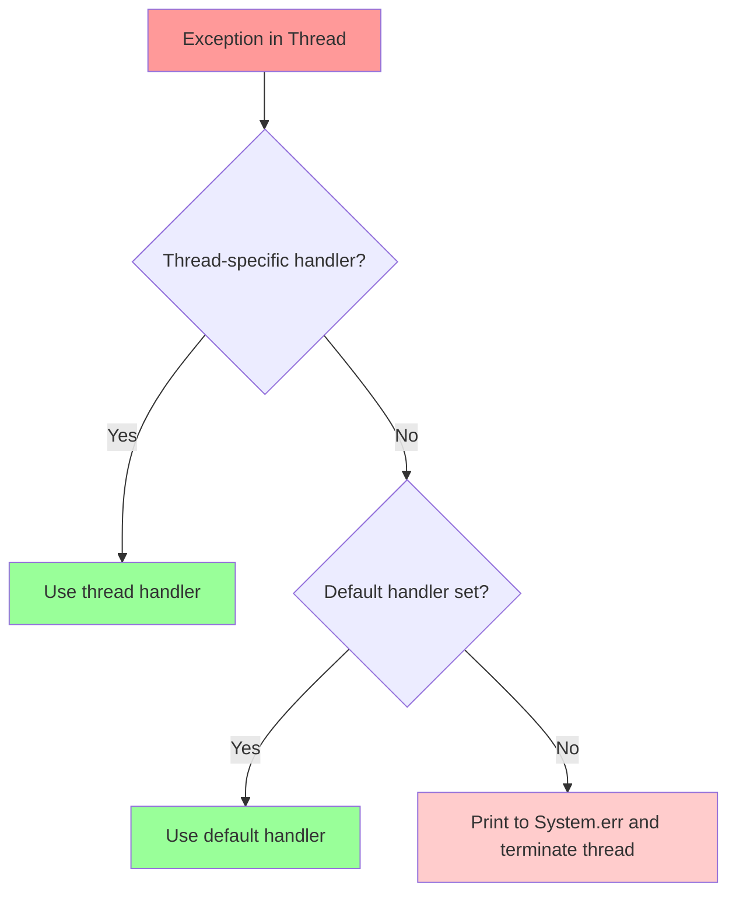

### ExecutorService Exception Handling

```java
import java.util.concurrent.*;

public class ExecutorExceptionHandling {
    
    // Using submit() with Future
    public static void handleWithFuture() {
        ExecutorService executor = Executors.newFixedThreadPool(2);
        
        Future<Integer> future = executor.submit(() -> {
            return 10 / 0; // ArithmeticException
        });
        
        try {
            // Exception is thrown here when we get the result
            Integer result = future.get();
        } catch (ExecutionException e) {
            // Wrapped exception from the task
            Throwable cause = e.getCause();
            System.err.println("Task failed: " + cause.getMessage());
        } catch (InterruptedException e) {
            Thread.currentThread().interrupt();
            System.err.println("Thread interrupted");
        } finally {
            executor.shutdown();
        }
    }
    
    // Using execute() with custom ThreadFactory
    public static void handleWithThreadFactory() {
        ThreadFactory factory = r -> {
            Thread thread = new Thread(r);
            thread.setUncaughtExceptionHandler((t, e) -> {
                System.err.println("Task failed in " + t.getName());
                e.printStackTrace();
            });
            return thread;
        };
        
        ExecutorService executor = Executors.newFixedThreadPool(2, factory);
        
        executor.execute(() -> {
            throw new RuntimeException("Task error!");
        });
        
        executor.shutdown();
    }
    
    // Wrapping tasks with exception handling
    public static void handleWithWrapper() {
        ExecutorService executor = Executors.newFixedThreadPool(2);
        
        Runnable safeTask = wrapWithExceptionHandler(() -> {
            // Your task code
            throw new RuntimeException("Task error!");
        });
        
        executor.execute(safeTask);
        executor.shutdown();
    }
    
    private static Runnable wrapWithExceptionHandler(Runnable task) {
        return () -> {
            try {
                task.run();
            } catch (Exception e) {
                System.err.println("Exception in task: " + e.getMessage());
                e.printStackTrace();
                // Could also re-throw as unchecked if needed
            }
        };
    }
}
```

### CompletableFuture Exception Handling

```java
import java.util.concurrent.CompletableFuture;

public class CompletableFutureExceptions {
    
    public static void basicExceptionHandling() {
        CompletableFuture.supplyAsync(() -> {
            if (Math.random() > 0.5) {
                throw new RuntimeException("Random failure!");
            }
            return "Success";
        })
        .exceptionally(ex -> {
            System.err.println("Caught: " + ex.getMessage());
            return "Default value"; // Provide fallback
        })
        .thenAccept(result -> {
            System.out.println("Result: " + result);
        });
    }
    
    public static void handleWithCompose() {
        CompletableFuture.supplyAsync(() -> {
            return fetchUserId();
        })
        .thenCompose(userId -> {
            return fetchUserDetails(userId);
        })
        .handle((result, ex) -> {
            if (ex != null) {
                System.err.println("Pipeline failed: " + ex.getMessage());
                return getDefaultUser();
            }
            return result;
        })
        .thenAccept(user -> {
            System.out.println("User: " + user);
        });
    }
    
    public static void whenCompletePattern() {
        CompletableFuture.supplyAsync(() -> {
            return performOperation();
        })
        .whenComplete((result, ex) -> {
            if (ex != null) {
                // Log but don't handle - exception still propagates
                System.err.println("Operation failed: " + ex.getMessage());
            } else {
                System.out.println("Operation succeeded: " + result);
            }
        })
        .exceptionally(ex -> {
            // Actually handle the exception
            return "Fallback";
        });
    }
    
    // Helper methods
    private static String fetchUserId() { return "user123"; }
    private static CompletableFuture<String> fetchUserDetails(String id) {
        return CompletableFuture.completedFuture("User details for " + id);
    }
    private static String getDefaultUser() { return "Guest"; }
    private static String performOperation() { return "Result"; }
}
```

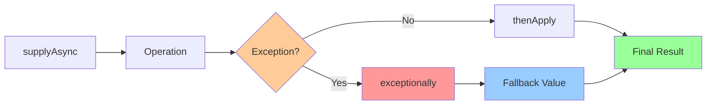

## Testing Exception Handling

### JUnit 5 Exception Testing

```java
import org.junit.jupiter.api.Test;
import static org.junit.jupiter.api.Assertions.*;

public class ExceptionTestExamples {
    
    // Test that exception is thrown
    @Test
    public void testExceptionThrown() {
        Calculator calc = new Calculator();
        
        assertThrows(ArithmeticException.class, () -> {
            calc.divide(10, 0);
        });
    }
    
    // Test exception message
    @Test
    public void testExceptionMessage() {
        Calculator calc = new Calculator();
        
        ArithmeticException exception = assertThrows(
            ArithmeticException.class,
            () -> calc.divide(10, 0)
        );
        
        assertEquals("Cannot divide by zero", exception.getMessage());
    }
    
    // Test exception with custom assertions
    @Test
    public void testCustomException() {
        BankAccount account = new BankAccount(100);
        
        InsufficientFundsException exception = assertThrows(
            InsufficientFundsException.class,
            () -> account.withdraw(150)
        );
        
        assertEquals(50, exception.getShortfall());
        assertTrue(exception.getMessage().contains("Insufficient"));
    }
    
    // Test that exception is NOT thrown
    @Test
    public void testNoException() {
        Calculator calc = new Calculator();
        
        assertDoesNotThrow(() -> {
            calc.divide(10, 2);
        });
    }
    
    // Test exception cause
    @Test
    public void testExceptionCause() {
        DataService service = new DataService();
        
        DataAccessException exception = assertThrows(
            DataAccessException.class,
            () -> service.fetchData()
        );
        
        assertNotNull(exception.getCause());
        assertInstanceOf(SQLException.class, exception.getCause());
    }
}
```

### JUnit 4 Exception Testing

```java
import org.junit.Test;
import org.junit.Rule;
import org.junit.rules.ExpectedException;

public class JUnit4ExceptionTests {
    
    // Using expected attribute
    @Test(expected = ArithmeticException.class)
    public void testDivideByZero() {
        Calculator calc = new Calculator();
        calc.divide(10, 0);
    }
    
    // Using ExpectedException rule (deprecated but still used)
    @Rule
    public ExpectedException thrown = ExpectedException.none();
    
    @Test
    public void testExceptionWithRule() {
        thrown.expect(IllegalArgumentException.class);
        thrown.expectMessage("Age cannot be negative");
        
        Person person = new Person();
        person.setAge(-5);
    }
}
```

### Mockito Exception Testing

```java
import org.junit.jupiter.api.Test;
import org.mockito.Mockito;
import static org.mockito.Mockito.*;
import static org.junit.jupiter.api.Assertions.*;

public class MockitoExceptionTests {
    
    @Test
    public void testMockThrowsException() {
        UserRepository mockRepo = mock(UserRepository.class);
        
        // Configure mock to throw exception
        when(mockRepo.findById(999L))
            .thenThrow(new UserNotFoundException("User not found"));
        
        UserService service = new UserService(mockRepo);
        
        assertThrows(UserNotFoundException.class, () -> {
            service.getUser(999L);
        });
    }
    
    @Test
    public void testExceptionHandling() {
        UserRepository mockRepo = mock(UserRepository.class);
        EmailService mockEmail = mock(EmailService.class);
        
        // Simulate repository failure
        when(mockRepo.save(any(User.class)))
            .thenThrow(new DatabaseException("Connection failed"));
        
        UserService service = new UserService(mockRepo, mockEmail);
        
        try {
            service.createUser(new User("test@test.com"));
            fail("Should have thrown exception");
        } catch (UserCreationException e) {
            // Verify error email was sent
            verify(mockEmail).sendErrorNotification(any());
        }
    }
}
```

## Modern Java Features (Java 9+)

### Try-with-Resources Enhancement (Java 9)

```java
// Java 7-8: Must declare inside try
public void java7Way() throws IOException {
    try (BufferedReader reader = new BufferedReader(new FileReader("file.txt"))) {
        String line = reader.readLine();
    }
}

// Java 9+: Can use effectively final variables
public void java9Way() throws IOException {
    BufferedReader reader = new BufferedReader(new FileReader("file.txt"));
    
    // reader is effectively final, can be used in try-with-resources
    try (reader) {
        String line = reader.readLine();
    }
}

// Multiple resources with existing variables
public void multipleResources() throws IOException {
    FileInputStream input = new FileInputStream("input.txt");
    FileOutputStream output = new FileOutputStream("output.txt");
    
    try (input; output) {
        // Both will be closed automatically
        byte[] buffer = new byte[1024];
        input.read(buffer);
        output.write(buffer);
    }
}
```

### Optional as Exception Alternative (Java 8+)

```java
import java.util.Optional;

public class OptionalInsteadOfExceptions {
    
    // Traditional approach with exceptions
    public User findUserByIdOld(Long id) throws UserNotFoundException {
        User user = database.query(id);
        if (user == null) {
            throw new UserNotFoundException("User not found: " + id);
        }
        return user;
    }
    
    // Modern approach with Optional
    public Optional<User> findUserById(Long id) {
        User user = database.query(id);
        return Optional.ofNullable(user);
    }
    
    // Usage comparison
    public void usageExample() {
        // Old way - must handle exception
        try {
            User user = findUserByIdOld(123L);
            System.out.println(user.getName());
        } catch (UserNotFoundException e) {
            System.out.println("User not found");
        }
        
        // New way - more functional
        findUserById(123L)
            .map(User::getName)
            .ifPresentOrElse(
                name -> System.out.println(name),
                () -> System.out.println("User not found")
            );
    }
    
    // Complex Optional chains
    public String getUserEmail(Long userId) {
        return findUserById(userId)
            .map(User::getProfile)
            .map(Profile::getContact)
            .map(Contact::getEmail)
            .orElse("no-email@example.com");
    }
}
```

### Multi-Catch Type Inference (Java 7+)

```java
public class MultiCatchInference {
    
    public void processData(String data) {
        try {
            // Multiple operations
            validate(data);
            parse(data);
            save(data);
            
        } catch (ValidationException | ParseException | SaveException e) {
            // 'e' is final and has common supertype
            // Can access common methods
            logger.error("Processing failed: " + e.getMessage());
            
            // Can't modify e (it's effectively final)
            // e = new ValidationException(); // Compile error
        }
    }
}
```

## Performance Considerations

### Exception Creation Cost

```java
public class ExceptionPerformance {
    
    // ❌ EXPENSIVE: Creating exceptions is costly
    public static void expensiveApproach() {
        long start = System.nanoTime();
        
        for (int i = 0; i < 10000; i++) {
            try {
                throw new Exception("Error");
            } catch (Exception e) {
                // Handle
            }
        }
        
        long duration = System.nanoTime() - start;
        System.out.println("Exception creation: " + duration / 1000000 + "ms");
    }
    
    // ✅ FAST: Validation without exceptions
    public static void efficientApproach() {
        long start = System.nanoTime();
        
        for (int i = 0; i < 10000; i++) {
            if (someCondition()) {
                // Handle error case
            }
        }
        
        long duration = System.nanoTime() - start;
        System.out.println("Validation: " + duration / 1000000 + "ms");
    }
    
    private static boolean someCondition() { return true; }
}
```

### Cost Breakdown

| Operation | Relative Cost |
|-----------|---------------|
| Simple if check | 1x |
| Exception creation | 100-1000x |
| Exception with stack trace | 1000-10000x |

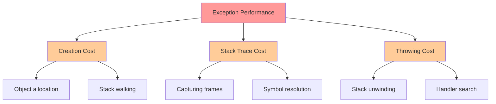

### Optimization Techniques

```java
public class ExceptionOptimization {
    
    // 1. Reuse exception instances for high-frequency cases
    private static final IllegalArgumentException INVALID_INPUT = 
        new IllegalArgumentException("Invalid input");
    
    public void validateInput(String input) {
        if (input == null || input.isEmpty()) {
            throw INVALID_INPUT; // Reuse, no stack trace filled
        }
    }
    
    // 2. Use custom exception without stack trace for control flow
    private static class ControlFlowException extends Exception {
        @Override
        public synchronized Throwable fillInStackTrace() {
            return this; // Don't fill stack trace
        }
    }
    
    // 3. Validate before expensive operations
    public void processFile(String filename) throws ProcessingException {
        // Quick validation first
        if (filename == null || filename.isEmpty()) {
            throw new IllegalArgumentException("Filename required");
        }
        
        File file = new File(filename);
        if (!file.exists()) {
            throw new FileNotFoundException("File not found: " + filename);
        }
        
        if (!file.canRead()) {
            throw new IOException("Cannot read file: " + filename);
        }
        
        // Now do expensive processing
        actuallyProcessFile(file);
    }
    
    private void actuallyProcessFile(File file) throws ProcessingException {
        // Expensive operations here
    }
}
```

## Summary Cheat Sheet

### Exception Type Decision Tree

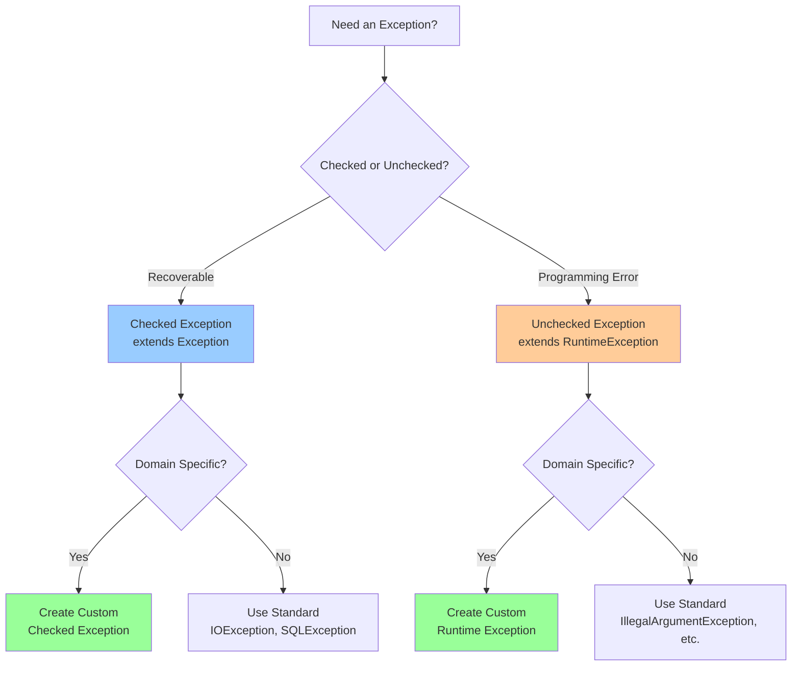

### Quick Reference

| Scenario | Solution | Example |
|----------|----------|---------|
| File operations | Checked exception | `IOException` |
| Invalid arguments | Unchecked exception | `IllegalArgumentException` |
| Null reference | Unchecked exception | `NullPointerException` |
| Business rule violation | Custom checked | `InsufficientFundsException` |
| Configuration error | Custom unchecked | `ConfigurationException` |
| Transient failure | Retry pattern | Network timeout |
| Unrecoverable error | Let it fail | Out of memory |
| Async operation | CompletableFuture | `.exceptionally()` |

### Best Practice Checklist

::: tip Checklist
- [ ] Catch specific exceptions, not generic `Exception`
- [ ] Never swallow exceptions silently
- [ ] Always clean up resources (use try-with-resources)
- [ ] Provide meaningful error messages
- [ ] Document exceptions in Javadoc with `@throws`
- [ ] Preserve original exception when wrapping
- [ ] Don't use exceptions for control flow
- [ ] Don't return from `finally` blocks
- [ ] Don't catch `Throwable` or `Error`
- [ ] Use Optional instead of exceptions where appropriate
- [ ] Log or throw, not both
- [ ] Validate early, fail fast
- [ ] Test your exception handling
:::

---

## Conclusion

Exception handling is a critical part of Java programming that enables robust, maintainable applications. Key takeaways:

1. **Understand the hierarchy**: Know when to use checked vs unchecked exceptions
2. **Be specific**: Catch and throw specific exception types
3. **Clean up properly**: Use try-with-resources for automatic resource management
4. **Fail gracefully**: Provide meaningful error messages and recovery options
5. **Design for errors**: Consider exception handling in your architecture
6. **Test thoroughly**: Ensure your error paths are well-tested
7. **Consider performance**: Don't use exceptions for control flow
8. **Use modern features**: Leverage Java 8+ features like Optional and enhanced try-with-resources

::: info Further Learning
- Effective Java (Joshua Bloch) - Exception handling best practices
- Java Concurrency in Practice - Exception handling in concurrent code
- Clean Code (Robert Martin) - Error handling principles
- Official Java Documentation - Exception handling tutorial
:::

Happy coding! 🚀