# Java Multi-Threading

## Introduction

Multitasking is a process of executing multiple tasks concurrently. It can be achieved in two ways:

- **Multiprocessing**
- **Multithreading**

### Multiprocessing

Executing more than one process simultaneously is called Multiprocessing. Multiprocessing is best suitable at System level.

::: tip Examples
- Developing Java Program
- Listening to music
- Downloading file from network
- Printing documents
:::

### Multithreading

Executing more than one thread simultaneously is called Multithreading. Multithreading is best suitable at User Application level.

::: tip Examples
**Login Application:** Multiple users trying to login at the same time.

**MS Word:** When typing text, following threads execute concurrently:
- Autocorrect option
- Indentation
- Spell checker
- Auto save option
:::

### Comparison: Multiprocessing vs Multithreading

| Multiprocessing | Multithreading |
|-----------------|----------------|
| Process is also called as a task which is an executing instance of a program | A thread is a lightweight subprocess and executed within the process |
| Executing more than one process simultaneously | Executing more than one thread simultaneously |
| Multiple processes utilize different memory areas | Multiple threads utilize same memory area |
| Data sharing between processes is usually more expensive | Data sharing between threads is usually less expensive |
| Context switching between processes is usually more expensive | Context switching between threads is usually less expensive |

## List of Threads

```java
import java.util.*;

class Lab678 {
    public static void main(String args[]) {
        System.out.println("Main Begin");
        Thread thread = Thread.currentThread();
        Map<Thread, StackTraceElement[]> mymap = thread.getAllStackTraces();
        Set<Thread> mythreads = mymap.keySet();
        for(Thread th : mythreads) {
            System.out.println(th);
        }
        System.out.println("Main End");
    }
}
```

::: info Thread Groups Created by JVM
**Q: How many thread groups created by JVM?**

**A:** 2 thread groups
- system group
- main group
:::

::: info Threads Created by JVM
**Q: How many threads created by JVM?**

**A:** 5 threads

**a) system group:**
1. Finalizer
2. Attach Listener
3. Signal Dispatcher
4. Reference Handler

**b) main group:**
1. main thread
:::

## Main Thread

```java
class Lab679 {
    public static void main(String args[]) {
        Thread th = Thread.currentThread();
        System.out.println(th);
        for(int i = 1; i <= 5; i++) {
            System.out.println(" i = " + i + " by " + th.getName());
            try {
                Thread.sleep(1000);
            } catch(Exception ex) {
                System.out.println(ex);
            }
        }
    }
}
```

### JVM Initialization Process

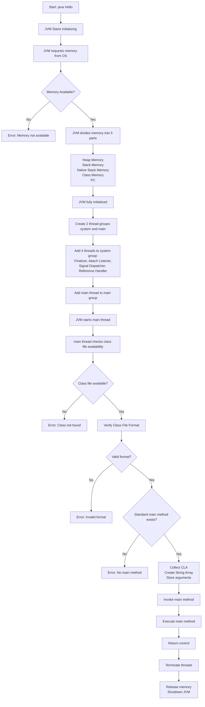

## Thread API

Developing thread-based programs in Java is easy because Java comes with a simple API for threading.

### Core Classes

::: details Classes for Threading
- `java.lang.Thread`
- `java.lang.ThreadGroup`
- `java.util.concurrent.Executors` (From Java 5)
- `java.util.concurrent.ThreadPoolExecutor` (From Java 5)
:::

::: details Interfaces for Threading
- `java.lang.Runnable`
- `java.util.concurrent.Executor` (From Java 5)
- `java.util.concurrent.ExecutorService` (From Java 5)
:::

### Runnable Interface Methods

| Method | Description |
|--------|-------------|
| `public abstract void run()` | When the thread starts then run() method is called as separate execution |

### ThreadGroup Class

#### Constructors

| Constructor | Description |
|-------------|-------------|
| `ThreadGroup(String)` | Constructor to create the object of ThreadGroup by providing name |
| `ThreadGroup(ThreadGroup, String)` | Constructor to create the object of ThreadGroup by providing Parent threadgroup and name |

#### Methods

| Method | Description |
|--------|-------------|
| `public final String getName()` | Returns the name of this thread group |
| `public final ThreadGroup getParent()` | Returns the parent of this thread group |
| `public final boolean parentOf(ThreadGroup)` | Tests if this thread group is either the thread group argument or parent of that thread group |
| `public final int getMaxPriority()` | Returns the maximum priority of this thread group |
| `public final void setMaxPriority(int)` | Sets the maximum priority of the group |
| `public final boolean isDaemon()` | Tests if this thread group is a daemon thread group |
| `public final void setDaemon(boolean)` | Changes the daemon status of this thread group |
| `public synchronized boolean isDestroyed()` | Tests if this thread group has been destroyed |
| `public int activeCount()` | Returns an estimate of the number of active threads in this thread group and its subgroups |
| `public final void stop()` | Stops this thread group |

### Thread Class

#### Constants

| Constant | Description |
|----------|-------------|
| `static final int MIN_PRIORITY` | Constant represents minimum priority of a thread (1) |
| `static final int NORM_PRIORITY` | Constant represents normal priority of a thread (5) |
| `static final int MAX_PRIORITY` | Constant represents maximum priority of a thread (10) |

#### Constructors

| Constructor | Description |
|-------------|-------------|
| `Thread()` | Creates a new Thread object. When started then run() will be invoked from the current object |
| `Thread(Runnable)` | Creates a new Thread object. When started then run() will be invoked from specified Runnable object |
| `Thread(String)` | Creates a new Thread object by specifying the name |
| `Thread(ThreadGroup, String)` | Creates a new Thread object by specifying the threadgroup name |
| `Thread(ThreadGroup, Runnable)` | Creates a new Thread object by specifying the threadgroup Runnable object |
| `Thread(Runnable, String)` | Creates a new Thread object by specifying the Runnable object and thread name |
| `Thread(ThreadGroup, Runnable, String)` | Creates a new Thread object by specifying the ThreadGroup, Runnable object and thread name |

#### Methods

| Method | Description |
|--------|-------------|
| `static native Thread currentThread()` | Returns a reference to the currently executing thread object |
| `synchronized void start()` | Causes this thread to begin execution; the JVM calls the run method of this thread |
| `void run()` | Inherited from Runnable Interface |
| `long getId()` | Returns the identifier of this Thread |
| `final native boolean isAlive()` | Tests if this thread is alive |
| `final void stop()` | Stops this thread execution |
| `final void setPriority(int)` | Changes the priority of this thread |
| `final int getPriority()` | Returns this thread's priority |
| `final synchronized void setName(String)` | Changes the name of this thread |
| `final String getName()` | Returns this thread's name |
| `final ThreadGroup getThreadGroup()` | Returns the thread group to which this thread belongs |
| `static int activeCount()` | Returns an estimate of the number of active threads in the current thread's thread group |
| `boolean isInterrupted()` | Tests whether the current thread has been interrupted |
| `void interrupt()` | Interrupts this thread |
| `final void setDaemon(boolean)` | Marks this thread as either a daemon thread or a user thread |
| `final boolean isDaemon()` | Tests if this thread is a daemon thread |
| `Thread.State getState()` | Returns the state of this thread |
| `static native void yield()` | A hint to the scheduler that the current thread is willing to leave its current use of a processor |
| `static native void sleep(long)` | Causes the currently executing thread to sleep for the specified number of milliseconds |
| `static void sleep(long, int)` | Causes the currently executing thread to sleep for the specified number of milliseconds plus nanoseconds |
| `final synchronized void join(long)` | Waits at most millis milliseconds for this thread to die |
| `final synchronized void join(long, int)` | Waits at most millis milliseconds plus nanos nanoseconds for this thread to die |
| `final void join()` | Waits for this thread to die |

#### Thread States

| State | Description |
|-------|-------------|
| `NEW` | Thread is created but not started |
| `RUNNABLE` | Thread is ready to run or running |
| `BLOCKED` | Thread is blocked waiting for a monitor lock |
| `WAITING` | Thread is waiting indefinitely |
| `TIMED_WAITING` | Thread is waiting for a specified time |
| `TERMINATED` | Thread has completed execution |

## Developing Threads

By default, JVM is responsible to create and start the main Thread. If you want to develop your own thread, it must be created and started from the main thread.

Threads created by the user are called **child threads** or **user threads**.

### Two Ways to Create Threads

::: code-group

```java [Extending Thread Class]
// 1. Define your own thread class by extending Thread class
class MyThread extends Thread {
    // 2. Override the run() method
    public void run() {
        Thread th = Thread.currentThread();
        for(int i = 1; i <= 5; i++) {
            System.out.println("Val - " + i + " by " + th.getName());
            try {
                Thread.sleep(1000);
            } catch(Exception ex) {
                System.out.println(ex);
            }
        }
    }
}

class Lab680 {
    public static void main(String as[]) {
        // 3. Create the object of Thread sub class
        MyThread myth1 = new MyThread();
        // 4. Call the start() method
        myth1.start();
        
        MyThread myth2 = new MyThread();
        myth2.start();
        
        Thread th = Thread.currentThread();
        for(int i = 1; i <= 5; i++) {
            System.out.println(" Hello Guys " + i + " by " + th.getName());
            try {
                Thread.sleep(1000);
            } catch(Exception ex) {
                System.out.println(ex);
            }
        }
    }
}
```

```java [Implementing Runnable]
// 1. Define your own thread class by implementing Runnable
class MyThread implements Runnable {
    // 2. Override the run() method
    public void run() {
        Thread th = Thread.currentThread();
        for(int i = 1; i <= 5; i++) {
            System.out.println(" Val - " + i + " by " + th.getName());
            try {
                Thread.sleep(1000);
            } catch(Exception ex) {
                System.out.println(ex);
            }
        }
    }
}

class Lab681 {
    public static void main(String as[]) {
        Runnable runnable = new MyThread();
        // 3. Create Thread object by passing Runnable object
        Thread th1 = new Thread(runnable);
        // 4. Call the start() method
        th1.start();
        
        Thread th2 = new Thread(runnable);
        th2.start();
        
        Thread th = Thread.currentThread();
        for(int i = 1; i <= 5; i++) {
            System.out.println(" Hello Guys " + i + " by " + th.getName());
            try {
                Thread.sleep(1000);
            } catch(Exception ex) {
                System.out.println(ex);
            }
        }
    }
}
```

:::

## Thread Name

When you create a thread object, JVM assigns a default name for that thread.

::: info Default Thread Names
Default thread names assigned by JVM look like:
- `Thread-0`
- `Thread-1`
- `Thread-2`
- etc.
:::

### Setting Custom Thread Names

You can set custom names in two ways:

1. **Using Constructor:** Pass your own name as parameter to Thread constructor
2. **Using Method:** `public final void setName(String name)`

**Getting Thread Name:** `public final String getName()`

### Example

::: code-group

```java [Extending Thread]
class MyThread extends Thread {
    public MyThread() {
        super(); // Thread();
    }
    
    public MyThread(String tname) {
        super(tname); // Thread(String);
    }
    
    public void run() {
        Thread th = Thread.currentThread();
        System.out.println(th);
        for(int i = 1; i <= 5; i++) {
            System.out.println(" Val = " + i + " by " + th.getName());
            try {
                Thread.sleep(500);
            } catch(Exception ex) {
                System.out.println(ex);
            }
        }
    }
}

class Lab682 {
    public static void main(String args[]) {
        MyThread myth1 = new MyThread("A");
        myth1.start();
        
        MyThread myth2 = new MyThread("B");
        myth2.start();
        
        MyThread myth3 = new MyThread();
        myth3.start();
    }
}
```

```java [Implementing Runnable]
class MyThread implements Runnable {
    public void run() {
        Thread th = Thread.currentThread();
        System.out.println(th);
        for(int i = 1; i <= 5; i++) {
            System.out.println(" Val = " + i + " by " + th.getName());
            try {
                Thread.sleep(500);
            } catch(Exception ex) {
                System.out.println(ex);
            }
        }
    }
}

class Lab683 {
    public static void main(String args[]) {
        Runnable runnable = new MyThread();
        
        Thread th1 = new Thread(runnable, "A");
        th1.start();
        
        Thread th2 = new Thread(runnable, "B");
        th2.start();
        
        Thread th3 = new Thread(runnable);
        th3.start();
    }
}
```

:::

## Thread Priority

The priority is an integer number assigned to each thread that will be used to give more preferences to higher priority threads while allocating CPU time.

::: warning OS Dependency
If your operating system is not following Priority-based scheduling, then there is no use of priority.
:::

### Priority Constants

```java
public static final int MIN_PRIORITY = 1;
public static final int NORM_PRIORITY = 5;
public static final int MAX_PRIORITY = 10;
```

### Priority Rules

- You can assign priority ranging from **1 to 10** only
- When JVM creates the main thread, **NORM_PRIORITY** (5) is assigned
- When you create a child thread from main thread, child thread priority is **same as main thread priority**

### Priority Methods

| Method | Description |
|--------|-------------|
| `int getPriority()` | Get the current priority of thread |
| `void setPriority(int)` | Modify the current priority of thread |

## ThreadGroup

**ThreadGroup** is a class available in `java.lang` package that represents a collection of multiple threads.

### Key Concepts

- When you create a child thread from main thread, the child thread is added to thread group named **"main"**
- To add thread to your own group, use Thread constructor with ThreadGroup object as parameter
- Access thread group using: `public final ThreadGroup getThreadGroup()`

### Constructor Patterns

::: details When Extending Thread Class

```java
// Default Thread Name and Default ThreadGroup
public Thread();

// Custom Thread Name and Default ThreadGroup
public Thread(String);

// Custom Thread Name and Custom ThreadGroup
public Thread(ThreadGroup, String);
```

:::

::: details When Implementing Runnable Interface

```java
// Default Thread Name and Default ThreadGroup
public Thread(Runnable);

// Custom Thread Name and Default ThreadGroup
public Thread(Runnable, String);

// Default Thread Name and Custom ThreadGroup
public Thread(ThreadGroup, Runnable);

// Custom Thread Name and Custom ThreadGroup
public Thread(ThreadGroup, Runnable, String);
```

:::

### Example with ThreadGroup

::: code-group

```java [Extending Thread]
class MyThread extends Thread {
    public MyThread() {
        super(); // Thread();
    }
    
    public MyThread(String tname) {
        super(tname); // Thread(String);
    }
    
    public MyThread(ThreadGroup tg, String tname) {
        super(tg, tname); // Thread(ThreadGroup, String);
    }
    
    public void run() {
        Thread th = Thread.currentThread();
        for(int i = 1; i <= 5; i++) {
            System.out.println(" Val = " + i + " by " + th.getName());
            try {
                Thread.sleep(500);
            } catch(Exception ex) {
                System.out.println(ex);
            }
        }
    }
}

class Lab684 {
    public static void main(String args[]) {
        Thread th = Thread.currentThread();
        th.setPriority(1);
        
        ThreadGroup jlcGroup = new ThreadGroup("JLC");
        
        MyThread myth1 = new MyThread(jlcGroup, "A");
        myth1.setPriority(6);
        myth1.start();
        
        MyThread myth2 = new MyThread(jlcGroup, "B");
        myth2.setPriority(6);
        myth2.start();
        
        MyThread myth3 = new MyThread("C");
        myth3.start();
        
        System.out.println(th);
        System.out.println(myth1);
        System.out.println(myth2);
        System.out.println(myth3);
    }
}
```

```java [Implementing Runnable]
class MyThread implements Runnable {
    public void run() {
        Thread th = Thread.currentThread();
        for(int i = 1; i <= 5; i++) {
            System.out.println(" Val = " + i + " by " + th.getName());
            try {
                Thread.sleep(500);
            } catch(Exception ex) {
                System.out.println(ex);
            }
        }
    }
}

class Lab685 {
    public static void main(String args[]) {
        Thread th = Thread.currentThread();
        th.setPriority(1);
        
        ThreadGroup jlcGroup = new ThreadGroup("MyJLC");
        
        Runnable runnable = new MyThread();
        
        Thread th1 = new Thread(jlcGroup, runnable, "A");
        th1.setPriority(9);
        th1.start();
        
        Thread th2 = new Thread(jlcGroup, runnable, "B");
        th2.setPriority(9);
        th2.start();
        
        Thread th3 = new Thread(runnable, "C");
        th3.start();
        
        System.out.println(th);
        System.out.println(th1);
        System.out.println(th2);
        System.out.println(th3);
    }
}
```

:::

## Life Cycle of Thread

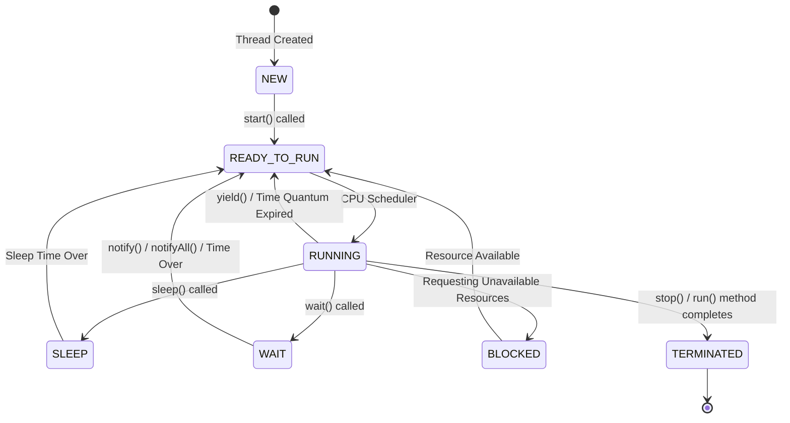

### Thread States Explained

| State | Description |
|-------|-------------|
| **NEW** | When you create the thread |
| **READY TO RUN** | When you start the thread, it waits for CPU time |
| **RUNNING** | Thread utilizes CPU time, executes run() method tasks |
| **SLEEP** (TIMED_WAITING) | Thread moves here when sleep() is called, stays for specified time, then moves to READY TO RUN |
| **WAIT** | Thread moves here when wait() is called, moves to READY TO RUN when notify()/notifyAll() is called or time is over |
| **BLOCKED** | Thread requesting unavailable resources, moves to READY TO RUN when resource becomes available |
| **TERMINATED** (DEAD) | Thread moves here when stop()/destroy() is called or run() method completes. Once dead, thread cannot come back |

### Deadlocks

::: danger Deadlock Warning
Blocked state is very dangerous and may lead to **Deadlocks**.
:::

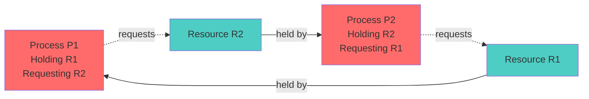

**Deadlock occurs when:**
- Process P1 holds Resource R1 and requests Resource R2
- Process P2 holds Resource R2 and requests Resource R1
- Both processes are in BLOCKED state and will not come out

### Example: Thread States

```java
class MyThread implements Runnable {
    public void run() {
        Thread th = Thread.currentThread();
        for(int i = 1; i <= 5; i++) {
            System.out.println(" Val = " + i + " by " + 
                th.getName() + " - " + th.getState());
            try {
                Thread.sleep(500);
            } catch(Exception ex) {
                System.out.println(ex);
            }
        }
    }
}

class Lab686 {
    public static void main(String args[]) throws Exception {
        Runnable runnable = new MyThread();
        Thread th = new Thread(runnable, "A");
        
        System.out.println("1. " + th.getState()); // NEW
        th.start();
        System.out.println("2. " + th.getState()); // RUNNABLE
        Thread.sleep(500);
        System.out.println("3. " + th.getState()); // TIMED_WAITING
        Thread.sleep(500);
        System.out.println("4. " + th.getState()); // RUNNABLE or TERMINATED
    }
}
```

## Synchronization

When multiple threads access the same object at a time, you may get inconsistent results. **Synchronization** is used to avoid this inconsistency.

### What is Synchronization?

- Synchronization is the process of enabling the lock of an object
- Every object has a lock, disabled by default
- When the lock is enabled, only **one thread** is allowed to access that object at a time

### Types of Synchronization

1. **Method Level Synchronization**
2. **Block Level Synchronization**

### Method Level Synchronization

Applying `synchronized` keyword for the method.

::: code-group

```java [Syntax]
[modifiers] synchronized <retType> <methodName>(<params>) {
    // method body
}
```

```java [Example]
public synchronized void show() {
    // synchronized code
}
```

:::

::: info Synchronization Rules
- Can be applied to both **instance** and **static** methods
- When instance method is synchronized: the object used to invoke the method is locked
- When static method is synchronized: the default object of the invoking class is locked
:::

### Block Level Synchronization

Applying `synchronized` keyword for local blocks.

::: code-group

```java [Syntax]
synchronized (<objectReference>) {
    // Statements
}
```

```java [Example]
class Hello {
    ArrayList al = new ArrayList();
    
    void show() {
        // non-synchronized code
        synchronized(al) {
            // synchronized code
        }
        // non-synchronized code
    }
}
```

:::

### Different Synchronization Patterns

```java
class Hello {
    void m1() {
        synchronized(this.getClass()) {
            // Default object of class will be locked
        }
    }
    
    static void m2() {
        synchronized(Hello.class) {
            // Default object of class will be locked
        }
    }
    
    void m3() {
        synchronized(this) {
            // Current object of class will be locked
        }
    }
    
    void m4() {
        ArrayList al = new ArrayList();
        synchronized(al) {
            // Third party object will be locked
        }
    }
}
```

### Practical Example: Bank Account

```java
class Account {
    int bal = 970;
    
    public int getBal() {
        return bal;
    }
    
    public synchronized void withdraw(int amt) {
        Thread th = Thread.currentThread();
        if(bal >= amt) {
            System.out.println(th.getName() + " is going to withdraw: " + bal);
            try {
                Thread.sleep(1000);
            } catch(Exception ex) { }
            bal = bal - amt;
            System.out.println(th.getName() + " has completed withdraw: " + bal);
        } else {
            System.out.println("Sorry, No Funds for " + th.getName());
        }
    }
}

class AccountThread implements Runnable {
    Account acc;
    
    AccountThread(Account acc) {
        this.acc = acc;
    }
    
    public void run() {
        for(int i = 1; i <= 5; i++) {
            acc.withdraw(225);
            if(acc.getBal() < 0) {
                System.out.println("OOOO- Amount is Overdrawn");
            }
        }
    }
}

class Lab687 {
    public static void main(String args[]) throws Exception {
        Account acc = new Account();
        Runnable runnable = new AccountThread(acc);
        
        Thread th1 = new Thread(runnable, "A");
        th1.start();
        
        Thread th2 = new Thread(runnable, "B");
        th2.start();
    }
}
```

## Synchronization Cases

### Case 1: Non-Synchronized Methods, Different Objects

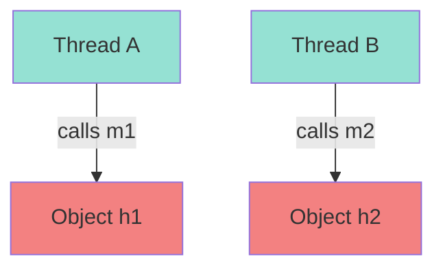

::: info Result
- **Threads run concurrently?** Yes
- **Chance of inconsistent results?** No
:::

### Case 2: Non-Synchronized Methods, Same Object

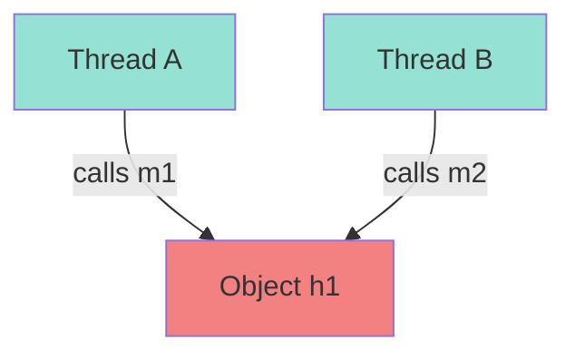

::: warning Result
- **Threads run concurrently?** Yes
- **Chance of inconsistent results?** **Yes**
:::

### Case 3: Both Methods Synchronized, Same Object

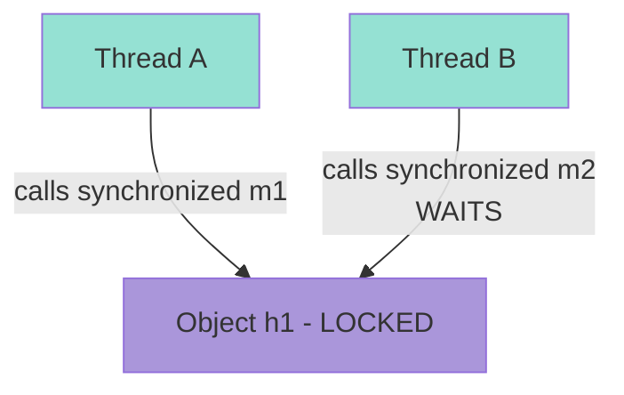

::: tip Result
- **Threads run concurrently?** No, runs one by one
- **Chance of inconsistent results?** No
:::

### Case 4: One Synchronized Method, Same Object

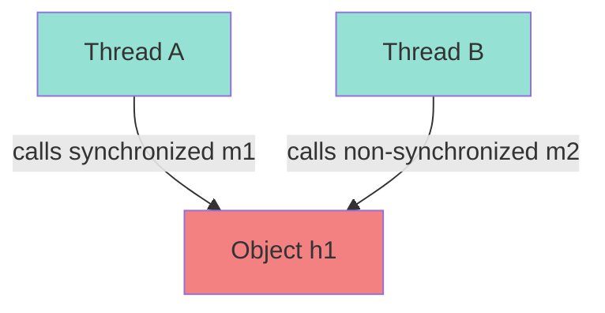

::: warning Result
- **Threads run concurrently?** Yes
- **Chance of inconsistent results?** **Yes**
:::

### Case 5: Instance Synchronized vs Static Synchronized

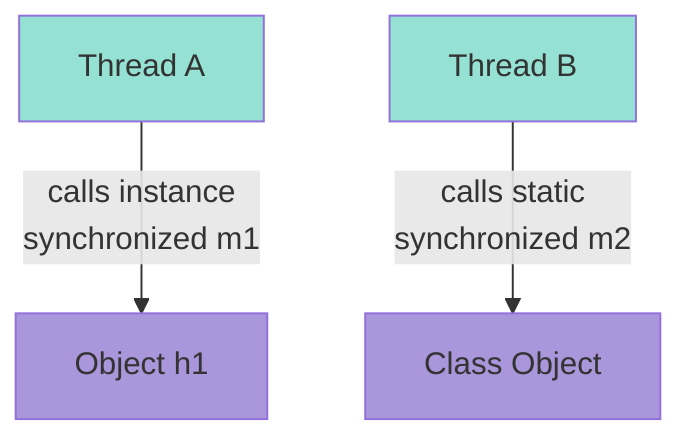

::: info Result
- **Threads run concurrently?** Yes (different locks)
- **Chance of inconsistent results?** No
:::

### Case 6: Both Static Synchronized

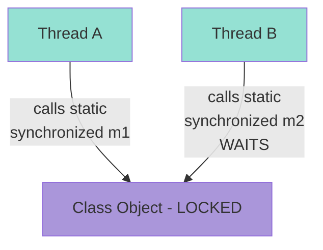

::: warning Result
- **Threads run concurrently?** No, runs one by one
- **Chance of inconsistent results?** Maybe Yes
:::

## wait() Method

The `wait()` method is an instance method available in `java.lang.Object` class.

### wait() Method Signatures

```java
public final void wait()
public final native void wait(long ms)
public final void wait(long ms, int ns)
```

### Key Points

::: danger Critical Rules
- `wait()` method **must** be called on **Locked Object** only
- Calling `wait()` on unlocked object throws `IllegalMonitorStateException` at runtime
:::

### What Happens When wait() is Called?

When you call `wait()` method on locked object:
1. **Lock on the Object is released**
2. **Thread moves to WAIT State**

### wait() vs sleep()

| wait() | sleep() |
|--------|---------|
| Must be called on locked object | Can be called on locked or unlocked object |
| Lock is **released** | Lock is **NOT released** (thread holds the lock) |
| Thread moves to WAIT state | Thread moves to SLEEP state |

### Examples

::: code-group

```java [Method Level Synchronization]
class Hello {
    public synchronized void show() {
        Thread th = Thread.currentThread();
        for(int i = 1; i <= 5; i++) {
            System.out.println(th.getName() + " - show : " + i);
            try {
                // Thread.sleep(1000);  // Keeps the lock
                // wait(1000);          // Releases the lock
                this.wait(1000);        // Releases the lock
            } catch(Exception ex) {
                System.out.println(ex);
            }
        }
    }
}

class MyThread implements Runnable {
    Hello hello;
    
    MyThread(Hello hello) {
        this.hello = hello;
    }
    
    public void run() {
        hello.show();
    }
}

class Lab696 {
    public static void main(String args[]) {
        Hello hello = new Hello();
        Runnable runnable = new MyThread(hello);
        
        Thread th1 = new Thread(runnable, "A");
        th1.start();
        
        Thread th2 = new Thread(runnable, "B");
        th2.start();
    }
}
```

```java [Block Level Synchronization]
import java.util.*;

class Hello {
    List<String> mylist;
    
    Hello(List<String> mylist) {
        this.mylist = mylist;
    }
    
    public void show() {
        Thread th = Thread.currentThread();
        synchronized(mylist) {
            for(String x : mylist) {
                System.out.println(th.getName() + " - show : " + x);
                try {
                    // this.wait(1000);    // Wrong! this is not locked
                    mylist.wait(1000);     // Correct! mylist is locked
                } catch(Exception ex) {
                    System.out.println(ex);
                }
            }
        }
    }
}

class MyThread implements Runnable {
    Hello hello;
    
    MyThread(Hello hello) {
        this.hello = hello;
    }
    
    public void run() {
        hello.show();
    }
}

class Lab697 {
    public static void main(String args[]) {
        List<String> mylist = new ArrayList<>();
        mylist.add("Java");
        mylist.add("JDBC");
        mylist.add("Servlets");
        mylist.add("JSP");
        mylist.add("Hibernate");
        mylist.add("Spring");
        mylist.add("SpringBoot");
        mylist.add("React");
        
        Hello hello = new Hello(mylist);
        Runnable runnable = new MyThread(hello);
        
        Thread th1 = new Thread(runnable, "A");
        th1.start();
        
        Thread th2 = new Thread(runnable, "B");
        th2.start();
    }
}
```

:::

## notify() and notifyAll() Methods

These methods are instance methods available in `java.lang.Object` class.

### notify() Method Behavior

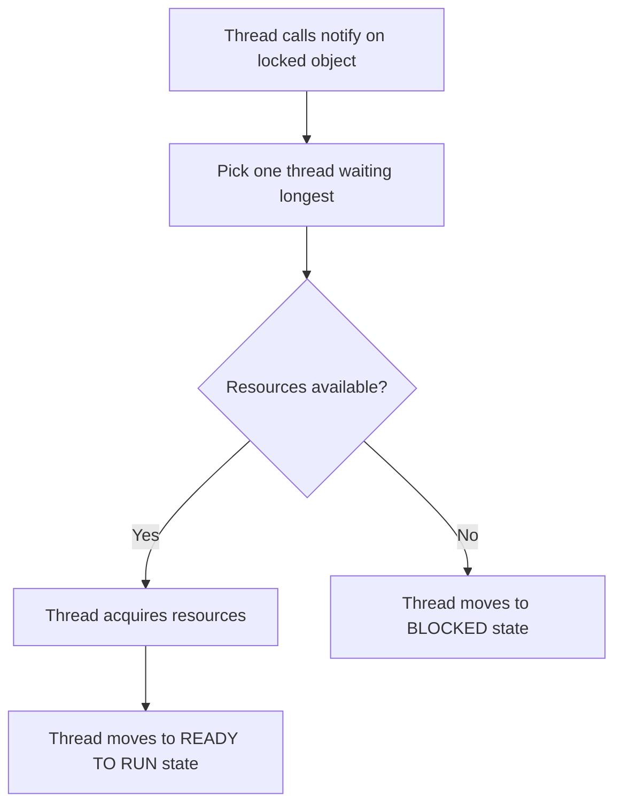

When you call `notify()` method on any locked object:
1. Only **one thread** which has been waiting for the longest time is picked
2. Checks whether the resources released by the thread are available
3. If resources are **available**: thread acquires resources and goes to **READY TO RUN** state
4. If resources are **not available**: thread goes to **BLOCKED** state

### notifyAll() Method Behavior

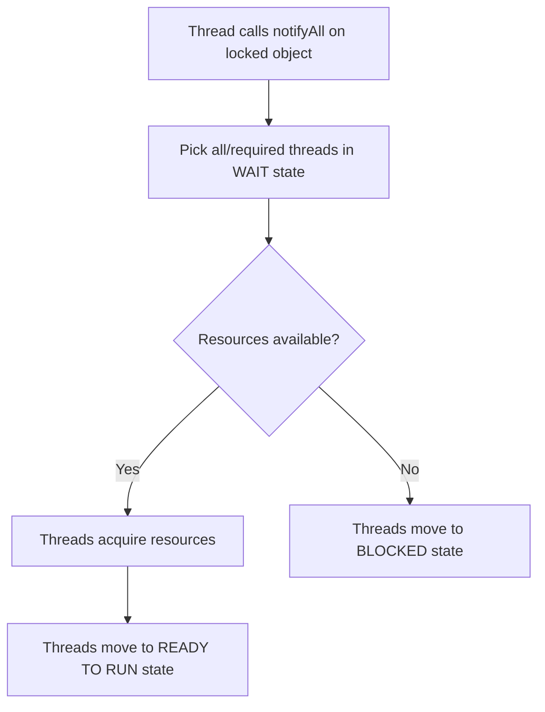

When you call `notifyAll()` method on any locked object:
1. **All or some required number** of threads in WAIT state are picked
2. Checks whether the resources released are available
3. If resources are **available**: threads acquire resources and go to **READY TO RUN** state
4. If resources are **not available**: threads go to **BLOCKED** state

### Producer-Consumer Example

```java
class MyStack {
    int data;
    boolean flag;
    
    synchronized void push(int x) {
        if(flag == true) {
            try {
                wait();
            } catch(Exception ex) {
                System.out.println(ex);
            }
        }
        this.data = x;
        System.out.println(data + " is Pushed by A");
        flag = true;
        notify();
    }
    
    synchronized void pop() {
        if(flag == false) {
            try {
                wait();
            } catch(Exception ex) {
                System.out.println(ex);
            }
        }
        try {
            Thread.sleep(1000);
        } catch(Exception ex) {
            System.out.println(ex);
        }
        flag = false;
        System.out.println(data + " is Poped by B");
        notify();
    }
}

class ThreadA implements Runnable {
    MyStack mystack;
    
    ThreadA(MyStack mystack) {
        this.mystack = mystack;
    }
    
    public void run() {
        int a = 10;
        for(int i = 1; i <= 5; i++) {
            mystack.push(a);
            a = a + 10;
        }
    }
}

class ThreadB implements Runnable {
    MyStack mystack;
    
    ThreadB(MyStack mystack) {
        this.mystack = mystack;
    }
    
    public void run() {
        for(int i = 1; i <= 5; i++) {
            mystack.pop();
        }
    }
}

class Lab698 {
    public static void main(String args[]) {
        MyStack mystack = new MyStack();
        
        Runnable runnableA = new ThreadA(mystack);
        Runnable runnableB = new ThreadB(mystack);
        
        Thread th1 = new Thread(runnableA, "A");
        th1.start();
        
        Thread th2 = new Thread(runnableB, "B");
        th2.start();
    }
}
```

## Thread and Stack Memory

When you execute multiple threads, a **separate STACK** is created for each thread.

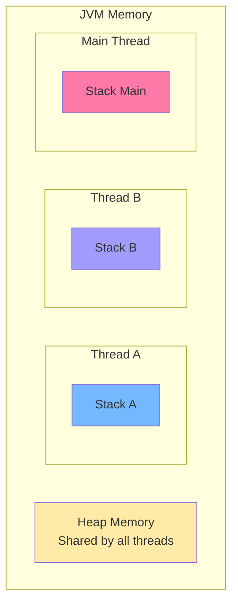

::: tip Important
When any exception occurs in **one thread** execution, **other thread** execution will **not be terminated**.
:::

### Example: Exception in One Thread

```java
class Hello {
    public void m1() {
        Thread th = Thread.currentThread();
        for(int i = 1; i <= 5; i++) {
            System.out.println(th.getName() + " - m1 : " + i);
            if(i == 3)
                throw new ArithmeticException();
            try {
                Thread.sleep(1000);
            } catch(Exception ex) { }
        }
    }
    
    public void m2() {
        Thread th = Thread.currentThread();
        for(int i = 101; i <= 105; i++) {
            System.out.println(th.getName() + " - m2 : " + i);
            try {
                Thread.sleep(1000);
            } catch(Exception ex) { }
        }
    }
}

class ThreadA implements Runnable {
    Hello hello;
    
    ThreadA(Hello hello) {
        this.hello = hello;
    }
    
    public void run() {
        hello.m1();
    }
}

class ThreadB implements Runnable {
    Hello hello;
    
    ThreadB(Hello hello) {
        this.hello = hello;
    }
    
    public void run() {
        hello.m2();
    }
}

class Lab699 {
    public static void main(String args[]) {
        Hello h1 = new Hello();
        
        Runnable runA = new ThreadA(h1);
        Runnable runB = new ThreadB(h1);
        
        Thread th1 = new Thread(runA, "A");
        th1.start();
        
        Thread th2 = new Thread(runB, "B");
        th2.start();
        
        Thread th = Thread.currentThread();
        for(int i = 201; i <= 205; i++) {
            System.out.println(th.getName() + " - main : " + i);
            try {
                Thread.sleep(1000);
            } catch(Exception ex) { }
        }
    }
}
```

## join() Method

This method is used to **join one thread at the end of another thread**.

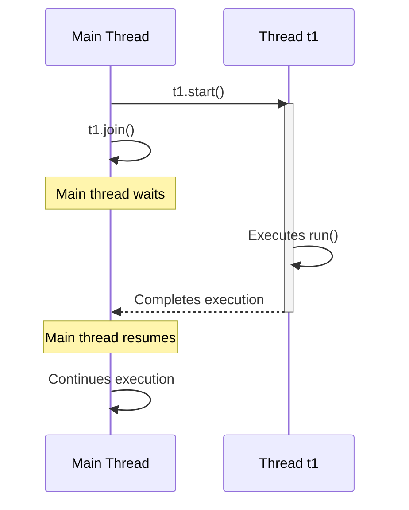

### Usage

- In Main thread → `t1.join()` - Main thread will be joined at the end of t1
- In t1 thread → `t2.join()` - t1 thread will be joined at the end of t2

### Example

```java
class Hello {
    public void show() {
        Thread th = Thread.currentThread();
        for(int i = 101; i <= 105; i++) {
            System.out.println(th.getName() + " : " + i);
            try {
                Thread.sleep(1000);
            } catch(Exception ex) { }
        }
    }
}

class HelloThread implements Runnable {
    Hello hello;
    
    HelloThread(Hello hello) {
        this.hello = hello;
    }
    
    public void run() {
        hello.show();
    }
}

class Lab700 {
    public static void main(String args[]) throws Exception {
        Hello hello = new Hello();
        Runnable runnable = new HelloThread(hello);
        
        Thread th1 = new Thread(runnable, "hello");
        th1.start();
        th1.join();  // Main thread waits for th1 to complete
        
        Thread th = Thread.currentThread();
        for(int i = 201; i <= 205; i++) {
            System.out.println(th.getName() + " : " + i);
            Thread.sleep(1000);
        }
    }
}
```

## Daemon Threads

There are two types of threads in Java:

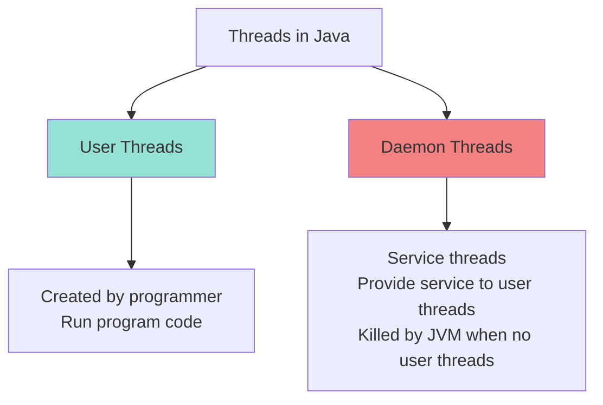

### User Threads

- All threads created by programmer are **user threads** unless specified as daemon
- User threads are generally responsible to run your program code

### Daemon Threads

- Daemon threads are generally **service threads** which run to provide service to user threads
- Daemon threads run parallel to user threads but **JVM kills them** at any time when **no user threads are running**
- **Garbage collector** is an example of daemon thread
- Thread **cannot be marked as daemon** once it is started

### Methods

| Method | Description |
|--------|-------------|
| `public final boolean isDaemon()` | Verify whether the thread is DAEMON or not |
| `public final void setDaemon(boolean daemon)` | Mark the thread as DAEMON or not |

### Example

```java
class HelloThread implements Runnable {
    public void run() {
        Thread th = Thread.currentThread();
        for(int i = 101; i <= 125; i++) {
            System.out.println(th.getName() + " : " + i + " - " + th.isDaemon());
            try {
                Thread.sleep(1000);
            } catch(Exception ex) {
                System.out.println(ex);
            }
        }
    }
}

class Lab701 {
    public static void main(String args[]) {
        Runnable runnable = new HelloThread();
        
        Thread th1 = new Thread(runnable, "hello");
        th1.setDaemon(true);  // Mark as daemon thread
        th1.start();
        
        Thread th = Thread.currentThread();
        for(int i = 201; i <= 205; i++) {
            System.out.println(th.getName() + " : " + i + " - " + th.isDaemon());
            try {
                Thread.sleep(1000);
            } catch(Exception ex) {
                System.out.println(ex);
            }
        }
        // Once main thread completes, daemon thread is killed
    }
}
```

::: warning Important
When the main (user) thread completes execution, the JVM will terminate the daemon thread even if it hasn't finished its loop.
:::

## Thread Pools

Thread pools allow you to manage a pool of worker threads efficiently, reusing threads for multiple tasks instead of creating new threads for each task.

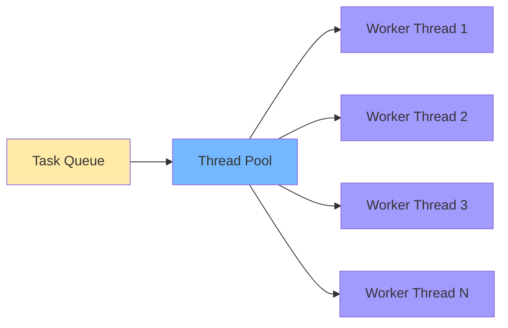

### Using ExecutorService

```java
import java.util.concurrent.ExecutorService;
import java.util.concurrent.Executors;

class HelloThread implements Runnable {
    public void run() {
        Thread th = Thread.currentThread();
        for(int i = 1; i <= 5; i++) {
            System.out.println(th.getName() + " : " + i);
            try {
                Thread.sleep(1000);
            } catch(Exception ex) {
                System.out.println(ex);
            }
        }
    }
}

class Lab702 {
    public static void main(String args[]) {
        Runnable runnable = new HelloThread();
        
        // Create thread pool with 5 threads
        ExecutorService exService1 = Executors.newFixedThreadPool(5);
        for(int i = 1; i <= 8; i++) {
            exService1.execute(runnable);
        }
        
        // Create thread pool with 2 threads
        ExecutorService exService2 = Executors.newFixedThreadPool(2);
        for(int i = 1; i <= 2; i++) {
            exService2.execute(runnable);
        }
    }
}
```

::: tip Benefits of Thread Pools
- **Reusability**: Threads are reused for multiple tasks
- **Performance**: Avoids overhead of creating new threads
- **Resource Management**: Limits the number of concurrent threads
- **Task Queue**: Automatically manages task queuing
:::

## Assignment Questions

### Conceptual Questions

::: details Q1) What is the difference between Thread and Process?

**Answer:**
- **Thread**: Lightweight subprocess, shares memory with other threads in the same process
- **Process**: Independent executing instance of a program, has its own memory space
- Threads are faster to create and have lower context switching overhead
- Processes are more isolated and secure

:::

::: details Q2) What is Multithreading?

**Answer:** Multithreading is executing more than one thread simultaneously. It is best suitable at user application level where multiple tasks need to run concurrently within the same application.

:::

::: details Q3) What is the difference between Multithreading and Multiprocessing?

**Answer:**
- **Multiprocessing**: Multiple processes run simultaneously, each with separate memory
- **Multithreading**: Multiple threads run simultaneously within a process, sharing same memory
- Multithreading has less overhead and faster context switching
- Multiprocessing provides better isolation and security

:::

::: details Q4) What is main Thread?

**Answer:** The main thread is the thread created automatically by JVM when a Java program starts. It executes the `main()` method and is responsible for:
- Checking class file availability
- Verifying bytecode
- Collecting command-line arguments
- Invoking the main method
- Creating child threads

:::

::: details Q5) What is Finalizer Thread?

**Answer:** The Finalizer thread is a system thread created by JVM that runs in the background to execute the `finalize()` method of objects before they are garbage collected.

:::

::: details Q6) How can I define custom Thread?

**Answer:** Two ways:
1. **Extending Thread class**: Create a class that extends `Thread` and override `run()` method
2. **Implementing Runnable interface**: Create a class that implements `Runnable` interface and implement `run()` method

:::

::: details Q7) Which is the best or recommendable option to define custom thread and why?

**Answer:** **Implementing Runnable interface** is recommended because:
- Java doesn't support multiple inheritance, so extending Thread limits inheritance options
- Better separation of concerns: task logic (Runnable) is separate from thread management (Thread)
- More flexible: same Runnable instance can be passed to multiple threads
- Follows composition over inheritance principle

:::

::: details Q8) Is it possible to call start() method on running thread?

**Answer:** No. Calling `start()` on an already running thread throws `IllegalThreadStateException`.

:::

::: details Q9) Can I overload the run() method in thread class?

**Answer:** Yes, you can overload the `run()` method with different parameters.

:::

::: details Q10) Which method will be called by the JVM when I overload run() method?

**Answer:** JVM will always call the `public void run()` method with no parameters. Overloaded versions must be called explicitly.

:::

::: details Q11-Q13) Can run() method be abstract/static/synchronized?

**Answer:**
- **Abstract**: Yes, if the class is abstract, but concrete subclasses must implement it
- **Static**: No, `run()` is an instance method and cannot be static
- **Synchronized**: Yes, you can make `run()` synchronized

:::

::: details Q14) Can I define a thread class without overriding run() method?

**Answer:** Yes, but the thread will not do anything useful. The default `run()` method from Thread class (which does nothing) will be executed.

:::

::: details Q15) How do I pause thread execution for specified amount of time?

**Answer:** Use `Thread.sleep(milliseconds)` method.

:::

::: details Q16) Can I specify the priority of the thread less than 0 or more than 10?

**Answer:** No. Priority must be between `MIN_PRIORITY` (1) and `MAX_PRIORITY` (10). Otherwise, `IllegalArgumentException` is thrown.

:::

::: details Q17-Q20) Object Locking Questions

**Q17) What is object locking?**
Object locking is a mechanism to ensure only one thread can access a synchronized block/method of an object at a time.

**Q18) Which object will be locked when using method level synchronization with instance methods?**
The instance (object) used to call the method is locked.

**Q19) Which object will be locked when using method level synchronization with static methods?**
The Class object (default object of the class) is locked.

**Q20) Which object will be locked when using block level synchronization?**
The object passed as parameter to the synchronized block is locked.

:::

::: details Q21-Q23) wait() Method Questions

**Q21) Can I call wait() method from synchronized context with unlocked object?**
No. You must call `wait()` on the same object that is locked, otherwise `IllegalMonitorStateException` is thrown.

**Q22) Why should I call wait() method with locked object?**
Because `wait()` releases the lock, and you can only release a lock you own. This ensures proper thread synchronization.

**Q23) Why are wait()/notify()/notifyAll() in Object class?**
Because these methods work with object locks, and every object in Java can have a lock. Placing them in Object class makes them available to all objects.

:::

::: details Q24) What is deadlock?

**Answer:** Deadlock is a situation where two or more threads are blocked forever, waiting for each other to release resources. It occurs when:
- Thread A holds Resource 1 and waits for Resource 2
- Thread B holds Resource 2 and waits for Resource 1
- Neither can proceed

:::

::: details Q25) What is the use of join() method?

**Answer:** The `join()` method allows one thread to wait for another thread to complete execution before continuing. It's used to ensure thread execution order.

:::

::: details Q26-Q29) Daemon Thread Questions

**Q26) What is daemon thread?**
A daemon thread is a service thread that provides services to user threads and is automatically terminated by JVM when all user threads finish.

**Q27) How can I check whether a thread is daemon or not?**
Use `isDaemon()` method.

**Q28) How can I mark user thread as daemon thread?**
Use `setDaemon(true)` method before starting the thread.

**Q29) Can I mark thread as daemon thread if it is started?**
No. `IllegalThreadStateException` will be thrown.

:::

::: details Q30) What is the difference between sleep() and wait() method?

**Answer:**

| sleep() | wait() |
|---------|--------|
| Static method of Thread class | Instance method of Object class |
| Does not release lock | Releases lock |
| Can be called anywhere | Must be called in synchronized context |
| Thread moves to TIMED_WAITING | Thread moves to WAITING state |
| Automatically wakes up after time | Needs notify()/notifyAll() to wake up |

:::

::: details Q31) What is the use of volatile keyword in java?

**Answer:** The `volatile` keyword ensures that changes to a variable are immediately visible to all threads. It prevents thread caching of variables and ensures reads/writes go directly to main memory.

:::

::: details Q32) What is race condition in Java?

**Answer:** A race condition occurs when two or more threads access shared data concurrently and try to change it at the same time, leading to unpredictable results. It can be prevented using synchronization.

:::

::: details Q33-Q34) Thread Pool Questions

**Q33) What is thread pool?**
A thread pool is a collection of pre-initialized threads that are ready to perform tasks. It reuses threads instead of creating new ones for each task.

**Q34) How to create thread pool in java?**
Use `ExecutorService` with `Executors` factory methods:
```java
ExecutorService pool = Executors.newFixedThreadPool(5);
```

:::

::: details Q35) What is Producer Consumer problem in Java?

**Answer:** The Producer-Consumer problem is a classic synchronization problem where:
- Producer threads produce data and put it in a buffer
- Consumer threads take data from the buffer
- Need to ensure: producers wait when buffer is full, consumers wait when buffer is empty
- Solved using `wait()` and `notify()`/`notifyAll()` methods

:::

## Practice Test

Test your knowledge with these multiple-choice questions:

::: details Question 1
```java
public class Test {
    public static void main(String[] args) {
        Thread th = new Thread("OK");
        th.start();
        System.out.println("Main");
    }
}
```

**Options:**
- A) OK, Main
- B) Main, OK  
- C) Main
- D) OK
- E) Depends on CPU Scheduler ✓

**Answer: E** - Thread execution order depends on CPU scheduler.
:::

::: details Question 2
```java
public class Test {
    public static void main(String[] args) {
        Thread th = new Thread("OK");
        th.run();
        System.out.println("Main");
    }
}
```

**Options:**
- A) OK, Main
- B) Main, OK
- C) Main ✓
- D) OK
- E) Depends on CPU Scheduler

**Answer: C** - Calling `run()` directly doesn't start a new thread. "OK" is just a name, run() does nothing.
:::

::: details Question 3
```java
public class Test {
    public static void main(String[] args) {
        Runnable r = new Runnable() {
            public void run() {
                System.out.println("RUN");
            }
        };
        r.start();
        System.out.println("Main");
    }
}
```

**Answer: E** - Compile-time error. Runnable interface doesn't have `start()` method.
:::

::: details Questions 5-17

**Q5:** Timeout argument can be passed to: **A) wait(), C) sleep(), D) join()** ✓

**Q6:** Which statement is true? **B) If a class has synchronized code, multiple threads can still access the nonsynchronized code** ✓

**Q7:** Method to start thread execution: **B) start()** ✓

**Q8:** Class defining wait(), notify(), notifyAll(): **A) Object** ✓

**Q9:** Multithreaded programming: **B) Two or more parts of same process run simultaneously** ✓

**Q10:** Types of multitasking: **C) Process and Thread based** ✓

**Q11:** Thread priority type: **A) Integer** ✓

**Q12:** Two threads of same priority: **D) Depends on operating system** ✓

**Q13:** Incorrect statement: **D) A thread can exist only in two states** ✓ (There are 6 states)

**Q14:** True statements about threads: **B) Program terminates when all user threads stop, D) Thread inherits daemon status** ✓

**Q15:** Not shared by threads: **C) both program counter and stack** ✓

**Q16:** A process can be: **C) both single threaded and multithreaded** ✓

**Q17:** Not a valid thread state: **B) parsing** ✓

:::

::: details Question 18-19
```java
class Test {
    public static void main(String args[]) {
        Thread t = Thread.currentThread();
        System.out.println(t);
    }
}
```

**Q18 Answer: D) Thread[main,5,main]** - Format is Thread[name, priority, thread group]

**Q19 Answer: B) 5** - Priority is NORM_PRIORITY (5)
:::

::: details Question 20
```java
public class MyThread implements Runnable {
    public void run() {
        System.out.println("My thread is running.");
        throw new RuntimeException();
    }
    public static void main(String[] args) {
        Thread thread = new Thread(new MyThread());
        thread.start();
        System.out.println("Main method ends.");
    }
}
```

**Answer: D)** Main method ends. My thread is running. Exception in thread "Thread-0" java.lang.RuntimeException

Threads run concurrently, exception in one thread doesn't stop others.
:::

::: details Question 21
```java
public class Test {
    public static void main(String[] args) {
        Thread t1 = new Thread(new MyRunnable(), "JLC");
        t1.start();
        t1.start();
    }
}
```

**Answer: D)** "JLC Running" along with an exception (IllegalThreadStateException)

Cannot start a thread twice.
:::

::: details Question 22
```java
class A extends Thread {
    public void run() throws AnException {  // Compile error!
        System.out.print("A");
        throw new AnException();
    }
}
```

**Answer: D)** Compile-time error

`run()` method cannot throw checked exceptions (must match Runnable interface signature).
:::

::: details Question 23
```java
class Main extends Thread {
    public void run() {
        System.out.println("thread");
    }
    public static void main(String args[]) {
        Main m = new Main();
        m.run();  // Direct call, not start()
    }
}
```

**Answer: B)** Prints 'thread', execution won't happen in a new thread

Calling `run()` directly executes in current thread.
:::

::: details Question 24
```java
class Main extends Thread {
    public void run() {
        System.out.println("mythread");
    }
    public static void main(String args[]) {
        Main m = new Main();
        m.start();
        Thread.sleep(1000);  // No try-catch!
    }
}
```

**Answer: C)** Compile-time error

`Thread.sleep()` throws `InterruptedException` which must be caught or declared.
:::

::: details Question 25
```java
public class B {
    private static String[] sa = new String[] {"X", "Y", "Z"};
    public static void main(String[] args) {
        synchronized (sa) {
            Thread t1 = new A(sa);
            t1.start();
            sa[0] = "A";
            sa[1] = "B";
            sa[2] = "C";
        }
    }
}
```

**Answer: A)** Prints ABC

Main thread holds lock on `sa`, modifies array before t1 can acquire lock and print.
:::

## Summary

::: tip Key Takeaways

**Thread Creation:**
- Extend `Thread` class or implement `Runnable` interface
- Implementing `Runnable` is preferred

**Thread States:**
- NEW → RUNNABLE → RUNNING → TERMINATED
- SLEEP, WAIT, BLOCKED are intermediate states

**Synchronization:**
- Use `synchronized` keyword to prevent race conditions
- Can be applied at method or block level
- Only one thread can execute synchronized code at a time

**Thread Communication:**
- `wait()` - releases lock and waits
- `notify()` - wakes up one waiting thread
- `notifyAll()` - wakes up all waiting threads

**Thread Management:**
- `join()` - wait for thread to complete
- `sleep()` - pause execution
- `setPriority()` - set thread priority
- `setDaemon()` - mark as daemon thread

**Best Practices:**
- Use thread pools for better resource management
- Avoid deadlocks by careful lock ordering
- Handle exceptions within threads properly
- Prefer `Runnable` over extending `Thread`
- Always release locks in finally blocks
- Use `volatile` for shared variables accessed by multiple threads

:::

## Code Examples Summary

### Complete Working Examples

::: code-group

```java [Simple Thread Example]
class SimpleThread extends Thread {
    private String threadName;
    
    SimpleThread(String name) {
        this.threadName = name;
    }
    
    public void run() {
        System.out.println(threadName + " started");
        try {
            for(int i = 1; i <= 5; i++) {
                System.out.println(threadName + ": " + i);
                Thread.sleep(1000);
            }
        } catch(InterruptedException e) {
            System.out.println(threadName + " interrupted");
        }
        System.out.println(threadName + " finished");
    }
    
    public static void main(String[] args) {
        SimpleThread t1 = new SimpleThread("Thread-1");
        SimpleThread t2 = new SimpleThread("Thread-2");
        
        t1.start();
        t2.start();
        
        System.out.println("Main thread finished");
    }
}
```

```java [Runnable Example]
class Task implements Runnable {
    private String taskName;
    
    Task(String name) {
        this.taskName = name;
    }
    
    public void run() {
        System.out.println(taskName + " started");
        try {
            for(int i = 1; i <= 5; i++) {
                System.out.println(taskName + ": " + i);
                Thread.sleep(1000);
            }
        } catch(InterruptedException e) {
            System.out.println(taskName + " interrupted");
        }
        System.out.println(taskName + " finished");
    }
    
    public static void main(String[] args) {
        Runnable task1 = new Task("Task-1");
        Runnable task2 = new Task("Task-2");
        
        Thread t1 = new Thread(task1);
        Thread t2 = new Thread(task2);
        
        t1.start();
        t2.start();
        
        System.out.println("Main thread finished");
    }
}
```

```java [Synchronized Counter]
class Counter {
    private int count = 0;
    
    // Synchronized method
    public synchronized void increment() {
        count++;
    }
    
    public synchronized int getCount() {
        return count;
    }
}

class CounterThread extends Thread {
    private Counter counter;
    
    CounterThread(Counter counter) {
        this.counter = counter;
    }
    
    public void run() {
        for(int i = 0; i < 1000; i++) {
            counter.increment();
        }
    }
    
    public static void main(String[] args) throws InterruptedException {
        Counter counter = new Counter();
        
        Thread t1 = new CounterThread(counter);
        Thread t2 = new CounterThread(counter);
        Thread t3 = new CounterThread(counter);
        
        t1.start();
        t2.start();
        t3.start();
        
        t1.join();
        t2.join();
        t3.join();
        
        System.out.println("Final Count: " + counter.getCount());
    }
}
```

```java [Producer-Consumer]
import java.util.LinkedList;
import java.util.Queue;

class ProducerConsumer {
    private Queue<Integer> queue = new LinkedList<>();
    private final int MAX_SIZE = 5;
    
    public synchronized void produce(int value) throws InterruptedException {
        while(queue.size() == MAX_SIZE) {
            System.out.println("Queue is full, Producer waiting...");
            wait();
        }
        
        queue.add(value);
        System.out.println("Produced: " + value);
        notifyAll();
    }
    
    public synchronized int consume() throws InterruptedException {
        while(queue.isEmpty()) {
            System.out.println("Queue is empty, Consumer waiting...");
            wait();
        }
        
        int value = queue.remove();
        System.out.println("Consumed: " + value);
        notifyAll();
        return value;
    }
    
    public static void main(String[] args) {
        ProducerConsumer pc = new ProducerConsumer();
        
        Thread producer = new Thread(() -> {
            try {
                for(int i = 1; i <= 10; i++) {
                    pc.produce(i);
                    Thread.sleep(100);
                }
            } catch(InterruptedException e) {
                e.printStackTrace();
            }
        });
        
        Thread consumer = new Thread(() -> {
            try {
                for(int i = 1; i <= 10; i++) {
                    pc.consume();
                    Thread.sleep(300);
                }
            } catch(InterruptedException e) {
                e.printStackTrace();
            }
        });
        
        producer.start();
        consumer.start();
    }
}
```

```java [Thread Pool Example]
import java.util.concurrent.*;

class ThreadPoolDemo {
    public static void main(String[] args) {
        // Create thread pool with 3 threads
        ExecutorService executor = Executors.newFixedThreadPool(3);
        
        // Submit 10 tasks
        for(int i = 1; i <= 10; i++) {
            final int taskId = i;
            executor.submit(() -> {
                String threadName = Thread.currentThread().getName();
                System.out.println("Task " + taskId + 
                    " started by " + threadName);
                try {
                    Thread.sleep(2000);
                } catch(InterruptedException e) {
                    e.printStackTrace();
                }
                System.out.println("Task " + taskId + 
                    " completed by " + threadName);
            });
        }
        
        // Shutdown executor
        executor.shutdown();
        try {
            executor.awaitTermination(1, TimeUnit.MINUTES);
        } catch(InterruptedException e) {
            e.printStackTrace();
        }
        
        System.out.println("All tasks completed");
    }
}
```

```java [Deadlock Example]
class DeadlockDemo {
    private final Object lock1 = new Object();
    private final Object lock2 = new Object();
    
    public void method1() {
        synchronized(lock1) {
            System.out.println(Thread.currentThread().getName() + 
                ": Holding lock1...");
            try { Thread.sleep(100); } catch(InterruptedException e) {}
            
            System.out.println(Thread.currentThread().getName() + 
                ": Waiting for lock2...");
            synchronized(lock2) {
                System.out.println(Thread.currentThread().getName() + 
                    ": Acquired lock2!");
            }
        }
    }
    
    public void method2() {
        synchronized(lock2) {
            System.out.println(Thread.currentThread().getName() + 
                ": Holding lock2...");
            try { Thread.sleep(100); } catch(InterruptedException e) {}
            
            System.out.println(Thread.currentThread().getName() + 
                ": Waiting for lock1...");
            synchronized(lock1) {
                System.out.println(Thread.currentThread().getName() + 
                    ": Acquired lock1!");
            }
        }
    }
    
    public static void main(String[] args) {
        DeadlockDemo demo = new DeadlockDemo();
        
        Thread t1 = new Thread(() -> demo.method1(), "Thread-1");
        Thread t2 = new Thread(() -> demo.method2(), "Thread-2");
        
        t1.start();
        t2.start();
        
        // This will result in deadlock!
    }
}
```

```java [Deadlock Prevention]
class DeadlockPrevention {
    private final Object lock1 = new Object();
    private final Object lock2 = new Object();
    
    public void method1() {
        // Always acquire locks in same order
        synchronized(lock1) {
            System.out.println(Thread.currentThread().getName() + 
                ": Holding lock1...");
            try { Thread.sleep(100); } catch(InterruptedException e) {}
            
            synchronized(lock2) {
                System.out.println(Thread.currentThread().getName() + 
                    ": Acquired lock2!");
            }
        }
    }
    
    public void method2() {
        // Same order: lock1 then lock2
        synchronized(lock1) {
            System.out.println(Thread.currentThread().getName() + 
                ": Holding lock1...");
            try { Thread.sleep(100); } catch(InterruptedException e) {}
            
            synchronized(lock2) {
                System.out.println(Thread.currentThread().getName() + 
                    ": Acquired lock2!");
            }
        }
    }
    
    public static void main(String[] args) {
        DeadlockPrevention demo = new DeadlockPrevention();
        
        Thread t1 = new Thread(() -> demo.method1(), "Thread-1");
        Thread t2 = new Thread(() -> demo.method2(), "Thread-2");
        
        t1.start();
        t2.start();
        
        // No deadlock - both threads acquire locks in same order
    }
}
```

:::

## Advanced Concepts

### Volatile Keyword

The `volatile` keyword ensures visibility of changes to variables across threads.

```java
class VolatileExample {
    private volatile boolean running = true;
    
    public void stop() {
        running = false;
    }
    
    public void run() {
        while(running) {
            // Do work
        }
        System.out.println("Thread stopped");
    }
    
    public static void main(String[] args) throws InterruptedException {
        VolatileExample example = new VolatileExample();
        
        Thread worker = new Thread(example::run);
        worker.start();
        
        Thread.sleep(1000);
        example.stop();
    }
}
```

### Thread Local

`ThreadLocal` provides thread-local variables where each thread has its own copy.

```java
class ThreadLocalExample {
    private static ThreadLocal<Integer> threadLocal = 
        ThreadLocal.withInitial(() -> 0);
    
    public static void main(String[] args) {
        Runnable task = () -> {
            int value = threadLocal.get();
            System.out.println(Thread.currentThread().getName() + 
                " initial value: " + value);
            
            threadLocal.set(value + 10);
            
            System.out.println(Thread.currentThread().getName() + 
                " updated value: " + threadLocal.get());
        };
        
        Thread t1 = new Thread(task, "Thread-1");
        Thread t2 = new Thread(task, "Thread-2");
        
        t1.start();
        t2.start();
    }
}
```

### Atomic Variables

Atomic variables provide lock-free thread-safe operations.

```java
import java.util.concurrent.atomic.AtomicInteger;

class AtomicExample {
    private AtomicInteger counter = new AtomicInteger(0);
    
    public void increment() {
        counter.incrementAndGet();
    }
    
    public int getCount() {
        return counter.get();
    }
    
    public static void main(String[] args) throws InterruptedException {
        AtomicExample example = new AtomicExample();
        
        Thread[] threads = new Thread[10];
        for(int i = 0; i < 10; i++) {
            threads[i] = new Thread(() -> {
                for(int j = 0; j < 1000; j++) {
                    example.increment();
                }
            });
            threads[i].start();
        }
        
        for(Thread t : threads) {
            t.join();
        }
        
        System.out.println("Final count: " + example.getCount());
    }
}
```

## Synchronization Utilities

### CountDownLatch

Allows one or more threads to wait for a set of operations to complete.

```java
import java.util.concurrent.CountDownLatch;

class CountDownLatchExample {
    public static void main(String[] args) throws InterruptedException {
        CountDownLatch latch = new CountDownLatch(3);
        
        Runnable worker = () -> {
            try {
                System.out.println(Thread.currentThread().getName() + 
                    " working...");
                Thread.sleep(2000);
                System.out.println(Thread.currentThread().getName() + 
                    " finished");
                latch.countDown();
            } catch(InterruptedException e) {
                e.printStackTrace();
            }
        };
        
        new Thread(worker, "Worker-1").start();
        new Thread(worker, "Worker-2").start();
        new Thread(worker, "Worker-3").start();
        
        latch.await();
        System.out.println("All workers finished. Main thread continuing.");
    }
}
```

### CyclicBarrier

Allows threads to wait for each other at a barrier point.

```java
import java.util.concurrent.CyclicBarrier;

class CyclicBarrierExample {
    public static void main(String[] args) {
        CyclicBarrier barrier = new CyclicBarrier(3, () -> {
            System.out.println("All threads reached barrier. Proceeding...");
        });
        
        Runnable task = () -> {
            try {
                System.out.println(Thread.currentThread().getName() + 
                    " working on phase 1");
                Thread.sleep(1000);
                barrier.await();
                
                System.out.println(Thread.currentThread().getName() + 
                    " working on phase 2");
                Thread.sleep(1000);
                barrier.await();
                
            } catch(Exception e) {
                e.printStackTrace();
            }
        };
        
        new Thread(task, "Thread-1").start();
        new Thread(task, "Thread-2").start();
        new Thread(task, "Thread-3").start();
    }
}
```

### Semaphore

Controls access to a shared resource through permits.

```java
import java.util.concurrent.Semaphore;

class SemaphoreExample {
    public static void main(String[] args) {
        Semaphore semaphore = new Semaphore(2); // 2 permits
        
        Runnable task = () -> {
            try {
                System.out.println(Thread.currentThread().getName() + 
                    " waiting for permit...");
                semaphore.acquire();
                
                System.out.println(Thread.currentThread().getName() + 
                    " acquired permit");
                Thread.sleep(2000);
                
                System.out.println(Thread.currentThread().getName() + 
                    " releasing permit");
                semaphore.release();
                
            } catch(InterruptedException e) {
                e.printStackTrace();
            }
        };
        
        for(int i = 1; i <= 5; i++) {
            new Thread(task, "Thread-" + i).start();
        }
    }
}
```

## Performance Considerations

### Thread Creation Overhead

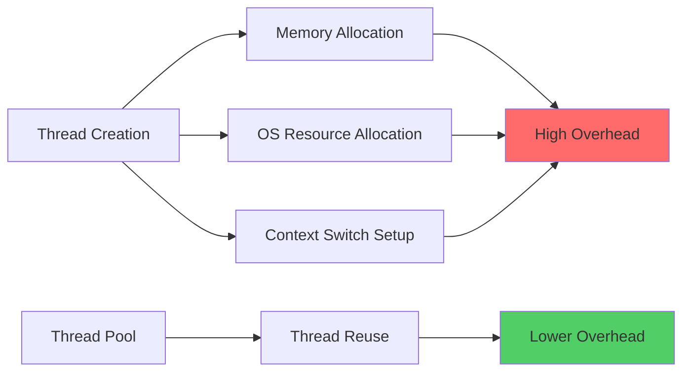

### Best Practices for Performance

::: tip Performance Tips

1. **Use Thread Pools** instead of creating new threads
   ```java
   ExecutorService executor = Executors.newFixedThreadPool(10);
   ```

2. **Minimize Synchronized Blocks**
   ```java
   // Only synchronize critical section
   void process() {
       // Non-critical code
       synchronized(lock) {
           // Critical section only
       }
       // More non-critical code
   }
   ```

3. **Use Concurrent Collections**
   ```java
   ConcurrentHashMap<K, V> map = new ConcurrentHashMap<>();
   CopyOnWriteArrayList<T> list = new CopyOnWriteArrayList<>();
   ```

4. **Avoid Busy Waiting**
   ```java
   // Bad: Busy waiting
   while(!condition) { }
   
   // Good: Use wait/notify
   synchronized(lock) {
       while(!condition) {
           lock.wait();
       }
   }
   ```

5. **Use Atomic Variables** for simple counters
   ```java
   AtomicInteger counter = new AtomicInteger();
   counter.incrementAndGet();
   ```

:::

## Common Pitfalls

### 1. Calling run() Instead of start()

::: danger Wrong
```java
Thread t = new Thread(task);
t.run(); // Executes in current thread!
```
:::

::: tip Correct
```java
Thread t = new Thread(task);
t.start(); // Creates new thread
```
:::

### 2. Synchronizing on Wrong Object

::: danger Wrong
```java
void method() {
    synchronized(new Object()) { // New object each time!
        // Critical section
    }
}
```
:::

::: tip Correct
```java
private final Object lock = new Object();

void method() {
    synchronized(lock) { // Same lock object
        // Critical section
    }
}
```
:::

### 3. Not Handling InterruptedException

::: danger Wrong
```java
try {
    Thread.sleep(1000);
} catch(InterruptedException e) {
    // Empty catch - swallowing exception
}
```
:::

::: tip Correct
```java
try {
    Thread.sleep(1000);
} catch(InterruptedException e) {
    Thread.currentThread().interrupt(); // Restore interrupt status
    // Or handle appropriately
}
```
:::

### 4. Modifying Shared State Without Synchronization

::: danger Wrong
```java
class Counter {
    private int count = 0;
    
    public void increment() {
        count++; // Not thread-safe!
    }
}
```
:::

::: tip Correct
```java
class Counter {
    private int count = 0;
    
    public synchronized void increment() {
        count++; // Thread-safe
    }
}
```
:::

## Debugging Multithreaded Applications

### Thread Dump Analysis

```java
class ThreadDumpExample {
    public static void printThreadInfo() {
        Set<Thread> threads = Thread.getAllStackTraces().keySet();
        
        for(Thread t : threads) {
            System.out.println("Thread: " + t.getName());
            System.out.println("  State: " + t.getState());
            System.out.println("  Priority: " + t.getPriority());
            System.out.println("  Daemon: " + t.isDaemon());
            System.out.println("  Group: " + t.getThreadGroup().getName());
            System.out.println();
        }
    }
}
```

### Detecting Deadlocks

```java
import java.lang.management.*;

class DeadlockDetector {
    public static void detectDeadlock() {
        ThreadMXBean bean = ManagementFactory.getThreadMXBean();
        long[] threadIds = bean.findDeadlockedThreads();
        
        if(threadIds != null) {
            ThreadInfo[] infos = bean.getThreadInfo(threadIds);
            System.out.println("Deadlock detected!");
            for(ThreadInfo info : infos) {
                System.out.println(info.getThreadName() + 
                    " is in deadlock");
            }
        } else {
            System.out.println("No deadlock detected");
        }
    }
}
```

## Conclusion

This comprehensive guide covers all aspects of Java multithreading from basics to advanced concepts. Key takeaways:

✅ **Thread Creation**: Use `Runnable` interface for flexibility  
✅ **Synchronization**: Prevent race conditions with proper locking  
✅ **Thread Communication**: Use wait/notify for coordination  
✅ **Thread Pools**: Reuse threads for better performance  
✅ **Avoid Deadlocks**: Always acquire locks in consistent order  
✅ **Use Modern APIs**: Leverage java.util.concurrent package  