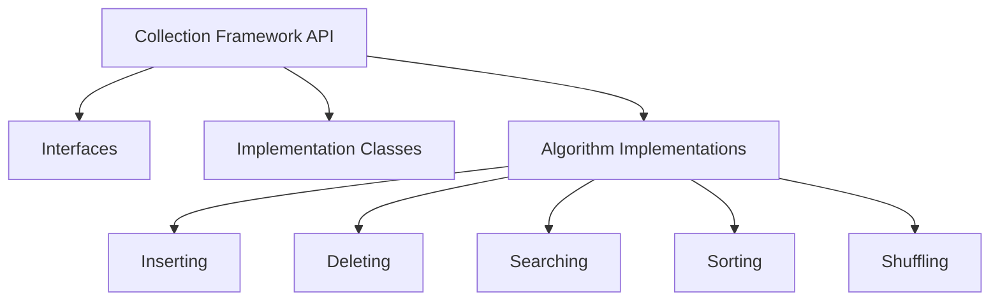
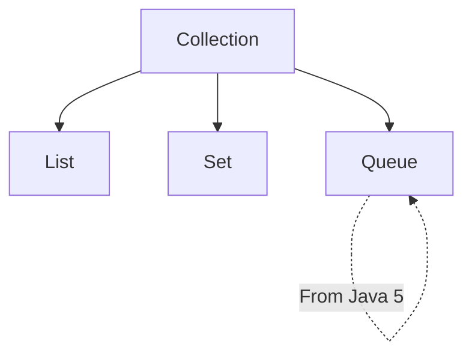
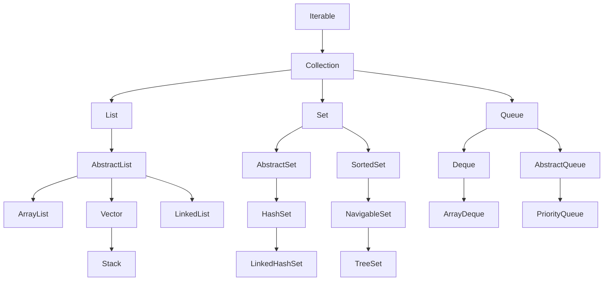
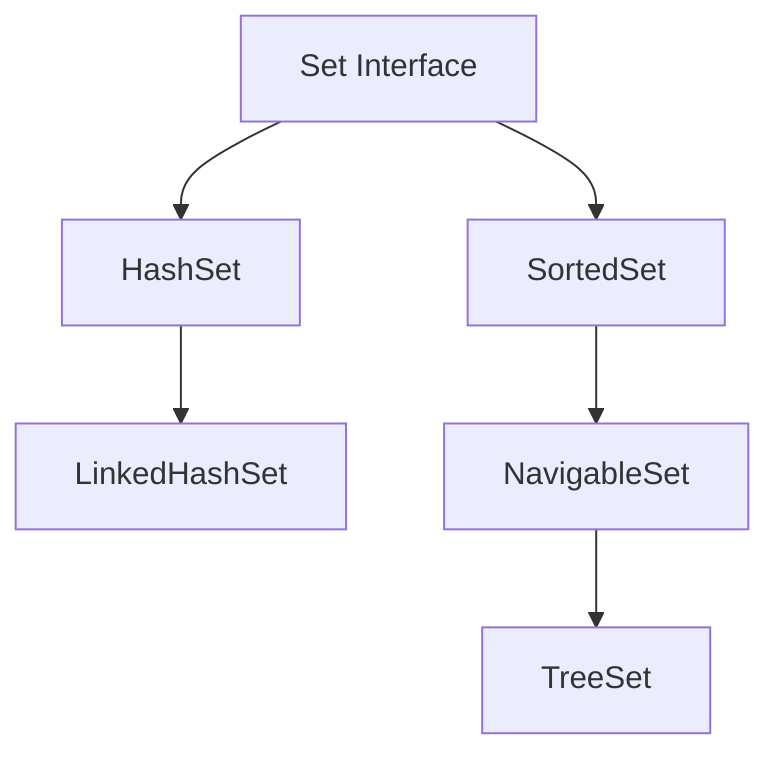
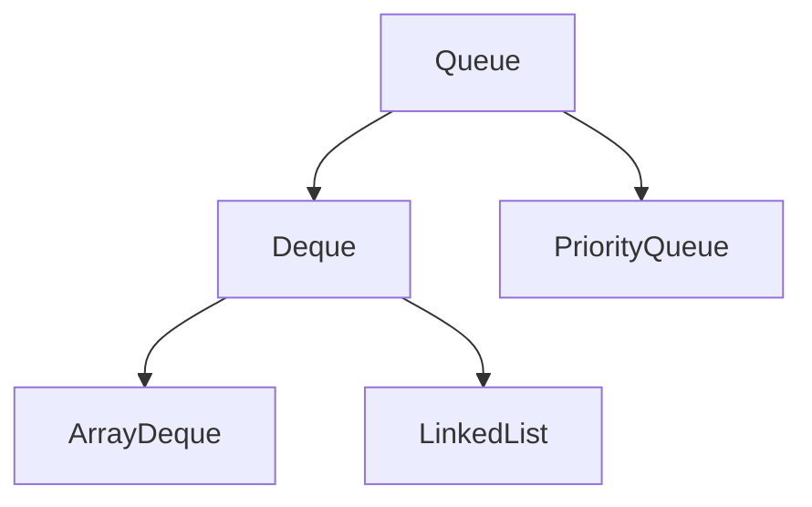
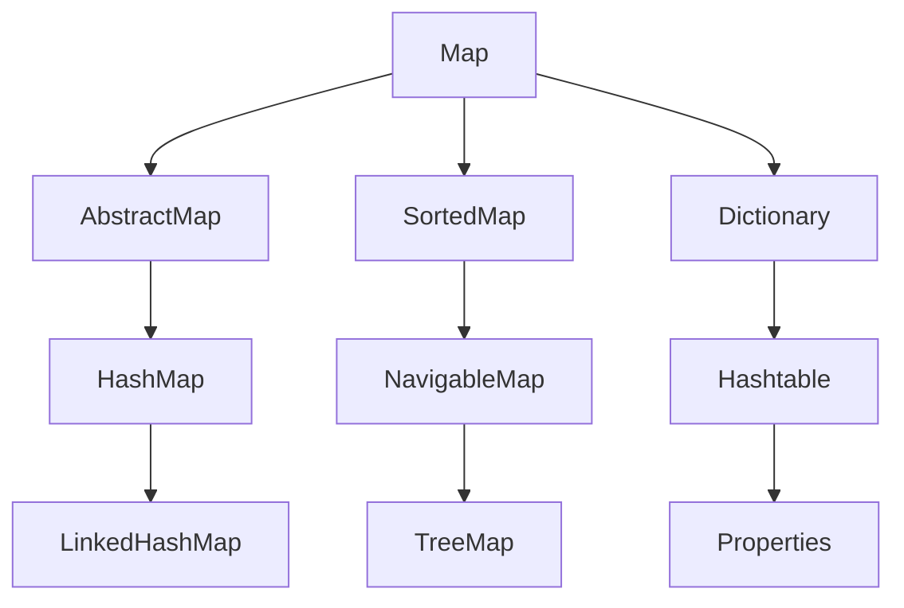

# Java Util Package Guide

## Introduction

The `java.util` package is a built-in package in Java that contains:

- Collections framework
- Legacy collection classes
- Event model
- Date and time facilities
- Internationalization (I18N)
- Other utility classes

## Arrays

### Managing Collection of Elements with Arrays

You can manage collections of elements using arrays:

**Creating an Array:**
```java
int arr[] = new int[3];
```

**Initializing an Array:**
```java
arr[0] = 99;
arr[1] = 88;
arr[2] = 77;
```

**Accessing Array Elements:**
```java
for(int i = 0; i < arr.length; i++)
    System.out.println(arr[i]);
```

### Limitations with Arrays

::: warning Array Limitations
- **Homogeneous data structure**: Only one type of elements can be stored
- **Static in nature**: Size of an array cannot be modified
- **Insert and delete operations**: Require more shifting of elements
:::

## Legacy API

Java vendor provided classes and interfaces before Java 2 to solve the limitations of arrays.

### Legacy Classes

The following 5 legacy classes are available:

1. **Stack**
2. **Vector**
3. **Dictionary**
4. **Hashtable**
5. **Properties**

### Legacy Interface

**Enumeration** is the legacy interface available.

## Managing Collection of Data

Collection of data can be managed in two forms:

### a) Collection of Elements

Examples:
- Collection of Emails
- Collection of Phones

**Vector** and **Stack** can be used to manage collections of elements.

### b) Collection of Key-Value Pairs

Examples:
- Collection of Country and corresponding Capital
- Collection of ID and corresponding Name

**Properties**, **Dictionary**, and **Hashtable** can be used to manage collections of key-value pairs.

::: tip Legacy Cursor
**Enumeration** is a legacy cursor used to access data from legacy classes one by one.
:::

### Code Examples

#### Lab703: Vector with Enumeration

```java
import java.util.*;

class Lab703 {
    public static void main(String args[]) {
        Vector myvector = new Vector();
        myvector.addElement(10);
        myvector.addElement(20);
        myvector.addElement(30);
        myvector.addElement("JLC");
        myvector.addElement(99.99);
        System.out.println(myvector);
        
        Enumeration enm = myvector.elements();
        while(enm.hasMoreElements()) {
            Object x = enm.nextElement();
            System.out.println(x);
        }
    }
}
```

#### Lab704: Vector with Generics

```java
import java.util.*;

class Lab704 {
    public static void main(String args[]) {
        Vector<Integer> myvector = new Vector<>();
        myvector.addElement(10);
        myvector.addElement(20);
        myvector.addElement(30);
        System.out.println(myvector);
        
        Enumeration<Integer> enm = myvector.elements();
        while(enm.hasMoreElements()) {
            Integer x = enm.nextElement();
            System.out.println(x);
        }
    }
}
```

#### Lab705: Stack Example

```java
import java.util.*;

class Lab705 {
    public static void main(String args[]) {
        Stack<Integer> mystack = new Stack<Integer>();
        mystack.addElement(10);
        mystack.addElement(20);
        mystack.addElement(30);
        mystack.addElement(40);
        mystack.addElement(50);
        System.out.println(mystack);
        
        Enumeration<Integer> enm = mystack.elements();
        while(enm.hasMoreElements()) {
            Integer x = enm.nextElement();
            System.out.println(x);
        }
    }
}
```

#### Lab706: Hashtable Example

```java
import java.util.*;

class Lab706 {
    public static void main(String args[]) {
        Hashtable<String,Integer> myht = new Hashtable<String,Integer>();
        myht.put("aaa", 10);
        myht.put("bbb", 50);
        myht.put("sri", 90);
        System.out.println(myht);
        System.out.println(myht.get("sri"));
        
        Enumeration<String> enm = myht.keys();
        while(enm.hasMoreElements()) {
            String mykey = enm.nextElement();
            Integer myval = myht.get(mykey);
            System.out.println(mykey + "\t" + myval);
        }
    }
}
```

#### Lab707: Properties Example

```java
import java.util.*;

class Lab707 {
    public static void main(String args[]) {
        Properties myprops = new Properties();
        myprops.put("aaa", 10);
        myprops.put("bbb", 50);
        myprops.put("sri", 90);
        System.out.println(myprops);
        System.out.println(myprops.get("sri"));
        
        Enumeration enm = myprops.keys();
        while(enm.hasMoreElements()) {
            Object mykey = enm.nextElement();
            Object myval = myprops.get(mykey);
            System.out.println(mykey + "\t" + myval);
        }
    }
}
```

### Limitations with Legacy Classes

::: danger Legacy Class Limitations
- No specific scenario defined for when to use which classes
- Almost all methods are synchronized
- Same object cannot be accessed by multiple threads concurrently
:::

## Collection Framework

Java Vendor provided a new API (Collection Framework API) from Java 2 to solve problems associated with Legacy classes.

### Overview

The Collection Framework provides mechanisms to store and manipulate groups of elements.

**Operations supported:**
- Searching
- Sorting
- Insertion
- Deletion
- And more...

### Collection Framework Components



### Top Level Interfaces

The following are the top level interfaces in Collection Framework API:

1. **Collection**
2. **Map**
3. **Iterator**

::: info Usage
- **Collection** subclasses: Manage collection of elements without key-value format
- **Map** subclasses: Manage collection of elements with key-value format
- **Iterator**: Access data from the collection
:::

## Exploring Collection Interface

The Collection interface has 3 sub-interfaces:



### Methods of Collection Interface

| Method | Description |
|--------|-------------|
| `boolean add(Object obj)` | Adds objects to collection |
| `int size()` | Returns number of objects available in collection |
| `boolean isEmpty()` | Checks whether collection is empty or not |
| `boolean contains(Object obj)` | Checks whether collection has specified object or not |
| `Iterator iterator()` | Returns Iterator subclass object |
| `Object[] toArray()` | Returns an array containing all elements of collection |
| `boolean remove(Object obj)` | Removes first occurrence of specified object from collection |
| `void clear()` | Removes all elements from collection |
| `boolean addAll(Collection c)` | Adds all data of specified collection in the current collection |
| `boolean containsAll(Collection c)` | Returns true if current collection contains all elements of specified collection |
| `boolean removeAll(Collection c)` | Removes all matching elements of specified collection from current collection |
| `boolean retainAll(Collection c)` | Removes all non-matching elements of specified collection from current collection |

### Collection Hierarchy



### Code Examples

#### Lab708: Basic Collection Operations

```java
import java.util.*;

class Lab708 {
    public static void main(String args[]) {
        List<String> mylist = new ArrayList<String>();
        System.out.println(mylist);
        System.out.println(mylist.size());
        System.out.println(mylist.isEmpty());
        
        mylist.add("Java");
        mylist.add("Spring");
        mylist.add("Hibernate");
        mylist.add("SpringBoot");
        mylist.add("React");
        
        System.out.println(mylist);
        System.out.println(mylist.size());
        System.out.println(mylist.isEmpty());
        System.out.println(mylist.contains("Spring"));
        System.out.println(mylist.contains("DSA"));
        
        mylist.remove("Spring");
        mylist.add("DSA");
        
        System.out.println(mylist.contains("Spring"));
        System.out.println(mylist.contains("DSA"));
        System.out.println(mylist);
        
        mylist.clear();
        System.out.println(mylist);
    }
}
```

#### Lab709: Iterator and toArray

```java
import java.util.*;

class Lab709 {
    public static void main(String args[]) {
        List<String> mylist = new ArrayList<String>();
        mylist.add("Java");
        mylist.add("DSA");
        mylist.add("Spring");
        mylist.add("Hibernate");
        mylist.add("SpringBoot");
        mylist.add("React");
        System.out.println(mylist);
        
        Iterator<String> myit = mylist.iterator();
        while(myit.hasNext()) {
            String str = myit.next();
            System.out.println(str);
        }
        
        System.out.println("--------------------");
        Object myarray[] = mylist.toArray();
        for(Object obj : myarray) {
            System.out.println(obj);
        }
    }
}
```

#### Lab710: Adding Collections

```java
import java.util.*;

class Lab710 {
    public static void main(String args[]) {
        List courseList = new ArrayList();
        courseList.add("Java");
        courseList.add("DSA");
        courseList.add("Spring");
        courseList.add("React");
        System.out.println(courseList);
        
        List numsList = new ArrayList();
        numsList.add(10);
        numsList.add(20);
        numsList.add(30);
        System.out.println(numsList);
        
        System.out.println(courseList);
        courseList.add(numsList);
        System.out.println(courseList);
        System.out.println(courseList.contains("Java"));
        System.out.println(courseList.contains(numsList));
    }
}
```

#### Lab711: addAll Method

```java
import java.util.*;

class Lab711 {
    public static void main(String args[]) {
        List courseList = new ArrayList();
        courseList.add("Java");
        courseList.add("DSA");
        courseList.add("Spring");
        courseList.add("React");
        System.out.println(courseList);
        
        List numsList = new ArrayList();
        numsList.add(10);
        numsList.add(20);
        numsList.add(30);
        System.out.println(numsList);
        
        System.out.println(courseList);
        courseList.addAll(numsList);
        System.out.println(courseList);
        System.out.println(courseList.contains("Java"));
        System.out.println(courseList.contains(numsList));
        System.out.println(courseList.containsAll(numsList));
    }
}
```

#### Lab712: removeAll Method

```java
import java.util.*;

class Lab712 {
    public static void main(String args[]) {
        List courseList = new ArrayList();
        courseList.add("Java");
        courseList.add("DSA");
        courseList.add("Spring");
        courseList.add("React");
        System.out.println(courseList);
        
        List numsList = new ArrayList();
        numsList.add(10);
        numsList.add(20);
        numsList.add(30);
        System.out.println(numsList);
        
        courseList.addAll(numsList);
        System.out.println(courseList);
        
        courseList.removeAll(numsList);
        System.out.println(courseList);
    }
}
```

#### Lab713: retainAll Method

```java
import java.util.*;

class Lab713 {
    public static void main(String args[]) {
        List courseList = new ArrayList();
        courseList.add("Java");
        courseList.add("DSA");
        courseList.add("Spring");
        courseList.add("React");
        System.out.println(courseList);
        
        List numsList = new ArrayList();
        numsList.add(10);
        numsList.add(20);
        numsList.add(30);
        System.out.println(numsList);
        
        courseList.addAll(numsList);
        System.out.println(courseList);
        
        courseList.retainAll(numsList);
        System.out.println(courseList);
    }
}
```

## Exploring List Interface

**List** is an interface in `java.util` package that extends `java.util.Collection` interface.

### List Characteristics

- Allows duplicate elements
- Elements are stored with indexing notation

### List Concrete Sub-classes

1. **ArrayList**
2. **LinkedList**
3. **Vector**
4. **Stack**

### ArrayList

::: info ArrayList Features
- Allows duplicates
- Implemented as a resizable array
- Elements stored internally using indexing notation
- Most widely used concrete class
- **Fast** for accessing elements
- **Slow** for inserting and deleting elements
:::

### LinkedList

::: info LinkedList Features
- Allows duplicates
- Internally implements doubly-linked list data structure
- Elements stored using node representation
- **Fast** for inserting or deleting elements
- **Slow** for accessing elements
:::

### Vector

::: warning Vector (Legacy Class)
- Allows duplicates
- Implemented as a resizable array
- Elements stored internally using indexing notation
- Methods are synchronized
- Vector object can't be accessed by multiple threads at a time
- **Not recommended for use**
:::

### Stack

::: warning Stack (Legacy Class)
- Subclass of Vector
- Methods are synchronized
- Stack object can't be accessed by multiple threads at a time
- Important operations: `peek()`, `pop()`, `push()`, `search()`
- **Not recommended for use**
:::

### Methods of List Interface

| Method | Description |
|--------|-------------|
| `void add(int idx, Object obj)` | Add/Insert the element at the specific index |
| `Object remove(int idx)` | Removes the element available at specified index |
| `Object get(int idx)` | Returns the element available at specified index |
| `Object set(int idx, Object obj)` | Replaces the object available at specified index |
| `int indexOf(Object obj)` | Returns the first position of specified object |
| `int lastIndexOf(Object obj)` | Returns the last position of specified object |
| `List subList(int stIdx, int endIdx)` | Returns portion of list |
| `ListIterator listIterator()` | Returns ListIterator object that points before first record |
| `ListIterator listIterator(int stIdx)` | Returns ListIterator object that points to specified index |

### Code Examples

#### Lab714: Basic List Operations

```java
import java.util.*;

class Lab714 {
    public static void main(String args[]) {
        List<String> courseList = new ArrayList<>();
        courseList.add("Java");
        courseList.add("DSA");
        courseList.add("Spring");
        courseList.add("React");
        courseList.add("MicroServices");
        System.out.println(courseList);
        
        courseList.add(3, "Spring Boot");
        System.out.println(courseList);
        
        courseList.remove(4);
        System.out.println(courseList);
        
        System.out.println(courseList.get(1));
        System.out.println(courseList.get(4));
    }
}
```

#### Lab715: indexOf and set Methods

```java
import java.util.*;

class Lab715 {
    public static void main(String args[]) {
        List<String> courseList = new ArrayList<>();
        courseList.add("Java");
        courseList.add("DSA");
        courseList.add("Spring");
        courseList.add("React");
        courseList.add("Spring");
        courseList.add("MicroServices");
        System.out.println(courseList);
        
        System.out.println(courseList.get(1));
        System.out.println(courseList.get(2));
        System.out.println(courseList.indexOf("DSA"));
        System.out.println(courseList.indexOf("Spring"));
        System.out.println(courseList.lastIndexOf("Spring"));
        
        System.out.println(courseList);
        System.out.println(courseList.set(4, "Spring 5"));
        System.out.println(courseList.set(0, "Java 18"));
        System.out.println(courseList);
    }
}
```

#### Lab716: subList Method

```java
import java.util.*;

class Lab716 {
    public static void main(String args[]) {
        List<String> courseList = new ArrayList<>();
        courseList.add("Java");
        courseList.add("DSA");
        courseList.add("Spring");
        courseList.add("React");
        courseList.add("Spring");
        courseList.add("MicroServices");
        courseList.add("Spring Boot");
        courseList.add("AWS");
        courseList.add("DevOps");
        System.out.println(courseList);
        
        List<String> mylist1 = courseList.subList(3, 8);
        System.out.println(mylist1);
        
        List<String> mylist2 = courseList.subList(2, 5);
        System.out.println(mylist2);
    }
}
```

#### Lab717: Iterator Example

```java
import java.util.*;

class Lab717 {
    public static void main(String args[]) {
        List<String> courseList = new ArrayList<>();
        courseList.add("Java");
        courseList.add("DSA");
        courseList.add("Spring");
        courseList.add("React");
        courseList.add("Spring");
        courseList.add("Spring Boot");
        System.out.println(courseList);
        
        Iterator<String> myit = courseList.iterator();
        while(myit.hasNext()) {
            String str = myit.next();
            System.out.println(str);
        }
    }
}
```

#### Lab718: ListIterator Forward and Reverse

```java
import java.util.*;

class Lab718 {
    public static void main(String args[]) {
        List<Integer> mylist = new ArrayList<>();
        mylist.add(10);
        mylist.add(20);
        mylist.add(30);
        mylist.add(40);
        mylist.add(50);
        System.out.println(mylist);
        
        ListIterator<Integer> mylistIt = mylist.listIterator();
        
        System.out.println("Forward Order");
        while(mylistIt.hasNext()) {
            Integer x = mylistIt.next();
            System.out.println(x);
        }
        
        System.out.println("Reverse Order");
        while(mylistIt.hasPrevious()) {
            Integer x = mylistIt.previous();
            System.out.println(x);
        }
    }
}
```

#### Lab720: ListIterator from End

```java
import java.util.*;

class Lab720 {
    public static void main(String args[]) {
        List<Integer> mylist = new ArrayList<>();
        mylist.add(10);
        mylist.add(20);
        mylist.add(30);
        mylist.add(40);
        mylist.add(50);
        
        ListIterator<Integer> mylistIt = mylist.listIterator(mylist.size());
        
        System.out.println("Reverse Order");
        while(mylistIt.hasPrevious()) {
            Integer x = mylistIt.previous();
            System.out.println(x);
        }
    }
}
```

## Cursors in Java Collections

### Enumeration Interface

**Enumeration** is an interface in `java.util` package used as a cursor to access elements from legacy classes one by one.

**Methods:**
1. `boolean hasMoreElements()` - Checks whether next element is available
2. `Object nextElement()` - Moves the pointer and returns elements from collection

### Iterator Interface

**Iterator** is an interface in `java.util` package used as a cursor to access elements from Collection subclasses one by one.

**Getting Iterator instance:**
```java
Iterator it = col.iterator();
```

**Methods:**
1. `boolean hasNext()` - Checks whether next element is available
2. `Object next()` - Moves the pointer and returns elements from collection
3. `void remove()` - Removes the current element from Collections

### ListIterator Interface

**ListIterator** is an interface that extends Iterator interface and provides extra methods for use with List subclasses only.

**Features:**
- Access the index of elements
- Access elements in both forward and reverse direction
- Add, Remove, and Replace data in List subclasses
- Access elements starting from specified index

### Code Examples

#### Lab721: Enumeration vs Iterator

```java
import java.util.*;

class Lab721 {
    public static void main(String args[]) {
        Vector<Integer> myvector = new Vector<Integer>();
        myvector.add(10);
        myvector.add(20);
        myvector.add(30);
        myvector.add(40);
        myvector.add(50);
        
        System.out.println("1. Using Enumeration");
        Enumeration<Integer> enm = myvector.elements();
        while(enm.hasMoreElements()) {
            Integer x = enm.nextElement();
            System.out.println(x);
        }
        
        System.out.println("2. Using Iterator");
        Iterator<Integer> it = myvector.iterator();
        while(it.hasNext()) {
            Integer x = it.next();
            System.out.println(x);
        }
    }
}
```

#### Lab722: Iterator Remove

```java
import java.util.*;

class Lab722 {
    public static void main(String args[]) {
        List<Integer> mylist = new ArrayList<>();
        mylist.add(10);
        mylist.add(20);
        mylist.add(30);
        mylist.add(40);
        mylist.add(50);
        System.out.println(mylist);
        
        Iterator<Integer> it = mylist.iterator();
        while(it.hasNext()) {
            Integer x = it.next();
            if(x == 40) {
                it.remove();
                break;
            }
        }
        System.out.println(mylist);
    }
}
```

#### Lab723: ListIterator Add

```java
import java.util.*;

class Lab723 {
    public static void main(String args[]) {
        List<Integer> mylist = new ArrayList<>();
        mylist.add(10);
        mylist.add(20);
        mylist.add(30);
        mylist.add(40);
        mylist.add(50);
        mylist.add(60);
        System.out.println(mylist);
        
        ListIterator<Integer> it = mylist.listIterator();
        while(it.hasNext()) {
            Integer x = it.next();
            if(x == 30) {
                it.add(90);
                break;
            }
        }
        System.out.println(mylist);
    }
}
```

#### Lab725: ListIterator Set

```java
import java.util.*;

class Lab725 {
    public static void main(String args[]) {
        List<String> courseList = new ArrayList<>();
        courseList.add("Java");
        courseList.add("Spring");
        courseList.add("Angular");
        courseList.add("Spring");
        courseList.add("React");
        System.out.println(courseList);
        
        ListIterator<String> it = courseList.listIterator();
        while(it.hasNext()) {
            String str = it.next();
            if(str.equals("Spring")) {
                it.set("Spring 5");
                break;
            }
        }
        System.out.println(courseList);
    }
}
```

#### Lab728: Creating List from Another Collection

```java
import java.util.*;

class Lab728 {
    public static void main(String as[]) {
        List courseList = new ArrayList(); // Empty
        System.out.println(courseList.size());
        courseList.add("Java");
        courseList.add("Spring");
        courseList.add("Angular");
        System.out.println(courseList);
        
        List mycourses = new ArrayList(courseList);
        System.out.println(mycourses.size());
        mycourses.add("Spring Boot");
        System.out.println(mycourses);
        
        Vector v = new Vector();
        v.add(10);
        v.add(20);
        v.add(30);
        v.add(40);
        v.add(50);
        System.out.println(v);
        
        List numList = new ArrayList(v);
        System.out.println(numList.size());
        System.out.println(numList);
    }
}
```

#### Lab729: LinkedList Special Methods

```java
import java.util.*;

class Lab729 {
    public static void main(String as[]) {
        LinkedList courseList = new LinkedList();
        System.out.println(courseList.size());
        courseList.add("Java");
        courseList.add("Spring");
        courseList.add("Angular");
        System.out.println(courseList);
        
        courseList.add(2, "Spring Boot");
        System.out.println(courseList);
        System.out.println("-----------------------");
        
        System.out.println(courseList.getFirst());
        System.out.println(courseList.getLast());
        
        courseList.addFirst("Hello");
        courseList.addLast("Hai");
        System.out.println(courseList);
        
        System.out.println(courseList.removeFirst());
        System.out.println(courseList.removeLast());
        System.out.println(courseList);
        
        System.out.println("-----------------------");
        System.out.println("----Using Iterator---");
        Iterator it = courseList.iterator();
        while(it.hasNext()) {
            System.out.println(it.next());
        }
    }
}
```

::: danger ConcurrentModificationException
```java
// Lab730 demonstrates ConcurrentModificationException
import java.util.*;

class Lab730 {
    public static void main(String as[]) {
        List courseList = new ArrayList();
        courseList.add("Java");
        courseList.add("Spring");
        courseList.add("Angular");
        courseList.add("Spring");
        courseList.add("Spring Boot");
        courseList.add("React");
        System.out.println(courseList);
        
        System.out.println("----Using Iterator---");
        ListIterator lit = courseList.listIterator();
        while(lit.hasNext()) {
            System.out.println(lit.next());
            // lit.add("Hello"); // OK
            // lit.remove(); // OK
            // lit.set("Hello"); // OK
            courseList.add("Python"); // ConcurrentModificationException
        }
    }
}
```
:::

### Comparing List Subclasses

| Feature | ArrayList | LinkedList | Vector/Stack |
|---------|-----------|------------|--------------|
| Order | As added by user | As added by user | As added by user |
| Duplicate Value | Yes | Yes | Yes |
| Different type of value | Yes | Yes | Yes |
| Null Value | Yes | Yes | Yes |
| Synchronized | No | No | Yes |
| Random Access | Yes | No | Yes |
| Sequential Access | Yes | Yes | Yes |
| Serializable | Yes | Yes | Yes |
| Cloneable | Yes | Yes | Yes |
| Iterator can be used | Yes | Yes | Yes |
| ListIterator can be used | Yes | Yes | Yes |
| Enumeration can be used | No | No | Yes |
| Index Representation | Yes | No | Yes |
| Node Representation | No | Yes | No |
| Deque API can be used | No | Yes | No |

### Difference between Array and ArrayList

| Array | ArrayList |
|-------|-----------|
| Programming construct to store/represent collection of elements | Class introduced from Java 2 to manage collection of elements |
| Array size is static (fixed length) | ArrayList is dynamic (variable length) |
| Need to specify size while creating array object | No need to specify size while creating ArrayList object |
| Need to specify type of elements while creating array object | No need to specify type of element (from Java 5 using GENERICS, you can restrict type) |
| Primitives can be stored in array | Primitives can't be stored in ArrayList |
| Need to use `length` property to get number of elements | Need to use `size()` method to get number of elements |
| Need to use index notation for managing elements | Need to use methods for managing elements |
| Use Arrays class methods to perform operations | Use Collections class methods to perform operations |

### Difference between Vector and ArrayList

| Vector | ArrayList |
|--------|-----------|
| Legacy class reimplemented in Collection Framework | Class introduced from Java 2 in Collection Framework |
| Methods are synchronized | Methods are non-synchronized |
| Object can't be accessed by multiple threads concurrently | Object can be accessed by multiple threads concurrently |
| Thread safe | Not thread safe |
| Can use Enumeration, Iterator, ListIterator to access data | Can't use Enumeration. Only Iterator and ListIterator can be used |

### Difference between ArrayList and LinkedList

| ArrayList | LinkedList |
|-----------|------------|
| Elements stored internally using index representation | Elements stored internally using node representation |
| Elements can be accessed randomly (implements RandomAccess Interface) | Elements cannot be accessed randomly |
| Insertion and deletion operations are expensive | Insertion and deletion operations are inexpensive |
| Occupies less memory | Occupies more memory |

### Difference between Enumeration and Iterator

| Enumeration | Iterator |
|-------------|----------|
| Legacy interface | Collection Framework interface |
| Used to access elements from Legacy class objects | Used to access elements from Collection Framework classes |
| Can't remove elements using Enumeration | Can remove elements from collection using Iterator |
| Can modify collection using collection object while accessing data | Cannot modify collection using collection object while accessing data (ConcurrentModificationException) |

### Difference between Iterator and ListIterator

| Iterator | ListIterator |
|----------|--------------|
| Used to access elements from subclasses of Collection interface | Used to access elements from subclasses of List interface only |
| Elements can be accessed only in forward direction | Elements can be accessed both in forward and reverse direction |
| Elements can be accessed only once from first to last | Elements can be accessed multiple times |
| Elements of collection cannot be replaced | Elements of collection can be replaced |
| New element cannot be added | New element can be added |
| Index of element cannot be accessed | Index of element can be accessed |
| Access elements from beginning only | Access elements from beginning or from any required location |

## Exploring Set Interface

**Set** is an interface in `java.util` package that extends `java.util.Collection` interface.

### Set Characteristics

::: info Key Features
- Set subclasses **do not allow duplicate elements**
- Set interface does not have any extra methods
- All methods of Collection interface can be used with Set subclasses
:::

### Set Concrete Sub-classes



### HashSet

::: tip HashSet Features
- Fast for searching and retrieving elements
- Does not maintain any order for stored elements
:::

### LinkedHashSet

::: tip LinkedHashSet Features
- Subclass of HashSet
- Stores data in the order as added by the user
:::

### TreeSet

::: tip TreeSet Features
- Stores elements in a sorted order
- `compareTo()` method is used to identify object uniquely and manage order
- Object must be subtype of Comparable interface
- If object is not subtype of Comparable, throws `java.lang.ClassCastException`
- Allows elements of similar type only
- Null value cannot be stored
:::

### NavigableSet

::: info NavigableSet (Java 6)
- Interface added in Java 6
- Subtype of SortedSet
- Functionality similar to TreeSet with extra methods for easy navigation
- Elements can be accessed in both forward and reverse order
:::

### Methods from NavigableSet

| Method | Description |
|--------|-------------|
| `E ceiling(E e)` | Returns the least element greater than or equal to the given element |
| `Iterator descendingIterator()` | Returns an iterator in descending order |
| `NavigableSet descendingSet()` | Returns a reverse order view of elements |
| `E floor(E e)` | Returns the greatest element less than or equal to the given element |
| `SortedSet<E> headSet(E toElement)` | Returns view of portion less than toElement |
| `NavigableSet<E> headSet(E toElement, boolean inclusive)` | Returns view with inclusive option |
| `E higher(E e)` | Returns least element strictly greater than given element |
| `Iterator iterator()` | Returns iterator in ascending order |
| `E lower(E e)` | Returns greatest element strictly less than given element |
| `E pollFirst()` | Retrieves and removes first (lowest) element |
| `E pollLast()` | Retrieves and removes last (highest) element |
| `NavigableSet subSet(E from, boolean fromInc, E to, boolean toInc)` | Returns view of portion with inclusive options |
| `SortedSet subSet(E from, E to)` | Returns view from fromElement (inclusive) to toElement (exclusive) |
| `SortedSet tailSet(E fromElement)` | Returns view greater than or equal to fromElement |
| `NavigableSet tailSet(E fromElement, boolean inclusive)` | Returns view with inclusive option |

### Code Examples

#### Lab731: HashSet Basic Operations

```java
import java.util.*;

class Lab731 {
    public static void main(String args[]) {
        Set courseSet = new HashSet();
        courseSet.add("Java");
        courseSet.add("SQL");
        courseSet.add("DSA");
        courseSet.add("Spring");
        courseSet.add("DSA");      // Duplicate - won't be added
        courseSet.add("Spring");   // Duplicate - won't be added
        courseSet.add("Java");     // Duplicate - won't be added
        courseSet.add(123);
        courseSet.add(99.99);
        System.out.println(courseSet);
        
        List<Integer> mylist = new ArrayList<>();
        mylist.add(10);
        mylist.add(20);
        mylist.add(30);
        mylist.add(40);
        mylist.add(40);
        mylist.add(50);
        mylist.add(50);
        System.out.println(mylist);
        
        Set<Integer> myset = new HashSet<>(mylist);
        System.out.println(myset);
    }
}
```

#### Lab732: HashSet with Iterator

```java
import java.util.*;

class Lab732 {
    public static void main(String args[]) {
        Set<String> courseSet = new HashSet<>();
        courseSet.add("Java");
        courseSet.add("SQL");
        courseSet.add("DSA");
        courseSet.add("Spring");
        courseSet.add("DSA");
        courseSet.add("React");
        System.out.println(courseSet);
        
        System.out.println("----Using Iterator-------");
        Iterator<String> it = courseSet.iterator();
        while(it.hasNext()) {
            String str = it.next();
            System.out.println(str);
        }
    }
}
```

#### Lab733: LinkedHashSet Example

```java
import java.util.*;

class Lab733 {
    public static void main(String args[]) {
        Set<String> courseSet = new LinkedHashSet<>();
        courseSet.add("Java");
        courseSet.add("SQL");
        courseSet.add("DSA");
        courseSet.add("Spring");
        courseSet.add("DSA");
        courseSet.add("React");
        System.out.println(courseSet);
        
        System.out.println("--Using Iterator----");
        Iterator<String> it = courseSet.iterator();
        while(it.hasNext()) {
            String str = it.next();
            System.out.println(str);
        }
    }
}
```

#### Lab734: TreeSet with Strings

```java
import java.util.*;

class Lab734 {
    public static void main(String args[]) {
        Set<String> courseSet = new TreeSet<>();
        courseSet.add("Java");
        courseSet.add("SQL");
        courseSet.add("DSA");
        courseSet.add("Spring");
        courseSet.add("DSA");
        courseSet.add("React");
        System.out.println(courseSet);
        
        System.out.println("--Using Iterator----");
        Iterator<String> it = courseSet.iterator();
        while(it.hasNext()) {
            String str = it.next();
            System.out.println(str);
        }
    }
}
```

#### Lab735: TreeSet with Integers

```java
import java.util.*;

class Lab735 {
    public static void main(String args[]) {
        Set<Integer> myset = new TreeSet<>();
        myset.add(50);
        myset.add(10);
        myset.add(70);
        myset.add(90);
        myset.add(60);
        myset.add(80);
        myset.add(20);
        myset.add(40);
        myset.add(30);
        System.out.println(myset);
        
        System.out.println("----Using Iterator--");
        Iterator<Integer> it = myset.iterator();
        while(it.hasNext()) {
            Integer x = it.next();
            System.out.println(x);
        }
    }
}
```

#### Lab736: TreeSet NavigableSet Methods

```java
import java.util.*;

class Lab736 {
    public static void main(String args[]) {
        TreeSet<Integer> myset = new TreeSet<>();
        myset.add(50);
        myset.add(10);
        myset.add(70);
        myset.add(90);
        myset.add(60);
        myset.add(80);
        myset.add(20);
        myset.add(40);
        myset.add(30);
        System.out.println(myset);
        
        Set<Integer> myset1 = myset.subSet(30, 70);
        System.out.println(myset1);
        
        Set<Integer> myset2 = myset.subSet(30, false, 70, false);
        System.out.println(myset2);
        
        Set<Integer> myset3 = myset.subSet(30, true, 70, true);
        System.out.println(myset3);
        
        Set<Integer> myset4 = myset.headSet(50);
        System.out.println(myset4);
        
        Set<Integer> myset5 = myset.headSet(50, true);
        System.out.println(myset5);
        
        Set<Integer> myset6 = myset.tailSet(60);
        System.out.println(myset6);
        
        Set<Integer> myset7 = myset.tailSet(60, true);
        System.out.println(myset7);
    }
}
```

#### Lab737: TreeSet Navigation Methods

```java
import java.util.*;

public class Lab737 {
    public static void main(String as[]) {
        TreeSet<Integer> myset = new TreeSet<Integer>();
        myset.add(50);
        myset.add(20);
        myset.add(10);
        myset.add(80);
        myset.add(60);
        myset.add(70);
        myset.add(90);
        myset.add(30);
        myset.add(40);
        System.out.println(myset);
        
        System.out.println(myset.first());
        System.out.println(myset.last());
        System.out.println(myset.lower(50));
        System.out.println(myset.higher(60));
        System.out.println(myset.floor(50));
        System.out.println(myset.ceiling(60));
        System.out.println(myset);
        
        System.out.println(myset.pollFirst());
        System.out.println(myset.pollLast());
        System.out.println(myset);
    }
}
```

#### Lab738: Descending Iteration

```java
import java.util.*;

class Lab738 {
    public static void main(String as[]) {
        TreeSet<Integer> myset = new TreeSet<>();
        myset.add(50);
        myset.add(20);
        myset.add(10);
        myset.add(80);
        myset.add(60);
        myset.add(70);
        myset.add(90);
        myset.add(30);
        myset.add(40);
        System.out.println(myset);
        
        Set<Integer> myset1 = myset.descendingSet();
        System.out.println(myset1);
        
        System.out.println("----------");
        Iterator<Integer> it1 = myset1.iterator();
        while (it1.hasNext()) {
            System.out.println(it1.next());
        }
        
        System.out.println("----------");
        Iterator<Integer> it2 = myset.descendingIterator();
        while (it2.hasNext()) {
            System.out.println(it2.next());
        }
    }
}
```

### Comparing Set Subclasses

| Feature | HashSet | LinkedHashSet | TreeSet |
|---------|---------|---------------|---------|
| Order | Unordered | As added by user | Sorted |
| Duplicate Value | No | No | No |
| Different type of value | Yes | Yes | No |
| Null Value | Yes | Yes | No |
| Synchronized | No | No | No |
| Serializable | Yes | Yes | Yes |
| Cloneable | Yes | Yes | Yes |
| Iterator can be used | Yes | Yes | Yes |
| ListIterator can be used | No | No | No |
| Enumeration can be used | No | No | No |
| Index Representation | No | No | No |
| Using Hashing | Yes | No | No |
| Node Representation | No | Yes | No |
| NavigableSet API used | No | No | Yes |

### Difference between List and Set

| List | Set |
|------|-----|
| Can hold duplicate elements | Cannot hold duplicate elements |
| Both Iterator and ListIterator can be used | Only Iterator can be used |
| Can add elements at required location | Cannot add elements at required location |
| Can remove elements from required location | Cannot remove elements from required location |
| Can access elements using index | Cannot access elements using index |
| No subclasses to store elements in sorted order | Has TreeSet subclass to store elements in sorted order |
| hashCode() or equals() methods not used while storing | hashCode() or equals() methods used while storing to avoid duplicacy |

### Difference between HashSet and TreeSet

| HashSet | TreeSet |
|---------|---------|
| Elements are unordered (based on hashcode values) | Elements are in sorted order (based on compareTo() method) |
| Can hold different types of elements | Can hold only same types of elements (must be Comparable) |
| Null value can be stored | Null value cannot be stored |

### Difference between HashSet and LinkedHashSet

| HashSet | LinkedHashSet |
|---------|---------------|
| Elements are unordered (based on hashcode values) | Elements are in order added by user |

## Exploring Queue Interface

**Queue** is a newly added interface in Java 5.

### Queue Hierarchy



### Queue Implementation Classes

Java Collections has 3 classes for Queue use-cases:

#### a) ArrayDeque

::: info ArrayDeque Features
- Latest class from java.util package
- Implemented with Arrays
- Use in single-threaded environment
- For multi-threaded environment, provide external synchronization
- Likely to be faster than LinkedList
- Can be used as Stack and Queue
:::

#### b) LinkedList

::: info LinkedList as Queue
- Class from java.util package
- Implemented with Nodes
- Use in single-threaded environment
- For multi-threaded environment, provide external synchronization
- Likely to be slower than ArrayDeque
- Can be used as List, Stack, and Queue
:::

#### c) PriorityQueue

::: info PriorityQueue Features
- Commonly used subclass of Queue interface
- Doesn't allow null values
- Can add only comparable objects
- Implemented based on Heap Data Structure
:::

### Methods of Queue

| Method | Description |
|--------|-------------|
| `boolean offer(E)` | Inserts the specified element into this queue |
| `boolean add(E)` | Inserts the specified element into this queue |
| `E peek()` | Retrieves, but does not remove the head of queue |
| `E element()` | Retrieves, but does not remove the head of queue |
| `E poll()` | Retrieves and removes the head of this queue |
| `boolean remove()` | Retrieves and removes the head of this queue |

### Methods of Deque

| Method | Description |
|--------|-------------|
| `void addFirst(E)` | Inserts element at the front of deque |
| `void addLast(E)` | Inserts element at the end of deque |
| `boolean offerFirst(E)` | Inserts element at the front of deque |
| `boolean offerLast(E)` | Inserts element at the end of deque |
| `E removeFirst()` | Retrieves and removes first element |
| `E removeLast()` | Retrieves and removes last element |
| `E pollFirst()` | Retrieves and removes first element |
| `E pollLast()` | Retrieves and removes last element |
| `E getFirst()` | Retrieves, but does not remove, first element |
| `E getLast()` | Retrieves, but does not remove, last element |
| `E peekFirst()` | Retrieves, but does not remove, first element |
| `E peekLast()` | Retrieves, but does not remove, last element |
| `void push(E)` | Pushes element onto stack |
| `E pop()` | Pops element from stack |
| `Iterator iterator()` | Returns iterator in proper sequence |
| `Iterator descendingIterator()` | Returns iterator in reverse order |

### Code Examples

#### Lab739: Stack Operations with Deque

```java
import java.util.*;

class Lab739 {
    public static void main(String args[]) {
        LinkedList<Integer> myque = new LinkedList<>();
        System.out.println(myque.size());
        System.out.println(myque.isEmpty());
        System.out.println(myque);
        
        myque.push(10);
        myque.push(20);
        myque.push(30);
        myque.push(40);
        myque.push(50);
        
        System.out.println(myque.size());
        System.out.println(myque.isEmpty());
        System.out.println(myque);
        System.out.println("---------------");
        
        System.out.println(myque.peek());
        System.out.println(myque.pop());
        System.out.println(myque);
        System.out.println("---------------");
        
        System.out.println(myque.peek());
        System.out.println(myque.pop());
        System.out.println(myque);
        System.out.println("---------------");
        
        System.out.println(myque.peek());
        myque.push(60);
        System.out.println(myque);
    }
}
```

#### Lab740: Queue Operations with offer/poll

```java
import java.util.*;

class Lab740 {
    public static void main(String args[]) {
        LinkedList<Integer> myque = new LinkedList<>();
        System.out.println(myque.size());
        System.out.println(myque.isEmpty());
        System.out.println(myque);
        
        myque.offer(10);
        myque.offer(20);
        myque.offer(30);
        myque.offer(40);
        myque.offer(50);
        
        System.out.println(myque.size());
        System.out.println(myque.isEmpty());
        System.out.println(myque);
        System.out.println("---------------");
        
        System.out.println(myque.peek());
        System.out.println(myque.poll());
        System.out.println(myque);
        System.out.println("---------------");
        
        System.out.println(myque.peek());
        System.out.println(myque.poll());
        System.out.println(myque);
        System.out.println("---------------");
        
        System.out.println(myque.peek());
        myque.offer(60);
        System.out.println(myque);
    }
}
```

#### Lab742: Forward and Reverse Iteration

```java
import java.util.*;

class Lab742 {
    public static void main(String args[]) {
        Deque<Integer> myque = new LinkedList<>();
        myque.add(10);
        myque.add(20);
        myque.add(30);
        myque.add(40);
        myque.add(50);
        System.out.println(myque);
        
        System.out.println("Forward Order");
        Iterator<Integer> it1 = myque.iterator();
        while(it1.hasNext()) {
            Integer x = it1.next();
            System.out.println(x);
        }
        
        System.out.println("Reverse Order");
        Iterator<Integer> it2 = myque.descendingIterator();
        while(it2.hasNext()) {
            Integer x = it2.next();
            System.out.println(x);
        }
    }
}
```

#### Lab743: Deque First/Last Methods

```java
import java.util.*;

class Lab743 {
    public static void main(String args[]) {
        Deque<Integer> myque = new LinkedList<>();
        myque.add(10);
        myque.add(20);
        myque.add(30);
        myque.add(40);
        myque.add(50);
        System.out.println(myque);
        
        myque.addFirst(66);
        myque.addLast(99);
        System.out.println(myque);
        System.out.println("--------------");
        
        System.out.println(myque.getFirst());
        System.out.println(myque.getLast());
        System.out.println("--------------");
        
        myque.removeFirst();
        myque.removeLast();
        System.out.println(myque);
        System.out.println("--------------");
        
        System.out.println(myque.getFirst());
        System.out.println(myque.getLast());
        System.out.println(myque);
    }
}
```

#### Lab745: PriorityQueue Adding Elements

```java
import java.util.*;

class Lab745 {
    public static void main(String args[]) {
        PriorityQueue<Integer> pque = new PriorityQueue<>();
        pque.offer(50);
        pque.offer(40);
        System.out.println(pque);
        pque.offer(10);
        System.out.println(pque);
        pque.offer(20);
        System.out.println(pque);
        pque.offer(60);
        System.out.println(pque);
        pque.offer(70);
        System.out.println(pque);
        pque.offer(30);
        System.out.println(pque);
    }
}
```

#### Lab746: PriorityQueue Polling Elements

```java
import java.util.*;

class Lab746 {
    public static void main(String args[]) {
        PriorityQueue<Integer> pque = new PriorityQueue<>();
        pque.offer(50);
        pque.offer(40);
        pque.offer(10);
        pque.offer(20);
        pque.offer(60);
        pque.offer(70);
        pque.offer(30);
        System.out.println(pque);
        
        System.out.println(pque.peek());
        pque.poll();
        System.out.println(pque);
        
        System.out.println(pque.peek());
        pque.poll();
        System.out.println(pque);
        
        System.out.println(pque.peek());
        pque.poll();
        System.out.println(pque);
        
        System.out.println(pque.peek());
    }
}
```

#### Lab747: PriorityQueue with Reverse Order

```java
import java.util.*;

class Lab747 {
    public static void main(String args[]) {
        PriorityQueue<Integer> pque = new PriorityQueue<>(Collections.reverseOrder());
        pque.offer(50);
        pque.offer(40);
        System.out.println(pque);
        pque.offer(10);
        System.out.println(pque);
        pque.offer(20);
        System.out.println(pque);
        pque.offer(60);
        System.out.println(pque);
        pque.offer(70);
        System.out.println(pque);
        pque.offer(30);
        System.out.println(pque);
    }
}
```

## Exploring Map Interface

**Map** is an interface in `java.util` package introduced in the Collection Framework API.

::: warning Important
Map is part of Collection Framework API but does NOT extend Collection interface or Iterable interface. It is the root of its own hierarchy.
:::

### Map Characteristics

- Maps keys to values
- Key is always unique in the Map
- Value may not be unique
- One key-value pair is known as one map entry
- One map entry is stored in an Entry object (Entry is an inner interface in Map interface)

### Map Hierarchy



### Map Concrete Sub-classes

#### HashMap

::: info HashMap Features
- Uses hashing to find place for searching or storing a pair
- Fast for searching and inserting elements
- Does not store elements in any order
:::

#### LinkedHashMap

::: info LinkedHashMap Features
- Subclass of HashMap
- Stores elements in the order specified by user
:::

#### TreeMap

::: info TreeMap Features
- Stores elements in sorted order by key
- `compareTo()` method used to identify key uniquely and manage order
- Key must be subtype of Comparable interface
- If key is not subtype of Comparable, throws `java.lang.ClassCastException`
- Allows keys of similar type only
- Null value cannot be stored as key
:::

#### NavigableMap

::: info NavigableMap (Java 6)
- Interface added in Java 6
- Subtype of SortedMap
- Functionality similar to TreeMap with extra methods for easy navigation
- Elements can be accessed in both forward and reverse order
:::

### Methods of Map Interface

| Method | Description |
|--------|-------------|
| `int size()` | Returns number of entries of map |
| `boolean isEmpty()` | Returns true if map contains zero entry |
| `boolean containsKey(Object obj)` | Verify that object available as key or not in map |
| `boolean containsValue(Object obj)` | Verify that object available as value or not |
| `Object get(Object key)` | Returns value of specified key |
| `Object put(K, V)` | Adds or replace an entry to map |
| `Object remove(Object key)` | Removes entry of the specified key |
| `void putAll(Map map)` | Adds all entries of specified Map into current Map |
| `void clear()` | Removes all the entries |
| `Set keySet()` | Returns all the keys of map as Set object |
| `Collection values()` | Returns all the values of map as Collection object |
| `Set entrySet()` | Returns all the entries as Set object |
| `boolean equals(Object)` | Checks equality of two maps based on entries |

### Code Examples

#### Lab749: Basic Map Operations

```java
import java.util.*;

class Lab749 {
    public static void main(String args[]) {
        Map mymap = new HashMap();
        System.out.println(mymap);
        System.out.println(mymap.size());
        System.out.println(mymap.isEmpty());
        
        mymap.put("sid", 101);
        mymap.put("name", "sri");
        mymap.put("sid", 109);
        mymap.put("email", "sri");
        mymap.put("phone", 109);
        mymap.put("email", "sri@myjlc");
        mymap.put(null, null);
        
        System.out.println(mymap);
        System.out.println(mymap.size());
        System.out.println(mymap.isEmpty());
    }
}
```

#### Lab750: Map get and contains Methods

```java
import java.util.*;

class Lab750 {
    public static void main(String args[]) {
        Map<String,String> mymap = new HashMap<>();
        mymap.put("sid", "101");
        mymap.put("sname", "sri");
        mymap.put("phone", "12345");
        mymap.put("email", "sri@myjlc");
        mymap.put("city", "Blore");
        System.out.println(mymap);
        
        System.out.println(mymap.get("sid"));
        System.out.println(mymap.get("phone"));
        System.out.println(mymap.get("city"));
        System.out.println(mymap.get("mycity"));
        
        System.out.println(mymap.containsKey("city"));
        System.out.println(mymap.containsKey("mycity"));
        System.out.println(mymap.containsValue("sri"));
        System.out.println(mymap.containsValue("jlc"));
    }
}
```

#### Lab751: Map remove and replace Methods

```java
import java.util.*;

class Lab751 {
    public static void main(String args[]) {
        Map<String,String> mymap = new HashMap<>();
        mymap.put("sid", "101");
        mymap.put("sname", "sri");
        mymap.put("phone", "12345");
        mymap.put("email", "sri@myjlc");
        mymap.put("city", "Blore");
        System.out.println(mymap);
        
        System.out.println(mymap.remove("city"));
        System.out.println(mymap.remove("email"));
        System.out.println(mymap);
        System.out.println(mymap.remove("mycity"));
        System.out.println(mymap);
        
        mymap.put("phone", "999");
        System.out.println(mymap);
        
        mymap.replace("phone", "54321");
        System.out.println(mymap);
        
        mymap.clear();
        System.out.println(mymap);
    }
}
```

#### Lab752: Map putAll Method

```java
import java.util.*;

class Lab752 {
    public static void main(String args[]) {
        Map<String,String> mymap = new HashMap<>();
        mymap.put("sid", "101");
        mymap.put("sname", "sri");
        mymap.put("city", "Blore");
        System.out.println(mymap);
        
        Map<String,String> mymap1 = new HashMap<>();
        mymap1.put("email", "sri@myjlc");
        mymap1.put("phone", "12345");
        System.out.println(mymap1);
        
        mymap.putAll(mymap1);
        System.out.println(mymap);
        System.out.println(mymap1);
    }
}
```

#### Lab753: keySet and values Methods

```java
import java.util.*;

class Lab753 {
    public static void main(String args[]) {
        Map<String,String> mymap = new HashMap<>();
        mymap.put("sid", "101");
        mymap.put("sname", "sri");
        mymap.put("city", "Blore");
        mymap.put("email", "sri");
        mymap.put("phone", "12345");
        System.out.println(mymap);
        
        System.out.println("---All Keys---");
        Set<String> mykeys = mymap.keySet();
        for(String mykey : mykeys) {
            System.out.println(mykey);
        }
        
        System.out.println("---All Values---");
        Collection<String> myvalues = mymap.values();
        for(String myval : myvalues) {
            System.out.println(myval);
        }
    }
}
```

#### Lab754: entrySet Method

```java
import java.util.*;

class Lab754 {
    public static void main(String args[]) {
        Map<String,String> mymap = new HashMap<>();
        mymap.put("sid", "101");
        mymap.put("sname", "sri");
        mymap.put("city", "Blore");
        mymap.put("email", "sri");
        mymap.put("phone", "12345");
        System.out.println(mymap);
        
        System.out.println("---Keys-Vals---");
        Set<Map.Entry<String,String>> myentries = mymap.entrySet();
        for(Map.Entry<String,String> myentry : myentries) {
            String mykey = myentry.getKey();
            String myval = myentry.getValue();
            System.out.println(mykey + "\t : \t" + myval);
        }
    }
}
```

#### Lab755: LinkedHashMap Example

```java
import java.util.*;

class Lab755 {
    public static void main(String args[]) {
        Map<String,String> mymap = new LinkedHashMap<>();
        mymap.put("sid", "123");
        mymap.put("sname", "sri");
        mymap.put("email", "sri");
        mymap.put("phone", "123");
        mymap.put("city", "Blore");
        mymap.put(null, null);
        System.out.println(mymap);
        
        System.out.println("---All Keys---");
        Set<String> mykeys = mymap.keySet();
        for(String mykey : mykeys) {
            System.out.println(mykey);
        }
    }
}
```

#### Lab756: TreeMap Example

```java
import java.util.*;

class Lab756 {
    public static void main(String args[]) {
        Map<String,String> mymap = new TreeMap<>();
        mymap.put("sid", "123");
        mymap.put("sname", "sri");
        mymap.put("email", "sri");
        mymap.put("phone", "123");
        mymap.put("city", "Blore");
        mymap.put("myjlc", null);
        // mymap.put(null, "myjlc"); // NullPointerException
        System.out.println(mymap);
        
        System.out.println("---All Keys---");
        Set<String> mykeys = mymap.keySet();
        for(String mykey : mykeys) {
            System.out.println(mykey);
        }
    }
}
```

#### Lab757: Hashtable Example

```java
import java.util.*;

class Lab757 {
    public static void main(String args[]) {
        Hashtable<String,String> mytable = new Hashtable<>();
        mytable.put("sid", "123");
        mytable.put("sname", "sri");
        mytable.put("email", "sri");
        mytable.put("phone", "123");
        mytable.put("city", "Blore");
        // mytable.put("myjlc", null); // NullPointerException
        // mytable.put(null, "myjlc"); // NullPointerException
        System.out.println(mytable);
        
        System.out.println("---All Keys---");
        Set<String> mykeys = mytable.keySet();
        for(String mykey : mykeys) {
            System.out.println(mykey);
        }
    }
}
```

### Comparing Map Subclasses

| Feature | HashMap | LinkedHashMap | TreeMap | Hashtable |
|---------|---------|---------------|---------|-----------|
| Order | Unordered | As added by user | Sorted by key | Unordered |
| Duplicate value | Yes | Yes | Yes | Yes |
| Duplicate Key | No | No | No | No |
| Different type of value | Yes | Yes | Yes | Yes |
| Different type of key | Yes | Yes | No | Yes |
| Null value | Yes | Yes | Yes | No |
| Null key | Yes | Yes | No | No |
| Synchronized | No | No | No | Yes |
| Enumeration can be used | No | No | No | Yes |

### Difference between HashMap and Hashtable

| HashMap | Hashtable |
|---------|-----------|
| Introduced in Collection Framework API | Legacy class reimplemented in Collection Framework API |
| Can be accessed by multiple threads concurrently (methods are non-synchronized) | Cannot be accessed by multiple threads concurrently (methods are synchronized) |
| Not thread safe | Thread safe |
| Can have null as Key or Value | Cannot have null as Key or Value |
| Enumeration cannot be used to access elements | Enumeration can be used to access elements |

### Difference between HashMap and TreeMap

| HashMap | TreeMap |
|---------|---------|
| Elements are unordered (order based on hashcode values) | Elements in sorted order (order based on compareTo() method) |
| Can hold different types of keys | Can hold only same types of keys (must be Comparable) |
| Null key can be stored | Null key cannot be stored |

## Generics

### Problem with Java 2 Collections

::: danger Type Safety Issue
**Before Java 5:**
- Collections were not safe with respect to type
- Could add different types of objects
- No compile-time check for type of elements
- Required extensive typecasting with if-else conditions
- Risk of `java.lang.ClassCastException`
:::

**Example of Problem:**
```java
ArrayList al = new ArrayList();
al.add(new Integer(102));
al.add("Srinivas");
al.add(new Double(99.0));

Iterator it = al.iterator();
while(it.hasNext()) {
    Object ob = it.next();
    if(ob instanceof String) {
        String st = (String)ob;
        System.out.println(st.length());
    } else if(ob instanceof Integer) {
        // More typecasting...
    }
}
```

### Solution: Generics (Java 5)

::: tip Generics Benefits
**From Java 5:**
- Can restrict type of element in Collection
- Compile-time type checking
- No need for typecasting
- No risk of ClassCastException
- Type-safe collections
:::

**Example with Generics:**
```java
ArrayList<String> al = new ArrayList<String>();
al.add("JLC");
al.add("Srinivas");
// al.add(new Integer(99)); // Compile-time error

Iterator<String> it = al.iterator();
while(it.hasNext()) {
    String str = it.next(); // No casting needed
}

// Or use enhanced for loop
for(String ss : al) {
    System.out.println(ss);
}
```

### Code Examples

#### Lab758: Basic Generics

```java
import java.util.*;

class Lab758 {
    public static void main(String args[]) {
        List<Integer> mylist = new ArrayList<Integer>();
        mylist.add(10);
        mylist.add(20);
        mylist.add(30);
        // mylist.add(99.99); // Compile error
        // mylist.add("sri"); // Compile error
        System.out.println(mylist);
        
        System.out.println("Using for");
        for(Integer x : mylist) {
            System.out.println(x);
        }
        
        System.out.println("Using Iterator");
        Iterator<Integer> it = mylist.iterator();
        while(it.hasNext()) {
            Integer x = it.next();
            System.out.println(x);
        }
    }
}
```

#### Lab759: Custom Objects with Generics

```java
import java.util.*;

class Customer {
    int cid;
    String cname;
    String email;
    long phone;
    
    public Customer() {}
    
    public Customer(int cid, String cname, String email, long phone) {
        this.cid = cid;
        this.cname = cname;
        this.email = email;
        this.phone = phone;
    }
    
    public String toString() {
        return "(" + cid + "," + cname + "," + email + "," + phone + ")";
    }
}

class Lab759 {
    public static void main(String args[]) {
        Customer cust1 = new Customer(101, "sri", "sri@myjlc", 123);
        Customer cust2 = new Customer(102, "vas", "vas@myjlc", 555);
        Customer cust3 = new Customer(103, "ds", "ds@myjlc", 999);
        
        List<Customer> mylist = new ArrayList<Customer>();
        mylist.add(cust1);
        mylist.add(cust2);
        mylist.add(cust3);
        System.out.println(mylist);
        
        System.out.println("Using for");
        for(Customer cust : mylist) {
            System.out.println(cust);
        }
        
        System.out.println("Using Iterator");
        Iterator<Customer> it = mylist.iterator();
        while(it.hasNext()) {
            Customer cust = it.next();
            System.out.println(cust);
        }
    }
}
```

#### Lab760: Nested Collections

```java
import java.util.*;

class Lab760 {
    public static void main(String args[]) {
        ArrayList<Integer> list1 = new ArrayList<>();
        list1.add(10);
        list1.add(15);
        
        ArrayList<Integer> list2 = new ArrayList<>();
        list2.add(20);
        list2.add(25);
        list2.add(26);
        
        ArrayList<Integer> list3 = new ArrayList<>();
        list3.add(2);
        list3.add(5);
        list3.add(6);
        
        ArrayList<ArrayList<Integer>> mylist = new ArrayList<ArrayList<Integer>>();
        mylist.add(list1);
        mylist.add(list2);
        mylist.add(list3);
        System.out.println(mylist);
        
        System.out.println("Using for");
        for(List<Integer> list : mylist) {
            System.out.println(list);
        }
    }
}
```

#### Lab761: Set with Generics

```java
import java.util.*;

class Lab761 {
    public static void main(String args[]) {
        Set<Integer> myset = new TreeSet<Integer>();
        myset.add(20);
        myset.add(40);
        myset.add(10);
        myset.add(30);
        System.out.println(myset);
        
        System.out.println("Using for");
        for(Integer x : myset) {
            System.out.println(x);
        }
        
        System.out.println("Using Iterator");
        Iterator<Integer> it = myset.iterator();
        while(it.hasNext()) {
            Integer x = it.next();
            System.out.println(x);
        }
    }
}
```

#### Lab762: TreeSet with Comparable

```java
import java.util.*;

class Customer implements Comparable<Customer> {
    int cid;
    String cname;
    String email;
    long phone;
    
    public Customer() {}
    
    public Customer(int cid, String cname, String email, long phone) {
        this.cid = cid;
        this.cname = cname;
        this.email = email;
        this.phone = phone;
    }
    
    public String toString() {
        return "(" + cid + "," + cname + "," + email + "," + phone + ")";
    }
    
    public int compareTo(Customer cust) {
        return this.cid - cust.cid;
    }
}

class Lab762 {
    public static void main(String args[]) {
        Customer cust1 = new Customer(101, "sri", "sri@myjlc", 123);
        Customer cust2 = new Customer(102, "vas", "vas@myjlc", 555);
        Customer cust3 = new Customer(103, "ds", "ds@myjlc", 999);
        
        Set<Customer> myset = new TreeSet<Customer>();
        myset.add(cust3);
        myset.add(cust1);
        myset.add(cust2);
        System.out.println(myset);
        
        System.out.println("Using for");
        for(Customer cust : myset) {
            System.out.println(cust);
        }
    }
}
```

#### Lab763: Map with Generics

```java
import java.util.*;

class Lab763 {
    public static void main(String args[]) {
        Map<String,Integer> mymap = new TreeMap<>();
        mymap.put("sri", 90);
        mymap.put("vas", 70);
        mymap.put("abc", 99);
        mymap.put("ds", 80);
        System.out.println(mymap);
        
        Set<String> mykeys = mymap.keySet();
        System.out.println("Using for");
        for(String key : mykeys) {
            System.out.println(key);
        }
    }
}
```

#### Lab766: Complex Nested Collections

```java
import java.util.*;

class Student {
    int sid;
    String sname;
    String email;
    long phone;
    
    public Student() {}
    
    public Student(int sid, String sname, String email, long phone) {
        this.sid = sid;
        this.sname = sname;
        this.email = email;
        this.phone = phone;
    }
    
    public String toString() {
        return sid + "\t" + sname + "\t" + email + "\t" + phone;
    }
}

class Lab766 {
    public static void main(String args[]) {
        Student stu1 = new Student(101, "sri", "sri@myjlc", 123);
        Student stu2 = new Student(102, "vas", "vas@myjlc", 321);
        Student stu3 = new Student(103, "hello", "hello@myjlc", 555);
        
        List<Student> mylist1 = new ArrayList<>();
        mylist1.add(stu1);
        mylist1.add(stu2);
        mylist1.add(stu3);
        
        Student stu4 = new Student(201, "aa", "aa@myjlc", 111);
        Student stu5 = new Student(202, "bb", "bb@myjlc", 222);
        
        List<Student> mylist2 = new ArrayList<>();
        mylist2.add(stu4);
        mylist2.add(stu5);
        
        Map<String,List<Student>> javaBatches = new TreeMap<>();
        javaBatches.put("B-2", mylist2);
        javaBatches.put("B-1", mylist1);
        
        Map<String,List<Student>> webBatches = new TreeMap<>();
        webBatches.put("B-2", mylist2);
        webBatches.put("B-1", mylist1);
        
        Map<String,List<Student>> awsBatches = new TreeMap<>();
        awsBatches.put("B-2", mylist2);
        awsBatches.put("B-1", mylist1);
        
        Map<String, Map<String,List<Student>>> jlc = new TreeMap<>();
        jlc.put("Java", javaBatches);
        jlc.put("Web", webBatches);
        jlc.put("AWS", awsBatches);
        
        Set<String> mycourses = jlc.keySet();
        System.out.println(mycourses);
        
        for(String mycourse : mycourses) {
            System.out.println("\n" + mycourse + " Batch Details:");
            Map<String,List<Student>> batchMap = jlc.get(mycourse);
            Set<String> mybatches = batchMap.keySet();
            
            for(String mybatch : mybatches) {
                System.out.println("\n" + mybatch + " Student Details:");
                List<Student> stuList = batchMap.get(mybatch);
                for(Student mystudent : stuList) {
                    System.out.println(mystudent);
                }
            }
        }
    }
}
```

### Wild Cards in Generics

#### 1. Unbounded Wildcard: `<?>`

"?" denotes any unknown type. It can represent any Type.

```java
ArrayList<?> mylist = new ArrayList<Number>();
mylist = new ArrayList<Float>();
mylist = new ArrayList<Integer>();
mylist = new ArrayList<String>();
```

#### 2. Upper Bounded Wildcard: `<? extends T>`

Allows all Types which are either "T" or extends T (subclass of T).

```java
ArrayList<? extends Number> mylist = new ArrayList<Number>();
mylist = new ArrayList<Float>();
mylist = new ArrayList<Integer>();
// mylist = new ArrayList<String>(); // Not Allowed
```

#### 3. Lower Bounded Wildcard: `<? super T>`

Allows T and super classes of T.

```java
ArrayList<? super Integer> mylist = new ArrayList<Number>();
mylist = new ArrayList<Integer>();
// mylist = new ArrayList<Float>(); // Not Allowed
```

### Code Examples

#### Lab767: Without Wildcards (Code Duplication)

```java
import java.util.*;

class Lab767 {
    public static void main(String args[]) {
        List<String> mylist1 = new ArrayList<>();
        mylist1.add("Java");
        mylist1.add("Spring");
        mylist1.add("DSA");
        System.out.println("String Elements");
        for(String str : mylist1) {
            System.out.println(str);
            // 10 Lines of Code for Processing
        }
        
        List<Integer> mylist2 = new ArrayList<>();
        mylist2.add(10);
        mylist2.add(20);
        mylist2.add(30);
        System.out.println("Integer Elements");
        for(Integer x : mylist2) {
            System.out.println(x);
            // 10 Lines of Code for Processing
        }
        
        List<Double> mylist3 = new ArrayList<>();
        mylist3.add(66.6);
        mylist3.add(77.7);
        mylist3.add(88.8);
        System.out.println("Double Elements");
        for(Double d : mylist3) {
            System.out.println(d);
            // 10 Lines of Code for Processing
        }
    }
}
```

#### Lab769: Using Unbounded Wildcard

```java
import java.util.*;

class Lab769 {
    // This handles all types
    public static void show(List<?> mylist) {
        for(Object obj : mylist) {
            System.out.println(obj);
        }
    }
    
    public static void main(String args[]) {
        List<String> mylist1 = new ArrayList<>();
        mylist1.add("Java");
        mylist1.add("Spring");
        mylist1.add("DSA");
        System.out.println("String Elements");
        show(mylist1);
        
        List<Integer> mylist2 = new ArrayList<>();
        mylist2.add(10);
        mylist2.add(20);
        mylist2.add(30);
        System.out.println("Integer Elements");
        show(mylist2);
        
        List<Double> mylist3 = new ArrayList<>();
        mylist3.add(66.6);
        mylist3.add(77.7);
        mylist3.add(88.8);
        System.out.println("Double Elements");
        show(mylist3);
    }
}
```

#### Lab770: Using Upper Bounded Wildcard

```java
import java.util.*;

class Lab770 {
    // This handles Number and Its Subtypes
    public static void show1(List<? extends Number> mylist) {
        System.out.println("Number Elements");
        for(Number num : mylist) {
            System.out.println(num);
        }
    }
    
    // This handles String types Only
    public static void show2(List<String> mylist) {
        System.out.println("String Elements");
        for(String str : mylist) {
            System.out.println(str);
        }
    }
    
    public static void main(String args[]) {
        List<String> mylist1 = new ArrayList<>();
        mylist1.add("Java");
        mylist1.add("Spring");
        mylist1.add("DSA");
        show2(mylist1);
        
        List<Integer> mylist2 = new ArrayList<>();
        mylist2.add(10);
        mylist2.add(20);
        mylist2.add(30);
        show1(mylist2);
        
        List<Double> mylist3 = new ArrayList<>();
        mylist3.add(66.6);
        mylist3.add(77.7);
        mylist3.add(88.8);
        show1(mylist3);
    }
}
```

#### Lab771: Upper Bounded Wildcard with Custom Classes

```java
import java.util.*;

class A {
    public String toString() {
        return "I am A";
    }
}

class B extends A {
    public String toString() {
        return "I am B";
    }
}

class C extends B {
    public String toString() {
        return "I am C";
    }
}

class D extends C {
    public String toString() {
        return "I am D";
    }
}

class Lab771 {
    public static void show(List<? extends A> mylist) {
        for(A ao : mylist) {
            System.out.println(ao);
        }
    }
    
    public static void main(String args[]) {
        List<A> mylist1 = new ArrayList<>();
        mylist1.add(new A());
        mylist1.add(new A());
        mylist1.add(new A());
        System.out.println("List of A's");
        show(mylist1);
        
        List<B> mylist2 = new ArrayList<>();
        mylist2.add(new B());
        mylist2.add(new B());
        mylist2.add(new B());
        System.out.println("List of B's");
        show(mylist2);
        
        List<C> mylist3 = new ArrayList<>();
        mylist3.add(new C());
        mylist3.add(new C());
        mylist3.add(new C());
        System.out.println("List of C's");
        show(mylist3);
        
        List<D> mylist4 = new ArrayList<>();
        mylist4.add(new D());
        mylist4.add(new D());
        mylist4.add(new D());
        System.out.println("List of D's");
        show(mylist4);
    }
}
```

#### Lab773: Lower Bounded Wildcard

```java
import java.util.*;

class A {
    public String toString() {
        return "I am A";
    }
}

class B extends A {
    public String toString() {
        return "I am B";
    }
}

class C extends B {
    public String toString() {
        return "I am C";
    }
}

class D extends C {
    public String toString() {
        return "I am D";
    }
}

class Lab773 {
    public static void show(List<? super C> mylist) {
        for(Object obj : mylist) {
            System.out.println(obj);
        }
    }
    
    public static void main(String args[]) {
        List<A> mylist1 = new ArrayList<>();
        mylist1.add(new A());
        mylist1.add(new A());
        mylist1.add(new A());
        System.out.println("List of A's");
        show(mylist1);
        
        List<B> mylist2 = new ArrayList<>();
        mylist2.add(new B());
        mylist2.add(new B());
        mylist2.add(new B());
        System.out.println("List of B's");
        show(mylist2);
        
        List<C> mylist3 = new ArrayList<>();
        mylist3.add(new C());
        mylist3.add(new C());
        mylist3.add(new C());
        System.out.println("List of C's");
        show(mylist3);
        
        List<D> mylist4 = new ArrayList<>();
        mylist4.add(new D());
        mylist4.add(new D());
        mylist4.add(new D());
        // System.out.println("List of D's");
        // show(mylist4); // Not Allowed
    }
}
```

### Diamond Operator (Java 7)

::: tip Diamond Operator
From Java 7, no need to specify the Type in the Object Creation Side. The compiler considers the Reference Variable Side Type only.
:::

**Example:**
```java
// Before Java 7
List<String> mylist1 = new ArrayList<String>();
List<Integer> mylist2 = new ArrayList<Integer>();
List<List<String>> mylist3 = new ArrayList<List<String>>();

// From Java 7 onwards
List<String> mylist1 = new ArrayList<>();
List<Integer> mylist2 = new ArrayList<>();
List<List<String>> mylist3 = new ArrayList<>();
Map<String,List<Student>> mymap1 = new TreeMap<>();
Map<String, Map<String,List<Student>>> mymap2 = new HashMap<>();
```

## Exploring Comparable Interface

**Comparable** is an interface in `java.lang` package used to specify that objects of a class can be compared.

### compareTo() Method

```java
public int compareTo(Object obj)
```

**Return values:**
- **0**: Both objects are same
- **Positive**: First object is higher than second object
- **Negative**: First object is lower than second object

### Using Comparable Interface

To compare objects of any class:
1. Class must implement Comparable interface
2. Class must override compareTo() method

### Code Examples

#### Lab775: String compareTo

```java
class Lab775 {
    public static void main(String args[]) {
        String str1 = "JLC";
        String str2 = "JLC";
        int x = str1.compareTo(str2);
        System.out.println(x);
    }
}
```

#### Lab776: TreeSet with String

```java
import java.util.*;

class Lab776 {
    public static void main(String args[]) {
        Set<String> myset = new TreeSet<>();
        myset.add("hello");
        myset.add("angular");
        myset.add("dsa");
        myset.add("spring");
        myset.add("react");
        System.out.println(myset);
    }
}
```

#### Lab778: Custom Class Implementing Comparable

```java
import java.util.*;

class Customer implements Comparable {
    int cid;
    String cname;
    String email;
    long phone;
    
    Customer() {}
    
    Customer(int cid, String cname, String email, long phone) {
        this.cid = cid;
        this.cname = cname;
        this.email = email;
        this.phone = phone;
    }
    
    public String toString() {
        return "[" + cid + "\t" + cname + "\t" + email + "\t" + phone + "]";
    }
    
    public int compareTo(Object obj) {
        Customer cust = (Customer) obj;
        int x = this.cid - cust.cid;
        return x;
    }
}

class Lab778 {
    public static void main(String args[]) {
        Customer cust1 = new Customer(103, "sri", "sri@jlc", 444);
        Customer cust2 = new Customer(105, "hello", "hello@jlc", 111);
        Customer cust3 = new Customer(101, "ccc", "ccc@jlc", 5555);
        Customer cust4 = new Customer(102, "aaa", "aaa@jlc", 333);
        Customer cust5 = new Customer(104, "hai", "hai@jlc", 222);
        
        Set<Customer> myset = new TreeSet<>();
        myset.add(cust1);
        myset.add(cust2);
        myset.add(cust3);
        myset.add(cust4);
        myset.add(cust5);
        
        for(Customer cust : myset) {
            System.out.println(cust);
        }
    }
}
```

#### Lab779: Comparable with Generics

```java
import java.util.*;

class Customer implements Comparable<Customer> {
    int cid;
    String cname;
    String email;
    long phone;
    
    Customer() {}
    
    Customer(int cid, String cname, String email, long phone) {
        this.cid = cid;
        this.cname = cname;
        this.email = email;
        this.phone = phone;
    }
    
    public String toString() {
        return "[" + cid + "\t" + cname + "\t" + email + "\t" + phone + "]";
    }
    
    public int compareTo(Customer cust) {
        // Sort by CID ascending
        int x = this.cid - cust.cid;
        
        // Other options:
        // int x = cust.cid - this.cid; // DESC
        // int x = (int)(this.phone - cust.phone); // Phone ASC
        // int x = (int)(cust.phone - this.phone); // Phone DESC
        // int x = this.cname.compareTo(cust.cname); // Name ASC
        // int x = cust.cname.compareTo(this.cname); // Name DESC
        // int x = this.email.compareTo(cust.email); // Email ASC
        // int x = cust.email.compareTo(this.email); // Email DESC
        
        return x;
    }
}

class Lab779 {
    public static void main(String args[]) {
        Customer cust1 = new Customer(103, "sri", "vas@jlc", 444);
        Customer cust2 = new Customer(105, "ddd", "www@jlc", 111);
        Customer cust3 = new Customer(101, "ccc", "qqq@jlc", 555);
        Customer cust4 = new Customer(102, "aaa", "ppp@jlc", 333);
        Customer cust5 = new Customer(104, "hai", "ggg@jlc", 222);
        
        Set<Customer> myset = new TreeSet<>();
        myset.add(cust1);
        myset.add(cust2);
        myset.add(cust3);
        myset.add(cust4);
        myset.add(cust5);
        
        for(Customer cust : myset)
            System.out.println(cust);
    }
}
```

## Exploring Comparator Interface

**Comparator** is an interface in `java.util` package used to compare objects of a class.

### Methods in Comparator Interface

```java
public boolean equals(Object obj)
public int compare(Object ob1, Object ob2)
```

**compare() method return values:**
- **0**: Both objects are same
- **Positive**: First object is higher than second object
- **Negative**: First object is lower than second object

### When to Use Comparator

::: info Use Cases
- Third-party class object (class you are not writing) which is not implementing Comparable interface
- Want to change the existing comparison logic
- Want to compare objects using various properties
:::

### Using Comparator Interface

1. Write a separate class implementing Comparator interface
2. Override the compare() method

### Code Examples

#### Lab780: StringComparator

```java
import java.util.*;

class StringComparator implements Comparator {
    public int compare(Object obj1, Object obj2) {
        String str1 = obj1.toString();
        String str2 = obj2.toString();
        int x = str1.compareTo(str2);
        return x;
    }
}

class Lab780 {
    public static void main(String args[]) {
        Set<String> myset1 = new TreeSet<>(new StringComparator());
        myset1.add("hello");
        myset1.add("angular");
        myset1.add("dsa");
        myset1.add("spring");
        myset1.add("react");
        System.out.println(myset1);
        
        Set<String> myset2 = new TreeSet<>(new StringComparator().reversed());
        myset2.add("hello");
        myset2.add("angular");
        myset2.add("dsa");
        myset2.add("spring");
        myset2.add("react");
        System.out.println(myset2);
    }
}
```

#### Lab781: StringComparator with Generics

```java
import java.util.*;

class StringComparator implements
```