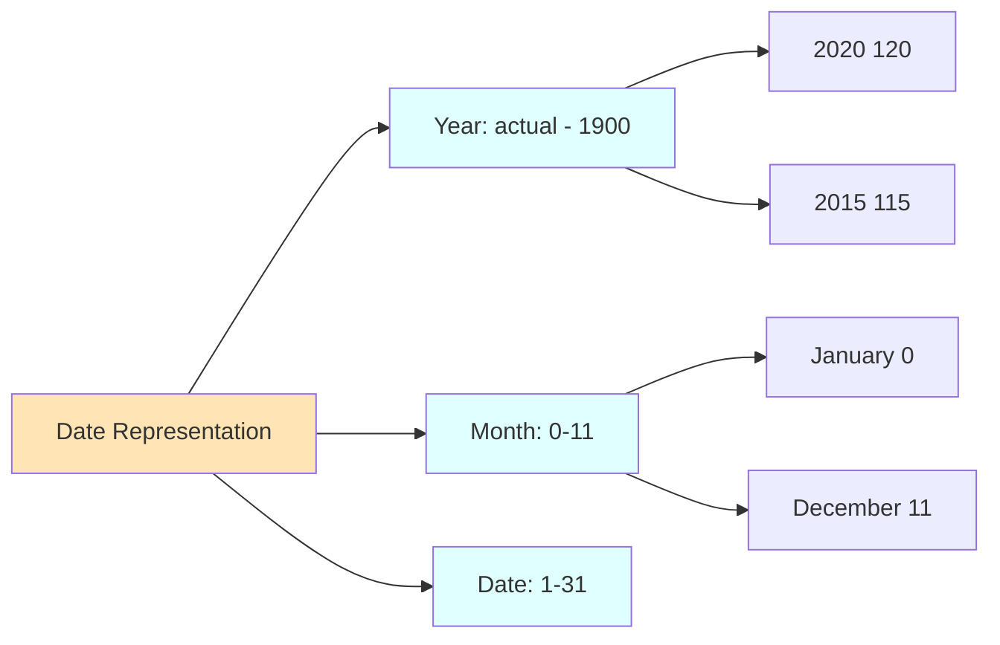

# Java Util Package Guide

## Introduction

The `java.util` package is a built-in package in Java that contains:

- Collections framework
- Legacy collection classes
- Event model
- Date and time facilities
- Internationalization (I18N)
- Other utility classes

## Arrays

### Managing Collection of Elements with Arrays

You can manage collections of elements using arrays:

**Creating an Array:**
```java
int arr[] = new int[3];
```

**Initializing an Array:**
```java
arr[0] = 99;
arr[1] = 88;
arr[2] = 77;
```

**Accessing Array Elements:**
```java
for(int i = 0; i < arr.length; i++)
    System.out.println(arr[i]);
```

### Limitations with Arrays

::: warning Array Limitations
- **Homogeneous data structure**: Only one type of elements can be stored
- **Static in nature**: Size of an array cannot be modified
- **Insert and delete operations**: Require more shifting of elements
:::

## Legacy API

Java vendor provided classes and interfaces before Java 2 to solve the limitations of arrays.

### Legacy Classes

The following 5 legacy classes are available:

1. **Stack**
2. **Vector**
3. **Dictionary**
4. **Hashtable**
5. **Properties**

### Legacy Interface

**Enumeration** is the legacy interface available.

## Managing Collection of Data

Collection of data can be managed in two forms:

### a) Collection of Elements

Examples:
- Collection of Emails
- Collection of Phones

**Vector** and **Stack** can be used to manage collections of elements.

### b) Collection of Key-Value Pairs

Examples:
- Collection of Country and corresponding Capital
- Collection of ID and corresponding Name

**Properties**, **Dictionary**, and **Hashtable** can be used to manage collections of key-value pairs.

::: tip Legacy Cursor
**Enumeration** is a legacy cursor used to access data from legacy classes one by one.
:::

### Code Examples

#### Lab703: Vector with Enumeration

```java
import java.util.*;

class Lab703 {
    public static void main(String args[]) {
        Vector myvector = new Vector();
        myvector.addElement(10);
        myvector.addElement(20);
        myvector.addElement(30);
        myvector.addElement("JLC");
        myvector.addElement(99.99);
        System.out.println(myvector);
        
        Enumeration enm = myvector.elements();
        while(enm.hasMoreElements()) {
            Object x = enm.nextElement();
            System.out.println(x);
        }
    }
}
```

#### Lab704: Vector with Generics

```java
import java.util.*;

class Lab704 {
    public static void main(String args[]) {
        Vector<Integer> myvector = new Vector<>();
        myvector.addElement(10);
        myvector.addElement(20);
        myvector.addElement(30);
        System.out.println(myvector);
        
        Enumeration<Integer> enm = myvector.elements();
        while(enm.hasMoreElements()) {
            Integer x = enm.nextElement();
            System.out.println(x);
        }
    }
}
```

#### Lab705: Stack Example

```java
import java.util.*;

class Lab705 {
    public static void main(String args[]) {
        Stack<Integer> mystack = new Stack<Integer>();
        mystack.addElement(10);
        mystack.addElement(20);
        mystack.addElement(30);
        mystack.addElement(40);
        mystack.addElement(50);
        System.out.println(mystack);
        
        Enumeration<Integer> enm = mystack.elements();
        while(enm.hasMoreElements()) {
            Integer x = enm.nextElement();
            System.out.println(x);
        }
    }
}
```

#### Lab706: Hashtable Example

```java
import java.util.*;

class Lab706 {
    public static void main(String args[]) {
        Hashtable<String,Integer> myht = new Hashtable<String,Integer>();
        myht.put("aaa", 10);
        myht.put("bbb", 50);
        myht.put("sri", 90);
        System.out.println(myht);
        System.out.println(myht.get("sri"));
        
        Enumeration<String> enm = myht.keys();
        while(enm.hasMoreElements()) {
            String mykey = enm.nextElement();
            Integer myval = myht.get(mykey);
            System.out.println(mykey + "\t" + myval);
        }
    }
}
```

#### Lab707: Properties Example

```java
import java.util.*;

class Lab707 {
    public static void main(String args[]) {
        Properties myprops = new Properties();
        myprops.put("aaa", 10);
        myprops.put("bbb", 50);
        myprops.put("sri", 90);
        System.out.println(myprops);
        System.out.println(myprops.get("sri"));
        
        Enumeration enm = myprops.keys();
        while(enm.hasMoreElements()) {
            Object mykey = enm.nextElement();
            Object myval = myprops.get(mykey);
            System.out.println(mykey + "\t" + myval);
        }
    }
}
```

### Limitations with Legacy Classes

::: danger Legacy Class Limitations
- No specific scenario defined for when to use which classes
- Almost all methods are synchronized
- Same object cannot be accessed by multiple threads concurrently
:::

## Collection Framework

Java Vendor provided a new API (Collection Framework API) from Java 2 to solve problems associated with Legacy classes.

### Overview

The Collection Framework provides mechanisms to store and manipulate groups of elements.

**Operations supported:**
- Searching
- Sorting
- Insertion
- Deletion
- And more...

### Collection Framework Components


### Top Level Interfaces

The following are the top level interfaces in Collection Framework API:

1. **Collection**
2. **Map**
3. **Iterator**

::: info Usage
- **Collection** subclasses: Manage collection of elements without key-value format
- **Map** subclasses: Manage collection of elements with key-value format
- **Iterator**: Access data from the collection
:::

## Exploring Collection Interface

The Collection interface has 3 sub-interfaces:


### Methods of Collection Interface

| Method | Description |
|--------|-------------|
| `boolean add(Object obj)` | Adds objects to collection |
| `int size()` | Returns number of objects available in collection |
| `boolean isEmpty()` | Checks whether collection is empty or not |
| `boolean contains(Object obj)` | Checks whether collection has specified object or not |
| `Iterator iterator()` | Returns Iterator subclass object |
| `Object[] toArray()` | Returns an array containing all elements of collection |
| `boolean remove(Object obj)` | Removes first occurrence of specified object from collection |
| `void clear()` | Removes all elements from collection |
| `boolean addAll(Collection c)` | Adds all data of specified collection in the current collection |
| `boolean containsAll(Collection c)` | Returns true if current collection contains all elements of specified collection |
| `boolean removeAll(Collection c)` | Removes all matching elements of specified collection from current collection |
| `boolean retainAll(Collection c)` | Removes all non-matching elements of specified collection from current collection |

### Collection Hierarchy


### Code Examples

#### Lab708: Basic Collection Operations

```java
import java.util.*;

class Lab708 {
    public static void main(String args[]) {
        List<String> mylist = new ArrayList<String>();
        System.out.println(mylist);
        System.out.println(mylist.size());
        System.out.println(mylist.isEmpty());
        
        mylist.add("Java");
        mylist.add("Spring");
        mylist.add("Hibernate");
        mylist.add("SpringBoot");
        mylist.add("React");
        
        System.out.println(mylist);
        System.out.println(mylist.size());
        System.out.println(mylist.isEmpty());
        System.out.println(mylist.contains("Spring"));
        System.out.println(mylist.contains("DSA"));
        
        mylist.remove("Spring");
        mylist.add("DSA");
        
        System.out.println(mylist.contains("Spring"));
        System.out.println(mylist.contains("DSA"));
        System.out.println(mylist);
        
        mylist.clear();
        System.out.println(mylist);
    }
}
```

#### Lab709: Iterator and toArray

```java
import java.util.*;

class Lab709 {
    public static void main(String args[]) {
        List<String> mylist = new ArrayList<String>();
        mylist.add("Java");
        mylist.add("DSA");
        mylist.add("Spring");
        mylist.add("Hibernate");
        mylist.add("SpringBoot");
        mylist.add("React");
        System.out.println(mylist);
        
        Iterator<String> myit = mylist.iterator();
        while(myit.hasNext()) {
            String str = myit.next();
            System.out.println(str);
        }
        
        System.out.println("--------------------");
        Object myarray[] = mylist.toArray();
        for(Object obj : myarray) {
            System.out.println(obj);
        }
    }
}
```

#### Lab710: Adding Collections

```java
import java.util.*;

class Lab710 {
    public static void main(String args[]) {
        List courseList = new ArrayList();
        courseList.add("Java");
        courseList.add("DSA");
        courseList.add("Spring");
        courseList.add("React");
        System.out.println(courseList);
        
        List numsList = new ArrayList();
        numsList.add(10);
        numsList.add(20);
        numsList.add(30);
        System.out.println(numsList);
        
        System.out.println(courseList);
        courseList.add(numsList);
        System.out.println(courseList);
        System.out.println(courseList.contains("Java"));
        System.out.println(courseList.contains(numsList));
    }
}
```

#### Lab711: addAll Method

```java
import java.util.*;

class Lab711 {
    public static void main(String args[]) {
        List courseList = new ArrayList();
        courseList.add("Java");
        courseList.add("DSA");
        courseList.add("Spring");
        courseList.add("React");
        System.out.println(courseList);
        
        List numsList = new ArrayList();
        numsList.add(10);
        numsList.add(20);
        numsList.add(30);
        System.out.println(numsList);
        
        System.out.println(courseList);
        courseList.addAll(numsList);
        System.out.println(courseList);
        System.out.println(courseList.contains("Java"));
        System.out.println(courseList.contains(numsList));
        System.out.println(courseList.containsAll(numsList));
    }
}
```

#### Lab712: removeAll Method

```java
import java.util.*;

class Lab712 {
    public static void main(String args[]) {
        List courseList = new ArrayList();
        courseList.add("Java");
        courseList.add("DSA");
        courseList.add("Spring");
        courseList.add("React");
        System.out.println(courseList);
        
        List numsList = new ArrayList();
        numsList.add(10);
        numsList.add(20);
        numsList.add(30);
        System.out.println(numsList);
        
        courseList.addAll(numsList);
        System.out.println(courseList);
        
        courseList.removeAll(numsList);
        System.out.println(courseList);
    }
}
```

#### Lab713: retainAll Method

```java
import java.util.*;

class Lab713 {
    public static void main(String args[]) {
        List courseList = new ArrayList();
        courseList.add("Java");
        courseList.add("DSA");
        courseList.add("Spring");
        courseList.add("React");
        System.out.println(courseList);
        
        List numsList = new ArrayList();
        numsList.add(10);
        numsList.add(20);
        numsList.add(30);
        System.out.println(numsList);
        
        courseList.addAll(numsList);
        System.out.println(courseList);
        
        courseList.retainAll(numsList);
        System.out.println(courseList);
    }
}
```

## Exploring List Interface

**List** is an interface in `java.util` package that extends `java.util.Collection` interface.

### List Characteristics

- Allows duplicate elements
- Elements are stored with indexing notation

### List Concrete Sub-classes

1. **ArrayList**
2. **LinkedList**
3. **Vector**
4. **Stack**

### ArrayList

::: info ArrayList Features
- Allows duplicates
- Implemented as a resizable array
- Elements stored internally using indexing notation
- Most widely used concrete class
- **Fast** for accessing elements
- **Slow** for inserting and deleting elements
:::

### LinkedList

::: info LinkedList Features
- Allows duplicates
- Internally implements doubly-linked list data structure
- Elements stored using node representation
- **Fast** for inserting or deleting elements
- **Slow** for accessing elements
:::

### Vector

::: warning Vector (Legacy Class)
- Allows duplicates
- Implemented as a resizable array
- Elements stored internally using indexing notation
- Methods are synchronized
- Vector object can't be accessed by multiple threads at a time
- **Not recommended for use**
:::

### Stack

::: warning Stack (Legacy Class)
- Subclass of Vector
- Methods are synchronized
- Stack object can't be accessed by multiple threads at a time
- Important operations: `peek()`, `pop()`, `push()`, `search()`
- **Not recommended for use**
:::

### Methods of List Interface

| Method | Description |
|--------|-------------|
| `void add(int idx, Object obj)` | Add/Insert the element at the specific index |
| `Object remove(int idx)` | Removes the element available at specified index |
| `Object get(int idx)` | Returns the element available at specified index |
| `Object set(int idx, Object obj)` | Replaces the object available at specified index |
| `int indexOf(Object obj)` | Returns the first position of specified object |
| `int lastIndexOf(Object obj)` | Returns the last position of specified object |
| `List subList(int stIdx, int endIdx)` | Returns portion of list |
| `ListIterator listIterator()` | Returns ListIterator object that points before first record |
| `ListIterator listIterator(int stIdx)` | Returns ListIterator object that points to specified index |

### Code Examples

#### Lab714: Basic List Operations

```java
import java.util.*;

class Lab714 {
    public static void main(String args[]) {
        List<String> courseList = new ArrayList<>();
        courseList.add("Java");
        courseList.add("DSA");
        courseList.add("Spring");
        courseList.add("React");
        courseList.add("MicroServices");
        System.out.println(courseList);
        
        courseList.add(3, "Spring Boot");
        System.out.println(courseList);
        
        courseList.remove(4);
        System.out.println(courseList);
        
        System.out.println(courseList.get(1));
        System.out.println(courseList.get(4));
    }
}
```

#### Lab715: indexOf and set Methods

```java
import java.util.*;

class Lab715 {
    public static void main(String args[]) {
        List<String> courseList = new ArrayList<>();
        courseList.add("Java");
        courseList.add("DSA");
        courseList.add("Spring");
        courseList.add("React");
        courseList.add("Spring");
        courseList.add("MicroServices");
        System.out.println(courseList);
        
        System.out.println(courseList.get(1));
        System.out.println(courseList.get(2));
        System.out.println(courseList.indexOf("DSA"));
        System.out.println(courseList.indexOf("Spring"));
        System.out.println(courseList.lastIndexOf("Spring"));
        
        System.out.println(courseList);
        System.out.println(courseList.set(4, "Spring 5"));
        System.out.println(courseList.set(0, "Java 18"));
        System.out.println(courseList);
    }
}
```

#### Lab716: subList Method

```java
import java.util.*;

class Lab716 {
    public static void main(String args[]) {
        List<String> courseList = new ArrayList<>();
        courseList.add("Java");
        courseList.add("DSA");
        courseList.add("Spring");
        courseList.add("React");
        courseList.add("Spring");
        courseList.add("MicroServices");
        courseList.add("Spring Boot");
        courseList.add("AWS");
        courseList.add("DevOps");
        System.out.println(courseList);
        
        List<String> mylist1 = courseList.subList(3, 8);
        System.out.println(mylist1);
        
        List<String> mylist2 = courseList.subList(2, 5);
        System.out.println(mylist2);
    }
}
```

#### Lab717: Iterator Example

```java
import java.util.*;

class Lab717 {
    public static void main(String args[]) {
        List<String> courseList = new ArrayList<>();
        courseList.add("Java");
        courseList.add("DSA");
        courseList.add("Spring");
        courseList.add("React");
        courseList.add("Spring");
        courseList.add("Spring Boot");
        System.out.println(courseList);
        
        Iterator<String> myit = courseList.iterator();
        while(myit.hasNext()) {
            String str = myit.next();
            System.out.println(str);
        }
    }
}
```

#### Lab718: ListIterator Forward and Reverse

```java
import java.util.*;

class Lab718 {
    public static void main(String args[]) {
        List<Integer> mylist = new ArrayList<>();
        mylist.add(10);
        mylist.add(20);
        mylist.add(30);
        mylist.add(40);
        mylist.add(50);
        System.out.println(mylist);
        
        ListIterator<Integer> mylistIt = mylist.listIterator();
        
        System.out.println("Forward Order");
        while(mylistIt.hasNext()) {
            Integer x = mylistIt.next();
            System.out.println(x);
        }
        
        System.out.println("Reverse Order");
        while(mylistIt.hasPrevious()) {
            Integer x = mylistIt.previous();
            System.out.println(x);
        }
    }
}
```

#### Lab720: ListIterator from End

```java
import java.util.*;

class Lab720 {
    public static void main(String args[]) {
        List<Integer> mylist = new ArrayList<>();
        mylist.add(10);
        mylist.add(20);
        mylist.add(30);
        mylist.add(40);
        mylist.add(50);
        
        ListIterator<Integer> mylistIt = mylist.listIterator(mylist.size());
        
        System.out.println("Reverse Order");
        while(mylistIt.hasPrevious()) {
            Integer x = mylistIt.previous();
            System.out.println(x);
        }
    }
}
```

## Cursors in Java Collections

### Enumeration Interface

**Enumeration** is an interface in `java.util` package used as a cursor to access elements from legacy classes one by one.

**Methods:**
1. `boolean hasMoreElements()` - Checks whether next element is available
2. `Object nextElement()` - Moves the pointer and returns elements from collection

### Iterator Interface

**Iterator** is an interface in `java.util` package used as a cursor to access elements from Collection subclasses one by one.

**Getting Iterator instance:**
```java
Iterator it = col.iterator();
```

**Methods:**
1. `boolean hasNext()` - Checks whether next element is available
2. `Object next()` - Moves the pointer and returns elements from collection
3. `void remove()` - Removes the current element from Collections

### ListIterator Interface

**ListIterator** is an interface that extends Iterator interface and provides extra methods for use with List subclasses only.

**Features:**
- Access the index of elements
- Access elements in both forward and reverse direction
- Add, Remove, and Replace data in List subclasses
- Access elements starting from specified index

### Code Examples

#### Lab721: Enumeration vs Iterator

```java
import java.util.*;

class Lab721 {
    public static void main(String args[]) {
        Vector<Integer> myvector = new Vector<Integer>();
        myvector.add(10);
        myvector.add(20);
        myvector.add(30);
        myvector.add(40);
        myvector.add(50);
        
        System.out.println("1. Using Enumeration");
        Enumeration<Integer> enm = myvector.elements();
        while(enm.hasMoreElements()) {
            Integer x = enm.nextElement();
            System.out.println(x);
        }
        
        System.out.println("2. Using Iterator");
        Iterator<Integer> it = myvector.iterator();
        while(it.hasNext()) {
            Integer x = it.next();
            System.out.println(x);
        }
    }
}
```

#### Lab722: Iterator Remove

```java
import java.util.*;

class Lab722 {
    public static void main(String args[]) {
        List<Integer> mylist = new ArrayList<>();
        mylist.add(10);
        mylist.add(20);
        mylist.add(30);
        mylist.add(40);
        mylist.add(50);
        System.out.println(mylist);
        
        Iterator<Integer> it = mylist.iterator();
        while(it.hasNext()) {
            Integer x = it.next();
            if(x == 40) {
                it.remove();
                break;
            }
        }
        System.out.println(mylist);
    }
}
```

#### Lab723: ListIterator Add

```java
import java.util.*;

class Lab723 {
    public static void main(String args[]) {
        List<Integer> mylist = new ArrayList<>();
        mylist.add(10);
        mylist.add(20);
        mylist.add(30);
        mylist.add(40);
        mylist.add(50);
        mylist.add(60);
        System.out.println(mylist);
        
        ListIterator<Integer> it = mylist.listIterator();
        while(it.hasNext()) {
            Integer x = it.next();
            if(x == 30) {
                it.add(90);
                break;
            }
        }
        System.out.println(mylist);
    }
}
```

#### Lab725: ListIterator Set

```java
import java.util.*;

class Lab725 {
    public static void main(String args[]) {
        List<String> courseList = new ArrayList<>();
        courseList.add("Java");
        courseList.add("Spring");
        courseList.add("Angular");
        courseList.add("Spring");
        courseList.add("React");
        System.out.println(courseList);
        
        ListIterator<String> it = courseList.listIterator();
        while(it.hasNext()) {
            String str = it.next();
            if(str.equals("Spring")) {
                it.set("Spring 5");
                break;
            }
        }
        System.out.println(courseList);
    }
}
```

#### Lab728: Creating List from Another Collection

```java
import java.util.*;

class Lab728 {
    public static void main(String as[]) {
        List courseList = new ArrayList(); // Empty
        System.out.println(courseList.size());
        courseList.add("Java");
        courseList.add("Spring");
        courseList.add("Angular");
        System.out.println(courseList);
        
        List mycourses = new ArrayList(courseList);
        System.out.println(mycourses.size());
        mycourses.add("Spring Boot");
        System.out.println(mycourses);
        
        Vector v = new Vector();
        v.add(10);
        v.add(20);
        v.add(30);
        v.add(40);
        v.add(50);
        System.out.println(v);
        
        List numList = new ArrayList(v);
        System.out.println(numList.size());
        System.out.println(numList);
    }
}
```

#### Lab729: LinkedList Special Methods

```java
import java.util.*;

class Lab729 {
    public static void main(String as[]) {
        LinkedList courseList = new LinkedList();
        System.out.println(courseList.size());
        courseList.add("Java");
        courseList.add("Spring");
        courseList.add("Angular");
        System.out.println(courseList);
        
        courseList.add(2, "Spring Boot");
        System.out.println(courseList);
        System.out.println("-----------------------");
        
        System.out.println(courseList.getFirst());
        System.out.println(courseList.getLast());
        
        courseList.addFirst("Hello");
        courseList.addLast("Hai");
        System.out.println(courseList);
        
        System.out.println(courseList.removeFirst());
        System.out.println(courseList.removeLast());
        System.out.println(courseList);
        
        System.out.println("-----------------------");
        System.out.println("----Using Iterator---");
        Iterator it = courseList.iterator();
        while(it.hasNext()) {
            System.out.println(it.next());
        }
    }
}
```

::: danger ConcurrentModificationException
```java
// Lab730 demonstrates ConcurrentModificationException
import java.util.*;

class Lab730 {
    public static void main(String as[]) {
        List courseList = new ArrayList();
        courseList.add("Java");
        courseList.add("Spring");
        courseList.add("Angular");
        courseList.add("Spring");
        courseList.add("Spring Boot");
        courseList.add("React");
        System.out.println(courseList);
        
        System.out.println("----Using Iterator---");
        ListIterator lit = courseList.listIterator();
        while(lit.hasNext()) {
            System.out.println(lit.next());
            // lit.add("Hello"); // OK
            // lit.remove(); // OK
            // lit.set("Hello"); // OK
            courseList.add("Python"); // ConcurrentModificationException
        }
    }
}
```
:::

### Comparing List Subclasses

| Feature | ArrayList | LinkedList | Vector/Stack |
|---------|-----------|------------|--------------|
| Order | As added by user | As added by user | As added by user |
| Duplicate Value | Yes | Yes | Yes |
| Different type of value | Yes | Yes | Yes |
| Null Value | Yes | Yes | Yes |
| Synchronized | No | No | Yes |
| Random Access | Yes | No | Yes |
| Sequential Access | Yes | Yes | Yes |
| Serializable | Yes | Yes | Yes |
| Cloneable | Yes | Yes | Yes |
| Iterator can be used | Yes | Yes | Yes |
| ListIterator can be used | Yes | Yes | Yes |
| Enumeration can be used | No | No | Yes |
| Index Representation | Yes | No | Yes |
| Node Representation | No | Yes | No |
| Deque API can be used | No | Yes | No |

### Difference between Array and ArrayList

| Array | ArrayList |
|-------|-----------|
| Programming construct to store/represent collection of elements | Class introduced from Java 2 to manage collection of elements |
| Array size is static (fixed length) | ArrayList is dynamic (variable length) |
| Need to specify size while creating array object | No need to specify size while creating ArrayList object |
| Need to specify type of elements while creating array object | No need to specify type of element (from Java 5 using GENERICS, you can restrict type) |
| Primitives can be stored in array | Primitives can't be stored in ArrayList |
| Need to use `length` property to get number of elements | Need to use `size()` method to get number of elements |
| Need to use index notation for managing elements | Need to use methods for managing elements |
| Use Arrays class methods to perform operations | Use Collections class methods to perform operations |

### Difference between Vector and ArrayList

| Vector | ArrayList |
|--------|-----------|
| Legacy class reimplemented in Collection Framework | Class introduced from Java 2 in Collection Framework |
| Methods are synchronized | Methods are non-synchronized |
| Object can't be accessed by multiple threads concurrently | Object can be accessed by multiple threads concurrently |
| Thread safe | Not thread safe |
| Can use Enumeration, Iterator, ListIterator to access data | Can't use Enumeration. Only Iterator and ListIterator can be used |

### Difference between ArrayList and LinkedList

| ArrayList | LinkedList |
|-----------|------------|
| Elements stored internally using index representation | Elements stored internally using node representation |
| Elements can be accessed randomly (implements RandomAccess Interface) | Elements cannot be accessed randomly |
| Insertion and deletion operations are expensive | Insertion and deletion operations are inexpensive |
| Occupies less memory | Occupies more memory |

### Difference between Enumeration and Iterator

| Enumeration | Iterator |
|-------------|----------|
| Legacy interface | Collection Framework interface |
| Used to access elements from Legacy class objects | Used to access elements from Collection Framework classes |
| Can't remove elements using Enumeration | Can remove elements from collection using Iterator |
| Can modify collection using collection object while accessing data | Cannot modify collection using collection object while accessing data (ConcurrentModificationException) |

### Difference between Iterator and ListIterator

| Iterator | ListIterator |
|----------|--------------|
| Used to access elements from subclasses of Collection interface | Used to access elements from subclasses of List interface only |
| Elements can be accessed only in forward direction | Elements can be accessed both in forward and reverse direction |
| Elements can be accessed only once from first to last | Elements can be accessed multiple times |
| Elements of collection cannot be replaced | Elements of collection can be replaced |
| New element cannot be added | New element can be added |
| Index of element cannot be accessed | Index of element can be accessed |
| Access elements from beginning only | Access elements from beginning or from any required location |

## Exploring Set Interface

**Set** is an interface in `java.util` package that extends `java.util.Collection` interface.

### Set Characteristics

::: info Key Features
- Set subclasses **do not allow duplicate elements**
- Set interface does not have any extra methods
- All methods of Collection interface can be used with Set subclasses
:::

### Set Concrete Sub-classes


### HashSet

::: tip HashSet Features
- Fast for searching and retrieving elements
- Does not maintain any order for stored elements
:::

### LinkedHashSet

::: tip LinkedHashSet Features
- Subclass of HashSet
- Stores data in the order as added by the user
:::

### TreeSet

::: tip TreeSet Features
- Stores elements in a sorted order
- `compareTo()` method is used to identify object uniquely and manage order
- Object must be subtype of Comparable interface
- If object is not subtype of Comparable, throws `java.lang.ClassCastException`
- Allows elements of similar type only
- Null value cannot be stored
:::

### NavigableSet

::: info NavigableSet (Java 6)
- Interface added in Java 6
- Subtype of SortedSet
- Functionality similar to TreeSet with extra methods for easy navigation
- Elements can be accessed in both forward and reverse order
:::

### Methods from NavigableSet

| Method | Description |
|--------|-------------|
| `E ceiling(E e)` | Returns the least element greater than or equal to the given element |
| `Iterator descendingIterator()` | Returns an iterator in descending order |
| `NavigableSet descendingSet()` | Returns a reverse order view of elements |
| `E floor(E e)` | Returns the greatest element less than or equal to the given element |
| `SortedSet<E> headSet(E toElement)` | Returns view of portion less than toElement |
| `NavigableSet<E> headSet(E toElement, boolean inclusive)` | Returns view with inclusive option |
| `E higher(E e)` | Returns least element strictly greater than given element |
| `Iterator iterator()` | Returns iterator in ascending order |
| `E lower(E e)` | Returns greatest element strictly less than given element |
| `E pollFirst()` | Retrieves and removes first (lowest) element |
| `E pollLast()` | Retrieves and removes last (highest) element |
| `NavigableSet subSet(E from, boolean fromInc, E to, boolean toInc)` | Returns view of portion with inclusive options |
| `SortedSet subSet(E from, E to)` | Returns view from fromElement (inclusive) to toElement (exclusive) |
| `SortedSet tailSet(E fromElement)` | Returns view greater than or equal to fromElement |
| `NavigableSet tailSet(E fromElement, boolean inclusive)` | Returns view with inclusive option |

### Code Examples

#### Lab731: HashSet Basic Operations

```java
import java.util.*;

class Lab731 {
    public static void main(String args[]) {
        Set courseSet = new HashSet();
        courseSet.add("Java");
        courseSet.add("SQL");
        courseSet.add("DSA");
        courseSet.add("Spring");
        courseSet.add("DSA");      // Duplicate - won't be added
        courseSet.add("Spring");   // Duplicate - won't be added
        courseSet.add("Java");     // Duplicate - won't be added
        courseSet.add(123);
        courseSet.add(99.99);
        System.out.println(courseSet);
        
        List<Integer> mylist = new ArrayList<>();
        mylist.add(10);
        mylist.add(20);
        mylist.add(30);
        mylist.add(40);
        mylist.add(40);
        mylist.add(50);
        mylist.add(50);
        System.out.println(mylist);
        
        Set<Integer> myset = new HashSet<>(mylist);
        System.out.println(myset);
    }
}
```

#### Lab732: HashSet with Iterator

```java
import java.util.*;

class Lab732 {
    public static void main(String args[]) {
        Set<String> courseSet = new HashSet<>();
        courseSet.add("Java");
        courseSet.add("SQL");
        courseSet.add("DSA");
        courseSet.add("Spring");
        courseSet.add("DSA");
        courseSet.add("React");
        System.out.println(courseSet);
        
        System.out.println("----Using Iterator-------");
        Iterator<String> it = courseSet.iterator();
        while(it.hasNext()) {
            String str = it.next();
            System.out.println(str);
        }
    }
}
```

#### Lab733: LinkedHashSet Example

```java
import java.util.*;

class Lab733 {
    public static void main(String args[]) {
        Set<String> courseSet = new LinkedHashSet<>();
        courseSet.add("Java");
        courseSet.add("SQL");
        courseSet.add("DSA");
        courseSet.add("Spring");
        courseSet.add("DSA");
        courseSet.add("React");
        System.out.println(courseSet);
        
        System.out.println("--Using Iterator----");
        Iterator<String> it = courseSet.iterator();
        while(it.hasNext()) {
            String str = it.next();
            System.out.println(str);
        }
    }
}
```

#### Lab734: TreeSet with Strings

```java
import java.util.*;

class Lab734 {
    public static void main(String args[]) {
        Set<String> courseSet = new TreeSet<>();
        courseSet.add("Java");
        courseSet.add("SQL");
        courseSet.add("DSA");
        courseSet.add("Spring");
        courseSet.add("DSA");
        courseSet.add("React");
        System.out.println(courseSet);
        
        System.out.println("--Using Iterator----");
        Iterator<String> it = courseSet.iterator();
        while(it.hasNext()) {
            String str = it.next();
            System.out.println(str);
        }
    }
}
```

#### Lab735: TreeSet with Integers

```java
import java.util.*;

class Lab735 {
    public static void main(String args[]) {
        Set<Integer> myset = new TreeSet<>();
        myset.add(50);
        myset.add(10);
        myset.add(70);
        myset.add(90);
        myset.add(60);
        myset.add(80);
        myset.add(20);
        myset.add(40);
        myset.add(30);
        System.out.println(myset);
        
        System.out.println("----Using Iterator--");
        Iterator<Integer> it = myset.iterator();
        while(it.hasNext()) {
            Integer x = it.next();
            System.out.println(x);
        }
    }
}
```

#### Lab736: TreeSet NavigableSet Methods

```java
import java.util.*;

class Lab736 {
    public static void main(String args[]) {
        TreeSet<Integer> myset = new TreeSet<>();
        myset.add(50);
        myset.add(10);
        myset.add(70);
        myset.add(90);
        myset.add(60);
        myset.add(80);
        myset.add(20);
        myset.add(40);
        myset.add(30);
        System.out.println(myset);
        
        Set<Integer> myset1 = myset.subSet(30, 70);
        System.out.println(myset1);
        
        Set<Integer> myset2 = myset.subSet(30, false, 70, false);
        System.out.println(myset2);
        
        Set<Integer> myset3 = myset.subSet(30, true, 70, true);
        System.out.println(myset3);
        
        Set<Integer> myset4 = myset.headSet(50);
        System.out.println(myset4);
        
        Set<Integer> myset5 = myset.headSet(50, true);
        System.out.println(myset5);
        
        Set<Integer> myset6 = myset.tailSet(60);
        System.out.println(myset6);
        
        Set<Integer> myset7 = myset.tailSet(60, true);
        System.out.println(myset7);
    }
}
```

#### Lab737: TreeSet Navigation Methods

```java
import java.util.*;

public class Lab737 {
    public static void main(String as[]) {
        TreeSet<Integer> myset = new TreeSet<Integer>();
        myset.add(50);
        myset.add(20);
        myset.add(10);
        myset.add(80);
        myset.add(60);
        myset.add(70);
        myset.add(90);
        myset.add(30);
        myset.add(40);
        System.out.println(myset);
        
        System.out.println(myset.first());
        System.out.println(myset.last());
        System.out.println(myset.lower(50));
        System.out.println(myset.higher(60));
        System.out.println(myset.floor(50));
        System.out.println(myset.ceiling(60));
        System.out.println(myset);
        
        System.out.println(myset.pollFirst());
        System.out.println(myset.pollLast());
        System.out.println(myset);
    }
}
```

#### Lab738: Descending Iteration

```java
import java.util.*;

class Lab738 {
    public static void main(String as[]) {
        TreeSet<Integer> myset = new TreeSet<>();
        myset.add(50);
        myset.add(20);
        myset.add(10);
        myset.add(80);
        myset.add(60);
        myset.add(70);
        myset.add(90);
        myset.add(30);
        myset.add(40);
        System.out.println(myset);
        
        Set<Integer> myset1 = myset.descendingSet();
        System.out.println(myset1);
        
        System.out.println("----------");
        Iterator<Integer> it1 = myset1.iterator();
        while (it1.hasNext()) {
            System.out.println(it1.next());
        }
        
        System.out.println("----------");
        Iterator<Integer> it2 = myset.descendingIterator();
        while (it2.hasNext()) {
            System.out.println(it2.next());
        }
    }
}
```

### Comparing Set Subclasses

| Feature | HashSet | LinkedHashSet | TreeSet |
|---------|---------|---------------|---------|
| Order | Unordered | As added by user | Sorted |
| Duplicate Value | No | No | No |
| Different type of value | Yes | Yes | No |
| Null Value | Yes | Yes | No |
| Synchronized | No | No | No |
| Serializable | Yes | Yes | Yes |
| Cloneable | Yes | Yes | Yes |
| Iterator can be used | Yes | Yes | Yes |
| ListIterator can be used | No | No | No |
| Enumeration can be used | No | No | No |
| Index Representation | No | No | No |
| Using Hashing | Yes | No | No |
| Node Representation | No | Yes | No |
| NavigableSet API used | No | No | Yes |

### Difference between List and Set

| List | Set |
|------|-----|
| Can hold duplicate elements | Cannot hold duplicate elements |
| Both Iterator and ListIterator can be used | Only Iterator can be used |
| Can add elements at required location | Cannot add elements at required location |
| Can remove elements from required location | Cannot remove elements from required location |
| Can access elements using index | Cannot access elements using index |
| No subclasses to store elements in sorted order | Has TreeSet subclass to store elements in sorted order |
| hashCode() or equals() methods not used while storing | hashCode() or equals() methods used while storing to avoid duplicacy |

### Difference between HashSet and TreeSet

| HashSet | TreeSet |
|---------|---------|
| Elements are unordered (based on hashcode values) | Elements are in sorted order (based on compareTo() method) |
| Can hold different types of elements | Can hold only same types of elements (must be Comparable) |
| Null value can be stored | Null value cannot be stored |

### Difference between HashSet and LinkedHashSet

| HashSet | LinkedHashSet |
|---------|---------------|
| Elements are unordered (based on hashcode values) | Elements are in order added by user |

## Exploring Queue Interface

**Queue** is a newly added interface in Java 5.

### Queue Hierarchy


### Queue Implementation Classes

Java Collections has 3 classes for Queue use-cases:

#### a) ArrayDeque

::: info ArrayDeque Features
- Latest class from java.util package
- Implemented with Arrays
- Use in single-threaded environment
- For multi-threaded environment, provide external synchronization
- Likely to be faster than LinkedList
- Can be used as Stack and Queue
:::

#### b) LinkedList

::: info LinkedList as Queue
- Class from java.util package
- Implemented with Nodes
- Use in single-threaded environment
- For multi-threaded environment, provide external synchronization
- Likely to be slower than ArrayDeque
- Can be used as List, Stack, and Queue
:::

#### c) PriorityQueue

::: info PriorityQueue Features
- Commonly used subclass of Queue interface
- Doesn't allow null values
- Can add only comparable objects
- Implemented based on Heap Data Structure
:::

### Methods of Queue

| Method | Description |
|--------|-------------|
| `boolean offer(E)` | Inserts the specified element into this queue |
| `boolean add(E)` | Inserts the specified element into this queue |
| `E peek()` | Retrieves, but does not remove the head of queue |
| `E element()` | Retrieves, but does not remove the head of queue |
| `E poll()` | Retrieves and removes the head of this queue |
| `boolean remove()` | Retrieves and removes the head of this queue |

### Methods of Deque

| Method | Description |
|--------|-------------|
| `void addFirst(E)` | Inserts element at the front of deque |
| `void addLast(E)` | Inserts element at the end of deque |
| `boolean offerFirst(E)` | Inserts element at the front of deque |
| `boolean offerLast(E)` | Inserts element at the end of deque |
| `E removeFirst()` | Retrieves and removes first element |
| `E removeLast()` | Retrieves and removes last element |
| `E pollFirst()` | Retrieves and removes first element |
| `E pollLast()` | Retrieves and removes last element |
| `E getFirst()` | Retrieves, but does not remove, first element |
| `E getLast()` | Retrieves, but does not remove, last element |
| `E peekFirst()` | Retrieves, but does not remove, first element |
| `E peekLast()` | Retrieves, but does not remove, last element |
| `void push(E)` | Pushes element onto stack |
| `E pop()` | Pops element from stack |
| `Iterator iterator()` | Returns iterator in proper sequence |
| `Iterator descendingIterator()` | Returns iterator in reverse order |

### Code Examples

#### Lab739: Stack Operations with Deque

```java
import java.util.*;

class Lab739 {
    public static void main(String args[]) {
        LinkedList<Integer> myque = new LinkedList<>();
        System.out.println(myque.size());
        System.out.println(myque.isEmpty());
        System.out.println(myque);
        
        myque.push(10);
        myque.push(20);
        myque.push(30);
        myque.push(40);
        myque.push(50);
        
        System.out.println(myque.size());
        System.out.println(myque.isEmpty());
        System.out.println(myque);
        System.out.println("---------------");
        
        System.out.println(myque.peek());
        System.out.println(myque.pop());
        System.out.println(myque);
        System.out.println("---------------");
        
        System.out.println(myque.peek());
        System.out.println(myque.pop());
        System.out.println(myque);
        System.out.println("---------------");
        
        System.out.println(myque.peek());
        myque.push(60);
        System.out.println(myque);
    }
}
```

#### Lab740: Queue Operations with offer/poll

```java
import java.util.*;

class Lab740 {
    public static void main(String args[]) {
        LinkedList<Integer> myque = new LinkedList<>();
        System.out.println(myque.size());
        System.out.println(myque.isEmpty());
        System.out.println(myque);
        
        myque.offer(10);
        myque.offer(20);
        myque.offer(30);
        myque.offer(40);
        myque.offer(50);
        
        System.out.println(myque.size());
        System.out.println(myque.isEmpty());
        System.out.println(myque);
        System.out.println("---------------");
        
        System.out.println(myque.peek());
        System.out.println(myque.poll());
        System.out.println(myque);
        System.out.println("---------------");
        
        System.out.println(myque.peek());
        System.out.println(myque.poll());
        System.out.println(myque);
        System.out.println("---------------");
        
        System.out.println(myque.peek());
        myque.offer(60);
        System.out.println(myque);
    }
}
```

#### Lab742: Forward and Reverse Iteration

```java
import java.util.*;

class Lab742 {
    public static void main(String args[]) {
        Deque<Integer> myque = new LinkedList<>();
        myque.add(10);
        myque.add(20);
        myque.add(30);
        myque.add(40);
        myque.add(50);
        System.out.println(myque);
        
        System.out.println("Forward Order");
        Iterator<Integer> it1 = myque.iterator();
        while(it1.hasNext()) {
            Integer x = it1.next();
            System.out.println(x);
        }
        
        System.out.println("Reverse Order");
        Iterator<Integer> it2 = myque.descendingIterator();
        while(it2.hasNext()) {
            Integer x = it2.next();
            System.out.println(x);
        }
    }
}
```

#### Lab743: Deque First/Last Methods

```java
import java.util.*;

class Lab743 {
    public static void main(String args[]) {
        Deque<Integer> myque = new LinkedList<>();
        myque.add(10);
        myque.add(20);
        myque.add(30);
        myque.add(40);
        myque.add(50);
        System.out.println(myque);
        
        myque.addFirst(66);
        myque.addLast(99);
        System.out.println(myque);
        System.out.println("--------------");
        
        System.out.println(myque.getFirst());
        System.out.println(myque.getLast());
        System.out.println("--------------");
        
        myque.removeFirst();
        myque.removeLast();
        System.out.println(myque);
        System.out.println("--------------");
        
        System.out.println(myque.getFirst());
        System.out.println(myque.getLast());
        System.out.println(myque);
    }
}
```

#### Lab745: PriorityQueue Adding Elements

```java
import java.util.*;

class Lab745 {
    public static void main(String args[]) {
        PriorityQueue<Integer> pque = new PriorityQueue<>();
        pque.offer(50);
        pque.offer(40);
        System.out.println(pque);
        pque.offer(10);
        System.out.println(pque);
        pque.offer(20);
        System.out.println(pque);
        pque.offer(60);
        System.out.println(pque);
        pque.offer(70);
        System.out.println(pque);
        pque.offer(30);
        System.out.println(pque);
    }
}
```

#### Lab746: PriorityQueue Polling Elements

```java
import java.util.*;

class Lab746 {
    public static void main(String args[]) {
        PriorityQueue<Integer> pque = new PriorityQueue<>();
        pque.offer(50);
        pque.offer(40);
        pque.offer(10);
        pque.offer(20);
        pque.offer(60);
        pque.offer(70);
        pque.offer(30);
        System.out.println(pque);
        
        System.out.println(pque.peek());
        pque.poll();
        System.out.println(pque);
        
        System.out.println(pque.peek());
        pque.poll();
        System.out.println(pque);
        
        System.out.println(pque.peek());
        pque.poll();
        System.out.println(pque);
        
        System.out.println(pque.peek());
    }
}
```

#### Lab747: PriorityQueue with Reverse Order

```java
import java.util.*;

class Lab747 {
    public static void main(String args[]) {
        PriorityQueue<Integer> pque = new PriorityQueue<>(Collections.reverseOrder());
        pque.offer(50);
        pque.offer(40);
        System.out.println(pque);
        pque.offer(10);
        System.out.println(pque);
        pque.offer(20);
        System.out.println(pque);
        pque.offer(60);
        System.out.println(pque);
        pque.offer(70);
        System.out.println(pque);
        pque.offer(30);
        System.out.println(pque);
    }
}
```

## Exploring Map Interface

**Map** is an interface in `java.util` package introduced in the Collection Framework API.

::: warning Important
Map is part of Collection Framework API but does NOT extend Collection interface or Iterable interface. It is the root of its own hierarchy.
:::

### Map Characteristics

- Maps keys to values
- Key is always unique in the Map
- Value may not be unique
- One key-value pair is known as one map entry
- One map entry is stored in an Entry object (Entry is an inner interface in Map interface)

### Map Hierarchy


### Map Concrete Sub-classes

#### HashMap

::: info HashMap Features
- Uses hashing to find place for searching or storing a pair
- Fast for searching and inserting elements
- Does not store elements in any order
:::

#### LinkedHashMap

::: info LinkedHashMap Features
- Subclass of HashMap
- Stores elements in the order specified by user
:::

#### TreeMap

::: info TreeMap Features
- Stores elements in sorted order by key
- `compareTo()` method used to identify key uniquely and manage order
- Key must be subtype of Comparable interface
- If key is not subtype of Comparable, throws `java.lang.ClassCastException`
- Allows keys of similar type only
- Null value cannot be stored as key
:::

#### NavigableMap

::: info NavigableMap (Java 6)
- Interface added in Java 6
- Subtype of SortedMap
- Functionality similar to TreeMap with extra methods for easy navigation
- Elements can be accessed in both forward and reverse order
:::

### Methods of Map Interface

| Method | Description |
|--------|-------------|
| `int size()` | Returns number of entries of map |
| `boolean isEmpty()` | Returns true if map contains zero entry |
| `boolean containsKey(Object obj)` | Verify that object available as key or not in map |
| `boolean containsValue(Object obj)` | Verify that object available as value or not |
| `Object get(Object key)` | Returns value of specified key |
| `Object put(K, V)` | Adds or replace an entry to map |
| `Object remove(Object key)` | Removes entry of the specified key |
| `void putAll(Map map)` | Adds all entries of specified Map into current Map |
| `void clear()` | Removes all the entries |
| `Set keySet()` | Returns all the keys of map as Set object |
| `Collection values()` | Returns all the values of map as Collection object |
| `Set entrySet()` | Returns all the entries as Set object |
| `boolean equals(Object)` | Checks equality of two maps based on entries |

### Code Examples

#### Lab749: Basic Map Operations

```java
import java.util.*;

class Lab749 {
    public static void main(String args[]) {
        Map mymap = new HashMap();
        System.out.println(mymap);
        System.out.println(mymap.size());
        System.out.println(mymap.isEmpty());
        
        mymap.put("sid", 101);
        mymap.put("name", "sri");
        mymap.put("sid", 109);
        mymap.put("email", "sri");
        mymap.put("phone", 109);
        mymap.put("email", "sri@myjlc");
        mymap.put(null, null);
        
        System.out.println(mymap);
        System.out.println(mymap.size());
        System.out.println(mymap.isEmpty());
    }
}
```

#### Lab750: Map get and contains Methods

```java
import java.util.*;

class Lab750 {
    public static void main(String args[]) {
        Map<String,String> mymap = new HashMap<>();
        mymap.put("sid", "101");
        mymap.put("sname", "sri");
        mymap.put("phone", "12345");
        mymap.put("email", "sri@myjlc");
        mymap.put("city", "Blore");
        System.out.println(mymap);
        
        System.out.println(mymap.get("sid"));
        System.out.println(mymap.get("phone"));
        System.out.println(mymap.get("city"));
        System.out.println(mymap.get("mycity"));
        
        System.out.println(mymap.containsKey("city"));
        System.out.println(mymap.containsKey("mycity"));
        System.out.println(mymap.containsValue("sri"));
        System.out.println(mymap.containsValue("jlc"));
    }
}
```

#### Lab751: Map remove and replace Methods

```java
import java.util.*;

class Lab751 {
    public static void main(String args[]) {
        Map<String,String> mymap = new HashMap<>();
        mymap.put("sid", "101");
        mymap.put("sname", "sri");
        mymap.put("phone", "12345");
        mymap.put("email", "sri@myjlc");
        mymap.put("city", "Blore");
        System.out.println(mymap);
        
        System.out.println(mymap.remove("city"));
        System.out.println(mymap.remove("email"));
        System.out.println(mymap);
        System.out.println(mymap.remove("mycity"));
        System.out.println(mymap);
        
        mymap.put("phone", "999");
        System.out.println(mymap);
        
        mymap.replace("phone", "54321");
        System.out.println(mymap);
        
        mymap.clear();
        System.out.println(mymap);
    }
}
```

#### Lab752: Map putAll Method

```java
import java.util.*;

class Lab752 {
    public static void main(String args[]) {
        Map<String,String> mymap = new HashMap<>();
        mymap.put("sid", "101");
        mymap.put("sname", "sri");
        mymap.put("city", "Blore");
        System.out.println(mymap);
        
        Map<String,String> mymap1 = new HashMap<>();
        mymap1.put("email", "sri@myjlc");
        mymap1.put("phone", "12345");
        System.out.println(mymap1);
        
        mymap.putAll(mymap1);
        System.out.println(mymap);
        System.out.println(mymap1);
    }
}
```

#### Lab753: keySet and values Methods

```java
import java.util.*;

class Lab753 {
    public static void main(String args[]) {
        Map<String,String> mymap = new HashMap<>();
        mymap.put("sid", "101");
        mymap.put("sname", "sri");
        mymap.put("city", "Blore");
        mymap.put("email", "sri");
        mymap.put("phone", "12345");
        System.out.println(mymap);
        
        System.out.println("---All Keys---");
        Set<String> mykeys = mymap.keySet();
        for(String mykey : mykeys) {
            System.out.println(mykey);
        }
        
        System.out.println("---All Values---");
        Collection<String> myvalues = mymap.values();
        for(String myval : myvalues) {
            System.out.println(myval);
        }
    }
}
```

#### Lab754: entrySet Method

```java
import java.util.*;

class Lab754 {
    public static void main(String args[]) {
        Map<String,String> mymap = new HashMap<>();
        mymap.put("sid", "101");
        mymap.put("sname", "sri");
        mymap.put("city", "Blore");
        mymap.put("email", "sri");
        mymap.put("phone", "12345");
        System.out.println(mymap);
        
        System.out.println("---Keys-Vals---");
        Set<Map.Entry<String,String>> myentries = mymap.entrySet();
        for(Map.Entry<String,String> myentry : myentries) {
            String mykey = myentry.getKey();
            String myval = myentry.getValue();
            System.out.println(mykey + "\t : \t" + myval);
        }
    }
}
```

#### Lab755: LinkedHashMap Example

```java
import java.util.*;

class Lab755 {
    public static void main(String args[]) {
        Map<String,String> mymap = new LinkedHashMap<>();
        mymap.put("sid", "123");
        mymap.put("sname", "sri");
        mymap.put("email", "sri");
        mymap.put("phone", "123");
        mymap.put("city", "Blore");
        mymap.put(null, null);
        System.out.println(mymap);
        
        System.out.println("---All Keys---");
        Set<String> mykeys = mymap.keySet();
        for(String mykey : mykeys) {
            System.out.println(mykey);
        }
    }
}
```

#### Lab756: TreeMap Example

```java
import java.util.*;

class Lab756 {
    public static void main(String args[]) {
        Map<String,String> mymap = new TreeMap<>();
        mymap.put("sid", "123");
        mymap.put("sname", "sri");
        mymap.put("email", "sri");
        mymap.put("phone", "123");
        mymap.put("city", "Blore");
        mymap.put("myjlc", null);
        // mymap.put(null, "myjlc"); // NullPointerException
        System.out.println(mymap);
        
        System.out.println("---All Keys---");
        Set<String> mykeys = mymap.keySet();
        for(String mykey : mykeys) {
            System.out.println(mykey);
        }
    }
}
```

#### Lab757: Hashtable Example

```java
import java.util.*;

class Lab757 {
    public static void main(String args[]) {
        Hashtable<String,String> mytable = new Hashtable<>();
        mytable.put("sid", "123");
        mytable.put("sname", "sri");
        mytable.put("email", "sri");
        mytable.put("phone", "123");
        mytable.put("city", "Blore");
        // mytable.put("myjlc", null); // NullPointerException
        // mytable.put(null, "myjlc"); // NullPointerException
        System.out.println(mytable);
        
        System.out.println("---All Keys---");
        Set<String> mykeys = mytable.keySet();
        for(String mykey : mykeys) {
            System.out.println(mykey);
        }
    }
}
```

### Comparing Map Subclasses

| Feature | HashMap | LinkedHashMap | TreeMap | Hashtable |
|---------|---------|---------------|---------|-----------|
| Order | Unordered | As added by user | Sorted by key | Unordered |
| Duplicate value | Yes | Yes | Yes | Yes |
| Duplicate Key | No | No | No | No |
| Different type of value | Yes | Yes | Yes | Yes |
| Different type of key | Yes | Yes | No | Yes |
| Null value | Yes | Yes | Yes | No |
| Null key | Yes | Yes | No | No |
| Synchronized | No | No | No | Yes |
| Enumeration can be used | No | No | No | Yes |

### Difference between HashMap and Hashtable

| HashMap | Hashtable |
|---------|-----------|
| Introduced in Collection Framework API | Legacy class reimplemented in Collection Framework API |
| Can be accessed by multiple threads concurrently (methods are non-synchronized) | Cannot be accessed by multiple threads concurrently (methods are synchronized) |
| Not thread safe | Thread safe |
| Can have null as Key or Value | Cannot have null as Key or Value |
| Enumeration cannot be used to access elements | Enumeration can be used to access elements |

### Difference between HashMap and TreeMap

| HashMap | TreeMap |
|---------|---------|
| Elements are unordered (order based on hashcode values) | Elements in sorted order (order based on compareTo() method) |
| Can hold different types of keys | Can hold only same types of keys (must be Comparable) |
| Null key can be stored | Null key cannot be stored |

## Generics

### Problem with Java 2 Collections

::: danger Type Safety Issue
**Before Java 5:**
- Collections were not safe with respect to type
- Could add different types of objects
- No compile-time check for type of elements
- Required extensive typecasting with if-else conditions
- Risk of `java.lang.ClassCastException`
:::

**Example of Problem:**
```java
ArrayList al = new ArrayList();
al.add(new Integer(102));
al.add("Srinivas");
al.add(new Double(99.0));

Iterator it = al.iterator();
while(it.hasNext()) {
    Object ob = it.next();
    if(ob instanceof String) {
        String st = (String)ob;
        System.out.println(st.length());
    } else if(ob instanceof Integer) {
        // More typecasting...
    }
}
```

### Solution: Generics (Java 5)

::: tip Generics Benefits
**From Java 5:**
- Can restrict type of element in Collection
- Compile-time type checking
- No need for typecasting
- No risk of ClassCastException
- Type-safe collections
:::

**Example with Generics:**
```java
ArrayList<String> al = new ArrayList<String>();
al.add("JLC");
al.add("Srinivas");
// al.add(new Integer(99)); // Compile-time error

Iterator<String> it = al.iterator();
while(it.hasNext()) {
    String str = it.next(); // No casting needed
}

// Or use enhanced for loop
for(String ss : al) {
    System.out.println(ss);
}
```

### Code Examples

#### Lab758: Basic Generics

```java
import java.util.*;

class Lab758 {
    public static void main(String args[]) {
        List<Integer> mylist = new ArrayList<Integer>();
        mylist.add(10);
        mylist.add(20);
        mylist.add(30);
        // mylist.add(99.99); // Compile error
        // mylist.add("sri"); // Compile error
        System.out.println(mylist);
        
        System.out.println("Using for");
        for(Integer x : mylist) {
            System.out.println(x);
        }
        
        System.out.println("Using Iterator");
        Iterator<Integer> it = mylist.iterator();
        while(it.hasNext()) {
            Integer x = it.next();
            System.out.println(x);
        }
    }
}
```

#### Lab759: Custom Objects with Generics

```java
import java.util.*;

class Customer {
    int cid;
    String cname;
    String email;
    long phone;
    
    public Customer() {}
    
    public Customer(int cid, String cname, String email, long phone) {
        this.cid = cid;
        this.cname = cname;
        this.email = email;
        this.phone = phone;
    }
    
    public String toString() {
        return "(" + cid + "," + cname + "," + email + "," + phone + ")";
    }
}

class Lab759 {
    public static void main(String args[]) {
        Customer cust1 = new Customer(101, "sri", "sri@myjlc", 123);
        Customer cust2 = new Customer(102, "vas", "vas@myjlc", 555);
        Customer cust3 = new Customer(103, "ds", "ds@myjlc", 999);
        
        List<Customer> mylist = new ArrayList<Customer>();
        mylist.add(cust1);
        mylist.add(cust2);
        mylist.add(cust3);
        System.out.println(mylist);
        
        System.out.println("Using for");
        for(Customer cust : mylist) {
            System.out.println(cust);
        }
        
        System.out.println("Using Iterator");
        Iterator<Customer> it = mylist.iterator();
        while(it.hasNext()) {
            Customer cust = it.next();
            System.out.println(cust);
        }
    }
}
```

#### Lab760: Nested Collections

```java
import java.util.*;

class Lab760 {
    public static void main(String args[]) {
        ArrayList<Integer> list1 = new ArrayList<>();
        list1.add(10);
        list1.add(15);
        
        ArrayList<Integer> list2 = new ArrayList<>();
        list2.add(20);
        list2.add(25);
        list2.add(26);
        
        ArrayList<Integer> list3 = new ArrayList<>();
        list3.add(2);
        list3.add(5);
        list3.add(6);
        
        ArrayList<ArrayList<Integer>> mylist = new ArrayList<ArrayList<Integer>>();
        mylist.add(list1);
        mylist.add(list2);
        mylist.add(list3);
        System.out.println(mylist);
        
        System.out.println("Using for");
        for(List<Integer> list : mylist) {
            System.out.println(list);
        }
    }
}
```

#### Lab761: Set with Generics

```java
import java.util.*;

class Lab761 {
    public static void main(String args[]) {
        Set<Integer> myset = new TreeSet<Integer>();
        myset.add(20);
        myset.add(40);
        myset.add(10);
        myset.add(30);
        System.out.println(myset);
        
        System.out.println("Using for");
        for(Integer x : myset) {
            System.out.println(x);
        }
        
        System.out.println("Using Iterator");
        Iterator<Integer> it = myset.iterator();
        while(it.hasNext()) {
            Integer x = it.next();
            System.out.println(x);
        }
    }
}
```

#### Lab762: TreeSet with Comparable

```java
import java.util.*;

class Customer implements Comparable<Customer> {
    int cid;
    String cname;
    String email;
    long phone;
    
    public Customer() {}
    
    public Customer(int cid, String cname, String email, long phone) {
        this.cid = cid;
        this.cname = cname;
        this.email = email;
        this.phone = phone;
    }
    
    public String toString() {
        return "(" + cid + "," + cname + "," + email + "," + phone + ")";
    }
    
    public int compareTo(Customer cust) {
        return this.cid - cust.cid;
    }
}

class Lab762 {
    public static void main(String args[]) {
        Customer cust1 = new Customer(101, "sri", "sri@myjlc", 123);
        Customer cust2 = new Customer(102, "vas", "vas@myjlc", 555);
        Customer cust3 = new Customer(103, "ds", "ds@myjlc", 999);
        
        Set<Customer> myset = new TreeSet<Customer>();
        myset.add(cust3);
        myset.add(cust1);
        myset.add(cust2);
        System.out.println(myset);
        
        System.out.println("Using for");
        for(Customer cust : myset) {
            System.out.println(cust);
        }
    }
}
```

#### Lab763: Map with Generics

```java
import java.util.*;

class Lab763 {
    public static void main(String args[]) {
        Map<String,Integer> mymap = new TreeMap<>();
        mymap.put("sri", 90);
        mymap.put("vas", 70);
        mymap.put("abc", 99);
        mymap.put("ds", 80);
        System.out.println(mymap);
        
        Set<String> mykeys = mymap.keySet();
        System.out.println("Using for");
        for(String key : mykeys) {
            System.out.println(key);
        }
    }
}
```

#### Lab766: Complex Nested Collections

```java
import java.util.*;

class Student {
    int sid;
    String sname;
    String email;
    long phone;
    
    public Student() {}
    
    public Student(int sid, String sname, String email, long phone) {
        this.sid = sid;
        this.sname = sname;
        this.email = email;
        this.phone = phone;
    }
    
    public String toString() {
        return sid + "\t" + sname + "\t" + email + "\t" + phone;
    }
}

class Lab766 {
    public static void main(String args[]) {
        Student stu1 = new Student(101, "sri", "sri@myjlc", 123);
        Student stu2 = new Student(102, "vas", "vas@myjlc", 321);
        Student stu3 = new Student(103, "hello", "hello@myjlc", 555);
        
        List<Student> mylist1 = new ArrayList<>();
        mylist1.add(stu1);
        mylist1.add(stu2);
        mylist1.add(stu3);
        
        Student stu4 = new Student(201, "aa", "aa@myjlc", 111);
        Student stu5 = new Student(202, "bb", "bb@myjlc", 222);
        
        List<Student> mylist2 = new ArrayList<>();
        mylist2.add(stu4);
        mylist2.add(stu5);
        
        Map<String,List<Student>> javaBatches = new TreeMap<>();
        javaBatches.put("B-2", mylist2);
        javaBatches.put("B-1", mylist1);
        
        Map<String,List<Student>> webBatches = new TreeMap<>();
        webBatches.put("B-2", mylist2);
        webBatches.put("B-1", mylist1);
        
        Map<String,List<Student>> awsBatches = new TreeMap<>();
        awsBatches.put("B-2", mylist2);
        awsBatches.put("B-1", mylist1);
        
        Map<String, Map<String,List<Student>>> jlc = new TreeMap<>();
        jlc.put("Java", javaBatches);
        jlc.put("Web", webBatches);
        jlc.put("AWS", awsBatches);
        
        Set<String> mycourses = jlc.keySet();
        System.out.println(mycourses);
        
        for(String mycourse : mycourses) {
            System.out.println("\n" + mycourse + " Batch Details:");
            Map<String,List<Student>> batchMap = jlc.get(mycourse);
            Set<String> mybatches = batchMap.keySet();
            
            for(String mybatch : mybatches) {
                System.out.println("\n" + mybatch + " Student Details:");
                List<Student> stuList = batchMap.get(mybatch);
                for(Student mystudent : stuList) {
                    System.out.println(mystudent);
                }
            }
        }
    }
}
```

### Wild Cards in Generics

#### 1. Unbounded Wildcard: `<?>`

"?" denotes any unknown type. It can represent any Type.

```java
ArrayList<?> mylist = new ArrayList<Number>();
mylist = new ArrayList<Float>();
mylist = new ArrayList<Integer>();
mylist = new ArrayList<String>();
```

#### 2. Upper Bounded Wildcard: `<? extends T>`

Allows all Types which are either "T" or extends T (subclass of T).

```java
ArrayList<? extends Number> mylist = new ArrayList<Number>();
mylist = new ArrayList<Float>();
mylist = new ArrayList<Integer>();
// mylist = new ArrayList<String>(); // Not Allowed
```

#### 3. Lower Bounded Wildcard: `<? super T>`

Allows T and super classes of T.

```java
ArrayList<? super Integer> mylist = new ArrayList<Number>();
mylist = new ArrayList<Integer>();
// mylist = new ArrayList<Float>(); // Not Allowed
```

### Code Examples

#### Lab767: Without Wildcards (Code Duplication)

```java
import java.util.*;

class Lab767 {
    public static void main(String args[]) {
        List<String> mylist1 = new ArrayList<>();
        mylist1.add("Java");
        mylist1.add("Spring");
        mylist1.add("DSA");
        System.out.println("String Elements");
        for(String str : mylist1) {
            System.out.println(str);
            // 10 Lines of Code for Processing
        }
        
        List<Integer> mylist2 = new ArrayList<>();
        mylist2.add(10);
        mylist2.add(20);
        mylist2.add(30);
        System.out.println("Integer Elements");
        for(Integer x : mylist2) {
            System.out.println(x);
            // 10 Lines of Code for Processing
        }
        
        List<Double> mylist3 = new ArrayList<>();
        mylist3.add(66.6);
        mylist3.add(77.7);
        mylist3.add(88.8);
        System.out.println("Double Elements");
        for(Double d : mylist3) {
            System.out.println(d);
            // 10 Lines of Code for Processing
        }
    }
}
```

#### Lab769: Using Unbounded Wildcard

```java
import java.util.*;

class Lab769 {
    // This handles all types
    public static void show(List<?> mylist) {
        for(Object obj : mylist) {
            System.out.println(obj);
        }
    }
    
    public static void main(String args[]) {
        List<String> mylist1 = new ArrayList<>();
        mylist1.add("Java");
        mylist1.add("Spring");
        mylist1.add("DSA");
        System.out.println("String Elements");
        show(mylist1);
        
        List<Integer> mylist2 = new ArrayList<>();
        mylist2.add(10);
        mylist2.add(20);
        mylist2.add(30);
        System.out.println("Integer Elements");
        show(mylist2);
        
        List<Double> mylist3 = new ArrayList<>();
        mylist3.add(66.6);
        mylist3.add(77.7);
        mylist3.add(88.8);
        System.out.println("Double Elements");
        show(mylist3);
    }
}
```

#### Lab770: Using Upper Bounded Wildcard

```java
import java.util.*;

class Lab770 {
    // This handles Number and Its Subtypes
    public static void show1(List<? extends Number> mylist) {
        System.out.println("Number Elements");
        for(Number num : mylist) {
            System.out.println(num);
        }
    }
    
    // This handles String types Only
    public static void show2(List<String> mylist) {
        System.out.println("String Elements");
        for(String str : mylist) {
            System.out.println(str);
        }
    }
    
    public static void main(String args[]) {
        List<String> mylist1 = new ArrayList<>();
        mylist1.add("Java");
        mylist1.add("Spring");
        mylist1.add("DSA");
        show2(mylist1);
        
        List<Integer> mylist2 = new ArrayList<>();
        mylist2.add(10);
        mylist2.add(20);
        mylist2.add(30);
        show1(mylist2);
        
        List<Double> mylist3 = new ArrayList<>();
        mylist3.add(66.6);
        mylist3.add(77.7);
        mylist3.add(88.8);
        show1(mylist3);
    }
}
```

#### Lab771: Upper Bounded Wildcard with Custom Classes

```java
import java.util.*;

class A {
    public String toString() {
        return "I am A";
    }
}

class B extends A {
    public String toString() {
        return "I am B";
    }
}

class C extends B {
    public String toString() {
        return "I am C";
    }
}

class D extends C {
    public String toString() {
        return "I am D";
    }
}

class Lab771 {
    public static void show(List<? extends A> mylist) {
        for(A ao : mylist) {
            System.out.println(ao);
        }
    }
    
    public static void main(String args[]) {
        List<A> mylist1 = new ArrayList<>();
        mylist1.add(new A());
        mylist1.add(new A());
        mylist1.add(new A());
        System.out.println("List of A's");
        show(mylist1);
        
        List<B> mylist2 = new ArrayList<>();
        mylist2.add(new B());
        mylist2.add(new B());
        mylist2.add(new B());
        System.out.println("List of B's");
        show(mylist2);
        
        List<C> mylist3 = new ArrayList<>();
        mylist3.add(new C());
        mylist3.add(new C());
        mylist3.add(new C());
        System.out.println("List of C's");
        show(mylist3);
        
        List<D> mylist4 = new ArrayList<>();
        mylist4.add(new D());
        mylist4.add(new D());
        mylist4.add(new D());
        System.out.println("List of D's");
        show(mylist4);
    }
}
```

#### Lab773: Lower Bounded Wildcard

```java
import java.util.*;

class A {
    public String toString() {
        return "I am A";
    }
}

class B extends A {
    public String toString() {
        return "I am B";
    }
}

class C extends B {
    public String toString() {
        return "I am C";
    }
}

class D extends C {
    public String toString() {
        return "I am D";
    }
}

class Lab773 {
    public static void show(List<? super C> mylist) {
        for(Object obj : mylist) {
            System.out.println(obj);
        }
    }
    
    public static void main(String args[]) {
        List<A> mylist1 = new ArrayList<>();
        mylist1.add(new A());
        mylist1.add(new A());
        mylist1.add(new A());
        System.out.println("List of A's");
        show(mylist1);
        
        List<B> mylist2 = new ArrayList<>();
        mylist2.add(new B());
        mylist2.add(new B());
        mylist2.add(new B());
        System.out.println("List of B's");
        show(mylist2);
        
        List<C> mylist3 = new ArrayList<>();
        mylist3.add(new C());
        mylist3.add(new C());
        mylist3.add(new C());
        System.out.println("List of C's");
        show(mylist3);
        
        List<D> mylist4 = new ArrayList<>();
        mylist4.add(new D());
        mylist4.add(new D());
        mylist4.add(new D());
        // System.out.println("List of D's");
        // show(mylist4); // Not Allowed
    }
}
```

### Diamond Operator (Java 7)

::: tip Diamond Operator
From Java 7, no need to specify the Type in the Object Creation Side. The compiler considers the Reference Variable Side Type only.
:::

**Example:**
```java
// Before Java 7
List<String> mylist1 = new ArrayList<String>();
List<Integer> mylist2 = new ArrayList<Integer>();
List<List<String>> mylist3 = new ArrayList<List<String>>();

// From Java 7 onwards
List<String> mylist1 = new ArrayList<>();
List<Integer> mylist2 = new ArrayList<>();
List<List<String>> mylist3 = new ArrayList<>();
Map<String,List<Student>> mymap1 = new TreeMap<>();
Map<String, Map<String,List<Student>>> mymap2 = new HashMap<>();
```

## Exploring Comparable Interface

**Comparable** is an interface in `java.lang` package used to specify that objects of a class can be compared.

### compareTo() Method

```java
public int compareTo(Object obj)
```

**Return values:**
- **0**: Both objects are same
- **Positive**: First object is higher than second object
- **Negative**: First object is lower than second object

### Using Comparable Interface

To compare objects of any class:
1. Class must implement Comparable interface
2. Class must override compareTo() method

### Code Examples

#### Lab775: String compareTo

```java
class Lab775 {
    public static void main(String args[]) {
        String str1 = "JLC";
        String str2 = "JLC";
        int x = str1.compareTo(str2);
        System.out.println(x);
    }
}
```

#### Lab776: TreeSet with String

```java
import java.util.*;

class Lab776 {
    public static void main(String args[]) {
        Set<String> myset = new TreeSet<>();
        myset.add("hello");
        myset.add("angular");
        myset.add("dsa");
        myset.add("spring");
        myset.add("react");
        System.out.println(myset);
    }
}
```

#### Lab778: Custom Class Implementing Comparable

```java
import java.util.*;

class Customer implements Comparable {
    int cid;
    String cname;
    String email;
    long phone;
    
    Customer() {}
    
    Customer(int cid, String cname, String email, long phone) {
        this.cid = cid;
        this.cname = cname;
        this.email = email;
        this.phone = phone;
    }
    
    public String toString() {
        return "[" + cid + "\t" + cname + "\t" + email + "\t" + phone + "]";
    }
    
    public int compareTo(Object obj) {
        Customer cust = (Customer) obj;
        int x = this.cid - cust.cid;
        return x;
    }
}

class Lab778 {
    public static void main(String args[]) {
        Customer cust1 = new Customer(103, "sri", "sri@jlc", 444);
        Customer cust2 = new Customer(105, "hello", "hello@jlc", 111);
        Customer cust3 = new Customer(101, "ccc", "ccc@jlc", 5555);
        Customer cust4 = new Customer(102, "aaa", "aaa@jlc", 333);
        Customer cust5 = new Customer(104, "hai", "hai@jlc", 222);
        
        Set<Customer> myset = new TreeSet<>();
        myset.add(cust1);
        myset.add(cust2);
        myset.add(cust3);
        myset.add(cust4);
        myset.add(cust5);
        
        for(Customer cust : myset) {
            System.out.println(cust);
        }
    }
}
```

#### Lab779: Comparable with Generics

```java
import java.util.*;

class Customer implements Comparable<Customer> {
    int cid;
    String cname;
    String email;
    long phone;
    
    Customer() {}
    
    Customer(int cid, String cname, String email, long phone) {
        this.cid = cid;
        this.cname = cname;
        this.email = email;
        this.phone = phone;
    }
    
    public String toString() {
        return "[" + cid + "\t" + cname + "\t" + email + "\t" + phone + "]";
    }
    
    public int compareTo(Customer cust) {
        // Sort by CID ascending
        int x = this.cid - cust.cid;
        
        // Other options:
        // int x = cust.cid - this.cid; // DESC
        // int x = (int)(this.phone - cust.phone); // Phone ASC
        // int x = (int)(cust.phone - this.phone); // Phone DESC
        // int x = this.cname.compareTo(cust.cname); // Name ASC
        // int x = cust.cname.compareTo(this.cname); // Name DESC
        // int x = this.email.compareTo(cust.email); // Email ASC
        // int x = cust.email.compareTo(this.email); // Email DESC
        
        return x;
    }
}

class Lab779 {
    public static void main(String args[]) {
        Customer cust1 = new Customer(103, "sri", "vas@jlc", 444);
        Customer cust2 = new Customer(105, "ddd", "www@jlc", 111);
        Customer cust3 = new Customer(101, "ccc", "qqq@jlc", 555);
        Customer cust4 = new Customer(102, "aaa", "ppp@jlc", 333);
        Customer cust5 = new Customer(104, "hai", "ggg@jlc", 222);
        
        Set<Customer> myset = new TreeSet<>();
        myset.add(cust1);
        myset.add(cust2);
        myset.add(cust3);
        myset.add(cust4);
        myset.add(cust5);
        
        for(Customer cust : myset)
            System.out.println(cust);
    }
}
```

## Exploring Comparator Interface

**Comparator** is an interface in `java.util` package used to compare objects of a class.

### Methods in Comparator Interface

```java
public boolean equals(Object obj)
public int compare(Object ob1, Object ob2)
```

**compare() method return values:**
- **0**: Both objects are same
- **Positive**: First object is higher than second object
- **Negative**: First object is lower than second object

### When to Use Comparator

::: info Use Cases
- Third-party class object (class you are not writing) which is not implementing Comparable interface
- Want to change the existing comparison logic
- Want to compare objects using various properties
:::

### Using Comparator Interface

1. Write a separate class implementing Comparator interface
2. Override the compare() method

### Code Examples

#### Lab780: StringComparator

```java
import java.util.*;

class StringComparator implements Comparator {
    public int compare(Object obj1, Object obj2) {
        String str1 = obj1.toString();
        String str2 = obj2.toString();
        int x = str1.compareTo(str2);
        return x;
    }
}

class Lab780 {
    public static void main(String args[]) {
        Set<String> myset1 = new TreeSet<>(new StringComparator());
        myset1.add("hello");
        myset1.add("angular");
        myset1.add("dsa");
        myset1.add("spring");
        myset1.add("react");
        System.out.println(myset1);
        
        Set<String> myset2 = new TreeSet<>(new StringComparator().reversed());
        myset2.add("hello");
        myset2.add("angular");
        myset2.add("dsa");
        myset2.add("spring");
        myset2.add("react");
        System.out.println(myset2);
    }
}
```

## Comparator Implementation Examples

### Lab781: Custom String Comparator

```java
import java.util.*;

class StringComparator implements Comparator<String> {
    public int compare(String str1, String str2) {
        int x = str1.compareTo(str2);
        return x;
    }
}

class Lab781 {
    public static void main(String args[]) {
        Set<String> myset1 = new TreeSet<>(new StringComparator());
        myset1.add("hello");
        myset1.add("angular");
        myset1.add("dsa");
        myset1.add("spring");
        myset1.add("react");
        System.out.println(myset1);
        
        Set<String> myset2 = new TreeSet<>(new StringComparator().reversed());
        myset2.add("hello");
        myset2.add("angular");
        myset2.add("dsa");
        myset2.add("spring");
        myset2.add("react");
        System.out.println(myset2);
    }
}
```

::: tip Key Points
- Uses generic type `Comparator<String>` for type safety
- The `reversed()` method provides descending order sorting
- TreeSet maintains sorted order based on the comparator
:::

### Lab782: StringBuilder Comparator

```java
import java.util.*;

class SBComparator implements Comparator<StringBuilder> {
    public int compare(StringBuilder sb1, StringBuilder sb2) {
        String str1 = sb1.toString();
        String str2 = sb2.toString();
        int x = str1.compareTo(str2);
        return x;
    }
}

class Lab782 {
    public static void main(String args[]) {
        Set<StringBuilder> myset1 = new TreeSet<>(new SBComparator());
        myset1.add(new StringBuilder("hello"));
        myset1.add(new StringBuilder("angular"));
        myset1.add(new StringBuilder("dsa"));
        myset1.add(new StringBuilder("spring"));
        myset1.add(new StringBuilder("react"));
        System.out.println(myset1);
        
        Set<StringBuilder> myset2 = new TreeSet<>(new SBComparator().reversed());
        myset2.add(new StringBuilder("hello"));
        myset2.add(new StringBuilder("angular"));
        myset2.add(new StringBuilder("dsa"));
        myset2.add(new StringBuilder("spring"));
        myset2.add(new StringBuilder("react"));
        System.out.println(myset2);
    }
}
```

::: warning Note
StringBuilder doesn't implement Comparable by default, so a custom Comparator is required to use it in TreeSet.
:::

## Advanced Customer Comparator Examples

### Lab783: Multiple Comparator Implementations

```java
import java.util.*;

class Customer implements Comparable<Customer> {
    int cid;
    String cname;
    String email;
    long phone;
    
    Customer() {}
    
    Customer(int cid, String cname, String email, long phone) {
        this.cid = cid;
        this.cname = cname;
        this.email = email;
        this.phone = phone;
    }
    
    public String toString() {
        return "[" + cid + "\t" + cname + "\t" + email + "\t" + phone + "]";
    }
    
    public int compareTo(Customer cust) {
        int x = this.cid - cust.cid; // CID - ASC
        return x;
    }
}

class CidComparator implements Comparator<Customer> {
    public int compare(Customer cust1, Customer cust2) {
        int x = cust1.cid - cust2.cid;
        return x;
    }
}

class CnameComparator implements Comparator<Customer> {
    public int compare(Customer cust1, Customer cust2) {
        int x = cust1.cname.compareTo(cust2.cname);
        return x;
    }
}

class EmailComparator implements Comparator<Customer> {
    public int compare(Customer cust1, Customer cust2) {
        int x = cust1.email.compareTo(cust2.email);
        return x;
    }
}

class PhoneComparator implements Comparator<Customer> {
    public int compare(Customer cust1, Customer cust2) {
        int x = (int)(cust1.phone - cust2.phone);
        return x;
    }
}

class Lab783 {
    public static void main(String args[]) {
        Customer cust1 = new Customer(103, "sri", "vas@jlc", 444);
        Customer cust2 = new Customer(105, "ddd", "www@jlc", 111);
        Customer cust3 = new Customer(101, "ccc", "qqq@jlc", 555);
        Customer cust4 = new Customer(102, "aaa", "ppp@jlc", 333);
        Customer cust5 = new Customer(104, "hai", "ggg@jlc", 222);
        
        /*
        System.out.println("\n 1.Using Comparable");
        Set<Customer> myset = new TreeSet<>();
        
        System.out.println("\n 2.Using CidComparator - ASC");
        Set<Customer> myset = new TreeSet<>(new CidComparator());
        
        System.out.println("\n 3.Using CidComparator - DESC");
        Set<Customer> myset = new TreeSet<>(new CidComparator().reversed());
        
        System.out.println("\n 4.Using CnameComparator - ASC");
        Set<Customer> myset = new TreeSet<>(new CnameComparator());
        
        System.out.println("\n 5.Using CnameComparator - DESC");
        Set<Customer> myset = new TreeSet<>(new CnameComparator().reversed());
        
        System.out.println("\n 6.Using EmailComparator - ASC");
        Set<Customer> myset = new TreeSet<>(new EmailComparator());
        
        System.out.println("\n 7.Using EmailComparator - DESC");
        Set<Customer> myset = new TreeSet<>(new EmailComparator().reversed());
        
        System.out.println("\n 8.Using PhoneComparator - ASC");
        Set<Customer> myset = new TreeSet<>(new PhoneComparator());
        */
        
        System.out.println("\n 9.Using PhoneComparator - DESC");
        Set<Customer> myset = new TreeSet<>(new PhoneComparator().reversed());
        
        myset.add(cust1);
        myset.add(cust2);
        myset.add(cust3);
        myset.add(cust4);
        myset.add(cust5);
        
        for(Customer cust : myset) {
            System.out.println(cust);
        }
    }
}
```

### Comparison: Comparable vs Comparator


## Comparable vs Comparator

| Feature | java.lang.Comparable | java.util.Comparator |
|---------|---------------------|---------------------|
| **Package** | java.lang | java.util |
| **Method** | `public int compareTo(Object obj)` | `public int compare(Object obj1, Object obj2)`<br>`public boolean equals(Object obj1)` |
| **Implementation** | Implement with the class whose objects you want to compare | Define a separate class implementing this interface |
| **Object Access** | One object via `this`, another as argument | Both objects available as arguments |
| **Sorting Criteria** | Only one property | Multiple properties via different comparator classes |
| **Collections.sort()** | `static void sort(List list)` | `static void sort(List list, Comparator c)` |

::: info When to Use What?
- **Comparable**: When there's a natural ordering for your objects (e.g., sorting numbers, strings)
- **Comparator**: When you need multiple sorting strategies or can't modify the original class
:::

## Collections Class Utilities

### Overview

The `Collections` class in `java.util` package provides utility methods for Collection operations:

- Sorting elements
- Shuffling order
- Finding max and min elements
- Reversing elements
- Synchronizing collection objects
- Making immutable collections

### Lab784: Sorting with Collections

```java
import java.util.*;

class StringComparator implements Comparator<String> {
    public int compare(String str1, String str2) {
        int x = str1.compareTo(str2);
        return x;
    }
}

class Lab784 {
    public static void main(String args[]) {
        List<String> mylist = new ArrayList<>();
        mylist.add("hello");
        mylist.add("angular");
        mylist.add("dsa");
        mylist.add("spring");
        mylist.add("react");
        mylist.add("spring");
        
        System.out.println(mylist);
        
        Collections.sort(mylist); // compareTo()
        System.out.println(mylist);
        
        Collections.sort(mylist, new StringComparator()); // compare()
        System.out.println(mylist);
        
        Collections.sort(mylist, new StringComparator().reversed()); // compare()
        System.out.println(mylist);
    }
}
```

### Lab785: Sorting Custom Objects

```java
import java.util.*;

class Customer implements Comparable<Customer> {
    int cid;
    String cname;
    String email;
    long phone;
    
    Customer() {}
    
    Customer(int cid, String cname, String email, long phone) {
        this.cid = cid;
        this.cname = cname;
        this.email = email;
        this.phone = phone;
    }
    
    public String toString() {
        return "[" + cid + "\t" + cname + "\t" + email + "\t" + phone + "]";
    }
    
    public int compareTo(Customer cust) {
        int x = this.cid - cust.cid; // CID - ASC
        return x;
    }
}

class CidComparator implements Comparator<Customer> {
    public int compare(Customer cust1, Customer cust2) {
        int x = cust1.cid - cust2.cid;
        return x;
    }
}

class CnameComparator implements Comparator<Customer> {
    public int compare(Customer cust1, Customer cust2) {
        int x = cust1.cname.compareTo(cust2.cname);
        return x;
    }
}

class EmailComparator implements Comparator<Customer> {
    public int compare(Customer cust1, Customer cust2) {
        int x = cust1.email.compareTo(cust2.email);
        return x;
    }
}

class PhoneComparator implements Comparator<Customer> {
    public int compare(Customer cust1, Customer cust2) {
        int x = (int)(cust1.phone - cust2.phone);
        return x;
    }
}

class Lab785 {
    public static void main(String args[]) {
        Customer cust1 = new Customer(103, "sri", "vas@jlc", 444);
        Customer cust2 = new Customer(105, "ddd", "www@jlc", 111);
        Customer cust3 = new Customer(101, "ccc", "qqq@jlc", 555);
        Customer cust4 = new Customer(102, "aaa", "ppp@jlc", 333);
        Customer cust5 = new Customer(104, "hai", "ggg@jlc", 222);
        
        List<Customer> mylist = new ArrayList<>();
        mylist.add(cust1);
        mylist.add(cust2);
        mylist.add(cust3);
        mylist.add(cust4);
        mylist.add(cust5);
        
        System.out.println("\n Given Order");
        for(Customer cust : mylist) {
            System.out.println(cust);
        }
        
        System.out.println("\n 1.Using Comparable");
        Collections.sort(mylist); // compareTo()
        for(Customer cust : mylist) {
            System.out.println(cust);
        }
        
        System.out.println("\n 2.Using CidComparator - ASC");
        Collections.sort(mylist, new CidComparator()); // compare()
        for(Customer cust : mylist) {
            System.out.println(cust);
        }
        
        System.out.println("\n 3.Using CidComparator - DESC");
        Collections.sort(mylist, new CidComparator().reversed()); // compare()
        for(Customer cust : mylist) {
            System.out.println(cust);
        }
        
        System.out.println("\n 4.Using CnameComparator - ASC");
        Collections.sort(mylist, new CnameComparator()); // compare()
        for(Customer cust : mylist) {
            System.out.println(cust);
        }
        
        System.out.println("\n 5.Using CnameComparator - DESC");
        Collections.sort(mylist, new CnameComparator().reversed()); // compare()
        for(Customer cust : mylist) {
            System.out.println(cust);
        }
        
        System.out.println("\n 6.Using EmailComparator - ASC");
        Collections.sort(mylist, new EmailComparator()); // compare()
        for(Customer cust : mylist) {
            System.out.println(cust);
        }
        
        System.out.println("\n 7.Using EmailComparator - DESC");
        Collections.sort(mylist, new EmailComparator().reversed()); // compare()
        for(Customer cust : mylist) {
            System.out.println(cust);
        }
        
        System.out.println("\n 8.Using PhoneComparator - ASC");
        Collections.sort(mylist, new PhoneComparator()); // compare()
        for(Customer cust : mylist) {
            System.out.println(cust);
        }
        
        System.out.println("\n 9.Using PhoneComparator - DESC");
        Collections.sort(mylist, new PhoneComparator().reversed()); // compare()
        for(Customer cust : mylist) {
            System.out.println(cust);
        }
    }
}
```

## Collections Utility Methods

### Lab786: Search and Manipulation

```java
import java.util.*;

class Lab786 {
    public static void main(String args[]) {
        List<Integer> mylist = new ArrayList<>();
        mylist.add(30);
        mylist.add(50);
        mylist.add(20);
        mylist.add(10);
        mylist.add(60);
        mylist.add(40);
        
        System.out.println(mylist);
        
        Collections.sort(mylist);
        System.out.println(mylist);
        
        int x = Collections.binarySearch(mylist, 50);
        System.out.println(x);
        
        int y = Collections.binarySearch(mylist, 90);
        System.out.println(y);
        
        Collections.reverse(mylist);
        System.out.println(mylist);
    }
}
```

::: warning Binary Search Requirement
`Collections.binarySearch()` requires the list to be sorted first, otherwise the results are undefined.
:::

### Lab787: Min, Max, and Replace Operations

```java
import java.util.*;

class Lab787 {
    public static void main(String args[]) {
        List<Integer> mylist = new ArrayList<>();
        mylist.add(30);
        mylist.add(50);
        mylist.add(20);
        mylist.add(10);
        mylist.add(60);
        mylist.add(40);
        mylist.add(50);
        
        System.out.println(mylist);
        
        Collections.sort(mylist);
        System.out.println(mylist);
        
        int min = Collections.min(mylist);
        System.out.println(min);
        
        int max = Collections.max(mylist);
        System.out.println(max);
        
        Collections.swap(mylist, 1, 4);
        System.out.println(mylist);
        
        Collections.swap(mylist, 2, 5);
        System.out.println(mylist);
        
        boolean x = Collections.replaceAll(mylist, 50, 99);
        System.out.println(x);
        System.out.println(mylist);
        
        boolean y = Collections.replaceAll(mylist, 90, 66);
        System.out.println(y);
        System.out.println(mylist);
    }
}
```

### Lab788: Rotate, Shuffle, and Fill

```java
import java.util.*;

class Lab788 {
    public static void main(String args[]) {
        List<Integer> mylist = new ArrayList<>();
        mylist.add(10);
        mylist.add(20);
        mylist.add(30);
        mylist.add(40);
        mylist.add(50);
        mylist.add(60);
        
        System.out.println(mylist);
        
        Collections.rotate(mylist, 2);
        System.out.println(mylist);
        
        Collections.rotate(mylist, -2);
        System.out.println(mylist);
        
        Collections.shuffle(mylist);
        System.out.println(mylist);
        
        for(int i = 1; i <= 3; i++) {
            Collections.shuffle(mylist);
            System.out.println(mylist);
        }
        
        Collections.fill(mylist, -1);
        System.out.println(mylist);
    }
}
```

### Lab789: Copy Operations

```java
import java.util.*;

class Lab789 {
    public static void main(String args[]) {
        List<Integer> mylist = new ArrayList<>();
        mylist.add(10);
        mylist.add(20);
        mylist.add(30);
        mylist.add(40);
        mylist.add(50);
        mylist.add(60);
        
        List<Integer> testList = new ArrayList<>();
        testList.add(111);
        testList.add(222);
        testList.add(333);
        
        System.out.println("mylist : " + mylist);
        System.out.println("testList : " + testList);
        
        Collections.copy(mylist, testList); // Dest, Src
        System.out.println("mylist : " + mylist);
        System.out.println("testList : " + testList);
        
        testList.add(444);
        testList.add(555);
        testList.add(666);
        Collections.copy(mylist, testList); // Dest, Src
        System.out.println("mylist : " + mylist);
        System.out.println("testList : " + testList);
        
        /*
        testList.add(777);
        Collections.copy(mylist, testList); // D, S
        System.out.println("mylist : " + mylist);
        System.out.println("testList : " + testList);
        */
    }
}
```

::: danger Copy Requirements
The destination list must be at least as long as the source list. If the destination list is too short, an `IndexOutOfBoundsException` is thrown.
:::

### Lab790: Enumeration Conversions

```java
import java.util.*;

class Lab790 {
    public static void main(String args[]) {
        List<Integer> mylist = new ArrayList<>();
        mylist.add(10);
        mylist.add(20);
        mylist.add(30);
        
        Enumeration<Integer> enms = Collections.enumeration(mylist);
        while(enms.hasMoreElements()) {
            System.out.println(enms.nextElement());
        }
        
        System.out.println("----------------------");
        
        Vector<Integer> myvector = new Vector<>();
        myvector.add(10);
        myvector.add(20);
        myvector.add(30);
        
        Enumeration<Integer> enm = myvector.elements();
        ArrayList<Integer> alist = Collections.list(enm);
        System.out.print(alist);
    }
}
```

### Lab791: Unmodifiable Collections

```java
import java.util.*;

class Lab791 {
    public static void main(String args[]) {
        List<Integer> mylist = new ArrayList<>();
        mylist.add(10);
        mylist.add(20);
        mylist.add(30);
        
        System.out.println(mylist);
        
        List<Integer> unmodList = Collections.unmodifiableList(mylist);
        System.out.println(unmodList);
        
        mylist.add(50);
        System.out.println(mylist);
        
        unmodList.add(50); // Throws UnsupportedOperationException
        System.out.println(mylist);
    }
}
```

::: tip Immutability
Unmodifiable collections provide a read-only view. Any attempt to modify them results in `UnsupportedOperationException`.
:::

### Lab792: Synchronized and Singleton Collections

```java
import java.util.*;

class Lab792 {
    public static void main(String args[]) {
        List<Integer> mylist = new ArrayList<>();
        mylist.add(10);
        mylist.add(20);
        mylist.add(30);
        
        System.out.println(mylist);
        
        List<Integer> syncList = Collections.synchronizedList(mylist);
        System.out.println(syncList);
        
        List<Integer> singletonList1 = Collections.singletonList(99);
        System.out.println(singletonList1);
        // singletonList1.add(10); // UnsupportedOperationException
        
        List<String> singletonList2 = Collections.singletonList("JLC");
        System.out.println(singletonList2);
        // singletonList2.add("Hello"); // UnsupportedOperationException
    }
}
```

## Arrays Class Utilities

### Overview

The `Arrays` class in `java.util` package provides utility methods for array operations:

- Sorting elements
- Binary search
- Array to String conversion
- Array copying
- Array comparison

### Lab793: Basic Array Operations

```java
import java.util.*;

class Lab793 {
    public static void main(String args[]) {
        int myarr[] = {30, 50, 80, 70, 10, 40, 20, 60};
        
        System.out.println(Arrays.toString(myarr));
        
        Arrays.sort(myarr);
        System.out.println(Arrays.toString(myarr));
        
        // Arrays.sort(myarr, 0, 6);
        // System.out.println(Arrays.toString(myarr));
        
        int x = Arrays.binarySearch(myarr, 50);
        System.out.println(x);
        
        int y = Arrays.binarySearch(myarr, 99);
        System.out.println(y);
        
        Arrays.fill(myarr, -1);
        System.out.println(Arrays.toString(myarr));
    }
}
```

### Lab794: Sorting with Comparator

```java
import java.util.*;

class IntegerComparator implements Comparator<Integer> {
    public int compare(Integer i1, Integer i2) {
        return i1 - i2;
    }
}

class Lab794 {
    public static void main(String args[]) {
        Integer myarr[] = {30, 50, 20, 60, 10, 40};
        
        System.out.println(Arrays.toString(myarr));
        
        Arrays.sort(myarr, new IntegerComparator());
        System.out.println(Arrays.toString(myarr));
        
        Arrays.sort(myarr, new IntegerComparator().reversed());
        System.out.println(Arrays.toString(myarr));
    }
}
```

### Lab795: Array Equality

```java
import java.util.*;

class Lab795 {
    public static void main(String args[]) {
        int myarr1[] = {30, 50, 20, 60, 10, 40};
        int myarr2[] = {35, 55, 25, 60, 10, 40};
        int myarr3[] = {30, 50, 20, 60, 10, 40};
        
        System.out.println(Arrays.toString(myarr1));
        System.out.println(Arrays.toString(myarr2));
        System.out.println(Arrays.toString(myarr3));
        
        boolean x = Arrays.equals(myarr1, myarr2);
        System.out.println(x);
        
        boolean y = Arrays.equals(myarr2, myarr3);
        System.out.println(y);
        
        boolean z = Arrays.equals(myarr1, myarr3);
        System.out.println(z);
    }
}
```

### Lab796: Array Conversion and Copying

```java
import java.util.*;

class Lab796 {
    public static void main(String args[]) {
        String myarr[] = {"hello", "spring", "angular", "java", "dandes"};
        
        System.out.println(Arrays.toString(myarr));
        
        Arrays.sort(myarr);
        System.out.println(Arrays.toString(myarr));
        
        List<String> mylist = Arrays.asList(myarr);
        System.out.println(mylist);
        
        String str[] = Arrays.copyOf(myarr, 3);
        System.out.println(Arrays.toString(str));
    }
}
```

### Lab797: Multi-dimensional Arrays

```java
import java.util.*;

class Lab797 {
    public static void main(String args[]) {
        int myarr[][] = {{10, 20, 30}, {40, 50, 60}, {70, 80, 90}};
        
        System.out.println(Arrays.toString(myarr));
        
        for(int x[] : myarr) {
            System.out.println(Arrays.toString(x));
        }
        
        System.out.println(Arrays.deepToString(myarr));
    }
}
```

::: tip Deep Operations
For multi-dimensional arrays, use `Arrays.deepToString()` and `Arrays.deepEquals()` instead of their regular counterparts.
:::

## StringTokenizer Class

### Overview

The `StringTokenizer` class in `java.util` package is used to split a String into tokens:

- Implements `java.util.Enumeration` interface
- Default delimiter is whitespace (SPACE, TAB, \t, \n, \r)
- Provides methods to iterate through tokens


### Lab798: Basic String Tokenization

```java
import java.util.*;

class Lab798 {
    public static void main(String args[]) {
        String str = "Hello Guys, How are you?";
        StringTokenizer mytokens = new StringTokenizer(str);
        
        System.out.println("Count : " + mytokens.countTokens());
        
        while(mytokens.hasMoreTokens()) {
            String token = mytokens.nextToken();
            System.out.println(token);
        }
    }
}
```

### Lab799: Custom Delimiter

```java
import java.util.*;

class Lab799 {
    public static void main(String args[]) {
        String str = "Hello Guys* How are you?";
        StringTokenizer mytokens = new StringTokenizer(str, "*");
        
        System.out.println("Count : " + mytokens.countTokens());
        
        while(mytokens.hasMoreTokens()) {
            String token = mytokens.nextToken();
            System.out.println(token);
        }
    }
}
```

### Lab800: CSV Parsing

```java
import java.util.*;

class Lab800 {
    public static void main(String args[]) {
        String str = "101,srinivas,sri@jlc.com,12345,Blore";
        StringTokenizer mytokens = new StringTokenizer(str, ",");
        
        System.out.println("Count : " + mytokens.countTokens());
        
        int cid = Integer.parseInt(mytokens.nextToken());
        String cname = mytokens.nextToken();
        String email = mytokens.nextToken();
        long phone = Long.parseLong(mytokens.nextToken());
        String city = mytokens.nextToken();
        
        System.out.println(cid + "\t" + cname + "\t" + email + "\t" + phone + "\t" + city);
    }
}
```

::: info Modern Alternative
While StringTokenizer is a legacy class, `String.split()` or `Scanner` are more commonly used in modern Java applications.
:::

## Timer and TimerTask

### Overview

- `Timer` class provides functionality to schedule tasks for future execution
- `TimerTask` is an abstract class that provides thread-like functionality
- Both are available in `java.util` package


### Lab801: Scheduling a Task

```java
import java.util.*;

class MyScheduler {
    Timer mytimer;
    
    MyScheduler(int milliSecs) {
        mytimer = new Timer();
        mytimer.schedule(new MyTask(), milliSecs);
    }
    
    class MyTask extends TimerTask {
        public void run() {
            // Write Code to Send SMS
            System.out.println("Done!!!, SMS Sent to All Students");
            mytimer.cancel();
        }
    }
}

class Lab801 {
    public static void main(String args[]) {
        new MyScheduler(10 * 1000);
    }
}
```

::: tip Use Cases
Timer and TimerTask are useful for:
- Sending scheduled notifications
- Periodic data synchronization
- Automated backups
- Reminder systems
:::

## Scanner Class

### Overview

The `Scanner` class (Java 5+) is used to:
-

```markdown
- Read data from input devices
- Parse primitive types and strings
- Split strings with specified delimiters
- Default delimiter is whitespace

### Lab802: Reading User Input

```java
import java.util.*;

class Lab802 {
    public static void main(String args[]) {
        Scanner myscanner = new Scanner(System.in);
        
        System.out.println("Enter Cid");
        String cid = myscanner.nextLine();
        
        System.out.println("Enter Cname");
        String cname = myscanner.nextLine();
        
        System.out.println("Enter Email");
        String email = myscanner.nextLine();
        
        System.out.println("Cid : " + cid);
        System.out.println("Cname: " + cname);
        System.out.println("Email : " + email);
    }
}
```

### Lab803: String Parsing with Delimiters

```java
import java.util.*;

class Lab803 {
    public static void main(String args[]) {
        String str = "Hello Guys, How are you?";
        Scanner myscanner1 = new Scanner(str); // delimiter - space
        
        while(myscanner1.hasNext()) {
            String x = myscanner1.next();
            System.out.println(x);
        }
        
        String mystr = "Hello Guys. I am Srinivas. I am studying at JLC";
        Scanner myscanner2 = new Scanner(mystr);
        myscanner2 = myscanner2.useDelimiter("\\."); // delimiter - dot
        
        while(myscanner2.hasNext()) {
            String x = myscanner2.next();
            System.out.println(x);
        }
    }
}
```

::: warning Escape Characters
When using special characters like `.` as delimiters, you need to escape them: `\\.`
:::

## Formatter Class

### Overview

The `Formatter` class (Java 5+) provides:
- Printf-like functionality (similar to C's printf)
- Layout alignment support
- Common formats for numeric, String, and date/time data

### Format Specifiers

| Specifier | Description |
|-----------|-------------|
| `%d` | Decimal integer |
| `%f` | Float |
| `%n` | Platform-specific newline |
| `%tB` | Full name of month (locale-specific) |
| `%td`, `%te` | 2-digit day of month |
| `%ty`, `%tY` | 2-digit year / 4-digit year |
| `%tl` | Hour in 12-hour clock |
| `%tM` | Minutes in 2 digits |
| `%tp` | Locale-specific am/pm |
| `%tm` | Months in 2 digits |
| `%tD` | Date as %tm%td%ty |
| `%c` | Character |
| `%b` | Boolean |
| `%s` | String |
| `%o` | Octal |
| `%x`, `%X` | Hexadecimal (lowercase/uppercase) |

### Lab804: Basic Formatting

```java
import java.util.*;

class Lab804 {
    public static void main(String args[]) {
        Formatter fmt = new Formatter();
        int a = 10;
        int b = 20;
        int sum = a + b;
        
        fmt.format("Sum of %d and %d is %d", a, b, sum);
        System.out.println(fmt.toString());
        fmt.close();
    }
}
```

### Lab805: Advanced Formatting

```java
import java.util.*;

public class Lab805 {
    public static void main(String[] args) {
        Formatter fmt1 = new Formatter();
        String name = "Srinivas";
        int age = 36;
        fmt1.format("My Name is %s and age is %d", name, age);
        System.out.println(fmt1);
        
        Formatter fmt2 = new Formatter();
        fmt2.format("%c - %f - %b %n%05d - %o - %x - %X", 
                    'C', 99.99, true, 3456, 3456, 3456, 3456);
        System.out.println(fmt2);
    }
}
```

::: tip Best Practice
Always use `%n` for newlines instead of `\n` for platform independence.
:::

## Date Class

### Overview

The `Date` class in `java.util` package is used for date operations:

- **Warning**: Most methods are deprecated
- Year representation: year - 1900 (e.g., 2020 = 120)
- Month representation: 0-11 (0 = January, 11 = December)
- Date representation: 1-31



### Lab806: Date Operations

```java
import java.util.*;

class Lab806 {
    public static void main(String args[]) {
        Date mydate = new Date();
        System.out.println(mydate);
        
        System.out.println("Date : " + mydate.getDate());
        System.out.println("Month : " + mydate.getMonth());
        System.out.println("Month : " + (mydate.getMonth() + 1));
        System.out.println("Year : " + mydate.getYear());
        System.out.println("Year : " + (mydate.getYear() + 1900));
        System.out.println("Hours : " + mydate.getHours());
        System.out.println("Minutes : " + mydate.getMinutes());
        System.out.println("Seconds : " + mydate.getSeconds());
        
        System.out.println("\nUpdate the Date");
        mydate.setDate(25);
        mydate.setMonth(0);
        mydate.setYear(121);
        System.out.println(mydate);
    }
}
```

::: danger Deprecated API
Most Date methods are deprecated. Use `Calendar` or Java 8+ `java.time` API instead.
:::

## Calendar Class

### Overview

The `Calendar` class in `java.util` package provides:
- Abstract class (cannot be instantiated directly)
- `GregorianCalendar` is the concrete subclass
- Better alternative to Date class

### Getting Calendar Instance

```java
// Option 1: Using GregorianCalendar
Calendar cal = new GregorianCalendar();

// Option 2: Using getInstance()
Calendar cal = Calendar.getInstance();
```

### Important Methods

| Method | Description |
|--------|-------------|
| `final Date getTime()` | Get Date object |
| `final void setTime(Date)` | Set from Date object |
| `public int get(int field)` | Get field value |
| `public void set(int field, int value)` | Set field value |
| `public boolean after(Object cal)` | Compare dates (after) |
| `public boolean before(Object cal)` | Compare dates (before) |
| `public void setTimeInMillis(long)` | Set from milliseconds |

### Calendar Fields

| Field | Explanation |
|-------|-------------|
| `Calendar.YEAR` | Year |
| `Calendar.MONTH` | Month (0-11) |
| `Calendar.DAY_OF_MONTH` | Date value |
| `Calendar.HOUR` | Hour |
| `Calendar.MINUTE` | Minute |
| `Calendar.SECOND` | Second |
| `Calendar.AM_PM` | AM/PM indicator |
| `Calendar.AM` | AM constant |
| `Calendar.PM` | PM constant |

### Lab807: Calendar Operations

```java
import java.util.*;

class Lab807 {
    public static void main(String args[]) {
        Calendar mycal = Calendar.getInstance();
        System.out.println(mycal);
        
        Date mydate = mycal.getTime();
        System.out.println(mydate);
        
        System.out.println("Date : " + mycal.get(Calendar.DATE));
        System.out.println("Day :" + mycal.get(Calendar.DAY_OF_MONTH));
        System.out.println("Month :" + mycal.get(Calendar.MONTH));
        System.out.println("Month+1 :" + (mycal.get(Calendar.MONTH) + 1));
        System.out.println("Year :" + mycal.get(Calendar.YEAR));
        System.out.println("WOY : " + mycal.get(Calendar.WEEK_OF_YEAR));
        System.out.println("WOM : " + mycal.get(Calendar.WEEK_OF_MONTH));
        System.out.println("HOUR :" + mycal.get(Calendar.HOUR));
        System.out.println("HOUR_OF_DAY:" + mycal.get(Calendar.HOUR_OF_DAY));
        System.out.println("MIN :" + mycal.get(Calendar.MINUTE));
        System.out.println("SEC :" + mycal.get(Calendar.SECOND));
        System.out.println("AM_PM :" + mycal.get(Calendar.AM_PM));
        
        mycal.add(Calendar.DATE, 7);
        System.out.println(mycal.getTime());
        
        mycal.add(Calendar.DATE, -14);
        System.out.println(mycal.getTime());
        
        System.out.println("\n Update Date");
        mycal.set(Calendar.MONTH, Calendar.MARCH);
        mycal.set(Calendar.DATE, 29);
        mycal.set(Calendar.DAY_OF_MONTH, Calendar.MONDAY);
        System.out.println(mycal.getTime());
    }
}
```

### Lab808: Calendar Comparison

```java
import java.util.*;

class Lab808 {
    public static void main(String args[]) {
        Calendar today = Calendar.getInstance();
        Calendar nextDate = Calendar.getInstance();
        Calendar today1 = Calendar.getInstance();
        
        nextDate.set(Calendar.DATE, 23);
        nextDate.set(Calendar.MONTH, 2);
        nextDate.set(Calendar.YEAR, 2024);
        
        System.out.println(today.getTime());
        System.out.println(nextDate.getTime());
        
        System.out.println("AFTER TODAY:" + today.after(nextDate));
        System.out.println("BEFORE TODAY:" + today.before(nextDate));
        System.out.println("compareTo:" + today.compareTo(nextDate));
        System.out.println("compareTo:" + today.compareTo(today));
        System.out.println("compareTo:" + today.compareTo(today1));
        System.out.println("compareTo:" + nextDate.compareTo(today));
    }
}
```

## SimpleDateFormat Class

### Overview

The `SimpleDateFormat` class in `java.text` package is used for:
- Parsing dates from strings
- Formatting dates to strings

### Date Format Patterns

| Symbol | Meaning | Example |
|--------|---------|---------|
| `y` | Year | yy = 24, yyyy = 2024 |
| `M` | Month | MM = 03, MMM = Mar |
| `d` | Day in month | dd = 15 |
| `h` | Hour (0-12) | hh = 03 |
| `H` | Hour (0-23) | HH = 15 |
| `m` | Minute | mm = 45 |
| `s` | Seconds | ss = 30 |
| `S` | Milliseconds | SSS = 123 |

### Lab809: Date Formatting

```java
import java.text.ParseException;
import java.text.SimpleDateFormat;
import java.util.Date;

class Lab809 {
    public static void main(String[] args) throws ParseException {
        SimpleDateFormat dateFormat1 = new SimpleDateFormat("yyyy-MM-dd");
        String result1 = dateFormat1.format(new Date());
        System.out.println(result1);
        
        SimpleDateFormat dateFormat2 = new SimpleDateFormat("yyyy-MM-dd HH:mm:ss");
        String result2 = dateFormat2.format(new Date());
        System.out.println(result2);
        
        SimpleDateFormat dateFormat3 = new SimpleDateFormat("dd-MMM-yyyy HH:mm:ss");
        String result3 = dateFormat3.format(new Date());
        System.out.println(result3);
        
        Date mydate = dateFormat1.parse("2024-06-16");
        System.out.println(mydate);
    }
}
```

::: tip Common Patterns
- **ISO 8601**: `yyyy-MM-dd'T'HH:mm:ss`
- **US Format**: `MM/dd/yyyy`
- **European Format**: `dd/MM/yyyy`
- **Full Text**: `EEEE, MMMM dd, yyyy`
:::

## Locale Class

### Overview

The `Locale` class in `java.util` package is used for:
- Localizing text, numbers, dates, and operations
- Contains information about country, region, and language
- Supports internationalization (I18N)


### Creating Locale Instances

```java
// Language only
Locale locale = new Locale("en"); // English language

// Language and country
Locale locale = new Locale("en", "IN"); // English language, India

// Using constants
Locale locale = Locale.US;
Locale locale = Locale.UK;
```

### Lab810: Basic Locale Operations

```java
import java.util.Locale;

class Lab810 {
    public static void main(String[] args) {
        Locale loc = Locale.getDefault();
        System.out.println(loc);
        System.out.println(loc.getCountry()); // Code
        System.out.println(loc.getDisplayCountry());
        System.out.println(loc.getLanguage()); // Code
        System.out.println(loc.getDisplayLanguage());
        
        Locale myloc = new Locale("hi", "In");
        System.out.println(myloc);
        System.out.println(myloc.getCountry());
        System.out.println(myloc.getDisplayCountry());
        System.out.println(myloc.getLanguage());
        System.out.println(myloc.getDisplayLanguage());
    }
}
```

### Lab811: Available Locales

```java
import java.util.Locale;

class Lab811 {
    public static void main(String[] args) {
        System.out.println("India Supported Languages");
        Locale locs[] = Locale.getAvailableLocales();
        for (int i = 0; i < locs.length; i++) {
            Locale myloc = locs[i];
            String country = myloc.getCountry();
            if (country.equals("IN")) {
                System.out.println(myloc.getDisplayLanguage() + "\t\t" + 
                                   myloc.getDisplayCountry());
            }
        }
        
        System.out.println("----------------");
        System.out.println("English Supported Countries");
        Locale mylocs[] = Locale.getAvailableLocales();
        for (int i = 0; i < mylocs.length; i++) {
            Locale myloc = mylocs[i];
            String language = myloc.getLanguage();
            if (language.equals("en")) {
                System.out.println(myloc.getDisplayLanguage() + "\t\t" + 
                                   myloc.getDisplayCountry());
            }
        }
    }
}
```

## Assignment Questions

### Conceptual Questions

::: details Q1) What are the Limitations of Arrays?
Arrays have several limitations:
- **Fixed size**: Cannot be resized once created
- **Homogeneous**: Can only store one type of element
- **No built-in methods**: Limited operations available
- **Manual management**: Insertion/deletion requires manual shifting
- **No flexibility**: Cannot easily add or remove elements
:::

::: details Q2) What is Legacy class?
Legacy classes are collection classes that existed before Java 2 (JDK 1.2) and the Collections Framework. They include Vector, Stack, Dictionary, Hashtable, and Properties.
:::

::: details Q3) What are the Legacy classes and interfaces available?
**Legacy Classes:**
1. Stack
2. Vector
3. Dictionary
4. Hashtable
5. Properties

**Legacy Interface:**
- Enumeration
:::

::: details Q4) What is Legacy Cursor?
Enumeration is the legacy cursor (iterator) used to access elements from legacy collection classes one by one.
:::

::: details Q5) What are the limitations with Legacy classes?
- No specific scenarios defined for when to use which class
- Almost all methods are synchronized, reducing concurrent access performance
- Not part of the unified Collections Framework
- Limited functionality compared to modern collections
:::

::: details Q6) What is Collection Framework?
The Collection Framework is a unified architecture for representing and manipulating collections, introduced in Java 2. It provides:
- Interfaces (Collection, List, Set, Map, Queue)
- Implementation classes (ArrayList, HashSet, HashMap, etc.)
- Algorithms (sorting, searching, shuffling)
:::

::: details Q7) What are the advantages of using Collection Framework?
- **Reduced programming effort**: Pre-built data structures
- **Increased performance**: Highly optimized implementations
- **Interoperability**: Standard interfaces
- **Easy to learn**: Consistent API design
- **Reduces effort to design new APIs**
:::

::: details Q8) What are the top level interfaces available in Collection Framework?
1. **Collection**: Root interface for collections
2. **Map**: For key-value pair collections
3. **Iterator**: For traversing collections
:::

::: details Q9) What is the difference between add() and addAll() method?
- **add(Object)**: Adds a single object to the collection
- **addAll(Collection)**: Adds all elements from another collection
:::

::: details Q10) What is the difference between removeAll() and retainAll() method?
- **removeAll(Collection)**: Removes all matching elements from the specified collection
- **retainAll(Collection)**: Removes all non-matching elements (keeps only common elements)
:::

### List Interface Questions

::: details Q11) What is List in Java?
List is an interface that extends Collection. It represents an ordered collection (sequence) where:
- Elements maintain insertion order
- Duplicate elements are allowed
- Elements can be accessed by index
:::

::: details Q12) Can I add duplicate elements in List subclasses?
Yes, all List implementations (ArrayList, LinkedList, Vector, Stack) allow duplicate elements.
:::

::: details Q13) What are the concrete subclasses of List interface?
1. ArrayList
2. LinkedList
3. Vector
4. Stack
:::

::: details Q14) What is the extra functionality provided in List subclasses?
- **Index-based access**: `get(int index)`, `set(int index, E element)`
- **Index-based insertion**: `add(int index, E element)`
- **Index-based removal**: `remove(int index)`
- **Search by index**: `indexOf(Object)`, `lastIndexOf(Object)`
- **Sub-list views**: `subList(int fromIndex, int toIndex)`
- **ListIterator**: Bidirectional iteration
:::

::: details Q15) Why ArrayList is not recommendable for insert and delete operations?
ArrayList is backed by an array. Insertion and deletion in the middle require shifting elements, which is O(n) time complexity. This makes it inefficient for frequent insert/delete operations.
:::

::: details Q16) What is the use of Stack class?
Stack implements Last-In-First-Out (LIFO) data structure with operations:
- `push()`: Add element to top
- `pop()`: Remove and return top element
- `peek()`: View top element without removing
- `search()`: Find element position from top
:::

### Comparison Questions

::: details Q17) What are the differences between Array and ArrayList?
| Feature | Array | ArrayList |
|---------|-------|-----------|
| Size | Fixed | Dynamic |
| Type | Can store primitives | Stores objects only |
| Performance | Faster | Slightly slower |
| Methods | Limited | Rich API |
| Generics | No | Yes (from Java 5) |
| Length | `length` property | `size()` method |
:::

::: details Q18) What are the differences between ArrayList and LinkedList?
| Feature | ArrayList | LinkedList |
|---------|-----------|------------|
| Structure | Dynamic array | Doubly linked list |
| Access | Fast (O(1)) | Slow (O(n)) |
| Insert/Delete | Slow (O(n)) | Fast (O(1)) |
| Memory | Less overhead | More overhead (node pointers) |
| Random Access | Implements RandomAccess | Does not |
:::

::: details Q19) What are the differences between ArrayList and Vector?
| Feature | ArrayList | Vector |
|---------|-----------|--------|
| Synchronization | Not synchronized | Synchronized |
| Thread-safe | No | Yes |
| Performance | Faster | Slower |
| Growth | 50% | 100% |
| Legacy | No | Yes (legacy class) |
| Enumeration | No | Yes |
:::

### Iterator Questions

::: details Q20-27) Iterator, Enumeration, and ListIterator

**Q20) What is Enumeration?**
A legacy interface used to iterate over legacy collection classes.

**Q21) How to get Enumeration instance?**
```java
Vector v = new Vector();
Enumeration e = v.elements();
```

**Q22) Enumeration methods:**
- `boolean hasMoreElements()`
- `Object nextElement()`

**Q23) Which classes support Enumeration?**
Vector, Stack, Hashtable, Properties

**Q24) What is Iterator?**
A modern cursor interface for traversing Collection Framework classes.

**Q25) How to get Iterator instance?**
```java
Collection c = new ArrayList();
Iterator it = c.iterator();
```

**Q26) Iterator methods:**
- `boolean hasNext()`
- `Object next()`
- `void remove()`

**Q27) Which classes support Iterator?**
All Collection Framework classes (ArrayList, HashSet, HashMap, etc.)
:::

::: details Q28) Differences between Iterator and Enumeration?
| Feature | Enumeration | Iterator |
|---------|-------------|----------|
| Type | Legacy | Modern |
| Classes | Legacy classes only | All Collection classes |
| Remove | No | Yes (`remove()`) |
| Modification | Allowed during iteration | ConcurrentModificationException |
| Methods | 2 methods | 3 methods |
:::


### ListIterator Questions

::: details Q29) What is ListIterator?
ListIterator is an interface that extends Iterator and provides additional functionality specifically for List collections:
- Bidirectional traversal (forward and backward)
- Element modification during iteration
- Element addition during iteration
- Index access during iteration
:::

::: details Q30) What are the methods of ListIterator interface?
**Navigation:**
- `boolean hasNext()` - Check if next element exists
- `E next()` - Return next element
- `boolean hasPrevious()` - Check if previous element exists
- `E previous()` - Return previous element

**Index:**
- `int nextIndex()` - Return index of next element
- `int previousIndex()` - Return index of previous element

**Modification:**
- `void remove()` - Remove current element
- `void set(E e)` - Replace current element
- `void add(E e)` - Insert element at current position
:::

::: details Q31) How to get ListIterator instance?
```java
List<String> list = new ArrayList<>();
// Start from beginning
ListIterator<String> lit = list.listIterator();

// Start from specific index
ListIterator<String> lit = list.listIterator(5);
```
:::

::: details Q32) Which classes support ListIterator?
Only List implementations:
- ArrayList
- LinkedList
- Vector
- Stack

**NOT supported by:** Set, Queue, or Map implementations
:::

::: details Q33) Differences between Iterator and ListIterator?
| Feature | Iterator | ListIterator |
|---------|----------|--------------|
| **Direction** | Forward only | Bidirectional |
| **Applicable to** | All Collections | Only List |
| **Add elements** | No | Yes (`add()`) |
| **Replace elements** | No | Yes (`set()`) |
| **Index access** | No | Yes (`nextIndex()`, `previousIndex()`) |
| **Starting point** | Beginning only | Any position |
| **Traversal count** | Once | Multiple times |
:::

::: details Q34) How to access elements in reverse order from List?
```java
List<Integer> list = new ArrayList<>();
// Add elements...

// Method 1: Using ListIterator
ListIterator<Integer> lit = list.listIterator(list.size());
while(lit.hasPrevious()) {
    System.out.println(lit.previous());
}

// Method 2: Using Collections.reverse()
Collections.reverse(list);
for(Integer num : list) {
    System.out.println(num);
}
```
:::

::: details Q35) How to access elements from specified index?
```java
List<String> list = new ArrayList<>();
list.add("A"); list.add("B"); list.add("C");

// Start iteration from index 2
ListIterator<String> lit = list.listIterator(2);
while(lit.hasNext()) {
    System.out.println(lit.next());
}
```
:::

::: details Q36) What is the reason for ConcurrentModificationException?
This exception occurs when a collection is structurally modified while iterating, except through the iterator's own methods:

```java
List<String> list = new ArrayList<>();
list.add("A"); list.add("B"); list.add("C");

Iterator<String> it = list.iterator();
while(it.hasNext()) {
    String s = it.next();
    list.add("D"); //  Throws ConcurrentModificationException
}

// Correct way:
ListIterator<String> lit = list.listIterator();
while(lit.hasNext()) {
    String s = lit.next();
    lit.add("D"); //  Works fine
}
```
:::

### Set Interface Questions

::: details Q37) What is Set in Java?
Set is an interface that extends Collection and represents a collection with:
- **No duplicate elements** - Each element must be unique
- **No guaranteed order** (except SortedSet and LinkedHashSet)
- **At most one null element** (except TreeSet which doesn't allow null)
:::

::: details Q38) Can I add duplicate elements in Set subclasses?
No, Set implementations automatically prevent duplicates. If you try to add a duplicate:
```java
Set<String> set = new HashSet<>();
set.add("Java");
boolean added = set.add("Java"); // Returns false
System.out.println(set.size()); // Prints 1
```
:::

::: details Q39) What are the concrete subclasses of Set interface?
1. **HashSet** - Unordered, allows one null
2. **LinkedHashSet** - Maintains insertion order
3. **TreeSet** - Sorted order, no null allowed
4. **EnumSet** - Specialized for enum types
:::

::: details Q40) What are the extra methods in Set interface?
Set interface doesn't add any new methods beyond Collection interface. The key difference is **behavior** - automatic duplicate prevention and uniqueness guarantee.
:::

::: details Q41) How are hashCode() and equals() used in Set?


**Process:**
1. `hashCode()` determines which bucket to use
2. `equals()` checks for actual equality within the bucket
3. Both must be consistent: if `a.equals(b)` then `a.hashCode() == b.hashCode()`
:::

::: details Q42) What is the use of compareTo() in TreeSet?
`compareTo()` method serves two purposes in TreeSet:
1. **Determines uniqueness** - If `compareTo()` returns 0, elements are considered equal
2. **Maintains sorted order** - Return value determines element position

```java
class Student implements Comparable<Student> {
    int id;
    public int compareTo(Student s) {
        return this.id - s.id; // Ascending order by id
    }
}
```
:::

::: details Q43) What is the use of compare() in TreeSet?
The `compare()` method from Comparator interface:
- Provides external comparison logic
- Allows multiple sorting strategies
- Can be used with classes you can't modify

```java
// Sort students by name instead of id
TreeSet<Student> set = new TreeSet<>(new Comparator<Student>() {
    public int compare(Student s1, Student s2) {
        return s1.name.compareTo(s2.name);
    }
});
```
:::

::: details Q44) How to add custom objects in TreeSet?
**Option 1: Implement Comparable**
```java
class Product implements Comparable<Product> {
    int id;
    String name;
    
    public int compareTo(Product p) {
        return this.id - p.id;
    }
}

TreeSet<Product> set = new TreeSet<>();
```

**Option 2: Provide Comparator**
```java
class Product {
    int id;
    String name;
}

TreeSet<Product> set = new TreeSet<>((p1, p2) -> 
    p1.name.compareTo(p2.name)
);
```
:::

::: details Q45) How to add StringBuilder objects in TreeSet?
StringBuilder doesn't implement Comparable, so you must provide a Comparator:

```java
TreeSet<StringBuilder> set = new TreeSet<>(
    (sb1, sb2) -> sb1.toString().compareTo(sb2.toString())
);

set.add(new StringBuilder("Java"));
set.add(new StringBuilder("Python"));
```
:::

::: details Q46) What is NavigableSet?
NavigableSet (Java 6+) is a SortedSet extension with navigation methods:

**Lower/Floor/Ceiling/Higher:**
```java
NavigableSet<Integer> set = new TreeSet<>();
set.add(10); set.add(20); set.add(30);

set.lower(20);    // 10 (< 20)
set.floor(20);    // 20 (<= 20)
set.ceiling(20);  // 20 (>= 20)
set.higher(20);   // 30 (> 20)
```

**Reverse navigation:**
```java
NavigableSet<Integer> desc = set.descendingSet();
Iterator<Integer> it = set.descendingIterator();
```
:::

### Set Comparison Questions

::: details Q47) Differences between List and Set?
| Feature | List | Set |
|---------|------|-----|
| **Duplicates** | Allowed | Not allowed |
| **Order** | Maintains insertion order | May not maintain order |
| **Null elements** | Multiple nulls allowed | At most one null |
| **Index access** | Yes (`get(index)`) | No |
| **Iterators** | Iterator, ListIterator | Iterator only |
| **Implementations** | ArrayList, LinkedList, Vector | HashSet, TreeSet, LinkedHashSet |
| **Use case** | When order and duplicates matter | When uniqueness matters |
:::

::: details Q48) Differences between HashSet and TreeSet?
| Feature | HashSet | TreeSet |
|---------|---------|---------|
| **Order** | Unordered (hash-based) | Sorted (natural or custom) |
| **Performance** | O(1) add/remove/contains | O(log n) add/remove/contains |
| **Null elements** | One null allowed | No null allowed |
| **Comparison** | Uses `hashCode()` & `equals()` | Uses `compareTo()` or `Comparator` |
| **Memory** | Less memory | More memory (tree structure) |
| **Types** | Can store different types | Must be comparable (same type) |
| **Use case** | Fast lookup | Sorted data required |
:::

::: details Q49) Differences between HashSet and LinkedHashSet?
| Feature | HashSet | LinkedHashSet |
|---------|---------|---------------|
| **Order** | No order | Insertion order maintained |
| **Performance** | Slightly faster | Slightly slower |
| **Memory** | Less | More (maintains linked list) |
| **Internal structure** | Hash table | Hash table + Linked list |
| **Iteration** | Random order | Predictable order |
| **Use case** | Order doesn't matter | Need insertion order with uniqueness |
:::

### Comparable and Comparator Questions

::: details Q50) How to compare objects in Java?
There are three ways to compare objects:

**1. Using Comparable interface:**
```java
class Employee implements Comparable<Employee> {
    int id;
    public int compareTo(Employee e) {
        return this.id - e.id;
    }
}
```

**2. Using Comparator interface:**
```java
Comparator<Employee> byName = (e1, e2) -> 
    e1.name.compareTo(e2.name);
```

**3. Using custom comparison logic:**
```java
if (emp1.id == emp2.id && emp1.name.equals(emp2.name)) {
    // Equal
}
```
:::

::: details Q51) Comparable interface and its functionalities?
**Package:** `java.lang.Comparable`

**Method:**
```java
public int compareTo(T o)
```

**Return values:**
- **Negative** - This object is less than the specified object
- **Zero** - Objects are equal
- **Positive** - This object is greater than the specified object

**Characteristics:**
- Defines natural ordering
- Only one comparison logic per class
- Used by Collections.sort() and TreeSet/TreeMap
- Classes like String, Integer, Date implement it

**Example:**
```java
class Student implements Comparable<Student> {
    int rollNo;
    String name;
    
    public int compareTo(Student s) {
        return this.rollNo - s.rollNo; // Sort by roll number
    }
}
```
:::

::: details Q52) Comparator interface and its functionalities?
**Package:** `java.util.Comparator`

**Methods:**
```java
int compare(T o1, T o2)
boolean equals(Object obj)
```

**Characteristics:**
- External comparison logic
- Multiple comparison strategies possible
- Can compare objects of classes you don't own
- Used with Collections.sort(list, comparator)

**Example:**
```java
// Multiple comparators for different sorting
Comparator<Student> byName = (s1, s2) -> 
    s1.name.compareTo(s2.name);

Comparator<Student> byMarks = (s1, s2) -> 
    s2.marks - s1.marks; // Descending

Comparator<Student> byAge = Comparator.comparingInt(s -> s.age);
```
:::

::: details Q53) Differences between Comparable and Comparator?


| Aspect | Comparable | Comparator |
|--------|-----------|-----------|
| **Package** | java.lang | java.util |
| **Method** | `compareTo(T o)` | `compare(T o1, T o2)` |
| **Location** | Inside the class | Separate class |
| **Modification** | Modifies original class | No modification needed |
| **Strategies** | Single sorting logic | Multiple sorting strategies |
| **Usage** | `Collections.sort(list)` | `Collections.sort(list, comp)` |
| **Example** | String, Integer, Date | Custom sorting requirements |
:::

### Map Interface Questions

::: details Q54) What is the use of Map subclasses?
Map implementations are used to store data as key-value pairs:

**Use cases:**
- Dictionary (word  definition)
- Cache (key  cached value)
- Configuration (property  value)
- Database simulation (ID  Record)
- Counting occurrences (item  count)

**Example:**
```java
Map<String, Student> studentMap = new HashMap<>();
studentMap.put("101", new Student("John"));
studentMap.put("102", new Student("Jane"));

Student s = studentMap.get("101"); // Fast lookup by ID
```
:::

::: details Q55) What are the concrete subclasses of Map?
1. **HashMap** - Fast, unordered, allows one null key
2. **LinkedHashMap** - Maintains insertion order
3. **TreeMap** - Sorted by keys, no null key
4. **Hashtable** - Legacy, synchronized, no null key/value
5. **Properties** - Legacy, String keys and values
6. **WeakHashMap** - Weak references for keys
7. **IdentityHashMap** - Uses == instead of equals()
8. **EnumMap** - Specialized for enum keys
:::

::: details Q56) Why doesn't Map extend Collection interface?


**Reasons:**
1. **Different structure** - Map stores pairs, Collection stores single elements
2. **Different operations** - Map uses get(key), Collection uses get(index)
3. **Different iteration** - Map iterates over entries, keys, or values
4. **Design decision** - Clearer API and avoiding confusion

**But Map is still part of Collections Framework!**
:::

::: details Q57) What is Entry in Map?
Entry is a nested interface inside Map that represents a single key-value pair:

```java
interface Map<K,V> {
    interface Entry<K,V> {
        K getKey();
        V getValue();
        V setValue(V value);
        boolean equals(Object o);
        int hashCode();
    }
}
```

**Usage:**
```java
Map<String, Integer> map = new HashMap<>();
map.put("Java", 95);
map.put("Python", 88);

for(Map.Entry<String, Integer> entry : map.entrySet()) {
    System.out.println(entry.getKey() + " = " + entry.getValue());
}
```
:::

::: details Q58-60) Getting Keys, Values, and Entries from Map

**Q58) How to get all keys?**
```java
Map<String, Integer> map = new HashMap<>();
Set<String> keys = map.keySet();

for(String key : keys) {
    System.out.println(key);
}
```

**Q59) How to get all values?**
```java
Collection<Integer> values = map.values();

for(Integer value : values) {
    System.out.println(value);
}
```

**Q60) How to get all Entry objects?**
```java
Set<Map.Entry<String, Integer>> entries = map.entrySet();

for(Map.Entry<String, Integer> entry : entries) {
    System.out.println(entry.getKey() + " = " + entry.getValue());
}
```
:::

::: details Q61) What is the use of Properties class?
Properties is a Hashtable subclass for configuration management:

**Features:**
- Keys and values are Strings
- Can load from/save to files (.properties)
- Used for application configuration
- Thread-safe (synchronized)

**Example:**
```java
Properties props = new Properties();

// Load from file
props.load(new FileInputStream("config.properties"));

// Get property
String dbUrl = props.getProperty("database.url");

// Set property
props.setProperty("timeout", "30");

// Save to file
props.store(new FileOutputStream("config.properties"), "Comments");
```

**Properties file format:**
```properties
database.url=jdbc:mysql://localhost:3306/mydb
database.user=root
database.password=secret123
```
:::

### Map Comparison Questions

::: details Q62) Differences between HashMap and Hashtable?
| Feature | HashMap | Hashtable |
|---------|---------|-----------|
| **Synchronization** | Not synchronized | Synchronized |
| **Thread-safe** | No | Yes |
| **Performance** | Faster | Slower |
| **Null key** | One null key allowed | No null key |
| **Null value** | Multiple null values | No null values |
| **Legacy** | Modern (Java 2) | Legacy (Java 1.0) |
| **Iterator** | Fail-fast | Fail-fast + Enumeration |
| **Inheritance** | AbstractMap | Dictionary |
| **Use case** | Single-threaded apps | Legacy code, thread-safety needed |

**Modern alternative to Hashtable:**
```java
Map<String, Integer> map = Collections.synchronizedMap(new HashMap<>());
// Or use ConcurrentHashMap for better performance
```
:::

::: details Q63) Differences between HashMap and TreeMap?
| Feature | HashMap | TreeMap |
|---------|---------|---------|
| **Order** | No order | Sorted by keys |
| **Performance** | O(1) operations | O(log n) operations |
| **Null key** | One null key | No null key |
| **Comparison** | `hashCode()` & `equals()` | `compareTo()` or Comparator |
| **Memory** | Less | More (tree structure) |
| **Interface** | Map | NavigableMap, SortedMap |
| **Types** | Any key type | Keys must be Comparable |
| **Use case** | Fast lookup | Sorted key order required |

**Example:**
```java
// HashMap - fast but unordered
Map<String, Integer> hashMap = new HashMap<>();
hashMap.put("C", 3);
hashMap.put("A", 1);
hashMap.put("B", 2);
System.out.println(hashMap); // {A=1, B=2, C=3} - random order

// TreeMap - slower but sorted
Map<String, Integer> treeMap = new TreeMap<>();
treeMap.put("C", 3);
treeMap.put("A", 1);
treeMap.put("B", 2);
System.out.println(treeMap); // {A=1, B=2, C=3} - alphabetical order
```
:::

::: details Q64) What are the legacy classes under Map hierarchy?
1. **Dictionary** (abstract class)
   - Abstract parent of Hashtable
   - Rarely used directly

2. **Hashtable** (concrete class)
   - Synchronized Map implementation
   - No null keys or values
   - Legacy from Java 1.0

3. **Properties** (extends Hashtable)
   - String keys and values
   - Configuration management
   - Load/store to files


:::

### Generics Questions

::: details Q65) What is Generics?
Generics provide type safety at compile-time by allowing you to specify the type of objects a collection can contain.

**Without Generics (Before Java 5):**
```java
ArrayList list = new ArrayList();
list.add("String");
list.add(123);
String s = (String) list.get(0); // Manual casting
String x = (String) list.get(1); // Runtime ClassCastException!
```

**With Generics (Java 5+):**
```java
ArrayList<String> list = new ArrayList<String>();
list.add("String");
list.add(123); //  Compile error - type safety!
String s = list.get(0); //  No casting needed
```
:::

::: details Q66) Which Java version introduced Generics?
Generics were introduced in **Java 5 (J2SE 5.0)** released in 2004, along with:
- Enhanced for loop
- Autoboxing/Unboxing
- Varargs
- Enums
- Static imports
:::

::: details Q67) Advantages of using Generics?
1. **Type Safety**: Compile-time type checking prevents ClassCastException
   ```java
   List<String> list = new ArrayList<>();
   list.add(123); //  Compile error
   ```

2. **No Type Casting**: Eliminates verbose casting code
   ```java
   String s = list.get(0); // No (String) cast needed
   ```

3. **Cleaner Code**: More readable and maintainable
   ```java
   for(String s : list) { // Type is clear
       System.out.println(s.length());
   }
   ```

4. **Compile-time Errors**: Catch errors early, not at runtime

5. **Generic Algorithms**: Write type-safe reusable code
   ```java
   public <T> void printArray(T[] array) {
       for(T element : array) {
           System.out.println(element);
       }
   }
   ```
:::

::: details Q68) Various syntaxes for using Generics?

**1. Simple Generic Type:**
```java
List<String> list = new ArrayList<String>();
Map<String, Integer> map = new HashMap<String, Integer>();
```

**2. Diamond Operator (Java 7+):**
```java
List<String> list = new ArrayList<>();
Map<String, Integer> map = new HashMap<>();
```

**3. Nested Generics:**
```java
List<List<String>> listOfLists = new ArrayList<>();
Map<String, List<Integer>> mapOfLists = new HashMap<>();
```

**4. Wildcards:**
```java
List<?> anyList = new ArrayList<String>();
List<? extends Number> numbers = new ArrayList<Integer>();
List<? super Integer> superIntegers = new ArrayList<Number>();
```

**5. Bounded Type Parameters:**
```java
class Box<T extends Number> { }
class Pair<K, V extends Comparable<V>> { }
```

**6. Generic Methods:**
```java
public <T> void printArray(T[] array) { }
public static <K, V> Map<K, V> createMap() { }
```
:::

::: details Q69) What is Diamond Operator and when was it introduced?
The **Diamond Operator (`<>`)** was introduced in **Java 7** to reduce verbosity:

**Before Java 7:**
```java
Map<String, List<String>> map = new HashMap<String, List<String>>();
```

**Java 7+ with Diamond Operator:**
```java
Map<String, List<String>> map = new HashMap<>();
```

**Benefits:**
- Less typing
- Cleaner code
- Type inference from left-hand side
- Compiler determines the type automatically

**Complex examples:**
```java
// Verbose - Java 6
List<Map<String, List<Integer>>> complex = 
    new ArrayList<Map<String, List<Integer>>>();

// Concise - Java 7+
List<Map<String, List<Integer>>> complex = new ArrayList<>();
```
:::

### Queue Interface Questions

::: details Q70) What is the use of Queue interface?
Queue represents a collection designed for holding elements prior to processing, typically in FIFO (First-In-First-Out) order:

**Common uses:**
- Task scheduling
- Breadth-first search
- Print job management
- Request handling
- Message queues

**Basic operations:**
```java
Queue<String> queue = new LinkedList<>();
queue.offer("First");  // Add to rear
queue.offer("Second");
String head = queue.peek();  // View front
String removed = queue.poll(); // Remove from front
```
:::

::: details Q71) Which Java version introduced Queue?
Queue interface was introduced in **Java 5 (J2SE 5.0)** as part of the Collections Framework enhancement.
:::

::: details Q72) What are important subclasses of Queue?

**1. ArrayDeque** (Java 6+)
- Resizable array implementation
- Faster than LinkedList
- No capacity restrictions
- Not thread-safe

**2. LinkedList**
- Implements both List and Deque
- Node-based implementation
- Can be used as queue, stack, or list

**3. PriorityQueue**
- Elements ordered by priority
- Natural ordering or custom Comparator
- Not FIFO - ordered by priority

**4. BlockingQueue implementations** (concurrent package)
- ArrayBlockingQueue
- LinkedBlockingQueue
- PriorityBlockingQueue
- DelayQueue
:::

::: details Q73) Can I add null to PriorityQueue?
**No**, PriorityQueue does not allow null elements.

**Reason:** PriorityQueue needs to compare elements to maintain ordering. Comparing null would cause NullPointerException.

```java
PriorityQueue<Integer> pq = new PriorityQueue<>();
pq.add(null); //  Throws NullPointerException
```

**Collections that allow null:**
- ArrayList, LinkedList, HashSet, HashMap

**Collections that don't allow null:**
- TreeSet, TreeMap, PriorityQueue
:::

::: details Q74) How to store custom objects in PriorityQueue?
Custom objects must be **Comparable** or provide a **Comparator**:

**Option 1: Implement Comparable**
```java
class Task implements Comparable<Task> {
    int priority;
    String name;
    
    public int compareTo(Task other) {
        return this.priority - other.priority; // Lower priority first
    }
}

PriorityQueue<Task> pq = new PriorityQueue<>();
pq.add(new Task(2, "Medium"));
pq.add(new Task(1, "High"));
```

**Option 2: Provide Comparator**
```java
class Task {
    int priority;
    String name;
}

PriorityQueue<Task> pq = new PriorityQueue<>(
    (t1, t2) -> t1.priority - t2.priority
);
```
:::

::: details Q75) Important methods of PriorityQueue?

| Method | Description | Exception if Empty |
|--------|-------------|-------------------|
| **add(e)** | Insert element | IllegalStateException |
| **offer(e)** | Insert element | Returns false |
| **remove()** | Retrieve and remove head | NoSuchElementException |
| **poll()** | Retrieve and remove head | Returns null |
| **element()** | Retrieve head | NoSuchElementException |
| **peek()** | Retrieve head | Returns null |

**Safe methods (return null/false):**
```java
PriorityQueue<Integer> pq = new PriorityQueue<>();
Integer head = pq.peek();  // null if empty
Integer removed = pq.poll(); // null if empty
boolean added = pq.offer(5); // false if can't add
```

**Exception-throwing methods:**
```java
pq.element(); // Throws if empty
pq.remove();  // Throws if empty
```
:::

### Collections Class Questions

::: details Q76) What is the use of Collections class?
`Collections` is a utility class with static methods for collection operations:

**Main categories:**
1. **Sorting**: `sort()`, `reverse()`, `shuffle()`
2. **Searching**: `binarySearch()`, `min()`, `max()`
3. **Modification**: `fill()`, `copy()`, `swap()`, `replaceAll()`
4. **Synchronization**: `synchronizedList()`, `synchronizedSet()`, etc.
5. **Immutability**: `unmodifiableList()`, `emptyList()`, `singletonList()`
6. **Algorithms**: `rotate()`, `frequency()`, `disjoint()`

**Example:**
```java
List<Integer> list = new ArrayList<>(Arrays.asList(3, 1, 4, 1, 5));

Collections.sort(list);              // [1, 1, 3, 4, 5]
Collections.reverse(list);           // [5, 4, 3, 1, 1]
Collections.shuffle(list);           // Random order
int min = Collections.min(list);     // 1
int max = Collections.max(list);     // 5
int freq = Collections.frequency(list, 1); // 2
```
:::

::: details Q77) Difference between Collection and Collections?

| Aspect | Collection | Collections |
|--------|-----------|-------------|
| **Type** | Interface | Utility Class |
| **Package** | java.util | java.util |
| **Purpose** | Root interface for collections | Static utility methods |
| **Can instantiate?** | No (interface) | No (all methods static) |
| **Members** | Abstract methods | Static methods only |
| **Example** | `Collection<String> c = new ArrayList<>()` | `Collections.sort(list)` |


:::

::: details Q78) How to convert List to Enumeration?
```java
List<String> list = new ArrayList<>();
list.add("Java");
list.add("Python");
list.add("C++");

// Convert to Enumeration
Enumeration<String> enumeration = Collections.enumeration(list);

// Iterate
while(enumeration.hasMoreElements()) {
    System.out.println(enumeration.nextElement());
}
```
:::

::: details Q79) How to convert Enumeration to List?
```java
Vector<String> vector = new Vector<>();
vector.add("A");
vector.add("B");
vector.add("C");

// Get Enumeration
Enumeration<String> enumeration = vector.elements();

// Convert to List
List<String> list = Collections.list(enumeration);

System.out.println(list); // [A, B, C]
```
:::

::: details Q80-82) Getting Immutable Collections

**Q80) Immutable List:**