# Java IO Streams

## Introduction

When developing Java applications, you'll often need to interact with various input/output devices. Input-Output devices are part of the underlying hardware and operating system. Direct interaction with I/O devices using native implementations can increase maintenance complexity when devices or operating systems change.

::: tip Solution
Java provides the `java.io` package API to interact with various input-output devices from Java programs in a platform-independent way.
:::

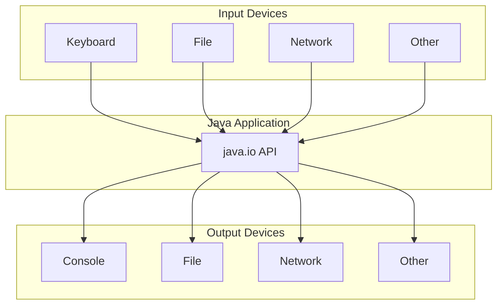

### Key Features

- **Multiple Classes for Multiple IO Devices**: The IO API provides different classes for different I/O devices
- **Easy Device Switching**: Change devices by creating objects of different classes; the implementation remains the same
- **Exception Handling**: All methods and some constructors throw `java.io.IOException` (checked exception)

::: warning Exception Handling Required
Since `IOException` is a checked exception, you must handle it using try-catch blocks or declare it with the `throws` keyword.
:::

### Standard Streams

The JVM automatically initializes some input-output streams at startup. These are available in the `System` class:

| Reference | Device | Description |
|-----------|--------|-------------|
| `System.in` | Keyboard | Default input device |
| `System.out` | Console | Default output device |
| `System.err` | Console | Error output device |

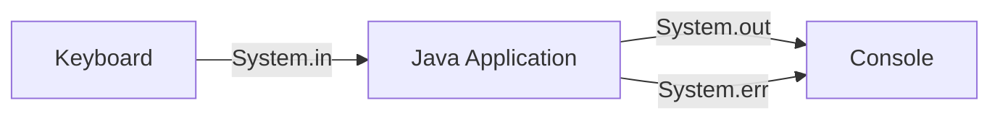

::: info Special Characters
When reading from the keyboard, pressing ENTER adds extra ASCII values to the buffer:
- `13` for `\r` (carriage return - moves cursor to beginning of line)
- `10` for `\n` (line feed - moves cursor to next line)

You need to ignore these values when creating strings from keyboard input.
:::

## Stream Types

A **stream** is a sequence of bits used for data transfer.

### Classification by Operation

#### Input Streams
Used to read data from various input devices like keyboard, file, network, etc.

#### Output Streams
Used to write data to various output devices like monitor, file, network, etc.

### Classification by Data Type

#### Byte Stream
Used to read or write byte (ASCII value) data.

#### Character Stream
Used to read or write character data.

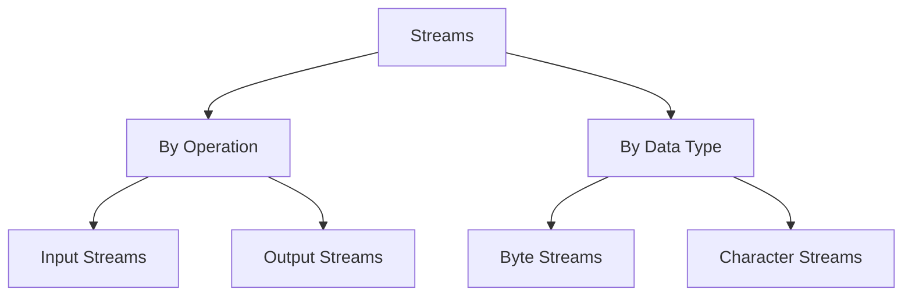

## Byte Input Streams

Byte Input Streams are used to read byte data from various input devices.

::: tip Abstract Base Class
`InputStream` is an abstract class and serves as the superclass for all Input Byte Streams.
:::

### Byte Input Stream Classes

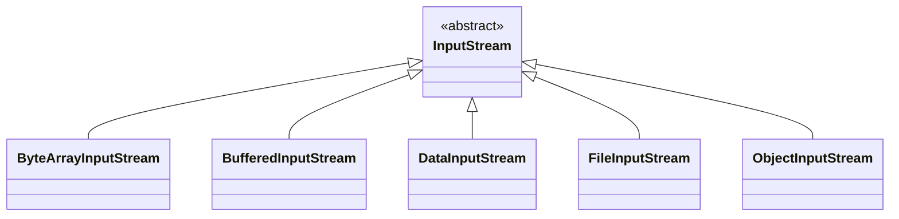

**Available Classes:**
- `ByteArrayInputStream`
- `BufferedInputStream`
- `DataInputStream`
- `FileInputStream`
- `ObjectInputStream`

## Byte Output Streams

Byte Output Streams are used to write byte data to various output devices.

::: tip Abstract Base Class
`OutputStream` is an abstract class and serves as the superclass for all Output Byte Streams.
:::

### Byte Output Stream Classes

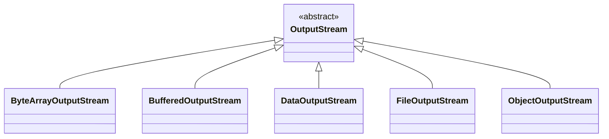

**Available Classes:**
- `ByteArrayOutputStream`
- `BufferedOutputStream`
- `DataOutputStream`
- `FileOutputStream`
- `ObjectOutputStream`

## Character Input Streams

Character Input Streams are used to read character data from various input devices.

::: tip Abstract Base Class
`Reader` is an abstract class and serves as the superclass for all Character Input Streams.
:::

### Character Input Stream Classes

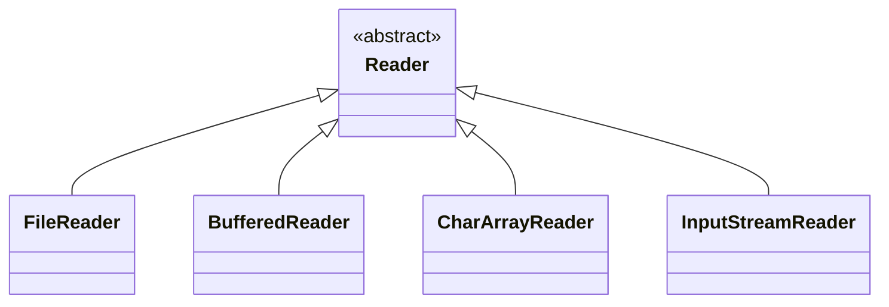

**Available Classes:**
- `FileReader`
- `BufferedReader`
- `CharArrayReader`
- `InputStreamReader`

## Character Output Streams

Character Output Streams are used to write character data to various output devices.

::: tip Abstract Base Class
`Writer` is an abstract class and serves as the superclass for all Character Output Streams.
:::

### Character Output Stream Classes

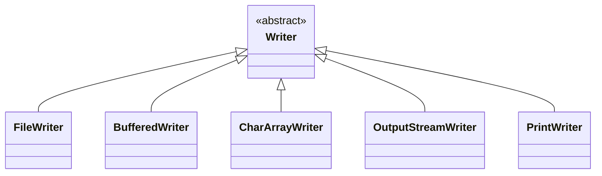

**Available Classes:**
- `FileWriter`
- `BufferedWriter`
- `CharArrayWriter`
- `OutputStreamWriter`
- `PrintWriter`

## Stream Conversion

### InputStreamReader

::: info No Inheritance Relationship
There is no inheritance relation between `InputStream` and `Reader` classes.
:::

**InputStreamReader** acts as a bridge from byte streams to character streams. It reads bytes and decodes them into characters.

```java
InputStream is = System.in;
Reader reader = new InputStreamReader(is);
```

### OutputStreamWriter

::: info No Inheritance Relationship
There is no inheritance relation between `OutputStream` and `Writer` classes.
:::

**OutputStreamWriter** converts `OutputStream` objects to `Writer` objects.

::: warning Important
When using Writer objects, you must invoke the `flush()` method to send data to the output device.
:::

```java
OutputStream os = new FileOutputStream("output.txt");
Writer writer = new OutputStreamWriter(os);
writer.write("Hello");
writer.flush(); // Required!
```

## Buffered Streams

Buffered streams improve performance by reducing the number of I/O operations.

### BufferedInputStream

```java
BufferedInputStream(InputStream ins)
```

### BufferedReader

```java
BufferedReader(Reader rd)
```

::: tip Performance Benefit
Buffered streams read data in chunks, reducing the number of expensive I/O operations.
:::

## File Operations

### Reading from Files

#### FileInputStream (Byte Stream)

```java
FileInputStream(File f)
FileInputStream(String fname)
```

#### FileReader (Character Stream)

```java
FileReader(File f)
FileReader(String fname)
```

### Writing to Files

#### FileOutputStream (Byte Stream)

```java
FileOutputStream(File f)
FileOutputStream(String fName)
FileOutputStream(File f, boolean append)
FileOutputStream(String fName, boolean append)
```

#### FileWriter (Character Stream)

```java
FileWriter(File f)
FileWriter(String fName)
FileWriter(File f, boolean append)
FileWriter(String fName, boolean append)
```

::: info Append Mode
The `boolean append` parameter determines whether data is appended to existing file content (`true`) or overwrites it (`false`).
:::

## Code Examples

### Example 1: Reading from Keyboard (Byte Stream)

```java
import java.io.*;

class Lab812 {
    public static void main(String args[]) {
        InputStream is = null;
        BufferedInputStream bis = null;
        try {
            is = System.in;
            bis = new BufferedInputStream(is);
            System.out.println("Enter Data");
            while(true) {
                int mydata = bis.read();
                if(mydata == 13)
                    break;
                char ch = (char) mydata;
                System.out.print(ch);
            }
        } catch(Exception ex) {
            System.err.println(ex);
        } finally {
            try {
                if(bis != null) bis.close();
            } catch(Exception x) {}
        }
    }
}
```

### Example 2: Reading from File (Byte Stream)

```java
import java.io.*;

class Lab813 {
    public static void main(String args[]) {
        InputStream is = null;
        BufferedInputStream bis = null;
        try {
            is = new FileInputStream("D:\\myfiles\\myjlc.txt");
            bis = new BufferedInputStream(is);
            while(true) {
                int mydata = bis.read();
                if(mydata == -1)
                    break;
                char ch = (char) mydata;
                System.out.print(ch);
            }
        } catch(Exception ex) {
            System.err.println(ex);
        } finally {
            try {
                if(is != null) is.close();
                if(bis != null) bis.close();
            } catch(Exception x) {}
        }
    }
}
```

::: tip EOF Detection
The `read()` method returns `-1` when the end of file is reached.
:::

### Example 3: Reading from Keyboard (Character Stream)

```java
import java.io.*;

class Lab814 {
    public static void main(String args[]) {
        Reader reader = null;
        BufferedReader br = null;
        try {
            reader = new InputStreamReader(System.in);
            br = new BufferedReader(reader);
            
            System.out.println("Enter CID");
            String cid = br.readLine();
            
            System.out.println("Enter Cname");
            String cname = br.readLine();
            
            System.out.println("Enter Email");
            String email = br.readLine();
            
            System.out.println(cid + "\t" + cname + "\t" + email);
        } catch(Exception ex) {
            System.err.println(ex);
        } finally {
            try {
                if(reader != null) reader.close();
                if(br != null) br.close();
            } catch(Exception x) {}
        }
    }
}
```

### Example 4: Reading from File (Character Stream)

```java
import java.io.*;

class Lab815 {
    public static void main(String args[]) {
        Reader reader = null;
        BufferedReader br = null;
        try {
            reader = new FileReader("D:\\myfiles\\myjlc.txt");
            br = new BufferedReader(reader);
            while(true) {
                String mydata = br.readLine();
                if(mydata == null)
                    break;
                System.out.println(mydata);
            }
        } catch(Exception ex) {
            System.err.println(ex);
        } finally {
            try {
                if(reader != null) reader.close();
                if(br != null) br.close();
            } catch(Exception x) {}
        }
    }
}
```

### Example 5: Copying Files (Byte Stream)

```java
import java.io.*;

class Lab816 {
    public static void main(String args[]) {
        FileInputStream fis = null;
        FileOutputStream fos = null;
        try {
            fis = new FileInputStream("D:\\myfiles\\myjlc1.txt");
            // Append mode: true
            fos = new FileOutputStream("D:\\myfiles\\hello.txt", true);
            // Overwrite mode: false
            // fos = new FileOutputStream("D:\\myfiles\\hello.txt", false);
            
            while(true) {
                int asc = fis.read();
                if(asc == -1) break;
                fos.write(asc);
            }
            System.err.println("Done!!!");
        } catch(Exception ex) {
            System.err.println(ex);
        } finally {
            try {
                if(fis != null) fis.close();
                if(fos != null) fos.close();
            } catch(Exception x) {}
        }
    }
}
```

### Example 6: Copying Files (Character Stream)

```java
import java.io.*;

class Lab817 {
    public static void main(String args[]) {
        FileReader fr = null;
        BufferedReader br = null;
        FileWriter fw = null;
        BufferedWriter bw = null;
        try {
            fr = new FileReader("D:\\myfiles\\myjlc1.txt");
            br = new BufferedReader(fr);
            fw = new FileWriter("D:\\myfiles\\hai.txt", true);
            bw = new BufferedWriter(fw);
            
            while(true) {
                String mydata = br.readLine();
                System.out.println(mydata);
                if(mydata == null) break;
                bw.write(mydata);
                bw.newLine();
            }
            bw.flush();
            System.err.println("Done!!!");
        } catch(Exception ex) {
            System.err.println(ex);
        } finally {
            try {
                if(fr != null) fr.close();
                if(br != null) br.close();
                if(fw != null) fw.close();
                if(bw != null) bw.close();
            } catch(Exception x) {}
        }
    }
}
```

## File Class

The `File` class in the `java.io` package provides various methods to perform operations on files and directories.

::: info File Object Representation
A `File` object represents a file or directory on the file system.
:::

### Example 7: Listing Root Drives

```java
import java.io.*;

class Lab818 {
    public static void main(String args[]) {
        try {
            File[] myfiles = File.listRoots();
            System.out.println(myfiles.length);
            
            for(File myfile : myfiles) {
                long total = myfile.getTotalSpace() / 1024 / 1024 / 1024;
                long free = myfile.getFreeSpace() / 1024 / 1024 / 1024;
                long usable = myfile.getUsableSpace() / 1024 / 1024 / 1024;
                
                System.out.println("\t" + myfile + "\t" + total + 
                                   "\t" + free + "\t" + usable);
            }
            System.out.println("Done!!!");
        } catch(Exception ex) {
            System.err.println(ex);
        }
    }
}
```

### Example 8: Listing Directory Contents

```java
import java.io.*;

class Lab819 {
    public static void main(String args[]) {
        try {
            File file = new File("D:\\MyJLC2.0");
            File myfiles[] = file.listFiles();
            System.out.println("Total Items: " + myfiles.length);
            
            for(File myfile : myfiles) {
                String fname = myfile.getName();
                boolean isDir = myfile.isDirectory();
                boolean isFile = myfile.isFile();
                boolean isHid = myfile.isHidden();
                
                System.out.println("\t" + fname + "\t" + isDir + 
                                   "\t" + isFile + "\t" + isHid);
            }
            System.out.println("Done!!!");
        } catch(Exception ex) {
            System.err.println(ex);
        }
    }
}
```

### Example 9: Custom File Filter

```java
import java.io.*;

class MyFilter implements FileFilter {
    String str;
    
    public MyFilter(String str) {
        this.str = str;
    }
    
    public boolean accept(File myfile) {
        return myfile.getName().endsWith(str);
    }
}

class Lab820 {
    public static void main(String args[]) {
        try {
            File file = new File("D:\\MyJLC2.0\\Java FSD-B1\\Core Java\\Module-8");
            
            // List Java files
            System.out.println("=== Java Files ===");
            File[] javaFiles = file.listFiles(new MyFilter("java"));
            System.out.println("Total Items: " + javaFiles.length);
            for(File myfile : javaFiles) {
                System.out.println("\t" + myfile.getName());
            }
            
            // List class files
            System.out.println("=== Class Files ===");
            File[] classFiles = file.listFiles(new MyFilter("class"));
            System.out.println("Total Items: " + classFiles.length);
            for(File myfile : classFiles) {
                System.out.println("\t" + myfile.getName());
            }
            
            System.out.println("Done!!!");
        } catch(Exception ex) {
            System.err.println(ex);
        }
    }
}
```

### Example 10: Creating and Deleting Directories

```java
import java.io.*;

class Lab821 {
    public static void main(String args[]) {
        try {
            File myfile = new File("D:\\MyJLC2.0\\DSA");
            System.out.println("\t" + myfile);
            
            boolean flag = myfile.exists();
            System.out.println("\tDSA exists? " + flag);
            
            boolean x = myfile.mkdirs();
            System.out.println("\tDSA Created? " + x);
            
            flag = myfile.exists();
            System.out.println("\tDSA exists? " + flag);
            
            x = myfile.mkdirs();
            System.out.println("\tDSA Created? " + x);
            
            boolean y = myfile.delete();
            System.out.println("\tDSA deleted? " + y);
            
            System.out.println("Done!!!");
        } catch(Exception ex) {
            System.err.println(ex);
        }
    }
}
```

### Example 11: Creating and Deleting Files

```java
import java.io.*;

class Lab822 {
    public static void main(String args[]) {
        try {
            File myfile = new File("D:\\MyJLC2.0\\Hello.java");
            System.out.println("\t" + myfile);
            
            boolean flag = myfile.exists();
            System.out.println("\tHello.java exists? " + flag);
            
            boolean x = myfile.createNewFile();
            System.out.println("\tHello.java Created? " + x);
            
            flag = myfile.exists();
            System.out.println("\tHello.java exists? " + flag);
            
            x = myfile.createNewFile();
            System.out.println("\tHello.java Created? " + x);
            
            boolean y = myfile.delete();
            System.out.println("\tHello.java deleted? " + y);
            
            System.out.println("Done!!!");
        } catch(Exception ex) {
            System.err.println(ex);
        }
    }
}
```

### Example 12: Working with File Paths

```java
import java.io.*;

class Lab823 {
    public static void main(String args[]) {
        try {
            File mypath = new File("D:\\MyJLC2.0");
            File mydir = new File(mypath, "DSA");
            File myfile = new File(mydir, "Hello.java");
            
            System.out.println("\t" + mypath.exists());
            System.out.println("\t" + mydir.exists());
            System.out.println("\t" + myfile.exists());
            
            if(!mydir.exists()) {
                mydir.mkdirs();
            }
            if(!myfile.exists()) {
                myfile.createNewFile();
            }
            
            System.out.println("\tAfter Creating");
            System.out.println("\t" + mypath.exists());
            System.out.println("\t" + mydir.exists());
            System.out.println("\t" + myfile.exists());
            
            System.out.println("Done!!!");
        } catch(Exception ex) {
            System.err.println(ex);
        }
    }
}
```

### Example 13: File Properties and Permissions

```java
import java.io.*;

class Lab824 {
    public static void main(String args[]) {
        try {
            File mypath = new File("D:\\MyJLC2.0");
            File mydir = new File(mypath, "DSA");
            File myfile = new File(mydir, "Hello.java");
            
            System.out.println("\t" + myfile.exists());
            System.out.println("\t" + myfile.getParent());
            System.out.println("\t" + myfile.getCanonicalPath());
            System.out.println("\t" + myfile.getAbsolutePath());
            System.out.println("\t" + myfile.getPath());
            System.out.println("\t" + myfile.canRead());
            System.out.println("\t" + myfile.canWrite());
            System.out.println("\t" + myfile.lastModified());
            System.out.println("\t" + myfile.length());
            
            myfile.setReadOnly();
            System.out.println("\t" + myfile.canRead());
            System.out.println("\t" + myfile.canWrite());
            
            System.out.println("Done!!!");
        } catch(Exception ex) {
            System.err.println(ex);
        }
    }
}
```

## Serialization

**Serialization** is the process of saving an object's state into a file.

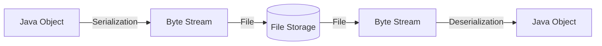

### Serialization Process (2 Steps)

1. Reading data from the object
2. Writing data to the file

### Deserialization Process (3 Steps)

1. Reading data from the file
2. Creating an object on the remote machine
3. Initializing the object with data from the file

### Required Classes

- **ObjectOutputStream**: Output Byte Stream for serializing objects
- **ObjectInputStream**: Input Byte Stream for deserializing objects

### Key Methods

| Class | Method | Description |
|-------|--------|-------------|
| `ObjectOutputStream` | `void writeObject(Object)` | Saves object state to file |
| `ObjectInputStream` | `Object readObject()` | Creates object from file |

### Use Cases for Serialization

1. **Secure Storage**: Store object data in a secured format accessible only by authorized Java applications
2. **Memory Management**: Manage memory required for Java applications
3. **Network Transfer**: Transfer object data between machines through a network

### Serialization Requirements

::: warning Important
By default, objects are NOT eligible for serialization.
:::

To serialize a class:

1. The class must implement the `java.io.Serializable` marker interface
2. If you try to serialize an object without implementing `Serializable`, a `java.io.NotSerializableException` will be thrown

### serialVersionUID

The `serialVersionUID` specifies class version information during serialization and is used during deserialization.

### Deserialization Behavior

When deserializing an object:

- **Static variables** get the value defined in the class (static members are not serialized with the object)
- The same `.class` file used during serialization must be available
- **Constructor is NOT invoked** during deserialization

### Example 14: Basic Serialization

```java
import java.io.*;

class Customer implements Serializable {
    int cid;
    String cname;
    String email;
    long phone;
    
    Customer() {}
    
    Customer(int cid, String cname, String email, long phone) {
        this.cid = cid;
        this.cname = cname;
        this.email = email;
        this.phone = phone;
    }
    
    public String toString() {
        return "[" + cid + "," + cname + "," + email + "," + phone + "]";
    }
}

class Lab825 {
    public static void main(String args[]) throws IOException {
        // serializeCustomer();
        deserializeCustomer();
    }
    
    static void serializeCustomer() throws IOException {
        ObjectOutputStream oos = null;
        FileOutputStream fos = null;
        try {
            fos = new FileOutputStream("mycustomers1.txt");
            oos = new ObjectOutputStream(fos);
            Customer mycust = new Customer(101, "sri", "sri@jlc", 
                                           12345, "sri123", "sri123");
            oos.writeObject(mycust);
            System.err.println("Object is Serialized!!!");
        } catch(Exception ex) {
            System.err.println("ooooooops!!" + ex);
        } finally {
            if(fos != null) fos.close();
            if(oos != null) oos.close();
        }
    }
    
    static void deserializeCustomer() throws IOException {
        ObjectInputStream ois = null;
        FileInputStream fis = null;
        try {
            fis = new FileInputStream("mycustomers3.txt");
            ois = new ObjectInputStream(fis);
            Object obj = ois.readObject();
            Customer mycust = (Customer) obj;
            System.err.println("here the customer=> " + mycust);
            System.err.println("Object is De-Serialized!!!");
        } catch(Exception ex) {
            System.err.println("ooooooops!!" + ex);
        } finally {
            if(fis != null) fis.close();
            if(ois != null) ois.close();
        }
    }
}
```

::: warning Result
When deserializing, `username` and `password` will be `null` because they are marked as `transient`.
:::

## Externalization

**Externalization** is the process of customizing the serialization process.

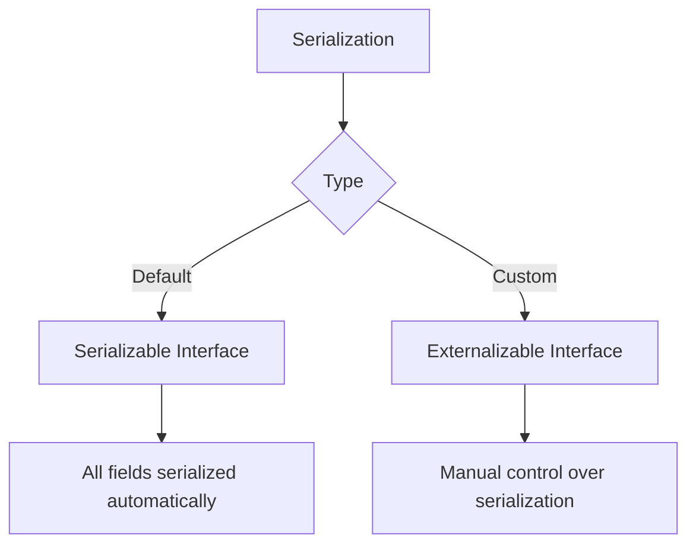

### Key Differences

| Feature | Serializable | Externalizable |
|---------|-------------|----------------|
| Interface Type | Marker interface | Has abstract methods |
| Control | Automatic | Manual |
| Methods | None | `writeExternal()`, `readExternal()` |
| Constructor | Not required | Public no-arg constructor required |
| Performance | Slower | Faster (selective serialization) |

### Externalizable Interface

The `java.io.Externalizable` interface contains two abstract methods:

```java
void writeExternal(ObjectOutput out) throws IOException
void readExternal(ObjectInput in) throws IOException, ClassNotFoundException
```

### Method Behavior

- **`writeExternal()`**: Called during serialization
  - Receives `ObjectOutput` stream as parameter
  - Define which fields to serialize
  
- **`readExternal()`**: Called during deserialization
  - Receives `ObjectInput` stream as parameter
  - Define how to deserialize fields

::: danger Required Constructor
Your class MUST have a public no-argument constructor for Externalization to work.
:::

### Example 17: Externalization

```java
import java.io.*;

class Customer implements Externalizable {
    int cid;
    String cname;
    String email;
    long phone;
    String username;
    String password;
    
    public Customer() {}
    
    Customer(int cid, String cname, String email, long phone, 
             String username, String password) {
        this.cid = cid;
        this.cname = cname;
        this.email = email;
        this.phone = phone;
        this.username = username;
        this.password = password;
    }
    
    public String toString() {
        return "[" + cid + "," + cname + "," + email + "," + 
               phone + "," + username + "," + password + "]";
    }
    
    public void writeExternal(ObjectOutput myoutput) throws IOException {
        myoutput.writeInt(this.cid + 100);
        myoutput.writeObject(this.cname);
        myoutput.writeObject(this.email);
        myoutput.writeLong(this.phone);
    }
    
    public void readExternal(ObjectInput myinput) 
            throws IOException, ClassNotFoundException {
        this.cid = myinput.readInt() - 100;
        this.cname = myinput.readObject().toString();
        this.email = myinput.readObject().toString();
        this.phone = myinput.readLong();
    }
}

class Lab828 {
    public static void main(String args[]) throws IOException {
        // serializeCustomer();
        deserializeCustomer();
    }
    
    static void serializeCustomer() throws IOException {
        ObjectOutputStream oos = null;
        FileOutputStream fos = null;
        try {
            fos = new FileOutputStream("mycustomers3.txt");
            oos = new ObjectOutputStream(fos);
            Customer mycust = new Customer(101, "sri", "sri@jlc", 
                                           12345, "sri123", "sri123");
            oos.writeObject(mycust);
            System.out.println("Object is Serialized!!!");
        } catch(Exception ex) {
            System.err.println("ooooooops!!" + ex);
        } finally {
            if(fos != null) fos.close();
            if(oos != null) oos.close();
        }
    }
    
    static void deserializeCustomer() throws IOException {
        ObjectInputStream ois = null;
        FileInputStream fis = null;
        try {
            fis = new FileInputStream("mycustomers3.txt");
            ois = new ObjectInputStream(fis);
            Object obj = ois.readObject();
            Customer mycust = (Customer) obj;
            System.err.println("here the customer=> " + mycust);
            System.err.println("Object is De-Serialized!!!");
        } catch(Exception ex) {
            System.err.println("ooooooops!!" + ex);
        } finally {
            if(fis != null) fis.close();
            if(ois != null) ois.close();
        }
    }
}
```

::: tip Custom Logic
In the example above, `cid` is stored with +100 offset and retrieved with -100 offset. The `username` and `password` fields are not serialized at all.
:::

## Practice Questions

### Assignment Questions

1. What is Stream?
2. What are the types of Streams available in Java?
3. What are the differences between Byte Streams and Character Streams?
4. What are the classes defined to manage Byte Streams?
5. What are the classes defined to manage Character Streams?
6. What is the use of InputStreamReader class?
7. What is the difference between flush() and close() method?
8. What is the use of boolean parameter in FileWriter(File, boolean) constructor?
9. How to find the total number of root drives available in your file system?
10. How to find the number of characters available in a file?
11. How to find if a file is available or not?
12. How to display the list of files and folders available in a directory?
13. What is Serialization?
14. What is the need of implementing Serializable interface in Serialization?
15. What is De-Serialization?
16. What is the use of serialVersionUID?
17. Which class object will be used for Serialization?
18. Which class object will be used for De-Serialization?
19. How to serialize individual properties of the class?
20. How to stop serialization of particular fields?
21. Can I serialize static fields of the class?
22. What is transient keyword?
23. What is Externalization? What is the interface need to implement for Externalization?
24. What are the methods I need to override in case of Externalization?
25. What is the difference between Serialization and Externalization?

### Multiple Choice Questions

::: details Q1. Which package contains classes for input & output operations?
**Options:**
- A) java.util
- B) java.lang
- C) java.io ✓
- D) All of the mentioned

**Answer:** C) java.io
:::

::: details Q2. Which class is NOT a member of java.io package?
**Options:**
- A) StringBuffer ✓
- B) StringReader
- C) Writer
- D) File

**Answer:** A) StringBuffer (belongs to java.lang package)
:::

::: details Q3. Which interface is NOT a member of java.io package?
**Options:**
- A) DataInput
- B) ObjectInput
- C) ObjectFilter ✓
- D) FileFilter

**Answer:** C) ObjectFilter
:::

::: details Q4. Which class is NOT related to input/output stream?
**Options:**
- A) File ✓
- B) Writer
- C) InputStream
- D) Reader

**Answer:** A) File (represents file paths, not a stream)
:::

::: details Q5. What is specified by a File object?
**Options:**
- A) a file in disk
- B) directory path ✓
- C) directory in disk
- D) None of the mentioned

**Answer:** B) directory path
:::

::: details Q6. Legal statements to create a new file (Select all that apply)
**Options:**
- A) file.create();
- B) FileOutputStream fos = new FileOutputStream(file); ✓
- C) FileWriter out = new FileWriter(file); ✓
- D) FileInputStream fis = new FileInputStream(file);
- E) RandomAccessFile raf = new RandomAccessFile(file); ✓

**Answer:** B, C, E
:::

::: details Q7. What is used to perform all I/O operations in Java?
**Options:**
- A) Streams ✓
- B) Variables
- C) Classes
- D) Methods

**Answer:** A) Streams
:::

::: details Q8. Which is a type of stream in Java?
**Options:**
- A) Integer stream
- B) Short stream
- C) Byte stream ✓
- D) Long stream

**Answer:** C) Byte stream
:::

::: details Q9. Which classes are used by Byte streams?
**Options:**
- A) InputStream ✓
- B) InputOutputStream
- C) Reader
- D) All of the mentioned

**Answer:** A) InputStream
:::

::: details Q10. Which exception is thrown by read() method?
**Options:**
- A) IOException ✓
- B) InterruptedException
- C) SystemException
- D) SystemInputException

**Answer:** A) IOException
:::

::: details Q11. Which method reads a string from input stream?
**Options:**
- A) get()
- B) getLine()
- C) read()
- D) readLine() ✓

**Answer:** D) readLine()
:::

::: details Q12. Which class reads characters from console?
**Options:**
- A) BufferedReader ✓
- B) StringReader
- C) BufferedStreamReader
- D) InputStreamReader

**Answer:** A) BufferedReader
:::

::: details Q13. Which class reads from a file?
**Options:**
- A) InputStream
- B) BufferedInputStream
- C) FileInputStream ✓
- D) BufferedFileInputStream

**Answer:** C) FileInputStream
:::

::: details Q14. What value is returned by read() when EOF is encountered?
**Options:**
- A) 0
- B) 1
- C) -1 ✓
- D) null

**Answer:** C) -1
:::

::: details Q15. Correct statement to create BufferedWriter?
**Options:**
- A) BufferedWriter bw = new BufferedWriter(new File("out.dat"));
- B) BufferedWriter bw = new BufferedWriter(new FileWriter("out.dat")); ✓
- C) BufferedWriter bw = new BufferedWriter("out.dat");
- D) BufferedWriter bw = new BufferedWriter(new FileOutputStream("out.dat"));

**Answer:** B
:::

::: details Q16. Java Stream classes are categorized into:
**Options:**
- A) Byte and Character Stream Classes ✓
- B) Stream and String Classes
- C) String and Character Stream Classes
- D) Buffer and Character Stream Classes

**Answer:** A) Byte and Character Stream Classes
:::

::: details Q17. Which class converts byte data to character data?
**Options:**
- A) InputStreamReader ✓
- B) OutputStreamReader
- C) StringStreamReader
- D) PrintStreamReader

**Answer:** A) InputStreamReader
:::

::: details Q18. What is the process of writing object state to byte stream?
**Options:**
- A) Serialization ✓
- B) Externalization
- C) File Filtering
- D) All of the mentioned

**Answer:** A) Serialization
:::

::: details Q19. Which interface controls serialization/deserialization?
**Options:**
- A) Serializable
- B) Externalization ✓
- C) FileFilter
- D) ObjectInput

**Answer:** B) Externalization (Note: Externalizable is the correct interface name)
:::

::: details Q20. Which method writes object to stream?
**Options:**
- A) write()
- B) write()
- C) streamWrite()
- D) writeObject() ✓

**Answer:** D) writeObject()
:::

::: details Q21. Code Output: obj.getName() where obj = new File("/java/system")
**Options:**
- A) Java
- B) System ✓
- C) java/system
- D) /java/system

**Answer:** B) System
:::

::: details Q22. Code Output: obj.getAbsolutePath() where obj = new File("/java/system")
**Options:**
- A) Java
- B) System
- C) java/system
- D) /java/system ✓

**Answer:** D) /java/system
:::

::: details Q23. Code Output with input "abcqfgh"
```java
BufferedReader obj = new BufferedReader(new InputStreamReader(System.in));
do {
    c = (char) obj.read();
    System.out.print(c);
} while(c != 'q');
```
**Options:**
- A) abcqfgh
- B) abc
- C) abcq ✓
- D) abcqfgh

**Answer:** C) abcq
:::

::: details Q24. What does obj.available() return?
**Options:**
- A) true
- B) false
- C) prints number of bytes in file ✓
- D) prints number of characters in the file

**Answer:** C) prints number of bytes in file
:::

::: details Q25. Code Output: System.out.println(arr instanceof Serializable)
```java
int arr[] = new int[1];
```
**Options:**
- A) true ✓
- B) false
- C) Compile time error
- D) Runtime error

**Answer:** A) true (arrays are serializable in Java)
:::

## Summary

### Key Takeaways

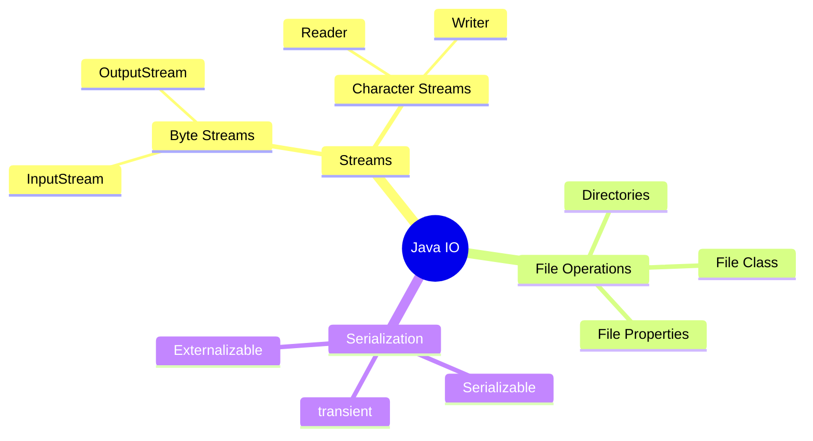

### Best Practices

::: tip Resource Management
- Always close streams in a `finally` block
- Use try-with-resources (Java 7+) for automatic resource management
- Close streams in reverse order of opening
:::

::: tip Exception Handling
- Handle `IOException` properly
- Use specific exception types when possible
- Log errors for debugging
:::

::: tip Performance
- Use buffered streams for better performance
- Choose appropriate stream types (byte vs character)
- Consider using NIO for large files
:::

::: tip Serialization
- Implement `Serializable` for default behavior
- Use `transient` for sensitive data
- Implement `Externalizable` for custom control
- Always provide `serialVersionUID`
:::

### Common Pitfalls

::: danger Watch Out!
- Forgetting to flush() when using Writer
- Not closing streams (resource leaks)
- Incorrect deserialization order
- Missing no-arg constructor with Externalizable
- Attempting to serialize non-Serializable objects
:::

### Explicit Property Serialization

You can serialize individual properties explicitly using corresponding `writeX()` and `readX()` methods:

::: warning Order Matters
You must deserialize data in the same order it was serialized.
:::

## Serialization and Inheritance

When serializing objects with inherited properties:

### Serializable Superclass

✅ **If the superclass implements `java.io.Serializable`:**
- Inherited properties WILL be serialized

### Non-Serializable Superclass

❌ **If the superclass does NOT implement `java.io.Serializable`:**
- Inherited properties will NOT be serialized
- During deserialization:
  - Inherited properties get default values defined in the class
  - Default constructor of the non-serializable superclass will be invoked
  - If default constructor is not available, an exception will be thrown

### Example 15: Serialization with Inheritance

```java
import java.io.*;

class User implements Serializable {
    String username;
    String password;
    
    User() {}
    
    User(String username, String password) {
        this.username = username;
        this.password = password;
    }
    
    public String toString() {
        return "," + username + "," + password;
    }
}

class Customer extends User {
    int cid;
    String cname;
    String email;
    long phone;
    
    Customer() {}
    
    Customer(int cid, String cname, String email, long phone) {
        this.cid = cid;
        this.cname = cname;
        this.email = email;
        this.phone = phone;
    }
    
    Customer(int cid, String cname, String email, long phone, 
             String username, String password) {
        this.cid = cid;
        this.cname = cname;
        this.email = email;
        this.phone = phone;
        this.username = username;
        this.password = password;
    }
    
    public String toString() {
        return "[" + cid + "," + cname + "," + email + "," + 
               phone + super.toString() + "]";
    }
}

class Lab826 {
    public static void main(String args[]) throws IOException {
        // serializeCustomer();
        deserializeCustomer();
    }
    
    static void serializeCustomer() throws IOException {
        ObjectOutputStream oos = null;
        FileOutputStream fos = null;
        try {
            fos = new FileOutputStream("mycustomers2.txt");
            oos = new ObjectOutputStream(fos);
            Customer mycust = new Customer(101, "sri", "sri@jlc", 
                                           12345, "sri123", "sri123");
            oos.writeObject(mycust);
            System.err.println("Object is Serialized!!!");
        } catch(Exception ex) {
            System.err.println("ooooooops!!" + ex);
        } finally {
            if(fos != null) fos.close();
            if(oos != null) oos.close();
        }
    }
    
    static void deserializeCustomer() throws IOException {
        ObjectInputStream ois = null;
        FileInputStream fis = null;
        try {
            fis = new FileInputStream("mycustomers2.txt");
            ois = new ObjectInputStream(fis);
            Object obj = ois.readObject();
            Customer mycust = (Customer) obj;
            System.err.println("here the customer=> " + mycust);
            System.err.println("Object is De-Serialized!!!");
        } catch(Exception ex) {
            System.err.println("ooooooops!!" + ex);
        } finally {
            if(fis != null) fis.close();
            if(ois != null) ois.close();
        }
    }
}
```

## The transient Keyword

The `transient` keyword prevents specific instance variables from being serialized.

### Key Points

- Used with instance variables
- Applies during serialization process
- By default, all instance variables are serialized
- Variables marked as `transient` will NOT be serialized
- During deserialization, transient variables get default values based on their data type

::: tip Use Case
Use `transient` for sensitive data (like passwords) or data that shouldn't be persisted (like cached values).
:::

## Lab827: Demonstrating the transient Keyword

This example demonstrates how the `transient` keyword prevents specific instance variables from being serialized.

### Customer Class with Transient Fields

```java
import java.io.*;

class Customer implements Serializable {
    int cid;
    String cname;
    String email;
    long phone;
    transient String username;  // Will NOT be serialized
    transient String password;  // Will NOT be serialized
    
    Customer() {}
    
    Customer(int cid, String cname, String email, long phone, 
             String username, String password) {
        this.cid = cid;
        this.cname = cname;
        this.email = email;
        this.phone = phone;
        this.username = username;
        this.password = password;
    }
    
    public String toString() {
        return "[" + cid + "," + cname + "," + email + "," + 
               phone + "," + username + "," + password + "]";
    }
}
```

::: info Transient Fields
The `username` and `password` fields are marked as `transient`, which means:
- They will **not** be saved during serialization
- They will be `null` after deserialization
- This is useful for sensitive data or temporary values
:::

### Main Lab827 Class

```java
class Lab827 {
    public static void main(String args[]) throws IOException {
        // Uncomment to serialize
        // serializeCustomer();
        
        // Uncomment to deserialize
        deserializeCustomer();
    }
    
    /**
     * Serializes a Customer object to a file.
     * Note: transient fields (username, password) will NOT be saved.
     */
    static void serializeCustomer() throws IOException {
        ObjectOutputStream oos = null;
        FileOutputStream fos = null;
        try {
            fos = new FileOutputStream("mycustomers3.txt");
            oos = new ObjectOutputStream(fos);
            
            // Create customer with all fields including transient ones
            Customer mycust = new Customer(101, "sri", "sri@jlc", 
                                           12345, "sri123", "sri123");
            
            // Serialize the object
            oos.writeObject(mycust);
            
            System.err.println(" Object is Serialized !!! ");
        } catch(Exception ex) {
            System.err.println("ooooooops!!" + ex);
        } finally {
            if(fos != null)
                fos.close();
            if(oos != null)
                oos.close();
        }
    }
    
    /**
     * Deserializes a Customer object from a file.
     * Note: transient fields will be null after deserialization.
     */
    static void deserializeCustomer() throws IOException {
        ObjectInputStream ois = null;
        FileInputStream fis = null;
        try {
            fis = new FileInputStream("mycustomers3.txt");
            ois = new ObjectInputStream(fis);
            
            // Read the object
            Object obj = ois.readObject();
            Customer mycust = (Customer) obj;
            
            // Print the customer - username and password will be null
            System.err.println("here the customer=> " + mycust);
            System.err.println(" Object is De-Serialized !!! ");
        } catch(Exception ex) {
            System.err.println("ooooooops!!" + ex);
        } finally {
            if(fis != null)
                fis.close();
            if(ois != null)
                ois.close();
        }
    }
}
```

### Execution Flow

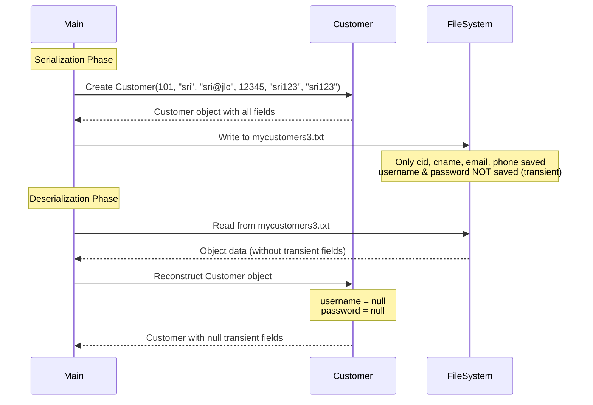

### Expected Output

::: code-group

```txt [During Serialization]
Object is Serialized !!!
```

```txt [During Deserialization]
here the customer=> [101,sri,sri@jlc,12345,null,null]
Object is De-Serialized !!!
```

:::

::: warning Transient Field Behavior
Notice in the output that `username` and `password` are **null** after deserialization, even though they were set to "sri123" during object creation. This is because they are marked as `transient`.
:::

### Key Observations

| Field | Marked as transient? | Serialized? | Value after Deserialization |
|-------|---------------------|-------------|----------------------------|
| `cid` | ❌ No | ✅ Yes | Original value (101) |
| `cname` | ❌ No | ✅ Yes | Original value ("sri") |
| `email` | ❌ No | ✅ Yes | Original value ("sri@jlc") |
| `phone` | ❌ No | ✅ Yes | Original value (12345) |
| `username` | ✅ Yes | ❌ No | `null` |
| `password` | ✅ Yes | ❌ No | `null` |

### Use Cases for transient

::: tip When to use transient
1. **Sensitive Data**: Passwords, credit card numbers, SSN
2. **Derived Values**: Calculated fields that can be recomputed
3. **Temporary State**: Cache, session data, thread references
4. **Non-serializable References**: Objects that cannot or should not be serialized
5. **Large Data**: Binary data or references to external resources
:::

### Best Practices

::: details Resource Management
Always close streams in the `finally` block to prevent resource leaks:
```java
finally {
    if(fis != null) fis.close();
    if(ois != null) ois.close();
}
```
:::

::: details Modern Alternative (Java 7+)
Use try-with-resources for automatic resource management:
```java
try (FileOutputStream fos = new FileOutputStream("mycustomers3.txt");
     ObjectOutputStream oos = new ObjectOutputStream(fos)) {
    oos.writeObject(mycust);
    System.err.println("Object is Serialized !!!");
}
```
:::

### Comparison with Other Approaches

| Approach | Implementation | Control Level | Use Case |
|----------|---------------|---------------|----------|
| **Default** | Implement `Serializable` | All fields serialized | Simple objects, no sensitive data |
| **transient** | Mark specific fields | Exclude specific fields | Some sensitive/temporary fields |
| **Externalization** | Implement `Externalizable` | Complete control | Complex custom serialization logic |