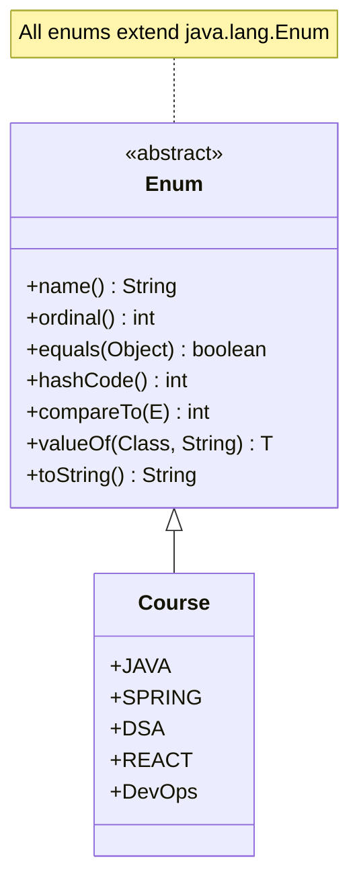
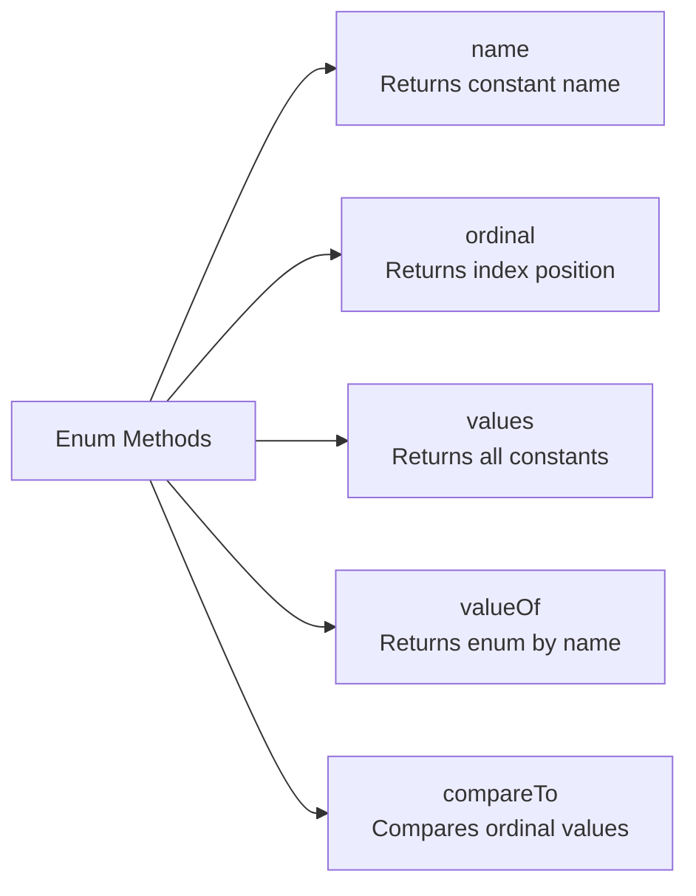
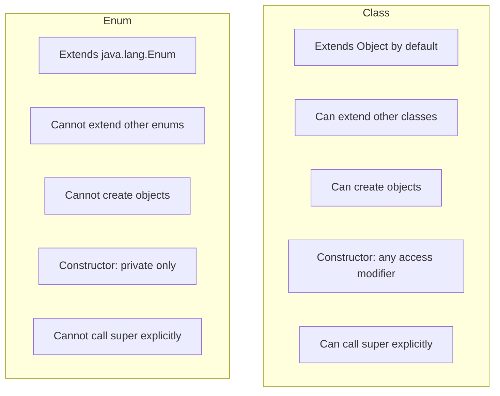
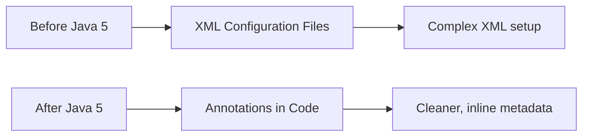
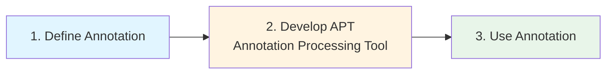
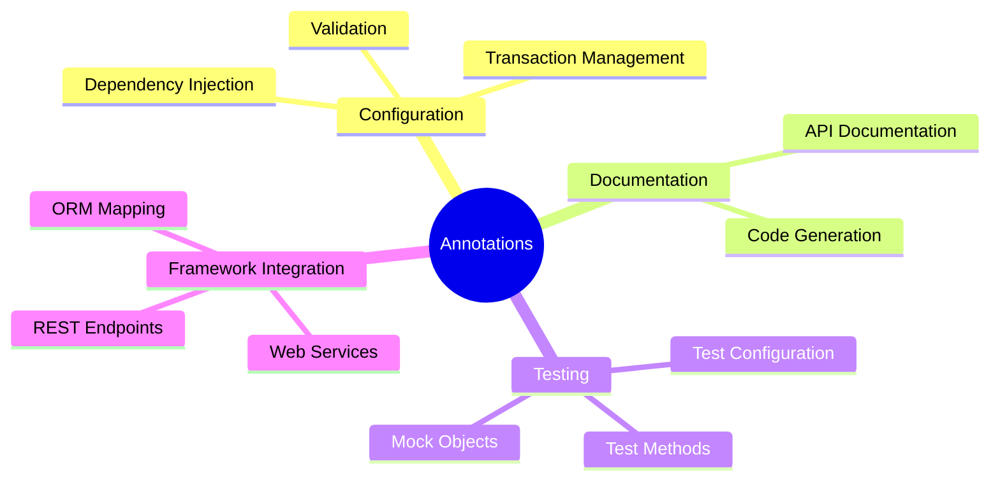

# Java Enums and Annotations

## Module Overview

This module covers two important Java features introduced in Java 5:
- **Enums**: User-defined data types with a fixed set of constants
- **Annotations**: Metadata specification within Java classes

---

## Enums

### Introduction to Enums

The `enum` keyword was added in Java 5 to define user-defined data types similar to classes. An enum represents a fixed set of constants of that enum type.

::: info Key Characteristics
- Enums are implicitly final subclasses of `java.lang.Enum`
- Enum constants are implicitly `public static final`
- Constructors must be `private`
- Enums can have fields, methods, and constructors
:::

### Basic Enum Definition

```java
public enum Course {
    JAVA,
    SPRING,
    DSA,
    REACT,
    DevOps;
}
```

In this example, `JAVA`, `SPRING`, `DSA`, `REACT`, and `DevOps` are public final static constants of type `Course`.

### Enum Hierarchy



### Enums with Constructors

Enums can have constructors to initialize fields. Constructors must be `private`.

```java
public enum Course {
    JAVA(101),
    SPRING(102),
    DSA(103),
    REACT(104),
    DevOps(105);
    
    private int cid;
    
    private Course(int cid) {
        this.cid = cid;
    }
    
    public int getCid() {
        return cid;
    }
}
```

::: warning Constructor Access
- Enum constructors are private by default
- You can only use the `private` modifier explicitly
- You cannot invoke `super()` constructor explicitly from an enum constructor
:::

### Enum with Multiple Fields

```java
public enum Course {
    JAVA(101, 5000),
    SPRING(102, 6000),
    DSA(103, 9000),
    REACT(104, 7000),
    PYTHON;
    
    private int cid;
    private double price;
    
    private Course() {
        // Default constructor
    }
    
    private Course(int cid, double price) {
        this.cid = cid;
        this.price = price;
    }
    
    public int getCid() {
        return cid;
    }
    
    public double getPrice() {
        return price;
    }
    
    @Override
    public String toString() {
        return "Course[" + cid + "," + name() + "," + price + "]";
    }
}
```

### Enum Methods from java.lang.Enum



#### Key Methods

| Method | Description | Example |
|--------|-------------|---------|
| `name()` | Returns the name of the enum constant | `Course.JAVA.name()` → `"JAVA"` |
| `ordinal()` | Returns the position of the constant (0-based) | `Course.JAVA.ordinal()` → `0` |
| `values()` | Returns array of all enum constants | `Course.values()` |
| `valueOf(String)` | Returns enum constant by name | `Course.valueOf("JAVA")` |
| `compareTo(E)` | Compares based on ordinal values | `c1.compareTo(c2)` |

### Working with Enums

#### Iterating Over Enum Constants

```java
Course[] courses = Course.values();
for (Course course : courses) {
    System.out.println(course.ordinal() + "\t" + 
                       course.name() + "\t" + 
                       course.getCid());
}
```

#### Using valueOf()

```java
Course course = Course.valueOf("JAVA");
System.out.println(course); // Course[101,JAVA,5000]

// Throws IllegalArgumentException if not found
Course invalid = Course.valueOf("DEVOPS"); // Exception!
```

#### Comparing Enum Constants

```java
Course c1 = Course.JAVA;
Course c2 = Course.DSA;
Course c3 = Course.JAVA;

// Using compareTo (compares ordinal values)
System.out.println(c1.compareTo(c2)); // Negative (JAVA < DSA)
System.out.println(c1.compareTo(c3)); // 0 (same)

// Using equals
System.out.println(c1.equals(c3)); // true

// Using == (recommended for enums)
System.out.println(c1 == c3); // true
```

::: tip Equality Comparison
For enum constants, `equals()` and `==` operator do the same thing. Since enum instances are effectively singletons, they can be compared using identity (`==`).
:::

### Enums in Switch Statements

Enum constants can be used in switch statements from Java 5 onwards.

```java
Course mycou = Course.JAVA;

switch (mycou) {
    case JAVA:
        System.out.println("Java Course Info");
        System.out.println(Course.JAVA);
        break;
    case SPRING:
        System.out.println("Spring Course Info");
        System.out.println(Course.SPRING);
        break;
    case DSA:
        System.out.println("DSA Course Info");
        System.out.println(Course.DSA);
        break;
}
```

### Enum with Static and Instance Blocks

```java
enum Course {
    JAVA(101),
    SPRING(201),
    DSA(501);
    
    private int cid;
    static String trainer = "Srinivas Dande";
    
    private Course(int cid) {
        System.out.println("Course-Con");
        this.cid = cid;
    }
    
    // Instance block
    {
        System.out.println("Course-I.B");
    }
    
    // Static block
    static {
        System.out.println("Course-S.B");
    }
}
```

::: info Initialization Order
1. Static block executes once
2. Instance block executes for each enum constant
3. Constructor executes for each enum constant
:::

### EnumSet and EnumMap

Java provides specialized collection implementations for enums:

```java
import java.util.*;

// EnumSet - All values
Set<Course> allCourses = EnumSet.allOf(Course.class);

// EnumSet - Range
Set<Course> rangeCourses = EnumSet.range(Course.SPRING, Course.REACT);

// EnumMap
Map<Course, Integer> courseMap = new EnumMap<>(Course.class);
courseMap.put(Course.JAVA, 0);
courseMap.put(Course.SPRING, 1);
courseMap.put(Course.DSA, 2);
```

::: tip Performance Benefits
`EnumSet` and `EnumMap` are highly efficient implementations specifically designed for enum types. They offer better performance than general-purpose collections.
:::

### Class vs Enum Comparison



| Feature | Class | Enum |
|---------|-------|------|
| **Super Type** | `java.lang.Object` | `java.lang.Enum` |
| **Inheritance** | Can extend another class | Cannot extend another enum |
| **Object Creation** | Can create objects | Cannot create objects |
| **Member Order** | Any order | Constants must be defined first |
| **Constructor Access** | Any modifier | Private only |
| **Super Constructor** | Can invoke explicitly | Cannot invoke explicitly |

::: info Similarities
Both classes and enums can have:
- Instance and static variables
- Instance and static methods
- Instance and static blocks
- Constructors
- Abstract methods
- Can implement interfaces
- Can have inner classes/enums
:::

### Points to Remember

::: warning Important Rules
1. Enums are implicitly final subclasses of `java.lang.Enum`
2. When an enum is a member of a class, it's implicitly static
3. Cannot create objects for enum, even within the enum type itself
4. `name()` and `valueOf()` use the text of enum constants
5. For enum constants, `equals()` and `==` do the same thing
6. Enum constants are implicitly `public static final`
7. Constructors must be declared as `private`
8. Enum instances are singletons - compare using `==`
9. Can override only `toString()` from Object class (other methods are final)
:::

---

## Annotations

### Introduction to Annotations

Annotations were added in Java 5 to provide a way to specify metadata inside Java classes instead of external XML files.



::: info Benefits of Annotations
- Eliminates need for extensive XML configuration
- Metadata is co-located with code
- Compile-time checking
- Better IDE support
:::

### Types of Annotations

```mermaid
graph TD
    A[Annotations] --> B[Built-in Annotations]
    A --> C[User-defined Annotations]
    B --> D[Java Standard]
    B --> E[Framework Specific]
    D --> F[@Override<br/>@Deprecated<br/>@SuppressWarnings]
    E --> G[@WebServlet - Servlet 3<br/>@Autowired - Spring<br/>@Entity - JPA]
    C --> H[Custom Annotations<br/>with @interface]
```

### Built-in Annotations

#### @SuppressWarnings

Tells the compiler to ignore specific warnings.

```java
@SuppressWarnings({"unused", "deprecation"})
public static void main(String[] args) {
    int x = 123; // unused variable
    Date mydate = new Date();
    System.out.println(mydate.getDate()); // deprecated method
    System.out.println(mydate.getMonth() + 1);
    System.out.println(mydate.getYear() + 1900);
}
```

**Common Warning Types:**
- `unused` - Unused variables/methods
- `deprecation` - Deprecated API usage
- `rawtypes` - Raw type usage
- `unchecked` - Unchecked operations

```java
@SuppressWarnings({"rawtypes", "unchecked"})
public static void main(String[] args) {
    List mylist = new ArrayList();
    mylist.add(10);
    mylist.add("Hello"); // No type safety warning
}
```

::: warning Scope
Can be applied to: fields, methods, constructors, classes
:::

#### @Deprecated

Marks elements as outdated and discourages their use.

```java
class Hello {
    int a;
    
    @Deprecated
    int b;
    
    public Hello(int a, int b) {
        this.a = a;
        this.b = b;
    }
    
    @Deprecated
    public void m1() {
        System.out.println("I am m1()");
    }
    
    public void show() {
        System.out.println("I am show()");
    }
}
```

::: tip Class-level @Deprecated
Adding `@Deprecated` to a class does **not** automatically deprecate all its fields and methods. Each member must be annotated individually.
:::

```java
@Deprecated
class Hello {
    int a; // Not deprecated
    int b; // Not deprecated
    
    public void m1() { } // Not deprecated
}
```

#### @Override

Ensures that a method actually overrides a method from a superclass or interface.

```java
class Hello {
    int a = 10;
    int b = 20;
    
    public void show() {
        System.out.println("I am show()");
    }
    
    @Override
    public String toString() {
        return "Hello [a=" + a + ", b=" + b + "]";
    }
}
```

::: danger Compile-Time Check
If the annotated method doesn't actually override anything, the compiler will generate an error. This prevents typos and mistakes in method signatures.
:::

### User-defined Annotations

#### Annotation Implementation Tasks



::: info Responsibilities
- **Framework Vendors**: Define annotations and provide processing tools
- **Developers**: Use annotations in code
:::

#### Defining an Annotation

**Syntax:**
```java
@interface AnnotationName {
    datatype memberName();
    datatype memberName();
    // ...
}
```

**Example:**
```java
@interface Author {
    String aname();
    int age();
}

// Usage
@Author(aname="Srinivas", age=36)
class Hello {
    @Author(aname="Srinivas", age=36)
    void show() { }
}
```

::: warning Restrictions
- Cannot define constructors
- Cannot define initialization blocks
- Cannot define methods (only abstract method-like declarations)
- All annotations are subtypes of `java.lang.annotation.Annotation`
:::

### Meta Annotations

Meta annotations are annotations that apply to other annotations.

#### @Retention

Specifies how long annotations are retained.

```mermaid
graph TD
    A[@Retention] --> B[SOURCE<br/>Source code only]
    A --> C[CLASS<br/>Source + Bytecode<br/>DEFAULT]
    A --> D[RUNTIME<br/>Source + Bytecode + Runtime]
    
    B --> E[Discarded by compiler]
    C --> F[Not available at runtime]
    D --> G[Available via reflection]
```

**Retention Policies:**

| Policy | Availability | Use Case |
|--------|--------------|----------|
| `SOURCE` | Source code only | Code generation, compile-time checks |
| `CLASS` | Source + Bytecode (default) | Bytecode analysis tools |
| `RUNTIME` | All phases | Runtime reflection, frameworks |

```java
@Retention(RetentionPolicy.SOURCE)
@interface JLC1 { }

@Retention(RetentionPolicy.CLASS)
@interface JLC2 { }

@Retention(RetentionPolicy.RUNTIME)
@interface JLC3 { }
```

#### @Target

Specifies where an annotation can be applied.

```java
@Target({ElementType.TYPE, ElementType.METHOD})
@interface Author {
    String name();
    int exp();
}
```

**ElementType Values:**

| Type | Applicable To |
|------|---------------|
| `TYPE` | Class, interface, enum |
| `FIELD` | Field/property |
| `METHOD` | Method |
| `PARAMETER` | Method parameter |
| `CONSTRUCTOR` | Constructor |
| `LOCAL_VARIABLE` | Local variable |
| `ANNOTATION_TYPE` | Annotation type |
| `PACKAGE` | Package |

::: tip No Target Specified
If `@Target` is not specified, the annotation can be used anywhere.
:::

#### @Inherited

Allows annotations to be inherited by subclasses.

```java
@Retention(RetentionPolicy.RUNTIME)
@Target(ElementType.TYPE)
@Inherited
@interface JLCSerializable { }

@JLCSerializable
class Hello { }

class Hai extends Hello { } // Hai inherits @JLCSerializable
```

::: warning Default Behavior
By default, annotations are **not** inherited. You must explicitly use `@Inherited` to enable inheritance.
:::

#### @Documented

Indicates that the annotation should be included in JavaDoc documentation.

```java
@Documented
@Retention(RetentionPolicy.RUNTIME)
@interface Author {
    String name();
    int exp();
}
```

### Annotation Categories

#### 1. Marker Annotations

Annotations without any members.

```java
@interface JLCSerializable { }

// Usage
@JLCSerializable
class Hello { }
```

#### 2. Single-Valued Annotations

Annotations with exactly one member.

```java
@interface Author {
    String value();
}

// Usage - both are valid
@Author(value="sri")
class Hello { }

@Author("sri") // Shorthand when member is named 'value'
class Hai { }
```

::: tip Special Case: 'value' Member
When the single member is named `value`, you can omit the member name in the annotation usage.
:::

**Non-value Member:**
```java
@interface Author {
    String name();
}

// Must specify member name
@Author(name="sri")
class Hello { }

@Author("sri") // INVALID - name is not 'value'
class Hello { }
```

#### 3. Multi-Valued Annotations

Annotations with two or more members.

```java
@interface Author {
    String name();
    int exp();
    String email();
    String city();
}

// Usage - all members must be specified
@Author(name="Srinivas", exp=20, email="sri@jlc", city="Hyd")
class Hai { }
```

#### 4. Default-Valued Annotations

Annotations with default values for some members.

```java
@interface Author {
    String name();
    int exp() default 18;
    String email();
    String city() default "Blore";
}

// Can omit members with defaults
@Author(name="Srinivas", email="sri@jlc")
class Hello { }

// Or override defaults
@Author(name="Srinivas", exp=20, email="sri@jlc", city="Hyd")
class Hai { }
```

### Complete Annotation Example

```java
import java.lang.annotation.*;

@Retention(RetentionPolicy.RUNTIME)
@Target({ElementType.TYPE, ElementType.METHOD})
@interface Author {
    String name();
    int exp() default 18;
    String email();
    String city() default "Blore";
}

@Author(name="Srinivas", email="sri@jlc")
class Hello {
    @Author(name="John", email="john@example.com", exp=5)
    public void process() {
        // Method implementation
    }
}

@Author(name="Srinivas", exp=20, email="sri@jlc", city="Hyd")
class Hai { }
```

### Annotation Best Practices

::: tip Guidelines
1. **Use meaningful names** - Choose descriptive annotation and member names
2. **Provide sensible defaults** - Reduce boilerplate for common cases
3. **Document thoroughly** - Use `@Documented` and JavaDoc comments
4. **Set appropriate retention** - Use `RUNTIME` for reflection-based frameworks
5. **Restrict targets** - Use `@Target` to prevent misuse
6. **Consider inheritance** - Use `@Inherited` only when subclass inheritance makes sense
:::

### Common Use Cases



#### Examples from Popular Frameworks

**Spring Framework:**
```java
@Autowired
@Transactional
@Component
@Service
@Repository
@Controller
@RequestMapping
```

**JPA/Hibernate:**
```java
@Entity
@Table
@Id
@Column
@OneToMany
@ManyToOne
```

**Servlet API:**
```java
@WebServlet
@WebFilter
@WebListener
```

### Annotation Processing

::: info Runtime Processing
Annotations with `RetentionPolicy.RUNTIME` can be processed at runtime using reflection:

```java
Class<?> clazz = Hello.class;
if (clazz.isAnnotationPresent(Author.class)) {
    Author author = clazz.getAnnotation(Author.class);
    System.out.println("Name: " + author.name());
    System.out.println("Experience: " + author.exp());
}
```
:::

---

## Summary

### Key Takeaways - Enums

✅ Enums provide type-safe constants  
✅ All enums extend `java.lang.Enum`  
✅ Enum constants are singleton instances  
✅ Can have fields, methods, and constructors  
✅ Constructors must be private  
✅ Use `==` for comparison  
✅ Can be used in switch statements  
✅ Support specialized collections: `EnumSet` and `EnumMap`

### Key Takeaways - Annotations

✅ Replace verbose XML configuration  
✅ Provide compile-time and runtime metadata  
✅ Can be marker, single-valued, or multi-valued  
✅ Meta-annotations control annotation behavior  
✅ Retention policy determines availability  
✅ Target specification prevents misuse  
✅ Widely used in modern Java frameworks

---