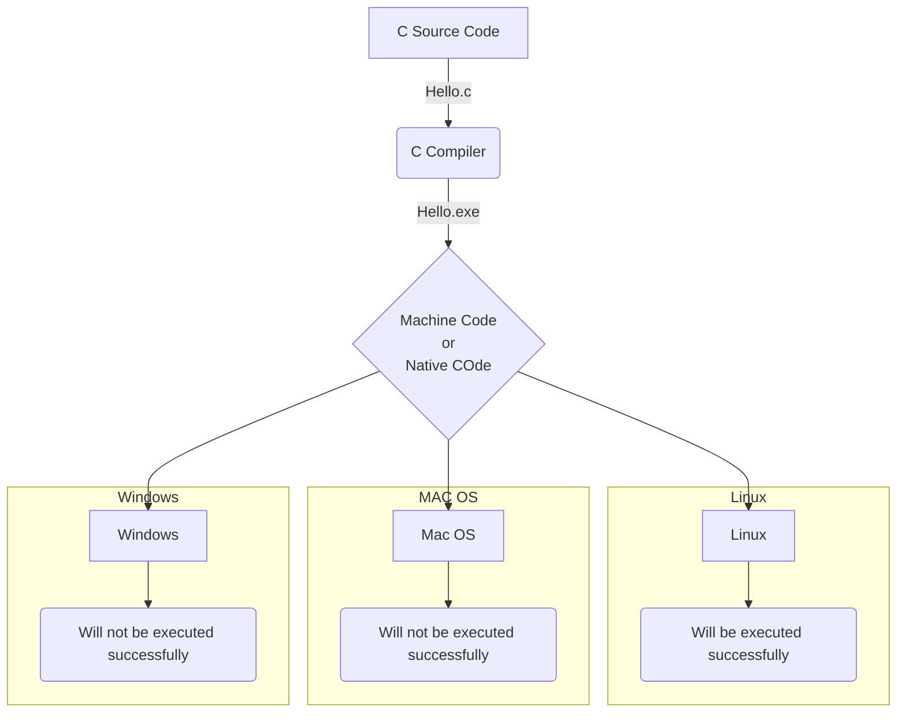
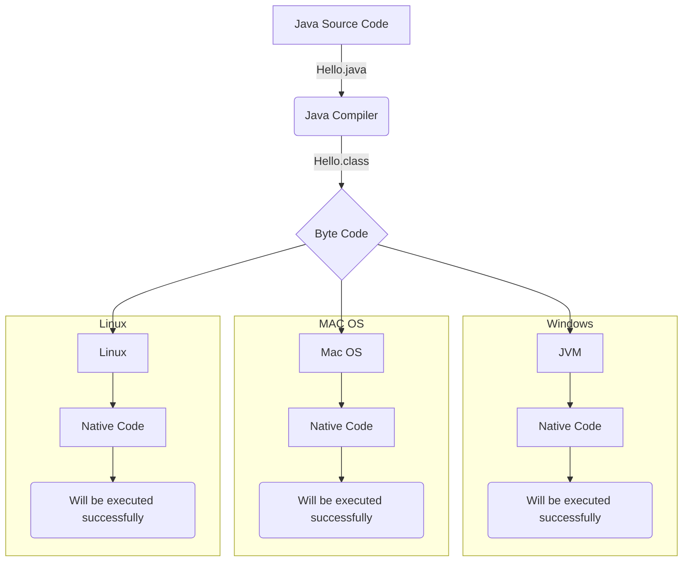

# Introduction to Java

::: info Module Information
**Module 1:** Introduction to Java  
**Author:** Srinivas Dande
:::

## Overview

Java is Simple, High Level, Platform independent, Architecture-Neutral, Secure, Robust, Multithreaded, Distributed, and Object Oriented programming language.

## Java Characteristics

### Simple
Java is easy to learn because most of the complex or confusing features of C and C++ like pointers, operator overloading etc are not provided in Java.

### Secure
Java programs run within the JVM which protects from unauthorized or illegal access to system resources.

### Platform Independent / Portable
Java program can be executed on any kind of machine containing any CPU or any operating system.

### Architecture-neutral
Since Java applications can run on any kind of CPU so it is architecture-neutral.

### Robust
Java is robust because of following:
- Strong memory management
- No Pointers
- Exception handling and Type checking
- Platform Independent

### Multithreaded
Java supports multithreaded programming, which allows us to write programs that do many things simultaneously.

### Distributed
Using RMI and EJB we can create distributed applications in java.

### Object-oriented
Java follows object oriented programming model that helps to break the complex code into easy to understand objects.

## Programming Languages

### Language
It is the medium of communication.

### Program
It is a set of instructions for a device to perform some specific task.

### Programming Language
It contains set of grammatical rules or syntax to write a program for instructing machine to perform specific tasks.

## Types of Programming Languages

::: tip Types
1. Low Level Programming Language
2. Middle Level Programming Language
3. High Level Programming Language
:::

### Low Level Programming Languages

- Binary digits (0,1) will be used to write the instructions in Low Level Language.
- Instructions written in binary language or native language will be understood by the machine directly.
- No translator program is required.

::: warning Problem
- It is very complex to write, modify and debug the instructions written in Binary Language.
- Binary code or Native code is platform dependent.
:::

### Middle Level Programming Languages

- Assembly codes like ADD, SUB, MUL, DIV, MOV etc. will be used to write the instructions in Middle Level Language.
- Instructions written in assembly language will not be understood by the machine directly.
- Assembler is a program that should be used to convert Assembly language to Machine language.

::: warning Problem
The code written in Assembly language will be processor dependent.
:::

### High Level Programming Languages

- Human understandable codes like English words will be used to write the instructions in High Level Language.
- Instructions written in High Level Language will not be understood by the machine directly.
- Compiler or Interpreter is a program that should be used to convert High Level Language to Machine language.

::: tip Advantages
It is easy to write, modify and debug the instructions written using High Level Language.
:::

## Program Development Models

### C Language Program Development



::: danger Platform Dependent
C/C++ compiled code is platform-specific and cannot run on different operating systems.
:::

### Java Language Program Development



::: tip Platform Independent
Java bytecode can run on any platform with JVM - **Write Once Run Anywhere (WORA)**
:::

## Key Concepts

### What is Source Code?

Human understandable code written using High Level Programming language is called as Source Code.

### What is Native Code or Binary Code or Machine Code?

Machine understandable code written using Low Level Programming language is called as Native Code.

### What is Byte Code?

JVM understandable code generated by Java Compiler is called as Byte Code. Byte code is also called as Magic Value.

### Why C and C++ are Platform Dependent?

When you compile C or C++ program on one Operating System then compiler generates that Operating System understandable native code. This native code generated on one OS will not run on other OS directly.

### Why Java is Platform Independent?

When you compile Java program on one Operating System then Java compiler generates Byte Code. You can run that Byte code on any OS which has the JVM. JVM is understanding the Byte code and generating native code for the corresponding OS. Because of Byte code and JVM, Java is Platform Independent.

::: tip WORA
**Write Once Run Anywhere** - Java's key feature
:::

### Performance Comparison

::: details Which is faster: C/C++ or Java?

C or C++ program execution is faster than Java program.

**Reason:** Compiled code of C or C++ program contains binary code and that binary code will be executed directly whereas compiled code of Java program contains byte code and that byte code will be converted to native code first and then native code will be executed.
:::

## Java Components

### Java Compiler (javac)

Java Compiler is a program developed in C or C++ programming language with the name "javac".

**Responsibilities:**
- Check syntactical or grammatical errors of the programs
- Convert source code to byte code

### Java Interpreter (java)

Java Interpreter is a program developed in C or C++ programming language with the name "java".

**Responsibilities:**
- Convert byte code to native code line by line
- Execute that native code

::: warning Performance Note
Because of converting and executing line by line, Java program execution was slower in initial versions of java.
:::

### JIT Compiler

JIT (Just-In-Time) compiler is a component of the Java Runtime Environment.

JIT Compiler compiles or translates or converts the necessary part of the bytecode into machine code instead of converting line by line. Because of this, performance of Java program has improved.

### JRE (Java Runtime Environment)

JRE stands for Java Runtime Environment. It is an implementation of JVM. It contains class libraries, Interpreter, JIT Compiler etc. 

::: tip
Only JRE is enough to run the Java program.
:::

### JVM (Java Virtual Machine)

JVM stands for Java Virtual Machine. It is a specification provided by SUN Microsystem whose implementation provides an environment to run our Java applications. JVM becomes an instance of JRE at run time.

**Popular Implementations:**
- SUN JRE
- IBM JRE
- Oracle JRE
- Open JDK

### JDK (Java Development Kit)

It is a set of various utility programs which are required for developing and executing the java programs.

::: warning Platform Dependent
JDK is platform dependent. Various JDKs are provided for various Operating Systems.
:::

**Components:**
1. **Java Development Tools**
   - javac
   - java
   - javap
   - jar
   - etc
2. Source Files
3. JRE

## History

::: info Java Timeline
- **Early 1990s:** Java was designed by Sun Microsystems to solve the problem of connecting household machines
- **Initial Name:** OAK
- **Creator:** James Gosling and team (James Gosling is the **Father of Java**)
- **Public Release:** 1995
- **Current Owner:** Oracle Corp (acquired Sun Microsystems)
:::

## Java Editions

### Java Standard Edition (JSE)
Used to develop standalone applications using applet and swing.

### Java Enterprise Edition (JEE)
Used to develop enterprise applications using Servlets, JSP, JDBC etc.

### Java Micro Edition (JME)
Used to develop applications for micro devices like Mobiles, Setup Box etc.

## Java Versions

| Java Version | Class Format | Code Name | Released |
|--------------|--------------|-----------|----------|
| JDK Alpha and Beta | | | 1995 |
| JDK 1.0 | | Oak | 1996 |
| JDK 1.1 | | | 1997 |
| J2SE 1.2 | | Playground | 1998 |
| J2SE 1.3 | | Kestrel | 2000 |
| J2SE 1.4 | 48 | Merlin | 2002 |
| J2SE 5 | 49 | Tiger | 2004 |
| Java SE 6 | 50 | Mustang | Dec 2006 |
| Java SE 7 | 51 | Dolphin | July 2011 |
| Java SE 8 (LTS) | 52 | | March 2014 |
| Java SE 9 | 53 | | Sept 2017 |
| Java SE 10 | 54 | | March 2018 |
| Java SE 11 (LTS) | 55 | | Sept 2018 |
| Java SE 12 | 56 | | March 2019 |
| Java SE 13 | 57 | | Sept 2019 |
| Java SE 14 | 58 | | March 2020 |
| Java SE 15 | 59 | | Sept 2020 |
| Java SE 16 | 60 | | March 2021 |
| Java SE 17 (LTS) | 61 | | Sept 2021 |
| Java SE 18 | 62 | | March 2022 |
| Java SE 19 | 63 | | Sept 2022 |
| Java SE 20 | 64 | | March 2023 |
| Java SE 21 (LTS) | 65 | | Sept 2023 |
| Java SE 22 | 66 | | March 2024 |

::: tip LTS Versions
Long-Term Support versions: Java SE 8, 11, 17, 21
:::

## Installation Steps

::: warning Prerequisites
This guide covers JDK 8 installation on Windows.
:::

**Steps:**

1. Run the installer file `jdk-8u45-windows-x64.exe` or `jdk-8u66-windows-i586.exe`
2. Click on **NEXT** button
3. Click on **CHANGE** button
4. Change the destination location to `E:\jdk1.8.0\`
5. Click on **OK** button
6. Click on **NEXT** button
7. Wait for the installation to complete
8. Select JRE destination (use defaults)
9. Click on **NEXT** button
10. Click on **CLOSE** button after completion

## Directory Structure

```
E:
└── jdk1.8.0 (JDK Directory)
    ├── bin
    │   ├── javac.exe
    │   ├── java.exe
    │   ├── javap.exe
    │   ├── jar.exe
    │   └── etc
    ├── lib
    ├── jre (PRIVATE JRE)
    └── src.zip

C:
└── Program Files
    └── Java
        └── jre1.8.0_66 (PUBLIC JRE)
```

::: info Workspace
A workspace is a directory on your hard drive where the files related to your project will be stored.

**Example Workspace:** `D:\JLC\Core`
:::

## Writing Your First Java Program

### Step 1: Write Java Code

1. Open Notepad: **Start → Run → notepad**
2. Write the following code:

```java
class Hello {
    public static void main(String[] args) {
        System.out.println("Hello World");
    }
}
```

3. Save as `Hello.java` in `D:\JLC\Core`

### Step 2: Compile Java Program

1. Open Command Prompt: **Start → Run → cmd**
2. Change to workspace directory:
   ```bash
   cd D:\JLC\Core
   ```

3. Set PATH for JDK bin directory:
   ```bash
   set path=E:\jdk1.8.0\bin;%path%
   ```

4. Compile the source code:
   ```bash
   javac Hello.java
   ```

::: tip Result
Compiler generates `Hello.class` file in `D:\JLC\Core`
:::

### Step 3: Run Java Program

Execute the java class:
```bash
java Hello
```

::: details Output
```
Hello World
```
:::

## Setting PATH Permanently

::: warning Temporary vs Permanent
Command line PATH setting is temporary and only works for that session.
:::

**To set PATH permanently:**

1. Right Click on **This PC** → **Properties**
2. Click **Advanced system settings**
3. Click **Environment Variables** button
4. Select **PATH** → Click **Edit**
5. Add: `E:\JDK1.8.0\bin;`
6. Click **OK** in all windows

## Comments in Java

### Single Line Comments
```java
// This is a single line comment
```

### Multi Line Comments
```java
/* This is a
   multi-line
   comment */
```

### Documentation Comments
```java
/**
 * This is a documentation comment
 * Used for generating JavaDoc
 */
```

## Practice Questions

### True/False Questions

| # | Question | Answer |
|---|----------|--------|
| A | C program is platform independent | ❌ False |
| B | Java program is platform independent | ✅ True |
| C | Java Compiler is platform independent | ❌ False |
| D | Java Interpreter is platform dependent | ✅ True |
| E | JVM is platform dependent | ✅ True |
| F | JRE is platform independent | ❌ False |
| G | We can use Byte code in C Language | ❌ False |
| H | Native code will be understood by Machine directly | ✅ True |
| I | Byte code will be understood by Machine directly | ❌ False |
| J | You can use "WORA" for C and C++ | ❌ False |

### Version Compatibility

::: details Q: Can I run Java 9 compiled program with JRE 8?
❌ **No.** You will get `UnsupportedClassVersionError`.
:::

::: details Q: Can I run Java 8 compiled program with JRE 9?
✅ **Yes.** Backward compatibility is supported.
:::

### Version Commands

Check Java compiler version:
```bash
javac -version
```

Check JRE version:
```bash
java -version
```

### Common Errors

::: danger javac is not recognized
**Cause:** `javac.exe` is not in current folder or PATH.

**Solution:** Set PATH to JDK bin directory.
:::

::: danger Cannot find file
**Cause:** Source file not in current directory.

**Solution:** Navigate to correct directory or provide full path.
:::

::: danger NoClassDefFoundError
**Cause:** `.class` file not in current folder or CLASSPATH.

**Solution:** Check file location and CLASSPATH settings.
:::

::: danger Incompatible magic value
**Cause:** Byte code has been manipulated or corrupted.

**Solution:** Recompile the source file.
:::

::: danger UnsupportedClassVersionError
**Cause:** Running higher version compiled bytecode with lower JRE.

**Solution:** Use matching or higher JRE version.
:::

### PATH and CLASSPATH

::: details What is PATH used for?
PATH is used to access executable (`.exe`) files from any location.
:::

::: details What is CLASSPATH used for?
CLASSPATH is used to access Java `.class` files from any location.
:::

::: details Ways to set PATH/CLASSPATH
1. **Temporary:** At command line (current session only)
2. **Permanent:** In System Environment Variables
:::

### JRE Types

::: info Private JRE vs Public JRE
- **Private JRE:** Installed under JDK directory
- **Public JRE:** Installed under Program Files

**For Compilation:** Private JRE is used first, then Public JRE

**For Execution:** Public JRE is used
:::

### Advanced Questions

::: details Can we execute Java without setting PATH?
✅ **Yes**, but not recommended. You need to provide full path to executables.
:::

::: details JVM vs JRE difference?
**JRE** is an implementation of the **JVM** specification.

Examples: Oracle JRE, IBM JRE, Open JDK
:::

::: details JIT Compiler vs Java Interpreter?
- **Interpreter:** Converts bytecode line-by-line (slower)
- **JIT Compiler:** Converts chunks of bytecode at once (faster)

JIT replaced Interpreter after Java 2 for better performance.
:::

::: details Can I install multiple JDK/JRE versions?
✅ **Yes**, you can have multiple versions installed simultaneously.
:::

::: details Can I install only JRE without JDK?
✅ **Yes**, JRE alone is sufficient to run Java programs.
:::

::: details Can file name differ from class name?
✅ **Yes**, but not recommended for public classes.
:::

::: details Can I have multiple classes in one file?
✅ **Yes**, but only one can be public.
:::

::: details Valid main method signature?
```java
public static void main(String[] args)
```
The parameter must be a String array. `String args` alone is invalid.
:::

## Java vs C++ Comparison

| Feature | Java | C++ |
|---------|------|-----|
| **Pointers** | ❌ Not supported | ✅ Supported |
| **Multiple Inheritance** | ❌ Not with classes | ✅ Supported |
| **Global Variables** | ❌ Not supported | ✅ Supported |
| **Header Files** | ❌ Not used | ✅ Required |
| **Keywords (const, goto)** | ❌ Cannot use | ✅ Can use |
| **Destructors** | ❌ Not supported | ✅ Supported |
| **Virtual Functions** | ❌ Not supported | ✅ Supported |
| **Operator Overloading** | ❌ Not supported | ✅ Supported |
| **Scope Resolution** | ❌ No `::` operator | ✅ Has `::` |
| **Multithreading API** | ✅ Built-in | ❌ Not built-in |
| **Network Programming** | ✅ Built-in | ❌ Not built-in |
| **Garbage Collection** | ✅ Automatic | ❌ Manual memory mgmt |

::: tip Key Takeaway
Java prioritizes simplicity and safety by removing complex features like pointers and multiple inheritance, while providing built-in support for modern needs like multithreading and networking.
:::