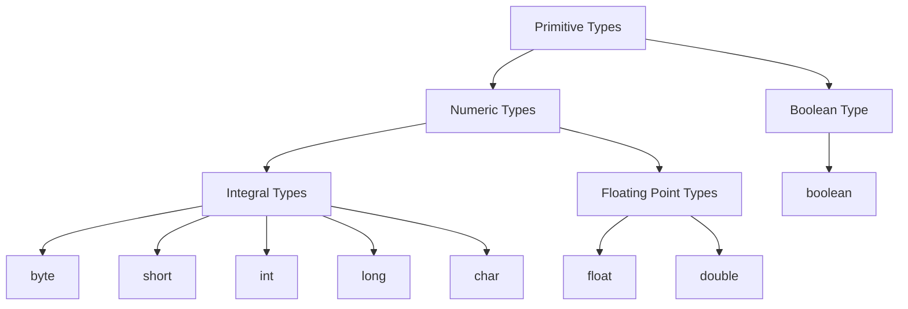
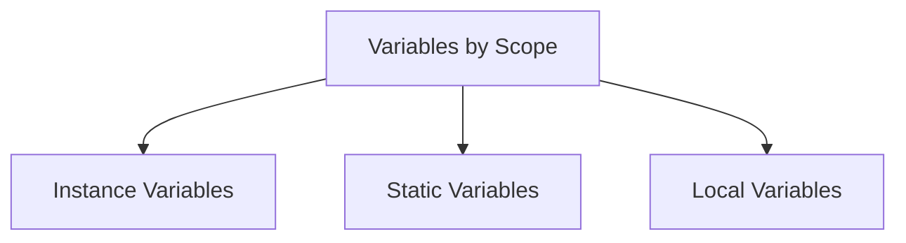
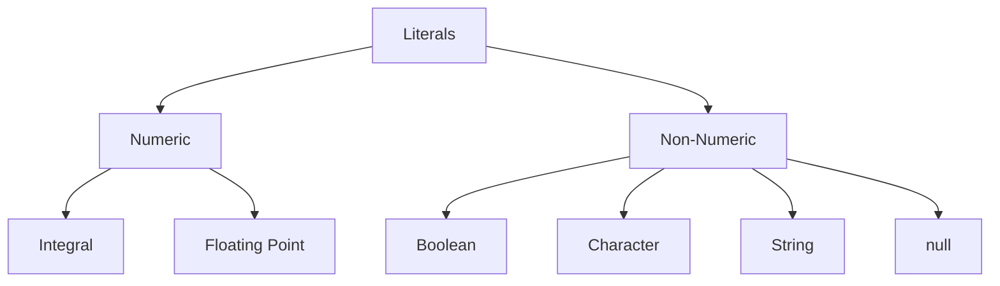
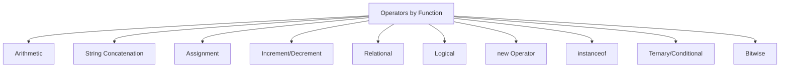

# 🧭 Module 2 – Java Language

**Author:** *Srinivas Dande*
**Source:** *Java Learning Center – Study Guide*

## 2.1 Character Sets

Java recognizes three types of character elements:

* **Alphabets** – `A–Z`, `a–z`
* **Digits** – `0–9`
* **Special Characters** – `+ - * & % $ ! < > { } = ~ ^` etc.

::: tip
Java uses **Unicode** to represent all characters, allowing it to support multiple languages and symbols.
:::

## 2.2 Keywords

Keywords are **predefined reserved words** in Java with special meaning that cannot be redefined or used as identifiers.

::: info
All Java keywords are **lowercase** and have **fixed meaning**.
:::

### Key Points

* There were **49 keywords** up to Java 2.
* **`enum`** was added in Java 5 → total **50 keywords**.
* **`const`** and **`goto`** are reserved but **not implemented**.
* `true`, `false`, and `null` are **literals**, not keywords.

### 📜 List of Keywords

| Category                    | Keywords                                                                                                |
| --------------------------- | ------------------------------------------------------------------------------------------------------- |
| **Data Types (8)**          | `boolean`, `byte`, `char`, `short`, `int`, `long`, `float`, `double`                                    |
| **Class & Object (9)**      | `class`, `interface`, `enum`, `extends`, `implements`, `this`, `super`, `new`, `instanceof`             |
| **Access Modifiers (3)**    | `private`, `protected`, `public`                                                                        |
| **Other Modifiers (9)**     | `final`, `native`, `abstract`, `synchronized`, `transient`, `volatile`, `static`, `const*`, `strictfp`  |
| **Package (2)**             | `package`, `import`                                                                                     |
| **Control Statements (12)** | `if`, `else`, `switch`, `case`, `default`, `do`, `while`, `break`, `for`, `continue`, `return`, `goto*` |
| **Exception Handling (6)**  | `try`, `catch`, `finally`, `throw`, `throws`, `assert`                                                  |
| **Other (1)**               | `void`                                                                                                  |

## 2.3 Identifiers

Identifiers are **names used to identify programming elements** (classes, methods, variables, etc.).
They are also known as **user-defined names**.

### ✅ Rules for Identifiers

* May contain **letters**, **digits**, **$**, and **_**
* Must **start with** a letter, `$`, or `_`
* **Cannot** use Java keywords or reserved words
* **Case-sensitive**

| ✅ Valid        | ❌ Invalid        |
| -------------- | ---------------- |
| `Hello`        | `1stClass`       |
| `Int`          | `true`           |
| `getClassName` | `student number` |
| `studentEmail` | `student-email`  |
| `TOTAL_FEE`    | `int`            |

## 2.4 Data Types

Data types specify:

* **Type of data** to store
* **Memory allocation** required

Two major categories:

1. **Primitive Data Types**
2. **User Defined Data Types**

### 2.4.1 Primitive Data Types

There are **8 primitive data types** in Java, each with a keyword.

| Category                 | Data Types                             |
| ------------------------ | -------------------------------------- |
| **Boolean Type**         | `boolean`                              |
| **Integral Types**       | `byte`, `short`, `int`, `long`, `char` |
| **Floating Point Types** | `float`, `double`                      |



### 2.4.2 User Defined Data Types

Four types of **User-Defined Data Types**:

1. `class`
2. `interface`
3. `enum` *(added in Java 5)*
4. `@annotation` *(added in Java 5)*

### 2.4.3 Primitive Type Summary

| Type          | Size (Bytes) | Bits | Default Value | Min        | Max      |
| ------------- | ------------ | ---- | ------------- | ---------- | -------- |
| `boolean`     | N/A          | N/A  | `false`       | true/false | —        |
| `byte`        | 1            | 8    | 0             | -128       | 127      |
| `char`        | 2            | 16   | `\u0000`      | 0          | 65535    |
| `short`       | 2            | 16   | 0             | -32768     | 32767    |
| `int`         | 4            | 32   | 0             | -2³¹       | 2³¹-1    |
| `long`        | 8            | 64   | 0             | -2⁶³       | 2⁶³-1    |
| `float`       | 4            | 32   | 0.0           | 1.4E-45    | 3.4E38   |
| `double`      | 8            | 64   | 0.0           | 4.9E-324   | 1.79E308 |
| **Reference** | 8            | 64   | `null`        | —          | —        |

## 2.5 Variables

Variables are **containers that hold user data**.

```java
int a;
String str;
int a = 99;
String str = "SRI";
```

::: tip
Memory for variables is allocated **at runtime**, not compile-time.
:::

### 2.5.1 Primitive Variables

Declared with **primitive data types**:

```java
int a = 99;
double d = 9.9;
boolean b = true;
```

### 2.5.2 Reference Variables

Declared using **user-defined data types** (like classes, interfaces, arrays):

```java
String str = "JLC";
Hello h = new Hello();
```

### 🧪 Lab Example

```java
class Hello {
  boolean b1;
  byte b2;
  short s;
  int a;
  long b;
  float f;
  double d;
  String str;
  Hello h;

  void show() {
    System.out.println(b1);
    System.out.println(b2);
    System.out.println(s);
    System.out.println(a);
    System.out.println(b);
    System.out.println(f);
    System.out.println(d);
    System.out.println(str);
    System.out.println(h);
  }
}

class Lab1 {
  public static void main(String[] as) {
    Hello h = new Hello();
    h.show();
  }
}
```

### ⚖️ Primitive vs Reference Variables

| Primitive Variables           | Reference Variables                        |
| ----------------------------- | ------------------------------------------ |
| Declared with primitive types | Declared with user-defined/reference types |
| Memory depends on type        | Always 8 bytes (reference to object)       |
| Hold literal value            | Hold object reference or `null`            |
| Default depends on data type  | Default is always `null`                   |

### 2.5.3 Variables by Scope



**1. Instance Variables:** Declared in class, **without** `static`.

**2. Static Variables:** Declared with `static`.

**3. Local Variables:** Declared **inside a method** or block.

```java
class Hello {
  int a;           // Instance
  static int b;    // Static
  void show() {
    int c;         // Local
  }
}
```

## 2.6 Constants

A **constant** is a special variable whose value **cannot be modified** after initialization.

```java
final int A = 99;
final String STR = "JLC";
final double D1 = 999.99;
```

::: info
Constants are declared using the `final` keyword.
:::

### Syntax

```java
[modifier] final <dataType> <varName> = <value>;
```

### Blank Final Variable

A **blank final** is a variable declared as `final` but **initialized later**.

```java
final int A;
A = 98;
```

::: tip
Once initialized, the value of a final variable **cannot be changed**.
:::

### Examples

#### ✅ Valid Final Declaration

```java
final int A = 99;
System.out.println(A);
```

#### ❌ Invalid Reassignment

```java
final int A = 99;
A = 88; // Compilation Error
```

#### ✅ Blank Final Example

```java
final int A;
A = 99;
System.out.println(A);
```

### 🧠 Notes Summary

1. `const` keyword exists but is **not implemented** in Java.
   Use `final` instead.
2. Final variables are **replaced by literal values** in compiled class files.
3. Value of a final variable **cannot be reassigned**.
4. Final variables **must be initialized** before use.

## 2.7 Literals

Literals are the **actual fixed values** assigned to variables or constants in a program.

### Classification



### 2.7.1 Boolean Literals

A boolean literal can have only **two values**:

```java
boolean b1 = true;
boolean b2 = false;
```

::: warning
Boolean variables **cannot** hold numeric values like `1` or `0`.
:::

#### Invalid:

```java
boolean b = 1; // ❌ Compilation Error
```

### 2.7.2 Character Literals

Character literals represent a **single character** enclosed in single quotes `'A'`.

A `char` can hold:

1. A single character
2. An escape sequence
3. An ASCII value
4. A Unicode character
5. An Octal value

#### Example

```java
char ch1 = 'A';
char ch2 = '\u0041'; // Unicode
char ch3 = '\101';   // Octal
char ch4 = 65;       // ASCII
```

#### 2.7.2.1 Escape Sequences

Escape sequences represent **special characters** that cannot be typed directly.

| Escape | Description     |
| ------ | --------------- |
| `\t`   | Tab space       |
| `\b`   | Backspace       |
| `\n`   | New line        |
| `\r`   | Carriage return |
| `\f`   | Form feed       |
| `\'`   | Single quote    |
| `\"`   | Double quote    |
| `\\`   | Backslash       |

```java
char singleQuote = '\'';
char doubleQuote = '\"';
char backslash = '\\';
```

#### 2.7.2.2 ASCII Character Set

ASCII (American Standard Code for Information Interchange) represents characters as integers from **0–255**.

```java
char ch1 = 65; // 'A'
char ch2 = 97; // 'a'
System.out.println(ch1 + " " + ch2);
```

| Character | ASCII | Octal | Unicode |
| --------- | ----- | ----- | ------- |
| A         | 65    | 101   | \u0041  |
| a         | 97    | 141   | \u0061  |
| 0         | 48    | 060   | \u0030  |
| 9         | 57    | 071   | \u0039  |

#### 2.7.2.3 Unicode Characters

Unicode is used for **internationalization**, representing characters from all languages.

* Range: `\u0000` → `\uFFFF`
* Always written as: `\u` + **4 hexadecimal digits**

```java
char ch = '\u0061'; // 'a'
System.out.println(ch);
```

#### 2.7.2.4 Octal Values

Characters can also be represented using **octal notation**.

* Syntax: `\DDD` (D = octal digit)
* Range: `\0` → `\377` (0–255 decimal)

```java
char ch = '\101'; // 'A'
```

::: tip
When you print a `char` assigned with ASCII, Unicode, or Octal,
it shows the **corresponding character**.
:::

### 2.7.3 String Literals

A **string literal** is a sequence of zero or more characters enclosed in double quotes.

```java
String str1 = "";
String str2 = "JLCINDIA";
String str3 = "JLC99@india";
```

| Type             | Example            | Length | Description                     |
| ---------------- | ------------------ | ------ | ------------------------------- |
| **Null String**  | `String s = null;` | N/A    | No object reference             |
| **Empty String** | `String s = "";`   | 0      | Valid object with no characters |

::: warning
Accessing members (`s.length()`) on a **null string** causes `NullPointerException`.
:::

#### Example

```java
String str1 = null;
System.out.println(str1.length()); // ❌ Exception

String str2 = "";
System.out.println(str2.length()); // ✅ 0
```

### 2.7.4 Integer Literals

Integer literals represent **whole numbers**.

#### Types:

1. Decimal (Base 10)
2. Octal (Base 8)
3. Hexadecimal (Base 16)
4. Binary (Base 2 – from Java 7)

#### Decimal Literals

* Use digits `0–9`
* Must **not start with 0**

```java
int num = 12345;
long big = 2147483648L; // ‘L’ suffix for long
```

#### Octal Literals

* Must start with `0`
* Digits allowed: `0–7`

```java
int num = 0101; // octal for 65
```

#### Hexadecimal Literals

* Must start with `0x` or `0X`
* Digits allowed: `0–9`, `A–F`, `a–f`

```java
int hex = 0xA;
int val = 0xFACE;
```

#### Binary Literals (Java 7+)

* Must start with `0b` or `0B`
* Digits allowed: `0` or `1`

```java
int a = 0b1010;
System.out.println(a); // 10
```

::: info
If invalid digits are used (like `0b102`), you’ll get a **compilation error**.
:::

### 2.7.5 Floating Point Literals

Floating literals represent **decimal numbers**.
Default type: `double`.

#### Standard Notation

```java
double d = 123.456;
float f = 12.34F; // ‘F’ or ‘f’ required for float
```

#### Scientific Notation

```java
double d1 = 1.23e2;  // 1.23 × 10² = 123.0
float f1 = 9.8e-3F;  // 9.8 × 10⁻³ = 0.0098
```

#### Hexadecimal Floating (Java 5+)

```java
double d1 = 0xAp0;  // 10.0
double d2 = 0xAp1;  // 20.0
double d3 = 0xAp2;  // 40.0
```

### 2.7.6 Null Literal

* `null` is a **literal** representing **no object reference**.
* Default value for all **reference variables**.

```java
String name = null;
System.out.println(name); // prints null
```

### 2.7.7 Underscore in Numeric Literals (Java 7+)

Underscores improve readability in numbers.

```java
int a = 2_45_12_452;
double d = 1_234.56;
long card = 9_876_543_210L;
```

::: warning
Underscores **cannot appear**:

* At the beginning or end
* Next to a decimal point
* Immediately after `0x`, `0b`, or `0`
  :::

### 💡 Literals Summary

| Category   | Notes                                                  |
| ---------- | ------------------------------------------------------ |
| Boolean    | Only `true` or `false`, lowercase only                 |
| Character  | Single quote, can use escape, ASCII, Unicode, or Octal |
| String     | Double quotes, supports escape sequences               |
| Integer    | Decimal, Octal, Hexadecimal, Binary                    |
| Floating   | Standard, Scientific, Hexadecimal                      |
| Null       | Represents no reference                                |
| Underscore | Improves readability (Java 7+)                         |

<details>
<summary>📘 Assignment #1 – Variables and Constants</summary>

1. How many keywords are available prior to Java 5?
2. What keyword was added newly in Java 5?
3. Which keywords cannot be used in a Java program?
4. What is an identifier and what rules apply?
5. What is the default value of `char`?
6. What is a variable and how many types exist?
7. What is a constant?
8. Can you use `const` to declare constants?
9. When is memory allocated for a variable?
10. What’s the difference between instance, static, and local variables?

</details>

<details>
<summary>📗 Assignment #2 – Literals</summary>

1. What is a literal and how many types are available?
2. What happens if `1` is assigned to a `boolean`?
3. What is the escape sequence for a double quote?
4. What are the ranges of ASCII and Unicode?
5. What’s the difference between a null string and an empty string?
6. What happens when you use Unicode inside a string literal?
7. Can underscore appear after `0x` in hexadecimal?
8. Can underscore be used after a decimal point?

</details>

## 2.8 Operators

Operators are **symbols used to perform operations** on operands.
Each operator has a defined **operation type** and **number of operands**.

### 🧩 Operator Types by Operand Count

```mermaid
flowchart TD
  A[Operators] --> B[Unary (1 Operand)]
  A --> C[Binary (2 Operands)]
  A --> D[Ternary (3 Operands)]
```

| Type        | Example            | Description                  |
| ----------- | ------------------ | ---------------------------- |
| **Unary**   | `++a`, `--b`, `!a` | Operates on a single operand |
| **Binary**  | `a + b`, `x > y`   | Operates on two operands     |
| **Ternary** | `a ? b : c`        | Operates on three operands   |

### 🔢 Operator Categories by Function



## 2.8.1 Arithmetic Operators

Arithmetic operators perform mathematical operations.

| Operator | Description         |
| -------- | ------------------- |
| `+`      | Addition            |
| `-`      | Subtraction         |
| `*`      | Multiplication      |
| `/`      | Division            |
| `%`      | Modulus (Remainder) |

::: info
Operands can be **numeric** or **char** type.
Result is always `int` or wider than `int`.
:::

### 2.8.1.1 Unary Arithmetic Operators

| Operator | Description                               |
| -------- | ----------------------------------------- |
| `+`      | Returns the same value                    |
| `-`      | Returns the same value with opposite sign |

```java
int a = 19;
int b = +a;  // 19
int c = -a;  // -19
```

### 2.8.1.2 Binary Arithmetic Operators

```java
int a = 10;
int b = 3;
System.out.println(a + b); // 13
System.out.println(a - b); // 7
System.out.println(a * b); // 30
System.out.println(a / b); // 3
System.out.println(a % b); // 1
```

#### Operator Result Rules

| Operand 1 | Operand 2 | Result Type |
| --------- | --------- | ----------- |
| `byte`    | `byte`    | `int`       |
| `char`    | `char`    | `int`       |
| `short`   | `byte`    | `int`       |
| `int`     | `long`    | `long`      |
| `byte`    | `double`  | `double`    |
| `float`   | `int`     | `float`     |
| `float`   | `long`    | `float`     |
| `char`    | `double`  | `double`    |

### 🔍 Examples

#### Example 1

```java
byte a = 10, b = 20;
byte c = (byte)(a + b); // must cast, since result is int
```

#### Example 2

```java
char ch1 = 'A';
int val = ch1 + 1; // 'A' (65) + 1 = 66
System.out.println(val); // prints 66
```

#### Example 3

```java
System.out.println(10 / 3);  // 3
System.out.println(10.0 / 3); // 3.3333333
```

::: tip
When integer division occurs, **fractional part is truncated**.
Use `double` or `float` for precise division.
:::

## 2.8.2 String Concatenation Operator

`+` is also used for **string concatenation** in Java.

```java
String name = "Java";
String version = "17";
System.out.println(name + " " + version);
```

Output:

```
Java 17
```

::: info
If **any operand** in an expression is a String, the rest are converted to String automatically.
:::

#### Example

```java
System.out.println("Sum: " + 10 + 20);   // Sum: 1020
System.out.println(10 + 20 + " is sum"); // 30 is sum
```

## 2.8.3 Assignment Operators

Assignment operators **assign values** to variables.

| Operator | Example  | Equivalent        |
| -------- | -------- | ----------------- |
| `=`      | `a = b`  | Assign `b` to `a` |
| `+=`     | `a += b` | `a = a + b`       |
| `-=`     | `a -= b` | `a = a - b`       |
| `*=`     | `a *= b` | `a = a * b`       |
| `/=`     | `a /= b` | `a = a / b`       |
| `%=`     | `a %= b` | `a = a % b`       |

```java
int x = 10;
x += 5;  // 15
x *= 2;  // 30
```

## 2.8.4 Increment & Decrement Operators

| Operator | Description    |
| -------- | -------------- |
| `++`     | Increment by 1 |
| `--`     | Decrement by 1 |

These can be **prefix** or **postfix**:

```java
int a = 5;
System.out.println(++a); // 6 (increment, then print)
System.out.println(a++); // 6 (print, then increment)
System.out.println(a);   // 7
```

::: tip
`++` and `--` can only be applied to **variables**, not constants or expressions.
:::

## 2.8.5 Relational Operators

Used to **compare two values** and return a boolean result.

| Operator | Description      |
| -------- | ---------------- |
| `==`     | Equal to         |
| `!=`     | Not equal to     |
| `>`      | Greater than     |
| `<`      | Less than        |
| `>=`     | Greater or equal |
| `<=`     | Less or equal    |

```java
int a = 5, b = 10;
System.out.println(a < b); // true
System.out.println(a == b); // false
```

## 2.8.6 Logical Operators

Used to combine or invert boolean expressions.

| Operator | Description |   |            |
| -------- | ----------- | - | ---------- |
| `&&`     | Logical AND |   |            |
| `        |             | ` | Logical OR |
| `!`      | Logical NOT |   |            |

```java
boolean x = true, y = false;
System.out.println(x && y); // false
System.out.println(x || y); // true
System.out.println(!x);     // false
```

::: warning
Logical AND (`&&`) and OR (`||`) **short-circuit** — meaning the second operand may not be evaluated if the result is already determined.
:::

## 2.8.7 `new` Operator

The `new` operator is used to **create objects** in Java.

```java
String s = new String("Hello");
Hello h = new Hello();
```

* Allocates memory for the object.
* Returns the **reference** (address) to the variable.

## 2.8.8 `instanceof` Operator

Checks whether an object is an **instance of a specific class or subclass**.

```java
String s = "Hello";
System.out.println(s instanceof String); // true
```

## 2.8.9 Conditional (Ternary) Operator

Ternary operator `?:` is a **shorthand for if-else**.

```java
int a = 10, b = 20;
int max = (a > b) ? a : b;
System.out.println(max);
```

Equivalent to:

```java
if (a > b)
  max = a;
else
  max = b;
```

## 2.8.10 Bitwise Operators

Operate at the **bit level** for integral data types.

| Operator | Description          |            |
| -------- | -------------------- | ---------- |
| `&`      | Bitwise AND          |            |
| `        | `                    | Bitwise OR |
| `^`      | Bitwise XOR          |            |
| `~`      | Bitwise Complement   |            |
| `<<`     | Left Shift           |            |
| `>>`     | Right Shift          |            |
| `>>>`    | Unsigned Right Shift |            |

```java
int a = 5, b = 3;
System.out.println(a & b);  // 1
System.out.println(a | b);  // 7
System.out.println(a ^ b);  // 6
System.out.println(~a);     // -6
```

#### Shift Operators Example

```java
int a = 8;
System.out.println(a << 1); // 16 (multiply by 2)
System.out.println(a >> 1); // 4  (divide by 2)
```

## ⚙️ Operator Precedence (Highest → Lowest)

| Precedence | Operators                          | Description    |            |            |
| ---------- | ---------------------------------- | -------------- | ---------- | ---------- |
| 1          | `()`                               | Parentheses    |            |            |
| 2          | `++`, `--`, `!`, `~`               | Unary          |            |            |
| 3          | `*`, `/`, `%`                      | Multiplicative |            |            |
| 4          | `+`, `-`                           | Additive       |            |            |
| 5          | `<<`, `>>`, `>>>`                  | Shift          |            |            |
| 6          | `<`, `>`, `<=`, `>=`, `instanceof` | Relational     |            |            |
| 7          | `==`, `!=`                         | Equality       |            |            |
| 8          | `&`                                | Bitwise AND    |            |            |
| 9          | `^`                                | Bitwise XOR    |            |            |
| 10         | `                                  | `              | Bitwise OR |            |
| 11         | `&&`                               | Logical AND    |            |            |
| 12         | `                                  |                | `          | Logical OR |
| 13         | `?:`                               | Conditional    |            |            |
| 14         | `=`, `+=`, `-=`, `*=`, `/=`, `%=`  | Assignment     |            |            |

## 💡 Summary – Operators

::: tip
**Key Takeaways**
:::

1. Operators are categorized by **operation** and **number of operands**.
2. Arithmetic operations result in **int or wider** type.
3. String concatenation uses `+`.
4. Compound assignment automatically performs **type conversion**.
5. `++` and `--` work only on variables.
6. `==` compares values; `equals()` compares content (for objects).
7. Logical operators short-circuit.
8. Bitwise operators manipulate individual bits.
9. `instanceof` checks runtime type.
10. Use parentheses `()` to control precedence.

<details>
<summary>📘 Practice Questions</summary>

1. What are the different types of operators in Java?
2. What is the difference between unary and binary operators?
3. How does Java handle division between two integers?
4. What is the result of `"A" + 10 + 20` vs `10 + 20 + "A"`?
5. What’s the purpose of compound assignment operators?
6. How do pre- and post-increment differ?
7. What is short-circuit evaluation?
8. How does the `instanceof` operator work?
9. How do bitwise and logical operators differ?
10. Arrange the operators in decreasing order of precedence.

</details>

✅ **Module Summary**

* Character sets, identifiers, and data types define Java’s core syntax.
* Variables and constants control data storage.
* Literals represent values directly in code.
* Operators enable all mathematical, logical, and object-based operations.


