# Module 3: Object Oriented Programming

::: info Author
Srinivas Dande - myjavalearningcenter.com
:::

## 3.1 OOPS Concepts

### Overview

Object-Oriented Programming (OOP) is built on four major principles:

- **Abstraction**
- **Encapsulation**
- **Inheritance**
- **Polymorphism**

::: tip Definition by Grady Booch
"Everything in the world is an object" - Grady Booch, Father of OOPS
:::

### 3.1.1 Abstraction

**Abstraction** is the process of providing necessary properties and operations of an object while hiding unnecessary details.
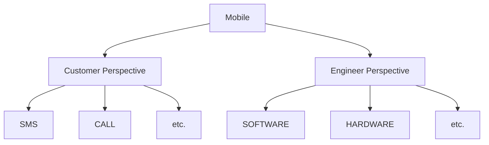

::: details Example
When describing a Mobile for a Customer, you provide only the necessary properties and operations (SMS, CALL) while hiding complex engineering details (SOFTWARE, HARDWARE) that engineers need.
:::

### 3.1.2 Encapsulation

**Encapsulation** is a process of describing the state and behavior of an object in a class.
```java
class Person {
    // State or Data members or Fields or Properties
    int age;
    String name;
    
    // Behavior or Member functions or Methods
    void walk() {
        // method implementation
    }
    
    void eat() {
        // method implementation
    }
}
```
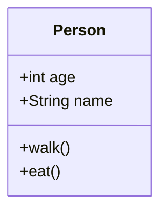

### 3.1.3 Inheritance

**Inheritance** is the process of writing a new class by inheriting commonly used state and behavior from an existing class.

**Terminology:**
- **Super class / Base class / Parent class**: Existing class
- **Sub class / Derived class / Child class**: Newly defined class
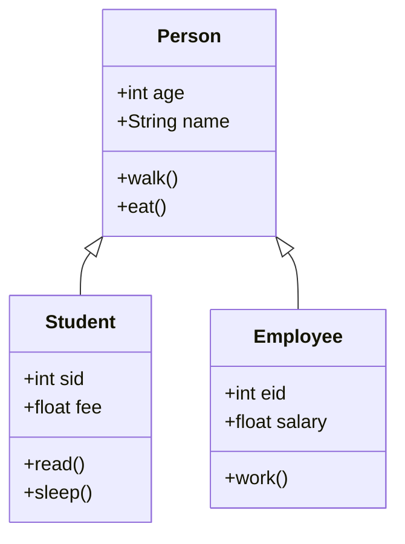

::: info Benefits
- **Code Reusability**: Reuse properties and operations from existing classes
- **Extensibility**: Add new features to existing functionality
:::

### 3.1.4 Polymorphism

**Polymorphism** (One name - Many forms) is the ability of an object to behave differently at different situations.

#### Examples:

1. **Power Button** - Polymorphic Behavior
   - Press once → Device switches ON
   - Press again → Device switches OFF

2. **`+` Operator** in Java
```java
   // Arithmetic Addition
   int result = 10 + 20;  // result = 30
   
   // String Concatenation
   String text = "Hello" + "World";  // text = "HelloWorld"
```
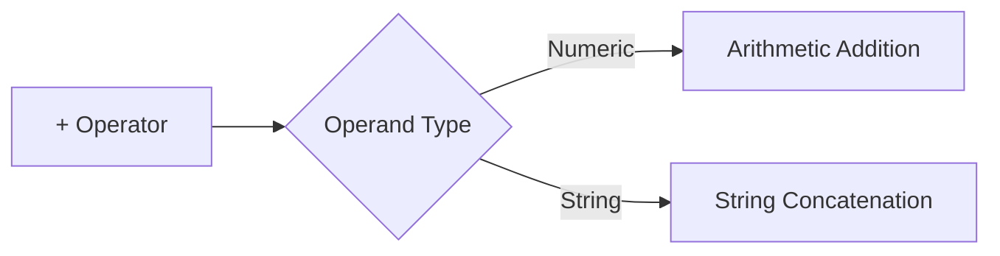

## 3.2 Classes and Objects

### What is a Class?

A **Class** is a prototype, template, pattern, or blueprint of an object's state and behavior.

::: tip Key Points
- Contains logical description of real-world entities
- Tells JVM how to create objects
- **Formula**: Class = State + Behavior
:::

**Syntax:**
```java
[modifiers] class <ClassName> {
    // Members of class
}
```

**Example:**
```java
class Customer {
    // State (Instance Variables)
    int cid;
    String cname;
    long phone;
    
    // Behavior (Methods)
    void show() {
        System.out.println(cid + "\t" + cname + "\t" + phone);
    }
}
```

### What is an Object?

An **Object** is the physical representation of a class.

::: info Characteristics
- **Runtime entity**: Memory allocated during program execution
- **Memory location**: HEAP MEMORY
- **Also called**: Instance of the class
:::

**Syntax:**
```java
<ClassName> <refVarName> = new <ClassName>();
```

**Example:**
```java
Customer c1 = new Customer();
Customer c2 = new Customer();
Customer c3 = new Customer();
```
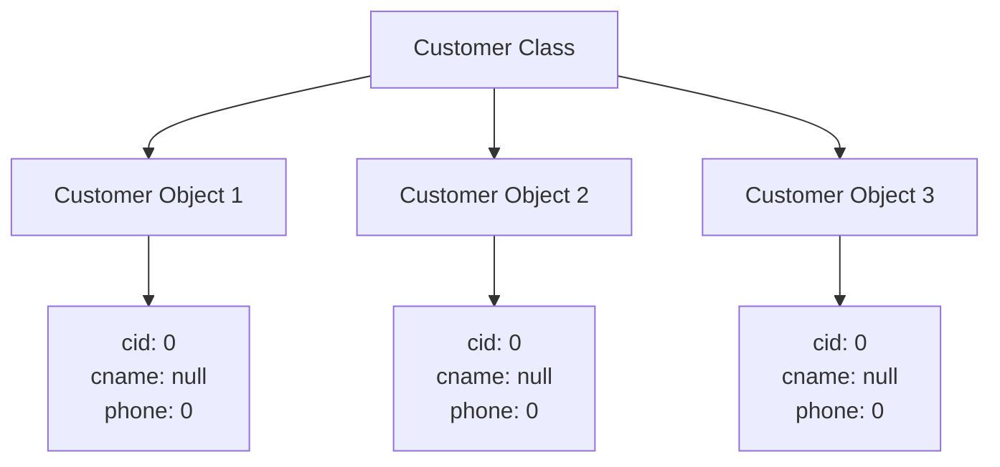

### Object Creation Process

When you execute: `Customer c1 = new Customer();`
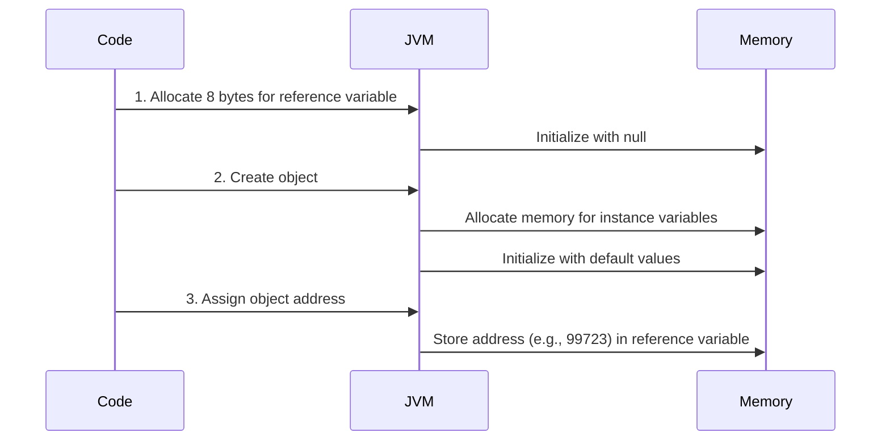

**Step-by-step:**

1. **Allocate reference variable** (8 bytes) and initialize with `null`
2. **Create object**:
   - Allocate memory for instance variables
   - Initialize with default values
3. **Assign address** of the newly created object to reference variable

::: details Memory Representation
```
Before object creation:
┌─────────┐
│ c1: null│ (8 bytes)
└─────────┘

After object creation:
┌──────────┐
│c1: 99723 │ (8 bytes)
└──────────┘
     │
     └──────> ┌────────────────┐
              │ cid: 0         │
              │ cname: null    │
              │ phone: 0       │
              └────────────────┘
              (Address: 99723)
```
:::

### Code Examples

::: code-group
```java [Lab248.java]
class Hello {
    int a;
    int b = 20;
    
    void show() {
        System.out.println("a : " + a);
        System.out.println("b : " + b);
    }
}

class Lab248 {
    public static void main(String args[]) {
        Hello h1 = new Hello();
        h1.show();  // Output: a : 0, b : 20
        
        h1.a = 10;
        h1.show();  // Output: a : 10, b : 20
        
        Hello h2 = new Hello();
        h2.show();  // Output: a : 0, b : 20
        
        h2.a = 100;
        h2.b = 200;
        h2.show();  // Output: a : 100, b : 200
    }
}
```
```java [Lab249.java]
class Customer {
    int cid;
    String cname;
    String email;
    long phone;
    
    void show() {
        System.out.println(cid + "\t" + cname + "\t" + 
                          email + "\t" + phone);
    }
}

class Lab249 {
    public static void main(String args[]) {
        Customer cust1 = new Customer();
        cust1.show();  // Default values
        
        cust1.cid = 101;
        cust1.cname = "Sri";
        cust1.email = "sri@myjlc.com";
        cust1.phone = 123456;
        cust1.show();
        
        Customer cust2 = new Customer();
        cust2.cid = 102;
        cust2.cname = "Vas";
        cust2.email = "vas@myjlc.com";
        cust2.phone = 56789;
        cust2.show();
    }
}
```

:::

## Assignment #7

::: details Practice Questions

**Q1)** Who is the father of OOPS?

**Q2)** What are OOPS concepts?

**Q3)** What is Abstraction?

**Q4)** What is Encapsulation?

**Q5)** What is Inheritance?

**Q6)** What is Polymorphism?

**Q7)** Explain State and Behavior of a class?

**Q8)** What is a Class?

**Q9)** What is the syntax to define a class?

**Q10)** What is an Object?

**Q11)** What is the syntax to create an Object?

**Q12)** What is happening inside the JVM when you create an object?

**Q13)** What are the valid members of a class?

**Q14)** How to access the members of a class?

**Q15)** What is the use of the `.` (dot) Operator?

:::


## 3.3 Members of Class

A class can contain the following five types of members:
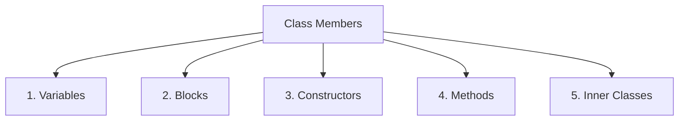

### 3.3.1 Variables

A **variable** is a container that holds user data. Memory is allocated during program execution, and its value can be changed multiple times.

#### Types of Variables by Data Type:
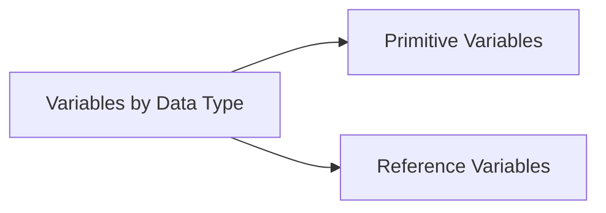

#### Types of Variables by Scope:
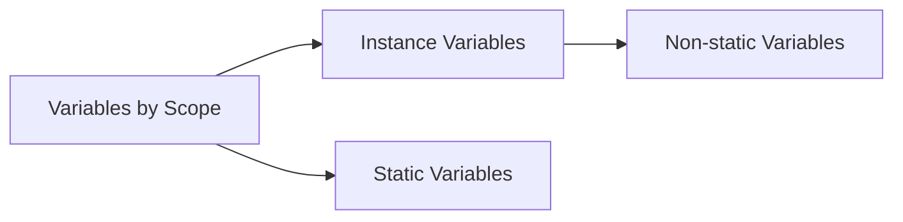

**Example:**
```java
class Hello {
    int a;                    // Primitive Instance Variable
    String str;               // Reference Instance Variable
    static int b;             // Primitive Static Variable
    static String msg;        // Reference Static Variable
}
```


### 3.3.1.1 Instance Variables

::: info Definition
Variables declared in a class **without** the `static` modifier are called **instance variables** (also known as **non-static variables**).
:::

**Key Characteristics:**
- Belong to the **instance/object** of the class
- Memory allocated when **object is created**
- **Multiple copies** exist for multiple objects
- Each object has its own copy

#### Accessing Instance Variables:
```java
class Hello {
    int a;
}
```

| Method | Syntax | Allowed? |
|--------|--------|----------|
| With object reference | `Hello h = new Hello();`<br/>`h.a` | ✅ Yes |
| With null reference | `Hello h = null;`<br/>`h.a` | ❌ No (NullPointerException) |
| With class name | `Hello.a` | ❌ No (Compile error) |

::: danger Common Error
Accessing instance variables with `null` reference throws `NullPointerException` at runtime.

Accessing instance variables with class name gives compile error: "non-static variable a cannot be referenced from a static context"
:::


### 3.3.1.2 Static Variables

::: info Definition
Variables declared in a class **with** the `static` modifier are called **static variables** (also known as **class variables**).
:::

**Key Characteristics:**
- Belong to the **class**, not to instances
- Memory allocated when **class is loaded**
- **Single copy** shared by all objects
- Changes reflect across all objects

#### Accessing Static Variables:
```java
class Hello {
    static int b;
}
```

| Method | Syntax | Allowed? |
|--------|--------|----------|
| With class name | `Hello.b` | ✅ Yes (Recommended) |
| With null reference | `Hello h = null;`<br/>`h.b` | ✅ Yes |
| With object reference | `Hello h = new Hello();`<br/>`h.b` | ✅ Yes (Not recommended) |
| Direct object creation | `new Hello().b` | ✅ Yes (Not recommended) |

::: tip Best Practice
Always access static variables using the class name for better code readability.
:::


Would you like me to continue with the next sections? I can generate:
- Section 3.3.2 (Blocks)
- Section 3.3.3 (Constructors)
- Section 3.4 (Inheritance)
- And so on...

Let me know which sections you'd like me to convert next!

## 3.3.2 Blocks

::: info Definition
A **block** is a set of instructions defined in curly braces `{}`. Blocks don't have names and cannot be invoked explicitly - they are invoked automatically by the JVM.
:::

Blocks defined directly inside a class are called **Initialization Blocks**. There are two types:
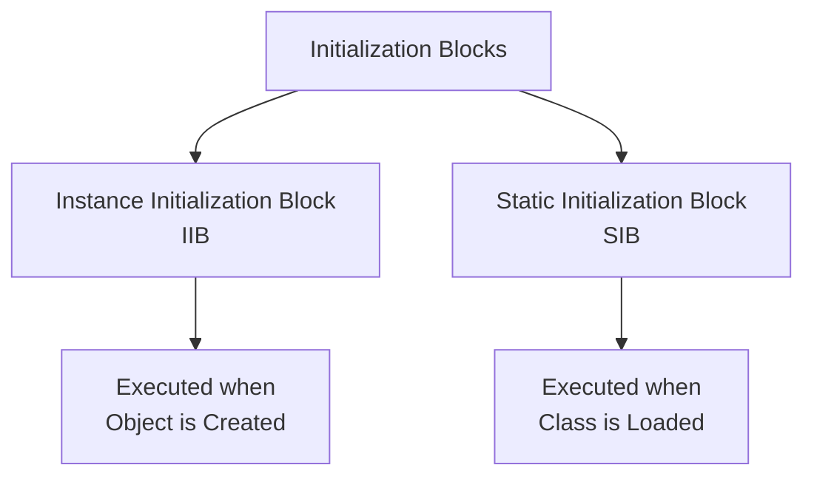


### 3.3.2.1 Instance Initialization Blocks (IIB)

::: info Definition
A block defined inside a class directly **without** the `static` modifier is called an **Instance Initialization Block**.
:::

**Characteristics:**
- Executed **automatically** by JVM when an object is created
- Executed **every time** an object is created
- Executed **after** instance variables are initialized
- Executed **before** constructor statements

**Syntax:**
```java
class Hello {
    {
        System.out.println("I am Instance Block");
    }
}
```

**Example:**
```java
class Hello {
    int a;
    
    {
        System.out.println("I.B - a = " + a);  // Default value: 0
        a = 10;
        System.out.println("I.B - a = " + a);  // Updated value: 10
    }
}
```


### 3.3.2.2 Static Initialization Blocks (SIB)

::: info Definition
A block defined inside a class directly **with** the `static` modifier is called a **Static Initialization Block**.
:::

**Characteristics:**
- Executed **automatically** by JVM when class is loaded
- Executed **only once** (when class is first loaded)
- Executed **after** static variables are initialized
- Executed **before** any object creation or static method call

**Syntax:**
```java
class Hello {
    static {
        System.out.println("I am Static Block");
    }
}
```

**Example:**
```java
class Hello {
    static int b;
    
    static {
        System.out.println("S.B - b = " + b);  // Default value: 0
        b = 20;
        System.out.println("S.B - b = " + b);  // Updated value: 20
    }
}
```


### Code Examples

::: code-group
```java [Lab264.java - Local Block]
class Lab264 {
    public static void main(String args[]) {
        int a;
        a = 10;
        System.out.println(a);  // Output: 10
    }
}
```
```java [Lab265.java - Invalid Syntax]
class Hello {
    int a;
    a = 10;  // ❌ ERROR: Not allowed outside block/method
    System.out.println(a);  // ❌ ERROR
}

class Lab265 {
    public static void main(String args[]) {
        Hello h = new Hello();
    }
}
```
```java [Lab266.java - Instance Block]
class Hello {
    int a;
    
    {
        System.out.println("I am I.B");
        a = 10;
        System.out.println(a);
    }
}

class Lab266 {
    public static void main(String args[]) {
        Hello h = new Hello();
        // Output:
        // I am I.B
        // 10
    }
}
```
```java [Lab267.java - Static Block]
class Hello {
    static int b;
    
    static {
        System.out.println("I am S.B");
        b = 20;
        System.out.println(b);
    }
}

class Lab267 {
    public static void main(String args[]) {
        System.out.println("In Main : b = " + Hello.b);
        // Output:
        // I am S.B
        // 20
        // In Main : b = 20
    }
}
```

:::


### Combined Example: Instance and Static Blocks

::: code-group
```java [Lab268.java - Class Loading]
class Hello {
    int a;
    static int b;
    
    {
        System.out.println("I am I.B");
        System.out.println(a);
        a = 10;
        System.out.println(a);
    }
    
    static {
        System.out.println("I am S.B");
        System.out.println(b);
        b = 20;
        System.out.println(b);
    }
}

class Lab268 {
    public static void main(String args[]) {
        System.out.println("In Main : b = " + Hello.b);
    }
}

/* Output:
I am S.B
0
20
In Main : b = 20
*/
```
```java [Lab269.java - Object Creation]
class Hello {
    int a;
    static int b;
    
    {
        System.out.println("I am I.B");
        System.out.println(a);
        a = 10;
        System.out.println(a);
    }
    
    static {
        System.out.println("I am S.B");
        System.out.println(b);
        b = 20;
        System.out.println(b);
    }
}

class Lab269 {
    public static void main(String args[]) {
        Hello h = new Hello();
    }
}

/* Output:
I am S.B
0
20
I am I.B
0
10
*/
```

:::


### Execution Order
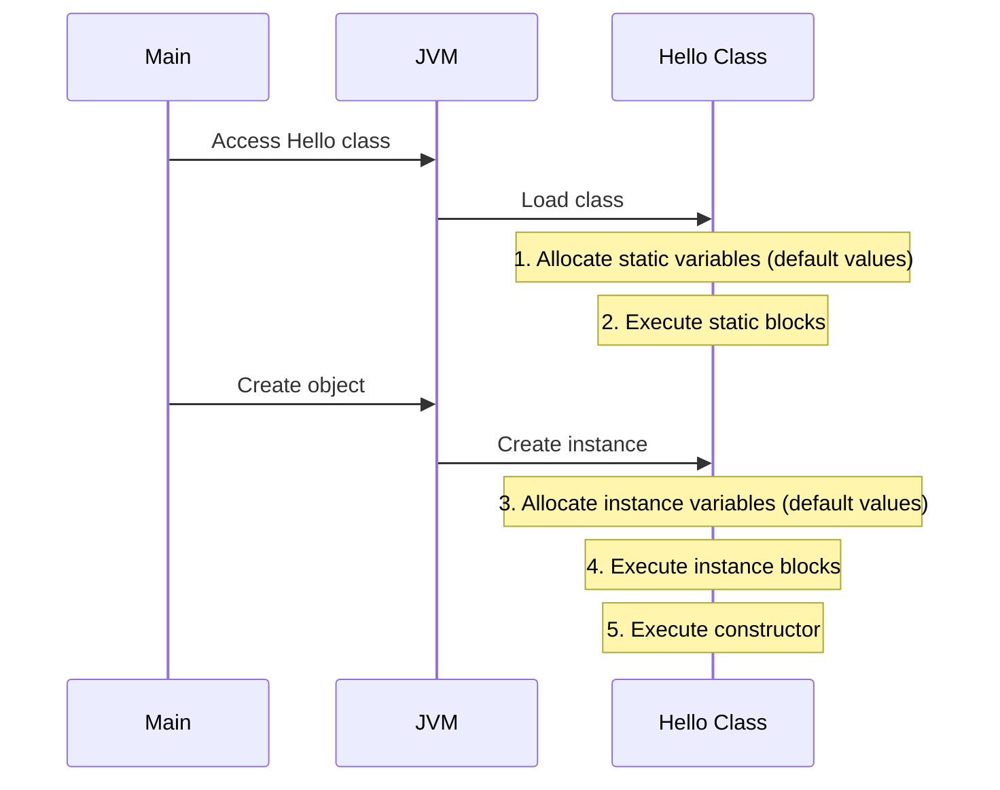

::: tip Execution Order Summary
1. **Static variables** are initialized with default values
2. **Static blocks** are executed
3. **Instance variables** are initialized with default values
4. **Instance blocks** are executed
5. **Constructor** statements are executed
:::


### Special Cases

::: code-group
```java [Lab270.java - Null Reference]
class Hello {
    {
        System.out.println("I am I.B");
    }
    
    static {
        System.out.println("I am S.B");
    }
}

class Lab270 {
    public static void main(String args[]) {
        Hello h = null;  // No object created
    }
}

/* Output:
I am S.B
*/
// Note: Instance block NOT executed (no object created)
```
```java [Lab271.java - Main Method]
class Lab271 {
    static {
        System.out.println("I am S.B");
    }
    
    public static void main(String args[]) {
        System.out.println("I am main()");
    }
}

/* Output:
I am S.B
I am main()
*/
```
```java [Lab272.java - Multiple Objects]
class Hello {
    {
        System.out.println("I am I.B");
    }
    
    static {
        System.out.println("I am S.B");
    }
}

class Lab272 {
    public static void main(String args[]) {
        Hello h1 = new Hello();
        Hello h2 = new Hello();
        Hello h3 = new Hello();
    }
}

/* Output:
I am S.B
I am I.B
I am I.B
I am I.B
*/
// Static block: once, Instance block: three times
```
```java [Lab273.java - Multiple Blocks]
class Hello {
    {
        System.out.println("I am I.B-1");
    }
    {
        System.out.println("I am I.B-2");
    }
    
    static {
        System.out.println("I am S.B-1");
    }
    static {
        System.out.println("I am S.B-2");
    }
}

class Lab273 {
    public static void main(String args[]) {
        Hello h = new Hello();
    }
}

/* Output:
I am S.B-1
I am S.B-2
I am I.B-1
I am I.B-2
*/
// Blocks execute in order of definition
```

:::


### 3.3.2.3 Local Variables

::: info Definition
Variables declared inside class members (methods, constructors, or blocks) are called **Local Variables**.
:::

**Key Characteristics:**
- **Not members** of the class
- **Scope**: Limited to the block/method where declared
- **No default values**: Must be initialized before use
- **Memory**: Allocated in **STACK MEMORY**
- **Modifiers**: Only `final` is allowed (no `static`, `private`, etc.)
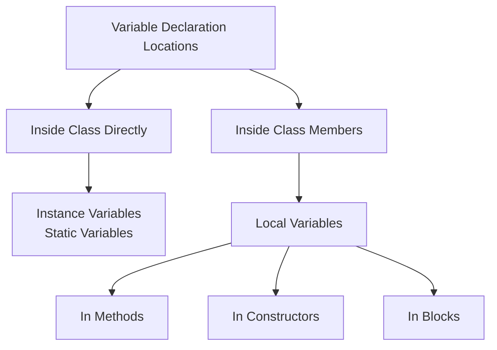


#### Examples: Local Variables in Blocks

::: code-group
```java [Lab274.java - Valid]
class Hello {
    int a = 10;
    static int b = 20;
    
    {
        System.out.println("I am I.B");
        int c = 30;  // Local variable
        System.out.println(a);  // 10
        System.out.println(b);  // 20
        System.out.println(c);  // 30
    }
}

class Lab274 {
    public static void main(String args[]) {
        Hello h = new Hello();
    }
}
```
```java [Lab275.java - Uninitialized]
class Hello {
    int a = 10;
    static int b = 20;
    
    {
        System.out.println("I am I.B");
        int c;  // Declared but not initialized
        System.out.println(a);  // ✅ OK
        System.out.println(b);  // ✅ OK
        System.out.println(c);  // ❌ ERROR: variable c might not have been initialized
    }
}

class Lab275 {
    public static void main(String args[]) {
        Hello h = new Hello();
    }
}
```
```java [Lab276.java - Final Local Variable]
class Hello {
    static int b = 20;
    
    static {
        System.out.println("I am S.B");
        final int c = 30;  // final is allowed
        System.out.println(b);  // 20
        System.out.println(c);  // 30
    }
}

class Lab276 {
    public static void main(String args[]) {
        Hello h = new Hello();
    }
}
```
```java [Lab277.java - Static Not Allowed]
class Hello {
    static int b = 20;
    
    static {
        System.out.println("I am S.B");
        static int c = 30;  // ❌ ERROR: Illegal modifier
        System.out.println(b);
        System.out.println(c);
    }
}

class Lab277 {
    public static void main(String args[]) {
        Hello h = new Hello();
    }
}
```

:::


#### Examples: Local Variables in Methods

::: code-group
```java [Lab278.java - Different Methods]
class Hello {
    void m1() {
        System.out.println("I am m1()");
        int a = 10;
        System.out.println(a);
    }
    
    void m2() {
        System.out.println("I am m2()");
        String a = "Hello Guys";  // Different 'a' - no conflict
        System.out.println(a);
    }
}

class Lab278 {
    public static void main(String args[]) {
        Hello h = new Hello();
        h.m1();  // Output: I am m1() \n 10
        h.m2();  // Output: I am m2() \n Hello Guys
    }
}
```
```java [Lab279.java - Scope Error]
class Hello {
    void m1() {
        System.out.println("I am m1()");
        int a = 10;
        System.out.println(a);
    }
    
    void m2() {
        System.out.println("I am m2()");
        System.out.println(a);  // ❌ ERROR: cannot find symbol 'a'
    }
}

class Lab279 {
    public static void main(String args[]) {
        Hello h = new Hello();
        h.m1();
        h.m2();
    }
}
```
```java [Lab280.java - Variable Shadowing]
class Hello {
    int a = 99;  // Instance variable
    
    void m1() {
        System.out.println("I am m1()");
        int a = 10;  // Local variable shadows instance variable
        System.out.println(a);  // 10 (local)
    }
    
    void m2() {
        System.out.println("I am m2()");
        System.out.println(a);  // 99 (instance)
    }
}

class Lab280 {
    public static void main(String args[]) {
        Hello h = new Hello();
        h.m1();  // Output: I am m1() \n 10
        h.m2();  // Output: I am m2() \n 99
    }
}
```
```java [Lab281.java - Cannot Access Outside]
class Hello {
    int a = 10;
    static int b = 20;
    
    void m1() {
        int c = 30;
    }
}

class Lab281 {
    public static void main(String args[]) {
        Hello h = new Hello();
        System.out.println(h.a);  // ✅ OK
        System.out.println(h.b);  // ✅ OK
        System.out.println(h.c);  // ❌ ERROR: cannot find symbol 'c'
    }
}
```

:::


### 3.3.2.4 Local Blocks

::: info Definition
Blocks defined inside class members (methods, blocks, or constructors) are called **Local Blocks**.
:::

**Characteristics:**
- Executed only when the enclosing member is executed
- Can be nested
- Create their own scope
- Not members of the class


#### Examples: Local Blocks

::: code-group
```java [Lab282.java - Not Executed]
class Hello {
    void m1() {
        int c = 30;
        {
            System.out.println("I am Local Block");
            System.out.println(c);
        }
    }
}

class Lab282 {
    public static void main(String args[]) {
        Hello h = new Hello();
        // No output - m1() not called
    }
}
```
```java [Lab283.java - Executed]
class Hello {
    void m1() {
        int c = 30;
        {
            System.out.println("I am Local Block");
            System.out.println(c);
        }
    }
}

class Lab283 {
    public static void main(String args[]) {
        Hello h = new Hello();
        h.m1();
        // Output:
        // I am Local Block
        // 30
    }
}
```
```java [Lab284.java - Multiple Local Blocks]
class Hello {
    void m1() {
        int a = 10;
        
        {
            System.out.println("I am LB-1");
            int b = 20;
            System.out.println(a);  // ✅ OK
            System.out.println(b);  // ✅ OK
            // System.out.println(c);  // ❌ ERROR: 'c' not in scope
        }
        
        {
            System.out.println("I am LB-2");
            int c = 30;
            System.out.println(a);  // ✅ OK
            // System.out.println(b);  // ❌ ERROR: 'b' not in scope
            System.out.println(c);  // ✅ OK
        }
    }
}

class Lab284 {
    public static void main(String args[]) {
        Hello h = new Hello();
        h.m1();
    }
}
```

:::


#### Variable Scope in Blocks

::: code-group
```java [Lab285.java - Name Conflict]
class Lab285 {
    public static void main(String args[]) {
        System.out.println("Main Begin");
        int a = 10;
        {
            int a = 20;  // ❌ ERROR: variable 'a' is already defined
            System.out.println(a);
        }
        System.out.println("Main End");
    }
}
```
```java [Lab286.java - Valid Order]
class Lab286 {
    public static void main(String args[]) {
        System.out.println("Main Begin");
        {
            int a = 20;
            System.out.println(a);  // 20
        }
        int a = 10;  // ✅ OK - different scope
        System.out.println("Main End");
    }
}
```

:::


### Variable Scope Visualization
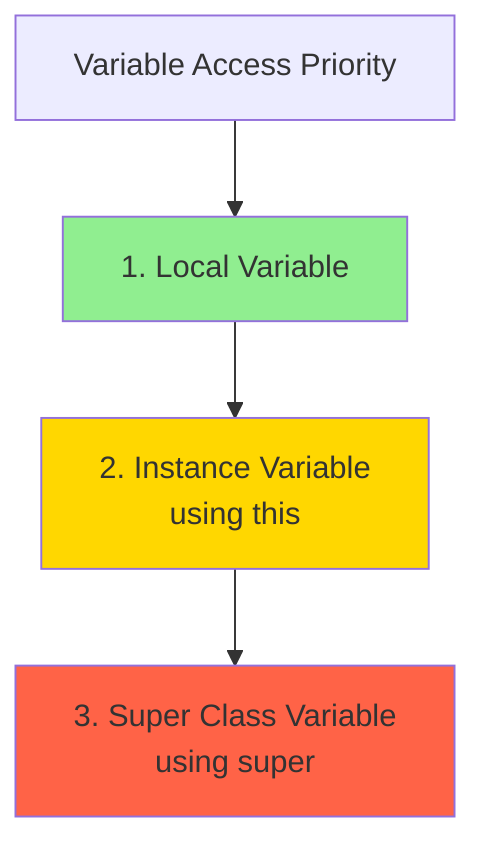


## Summary

::: tip Key Points

**Instance Variables:**
- Multiple copies for multiple objects
- Related to object/instance
- Must be accessed with object reference
- Cannot access with `null` reference (NullPointerException)
- Cannot access with class name

**Static Variables:**
- Single copy shared by all objects
- Related to class
- Can access with class name, null reference, or object reference
- Compiler changes object/null reference access to class name access

**Initialization Blocks:**
- Cannot place arbitrary statements directly in class
- IIB invoked after object initialization
- SIB invoked after class initialization
- Instance block executed every time object is created
- Static block executed only once when class is loaded

**Local Variables:**
- JVM doesn't initialize - must initialize before use
- Scope limited to the declaring block/method
- Not class members - cannot access with class name or object
- Cannot be `static` - only `final` allowed
- Memory allocated in **STACK MEMORY**

:::


## Assignment #8

::: details Practice Questions

**Q1)** How many types of variables can be declared inside the class directly?

**Q2)** What is an Instance Variable?

**Q3)** What is a non-static variable?

**Q4)** When memory will be allocated for Instance variables?

**Q5)** How many times memory will be allocated for Instance variables?

**Q6)** What are ways available to access Instance Variables?

**Q7)** What is Static Variable?

**Q8)** What is a Class variable?

**Q9)** When memory will be allocated for Static variables?

**Q10)** How many times memory will be allocated for Static variables?

**Q11)** What are ways available to access Static Variables?

**Q12)** What is Block?

**Q13)** How many types of blocks can be written inside the class directly?

**Q14)** What is Initialization Block?

**Q15)** How many types of initialization blocks can be written inside the class directly?

**Q16)** What is Instance Initialization Block?

**Q17)** When Instance Initialization Block will be executed?

**Q18)** How many times Instance Block will be executed?

**Q19)** Can I write multiple Instance Blocks inside the Class?

**Q20)** What is Static Initialization Block?

**Q21)** When Static Initialization Block will be executed?

**Q22)** How many times Static Initialization Block will be executed?

**Q23)** Can I write multiple Static Blocks inside the Class?

**Q24)** Can I access Instance Variables from IIB?

**Q25)** Can I access Static Variables from IIB?

**Q26)** Can I access Instance Variables from SIB?

**Q27)** Can I access Static Variables from SIB?

**Q28)** Why Instance Variables are not allowed to access from Static Block?

**Q29)** What is Local Variables?

**Q30)** Is Local Variable a member of Class?

**Q31)** Can I access Local Variables with object reference?

**Q32)** Can I access Local Variables with Class Name?

**Q33)** Can I access Local Variables with null reference?

**Q34)** Can I access Local Variable of Instance Block from Static Block?

**Q35)** What is the scope of Local Variables?

**Q36)** What are the modifiers allowed for Local Variables?

**Q37)** What is Local Block?

**Q38)** When will the Local Block get executed?

**Q39)** Can I write multiple Local Blocks inside the Members of Class?

**Q40)** Is Local Block a member of Class?

:::