# Java.lang Package

::: info Module 4
This comprehensive guide covers the java.lang package - the foundation of Java programming.
Author: Srinivas Dande | Source: myjavalearningcenter.com
:::

## Overview

The `java.lang` package contains classes and interfaces that are fundamental to Java programming. This package is **automatically imported** in all Java programs - you can access its classes without explicit import statements.

## 4.1 Packages in Java

Packages are used to group classes, interfaces, enums, and annotations with similar functionalities.

### Types of Packages

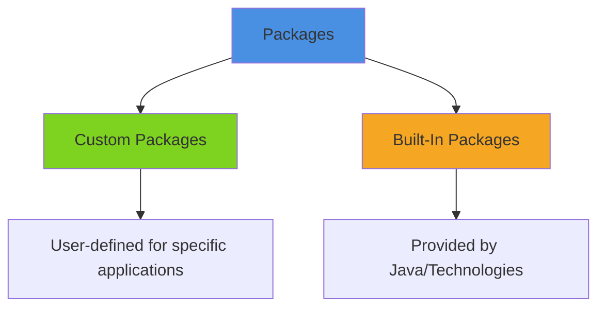

#### Custom Packages
- Developed by developers based on application/project requirements
- Also called **User Defined packages**

#### Built-In Packages
- Pre-developed and provided with Java
- Ready to import and use

**Commonly Used Built-In Packages:**

| Package | Description |
|---------|-------------|
| `java.lang` | Core Java language functionality |
| `java.lang.reflect` | Reflection API |
| `java.util` | Utility classes and collections |
| `java.io` | Input/Output operations |
| `java.sql` | Database connectivity |
| `java.math` | Mathematical operations |
| `java.awt` | GUI components |
| `java.nio` | New I/O (Java 7+) |
| `javax.sql` | Advanced database features |

::: tip Java API
An **API (Application Programming Interface)** is a collection of predefined packages, classes, and interfaces with their methods, fields, and constructors.
- Core packages start with `java.*`
- Advanced packages start with `javax.*`
:::

## 4.2 java.lang Package

The `java.lang` package is **automatically imported** in all Java programs, providing essential functionality for the Java language.

### Commonly Used Classes

| Category | Classes |
|----------|---------|
| **Core** | Object, String, StringBuffer, StringBuilder |
| **Primitives** | Boolean, Character, Byte, Short, Integer, Long, Float, Double |
| **System** | System, Runtime, Math, Process |
| **Special** | Void, Class, ClassLoader |
| **Exceptions** | Throwable, Exception, Error |
| **Threading** | Thread, ThreadGroup, Runnable |

### Commonly Used Interfaces

- `Cloneable` - Marking interface for cloning
- `Comparable` - For object comparison
- `CharSequence` - Character sequence abstraction
- `AutoCloseable` - Auto-closing resources (Java 7+)
- `Runnable` - For threading

## 4.2.1 Object Class

::: warning Foundation Class
`Object` is the **root** of the Java class hierarchy. Every class has `Object` as a superclass.
:::

### Key Characteristics

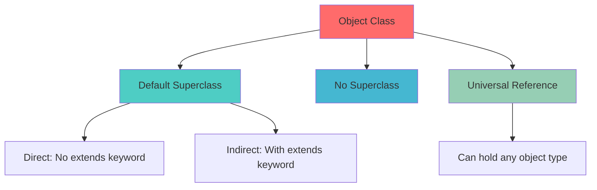

### Members of Object Class

```java
public class Object {
    // Constructor
    public Object();
    
    // Class information
    public final native Class getClass();
    
    // Object identity & comparison
    public native int hashCode();
    public boolean equals(Object obj);
    public String toString();
    
    // Object cloning
    protected native Object clone() throws CloneNotSupportedException;
    
    // Finalization
    protected void finalize() throws Throwable;
    
    // Threading synchronization
    public final native void notify();
    public final native void notifyAll();
    public final void wait() throws InterruptedException;
    public final native void wait(long timeout) throws InterruptedException;
    public final void wait(long timeout, int nanos) throws InterruptedException;
}
```

::: danger Common Mistake
```java
class Hello {
    Hello(int a) {
        super(a); // ❌ Compilation Error - Object class has no such constructor
    }
}
```
:::

## 4.2.2 Exploring Methods of Object Class

### 1. getClass() Method

```java
public final native Class getClass()
```

When JVM loads a class, it creates a **default object** of type `java.lang.Class` containing complete class information.

**Example:**

```java
class Hello {
    void show() {
        System.out.println("Hello - show");
    }
}

class Lab512 {
    public static void main(String[] args) {
        Hello h = new Hello();
        h.show();
        
        Class myclass = h.getClass();
        System.out.println(myclass.getName());           // Hello
        System.out.println(myclass.getSuperclass());     // class java.lang.Object
        System.out.println(myclass.getPackage());        // null (default package)
    }
}
```

**With Package:**

```java
package com.myjlc;

class Hai { }

class Hello extends Hai {
    void show() {
        System.out.println("Hello - show");
    }
}

class Lab513 {
    public static void main(String[] args) {
        Hello h = new Hello();
        Class myclass = h.getClass();
        
        System.out.println(myclass.getName());           // com.myjlc.Hello
        System.out.println(myclass.getSuperclass());     // class com.myjlc.Hai
        System.out.println(myclass.getPackage());        // package com.myjlc
    }
}
```

### 2. hashCode() Method

```java
public native int hashCode()
```

::: info Hash Code
A **hash code** is an integer value assigned by JVM to each object. Used internally for collection management.
:::

**Characteristics:**
- JVM assigns unique integer value to objects
- Used by collections (HashMap, HashSet, etc.)
- Can be overridden for custom implementation
- Many built-in classes override it to use object content

**Default Implementation:**

```java
class Hello {
    int a;
    
    Hello(int a) {
        this.a = a;
    }
}

class Lab514 {
    public static void main(String[] args) {
        Hello hello1 = new Hello(100);
        Hello hello2 = new Hello(200);
        
        int hash1 = hello1.hashCode();  // e.g., 366712642
        int hash2 = hello2.hashCode();  // e.g., 1829164700
        
        System.out.println(hash1);
        System.out.println(hash2);
    }
}
```

**Custom Implementation:**

```java
class Hello {
    int a;
    
    Hello(int a) {
        this.a = a;
    }
    
    @Override
    public int hashCode() {
        return a * 25;  // Custom hash based on content
    }
}

class Lab515 {
    public static void main(String[] args) {
        Hello hello1 = new Hello(100);
        Hello hello2 = new Hello(200);
        
        System.out.println(hello1.hashCode());  // 2500
        System.out.println(hello2.hashCode());  // 5000
    }
}
```

### 3. toString() Method

```java
public String toString()
```

**Automatic Invocation:**

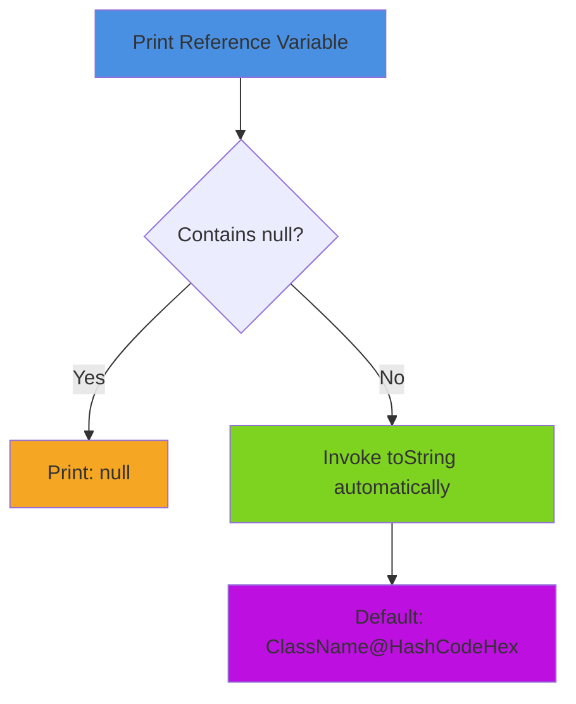

**Default Behavior:**

```java
class Hello {
    int a, b;
    
    Hello(int a, int b) {
        this.a = a;
        this.b = b;
    }
}

class Lab516 {
    public static void main(String[] args) {
        Hello h1 = null;
        System.out.println(h1);  // null
        
        Hello h2 = new Hello(10, 20);
        System.out.println(h2);              // Hello@1e (hexadecimal hash)
        System.out.println(h2.toString());   // Hello@1e
        System.out.println(h2.hashCode());   // 30 (decimal)
    }
}
```

::: tip Default Format
Default `toString()` returns: `<FullyQualifiedClassName>@<HexadecimalOfHashCode>`
:::

**Custom Implementation:**

```java
class Hello {
    int a, b;
    
    Hello(int a, int b) {
        this.a = a;
        this.b = b;
    }
    
    @Override
    public String toString() {
        return "[a = " + a + ", b = " + b + "]";
    }
}

class Lab518 {
    public static void main(String[] args) {
        Hello h = new Hello(10, 20);
        System.out.println(h);  // [a = 10, b = 20]
    }
}
```

**Real-World Example:**

```java
class Customer {
    int cid;
    String cname;
    String email;
    long phone;
    
    Customer() {}
    
    Customer(int cid, String cname, String email, long phone) {
        this.cid = cid;
        this.cname = cname;
        this.email = email;
        this.phone = phone;
    }
    
    @Override
    public String toString() {
        return "[" + cid + ", " + cname + ", " + email + ", " + phone + "]";
    }
}

class Lab519 {
    public static void main(String[] args) {
        Customer cust1 = new Customer();
        System.out.println(cust1);  // [0, null, null, 0]
        
        Customer cust2 = new Customer(101, "Srinivas", "sri@mjlc.com", 12345);
        System.out.println(cust2);  // [101, Srinivas, sri@mjlc.com, 12345]
    }
}
```

### 4. equals() Method

```java
public boolean equals(Object obj)
```

::: warning == vs equals()
- `==` operator compares **references** (addresses)
- `equals()` method can compare **content** (if overridden)
:::

**Comparison Chart:**

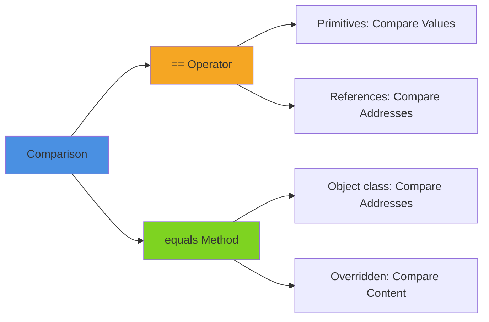

**Default Implementation:**

```java
// Object class implementation
public boolean equals(Object obj) {
    return this == obj;  // Compares addresses only
}
```

**Examples:**

```java
class Hello {
    int a, b;
    
    Hello(int a, int b) {
        this.a = a;
        this.b = b;
    }
}

class Lab520 {
    public static void main(String[] args) {
        Hello h1 = new Hello(10, 20);
        Hello h2 = new Hello(10, 20);
        Hello h3 = new Hello(50, 60);
        Hello h4 = h3;
        
        System.out.println(h1 == h2);   // false (different objects)
        System.out.println(h1 == h3);   // false
        System.out.println(h3 == h4);   // true (same reference)
    }
}
```

**Using equals() - Default:**

```java
class Lab521 {
    public static void main(String[] args) {
        Hello h1 = new Hello(10, 20);
        Hello h2 = new Hello(10, 20);
        Hello h3 = new Hello(50, 60);
        Hello h4 = h3;
        
        System.out.println(h1.equals(h2));  // false (same as ==)
        System.out.println(h1.equals(h3));  // false
        System.out.println(h3.equals(h4));  // true
    }
}
```

**Custom Implementation - Content Comparison:**

```java
class Hello {
    int a, b;
    
    Hello(int a, int b) {
        this.a = a;
        this.b = b;
    }
    
    @Override
    public boolean equals(Object obj) {
        if (obj instanceof Hello) {
            Hello h = (Hello) obj;
            return this.a == h.a && this.b == h.b;
        }
        return false;
    }
}

class Lab523 {
    public static void main(String[] args) {
        Hello h1 = new Hello(10, 20);
        Hello h2 = new Hello(10, 20);
        Hello h3 = new Hello(50, 60);
        Hello h4 = h3;
        
        System.out.println(h1.equals(h2));  // true (content match)
        System.out.println(h1.equals(h3));  // false
        System.out.println(h2.equals(h3));  // false
        System.out.println(h3.equals(h4));  // true
    }
}
```

**Real-World Customer Example:**

```java
class Customer {
    int cid;
    String cname;
    String email;
    long phone;
    
    Customer() {}
    
    Customer(int cid, String cname, String email, long phone) {
        this.cid = cid;
        this.cname = cname;
        this.email = email;
        this.phone = phone;
    }
    
    @Override
    public boolean equals(Object obj) {
        if (obj instanceof Customer) {
            Customer cust = (Customer) obj;
            return this.cid == cust.cid &&
                   this.cname.equals(cust.cname) &&
                   this.email.equals(cust.email) &&
                   this.phone == cust.phone;
        }
        return false;
    }
}

class Lab524 {
    public static void main(String[] args) {
        Customer cust1 = new Customer(101, "Srinivas", "sri@mjlc.com", 12345);
        Customer cust2 = new Customer(101, "Srinivas", "sri@mjlc.com", 12345);
        Customer cust3 = new Customer(102, "Srinivas", "vas@mjlc.com", 67890);
        
        System.out.println(cust1.equals(cust2));  // true
        System.out.println(cust1.equals(cust3));  // false
    }
}
```

## 4.2.3 Memory Management

When JVM starts, it requests memory from the OS. If allocated, JVM starts; otherwise, an error is displayed.

### Memory Configuration Commands

```bash
# Check memory
java Lab525

# Set initial memory to 512MB
java -Xms512m Lab525

# Set initial memory to 1024MB
java -Xms1024m Lab525

# Set maximum memory to 2048MB
java -Xmx2048m Lab525

# Set both initial and max memory
java -Xmx5120m -Xms1024m Lab525
```

::: tip Memory Flags
- `-Xms` → Initial Memory (minimum heap size)
- `-Xmx` → Maximum Memory (maximum heap size)
:::

**Check Memory Example:**

```java
class Lab525 {
    public static void main(String[] args) {
        Runtime rt = Runtime.getRuntime();
        
        System.out.println("Max Memory: " + rt.maxMemory());
        System.out.println("Total Memory: " + rt.totalMemory());
        System.out.println("Free Memory: " + rt.freeMemory());
    }
}
```

### JVM Runtime Data Areas

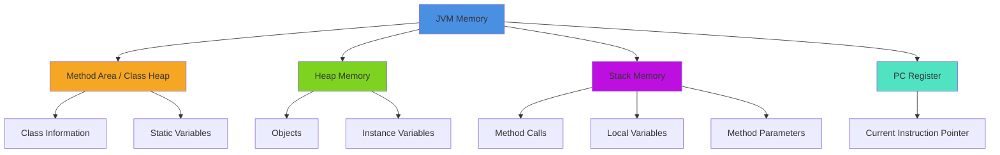

### Memory Areas Explained

#### 1. Method Area / Class Heap

**Characteristics:**
- Stores class information when loaded
- Stores static variables
- **Shared by all threads**
- One per JVM instance
- Not deallocated during execution

```java
class MyClass {
    static int count = 0;  // Stored in Method Area
    
    void display() {
        // Method bytecode stored in Method Area
    }
}
```

#### 2. Heap Memory

**Characteristics:**
- Stores all **objects**
- **Shared by all threads**
- One per JVM instance
- Garbage collected when objects are unused

::: danger OutOfMemoryError
Thrown when creating an object and required memory is not available in heap.
:::

**Object States:**
- **LIVE/USED**: Object has references
- **DEAD/UNUSED**: Object has no references (garbage)

#### 3. Stack Memory

**Characteristics:**
- Tracks **method invocations** (Stack Frames)
- Each thread has its own stack
- Stores local variables and method arguments
- Automatic deallocation after method completion

::: danger StackOverflowError
Thrown when invoking method/constructor and required memory is not available in stack.
:::

**Stack Frame Structure:**

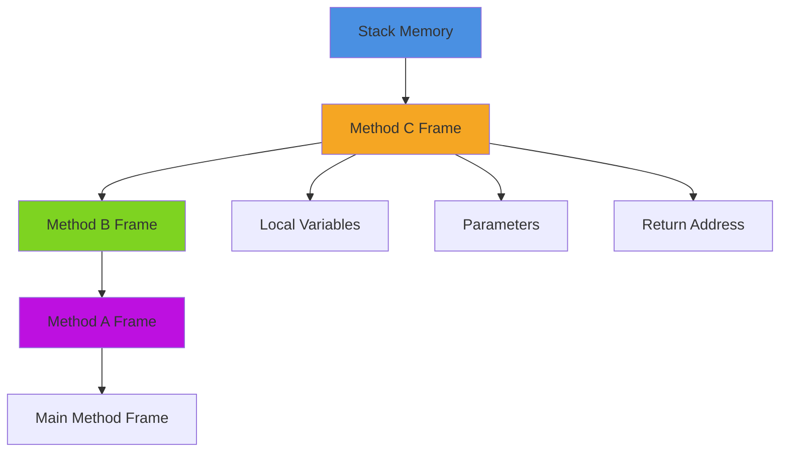

#### 4. Program Counter (PC) Register

- Each thread has its own PC register
- Keeps track of current instruction being executed
- Updated after each instruction execution

## 4.2.4 Garbage Collection & finalize() Method

::: info Memory Management Comparison

| Language | Allocation | Deallocation |
|----------|------------|--------------|
| **C** | `malloc()` / `calloc()` | `free()` |
| **C++** | `new` operator | `delete` operator |
| **Java** | `new` operator | ❌ No explicit deallocation |

:::

### Garbage Collection Process

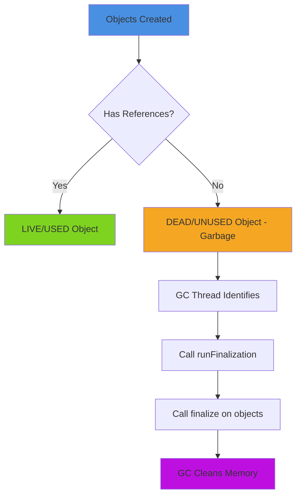

**Garbage Collection** is an automatic memory cleaning process that reduces developer burden.

### Cases When Objects Become Eligible for GC

#### Case 1: Anonymous Object Creation

```java
new Hello().m1();  // Object eligible for GC after m1() completes
```

#### Case 2: Assigning null

```java
Hello h = new Hello();
h = null;  // Original object now eligible for GC
```

#### Case 3: Reference Reassignment

```java
Hello h1 = new Hello();
Hello h2 = new Hello();
h1 = h2;  // Object originally referenced by h1 is now eligible for GC
```

#### Case 4: Out of Scope

```java
void m1() {
    Hai hai1 = new Hai();
    Hai hai2 = new Hai();
}  // Both objects eligible for GC when method exits
```

### The finalize() Method

```java
protected void finalize() throws Throwable
```

**Purpose:** Release resources before garbage collection

::: warning Resource Cleanup
Use `finalize()` to release:
- JDBC connections
- I/O connections
- Network connections
- File handles
:::

**Complete GC Process:**

1. List unused objects
2. Call `runFinalization()`
3. Call `finalize()` on each object
4. GC cleans memory

**Invoking GC:**

```java
// Option 1: System class
System.runFinalization();
System.gc();

// Option 2: Runtime class
Runtime rt = Runtime.getRuntime();
rt.runFinalization();
rt.gc();
```

**Example:**

```java
class Hai {
    int a = 99;
    
    @Override
    public void finalize() {
        System.out.println("Hai-finalize()");
    }
}

class Hello {
    Hai hai = new Hai();
    int x = 10;
    
    void m1() {
        System.out.println("Hello-m1()");
        Hai hai1 = new Hai();  // Local objects
        Hai hai2 = new Hai();
        Hai hai3 = new Hai();
    }
    
    void show() {
        System.out.println("Hello-show()");
    }
    
    @Override
    public void finalize() {
        System.out.println("Hello-finalize()");
        this.hai = null;  // Resource cleanup
    }
}

class Lab526 {
    public static void main(String[] args) {
        new Hello().show();     // Anonymous object - eligible for GC
        
        Hello h = new Hello();
        h = null;               // Eligible for GC
        
        Hello h1 = new Hello();
        Hello h2 = new Hello();
        h1 = h2;                // Original h1 object eligible for GC
        
        new Hello().m1();       // Method local objects eligible for GC
        
        System.runFinalization();
        System.gc();
    }
}
```

::: tip Important Notes
- GC is a **thread**, so you can only **request** it, not force immediate execution
- No guarantee that memory will be deallocated immediately
- Object class `finalize()` has no implementation (empty method)
- Override `finalize()` in your class for custom resource cleanup
:::

::: danger OutOfMemoryError
If no memory available and no unused objects found, JVM throws `java.lang.OutOfMemoryError`
:::

## Summary - Object Class

### Key Points

1. **javap Command:**
```bash
javap java.lang.Object  # View class structure
```

2. **equals() Implementations:**

```java
// A) Compare by ID
public boolean equals(Object obj) {
    if (obj instanceof Student) {
        Student st = (Student) obj;
        return this.sid == st.sid;
    }
    return false;
}

// B) Compare by name (content)
public boolean equals(Object obj) {
    if (obj instanceof Student) {
        Student st = (Student) obj;
        return this.sname.equals(st.sname);
    }
    return false;
}

// C) Compare by name (reference)
public boolean equals(Object obj) {
    if (obj instanceof Student) {
        Student st = (Student) obj;
        return this.sname == st.sname;
    }
    return false;
}

// D) Compare both ID and name
public boolean equals(Object obj) {
    if (obj instanceof Student) {
        Student st = (Student) obj;
        return this.sid == st.sid && this.sname.equals(st.sname);
    }
    return false;
}
```

::: tip Best Practice
Always override `equals()` when you need content comparison, and follow the contract:
- Reflexive: `x.equals(x)` should return `true`
- Symmetric: If `x.equals(y)` returns `true`, then `y.equals(x)` should return `true`
- Transitive: If `x.equals(y)` and `y.equals(z)` return `true`, then `x.equals(z)` should return `true`
- Consistent: Multiple invocations should return the same result
- Null comparison: `x.equals(null)` should return `false`
:::

::: tip Next Section
Continue to [Part 2: String Class →](#425-string-class) to learn about String manipulation in Java.
:::

# String Classes in Java

::: info Part 2
Complete guide to String, StringBuffer, and StringBuilder classes in Java
:::

## 4.2.5 String Class

The `String` class is a fundamental built-in class in the `java.lang` package for handling text.

### String Class Characteristics

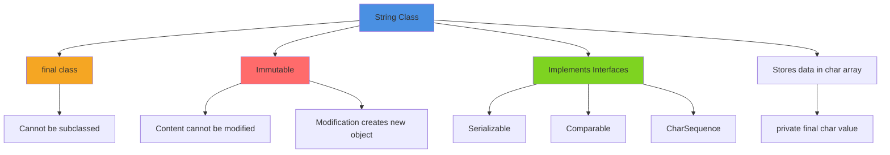

**Class Definition:**

```java
public final class String implements Serializable, Comparable, CharSequence {
    private final char value[];  // Stores string data
    // ...
}
```

::: warning Immutability
String objects are **immutable** - once created, their content cannot be changed. Any modification creates a new String object.
:::

### Creating String Objects

There are two ways to create String objects:

#### Method 1: Without new Operator (String Literal)

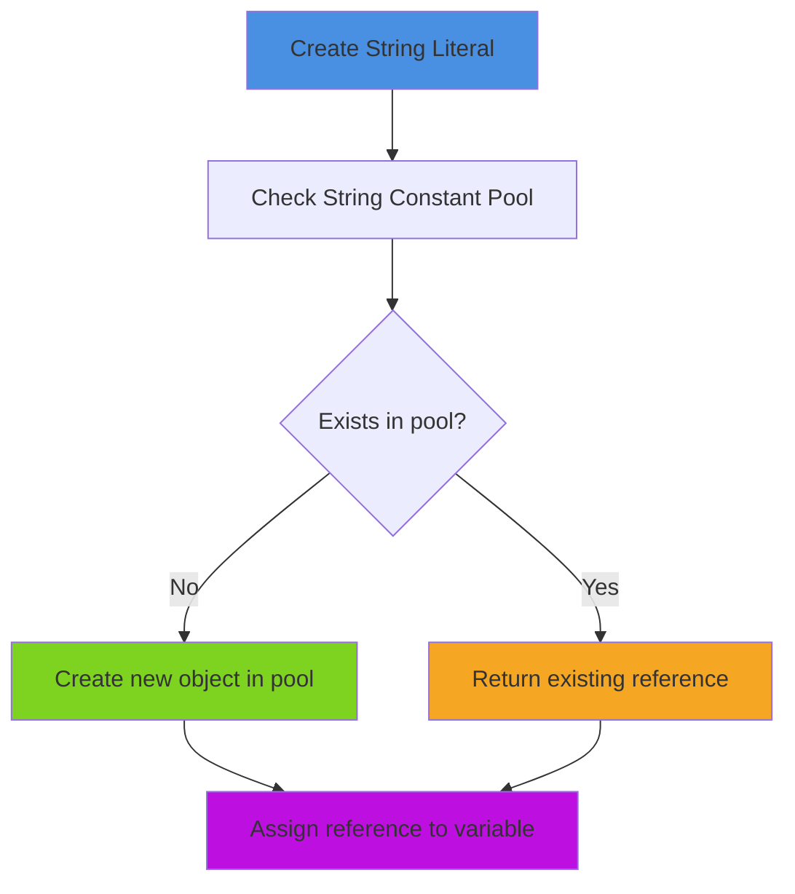

**Process:**
1. Allocate memory for reference variable
2. Check String Constant Pool for the literal
3. If not found: Create new String in pool and assign address
4. If found: Assign existing object's address

```java
class Lab527 {
    public static void main(String[] args) {
        String str1 = "JLC";
        String str2 = "JLC";
        String str3 = "JLC";
        
        System.out.println(str1 == str2);  // true (same object)
        System.out.println(str1 == str3);  // true (same object)
        System.out.println(str2 == str3);  // true (same object)
    }
}
```

**Memory Diagram:**

```
String Constant Pool:
┌─────────────┐
│  J  L  C    │ ← Address: 34157
└─────────────┘
      ↑
      ├─── str1
      ├─── str2
      └─── str3
```

#### Method 2: With new Operator

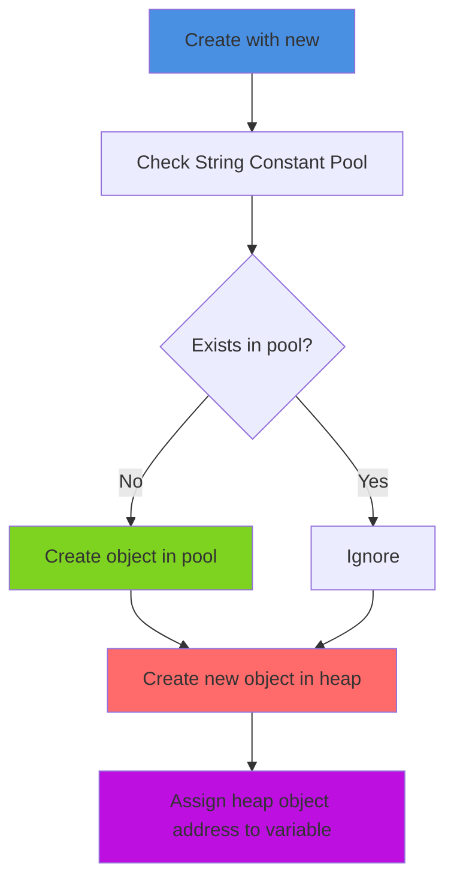

**Process:**
1. Check String Constant Pool
2. Create object in pool if not exists
3. Create **new object outside pool** (heap)
4. Assign heap object address to reference

```java
class Lab528 {
    public static void main(String[] args) {
        String str1 = "JLC";
        String str2 = new String("JLC");
        String str3 = new String("JLC");
        
        System.out.println(str1 == str2);  // false (different objects)
        System.out.println(str1 == str3);  // false (different objects)
        System.out.println(str2 == str3);  // false (different objects)
    }
}
```

**Memory Diagram:**

```
String Constant Pool:        Heap:
┌─────────────┐             ┌─────────────┐
│  J  L  C    │ 34157       │  J  L  C    │ 78459 ← str2
└─────────────┘             └─────────────┘
      ↑                     ┌─────────────┐
      str1                  │  J  L  C    │ 85857 ← str3
                            └─────────────┘
```

## 4.2.6 String Class API

### Important Constructors

| Constructor | Description |
|-------------|-------------|
| `String()` | Creates empty string |
| `String(String str)` | Creates string with specified content |
| `String(char[] arr)` | Creates string from character array |
| `String(char[] arr, int offset, int length)` | Creates string from part of char array |
| `String(byte[] bytes)` | Creates string from byte array (ASCII) |
| `String(byte[] bytes, int offset, int length)` | Creates string from part of byte array |
| `String(StringBuffer sb)` | Creates string from StringBuffer |
| `String(StringBuilder sb)` | Creates string from StringBuilder |

### Important Methods

#### Basic Information Methods

| Method | Description | Return Type |
|--------|-------------|-------------|
| `int length()` | Returns string length | `int` |
| `boolean isEmpty()` | Returns true if length is 0 | `boolean` |
| `native String intern()` | Returns reference from constant pool | `String` |

#### String Manipulation Methods

| Method | Description |
|--------|-------------|
| `String concat(String)` | Concatenates strings |
| `String toLowerCase()` | Converts to lowercase |
| `String toUpperCase()` | Converts to uppercase |
| `String trim()` | Removes leading/trailing whitespace |
| `String toString()` | Returns string content |

#### Character Access Methods

| Method | Description |
|--------|-------------|
| `char charAt(int index)` | Returns character at index |
| `char[] toCharArray()` | Converts to character array |
| `void getChars(int srcBegin, int srcEnd, char[] dst, int dstBegin)` | Copies characters to array |
| `byte[] getBytes()` | Converts to byte array (ASCII) |

#### Comparison Methods

| Method | Description |
|--------|-------------|
| `boolean equals(Object)` | Compares content (case-sensitive) |
| `boolean equalsIgnoreCase(String)` | Compares content (case-insensitive) |
| `boolean contentEquals(StringBuffer)` | Compares with StringBuffer content |
| `int compareTo(String)` | Lexicographical comparison (case-sensitive) |
| `int compareToIgnoreCase(String)` | Lexicographical comparison (case-insensitive) |

#### Search Methods

| Method | Description |
|--------|-------------|
| `boolean startsWith(String prefix)` | Checks if starts with prefix |
| `boolean startsWith(String prefix, int offset)` | Checks if starts with prefix from offset |
| `boolean endsWith(String suffix)` | Checks if ends with suffix |
| `int indexOf(int ch)` | Returns first occurrence index of character |
| `int indexOf(int ch, int fromIndex)` | Returns first occurrence from index |
| `int indexOf(String st)` | Returns first occurrence index of string |
| `int indexOf(String st, int fromIndex)` | Returns first occurrence from index |
| `int lastIndexOf(int ch)` | Returns last occurrence index |
| `int lastIndexOf(String st)` | Returns last occurrence index |

#### Substring Methods

| Method | Description |
|--------|-------------|
| `String substring(int beginIndex)` | Returns substring from index to end |
| `String substring(int beginIndex, int endIndex)` | Returns substring from beginIndex to endIndex-1 |

#### Replace Methods

| Method | Description |
|--------|-------------|
| `String replace(char oldChar, char newChar)` | Replaces all occurrences |
| `String replaceFirst(String regex, String replacement)` | Replaces first match |
| `String replaceAll(String regex, String replacement)` | Replaces all matches |

#### Pattern Matching Methods

| Method | Description |
|--------|-------------|
| `boolean matches(String regex)` | Checks if matches regex |
| `String[] split(String regex)` | Splits string by regex |
| `String[] split(String regex, int limit)` | Splits with limit |

#### Utility Methods

| Method | Description |
|--------|-------------|
| `static String format(String format, Object... args)` | Returns formatted string |
| `static String valueOf(X value)` | Converts any type to string |
| `int hashCode()` | Returns hash code based on content |

## String Methods Examples

### intern() Method

```java
class Lab529 {
    public static void main(String[] args) {
        String str1 = "JLC";
        String str2 = new String("JLC");
        String str3 = str2.intern();  // Get reference from pool
        
        System.out.println(str1 == str2);  // false
        System.out.println(str1 == str3);  // true (both point to pool)
        System.out.println(str2 == str3);  // false
        
        String str4 = "OK".intern();
        String str5 = "OK";
        System.out.println(str4 == str5);  // true
    }
}
```

### String Concatenation Behavior

```java
// Case 1: new String objects
String str1 = new String("Hello");
String str2 = new String(" Guys");
String str3 = str1 + str2;
String str4 = "Hello Guys";
System.out.println(str3 == str4);  // false

// Case 2: String literals in variables
String str1 = "Hello";
String str2 = " Guys";
String str3 = str1 + str2;
String str4 = "Hello Guys";
System.out.println(str3 == str4);  // false

// Case 3: Literal + variable
String str1 = "Hello";
String str3 = str1 + " Guys";
String str4 = "Hello Guys";
System.out.println(str3 == str4);  // false

// Case 4: Pure literals (compile-time constant)
String str3 = "Hello" + " Guys";
String str4 = "Hello Guys";
System.out.println(str3 == str4);  // true

// Case 5: concat() method
String str3 = "Hello".concat(" Guys");
String str4 = "Hello Guys";
System.out.println(str3 == str4);  // false
```

::: tip Concatenation Rule
Only pure string literals (compile-time constants) create references to the same pool object.
:::

### equals() and equalsIgnoreCase()

```java
String str1 = new String("JLC");
String str2 = new String("JLC");
String str3 = new String("MyJLC");

System.out.println(str1.equals(str2));  // true
System.out.println(str2.equals(str3));  // false

String str4 = new String("jlc");
System.out.println(str1.equals(str4));              // false (case matters)
System.out.println(str1.equalsIgnoreCase(str4));    // true (ignores case)
```

### compareTo() Method

```java
String str1 = "JLC";

System.out.println(str1.compareTo("JLC"));  // 0 (equal)
System.out.println(str1.compareTo("JLH"));  // -5 (C < H by 5)
System.out.println(str1.compareTo("JLA"));  // 2 (C > A by 2)
System.out.println(str1.compareTo("jlc"));  // -32 (uppercase < lowercase)

// Comparing different strings
System.out.println("A".compareTo("B"));  // -1 (A < B)
System.out.println("B".compareTo("A"));  // 1 (B > A)
System.out.println("A".compareTo("A"));  // 0 (equal)
```

::: info compareTo() Return Values
- `0`: Strings are equal
- **Positive**: Current string is greater
- **Negative**: Current string is smaller
:::

### length() and isEmpty()

```java
String str1 = "Srinivas";
String str2 = "";

System.out.println(str1.length());   // 8
System.out.println(str2.length());   // 0
System.out.println(str1.isEmpty());  // false
System.out.println(str2.isEmpty());  // true
```

### Case Conversion

```java
String str1 = "SriNiVas";

System.out.println(str1);                  // SriNiVas
System.out.println(str1.toUpperCase());    // SRINIVAS
System.out.println(str1.toLowerCase());    // srinivas
System.out.println(str1);                  // SriNiVas (original unchanged)
```

### valueOf() Method

```java
// Converting primitives to String
String str1 = String.valueOf(99);      // "99"
String str2 = String.valueOf(99.99);   // "99.99"
String str3 = String.valueOf(true);    // "true"
String str4 = String.valueOf(999L);    // "999"
String str5 = String.valueOf('A');     // "A"

// Converting arrays
char[] chArr = {'S','R','I','N','I','V','A','S',' ','D'};
String str6 = String.valueOf(chArr);         // "SRINIVAS D"
String str7 = String.valueOf(chArr, 3, 5);   // "NIVAS" (offset 3, length 5)

// Converting objects
class Customer {
    public String toString() {
        return "I am Customer";
    }
}

Customer cust = new Customer();
String str8 = String.valueOf(cust);    // "I am Customer"
String str9 = String.valueOf(null);    // "null"
```

### startsWith() and endsWith()

```java
String str = "Hello Guys";

System.out.println(str.startsWith("Hello"));     // true
System.out.println(str.startsWith("Hai"));       // false
System.out.println(str.startsWith("Guys"));      // false
System.out.println(str.startsWith("Guys", 6));   // true (from index 6)

System.out.println(str.endsWith("Guys"));        // true
System.out.println(str.endsWith("ys"));          // true
System.out.println(str.endsWith("Hello"));       // false

// Empty string checks
System.out.println(str.startsWith(""));          // true
System.out.println(str.endsWith(""));            // true
```

### charAt() Method

```java
String str = "Hello Guys";

System.out.println(str.charAt(0));   // H
System.out.println(str.charAt(4));   // o
System.out.println(str.charAt(6));   // G
// System.out.println(str.charAt(10)); // StringIndexOutOfBoundsException
```

### indexOf() and lastIndexOf()

```java
String str = "Hello Guys";

// indexOf - searches forward
System.out.println(str.indexOf('H'));       // 0
System.out.println(str.indexOf('O'));       // -1 (not found)
System.out.println(str.indexOf('o'));       // 4
System.out.println(str.indexOf('G'));       // 6
System.out.println(str.indexOf("Guys"));    // 6
System.out.println(str.indexOf("He"));      // 0

// With from index
System.out.println(str.indexOf("Guys", 7)); // -1

// lastIndexOf - searches backward
String str2 = "srinivas";
System.out.println(str2.indexOf('i'));      // 2 (first occurrence)
System.out.println(str2.lastIndexOf('i'));  // 6 (last occurrence)
System.out.println(str2.indexOf('s'));      // 0
System.out.println(str2.lastIndexOf('s'));  // 7
```

### substring() Method

```java
String str = "Hello Guys How are you";

System.out.println(str.substring(11));       // "How are you"
System.out.println(str.substring(6, 10));    // "Guys" (6 to 9)
System.out.println(str.substring(0, 5));     // "Hello"
System.out.println(str.substring(19));       // "you"
System.out.println(str.substring(19, 22));   // "you"
```

### trim() Method

```java
String str = "   Hello Guys   ";

System.out.println(str);              // "   Hello Guys   "
System.out.println(str.length());     // 16

String str1 = str.trim();
System.out.println(str1);             // "Hello Guys"
System.out.println(str1.length());    // 10
```

### replace() Methods

```java
String str = "Srinivas";

// replace() - all occurrences
String str1 = str.replace('i', 'I');           // "SrInIvas"
String str2 = str.replace("ni", " Hello ");    // "Sri Hello vas"

// replaceFirst() and replaceAll()
str = "srinivas";
String str3 = str.replaceFirst("i", "I");      // "srInivas" (first only)
String str4 = str.replaceAll("s", "S");        // "SrinivaS" (all)
```

### toCharArray() and getBytes()

```java
String str = "Srinivas";

// To character array
char[] chArr = str.toCharArray();
for (char ch : chArr) {
    System.out.println(ch);  // S r i n i v a s
}

// To byte array (ASCII values)
byte[] byArr = str.getBytes();
for (byte by : byArr) {
    System.out.println(by);  // 83 114 105 110 105 118 97 115
}
```

### getChars() Method

```java
String str = "Srinivas";
char[] destArr = new char[10];

destArr[0] = 'J';
destArr[1] = 'L';
destArr[2] = 'C';

// Copy "vas" (index 5-8) to destArr starting at index 4
str.getChars(5, 8, destArr, 4);

for (char ch : destArr) {
    System.out.println(ch);  // J L C \0 v a s \0 \0 \0
}
```

### split() Method

```java
String str = "Hello Guys How are you Guys";

// Split by space
String[] strArr1 = str.split(" ");
System.out.println(strArr1.length);  // 6
for (String x : strArr1) {
    System.out.println(x);  // Hello, Guys, How, are, you, Guys
}

// Split with limit
String[] strArr2 = str.split(" ", 3);
System.out.println(strArr2.length);  // 3
// Results: "Hello", "Guys", "How are you Guys"

// Split by word
String[] strArr3 = str.split("Guys");
// Results: "Hello ", " How are you ", ""
```

### contains() Method

```java
String str = "Hello Guys Ok Guys Ok";

System.out.println(str.contains("OK"));     // false (case-sensitive)
System.out.println(str.contains("Ok"));     // true
System.out.println(str.contains("Hello"));  // true
```

### hashCode() Implementation

The String class uses this formula for hash code:

```
s[0]*31^(n-1) + s[1]*31^(n-2) + ... + s[n-1]
```

**Examples:**

```java
// "A" - length 1
// 65 * 31^0 = 65 * 1 = 65

// "AB" - length 2
// 65 * 31^1 + 66 * 31^0 = 65 * 31 + 66 * 1 = 2015 + 66 = 2081

String str1 = "A";
System.out.println(str1.hashCode());  // 65

String str2 = "AB";
System.out.println(str2.hashCode());  // 2081
```

### format() Method

```java
int a = 10;
int b = 20;
int c = a + b;

String str1 = String.format("Sum of %d and %d is %d", a, b, c);
String str2 = "Sum of " + a + " and " + b + " is " + c;

System.out.println(str1);  // Sum of 10 and 20 is 30
System.out.println(str2);  // Sum of 10 and 20 is 30
```

### Regular Expression Examples

```java
// Single uppercase letter
String exp1 = "[A-Z]";
System.out.println("JLC".matches(exp1));   // false (multiple chars)
System.out.println("J".matches(exp1));     // true
System.out.println("a".matches(exp1));     // false

// Zero or more uppercase letters
String exp2 = "[A-Z]*";
System.out.println("JLC".matches(exp2));   // true
System.out.println("J".matches(exp2));     // true
System.out.println("".matches(exp2));      // true
System.out.println("jlc".matches(exp2));   // false

// Alphanumeric
String exp4 = "[A-Za-z0-9]*";
System.out.println("JLC99".matches(exp4));  // true
System.out.println("Jlc$9".matches(exp4));  // false

// Name pattern (starts with uppercase)
String exp6 = "[A-Z][A-Za-z ]*";
System.out.println("sri nivas".matches(exp6));   // false
System.out.println("Sri nivas".matches(exp6));   // true

// Email pattern
String exp7 = "[A-Za-z0-9]*[@][A-Za-z]*[.][A-Za-z]*";
System.out.println("Sri@myjlc.com".matches(exp7));  // true

// Phone pattern
String exp10 = "[+91-]*[6-9][0-9]*";
System.out.println("+91-923456".matches(exp10));  // true
System.out.println("923456".matches(exp10));      // true
```

::: tip Next Section
Continue to [StringBuffer & StringBuilder →](#426-stringbuffer-class)
:::

# StringBuffer, StringBuilder, Wrapper Classes & System

::: info Part 3
Complete guide to mutable strings, wrapper classes, and system utilities in Java
:::

## 4.2.6 StringBuffer Class

`StringBuffer` is a **final class** in `java.lang` package used to store a mutable sequence of characters.

### Key Characteristics

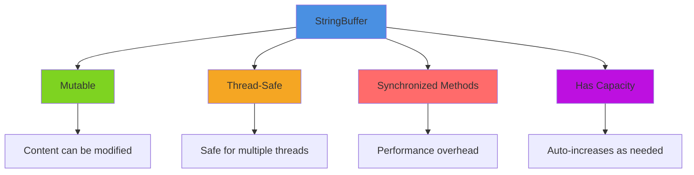

::: tip Use Case
Use `StringBuffer` when you need to make **many modifications** to strings and require **thread safety**.
:::

### StringBuffer vs String

| Feature | String | StringBuffer |
|---------|--------|--------------|
| **Mutability** | Immutable | Mutable |
| **Thread Safety** | Not applicable | Thread-safe (synchronized) |
| **Performance** | Slower for many modifications | Faster for modifications |
| **Memory** | Creates new objects | Modifies same object |

## 4.2.7 StringBuilder Class

`StringBuilder` is a **final class** in `java.lang` package added in **Java 5**.

### Key Characteristics

- Same functionality as `StringBuffer`
- Methods are **NOT synchronized**
- **NOT thread-safe** (faster than StringBuffer)
- Multiple threads can access simultaneously
- Preferred for single-threaded scenarios

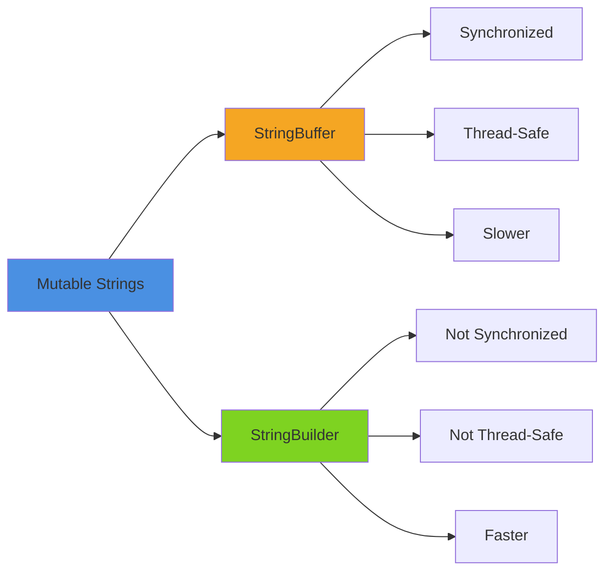

::: tip Best Practice
- Use `StringBuilder` in **single-threaded** applications (most common)
- Use `StringBuffer` only when **thread safety** is required
:::

## 4.2.7.1 StringBuilder API

### Constructors

| Constructor | Description |
|-------------|-------------|
| `StringBuilder()` | Creates with **initial capacity 16** |
| `StringBuilder(String content)` | Creates with capacity = **content.length() + 16** |
| `StringBuilder(int capacity)` | Creates with **specified capacity** |

**Example:**

```java
StringBuilder sb1 = new StringBuilder();
// Capacity: 16, Length: 0

StringBuilder sb2 = new StringBuilder("JLC");
// Capacity: 19 (3 + 16), Length: 3

StringBuilder sb3 = new StringBuilder(25);
// Capacity: 25, Length: 0
```

### Important Methods

#### Capacity & Length Methods

| Method | Description |
|--------|-------------|
| `int capacity()` | Returns current capacity |
| `int length()` | Returns current length (number of characters) |
| `void ensureCapacity(int minCapacity)` | Ensures minimum capacity |
| `void setLength(int newLength)` | Changes the length |
| `void trimToSize()` | Reduces capacity to match length |

**Capacity Formula:**
```
New Capacity = max(minCapacity, (oldCapacity * 2) + 2)
```

#### Modification Methods

| Method | Description |
|--------|-------------|
| `StringBuilder append(X value)` | Adds data to end (overloaded for all types) |
| `StringBuilder insert(int index, X value)` | Inserts data at specified index |
| `StringBuilder delete(int start, int end)` | Deletes characters in range |
| `StringBuilder deleteCharAt(int index)` | Deletes character at index |
| `void setCharAt(int index, char ch)` | Replaces character at index |
| `StringBuilder replace(int start, int end, String str)` | Replaces range with string |
| `StringBuilder reverse()` | Reverses the content |

## StringBuilder Examples

### Basic Operations

```java
StringBuilder sb = new StringBuilder();
System.out.println(sb.length());      // 0
System.out.println(sb.capacity());    // 16

StringBuilder sb2 = new StringBuilder("Hello");
System.out.println(sb2);              // Hello
System.out.println(sb2.length());     // 5
System.out.println(sb2.capacity());   // 21 (5 + 16)

sb2.append(" Guys!!!");
System.out.println(sb2);              // Hello Guys!!!
System.out.println(sb2.length());     // 14
System.out.println(sb2.capacity());   // 21

sb2.append("1234567899");
System.out.println(sb2);              // Hello Guys!!!1234567899
System.out.println(sb2.length());     // 24
System.out.println(sb2.capacity());   // 44 (21 * 2 + 2)

sb2.trimToSize();
System.out.println(sb2.capacity());   // 24 (trimmed to length)
```

### Insert Operations

```java
StringBuilder sb = new StringBuilder(25);
System.out.println(sb.length());      // 0
System.out.println(sb.capacity());    // 25

sb.append("Hello Guys!!!");
sb.append(true);
System.out.println(sb);               // Hello Guys!!!true
System.out.println(sb.length());      // 18

sb.insert(6, "JLC ");
System.out.println(sb);               // Hello JLC Guys!!!true
System.out.println(sb.length());      // 22

sb.insert(10, true);
System.out.println(sb);               // Hello JLC trueGuys!!!true
System.out.println(sb.length());      // 26
```

### Delete Operations

```java
StringBuilder sb = new StringBuilder("Hello JLC Guys!!! ");
System.out.println(sb);               // Hello JLC Guys!!!
System.out.println(sb.length());      // 18

sb.deleteCharAt(15);
sb.deleteCharAt(16);
System.out.println(sb);               // Hello JLC Guys!
System.out.println(sb.length());      // 16

sb.delete(9, 15);
System.out.println(sb);               // Hello JLC!
System.out.println(sb.length());      // 10
```

### Replace & Reverse

```java
StringBuilder sb = new StringBuilder("Hello Hai Guys!!! ");
System.out.println(sb);               // Hello Hai Guys!!!
System.out.println(sb.length());      // 18

sb.replace(6, 9, "JLC");
System.out.println(sb);               // Hello JLC Guys!!!
System.out.println(sb.length());      // 18

sb.replace(5, 18, "J");
System.out.println(sb);               // HelloJ
System.out.println(sb.length());      // 6

sb.reverse();
System.out.println(sb);               // JolleH
```

### Comparing StringBuilder Objects

::: warning Important
`equals()` is NOT overridden in `StringBuilder` and `StringBuffer` classes!
:::

```java
StringBuilder sb1 = new StringBuilder("JLC");
StringBuilder sb2 = new StringBuilder("JLC");

System.out.println(sb1 == sb2);        // false (different objects)
System.out.println(sb1.equals(sb2));   // false (uses Object.equals - compares references)

// ✅ Option 1: Convert to String
String str1 = sb1.toString();
String str2 = sb2.toString();
System.out.println(str1.equals(str2)); // true

// ✅ Option 2: Use contentEquals()
String str = sb1.toString();
System.out.println(str.contentEquals(sb2)); // true
```

::: danger Key Differences
- `equals()` is **NOT overridden** in StringBuilder/StringBuffer
- `hashCode()` is **NOT overridden** (uses Object's implementation)
- **NOT Comparable** (doesn't implement `Comparable` interface)
:::

## String vs StringBuffer vs StringBuilder

### Comparison Table

| Feature | String | StringBuffer | StringBuilder |
|---------|--------|--------------|---------------|
| **Mutability** | Immutable | Mutable | Mutable |
| **Creation** | Literal or new | Only new | Only new |
| **Performance** | Slow for modifications | Medium | Fast |
| **Thread Safety** | Not applicable | Thread-safe (synchronized) | Not thread-safe |
| **Comparable** | ✅ Yes | ❌ No | ❌ No |
| **equals() Override** | ✅ Yes | ❌ No | ❌ No |
| **hashCode() Override** | ✅ Yes (content-based) | ❌ No | ❌ No |
| **Concatenation (+)** | ✅ Supported | ❌ Not supported | ❌ Not supported |

### When to Use What?

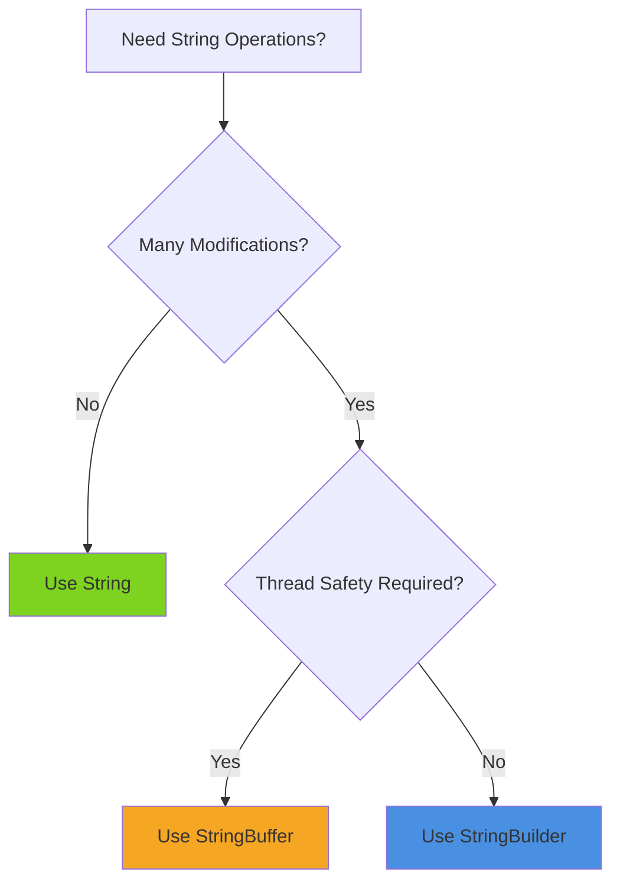

## 4.2.8 Wrapper Classes

Wrapper classes convert primitive types to objects and vice versa.

### Wrapper Class Hierarchy

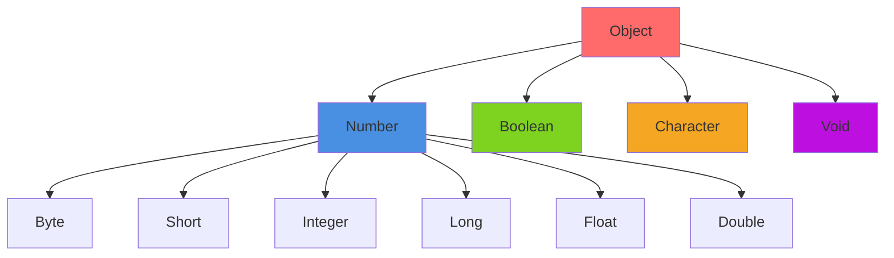

### Primitive to Wrapper Mapping

| Primitive | Wrapper Class |
|-----------|---------------|
| `boolean` | `Boolean` |
| `byte` | `Byte` |
| `char` | `Character` |
| `short` | `Short` |
| `int` | `Integer` |
| `long` | `Long` |
| `float` | `Float` |
| `double` | `Double` |
| `void` | `Void` |

### Why Wrapper Classes?

::: info Use Cases
1. **Collections**: Collections only work with objects
2. **Utilities**: Parsing, conversion, constants
3. **Generics**: Generic types require objects
4. **Nullable values**: Primitives can't be null
5. **Type conversion**: Between types and String
:::

## 4.2.8.1 Important Conversions

### Conversion Types

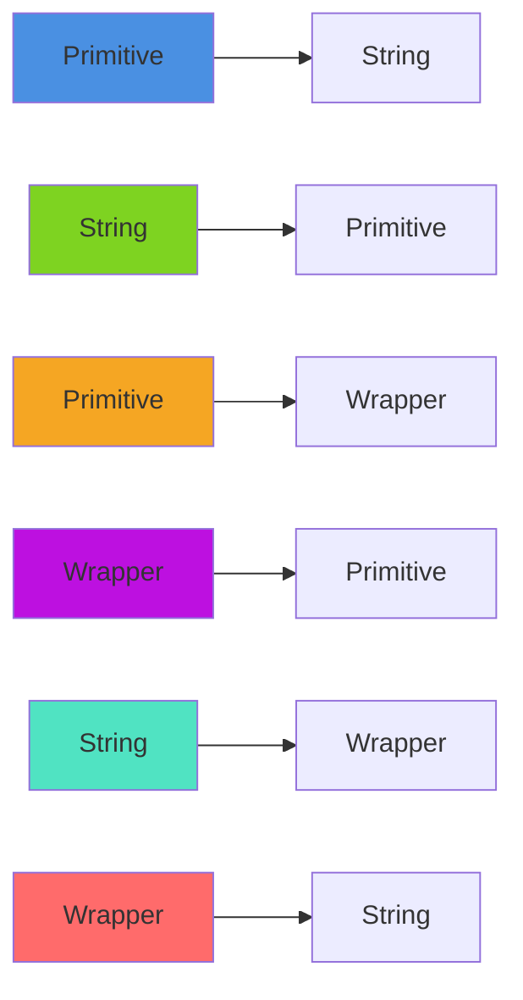

### 1. Primitive to String

```java
// Method A: String.valueOf()
int a = 10;
String str1 = String.valueOf(a);       // "10"
String str2 = String.valueOf(99.99);   // "99.99"
String str3 = String.valueOf(true);    // "true"

// Method B: Wrapper.toString()
String str4 = Integer.toString(10);    // "10"
String str5 = Double.toString(99.99);  // "99.99"
String str6 = Boolean.toString(true);  // "true"
```

### 2. String to Primitive

```java
// Using parseXxx() methods
String str1 = "123";
int a = Integer.parseInt(str1);        // 123

String str2 = "99.99";
double d = Double.parseDouble(str2);   // 99.99

String str3 = "true";
boolean b = Boolean.parseBoolean(str3); // true
```

### 3. Primitive to Wrapper

```java
// Method A: Using Constructor
int a = 123;
Integer i1 = new Integer(a);

double d = 99.99;
Double d1 = new Double(d);

boolean b = true;
Boolean b1 = new Boolean(b);

// Method B: Using valueOf()
Integer i2 = Integer.valueOf(123);
Double d2 = Double.valueOf(99.99);
Boolean b2 = Boolean.valueOf(true);
```

### 4. Wrapper to Primitive

```java
// Using xxxValue() methods
Integer i1 = new Integer(123);
byte x = i1.byteValue();      // 123
short s = i1.shortValue();    // 123
int a = i1.intValue();        // 123
long y = i1.longValue();      // 123
float f = i1.floatValue();    // 123.0
double z = i1.doubleValue();  // 123.0

// Boolean and Character
Boolean b1 = new Boolean(true);
boolean b = b1.booleanValue();

Character ch1 = new Character('A');
char ch = ch1.charValue();
```

### 5. String to Wrapper

```java
// Method A: Using Constructor
String str1 = "123";
Integer i1 = new Integer(str1);

String str2 = "99.99";
Double d1 = new Double(str2);

String str3 = "true";
Boolean b1 = new Boolean(str3);

// Method B: Using valueOf()
Integer i2 = Integer.valueOf("123");
Double d2 = Double.valueOf("99.99");
Boolean b2 = Boolean.valueOf("true");
```

::: danger Character Exception
```java
String str = "A";
Character ch = new Character(str);  // ❌ Compilation Error
// Character constructor only accepts char, not String
```
:::

### 6. Wrapper to String

```java
// Using toString() method
Integer i1 = new Integer(123);
String str1 = i1.toString();      // "123"

Double d1 = new Double(99.99);
String str2 = d1.toString();      // "99.99"

Boolean b1 = new Boolean(true);
String str3 = b1.toString();      // "true"
```

## 4.2.9 AutoBoxing & AutoUnboxing

**Before Java 5:**

```java
int x = 10;
Integer ref = x;  // ❌ Not allowed

// Had to do manually
Integer ref = new Integer(x);  // Boxing

Integer ref = new Integer(234);
int x = ref;  // ❌ Not allowed
int y = ref.intValue();  // Unboxing
```

**From Java 5 onwards:**

```java
// AutoBoxing - Compiler uses valueOf()
Integer ref1 = 123;               // ✅ Valid
Integer ref2 = new Integer(123);  // ✅ Also valid

// AutoUnboxing - Compiler uses intValue()
Integer ref = new Integer(234);
int x = ref;                      // ✅ Valid
int y = ref.intValue();           // ✅ Also valid
```

::: tip Definitions
- **Boxing**: Converting primitive to wrapper object
- **Unboxing**: Converting wrapper object to primitive
- **AutoBoxing**: Compiler does boxing automatically
- **AutoUnboxing**: Compiler does unboxing automatically
:::

## Wrapper Class Caching

### Caching Behavior

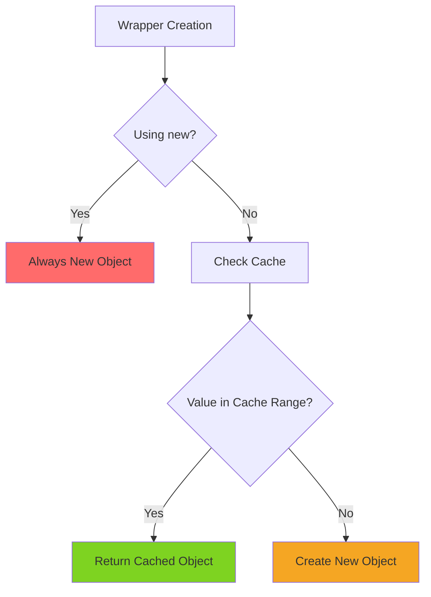

### Cache Ranges

| Wrapper | Cache Range | Notes |
|---------|-------------|-------|
| `Boolean` | `true`, `false` | Always cached |
| `Byte` | `-128` to `127` | All byte values cached |
| `Character` | `0` to `127` | ASCII range cached |
| `Short` | `-128` to `127` | Same as Integer |
| `Integer` | `-128` to `127` | Configurable with `-XX:AutoBoxCacheMax` |
| `Long` | `-128` to `127` | Same as Integer |
| `Float` | **None** | Never cached |
| `Double` | **None** | Never cached |

### Examples

**Byte Caching:**

```java
Byte b1 = 123;
Byte b2 = 123;
System.out.println(b1 == b2);  // true (cached)

byte b = 123;
Byte b3 = new Byte(b);
Byte b4 = new Byte(b);
System.out.println(b3 == b4);  // false (new objects)
```

**Boolean Caching:**

```java
Boolean b1 = true;
Boolean b2 = true;
System.out.println(b1 == b2);  // true (cached)

boolean b = true;
Boolean b3 = new Boolean(b);
Boolean b4 = new Boolean(b);
System.out.println(b3 == b4);  // false (new objects)
```

**Integer Caching:**

```java
Integer i1 = 127;
Integer i2 = 127;
System.out.println(i1 == i2);  // true (within cache range)

Integer i3 = 128;
Integer i4 = 128;
System.out.println(i3 == i4);  // false (outside cache range)
```

**Character Caching:**

```java
Character ch1 = 'A';  // ASCII 65
Character ch2 = 'A';
System.out.println(ch1 == ch2);  // true (within 0-127)

Character ch3 = 171;  // Outside ASCII range
Character ch4 = 171;
System.out.println(ch3 == ch4);  // false
```

**Float/Double - No Caching:**

```java
Float f1 = 12.34F;
Float f2 = 12.34F;
System.out.println(f1 == f2);  // false (never cached)

Double d1 = 12.34D;
Double d2 = 12.34D;
System.out.println(d1 == d2);  // false (never cached)
```

**Long Caching:**

```java
Long x1 = 123L;
Long x2 = 123L;
System.out.println(x1 == x2);  // true (within cache)

Long x3 = 128L;
Long x4 = 128L;
System.out.println(x3 == x4);  // false (outside cache)
```

### Configuring Integer Cache

```bash
# Extend Integer cache to 550
java -XX:AutoBoxCacheMax=550 Lab611
```

::: warning Always Use equals()
For wrapper object comparison, always use `equals()` instead of `==`:

```java
Integer i1 = 250;
Integer i2 = 250;
System.out.println(i1 == i2);        // false (outside cache)
System.out.println(i1.equals(i2));   // true (content comparison)
```
:::

## AutoBoxing with Operators

```java
Integer i1 = 123;
Integer i2 = 124;

System.out.println(i1 == i2);  // false (different objects)

i1++;  // AutoUnboxing, increment, then AutoBoxing
System.out.println(i1 == i2);  // true (both are 124)

Integer i3 = i1 + i2;  // AutoUnboxing, add, then AutoBoxing
System.out.println(i3);  // 248
```

## Method Overloading Priority

```java
class Hello {
    void show(int a, int b) {           // 1
        System.out.println("1. show(int, int)");
    }
    
    void show(byte a, byte b) {         // 2
        System.out.println("2. show(byte, byte)");
    }
    
    void show(Byte a, Byte b) {         // 3
        System.out.println("3. show(Byte, Byte)");
    }
    
    void show(byte... a) {              // 4
        System.out.println("4. show(byte...)");
    }
}

class Lab613 {
    public static void main(String[] args) {
        Hello h = new Hello();
        byte b1 = 10;
        byte b2 = 20;
        
        h.show(b1, b2);  // Calls #2 - exact match
    }
}
```

**Priority Order:**

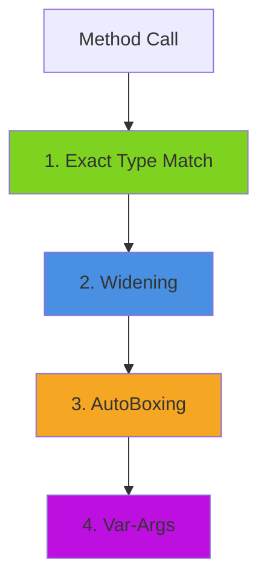

1. **Exact type match** (e.g., `byte` matches `byte`)
2. **Widening** (e.g., `byte` → `int`)
3. **AutoBoxing** (e.g., `byte` → `Byte`)
4. **Var-Args** (e.g., `byte...`)

## Wrapper Class Constants

```java
// Minimum and maximum values
System.out.println(Byte.MIN_VALUE);     // -128
System.out.println(Byte.MAX_VALUE);     // 127
System.out.println(Integer.MIN_VALUE);  // -2147483648
System.out.println(Integer.MAX_VALUE);  // 2147483647

// Size in bits
System.out.println(Byte.SIZE);          // 8
System.out.println(Integer.SIZE);       // 32
```

## 4.2.10 System Class

The `System` class is a **final class** in `java.lang` package for system-level operations.

### Key Characteristics

- Constructor is **private** (cannot instantiate)
- All members are **static**
- Access with class name: `System.xxx`

### System Class Constants

```java
public final static InputStream in;   // Keyboard (stdin)
public final static PrintStream out;  // Console (stdout)
public final static PrintStream err;  // Error console (stderr)
```

**Streams Diagram:**

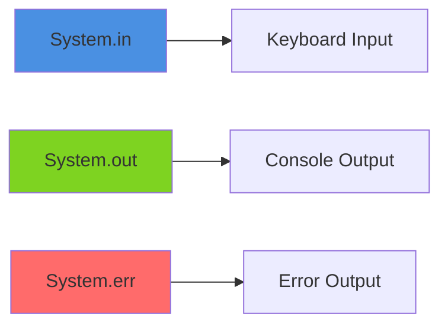

### Important System Methods

| Method | Description |
|--------|-------------|
| `long currentTimeMillis()` | Current time in milliseconds |
| `void arraycopy(Object src, int srcPos, Object dest, int destPos, int length)` | Copy array efficiently |
| `Properties getProperties()` | Get all system properties |
| `void setProperties(Properties)` | Set system properties |
| `String getProperty(String name)` | Get specific property |
| `String setProperty(String key, String value)` | Set specific property |
| `String getenv(String name)` | Get environment variable (Java 5+) |
| `void exit(int status)` | Terminate JVM (0=normal, non-zero=error) |
| `void gc()` | Invoke garbage collector |
| `void loadLibrary(String)` | Load native libraries |

### Examples

```java
// Basic output
System.out.println("I am regular Message");
System.err.println("I am Error Message");

// Time and GC
System.out.println(System.currentTimeMillis());  // e.g., 1699876543210
System.out.println(System.nanoTime());
System.gc();
System.runFinalization();

// Using PrintStream reference
PrintStream ps = System.out;
ps.println("I am regular Message");
```

### System Properties

```java
import java.util.*;

Properties props = System.getProperties();
System.out.println(props);

// Set custom properties
System.setProperty("my.web.site", "myjlc123.com");
System.setProperty("trainer.name", "Srinivas Dande");

// List all property names
Enumeration enms = props.propertyNames();
while (enms.hasMoreElements()) {
    System.out.println(enms.nextElement());
}

// Get specific properties
System.out.println(System.getProperty("java.io.tmpdir"));
System.out.println(System.getProperty("java.vm.vendor"));
System.out.println(System.getProperty("trainer.name"));
```

### Understanding System.out.println()

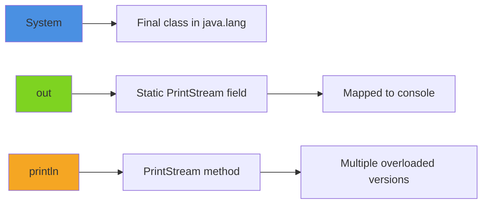

- `System` → Final class in java.lang
- `out` → Static field of type `PrintStream`, mapped to standard output (console)
- `println()` → Method of `PrintStream` that prints argument and newline

## 4.2.11 Runtime Class

The `Runtime` class provides interface to the Java Runtime Environment.

### Key Characteristics

- **Singleton pattern** (only one instance per JVM)
- Cannot create object directly
- Use `Runtime.getRuntime()` to get instance

### Important Methods

| Method | Description |
|--------|-------------|
| `static Runtime getRuntime()` | Get Runtime instance (singleton) |
| `Process exec(String command)` | Execute external program |
| `int availableProcessors()` | Get number of processors |
| `long freeMemory()` | Free memory in bytes |
| `long totalMemory()` | Total memory used by JVM in bytes |
| `long maxMemory()` | Maximum memory JVM will use in bytes |
| `void exit(int status)` | Terminate JVM |
| `void gc()` | Invoke garbage collector |
| `void loadLibrary(String)` | Load native libraries |

### Memory Management Example

```java
Runtime rt = Runtime.getRuntime();

System.out.println("Processors: " + rt.availableProcessors());
System.out.println("Max Memory: " + rt.maxMemory());
System.out.println("Total Memory: " + rt.totalMemory());
System.out.println("Free Memory: " + rt.freeMemory());
```

**Running with memory options:**

```bash
# From command prompt
java -Xmx1024m -Xms512m Lab620

# In Eclipse: Run Configuration → Arguments → VM arguments
-Xmx1024m -Xms512m
```

::: tip Memory Flags
- `-Xms` → Initial/minimum heap size
- `-Xmx` → Maximum heap size
:::

### Executing External Programs

```java
Runtime rt = Runtime.getRuntime();

if (args.length == 1) {
    String app = args[0] + ".exe";
    Process p = rt.exec(app);
} else {
    System.out.println("Specify the App name");
}

// Usage:
// java Lab621 calc
// java Lab621 notepad
```

## 4.2.12 Math Class

The `Math` class is a **final class** in `java.lang` package for mathematical operations.

### Key Characteristics

- Constructor is **private**
- All members are **static**
- Contains mathematical constants and methods

### Constants

```java
System.out.println(Math.E);   // 2.718281828459045 (Euler's number)
System.out.println(Math.PI);  // 3.141592653589793
```

### Common Methods

```java
// Square root and power
System.out.println(Math.sqrt(16));    // 4.0
System.out.println(Math.pow(3, 2));   // 9.0

// Absolute value
System.out.println(Math.abs(-99));    // 99

// Maximum and minimum
System.out.println(Math.max(20, 10));     // 20
System.out.println(Math.min(20, 10));     // 10
System.out.println(Math.max(99.9, 20.5)); // 99.9

// Rounding methods
System.out.println(Math.ceil(10.2));   // 11.0 (round up)
System.out.println(Math.ceil(10.5));   // 11.0
System.out.println(Math.ceil(10.9));   // 11.0

System.out.println(Math.floor(10.2));  // 10.0 (round down)
System.out.println(Math.floor(10.5));  // 10.0
System.out.println(Math.floor(10.9));  // 10.0

System.out.println(Math.round(10.2));  // 10 (nearest integer)
System.out.println(Math.round(10.5));  // 11
System.out.println(Math.round(10.9));  // 11

// Random number (0.0 to 1.0)
for (int i = 0; i < 10; i++) {
    System.out.println(Math.random());  // e.g., 0.6789234
}

// Random in range (0 to 10)
for (int i = 0; i < 10; i++) {
    System.out.println((int)(10 * Math.random()));
}
```

## 4.3 java.math Package

### 4.3.1 BigInteger Class

Use `BigInteger` for values **outside the range of long**.

```java
import java.math.BigInteger;

// Problem with long
long val = 9223372036854775807L;  // Long.MAX_VALUE
long val2 = 100;
long res = val + val2;
System.out.println(res);  // -9223372036854775709 (overflow!)

// Solution with BigInteger
BigInteger in1 = new BigInteger("9223372036854775807");
BigInteger in2 = new BigInteger("100");
BigInteger res1 = in1.add(in2);
System.out.println(res1);  // 9223372036854775907 (correct!)
```

**Methods:**

```java
BigInteger bint1 = new BigInteger("4");
System.out.println(bint1.bitCount());   // Number of 1 bits
System.out.println(bint1.bitLength());  // Total bits allocated
```

### 4.3.2 BigDecimal Class

Use `BigDecimal` for values **outside the range of double** or when precision is critical.

```java
import java.math.BigDecimal;

// Problem with double
double d1 = Double.MAX_VALUE;
double res = d1 + 100;
System.out.println(d1);   // 1.7976931348623157E308
System.out.println(res);  // 1.7976931348623157E308 (no change due to precision)

// Solution with BigDecimal
BigDecimal dec1 = new BigDecimal(Double.MAX_VALUE);
System.out.println(dec1);

BigDecimal dec2 = new BigDecimal(100);
BigDecimal res2 = dec1.add(dec2);
System.out.println(res2);

// ❌ Can't use infinity
// BigDecimal dec = new BigDecimal(Double.POSITIVE_INFINITY);  // NumberFormatException
```

::: tip Use Cases
- **BigInteger**: Financial calculations requiring exact integer arithmetic
- **BigDecimal**: Monetary calculations requiring exact decimal precision
:::

## Summary - Key Concepts

### String Class Summary

1. **Creating Strings:**
   - With literal: References point to String Constant Pool
   - With `new`: Creates object in heap (outside pool)

2. **String Concatenation:**
   - Only **pure literals** create pool references
   - Variables in concatenation create heap objects

3. **intern() Method:**
   - Returns reference from String Constant Pool
   - Creates in pool if doesn't exist

4. **equals() Method:**
   - Inherited from Object and overridden in String
   - Returns `true` only if:
     - Argument is not null
     - Argument is a String object
     - Content matches exactly

5. **compareTo() Method:**
   - Compares using ASCII values
   - Returns: 0 (equal), positive (greater), negative (smaller)

6. **valueOf() Method:**
   - Converts primitives/objects to String
   - For objects: Returns `"null"` if null, else calls `toString()`

7. **split() Method:**
   - Without limit: Splits at all occurrences
   - Limit 0 or > occurrences: Splits at all
   - Limit > 0 but < occurrences: Splits up to limit

8. **hashCode() Implementation:**
   ```
   s[0]*31^(n-1) + s[1]*31^(n-2) + ... + s[n-1]
   ```

### StringBuffer vs StringBuilder

| Feature | StringBuffer | StringBuilder |
|---------|--------------|---------------|
| **Thread-Safe** | ✅ Yes (synchronized) | ❌ No |
| **Performance** | Slower | Faster |
| **When to Use** | Multi-threaded | Single-threaded (preferred) |

### Wrapper Classes Summary

1. **Immutability:**
   - All wrapper objects are immutable

2. **equals() Override:**
   - Overridden in all wrapper classes to compare content

3. **hashCode() Override:**
   - **Character**: Returns ASCII value
   - **Boolean**: Returns 1231 (true) or 1237 (false)
   - **Byte/Short/Integer/Long**: Returns content value

4. **Comparable:**
   - All wrapper classes implement `Comparable`

5. **AutoBoxing/Unboxing:**
   - Compiler uses `valueOf()` for boxing
   - Compiler uses `xxxValue()` for unboxing

6. **Caching:**
   - **Boolean/Byte**: Always cached
   - **Short/Character/Integer/Long**: Cached for -128 to 127
   - **Float/Double**: Never cached

7. **Integer Cache Configuration:**
   ```bash
   -XX:AutoBoxCacheMax=596
   ```

8. **Object Assignments:**
   ```java
   Object obj = 123;  // ✅ Valid (AutoBoxing to Integer, then upcast to Object)
   Long val = 123;    // ❌ Invalid (Integer can't be assigned to Long - no inheritance)
   ```

9. **Method Overloading Priority:**
   1. Exact type match
   2. Widening (byte → int)
   3. AutoBoxing (byte → Byte)
   4. Var-args (byte...)

## Practice Questions Summary

::: details Assignment Questions

- **Q1:** What is the difference between custom and built-in package?
- **Q2:** What package is imported automatically in Java classes?
- **Q3:** What is the super class of Object class?
- **Q4:** What is the default super class for all Java classes?
- **Q5:** What are the methods available in Object class?
- **Q6:** Which methods of Object class are declared as protected?
- **Q7:** What is the return type of getClass() method?
- **Q8:** Can I override getClass() method?
- **Q9:** What is hash code and how can I get it?
- **Q10:** When should I override hashCode() method?
- **Q11:** What happens when I print a reference variable?
- **Q12:** What is the return type of toString() method?
- **Q13:** What is the default implementation of toString() method?
- **Q14:** Can I override toString() method?
- **Q15:** What is the real-time use of toString() method?
- **Q16:** What is the default implementation of equals() method?
- **Q17:** What is the difference between == operator and equals() method?
- **Q18:** What are JVM memory types?
- **Q19:** What is the use of Method Area?
- **Q20:** What is the use of Stack memory?
- **Q21:** What is the use of Heap memory?
- **Q22:** What is the reason for OutOfMemoryError?
- **Q23:** What is the reason for StackOverflowError?
- **Q24:** How does JVM identify dead objects?
- **Q25:** What is the use of finalize() method?
- **Q26:** Can I force garbage collection?
:::

::: details String Questions

- **Q1:** Can I write a subclass for String class?
- **Q2:** What are the super interfaces of String class?
- **Q3:** What variable does String class use to hold content?
- **Q4:** What are immutable objects?
- **Q5:** What happens when you modify String objects?
- **Q6:** What is the difference between creating String with/without new?
- **Q7:** What is the use of intern() method?
- **Q8:** Which Object class methods are overridden in String?
- **Q9:** What is String constant pool and its usage?
- **Q10:** What is the hashCode() implementation of String class?
- **Q11:** How can I prove String is immutable?
- **Q12:** Difference between equals() and equalsIgnoreCase()?
- **Q13:** Difference between compareTo() and compareToIgnoreCase()?
- **Q14:** Difference between equals() and compareTo()?
- **Q15:** Difference between StringBuffer and StringBuilder?
- **Q16:** Difference between length() and capacity()?
- **Q17:** How to compare String and StringBuilder?
- **Q18:** What method reverses a String?
- **Q19:** What method reverses StringBuilder?
- **Q20:** Can I concatenate String and StringBuilder using + operator?
:::

::: details Wrapper Class Questions

- **Q1:** What is a Wrapper class? How many are there?
- **Q2:** Methods for various type conversions?
- **Q3:** What is Boxing and Unboxing?
- **Q4:** Write the inheritance hierarchy for Wrapper classes?
- **Q5:** What is Auto-boxing and Auto-unboxing?
- **Q6:** What is the caching concept with Wrapper classes?
- **Q7:** What is System class?
- **Q8:** Why can't I instantiate System class?
- **Q9:** How to modify default I/O streams?
- **Q10:** Explain System.out.println()?
- **Q11:** What is Runtime class and what info can I get?
- **Q12:** How to instantiate Runtime class?
- **Q13:** What is the use of Math class?
- **Q14:** What are BigInteger and BigDecimal classes?
- **Q15:** What is Singleton Design Pattern?
- **Q16:** What is a marker interface?
- **Q17:** What is an immutable class?
:::

## Practice Test Answers

### Test 1 - Object Class

| Q | Answer | Explanation |
|---|--------|-------------|
| 1 | A | Prints class name "Student" |
| 2 | A | Same as Q1 |
| 3 | E | Hash code is unpredictable (JVM-generated) |
| 4 | B | Returns overridden value 7825414 |
| 5 | A | String overrides toString() |
| 6 | A | Default: Student@hashcode |
| 7 | B | toString() overridden to return "JLCStudent" |
| 8 | C | hashCode 15 = 0xF in hex, so Student@f |
| 9 | B | Different objects (new creates new) |
| 10 | A | String equals() compares content |
| 11 | B | Different objects |
| 12 | B | Object equals() compares addresses |
| 13 | B | equals(Student) doesn't override equals(Object) |
| 14 | B | Compares references, not content |
| 15 | D | Runtime Error - ClassCastException (String ≠ Student) |
| 16 | B | Different String objects (==) |
| 17 | A | equals() compares String content |
| 18 | C | Compilation Error - Object has no 'name' field |
| 19 | C | finalize() not guaranteed to run |
| 20 | B/E | GC not guaranteed, result unpredictable |

### Test 2 - String Class

| Q | Answer | Explanation |
|---|--------|-------------|
| 1 | B | new creates different object |
| 2 | B | Variables in concatenation create new object |
| 3 | A | final literals compile to "JLCINDIA" |
| 4 | D | NullPointerException - can't call method on null |
| 5 | C | Can't call method on literal null |
| 6 | B | "null" is a 4-character string |
| 7 | D | Negative capacity throws exception |
| 8 | D | Capacity too large throws exception |
| 9 | D | Runtime Error - NullPointerException |
| 10 | A | append(null) adds "null" string |
| 11 | B | String equals() returns false for non-String |

### Test 3 - Wrapper Classes

| Q | Answer | Explanation |
|---|--------|-------------|
| 1 | A | MIN=-128, MAX=127, SIZE=8 |
| 2 | A | Returns hashCode (content) = 10 |
| 3 | B | Binary: 101, Hex: f, Octal: 10 |
| 4 | B | 0/0 = NaN, not Infinite |
| 5 | A | 10/0 = Infinity |
| 6 | A | '9' is a digit |
| 7 | A | 'A' is a letter |
| 8 | C | Both are letters or digits |
| 9 | C | ']' and 'H' are both mirrored |
| 10 | B | '8' invalid start, ' valid |
| 11 | C | Both valid as part of identifier |
| 12 | A | 127 cached, new creates different object |
| 13 | A | Widening (char→int) has priority over var-args |
| 14 | D | Depends on OS at runtime |
| 15 | B | AutoBoxing, increment, result = 11 |
| 16 | A | BigInteger handles large numbers |

## Best Practices

::: tip String Usage
1. Use `String` for immutable text
2. Use `StringBuilder` for single-threaded modifications (most common)
3. Use `StringBuffer` only when thread-safety is required
4. Always use `equals()` for content comparison
5. Use `StringBuilder` in loops for concatenation
:::

::: tip Wrapper Classes
1. Use primitives for performance-critical code
2. Use wrappers when objects are required (collections, generics)
3. Always use `equals()` to compare wrapper objects
4. Be aware of caching behavior (don't rely on `==` except for Boolean/Byte)
5. Use `valueOf()` instead of constructors (better performance due to caching)
:::

::: tip Memory Management
1. Monitor memory usage with Runtime methods
2. Set appropriate `-Xms` and `-Xmx` values
3. Don't call `System.gc()` explicitly in production
4. Use try-with-resources to avoid memory leaks
5. Nullify large objects when done to help GC
:::

## Additional Resources

::: info Learning Materials
- **Official Documentation**: [Java SE Documentation](https://docs.oracle.com/en/java/)
- **API Reference**: [Java 8 API](https://docs.oracle.com/javase/8/docs/api/)
- **Tutorials**: [Oracle Java Tutorials](https://docs.oracle.com/javase/tutorial/)
- **Source**: myjavalearningcenter.com
:::

::: tip Next Steps
- Practice with the provided lab examples
- Complete the practice tests
- Explore the Java API documentation
- Build small projects using these concepts
:::

## Quick Reference Card

### Object Class Methods
```java
getClass()      // Get Class object
hashCode()      // Get hash code
toString()      // String representation
equals(Object)  // Content comparison
clone()         // Create copy
finalize()      // Before GC cleanup
```

### String Methods
```java
length()                    // String length
charAt(int)                 // Get character
substring(int, int)         // Extract substring
indexOf(String)             // Find position
replace(char, char)         // Replace characters
split(String)              // Split to array
trim()                     // Remove whitespace
toLowerCase()/toUpperCase() // Case conversion
```

### StringBuilder Methods
```java
append(X)               // Add to end
insert(int, X)          // Insert at position
delete(int, int)        // Remove range
deleteCharAt(int)       // Remove character
replace(int, int, String) // Replace range
reverse()               // Reverse content
capacity()              // Current capacity
length()                // Current length
```

### Wrapper Conversions
```java
// Primitive → String
String.valueOf(primitive)
WrapperClass.toString(primitive)

// String → Primitive
Integer.parseInt(str)
Double.parseDouble(str)

// Primitive → Wrapper
Integer.valueOf(primitive)
new Integer(primitive)

// Wrapper → Primitive
wrapperObj.intValue()
wrapperObj.doubleValue()
```

### System Utilities
```java
System.out.println()        // Print to console
System.err.println()        // Print error
System.currentTimeMillis()  // Current time
System.getProperty(name)    // Get property
System.gc()                 // Request GC
```

### Math Operations
```java
Math.abs(x)      // Absolute value
Math.max(a, b)   // Maximum
Math.min(a, b)   // Minimum
Math.pow(a, b)   // Power
Math.sqrt(x)     // Square root
Math.random()    // Random 0.0-1.0
Math.round(x)    // Round to nearest
Math.ceil(x)     // Round up
Math.floor(x)    // Round down
```
