# Data Structures Theory - In-Depth Guide

::: tip Purpose
Deep theoretical understanding of core data structures with visual representations and comprehensive analysis.
:::

## Table of Contents
- [Dynamic Programming](#dynamic-programming)
- [Graphs](#graphs)
- [Trees](#trees)
- [Heaps](#heaps)
- [Binary Search](#binary-search)
- [Linked Lists](#linked-lists)
- [Matrix](#matrix)

---

## Dynamic Programming

### What is Dynamic Programming?

Dynamic Programming (DP) is an algorithmic paradigm that solves complex problems by breaking them down into simpler overlapping subproblems and storing their solutions to avoid redundant calculations.

::: info Core Principles
1. **Optimal Substructure**: Optimal solution contains optimal solutions to subproblems
2. **Overlapping Subproblems**: Same subproblems are solved multiple times
3. **Memoization/Tabulation**: Store solutions to avoid recomputation
:::

### DP vs Divide & Conquer

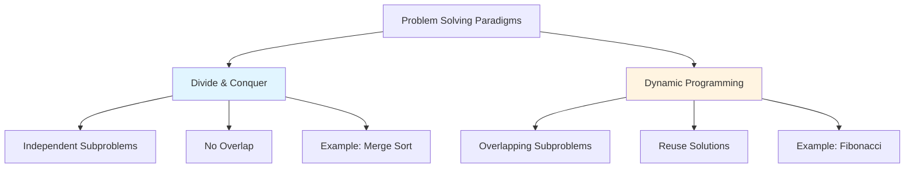

### Two Approaches to DP

#### 1. Top-Down (Memoization)

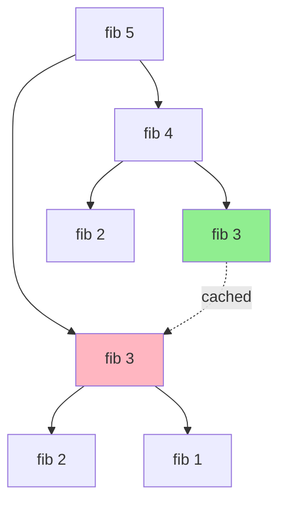

**Characteristics:**
- Recursive approach
- Uses recursion + cache (memoization)
- Start from original problem, break down
- More intuitive to write

```python
def fib_memo(n, memo={}):
    if n in memo:
        return memo[n]
    
    if n <= 1:
        return n
    
    memo[n] = fib_memo(n-1, memo) + fib_memo(n-2, memo)
    return memo[n]

# Time: O(n), Space: O(n)
```

#### 2. Bottom-Up (Tabulation)

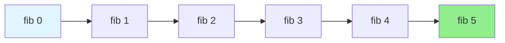

**Characteristics:**
- Iterative approach
- Build solution from base cases up
- Use table/array to store results
- Better space optimization possible

```python
def fib_tabulation(n):
    if n <= 1:
        return n
    
    dp = [0] * (n + 1)
    dp[1] = 1
    
    for i in range(2, n + 1):
        dp[i] = dp[i-1] + dp[i-2]
    
    return dp[n]

# Time: O(n), Space: O(n)

# Space-optimized version
def fib_optimized(n):
    if n <= 1:
        return n
    
    prev2, prev1 = 0, 1
    
    for _ in range(2, n + 1):
        current = prev1 + prev2
        prev2, prev1 = prev1, current
    
    return prev1

# Time: O(n), Space: O(1)
```

### DP Problem Classification

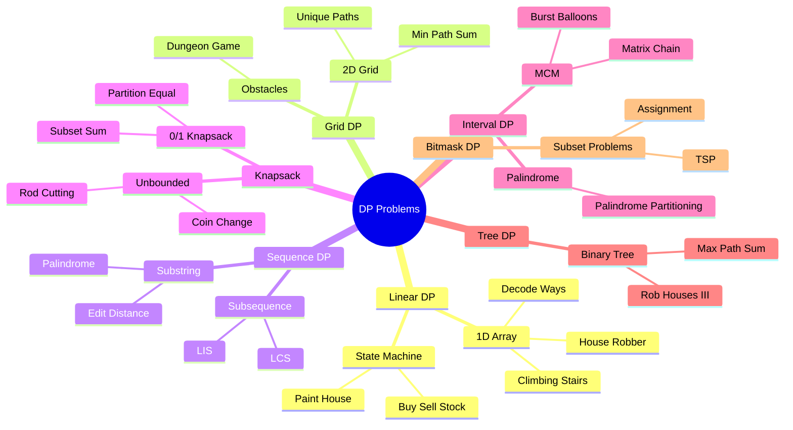

### Linear DP Deep Dive

#### State Definition

::: tip State Design
A good DP state should:
1. Represent a subproblem uniquely
2. Be computable from smaller states
3. Lead to the final answer
:::

**Example: Climbing Stairs**

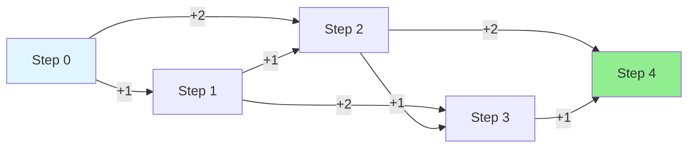

**State**: `dp[i]` = number of ways to reach step i

**Transition**: `dp[i] = dp[i-1] + dp[i-2]`

```python
def climb_stairs(n):
    if n <= 2:
        return n
    
    dp = [0] * (n + 1)
    dp[1], dp[2] = 1, 2
    
    for i in range(3, n + 1):
        dp[i] = dp[i-1] + dp[i-2]
    
    return dp[n]
```

#### House Robber Pattern

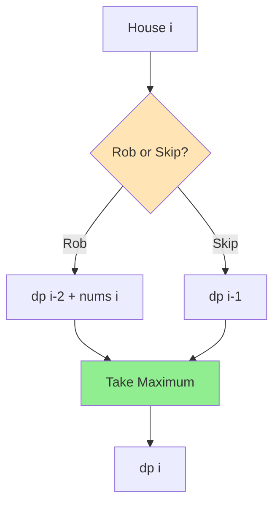

**State**: `dp[i]` = max money robbing up to house i

**Transition**: `dp[i] = max(dp[i-1], dp[i-2] + nums[i])`

```python
def rob(nums):
    if not nums:
        return 0
    if len(nums) == 1:
        return nums[0]
    
    n = len(nums)
    dp = [0] * n
    dp[0] = nums[0]
    dp[1] = max(nums[0], nums[1])
    
    for i in range(2, n):
        dp[i] = max(dp[i-1], dp[i-2] + nums[i])
    
    return dp[n-1]
```

### Grid DP Deep Dive

#### Unique Paths

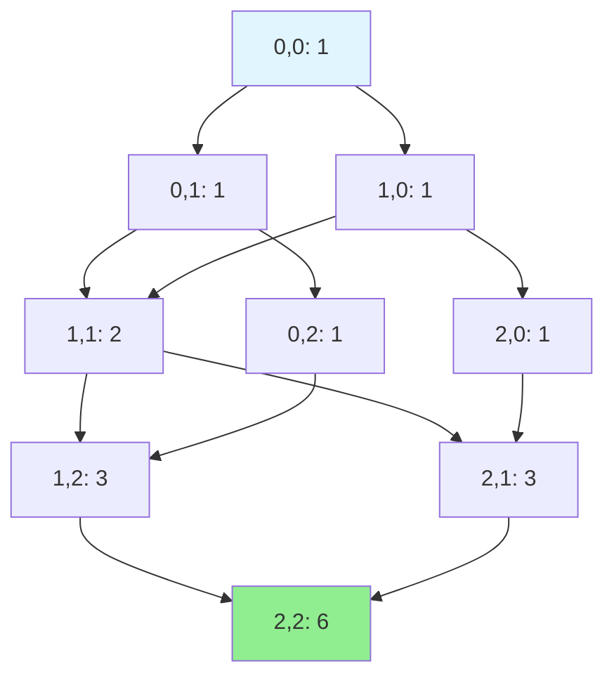

**State**: `dp[i][j]` = number of paths to cell (i,j)

**Transition**: `dp[i][j] = dp[i-1][j] + dp[i][j-1]`

```python
def unique_paths(m, n):
    dp = [[1] * n for _ in range(m)]
    
    for i in range(1, m):
        for j in range(1, n):
            dp[i][j] = dp[i-1][j] + dp[i][j-1]
    
    return dp[m-1][n-1]

# Space optimized O(n)
def unique_paths_optimized(m, n):
    dp = [1] * n
    
    for i in range(1, m):
        for j in range(1, n):
            dp[j] += dp[j-1]
    
    return dp[n-1]
```

### Sequence DP Deep Dive

#### Longest Increasing Subsequence (LIS)

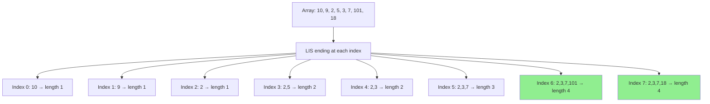

**State**: `dp[i]` = length of LIS ending at index i

**Transition**: For each j < i, if nums[j] < nums[i], then `dp[i] = max(dp[i], dp[j] + 1)`

```python
# O(n²) solution
def length_of_lis(nums):
    if not nums:
        return 0
    
    n = len(nums)
    dp = [1] * n
    
    for i in range(1, n):
        for j in range(i):
            if nums[j] < nums[i]:
                dp[i] = max(dp[i], dp[j] + 1)
    
    return max(dp)

# O(n log n) with binary search
def length_of_lis_optimized(nums):
    import bisect
    sub = []
    
    for num in nums:
        pos = bisect.bisect_left(sub, num)
        if pos == len(sub):
            sub.append(num)
        else:
            sub[pos] = num
    
    return len(sub)
```

#### Longest Common Subsequence (LCS)

```mermaid
graph TD
    A["Text1: ABCDGH<br/>Text2: AEDFHR"]
    
    B[Build DP Table]
    
    C["dp[i][j] = LCS length of<br/>text1[0...i] and text2[0...j]"]
    
    D{Characters<br/>Match?}
    
    E["Yes:<br/>dp[i][j] = dp[i-1][j-1] + 1"]
    F["No:<br/>dp[i][j] = max(dp[i-1][j], dp[i][j-1])"]
    
    A --> B
    B --> C
    C --> D
    D -->|text1[i]==text2[j]| E
    D -->|text1[i]!=text2[j]| F
    
    style E fill:#90EE90
    style F fill:#FFB6C1
```

**DP Table Example:**

|   | ε | A | E | D | F | H | R |
|---|---|---|---|---|---|---|---|
| ε | 0 | 0 | 0 | 0 | 0 | 0 | 0 |
| A | 0 | 1 | 1 | 1 | 1 | 1 | 1 |
| B | 0 | 1 | 1 | 1 | 1 | 1 | 1 |
| C | 0 | 1 | 1 | 1 | 1 | 1 | 1 |
| D | 0 | 1 | 1 | 2 | 2 | 2 | 2 |
| G | 0 | 1 | 1 | 2 | 2 | 2 | 2 |
| H | 0 | 1 | 1 | 2 | 2 | 3 | 3 |

```python
def longest_common_subsequence(text1, text2):
    m, n = len(text1), len(text2)
    dp = [[0] * (n + 1) for _ in range(m + 1)]
    
    for i in range(1, m + 1):
        for j in range(1, n + 1):
            if text1[i-1] == text2[j-1]:
                dp[i][j] = dp[i-1][j-1] + 1
            else:
                dp[i][j] = max(dp[i-1][j], dp[i][j-1])
    
    return dp[m][n]

# Reconstruct the LCS
def get_lcs_string(text1, text2):
    m, n = len(text1), len(text2)
    dp = [[0] * (n + 1) for _ in range(m + 1)]
    
    for i in range(1, m + 1):
        for j in range(1, n + 1):
            if text1[i-1] == text2[j-1]:
                dp[i][j] = dp[i-1][j-1] + 1
            else:
                dp[i][j] = max(dp[i-1][j], dp[i][j-1])
    
    # Backtrack to find LCS
    lcs = []
    i, j = m, n
    
    while i > 0 and j > 0:
        if text1[i-1] == text2[j-1]:
            lcs.append(text1[i-1])
            i -= 1
            j -= 1
        elif dp[i-1][j] > dp[i][j-1]:
            i -= 1
        else:
            j -= 1
    
    return ''.join(reversed(lcs))
```

### Knapsack Pattern Deep Dive

#### 0/1 Knapsack

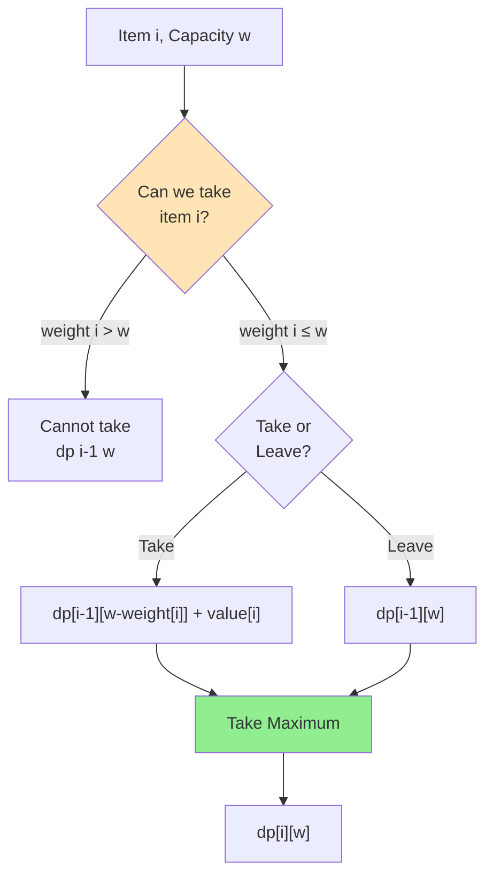

**Problem**: Given weights and values, maximize value within capacity constraint.

**State**: `dp[i][w]` = max value using first i items with capacity w

**Transition**: 
```
if weight[i] <= w:
    dp[i][w] = max(dp[i-1][w], dp[i-1][w-weight[i]] + value[i])
else:
    dp[i][w] = dp[i-1][w]
```

```python
def knapsack(weights, values, capacity):
    n = len(weights)
    dp = [[0] * (capacity + 1) for _ in range(n + 1)]
    
    for i in range(1, n + 1):
        for w in range(capacity + 1):
            # Don't take item i-1
            dp[i][w] = dp[i-1][w]
            
            # Take item i-1 if possible
            if weights[i-1] <= w:
                dp[i][w] = max(
                    dp[i][w],
                    dp[i-1][w-weights[i-1]] + values[i-1]
                )
    
    return dp[n][capacity]

# Space optimized O(capacity)
def knapsack_optimized(weights, values, capacity):
    dp = [0] * (capacity + 1)
    
    for i in range(len(weights)):
        # Traverse backwards to avoid using updated values
        for w in range(capacity, weights[i] - 1, -1):
            dp[w] = max(dp[w], dp[w-weights[i]] + values[i])
    
    return dp[capacity]
```

#### Unbounded Knapsack

**Difference**: Can take each item unlimited times.

```python
def unbounded_knapsack(weights, values, capacity):
    dp = [0] * (capacity + 1)
    
    for w in range(1, capacity + 1):
        for i in range(len(weights)):
            if weights[i] <= w:
                dp[w] = max(dp[w], dp[w-weights[i]] + values[i])
    
    return dp[capacity]

# Coin Change - Minimum coins
def coin_change(coins, amount):
    dp = [float('inf')] * (amount + 1)
    dp[0] = 0
    
    for i in range(1, amount + 1):
        for coin in coins:
            if coin <= i:
                dp[i] = min(dp[i], dp[i-coin] + 1)
    
    return dp[amount] if dp[amount] != float('inf') else -1
```

### Interval DP

**Pattern**: Problems involving contiguous subarrays/substrings.

#### Palindrome Partitioning

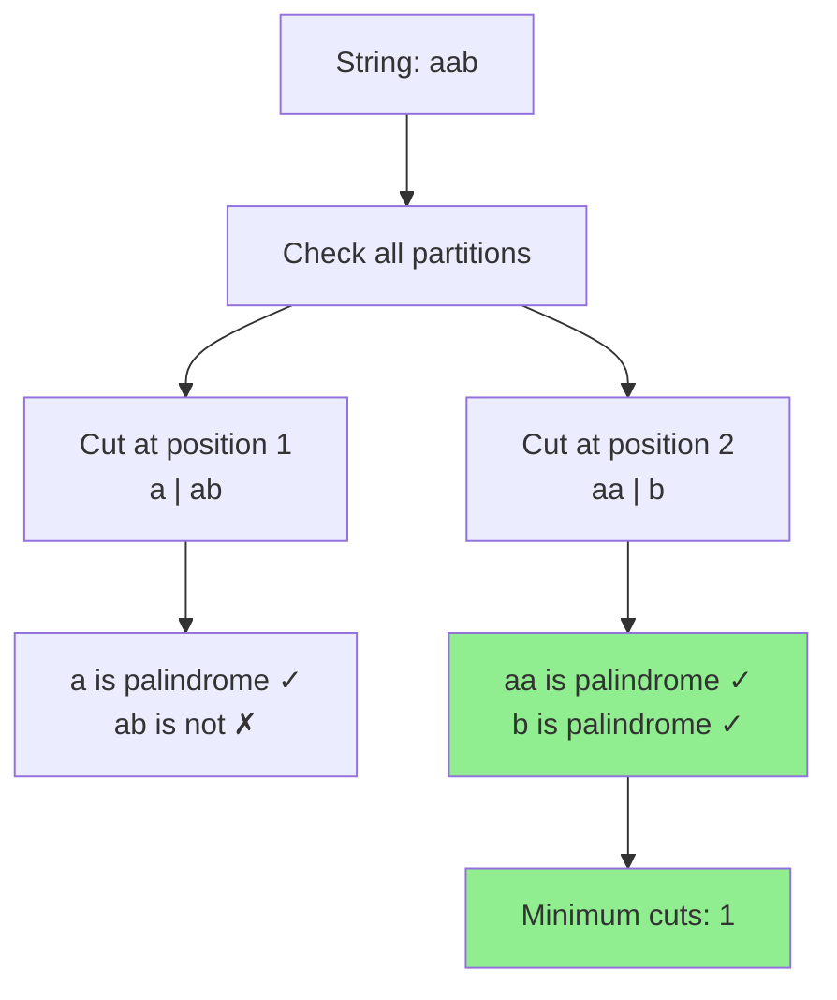

```python
def min_cut(s):
    n = len(s)
    
    # is_palindrome[i][j] = True if s[i:j+1] is palindrome
    is_palindrome = [[False] * n for _ in range(n)]
    
    # Every single character is a palindrome
    for i in range(n):
        is_palindrome[i][i] = True
    
    # Check for length 2
    for i in range(n-1):
        if s[i] == s[i+1]:
            is_palindrome[i][i+1] = True
    
    # Check for lengths > 2
    for length in range(3, n+1):
        for i in range(n-length+1):
            j = i + length - 1
            if s[i] == s[j] and is_palindrome[i+1][j-1]:
                is_palindrome[i][j] = True
    
    # dp[i] = min cuts needed for s[0:i+1]
    dp = [0] * n
    
    for i in range(n):
        if is_palindrome[0][i]:
            dp[i] = 0
        else:
            dp[i] = float('inf')
            for j in range(i):
                if is_palindrome[j+1][i]:
                    dp[i] = min(dp[i], dp[j] + 1)
    
    return dp[n-1]
```

### DP Optimization Techniques

::: tip Space Optimization
1. **Rolling Array**: Use only last row/column
2. **State Compression**: Use bitmask for states
3. **Monotonic Queue**: Optimize range queries
:::

```python
# Example: Space optimization in grid DP
# From O(m*n) to O(n)

# Before (O(m*n) space)
def min_path_sum(grid):
    m, n = len(grid), len(grid[0])
    dp = [[0] * n for _ in range(m)]
    
    dp[0][0] = grid[0][0]
    for i in range(1, m):
        dp[i][0] = dp[i-1][0] + grid[i][0]
    for j in range(1, n):
        dp[0][j] = dp[0][j-1] + grid[0][j]
    
    for i in range(1, m):
        for j in range(1, n):
            dp[i][j] = min(dp[i-1][j], dp[i][j-1]) + grid[i][j]
    
    return dp[m-1][n-1]

# After (O(n) space)
def min_path_sum_optimized(grid):
    m, n = len(grid), len(grid[0])
    dp = [0] * n
    
    dp[0] = grid[0][0]
    for j in range(1, n):
        dp[j] = dp[j-1] + grid[0][j]
    
    for i in range(1, m):
        dp[0] += grid[i][0]
        for j in range(1, n):
            dp[j] = min(dp[j], dp[j-1]) + grid[i][j]
    
    return dp[n-1]
```

---

## Graphs

### Graph Fundamentals

::: info Definition
A graph G = (V, E) consists of:
- **V**: Set of vertices (nodes)
- **E**: Set of edges (connections between vertices)
:::

### Graph Types

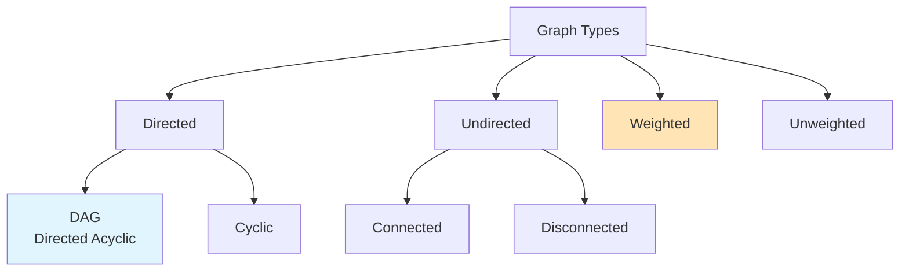

#### Visual Examples

**Directed Graph:**
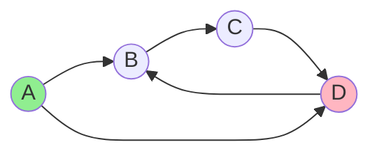

**Undirected Graph:**
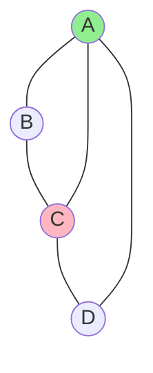

**Weighted Graph:**
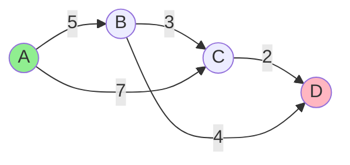

### Graph Representations

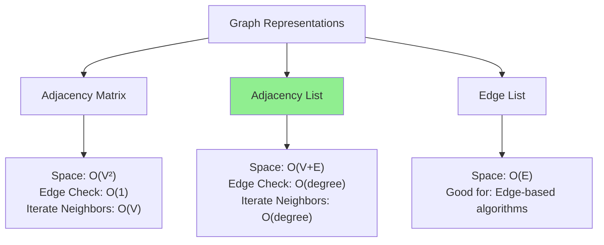

#### Adjacency Matrix

```python
class GraphMatrix:
    def __init__(self, vertices):
        self.V = vertices
        self.graph = [[0] * vertices for _ in range(vertices)]
    
    def add_edge(self, u, v, weight=1):
        self.graph[u][v] = weight
        # For undirected graph:
        # self.graph[v][u] = weight
    
    def has_edge(self, u, v):
        return self.graph[u][v] != 0
    
    def get_neighbors(self, u):
        return [v for v in range(self.V) if self.graph[u][v] != 0]
```

**Pros**: Fast edge lookup O(1)
**Cons**: Space O(V²), slow to iterate neighbors

#### Adjacency List

```python
from collections import defaultdict

class GraphList:
    def __init__(self):
        self.graph = defaultdict(list)
    
    def add_edge(self, u, v, weight=1):
        self.graph[u].append((v, weight))
        # For undirected graph:
        # self.graph[v].append((u, weight))
    
    def has_edge(self, u, v):
        return any(neighbor == v for neighbor, _ in self.graph[u])
    
    def get_neighbors(self, u):
        return self.graph[u]
```

**Pros**: Space efficient O(V+E), fast neighbor iteration
**Cons**: Slower edge lookup O(degree)

### Graph Traversal Algorithms

#### Depth-First Search (DFS)

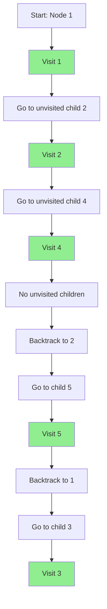

**Properties:**
- Uses stack (explicit or recursion)
- Time: O(V + E)
- Space: O(V) for recursion stack
- Goes deep before going wide

```python
def dfs_recursive(graph, node, visited=None):
    if visited is None:
        visited = set()
    
    visited.add(node)
    print(node, end=' ')
    
    for neighbor in graph[node]:
        if neighbor not in visited:
            dfs_recursive(graph, neighbor, visited)
    
    return visited

def dfs_iterative(graph, start):
    visited = set()
    stack = [start]
    
    while stack:
        node = stack.pop()
        
        if node not in visited:
            visited.add(node)
            print(node, end=' ')
            
            # Add neighbors in reverse to maintain order
            for neighbor in reversed(graph[node]):
                if neighbor not in visited:
                    stack.append(neighbor)
    
    return visited
```

**Applications:**
- Detect cycles
- Topological sort
- Find strongly connected components
- Solve puzzles (maze, sudoku)
- Path finding

#### Breadth-First Search (BFS)

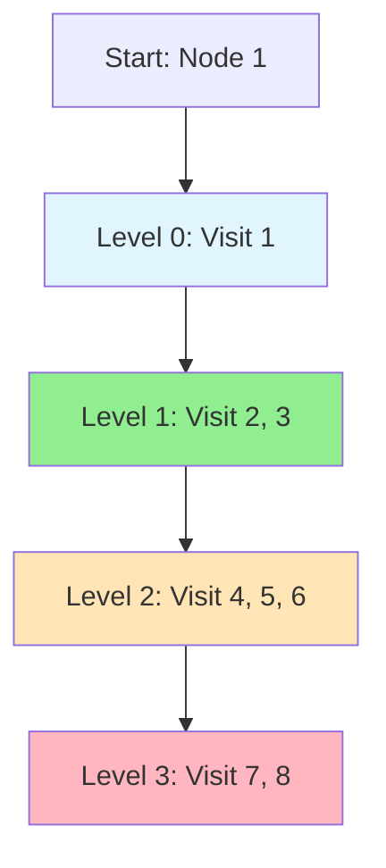

**Properties:**
- Uses queue
- Time: O(V + E)
- Space: O(V) for queue
- Explores level by level
- Finds shortest path in unweighted graphs

```python
from collections import deque

def bfs(graph, start):
    visited = set([start])
    queue = deque([start])
    result = []
    
    while queue:
        node = queue.popleft()
        result.append(node)
        
        for neighbor in graph[node]:
            if neighbor not in visited:
                visited.add(neighbor)
                queue.append(neighbor)
    
    return result

def bfs_shortest_path(graph, start, end):
    visited = set([start])
    queue = deque([(start, [start])])
    
    while queue:
        node, path = queue.popleft()
        
        if node == end:
            return path
        
        for neighbor in graph[node]:
            if neighbor not in visited:
                visited.add(neighbor)
                queue.append((neighbor, path + [neighbor]))
    
    return None
```

**Applications:**
- Shortest path in unweighted graphs
- Level-order traversal
- Find connected components
- Bipartite graph checking
- Web crawling

### Shortest Path Algorithms

#### Dijkstra's Algorithm

::: warning Limitation
**Only works with non-negative edge weights!**
:::

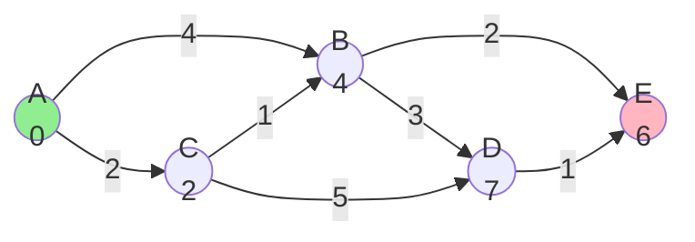

**Algorithm:**
1. Initialize distances: start = 0, others = ∞
2. Use min-heap to always process closest unvisited node
3. For each neighbor, relax edge if shorter path found
4. Mark node as visited

```python
import heapq

def dijkstra(graph, start):
    """
    graph: {node: [(neighbor, weight), ...]}
    Returns: distances dict
    """
    distances = {node: float('inf') for node in graph}
    distances[start] = 0
    
    # Priority queue: (distance, node)
    pq = [(0, start)]
    visited = set()
    
    while pq:
        current_dist, current = heapq.heappop(pq)
        
        if current in visited:
            continue
        
        visited.add(current)
        
        # If this distance is outdated, skip
        if current_dist > distances[current]:
            continue
        
        for neighbor, weight in graph[current]:
            distance = current_dist + weight
            
            # Relaxation: found shorter path
            if distance < distances[neighbor]:
                distances[neighbor] = distance
                heapq.heappush(pq, (distance, neighbor))
    
    return distances

# Time: O((V + E) log V), Space: O(V)
```

**Step-by-step execution:**

| Step | Current | Distance to A | B | C | D | E | Priority Queue |
|------|---------|---------------|---|---|---|---|----------------|
| 0 | - | 0 | ∞ | ∞ | ∞ | ∞ | [(0,A)] |
| 1 | A | 0 | 4 | 2 | ∞ | ∞ | [(2,C), (4,B)] |
| 2 | C | 0 | 3 | 2 | 7 | ∞ | [(3,B), (4,B), (7,D)] |
| 3 | B | 0 | 3 | 2 | 7 | 6 | [(4,B), (6,E), (7,D)] |
| 4 | E | 0 | 3 | 2 | 7 | 6 | [(7,D)] |
| 5 | D | 0 | 3 | 2 | 7 | 6 | [] |

#### Bellman-Ford Algorithm

::: tip Use Case
**Works with negative edge weights!** Can detect negative cycles.
:::

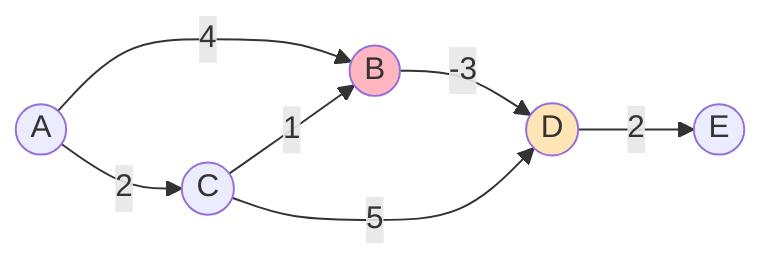

**Algorithm:**
1. Initialize distances: start = 0, others = ∞
2. Relax all edges V-1 times
3. Check for negative cycles (one more iteration)

```python
def bellman_ford(edges, num_vertices, start):
    """
    edges: list of (u, v, weight)
    Returns: (distances, has_negative_cycle)
    """
    distances = [float('inf')] * num_vertices
    distances[start] = 0
    
    # Relax all edges V-1 times
    for _ in range(num_vertices - 1):
        updated = False
        for u, v, weight in edges:
            if distances[u] != float('inf'):
                if distances[u] + weight < distances[v]:
                    distances[v] = distances[u] + weight
                    updated = True
        
        # Early termination if no updates
        if not updated:
            break
    
    # Check for negative cycles
    for u, v, weight in edges:
        if distances[u] != float('inf'):
            if distances[u] + weight < distances[v]:
                return distances, True  # Negative cycle exists
    
    return distances, False

# Time: O(VE), Space: O(V)
```

#### Floyd-Warshall Algorithm

::: info Use Case
**All-pairs shortest paths.** Works with negative edges.
:::

```python
def floyd_warshall(graph):
    """
    graph: 2D adjacency matrix
    Returns: distance matrix
    """
    n = len(graph)
    dist = [row[:] for row in graph]  # Copy matrix
    
    # Initialize: no edge = infinity
    for i in range(n):
        for j in range(n):
            if i != j and dist[i][j] == 0:
                dist[i][j] = float('inf')
    
    # Try all intermediate vertices
    for k in range(n):
        for i in range(n):
            for j in range(n):
                dist[i][j] = min(dist[i][j], dist[i][k] + dist[k][j])
    
    return dist

# Time: O(V³), Space: O(V²)
```

### Topological Sort

::: warning Requirement
**Only works on Directed Acyclic Graphs (DAG)**
:::

```mermaid
graph TD
    A[5] --> B[2]
    A --> C[0]
    B --> D[3]
    C --> D
    D --> E[1]
    B --> F[1]
    
    style A fill:#90EE90
    style E fill:#FFB6C1
```

**Topological Order**: 5, 2, 0, 3, 1 or 5, 0, 2, 3, 1

#### DFS-based Approach

```python
def topological_sort_dfs(graph, num_vertices):
    visited = set()
    stack = []
    
    def dfs(node):
        visited.add(node)
        
        for neighbor in graph.get(node, []):
            if neighbor not in visited:
                dfs(neighbor)
        
        stack.append(node)  # Add after visiting all descendants
    
    for vertex in range(num_vertices):
        if vertex not in visited:
            dfs(vertex)
    
    return stack[::-1]  # Reverse to get topological order

# Time: O(V + E), Space: O(V)
```

#### Kahn's Algorithm (BFS-based)

```mermaid
graph TD
    A[Calculate In-degrees] --> B[Add 0 in-degree to queue]
    B --> C[Process node from queue]
    C --> D[Add to result]
    D --> E[Reduce in-degree of neighbors]
    E --> F{In-degree<br/>becomes 0?}
    F -->|Yes| G[Add to queue]
    F -->|No| H[Continue]
    G --> C
    H --> C
    C --> I{Queue<br/>empty?}
    I -->|No| C
    I -->|Yes| J[Done]
    
    style B fill:#90EE90
    style D fill:#FFE4B5
    style J fill:#FFB6C1
```

```python
from collections import deque, defaultdict

def topological_sort_kahn(graph, num_vertices):
    in_degree = [0] * num_vertices
    
    # Calculate in-degrees
    for node in graph:
        for neighbor in graph[node]:
            in_degree[neighbor] += 1
    
    # Queue with 0 in-degree nodes
    queue = deque([i for i in range(num_vertices) if in_degree[i] == 0])
    result = []
    
    while queue:
        node = queue.popleft()
        result.append(node)
        
        for neighbor in graph.get(node, []):
            in_degree[neighbor] -= 1
            if in_degree[neighbor] == 0:
                queue.append(neighbor)
    
    # If result length != num_vertices, there's a cycle
    if len(result) != num_vertices:
        return []  # Cycle detected
    
    return result

# Time: O(V + E), Space: O(V)
```

### Union-Find (Disjoint Set Union)

::: tip Applications
- Detect cycles in undirected graphs
- Find connected components
- Kruskal's MST algorithm
- Network connectivity
:::

```mermaid
graph TD
    A[Union-Find Operations] --> B[Find]
    A --> C[Union]
    
    B --> B1[Find root of element]
    B --> B2[Path Compression]
    
    C --> C1[Merge two sets]
    C --> C2[Union by Rank/Size]
    
    style B2 fill:#90EE90
    style C2 fill:#90EE90
```

**Visual Example:**

```mermaid
graph TD
    subgraph "Initial State"
    A1[0] 
    B1[1]
    C1[2]
    D1[3]
    E1[4]
    end
    
    subgraph "After Union 0 1"
    A2[0]
    B2[1] --> A2
    C2[2]
    D2[3]
    E2[4]
    end
    
    subgraph "After Union 2 3"
    A3[0]
    B3[1] --> A3
    C3[2]
    D3[3] --> C3
    E3[4]
    end
    
    subgraph "After Union 0 2"
    A4[0]
    B4[1] --> A4
    C4[2] --> A4
    D4[3] --> C4
    E4[4]
    end
```

```python
class UnionFind:
    def __init__(self, n):
        self.parent = list(range(n))
        self.rank = [0] * n
        self.count = n  # Number of components
    
    def find(self, x):
        """Find with path compression"""
        if self.parent[x] != x:
            self.parent[x] = self.find(self.parent[x])
        return self.parent[x]
    
    def union(self, x, y):
        """Union by rank"""
        root_x = self.find(x)
        root_y = self.find(y)
        
        if root_x == root_y:
            return False  # Already in same set
        
        # Union by rank: attach smaller tree under larger
        if self.rank[root_x] < self.rank[root_y]:
            self.parent[root_x] = root_y
        elif self.rank[root_x] > self.rank[root_y]:
            self.parent[root_y] = root_x
        else:
            self.parent[root_y] = root_x
            self.rank[root_x] += 1
        
        self.count -= 1
        return True
    
    def connected(self, x, y):
        """Check if x and y are in same set"""
        return self.find(x) == self.find(y)
    
    def get_count(self):
        """Get number of disjoint sets"""
        return self.count

# Time: O(α(n)) ≈ O(1) amortized for find and union
# where α is inverse Ackermann function
```

**Application: Detect Cycle**

```python
def has_cycle(edges, num_vertices):
    uf = UnionFind(num_vertices)
    
    for u, v in edges:
        if uf.connected(u, v):
            return True  # Cycle found
        uf.union(u, v)
    
    return False
```

### Minimum Spanning Tree (MST)

::: info Definition
A spanning tree that connects all vertices with minimum total edge weight.
:::

#### Kruskal's Algorithm

```mermaid
graph TD
    A[Sort all edges by weight] --> B[Initialize Union-Find]
    B --> C[For each edge u-v]
    C --> D{u and v in<br/>same component?}
    D -->|No| E[Add edge to MST]
    D -->|Yes| F[Skip edge]
    E --> G[Union u and v]
    G --> H{MST complete?}
    F --> H
    H -->|No| C
    H -->|Yes| I[Return MST]
    
    style E fill:#90EE90
    style I fill:#FFB6C1
```

```python
def kruskal_mst(edges, num_vertices):
    """
    edges: list of (weight, u, v)
    Returns: (mst_weight, mst_edges)
    """
    # Sort edges by weight
    edges.sort()
    
    uf = UnionFind(num_vertices)
    mst_weight = 0
    mst_edges = []
    
    for weight, u, v in edges:
        if not uf.connected(u, v):
            uf.union(u, v)
            mst_weight += weight
            mst_edges.append((u, v, weight))
            
            # MST complete when we have V-1 edges
            if len(mst_edges) == num_vertices - 1:
                break
    
    return mst_weight, mst_edges

# Time: O(E log E), Space: O(V)
```

#### Prim's Algorithm

```python
import heapq

def prim_mst(graph, start=0):
    """
    graph: {node: [(neighbor, weight), ...]}
    Returns: (mst_weight, mst_edges)
    """
    visited = set()
    mst_weight = 0
    mst_edges = []
    
    # Min heap: (weight, node, parent)
    min_heap = [(0, start, -1)]
    
    while min_heap and len(visited) < len(graph):
        weight, node, parent = heapq.heappop(min_heap)
        
        if node in visited:
            continue
        
        visited.add(node)
        mst_weight += weight
        
        if parent != -1:
            mst_edges.append((parent, node, weight))
        
        for neighbor, edge_weight in graph[node]:
            if neighbor not in visited:
                heapq.heappush(min_heap, (edge_weight, neighbor, node))
    
    return mst_weight, mst_edges

# Time: O(E log V), Space: O(V)
```

### Strongly Connected Components (SCC)

::: info Definition
Maximal subgraph where every vertex is reachable from every other vertex.
:::

#### Kosaraju's Algorithm

```mermaid
graph LR
    subgraph "Original Graph"
    A1((1)) --> B1((2))
    B1 --> C1((3))
    C1 --> A1
    C1 --> D1((4))
    D1 --> E1((5))
    E1 --> D1
    end
    
    subgraph "SCCs"
    SCC1[SCC1: 1,2,3]
    SCC2[SCC2: 4,5]
    end
    
    style SCC1 fill:#90EE90
    style SCC2 fill:#FFB6C1
```

```python
def kosaraju_scc(graph, num_vertices):
    """
    Two-pass DFS algorithm
    Returns: list of SCCs
    """
    # Step 1: Fill order based on finish times
    visited = set()
    finish_order = []
    
    def dfs1(node):
        visited.add(node)
        for neighbor in graph.get(node, []):
            if neighbor not in visited:
                dfs1(neighbor)
        finish_order.append(node)
    
    for v in range(num_vertices):
        if v not in visited:
            dfs1(v)
    
    # Step 2: Create transpose graph
    transpose = {i: [] for i in range(num_vertices)}
    for u in graph:
        for v in graph[u]:
            transpose[v].append(u)
    
    # Step 3: DFS on transpose in reverse finish order
    visited.clear()
    sccs = []
    
    def dfs2(node, scc):
        visited.add(node)
        scc.append(node)
        for neighbor in transpose.get(node, []):
            if neighbor not in visited:
                dfs2(neighbor, scc)
    
    for node in reversed(finish_order):
        if node not in visited:
            scc = []
            dfs2(node, scc)
            sccs.append(scc)
    
    return sccs

# Time: O(V + E), Space: O(V + E)
```

---

## Trees

### Tree Fundamentals

::: info Definition
A tree is a connected acyclic graph. It has:
- **N nodes and N-1 edges**
- **Exactly one path** between any two nodes
- **Removing any edge** disconnects the graph
:::

### Tree Terminology

```mermaid
graph TD
    A[Root: 1<br/>Height: 3<br/>Depth: 0] --> B[Internal Node: 2<br/>Height: 2<br/>Depth: 1]
    A --> C[Internal Node: 3<br/>Height: 1<br/>Depth: 1]
    B --> D[Leaf: 4<br/>Height: 0<br/>Depth: 2]
    B --> E[Internal Node: 5<br/>Height: 1<br/>Depth: 2]
    C --> F[Leaf: 6<br/>Height: 0<br/>Depth: 2]
    E --> G[Leaf: 7<br/>Height: 0<br/>Depth: 3]
    
    style A fill:#90EE90
    style D fill:#FFB6C1
    style F fill:#FFB6C1
    style G fill:#FFB6C1
```

**Key Terms:**
- **Root**: Top node (no parent)
- **Leaf**: Node with no children
- **Internal Node**: Node with at least one child
- **Height**: Longest path from node to leaf
- **Depth**: Distance from root to node
- **Level**: All nodes at same depth
- **Degree**: Number of children

### Binary Tree Types

```mermaid
graph TD
    A[Binary Tree Types] --> B[Full Binary Tree]
    A --> C[Complete Binary Tree]
    A --> D[Perfect Binary Tree]
    A --> E[Balanced Binary Tree]
    A --> F[Degenerate Tree]
    
    B --> B1[Every node has<br/>0 or 2 children]
    C --> C1[All levels filled<br/>except possibly last<br/>last level left-filled]
    D --> D1[All internal nodes<br/>have 2 children<br/>All leaves at same level]
    E --> E1[Height difference<br/>of subtrees ≤ 1]
    F --> F1[Each node has<br/>only one child<br/>Essentially a linked list]
    
    style D fill:#90EE90
    style E fill:#FFE4B5
```

**Visual Examples:**

```mermaid
graph TD
    subgraph "Full Binary Tree"
    F1[1] --> F2[2]
    F1 --> F3[3]
    F2 --> F4[4]
    F2 --> F5[5]
    end
    
    subgraph "Complete Binary Tree"
    C1[1] --> C2[2]
    C1 --> C3[3]
    C2 --> C4[4]
    C2 --> C5[5]
    C3 --> C6[6]
    end
    
    subgraph "Perfect Binary Tree"
    P1[1] --> P2[2]
    P1 --> P3[3]
    P2 --> P4[4]
    P2 --> P5[5]
    P3 --> P6[6]
    P3 --> P7[7]
    end
```

### Binary Search Tree (BST)

::: tip BST Property
For every node:
- **Left subtree** contains only nodes with keys **less than** the node's key
- **Right subtree** contains only nodes with keys **greater than** the node's key
- Both subtrees are also BSTs
:::

```mermaid
graph TD
    A[8] --> B[3]
    A --> C[10]
    B --> D[1]
    B --> E[6]
    E --> F[4]
    E --> G[7]
    C --> H[14]
    H --> I[13]
    
    style A fill:#90EE90
    style B fill:#e1f5ff
    style C fill:#e1f5ff
```

**BST Operations:**

```python
class TreeNode:
    def __init__(self, val=0, left=None, right=None):
        self.val = val
        self.left = left
        self.right = right

class BST:
    def __init__(self):
        self.root = None
    
    def insert(self, val):
        """Insert value into BST"""
        if not self.root:
            self.root = TreeNode(val)
            return
        
        current = self.root
        while True:
            if val < current.val:
                if not current.left:
                    current.left = TreeNode(val)
                    return
                current = current.left
            else:
                if not current.right:
                    current.right = TreeNode(val)
                    return
                current = current.right
    
    def search(self, val):
        """Search for value in BST"""
        current = self.root
        
        while current:
            if val == current.val:
                return True
            elif val < current.val:
                current = current.left
            else:
                current = current.right
        
        return False
    
    def delete(self, val):
        """Delete value from BST"""
        def delete_node(root, val):
            if not root:
                return None
            
            if val < root.val:
                root.left = delete_node(root.left, val)
            elif val > root.val:
                root.right = delete_node(root.right, val)
            else:
                # Node to delete found
                if not root.left:
                    return root.right
                if not root.right:
                    return root.left
                
                # Node has two children: find inorder successor
                successor = root.right
                while successor.left:
                    successor = successor.left
                
                root.val = successor.val
                root.right = delete_node(root.right, successor.val)
            
            return root
        
        self.root = delete_node(self.root, val)

# Time Complexity:
# Average: O(log n) for balanced tree
# Worst: O(n) for skewed tree
```

### Tree Traversals Deep Dive

```mermaid
graph TD
    A[Tree Traversals] --> B[DFS]
    A --> C[BFS]
    
    B --> D[Preorder<br/>Root-Left-Right]
    B --> E[Inorder<br/>Left-Root-Right]
    B --> F[Postorder<br/>Left-Right-Root]
    
    C --> G[Level Order<br/>Left to Right]
    
    style D fill:#FFE4B5
    style E fill:#90EE90
    style F fill:#FFB6C1
    style G fill:#e1f5ff
```

**Example Tree:**

```mermaid
graph TD
    1[1] --> 2[2]
    1 --> 3[3]
    2 --> 4[4]
    2 --> 5[5]
    3 --> 6[6]
    3 --> 7[7]
```

**Traversal Results:**
- **Preorder**: 1, 2, 4, 5, 3, 6, 7
- **Inorder**: 4, 2, 5, 1, 6, 3, 7
- **Postorder**: 4, 5, 2, 6, 7, 3, 1
- **Level Order**: 1, 2, 3, 4, 5, 6, 7

#### Inorder Traversal (Most Important for BST)

::: tip BST Property
**Inorder traversal of BST gives sorted order!**
:::

```python
# Recursive
def inorder_recursive(root):
    result = []
    
    def traverse(node):
        if not node:
            return
        traverse(node.left)
        result.append(node.val)
        traverse(node.right)
    
    traverse(root)
    return result

# Iterative using stack
def inorder_iterative(root):
    result = []
    stack = []
    current = root
    
    while current or stack:
        # Go to leftmost node
        while current:
            stack.append(current)
            current = current.left
        
        # Process node
        current = stack.pop()
        result.append(current.val)
        
        # Move to right subtree
        current = current.right
    
    return result

# Morris Traversal - O(1) space
def inorder_morris(root):
    result = []
    current = root
    
    while current:
        if not current.left:
            result.append(current.val)
            current = current.right
        else:
            # Find inorder predecessor
            pred = current.left
            while pred.right and pred.right != current:
                pred = pred.right
            
            if not pred.right:
                # Create thread
                pred.right = current
                current = current.left
            else:
                # Remove thread
                pred.right = None
                result.append(current.val)
                current = current.right
    
    return result
```

### AVL Tree (Self-Balancing BST)

::: info Balance Factor
**Balance Factor = Height(Left Subtree) - Height(Right Subtree)**

Must be in {-1, 0, 1} for all nodes.
:::

**Rotations:**

```mermaid
graph TD
    A[AVL Rotations] --> B[Left Rotation<br/>Right-heavy]
    A --> C[Right Rotation<br/>Left-heavy]
    A --> D[Left-Right Rotation<br/>Left-Right case]
    A --> E[Right-Left Rotation<br/>Right-Left case]
    
    style B fill:#FFE4B5
    style C fill:#FFE4B5
    style D fill:#FFB6C1
    style E fill:#FFB6C1
```

**Left Rotation:**

```
     y                    x
    / \    Left Rot      / \
   x   C  =========>    A   y
  / \                      / \
 A   B                    B   C
```

```python
class AVLNode:
    def __init__(self, val):
        self.val = val
        self.left = None
        self.right = None
        self.height = 1

class AVLTree:
    def get_height(self, node):
        if not node:
            return 0
        return node.height
    
    def get_balance(self, node):
        if not node:
            return 0
        return self.get_height(node.left) - self.get_height(node.right)
    
    def left_rotate(self, z):
        y = z.right
        T2 = y.left
        
        y.left = z
        z.right = T2
        
        z.height = 1 + max(self.get_height(z.left), self.get_height(z.right))
        y.height = 1 + max(self.get_height(y.left), self.get_height(y.right))
        
        return y
    
    def right_rotate(self, z):
        y = z.left
        T3 = y.right
        
        y.right = z
        z.left = T3
        
        z.height = 1 + max(self.get_height(z.left), self.get_height(z.right))
        y.height = 1 + max(self.get_height(y.left), self.get_height(y.right))
        
        return y
    
    def insert(self, root, val):
        # Standard BST insert
        if not root:
            return AVLNode(val)
        
        if val < root.val:
            root.left = self.insert(root.left, val)
        else:
            root.right = self.insert(root.right, val)
        
        # Update height
        root.height = 1 + max(self.get_height(root.left), 
                              self.get_height(root.right))
        
        # Get balance factor
        balance = self.get_balance(root)
        
        # Left-Left case
        if balance > 1 and val < root.left.val:
            return self.right_rotate(root)
        
        # Right-Right case
        if balance < -1 and val > root.right.val:
            return self.left_rotate(root)
        
        # Left-Right case
        if balance > 1 and val > root.left.val:
            root.left = self.left_rotate(root.left)
            return self.right_rotate(root)
        
        # Right-Left case
        if balance < -1 and val < root.right.val:
            root.right = self.right_rotate(root.right)
            return self.left_rotate(root)
        
        return root

# Time: O(log n) guaranteed for all operations
```

### Lowest Common Ancestor (LCA)

```mermaid
graph TD
    A[3] --> B[5]
    A --> C[1]
    B --> D[6]
    B --> E[2]
    E --> F[7]
    E --> G[4]
    C --> H[0]
    C --> I[8]
    
    style B fill:#90EE90
    style G fill:#FFB6C1
    style A fill:#FFE4B5
```

**LCA(5, 4) = 5**
**LCA(5, 1) = 3**

```python
def lowest_common_ancestor(root, p, q):
    """
    LCA in binary tree
    """
    if not root or root == p or root == q:
        return root
    
    left = lowest_common_ancestor(root.left, p, q)
    right = lowest_common_ancestor(root.right, p, q)
    
    # If both left and right are non-null, root is LCA
    if left and right:
        return root
    
    # Otherwise return non-null child
    return left if left else right

# For BST, we can optimize
def lca_bst(root, p, q):
    while root:
        if p.val < root.val and q.val < root.val:
            root = root.left
        elif p.val > root.val and q.val > root.val:
            root = root.right
        else:
            return root
```

### Tree Diameter

::: info Definition
**Diameter** = longest path between any two nodes (may not pass through root)
:::

```mermaid
graph TD
    A[1] --> B[2]
    A --> C[3]
    B --> D[4]
    B --> E[5]
    
    D -.Diameter: 4.-> E
    
    style D fill:#FFB6C1
    style E fill:#FFB6C1
```

```python
def diameter_of_binary_tree(root):
    diameter = 0
    
    def height(node):
        nonlocal diameter
        
        if not node:
            return 0
        
        left_height = height(node.left)
        right_height = height(node.right)
        
        # Update diameter
        diameter = max(diameter, left_height + right_height)
        
        return 1 + max(left_height, right_height)
    
    height(root)
    return diameter

# Time: O(n), Space: O(h) where h is height
```

### Serialize and Deserialize

```python
def serialize(root):
    """Convert tree to string"""
    def dfs(node):
        if not node:
            return ['null']
        return [str(node.val)] + dfs(node.left) + dfs(node.right)
    
    return ','.join(dfs(root))

def deserialize(data):
    """Convert string to tree"""
    def dfs(nodes):
        val = next(nodes)
        
        if val == 'null':
            return None
        
        node = TreeNode(int(val))
        node.left = dfs(nodes)
        node.right = dfs(nodes)
        
        return node
    
    return dfs(iter(data.split(',')))
```

## Heaps

### What is a Heap?

::: info Definition
A **heap** is a specialized tree-based data structure that satisfies the **heap property**. It's a **complete binary tree** stored as an array.

**Heap Property:**
- **Min Heap**: Every parent node ≤ its children
- **Max Heap**: Every parent node ≥ its children
:::

### Heap Structure Visualization

```mermaid
graph TD
    subgraph "Min Heap"
    A[1] --> B[3]
    A --> C[2]
    B --> D[7]
    B --> E[8]
    C --> F[5]
    C --> G[6]
    end
    
    subgraph "Max Heap"
    H[10] --> I[8]
    H --> J[9]
    I --> K[4]
    I --> L[5]
    J --> M[6]
    J --> N[7]
    end
    
    style A fill:#90EE90
    style H fill:#FFB6C1
```

### Heap as Array Representation

::: tip Key Insight
Heaps are typically stored as arrays, not explicit tree nodes!
:::

**Min Heap Example:**

```mermaid
graph TD
    A["Tree View:<br/>      1<br/>    /   \<br/>   3     2<br/>  / \   / \<br/> 7   8 5   6"]
    
    B["Array View:<br/>[1, 3, 2, 7, 8, 5, 6]<br/>Index: 0  1  2  3  4  5  6"]
    
    A --> B
    
    C["Parent of i: (i-1)//2<br/>Left child: 2i+1<br/>Right child: 2i+2"]
    
    B --> C
    
    style A fill:#e1f5ff
    style B fill:#90EE90
    style C fill:#FFE4B5
```

### Array Index Formulas

::: warning Important Formulas
For a node at index `i`:
- **Parent**: `(i - 1) // 2`
- **Left Child**: `2 * i + 1`
- **Right Child**: `2 * i + 2`

**Example**: Node at index 2
- Parent: (2-1)//2 = 0 ✓
- Left: 2×2+1 = 5 ✓
- Right: 2×2+2 = 6 ✓
:::

### Complete Binary Tree Property

```mermaid
graph TD
    A[Complete Binary Tree Rules]
    
    B[All levels filled<br/>except possibly last]
    C[Last level filled<br/>from left to right]
    D[No gaps allowed]
    
    A --> B
    A --> C
    A --> D
    
    E["Valid: ✓<br/>    1<br/>   / \<br/>  2   3<br/> /<br/>4"]
    
    F["Invalid: ✗<br/>    1<br/>   / \<br/>  2   3<br/>     \<br/>      4"]
    
    style E fill:#90EE90
    style F fill:#FFB6C1
```

::: info Why Complete?
Complete binary tree property ensures:
1. **Array storage efficiency** - No wasted space
2. **Height is O(log n)** - Guarantees logarithmic operations
3. **Cache-friendly** - Contiguous memory access
:::

### Heap Operations Deep Dive

#### 1. Insert (Heapify Up / Bubble Up)

**Process**: Add element at end, bubble up until heap property restored.

```mermaid
graph TD
    A[Insert 1 into Min Heap]
    
    B["Step 1: Add to end<br/>[3, 5, 8, 7, 9, 10, 15, 1]"]
    
    C["Step 2: Compare with parent 7<br/>1 < 7, swap"]
    
    D["[3, 5, 8, 1, 9, 10, 15, 7]"]
    
    E["Step 3: Compare with parent 8<br/>1 < 8, swap"]
    
    F["[3, 5, 1, 7, 9, 10, 15, 8]"]
    
    G["Step 4: Compare with parent 3<br/>1 < 3, swap"]
    
    H["[1, 5, 3, 7, 9, 10, 15, 8]<br/>✓ Done!"]
    
    A --> B
    B --> C
    C --> D
    D --> E
    E --> F
    F --> G
    G --> H
    
    style B fill:#FFE4B5
    style D fill:#FFE4B5
    style F fill:#FFE4B5
    style H fill:#90EE90
```

**Python Implementation:**

```python
def heapify_up(heap, index):
    """Bubble up element at index"""
    while index > 0:
        parent = (index - 1) // 2
        
        # Min heap: parent should be smaller
        if heap[parent] > heap[index]:
            heap[parent], heap[index] = heap[index], heap[parent]
            index = parent
        else:
            break

# Time: O(log n) - height of tree
# Space: O(1)
```

#### 2. Extract Min/Max (Heapify Down / Bubble Down)

**Process**: Remove root, replace with last element, bubble down.

```mermaid
graph TD
    A[Extract Min from [1, 3, 2, 7, 8, 5, 6]]
    
    B["Step 1: Remove 1<br/>Replace with last element 6<br/>[6, 3, 2, 7, 8, 5]"]
    
    C["Step 2: Compare with children 3,2<br/>Min child is 2, swap"]
    
    D["[2, 3, 6, 7, 8, 5]"]
    
    E["Step 3: Compare with children 5<br/>5 < 6, swap"]
    
    F["[2, 3, 5, 7, 8, 6]<br/>✓ Done!"]
    
    A --> B
    B --> C
    C --> D
    D --> E
    E --> F
    
    style B fill:#FFE4B5
    style D fill:#FFE4B5
    style F fill:#90EE90
```

**Python Implementation:**

```python
def heapify_down(heap, index, heap_size):
    """Bubble down element at index"""
    while True:
        smallest = index
        left = 2 * index + 1
        right = 2 * index + 2
        
        # Find smallest among node and children
        if left < heap_size and heap[left] < heap[smallest]:
            smallest = left
        
        if right < heap_size and heap[right] < heap[smallest]:
            smallest = right
        
        # If node is smallest, done
        if smallest == index:
            break
        
        # Swap and continue
        heap[index], heap[smallest] = heap[smallest], heap[index]
        index = smallest

# Time: O(log n)
# Space: O(1)
```

#### 3. Build Heap (Heapify)

**Process**: Convert array to heap in O(n) time!

```mermaid
graph LR
    A[Array: 4,10,3,5,1]
    
    B[Start from last<br/>non-leaf node<br/>index = n//2 - 1]
    
    C[Heapify down<br/>each node]
    
    D[Result: 1,4,3,5,10]
    
    A --> B
    B --> C
    C --> D
    
    style A fill:#FFE4B5
    style D fill:#90EE90
```

::: tip Why O(n)?
**Intuition**: Most nodes are near leaves and move very little.
- Leaves (n/2 nodes): 0 moves
- Level above leaves (n/4 nodes): max 1 move
- Next level (n/8 nodes): max 2 moves
- Total: n/4×1 + n/8×2 + n/16×3 + ... = O(n)
:::

**Python Implementation:**

```python
def build_heap(arr):
    """Convert array to min heap in O(n)"""
    n = len(arr)
    
    # Start from last non-leaf node
    for i in range(n // 2 - 1, -1, -1):
        heapify_down(arr, i, n)
    
    return arr

# Time: O(n) - not O(n log n)!
# Space: O(1)
```

### Heap Operations Summary

| Operation | Time Complexity | Description |
|-----------|----------------|-------------|
| **Find Min/Max** | O(1) | Root element |
| **Insert** | O(log n) | Add + bubble up |
| **Extract Min/Max** | O(log n) | Remove root + bubble down |
| **Delete** | O(log n) | Replace + bubble down |
| **Build Heap** | O(n) | Bottom-up heapify |
| **Peek** | O(1) | View root without removing |
| **Search** | O(n) | No ordering except parent-child |

### Python heapq Module

::: info Built-in Module
Python's `heapq` implements a **min heap** by default.
:::

```python
import heapq

# Create empty heap
heap = []

# Insert elements - O(log n)
heapq.heappush(heap, 5)
heapq.heappush(heap, 3)
heapq.heappush(heap, 7)
heapq.heappush(heap, 1)
print(heap)  # [1, 3, 7, 5] - internal array representation

# Peek minimum - O(1)
min_val = heap[0]  # 1

# Extract minimum - O(log n)
min_val = heapq.heappop(heap)  # 1
print(heap)  # [3, 5, 7]

# Build heap from list - O(n)
nums = [5, 3, 7, 1, 9, 2]
heapq.heapify(nums)
print(nums)  # [1, 3, 2, 5, 9, 7]

# Get k largest - O(n log k)
largest = heapq.nlargest(3, nums)  # [9, 7, 5]

# Get k smallest - O(n log k)
smallest = heapq.nsmallest(3, nums)  # [1, 2, 3]

# Max heap using negative values
max_heap = []
for num in [5, 3, 7, 1]:
    heapq.heappush(max_heap, -num)

max_val = -heapq.heappop(max_heap)  # 7

# Heap with tuples (sorts by first element)
heap = []
heapq.heappush(heap, (3, 'task1'))
heapq.heappush(heap, (1, 'task2'))
heapq.heappush(heap, (2, 'task3'))

priority, task = heapq.heappop(heap)  # (1, 'task2')
```

### Heap Applications & Patterns

#### 1. Priority Queue

```mermaid
graph TD
    A[Priority Queue Use Cases]
    
    B[Task Scheduling]
    C[Dijkstra's Algorithm]
    D[Huffman Coding]
    E[Event Simulation]
    
    A --> B
    A --> C
    A --> D
    A --> E
    
    F[Always O 1 access<br/>to highest priority]
    
    B --> F
    C --> F
    D --> F
    E --> F
    
    style A fill:#90EE90
    style F fill:#FFB6C1
```

#### 2. Top K Pattern

::: tip Pattern Recognition
**Keywords**: "K largest", "K smallest", "K most frequent"
**Solution**: Use heap of size K
:::

```python
def find_k_largest(nums, k):
    """Find k largest elements using min heap"""
    # Keep min heap of size k
    # Smallest of k largest is at top
    heap = []
    
    for num in nums:
        heapq.heappush(heap, num)
        if len(heap) > k:
            heapq.heappop(heap)  # Remove smallest
    
    return heap

# Time: O(n log k)
# Space: O(k)

# Why this works:
# - Min heap keeps k largest elements
# - Top element is kth largest
# - All k elements in heap are larger than any discarded
```

**Visualization:**

```mermaid
graph TD
    A["Array: [3,2,1,5,6,4], k=2"]
    
    B[Process: 3<br/>Heap: 3]
    C[Process: 2<br/>Heap: 2,3]
    D[Process: 1<br/>Heap: 2,3<br/>Size > k, pop 2<br/>Heap: 3]
    E[Process: 5<br/>Heap: 3,5]
    F[Process: 6<br/>Heap: 3,5<br/>Size > k, pop 3<br/>Heap: 5,6]
    
    A --> B
    B --> C
    C --> D
    D --> E
    E --> F
    
    G[Result: 5,6]
    F --> G
    
    style G fill:#90EE90
```

#### 3. Merge K Sorted Lists

```mermaid
graph TD
    A[K Sorted Lists]
    
    B[List 1: 1→4→5]
    C[List 2: 1→3→4]
    D[List 3: 2→6]
    
    A --> B
    A --> C
    A --> D
    
    E[Min Heap<br/>Store: value, list_id, node]
    
    B --> E
    C --> E
    D --> E
    
    F[Extract min<br/>Add next from same list]
    
    E --> F
    F --> E
    
    G[Result: 1→1→2→3→4→4→5→6]
    
    F --> G
    
    style E fill:#FFE4B5
    style G fill:#90EE90
```

```python
def merge_k_sorted_lists(lists):
    """Merge k sorted linked lists"""
    import heapq
    
    heap = []
    
    # Add first element from each list
    for i, lst in enumerate(lists):
        if lst:
            heapq.heappush(heap, (lst.val, i, lst))
    
    dummy = ListNode(0)
    current = dummy
    
    while heap:
        val, i, node = heapq.heappop(heap)
        current.next = node
        current = current.next
        
        # Add next element from same list
        if node.next:
            heapq.heappush(heap, (node.next.val, i, node.next))
    
    return dummy.next

# Time: O(N log k) where N = total nodes
# Space: O(k) for heap
```

#### 4. Median Finder (Two Heaps)

::: tip Two Heap Technique
Maintain two heaps to find median in O(1):
- **Max heap** for smaller half
- **Min heap** for larger half
- Median is at heap tops!
:::

```mermaid
graph TD
    A[Stream: 1,2,3,4,5]
    
    B[Max Heap<br/>Smaller Half<br/>1,2,3]
    
    C[Min Heap<br/>Larger Half<br/>4,5]
    
    A --> B
    A --> C
    
    D[Balance:<br/>size difference ≤ 1]
    
    B --> D
    C --> D
    
    E[Median = 3<br/>Top of max heap]
    
    D --> E
    
    style B fill:#FFB6C1
    style C fill:#90EE90
    style E fill:#FFE4B5
```

```python
class MedianFinder:
    def __init__(self):
        self.small = []  # Max heap (use negative)
        self.large = []  # Min heap
    
    def add_num(self, num):
        # Add to max heap first
        heapq.heappush(self.small, -num)
        
        # Balance: move largest from small to large
        val = -heapq.heappop(self.small)
        heapq.heappush(self.large, val)
        
        # Ensure small has equal or one more element
        if len(self.large) > len(self.small):
            val = heapq.heappop(self.large)
            heapq.heappush(self.small, -val)
    
    def find_median(self):
        if len(self.small) > len(self.large):
            return -self.small[0]
        return (-self.small[0] + self.large[0]) / 2.0

# Time: add O(log n), find O(1)
# Space: O(n)
```

### Heap vs Other Structures

| Feature | Heap | BST | Array (unsorted) | Array (sorted) |
|---------|------|-----|------------------|----------------|
| Find min/max | **O(1)** | O(log n) | O(n) | **O(1)** |
| Insert | **O(log n)** | **O(log n)** | **O(1)** | O(n) |
| Delete min/max | **O(log n)** | **O(log n)** | O(n) | O(n) |
| Search arbitrary | O(n) | **O(log n)** | O(n) | **O(log n)** |
| Build | **O(n)** | O(n log n) | **O(1)** | O(n log n) |
| Space | O(n) | O(n) | O(n) | O(n) |

::: warning When to Use Heap
✅ Need quick access to min/max
✅ Priority queue operations
✅ Finding K largest/smallest
✅ Median of stream
✅ Merge K sorted structures

❌ Need to search arbitrary elements
❌ Need sorted order of all elements
❌ Need to find element by value
:::

---

## Binary Search

### What is Binary Search?

::: info Definition
**Binary Search** is an efficient algorithm for finding a target value in a **sorted array** by repeatedly dividing the search space in half.

**Key Requirement**: Array must be sorted!
:::

### Binary Search Intuition

```mermaid
graph TD
    A[Search Space: 100 elements]
    B[Check middle: 50th element]
    
    A --> B
    
    C{Target vs Middle?}
    B --> C
    
    D[Target < Middle<br/>Search left half<br/>50 elements]
    E[Target > Middle<br/>Search right half<br/>50 elements]
    F[Target == Middle<br/>Found!]
    
    C --> D
    C --> E
    C --> F
    
    G[Each step eliminates<br/>half the elements]
    
    D --> G
    E --> G
    
    style F fill:#90EE90
    style G fill:#FFE4B5
```

### Why Binary Search is O(log n)

::: tip Complexity Analysis
After each comparison, search space is halved:
- n → n/2 → n/4 → n/8 → ... → 1
- Number of steps = log₂(n)
- Therefore: **Time = O(log n)**

**Example**: For 1,000,000 elements
- Linear search: 1,000,000 operations (worst case)
- Binary search: log₂(1,000,000) ≈ 20 operations!
:::

**Visualization:**

```mermaid
graph LR
    A[1M elements] -->|÷2| B[500K]
    B -->|÷2| C[250K]
    C -->|÷2| D[125K]
    D -->|÷2| E[...]
    E -->|÷2| F[1 element]
    
    G[~20 steps total]
    
    F --> G
    
    style A fill:#FFB6C1
    style F fill:#90EE90
    style G fill:#FFE4B5
```

### Binary Search Template

::: warning Template Pattern
This is the **most important** template to memorize!
:::

```python
def binary_search(arr, target):
    """
    Standard binary search template
    Returns: index of target, or -1 if not found
    """
    left, right = 0, len(arr) - 1
    
    while left <= right:
        # Avoid overflow: use this instead of (left + right) // 2
        mid = left + (right - left) // 2
        
        if arr[mid] == target:
            return mid
        elif arr[mid] < target:
            left = mid + 1  # Search right half
        else:
            right = mid - 1  # Search left half
    
    return -1  # Not found

# Time: O(log n)
# Space: O(1)
```

**Step-by-step execution:**

```mermaid
graph TD
    A["Array: [1,3,5,7,9,11,13,15]<br/>Target: 7"]
    
    B["Step 1:<br/>L=0, R=7, M=3<br/>arr[3]=7<br/>Found! ✓"]
    
    A --> B
    
    C["If target was 13:<br/>L=0, R=7, M=3<br/>arr[3]=7 < 13<br/>L=4"]
    
    D["L=4, R=7, M=5<br/>arr[5]=11 < 13<br/>L=6"]
    
    E["L=6, R=7, M=6<br/>arr[6]=13<br/>Found! ✓"]
    
    A --> C
    C --> D
    D --> E
    
    style B fill:#90EE90
    style E fill:#90EE90
```

### Binary Search Variants

#### 1. Find First Occurrence

```mermaid
graph TD
    A["Array: [1,2,2,2,3,4,5]<br/>Target: 2<br/>Find FIRST occurrence"]
    
    B[Standard binary search<br/>finds any 2]
    
    C[When found,<br/>continue searching LEFT]
    
    D[Result: index 1]
    
    A --> B
    B --> C
    C --> D
    
    style D fill:#90EE90
```

```python
def find_first(arr, target):
    """Find leftmost occurrence of target"""
    left, right = 0, len(arr) - 1
    result = -1
    
    while left <= right:
        mid = left + (right - left) // 2
        
        if arr[mid] == target:
            result = mid
            right = mid - 1  # Continue left!
        elif arr[mid] < target:
            left = mid + 1
        else:
            right = mid - 1
    
    return result

# Example: [1,2,2,2,3], target=2
# Returns: 1 (first occurrence)
```

#### 2. Find Last Occurrence

```python
def find_last(arr, target):
    """Find rightmost occurrence of target"""
    left, right = 0, len(arr) - 1
    result = -1
    
    while left <= right:
        mid = left + (right - left) // 2
        
        if arr[mid] == target:
            result = mid
            left = mid + 1  # Continue right!
        elif arr[mid] < target:
            left = mid + 1
        else:
            right = mid - 1
    
    return result

# Example: [1,2,2,2,3], target=2
# Returns: 3 (last occurrence)
```

#### 3. Find Insert Position

::: tip Use Case
LeetCode 35: Search Insert Position
Find index where target should be inserted to maintain sorted order.
:::

```python
def search_insert(arr, target):
    """Find position to insert target"""
    left, right = 0, len(arr) - 1
    
    while left <= right:
        mid = left + (right - left) // 2
        
        if arr[mid] == target:
            return mid
        elif arr[mid] < target:
            left = mid + 1
        else:
            right = mid - 1
    
    return left  # Insert position

# Example: [1,3,5,6], target=2
# Returns: 1 (insert between 1 and 3)

# Example: [1,3,5,6], target=7
# Returns: 4 (insert at end)
```

#### 4. Search in Rotated Sorted Array

::: info Problem
Array was sorted, then rotated at some pivot:
`[0,1,2,4,5,6,7]` → `[4,5,6,7,0,1,2]`
:::

```mermaid
graph TD
    A["Original: [0,1,2,4,5,6,7]<br/>Rotated: [4,5,6,7,0,1,2]"]
    
    B[Key Insight:<br/>At least ONE half<br/>is always sorted]
    
    C[Left sorted: 4,5,6,7]
    D[Right sorted: 0,1,2]
    
    A --> B
    B --> C
    B --> D
    
    E[Check which half is sorted<br/>Then check if target in range]
    
    C --> E
    D --> E
    
    style B fill:#FFE4B5
    style E fill:#90EE90
```

```python
def search_rotated(nums, target):
    """Search in rotated sorted array"""
    left, right = 0, len(nums) - 1
    
    while left <= right:
        mid = left + (right - left) // 2
        
        if nums[mid] == target:
            return mid
        
        # Determine which half is sorted
        if nums[left] <= nums[mid]:  # Left half sorted
            # Check if target in left half
            if nums[left] <= target < nums[mid]:
                right = mid - 1
            else:
                left = mid + 1
        else:  # Right half sorted
            # Check if target in right half
            if nums[mid] < target <= nums[right]:
                left = mid + 1
            else:
                right = mid - 1
    
    return -1

# Time: O(log n)
# Space: O(1)
```

### Binary Search on Answer

::: tip Advanced Pattern
When the answer space itself is sorted, we can binary search on it!
:::

**Problem Types:**
- Minimum days to complete task
- Minimum capacity to ship packages
- Minimum speed to eat bananas
- Square root of a number

```mermaid
graph TD
    A[Binary Search on Answer]
    
    B[Answer space is sorted]
    C[Can check if value works<br/>in O n or O n log n]
    
    A --> B
    A --> C
    
    D[Binary search on<br/>possible answers]
    
    B --> D
    C --> D
    
    E[Find minimum/maximum<br/>that satisfies condition]
    
    D --> E
    
    style E fill:#90EE90
```

**Example: Koko Eating Bananas**

```python
def min_eating_speed(piles, h):
    """
    Find minimum speed K to eat all bananas in H hours
    piles = [3,6,7,11], h = 8
    """
    def can_finish(speed):
        """Check if can eat all at this speed"""
        hours = 0
        for pile in piles:
            hours += (pile + speed - 1) // speed  # Ceiling
        return hours <= h
    
    # Binary search on speed (1 to max(piles))
    left, right = 1, max(piles)
    result = right
    
    while left <= right:
        mid = left + (right - left) // 2
        
        if can_finish(mid):
            result = mid
            right = mid - 1  # Try slower speed
        else:
            left = mid + 1  # Need faster speed
    
    return result

# Time: O(n log m) where m = max(piles)
# Space: O(1)
```

### Binary Search Edge Cases

::: warning Common Pitfalls
1. **Empty array**: Check `if not arr: return -1`
2. **Single element**: Works with standard template
3. **Target at boundaries**: Test first and last
4. **All duplicates**: Use first/last occurrence variants
5. **Integer overflow**: Use `left + (right-left)//2`
:::

```python
# Test cases to always verify:
test_cases = [
    ([],  5),                    # Empty
    ([5], 5),                    # Single element, found
    ([5], 3),                    # Single element, not found
    ([1,2,3,4,5], 1),           # Target at start
    ([1,2,3,4,5], 5),           # Target at end
    ([1,2,3,4,5], 3),           # Target in middle
    ([1,2,3,4,5], 0),           # Target smaller than all
    ([1,2,3,4,5], 6),           # Target larger than all
    ([2,2,2,2,2], 2),           # All duplicates
    ([1,3,5,7,9], 4),           # Target between elements
]
```

### When to Use Binary Search

::: tip Recognition Patterns
✅ Array is sorted (or rotated sorted)
✅ Need to find a specific element
✅ Need to find first/last occurrence
✅ Answer space is sorted
✅ Problem asks for "minimum X that satisfies Y"
✅ Problem asks for "maximum X that satisfies Y"

❌ Array is unsorted and can't be sorted
❌ Need to find all occurrences (use linear)
❌ Data structure doesn't support random access
:::

## Linked Lists

### What is a Linked List?

::: info Definition
A **Linked List** is a linear data structure where elements (nodes) are connected using pointers. Unlike arrays, elements are **not stored in contiguous memory locations**.

**Each node contains:**
1. **Data**: The actual value
2. **Pointer(s)**: Reference to next (and possibly previous) node
:::

### Linked List vs Array

```mermaid
graph TD
    A[Data Structure Comparison]
    
    B[Array]
    C[Linked List]
    
    A --> B
    A --> C
    
    B1[Contiguous memory]
    B2[Fixed size]
    B3[O 1 random access]
    B4[O n insertion/deletion]
    
    B --> B1
    B --> B2
    B --> B3
    B --> B4
    
    C1[Scattered memory]
    C2[Dynamic size]
    C3[O n random access]
    C4[O 1 insertion/deletion at known position]
    
    C --> C1
    C --> C2
    C --> C3
    C --> C4
    
    style B fill:#FFB6C1
    style C fill:#90EE90
```

| Feature | Array | Linked List |
|---------|-------|-------------|
| Memory | Contiguous | Scattered |
| Size | Fixed (static) | Dynamic |
| Access | O(1) by index | O(n) sequential |
| Search | O(n) unsorted, O(log n) sorted | O(n) always |
| Insert at head | O(n) - shift elements | **O(1)** |
| Insert at tail | O(1) with space | O(n) without tail pointer |
| Delete at head | O(n) - shift elements | **O(1)** |
| Memory overhead | No extra | Extra for pointers |
| Cache locality | Excellent | Poor |

### Types of Linked Lists

```mermaid
graph TD
    A[Linked List Types]
    
    B[Singly Linked List]
    C[Doubly Linked List]
    D[Circular Linked List]
    E[Circular Doubly Linked]
    
    A --> B
    A --> C
    A --> D
    A --> E
    
    B1[One direction<br/>node → next]
    C1[Two directions<br/>node ↔ next/prev]
    D1[Last → first<br/>Forms circle]
    E1[Both circular<br/>and doubly linked]
    
    B --> B1
    C --> C1
    D --> D1
    E --> E1
    
    style B fill:#90EE90
    style C fill:#FFE4B5
    style D fill:#e1f5ff
    style E fill:#FFB6C1
```

#### 1. Singly Linked List

```mermaid
graph LR
    A[Head] --> B[1]
    B --> C[2]
    C --> D[3]
    D --> E[4]
    E --> F[null]
    
    style A fill:#90EE90
    style F fill:#FFB6C1
```

**Structure:**
```python
class ListNode:
    def __init__(self, val=0, next=None):
        self.val = val
        self.next = next
```

**Properties:**
- Each node points to the next node
- Last node points to `null`
- Can traverse only in one direction (forward)
- Less memory than doubly linked list

#### 2. Doubly Linked List

```mermaid
graph LR
    A[Head] --> B[1]
    B <--> C[2]
    C <--> D[3]
    D <--> E[4]
    E --> F[null]
    B --> G[null]
    
    style A fill:#90EE90
    style F fill:#FFB6C1
    style G fill:#FFB6C1
```

**Structure:**
```python
class DoublyListNode:
    def __init__(self, val=0, prev=None, next=None):
        self.val = val
        self.prev = prev
        self.next = next
```

**Properties:**
- Each node has two pointers: `next` and `prev`
- Can traverse in both directions
- Easier deletion (no need to track previous node)
- More memory overhead

#### 3. Circular Linked List

```mermaid
graph LR
    A[Head] --> B[1]
    B --> C[2]
    C --> D[3]
    D --> E[4]
    E --> B
    
    style A fill:#90EE90
    style B fill:#FFE4B5
```

**Properties:**
- Last node points back to first node
- No null pointer at end
- Useful for round-robin scheduling
- Can traverse entire list from any node

### Linked List Operations Deep Dive

#### 1. Traversal

```mermaid
graph TD
    A[Start at head] --> B[Process current node]
    B --> C{current.next<br/>exists?}
    C -->|Yes| D[Move to next node]
    D --> B
    C -->|No| E[End of list]
    
    style A fill:#90EE90
    style E fill:#FFB6C1
```

```python
def traverse(head):
    """Traverse and print all nodes"""
    current = head
    
    while current:
        print(current.val, end=' -> ')
        current = current.next
    
    print('null')

# Time: O(n)
# Space: O(1)
```

#### 2. Insertion

##### Insert at Head

```mermaid
graph TD
    A["Original: 1 → 2 → 3 → null<br/>Insert 0 at head"]
    
    B[Create new node 0]
    C[new.next = head]
    D[head = new]
    
    E["Result: 0 → 1 → 2 → 3 → null"]
    
    A --> B
    B --> C
    C --> D
    D --> E
    
    style B fill:#FFE4B5
    style D fill:#90EE90
    style E fill:#90EE90
```

```python
def insert_at_head(head, val):
    """Insert node at beginning - O(1)"""
    new_node = ListNode(val)
    new_node.next = head
    return new_node  # New head

# Time: O(1)
# Space: O(1)
```

##### Insert at Tail

```mermaid
graph TD
    A["Original: 1 → 2 → 3 → null<br/>Insert 4 at tail"]
    
    B[Traverse to last node]
    C[Create new node 4]
    D[last.next = new]
    
    E["Result: 1 → 2 → 3 → 4 → null"]
    
    A --> B
    B --> C
    C --> D
    D --> E
    
    style B fill:#FFE4B5
    style E fill:#90EE90
```

```python
def insert_at_tail(head, val):
    """Insert node at end - O(n)"""
    new_node = ListNode(val)
    
    if not head:
        return new_node
    
    current = head
    while current.next:
        current = current.next
    
    current.next = new_node
    return head

# Time: O(n) - must traverse to end
# Space: O(1)

# With tail pointer: O(1)
```

##### Insert at Position

```mermaid
graph LR
    A[1] --> B[2]
    B --> C[4]
    
    D[Insert 3 between 2 and 4]
    
    E[1] --> F[2]
    F --> G[3]
    G --> H[4]
    
    A -.-> D
    D -.-> E
    
    style G fill:#90EE90
```

```python
def insert_at_position(head, val, pos):
    """Insert at specific position - O(n)"""
    new_node = ListNode(val)
    
    if pos == 0:
        new_node.next = head
        return new_node
    
    current = head
    for i in range(pos - 1):
        if not current:
            return head  # Position out of bounds
        current = current.next
    
    if current:
        new_node.next = current.next
        current.next = new_node
    
    return head

# Time: O(n)
# Space: O(1)
```

#### 3. Deletion

##### Delete Head

```mermaid
graph TD
    A["Original: 1 → 2 → 3 → null<br/>Delete head"]
    
    B[head = head.next]
    
    C["Result: 2 → 3 → null"]
    
    A --> B
    B --> C
    
    style B fill:#FFE4B5
    style C fill:#90EE90
```

```python
def delete_head(head):
    """Delete first node - O(1)"""
    if not head:
        return None
    
    return head.next

# Time: O(1)
# Space: O(1)
```

##### Delete by Value

```python
def delete_by_value(head, val):
    """Delete first node with given value - O(n)"""
    # Handle head deletion
    if head and head.val == val:
        return head.next
    
    current = head
    while current and current.next:
        if current.next.val == val:
            current.next = current.next.next
            return head
        current = current.next
    
    return head

# Time: O(n)
# Space: O(1)
```

#### 4. Reversal

::: tip Classic Problem
Reversing a linked list is one of the most common interview questions!
:::

**Iterative Approach:**

```mermaid
graph TD
    A["Original: 1 → 2 → 3 → 4 → null"]
    
    B["Step 1: 1 ← 2   3 → 4 → null<br/>prev=1, curr=2"]
    
    C["Step 2: 1 ← 2 ← 3   4 → null<br/>prev=2, curr=3"]
    
    D["Step 3: 1 ← 2 ← 3 ← 4   null<br/>prev=3, curr=4"]
    
    E["Result: 4 → 3 → 2 → 1 → null"]
    
    A --> B
    B --> C
    C --> D
    D --> E
    
    style A fill:#FFE4B5
    style E fill:#90EE90
```

```python
def reverse_iterative(head):
    """Reverse linked list iteratively - O(n)"""
    prev = None
    current = head
    
    while current:
        # Save next node
        next_node = current.next
        
        # Reverse pointer
        current.next = prev
        
        # Move forward
        prev = current
        current = next_node
    
    return prev  # New head

# Time: O(n)
# Space: O(1)
```

**Recursive Approach:**

```python
def reverse_recursive(head):
    """Reverse linked list recursively - O(n)"""
    # Base case
    if not head or not head.next:
        return head
    
    # Reverse rest of list
    new_head = reverse_recursive(head.next)
    
    # Reverse current node
    head.next.next = head
    head.next = None
    
    return new_head

# Time: O(n)
# Space: O(n) - recursion stack
```

### Two Pointer Techniques

#### 1. Fast & Slow Pointers (Floyd's Algorithm)

```mermaid
graph LR
    A[Start] --> B[Slow: +1]
    A --> C[Fast: +2]
    
    B --> D[Slow moves 1 step]
    C --> E[Fast moves 2 steps]
    
    D --> F{Meet?}
    E --> F
    
    F -->|Yes| G[Cycle detected]
    F -->|No| H[Continue]
    
    H --> B
    
    style G fill:#FFB6C1
    style A fill:#90EE90
```

**Applications:**
1. Detect cycle
2. Find middle node
3. Find cycle start
4. Check if linked list is palindrome

##### Find Middle Node

```python
def find_middle(head):
    """Find middle using slow/fast pointers"""
    slow = fast = head
    
    while fast and fast.next:
        slow = slow.next
        fast = fast.next.next
    
    return slow

# Time: O(n)
# Space: O(1)

# For even length: returns second middle
# For odd length: returns exact middle
```

##### Detect Cycle

```mermaid
graph LR
    A[1] --> B[2]
    B --> C[3]
    C --> D[4]
    D --> E[5]
    E --> C
    
    F[Slow: 1→2→3→4→5→3]
    G[Fast: 1→3→5→3]
    
    H[They meet at 3!<br/>Cycle exists]
    
    style C fill:#FFB6C1
    style H fill:#90EE90
```

```python
def has_cycle(head):
    """Detect if cycle exists using Floyd's algorithm"""
    slow = fast = head
    
    while fast and fast.next:
        slow = slow.next
        fast = fast.next.next
        
        if slow == fast:
            return True  # Cycle detected
    
    return False  # No cycle

# Time: O(n)
# Space: O(1)
```

##### Find Cycle Start

::: tip Mathematical Proof
When slow and fast meet:
- Distance from head to cycle start = Distance from meeting point to cycle start
- Move one pointer to head, both move at same speed, they meet at cycle start!
:::

```python
def detect_cycle_start(head):
    """Find where cycle begins"""
    slow = fast = head
    
    # Phase 1: Detect cycle
    while fast and fast.next:
        slow = slow.next
        fast = fast.next.next
        
        if slow == fast:
            break
    
    if not fast or not fast.next:
        return None  # No cycle
    
    # Phase 2: Find cycle start
    slow = head
    while slow != fast:
        slow = slow.next
        fast = fast.next
    
    return slow

# Time: O(n)
# Space: O(1)
```

#### 2. Two Pointer for Nth from End

```mermaid
graph TD
    A[Find nth node from end]
    
    B[Move first pointer n steps]
    C[Move both pointers together]
    D[When first reaches end<br/>second is at nth from end]
    
    A --> B
    B --> C
    C --> D
    
    style D fill:#90EE90
```

```python
def remove_nth_from_end(head, n):
    """Remove nth node from end"""
    dummy = ListNode(0)
    dummy.next = head
    
    first = second = dummy
    
    # Move first n+1 steps ahead
    for _ in range(n + 1):
        if not first:
            return head
        first = first.next
    
    # Move both until first reaches end
    while first:
        first = first.next
        second = second.next
    
    # Remove node
    second.next = second.next.next
    
    return dummy.next

# Time: O(n)
# Space: O(1)
```

### Common Linked List Patterns

#### 1. Dummy Head Pattern

::: tip Use Case
Simplifies edge cases when modifying head node!
:::

```python
def merge_sorted_lists(l1, l2):
    """Merge two sorted linked lists"""
    dummy = ListNode(0)  # Dummy head
    current = dummy
    
    while l1 and l2:
        if l1.val < l2.val:
            current.next = l1
            l1 = l1.next
        else:
            current.next = l2
            l2 = l2.next
        current = current.next
    
    current.next = l1 or l2
    
    return dummy.next  # Return actual head

# Time: O(m + n)
# Space: O(1)
```

#### 2. Merge K Sorted Lists

```mermaid
graph TD
    A[K Sorted Lists]
    
    B[Approach 1:<br/>Merge one by one<br/>O kN]
    
    C[Approach 2:<br/>Divide & Conquer<br/>O N log k]
    
    D[Approach 3:<br/>Min Heap<br/>O N log k]
    
    A --> B
    A --> C
    A --> D
    
    style C fill:#90EE90
    style D fill:#90EE90
```

#### 3. Palindrome Check

```python
def is_palindrome(head):
    """Check if linked list is palindrome"""
    if not head or not head.next:
        return True
    
    # Find middle
    slow = fast = head
    while fast.next and fast.next.next:
        slow = slow.next
        fast = fast.next.next
    
    # Reverse second half
    second = reverse_list(slow.next)
    slow.next = None
    
    # Compare two halves
    first = head
    while second:
        if first.val != second.val:
            return False
        first = first.next
        second = second.next
    
    return True

# Time: O(n)
# Space: O(1)
```

### Linked List vs Array Trade-offs

::: warning When to Use Linked List
✅ **Use Linked List when:**
- Frequent insertions/deletions at beginning
- Don't know size in advance
- Don't need random access
- Memory fragmentation is not an issue

✅ **Use Array when:**
- Need random access (by index)
- Know size in advance
- Sequential access patterns
- Cache locality matters
- Memory is limited
:::

### Common Linked List Problems

::: details Must-Know Problems
**Easy:**
- Reverse Linked List
- Merge Two Sorted Lists
- Remove Duplicates from Sorted List
- Middle of Linked List
- Delete Node in Linked List

**Medium:**
- Add Two Numbers
- Remove Nth Node From End
- Reorder List
- Linked List Cycle II
- Intersection of Two Linked Lists
- Sort List
- Rotate List

**Hard:**
- Merge K Sorted Lists
- Reverse Nodes in K-Group
- Copy List with Random Pointer
- LRU Cache
:::

---

## Matrix

### What is a Matrix?

::: info Definition
A **matrix** is a 2D array where elements are arranged in rows and columns. Each element is accessed using two indices: `matrix[row][column]`.

**Notation**: An m×n matrix has m rows and n columns.
:::

```mermaid
graph TD
    A["Matrix Structure<br/>m rows × n columns"]
    
    B["matrix[i][j]<br/>i = row index 0 to m-1<br/>j = column index 0 to n-1"]
    
    C["Example: 3×4 matrix<br/>1  2  3  4<br/>5  6  7  8<br/>9 10 11 12"]
    
    A --> B
    B --> C
    
    style C fill:#90EE90
```

### Matrix Representation in Memory

```mermaid
graph TD
    A[Memory Layout]
    
    B[Row-Major Order<br/>Default in C, C++, Python]
    C[Column-Major Order<br/>Default in Fortran, MATLAB]
    
    A --> B
    A --> C
    
    D["Row-major:<br/>[1,2,3,4,5,6,7,8,9]<br/>Store row by row"]
    
    E["Column-major:<br/>[1,5,9,2,6,10,3,7,11,4,8,12]<br/>Store column by column"]
    
    B --> D
    C --> E
    
    style B fill:#90EE90
    style D fill:#e1f5ff
```

### Matrix Traversal Patterns

#### 1. Row-wise Traversal

```mermaid
graph LR
    A["Matrix:<br/>1  2  3<br/>4  5  6<br/>7  8  9"]
    
    B[Traverse:<br/>Row 0: 1,2,3<br/>Row 1: 4,5,6<br/>Row 2: 7,8,9]
    
    C[Result: 1,2,3,4,5,6,7,8,9]
    
    A --> B
    B --> C
    
    style C fill:#90EE90
```

```python
def row_wise_traversal(matrix):
    """Traverse row by row (left to right)"""
    result = []
    
    for row in matrix:
        for val in row:
            result.append(val)
    
    return result

# Time: O(m*n)
# Space: O(1) excluding output
```

#### 2. Column-wise Traversal

```python
def column_wise_traversal(matrix):
    """Traverse column by column (top to bottom)"""
    result = []
    rows, cols = len(matrix), len(matrix[0])
    
    for col in range(cols):
        for row in range(rows):
            result.append(matrix[row][col])
    
    return result

# Time: O(m*n)
# Space: O(1) excluding output
```

#### 3. Diagonal Traversal

```mermaid
graph TD
    A["Matrix:<br/>1  2  3<br/>4  5  6<br/>7  8  9"]
    
    B[Main Diagonal: 1,5,9]
    C[Anti-diagonal: 3,5,7]
    D[All diagonals:<br/>1<br/>2,4<br/>3,5,7<br/>6,8<br/>9]
    
    A --> B
    A --> C
    A --> D
    
    style B fill:#90EE90
    style C fill:#FFB6C1
```

```python
def diagonal_traversal(matrix):
    """Traverse main diagonal"""
    result = []
    n = min(len(matrix), len(matrix[0]))
    
    for i in range(n):
        result.append(matrix[i][i])
    
    return result

def anti_diagonal_traversal(matrix):
    """Traverse anti-diagonal"""
    result = []
    rows, cols = len(matrix), len(matrix[0])
    
    for i in range(min(rows, cols)):
        result.append(matrix[i][cols - 1 - i])
    
    return result

# Time: O(min(m,n))
# Space: O(1) excluding output
```

#### 4. Spiral Traversal

::: tip Classic Problem
Spiral order is one of the most popular matrix interview questions!
:::

```mermaid
graph TD
    A["Matrix:<br/>1  2  3  4<br/>5  6  7  8<br/>9 10 11 12"]
    
    B[Direction pattern:<br/>Right → Down → Left → Up]
    
    C[Boundaries:<br/>top, bottom, left, right]
    
    D[Move boundaries inward<br/>after each direction]
    
    E[Result: 1,2,3,4,8,12,11,10,9,5,6,7]
    
    A --> B
    B --> C
    C --> D
    D --> E
    
    style E fill:#90EE90
```

**Visualization:**

```mermaid
graph LR
    A[1→2→3→4<br/>⬇ ⬆ ⬆ ⬇<br/>5 6→7→8<br/>⬇ ⬆ ⬆ ⬇<br/>9←10←11←12]
    
    B[Path order shown<br/>with arrows]
    
    A --> B
    
    style A fill:#FFE4B5
```

```python
def spiral_order(matrix):
    """Traverse matrix in spiral order"""
    if not matrix:
        return []
    
    result = []
    top, bottom = 0, len(matrix) - 1
    left, right = 0, len(matrix[0]) - 1
    
    while top <= bottom and left <= right:
        # Move right along top row
        for col in range(left, right + 1):
            result.append(matrix[top][col])
        top += 1
        
        # Move down along right column
        for row in range(top, bottom + 1):
            result.append(matrix[row][right])
        right -= 1
        
        if top <= bottom:
            # Move left along bottom row
            for col in range(right, left - 1, -1):
                result.append(matrix[bottom][col])
            bottom -= 1
        
        if left <= right:
            # Move up along left column
            for row in range(bottom, top - 1, -1):
                result.append(matrix[row][left])
            left += 1
    
    return result

# Time: O(m*n)
# Space: O(1) excluding output
```

#### 5. Zigzag Traversal

```python
def zigzag_traversal(matrix):
    """Alternate left-to-right and right-to-left by row"""
    result = []
    
    for i, row in enumerate(matrix):
        if i % 2 == 0:
            result.extend(row)  # Left to right
        else:
            result.extend(reversed(row))  # Right to left
    
    return result

# Example:
# 1  2  3      ->  1,2,3,6,5,4,7,8,9
# 4  5  6
# 7  8  9
```

### Matrix Rotation

#### Rotate 90° Clockwise

::: tip Two-Step Process
1. **Transpose**: Swap `matrix[i][j]` with `matrix[j][i]`
2. **Reverse rows**: Reverse each row
:::

```mermaid
graph TD
    A["Original:<br/>1 2 3<br/>4 5 6<br/>7 8 9"]
    
    B["Step 1 - Transpose:<br/>1 4 7<br/>2 5 8<br/>3 6 9"]
    
    C["Step 2 - Reverse Rows:<br/>7 4 1<br/>8 5 2<br/>9 6 3"]
    
    A --> B
    B --> C
    
    style A fill:#FFE4B5
    style B fill:#e1f5ff
    style C fill:#90EE90
```

```python
def rotate_90_clockwise(matrix):
    """Rotate matrix 90° clockwise in-place"""
    n = len(matrix)
    
    # Step 1: Transpose
    for i in range(n):
        for j in range(i + 1, n):
            matrix[i][j], matrix[j][i] = matrix[j][i], matrix[i][j]
    
    # Step 2: Reverse each row
    for i in range(n):
        matrix[i].reverse()

# Time: O(n²)
# Space: O(1)
```

#### Rotate 90° Counter-Clockwise

```python
def rotate_90_counterclockwise(matrix):
    """Rotate matrix 90° counter-clockwise in-place"""
    n = len(matrix)
    
    # Step 1: Transpose
    for i in range(n):
        for j in range(i + 1, n):
            matrix[i][j], matrix[j][i] = matrix[j][i], matrix[i][j]
    
    # Step 2: Reverse columns (or reverse matrix vertically)
    for j in range(n):
        for i in range(n // 2):
            matrix[i][j], matrix[n-1-i][j] = matrix[n-1-i][j], matrix[i][j]

# Time: O(n²)
# Space: O(1)
```

#### Rotate 180°

```python
def rotate_180(matrix):
    """Rotate matrix 180° in-place"""
    # Reverse entire matrix
    matrix.reverse()
    
    # Reverse each row
    for row in matrix:
        row.reverse()

# Or simply: Apply 90° rotation twice

# Time: O(n²)
# Space: O(1)
```

### Matrix Search Algorithms

#### 1. Linear Search

```python
def linear_search(matrix, target):
    """Search in unsorted matrix"""
    for i in range(len(matrix)):
        for j in range(len(matrix[0])):
            if matrix[i][j] == target:
                return (i, j)
    
    return None

# Time: O(m*n)
# Space: O(1)
```

#### 2. Binary Search in Row-Sorted Matrix

::: info Matrix Property
Each row is sorted, first element of each row > last element of previous row.
Can treat as 1D sorted array!
:::

```mermaid
graph TD
    A["Matrix:<br/>1  3  5  7<br/>10 11 16 20<br/>23 30 34 60"]
    
    B[Treat as 1D array:<br/>1,3,5,7,10,11,16,20,23,30,34,60]
    
    C[Binary search on indices<br/>Convert index to row,col]
    
    D["index to 2D:<br/>row = index // cols<br/>col = index % cols"]
    
    A --> B
    B --> C
    C --> D
    
    style D fill:#90EE90
```

```python
def search_matrix_binary(matrix, target):
    """Binary search in row-col sorted matrix"""
    if not matrix or not matrix[0]:
        return False
    
    m, n = len(matrix), len(matrix[0])
    left, right = 0, m * n - 1
    
    while left <= right:
        mid = left + (right - left) // 2
        
        # Convert 1D index to 2D coordinates
        row, col = mid // n, mid % n
        mid_val = matrix[row][col]
        
        if mid_val == target:
            return True
        elif mid_val < target:
            left = mid + 1
        else:
            right = mid - 1
    
    return False

# Time: O(log(m*n)) = O(log m + log n)
# Space: O(1)
```

#### 3. Search in Row-Column Sorted Matrix

::: tip Staircase Search
Start from **top-right** or **bottom-left** corner!
:::

```mermaid
graph TD
    A["Matrix:<br/>1  4  7 11<br/>2  5  8 12<br/>3  6  9 16<br/>10 13 14 17"]
    
    B[Start: top-
```