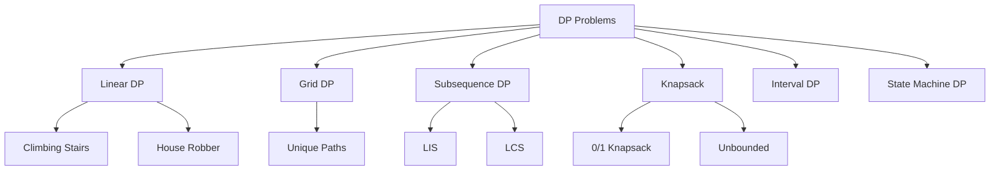
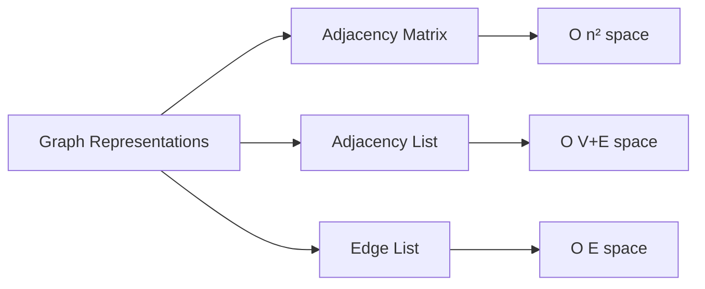
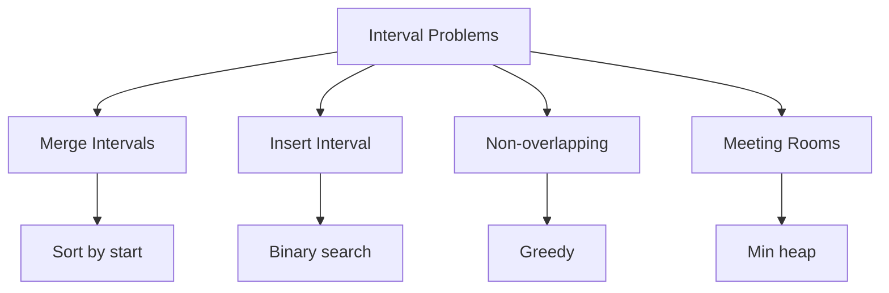
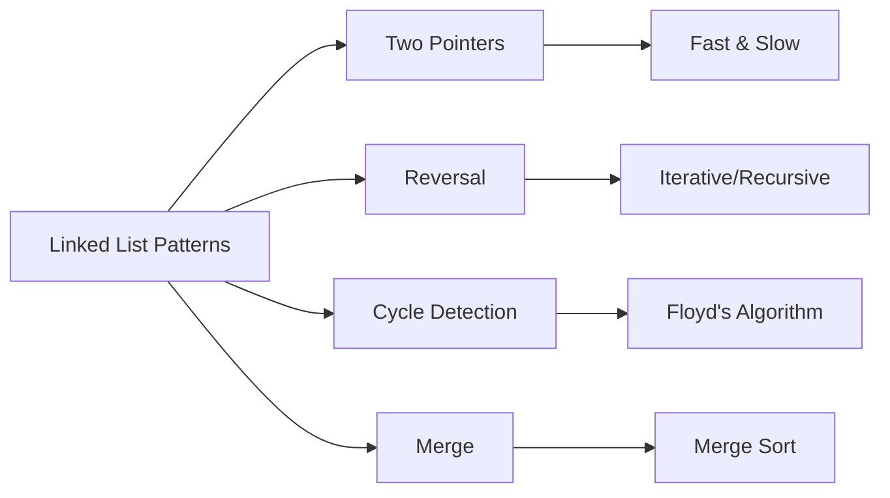
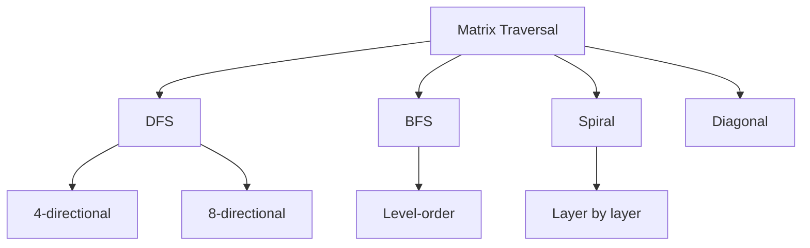
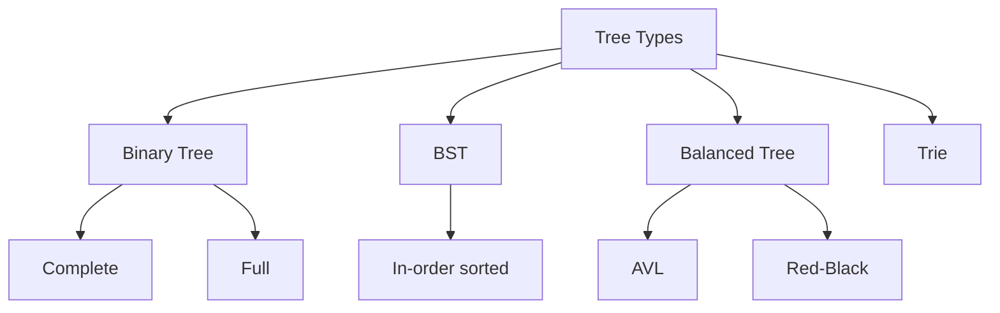
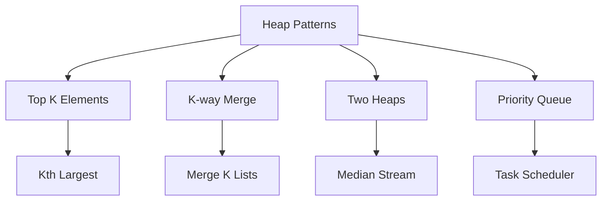
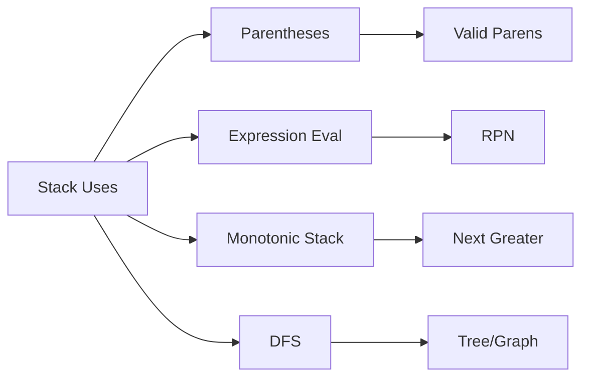
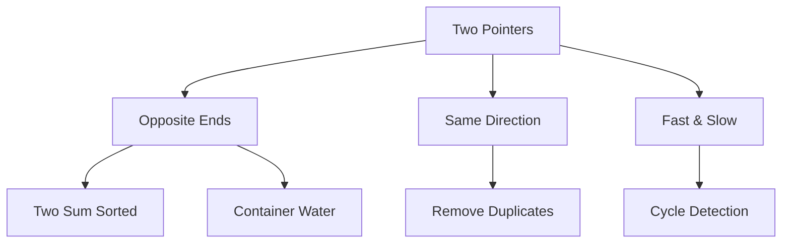
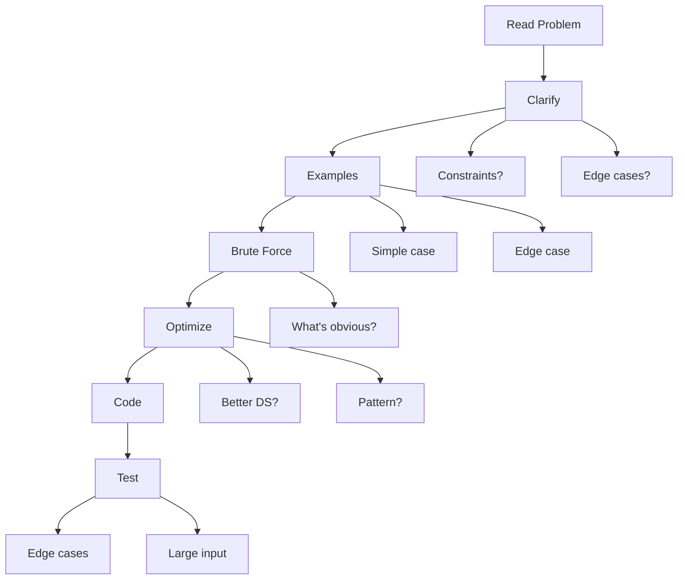

# Data Structures & Algorithms - Leet Code

::: tip Quick Reference
This guide covers essential DSA topics for MAANG interviews with patterns, templates, and complexity analysis.
:::

## Arrays

### Key Concepts
- **Time Complexity**: Access O(1), Search O(n), Insert/Delete O(n)
- **Space Complexity**: O(n)

### Common Patterns

#### 1. Prefix Sum
```python
# Template for prefix sum
def prefix_sum(arr):
    prefix = [0] * (len(arr) + 1)
    for i in range(len(arr)):
        prefix[i + 1] = prefix[i] + arr[i]
    return prefix

# Range sum query [l, r]
def range_sum(prefix, l, r):
    return prefix[r + 1] - prefix[l]
```

#### 2. Kadane's Algorithm (Max Subarray)
```python
def max_subarray(nums):
    max_sum = current_sum = nums[0]
    for num in nums[1:]:
        current_sum = max(num, current_sum + num)
        max_sum = max(max_sum, current_sum)
    return max_sum
```

#### 3. Dutch National Flag (3-way Partition)
```python
def sort_colors(nums):
    low, mid, high = 0, 0, len(nums) - 1
    while mid <= high:
        if nums[mid] == 0:
            nums[low], nums[mid] = nums[mid], nums[low]
            low += 1
            mid += 1
        elif nums[mid] == 1:
            mid += 1
        else:
            nums[mid], nums[high] = nums[high], nums[mid]
            high -= 1
```

### Key Problems
::: details Must-Know Problems
- Two Sum / Three Sum
- Maximum Subarray (Kadane's)
- Product of Array Except Self
- Best Time to Buy and Sell Stock
- Container With Most Water
- Rotate Array
- Find Missing Number
:::

---

## Binary Search

### Template
```python
def binary_search(arr, target):
    left, right = 0, len(arr) - 1
    
    while left <= right:
        mid = left + (right - left) // 2
        
        if arr[mid] == target:
            return mid
        elif arr[mid] < target:
            left = mid + 1
        else:
            right = mid - 1
    
    return -1  # Not found
```

### Variants

#### Find First/Last Position
```python
def find_boundary(arr, target, find_first=True):
    left, right = 0, len(arr) - 1
    result = -1
    
    while left <= right:
        mid = left + (right - left) // 2
        
        if arr[mid] == target:
            result = mid
            if find_first:
                right = mid - 1  # Continue left
            else:
                left = mid + 1   # Continue right
        elif arr[mid] < target:
            left = mid + 1
        else:
            right = mid - 1
    
    return result
```

#### Search in Rotated Array
```python
def search_rotated(nums, target):
    left, right = 0, len(nums) - 1
    
    while left <= right:
        mid = left + (right - left) // 2
        
        if nums[mid] == target:
            return mid
        
        # Left half is sorted
        if nums[left] <= nums[mid]:
            if nums[left] <= target < nums[mid]:
                right = mid - 1
            else:
                left = mid + 1
        # Right half is sorted
        else:
            if nums[mid] < target <= nums[right]:
                left = mid + 1
            else:
                right = mid - 1
    
    return -1
```

### Key Problems
- Binary Search variations
- Search in Rotated Sorted Array
- Find Peak Element
- Sqrt(x)
- Median of Two Sorted Arrays

---

## Dynamic Programming

### Problem Types



### Core Patterns

#### 1. 1D DP Template
```python
def dp_1d(n):
    dp = [0] * (n + 1)
    dp[0] = base_case
    
    for i in range(1, n + 1):
        dp[i] = # transition from previous states
    
    return dp[n]
```

#### 2. 2D DP Template
```python
def dp_2d(m, n):
    dp = [[0] * n for _ in range(m)]
    
    # Initialize base cases
    for i in range(m):
        dp[i][0] = base_case
    
    for i in range(1, m):
        for j in range(1, n):
            dp[i][j] = # transition
    
    return dp[m-1][n-1]
```

#### 3. Longest Increasing Subsequence
```python
# O(n²) approach
def lis_dp(nums):
    if not nums:
        return 0
    
    dp = [1] * len(nums)
    
    for i in range(1, len(nums)):
        for j in range(i):
            if nums[j] < nums[i]:
                dp[i] = max(dp[i], dp[j] + 1)
    
    return max(dp)

# O(n log n) approach with binary search
def lis_optimized(nums):
    sub = []
    
    for num in nums:
        pos = bisect.bisect_left(sub, num)
        if pos == len(sub):
            sub.append(num)
        else:
            sub[pos] = num
    
    return len(sub)
```

#### 4. Longest Common Subsequence
```python
def lcs(text1, text2):
    m, n = len(text1), len(text2)
    dp = [[0] * (n + 1) for _ in range(m + 1)]
    
    for i in range(1, m + 1):
        for j in range(1, n + 1):
            if text1[i-1] == text2[j-1]:
                dp[i][j] = dp[i-1][j-1] + 1
            else:
                dp[i][j] = max(dp[i-1][j], dp[i][j-1])
    
    return dp[m][n]
```

#### 5. 0/1 Knapsack
```python
def knapsack(weights, values, capacity):
    n = len(weights)
    dp = [[0] * (capacity + 1) for _ in range(n + 1)]
    
    for i in range(1, n + 1):
        for w in range(capacity + 1):
            if weights[i-1] <= w:
                dp[i][w] = max(
                    dp[i-1][w],  # Don't take
                    dp[i-1][w-weights[i-1]] + values[i-1]  # Take
                )
            else:
                dp[i][w] = dp[i-1][w]
    
    return dp[n][capacity]
```

#### 6. Edit Distance
```python
def edit_distance(word1, word2):
    m, n = len(word1), len(word2)
    dp = [[0] * (n + 1) for _ in range(m + 1)]
    
    for i in range(m + 1):
        dp[i][0] = i
    for j in range(n + 1):
        dp[0][j] = j
    
    for i in range(1, m + 1):
        for j in range(1, n + 1):
            if word1[i-1] == word2[j-1]:
                dp[i][j] = dp[i-1][j-1]
            else:
                dp[i][j] = 1 + min(
                    dp[i-1][j],    # Delete
                    dp[i][j-1],    # Insert
                    dp[i-1][j-1]   # Replace
                )
    
    return dp[m][n]
```

### Key Problems
::: warning Core DP Problems
- Climbing Stairs
- Coin Change
- House Robber (I, II)
- Longest Increasing Subsequence
- Longest Common Subsequence
- Edit Distance
- Unique Paths
- Word Break
- Partition Equal Subset Sum
- Maximum Product Subarray
:::

---

## Graphs

### Representations



### Graph Traversal

#### DFS Template
```python
# Recursive DFS
def dfs_recursive(graph, node, visited):
    visited.add(node)
    
    for neighbor in graph[node]:
        if neighbor not in visited:
            dfs_recursive(graph, neighbor, visited)

# Iterative DFS
def dfs_iterative(graph, start):
    visited = set()
    stack = [start]
    
    while stack:
        node = stack.pop()
        if node not in visited:
            visited.add(node)
            for neighbor in graph[node]:
                if neighbor not in visited:
                    stack.append(neighbor)
    
    return visited
```

#### BFS Template
```python
from collections import deque

def bfs(graph, start):
    visited = set([start])
    queue = deque([start])
    
    while queue:
        node = queue.popleft()
        
        for neighbor in graph[node]:
            if neighbor not in visited:
                visited.add(neighbor)
                queue.append(neighbor)
    
    return visited
```

### Shortest Path Algorithms

#### Dijkstra's Algorithm
```python
import heapq

def dijkstra(graph, start):
    distances = {node: float('inf') for node in graph}
    distances[start] = 0
    pq = [(0, start)]  # (distance, node)
    
    while pq:
        current_dist, current = heapq.heappop(pq)
        
        if current_dist > distances[current]:
            continue
        
        for neighbor, weight in graph[current]:
            distance = current_dist + weight
            
            if distance < distances[neighbor]:
                distances[neighbor] = distance
                heapq.heappush(pq, (distance, neighbor))
    
    return distances
```

#### Bellman-Ford (Negative Weights)
```python
def bellman_ford(edges, n, start):
    distances = [float('inf')] * n
    distances[start] = 0
    
    # Relax edges n-1 times
    for _ in range(n - 1):
        for u, v, weight in edges:
            if distances[u] + weight < distances[v]:
                distances[v] = distances[u] + weight
    
    # Check for negative cycles
    for u, v, weight in edges:
        if distances[u] + weight < distances[v]:
            return None  # Negative cycle exists
    
    return distances
```

### Topological Sort
```python
def topological_sort_dfs(graph):
    visited = set()
    stack = []
    
    def dfs(node):
        visited.add(node)
        for neighbor in graph[node]:
            if neighbor not in visited:
                dfs(neighbor)
        stack.append(node)
    
    for node in graph:
        if node not in visited:
            dfs(node)
    
    return stack[::-1]

# Kahn's Algorithm (BFS)
def topological_sort_bfs(graph, n):
    in_degree = [0] * n
    for node in graph:
        for neighbor in graph[node]:
            in_degree[neighbor] += 1
    
    queue = deque([i for i in range(n) if in_degree[i] == 0])
    result = []
    
    while queue:
        node = queue.popleft()
        result.append(node)
        
        for neighbor in graph[node]:
            in_degree[neighbor] -= 1
            if in_degree[neighbor] == 0:
                queue.append(neighbor)
    
    return result if len(result) == n else []
```

### Union Find (Disjoint Set)
```python
class UnionFind:
    def __init__(self, n):
        self.parent = list(range(n))
        self.rank = [0] * n
    
    def find(self, x):
        if self.parent[x] != x:
            self.parent[x] = self.find(self.parent[x])  # Path compression
        return self.parent[x]
    
    def union(self, x, y):
        root_x, root_y = self.find(x), self.find(y)
        
        if root_x == root_y:
            return False
        
        # Union by rank
        if self.rank[root_x] < self.rank[root_y]:
            self.parent[root_x] = root_y
        elif self.rank[root_x] > self.rank[root_y]:
            self.parent[root_y] = root_x
        else:
            self.parent[root_y] = root_x
            self.rank[root_x] += 1
        
        return True
```

### Key Problems
- Number of Islands
- Clone Graph
- Course Schedule (I, II)
- Network Delay Time
- Cheapest Flights Within K Stops
- Word Ladder
- Surrounded Regions
- Graph Valid Tree

---

## Intervals

### Common Patterns



#### Merge Intervals
```python
def merge_intervals(intervals):
    if not intervals:
        return []
    
    intervals.sort(key=lambda x: x[0])
    merged = [intervals[0]]
    
    for current in intervals[1:]:
        last = merged[-1]
        
        if current[0] <= last[1]:  # Overlapping
            merged[-1] = [last[0], max(last[1], current[1])]
        else:
            merged.append(current)
    
    return merged
```

#### Insert Interval
```python
def insert_interval(intervals, new_interval):
    result = []
    i = 0
    n = len(intervals)
    
    # Add all intervals before new_interval
    while i < n and intervals[i][1] < new_interval[0]:
        result.append(intervals[i])
        i += 1
    
    # Merge overlapping intervals
    while i < n and intervals[i][0] <= new_interval[1]:
        new_interval[0] = min(new_interval[0], intervals[i][0])
        new_interval[1] = max(new_interval[1], intervals[i][1])
        i += 1
    
    result.append(new_interval)
    
    # Add remaining intervals
    while i < n:
        result.append(intervals[i])
        i += 1
    
    return result
```

#### Meeting Rooms II (Min Rooms Required)
```python
import heapq

def min_meeting_rooms(intervals):
    if not intervals:
        return 0
    
    intervals.sort(key=lambda x: x[0])
    heap = []  # Min heap for end times
    
    heapq.heappush(heap, intervals[0][1])
    
    for i in range(1, len(intervals)):
        if intervals[i][0] >= heap[0]:
            heapq.heappop(heap)
        
        heapq.heappush(heap, intervals[i][1])
    
    return len(heap)
```

### Key Problems
- Merge Intervals
- Insert Interval
- Non-overlapping Intervals
- Meeting Rooms I & II
- Minimum Number of Arrows to Burst Balloons

---

## Linked Lists

### Node Definition
```python
class ListNode:
    def __init__(self, val=0, next=None):
        self.val = val
        self.next = next
```

### Common Patterns



#### Reverse Linked List
```python
# Iterative
def reverse_list(head):
    prev = None
    current = head
    
    while current:
        next_node = current.next
        current.next = prev
        prev = current
        current = next_node
    
    return prev

# Recursive
def reverse_list_recursive(head):
    if not head or not head.next:
        return head
    
    new_head = reverse_list_recursive(head.next)
    head.next.next = head
    head.next = None
    
    return new_head
```

#### Detect Cycle (Floyd's Algorithm)
```python
def has_cycle(head):
    slow = fast = head
    
    while fast and fast.next:
        slow = slow.next
        fast = fast.next.next
        
        if slow == fast:
            return True
    
    return False

def detect_cycle(head):
    slow = fast = head
    
    while fast and fast.next:
        slow = slow.next
        fast = fast.next.next
        
        if slow == fast:
            slow = head
            while slow != fast:
                slow = slow.next
                fast = fast.next
            return slow
    
    return None
```

#### Merge Two Sorted Lists
```python
def merge_two_lists(l1, l2):
    dummy = ListNode(0)
    current = dummy
    
    while l1 and l2:
        if l1.val < l2.val:
            current.next = l1
            l1 = l1.next
        else:
            current.next = l2
            l2 = l2.next
        current = current.next
    
    current.next = l1 or l2
    
    return dummy.next
```

#### Find Middle Node
```python
def find_middle(head):
    slow = fast = head
    
    while fast and fast.next:
        slow = slow.next
        fast = fast.next.next
    
    return slow
```

### Key Problems
- Reverse Linked List (I, II)
- Linked List Cycle (I, II)
- Merge Two Sorted Lists
- Remove Nth Node From End
- Reorder List
- Copy List with Random Pointer
- LRU Cache

---

## Matrix

### Traversal Patterns



#### DFS on Matrix
```python
def dfs_matrix(matrix, i, j, visited):
    if (i < 0 or i >= len(matrix) or 
        j < 0 or j >= len(matrix[0]) or 
        (i, j) in visited):
        return
    
    visited.add((i, j))
    
    # 4-directional
    directions = [(0, 1), (1, 0), (0, -1), (-1, 0)]
    for di, dj in directions:
        dfs_matrix(matrix, i + di, j + dj, visited)
```

#### BFS on Matrix
```python
from collections import deque

def bfs_matrix(matrix, start_i, start_j):
    visited = set()
    queue = deque([(start_i, start_j)])
    visited.add((start_i, start_j))
    
    directions = [(0, 1), (1, 0), (0, -1), (-1, 0)]
    
    while queue:
        i, j = queue.popleft()
        
        for di, dj in directions:
            ni, nj = i + di, j + dj
            
            if (0 <= ni < len(matrix) and 
                0 <= nj < len(matrix[0]) and 
                (ni, nj) not in visited):
                
                visited.add((ni, nj))
                queue.append((ni, nj))
```

#### Spiral Matrix Traversal
```python
def spiral_order(matrix):
    if not matrix:
        return []
    
    result = []
    top, bottom = 0, len(matrix) - 1
    left, right = 0, len(matrix[0]) - 1
    
    while top <= bottom and left <= right:
        # Right
        for j in range(left, right + 1):
            result.append(matrix[top][j])
        top += 1
        
        # Down
        for i in range(top, bottom + 1):
            result.append(matrix[i][right])
        right -= 1
        
        if top <= bottom:
            # Left
            for j in range(right, left - 1, -1):
                result.append(matrix[bottom][j])
            bottom -= 1
        
        if left <= right:
            # Up
            for i in range(bottom, top - 1, -1):
                result.append(matrix[i][left])
            left += 1
    
    return result
```

#### Rotate Matrix 90 Degrees
```python
def rotate(matrix):
    n = len(matrix)
    
    # Transpose
    for i in range(n):
        for j in range(i, n):
            matrix[i][j], matrix[j][i] = matrix[j][i], matrix[i][j]
    
    # Reverse each row
    for i in range(n):
        matrix[i].reverse()
```

### Key Problems
- Spiral Matrix
- Rotate Image
- Set Matrix Zeroes
- Word Search
- Number of Islands
- Pacific Atlantic Water Flow

---

## Strings

### Common Patterns

#### Sliding Window for Substrings
```python
def longest_substring_without_repeating(s):
    char_set = set()
    left = max_len = 0
    
    for right in range(len(s)):
        while s[right] in char_set:
            char_set.remove(s[left])
            left += 1
        
        char_set.add(s[right])
        max_len = max(max_len, right - left + 1)
    
    return max_len
```

#### Two Pointers - Valid Palindrome
```python
def is_palindrome(s):
    left, right = 0, len(s) - 1
    
    while left < right:
        while left < right and not s[left].isalnum():
            left += 1
        while left < right and not s[right].isalnum():
            right -= 1
        
        if s[left].lower() != s[right].lower():
            return False
        
        left += 1
        right -= 1
    
    return True
```

#### String Matching - KMP Algorithm
```python
def kmp_search(text, pattern):
    def compute_lps(pattern):
        lps = [0] * len(pattern)
        length = 0
        i = 1
        
        while i < len(pattern):
            if pattern[i] == pattern[length]:
                length += 1
                lps[i] = length
                i += 1
            else:
                if length != 0:
                    length = lps[length - 1]
                else:
                    lps[i] = 0
                    i += 1
        
        return lps
    
    lps = compute_lps(pattern)
    i = j = 0
    
    while i < len(text):
        if pattern[j] == text[i]:
            i += 1
            j += 1
        
        if j == len(pattern):
            return i - j  # Found at index
        elif i < len(text) and pattern[j] != text[i]:
            if j != 0:
                j = lps[j - 1]
            else:
                i += 1
    
    return -1
```

#### Anagram Check
```python
from collections import Counter

def is_anagram(s, t):
    return Counter(s) == Counter(t)

def group_anagrams(strs):
    anagrams = {}
    
    for s in strs:
        key = ''.join(sorted(s))
        if key not in anagrams:
            anagrams[key] = []
        anagrams[key].append(s)
    
    return list(anagrams.values())
```

### Key Problems
- Longest Substring Without Repeating Characters
- Longest Palindromic Substring
- Valid Anagram / Group Anagrams
- Valid Parentheses
- Longest Common Prefix
- Implement strStr()
- String to Integer (atoi)

---

## Trees

### Tree Node Definition
```python
class TreeNode:
    def __init__(self, val=0, left=None, right=None):
        self.val = val
        self.left = left
        self.right = right
```

### Tree Types



### Traversal Methods

#### DFS Traversals
```python
# Inorder (Left-Root-Right)
def inorder(root):
    result = []
    
    def dfs(node):
        if not node:
            return
        dfs(node.left)
        result.append(node.val)
        dfs(node.right)
    
    dfs(root)
    return result

# Preorder (Root-Left-Right)
def preorder(root):
    result = []
    
    def dfs(node):
        if not node:
            return
        result.append(node.val)
        dfs(node.left)
        dfs(node.right)
    
    dfs(root)
    return result

# Postorder (Left-Right-Root)
def postorder(root):
    result = []
    
    def dfs(node):
        if not node:
            return
        dfs(node.left)
        dfs(node.right)
        result.append(node.val)
    
    dfs(root)
    return result

# Iterative Inorder
def inorder_iterative(root):
    result = []
    stack = []
    current = root
    
    while current or stack:
        while current:
            stack.append(current)
            current = current.left
        
        current = stack.pop()
        result.append(current.val)
        current = current.right
    
    return result
```

#### BFS (Level Order)
```python
from collections import deque

def level_order(root):
    if not root:
        return []
    
    result = []
    queue = deque([root])
    
    while queue:
        level_size = len(queue)
        level = []
        
        for _ in range(level_size):
            node = queue.popleft()
            level.append(node.val)
            
            if node.left:
                queue.append(node.left)
            if node.right:
                queue.append(node.right)
        
        result.append(level)
    
    return result
```

### Common Tree Problems

#### Maximum Depth
```python
def max_depth(root):
    if not root:
        return 0
    return 1 + max(max_depth(root.left), max_depth(root.right))
```

#### Validate BST
```python
def is_valid_bst(root):
    def validate(node, low, high):
        if not node:
            return True
        
        if not (low < node.val < high):
            return False
        
        return (validate(node.left, low, node.val) and 
                validate(node.right, node.val, high))
    
    return validate(root, float('-inf'), float('inf'))
```

#### Lowest Common Ancestor
```python
def lowest_common_ancestor(root, p, q):
    if not root or root == p or root == q:
        return root
    
    left = lowest_common_ancestor(root.left, p, q)
    right = lowest_common_ancestor(root.right, p, q)
    
    if left and right:
        return root
    
    return left or right
```

#### Diameter of Binary Tree
```python
def diameter_of_binary_tree(root):
    diameter = 0
    
    def height(node):
        nonlocal diameter
        if not node:
            return 0
        
        left = height(node.left)
        right = height(node.right)
        
        diameter = max(diameter, left + right)
        
        return 1 + max(left, right)
    
    height(root)
    return diameter
```

#### Serialize and Deserialize
```python
def serialize(root):
    def dfs(node):
        if not node:
            return ['null']
        return [str(node.val)] + dfs(node.left) + dfs(node.right)
    
    return ','.join(dfs(root))

def deserialize(data):
    def dfs(nodes):
        val = next(nodes)
        if val == 'null':
            return None
        
        node = TreeNode(int(val))
        node.left = dfs(nodes)
        node.right = dfs(nodes)
        return node
    
    return dfs(iter(data.split(',')))
```

### Key Problems
::: details Binary Tree Problems
- Maximum Depth
- Invert Binary Tree
- Symmetric Tree
- Diameter of Binary Tree
- Path Sum
- Lowest Common Ancestor
- Binary Tree Level Order Traversal
- Validate Binary Search Tree
- Kth Smallest Element in BST
- Serialize and Deserialize Binary Tree
- Binary Tree Maximum Path Sum
:::

---

## Heaps

### Heap Implementation
```python
import heapq

# Python heapq is min heap by default
# For max heap, negate values

class MaxHeap:
    def __init__(self):
        self.heap = []
    
    def push(self, val):
        heapq.heappush(self.heap, -val)
    
    def pop(self):
        return -heapq.heappop(self.heap)
    
    def peek(self):
        return -self.heap[0] if self.heap else None
```

### Common Patterns



#### Top K Elements
```python
def top_k_frequent(nums, k):
    from collections import Counter
    count = Counter(nums)
    # Use min heap of size k
    return heapq.nlargest(k, count.keys(), key=count.get)

def kth_largest(nums, k):
    # Maintain min heap of size k
    heap = []
    for num in nums:
        heapq.heappush(heap, num)
        if len(heap) > k:
            heapq.heappop(heap)
    return heap[0]
```

#### Merge K Sorted Lists
```python
def merge_k_sorted_lists(lists):
    min_heap = []
    
    # Initialize heap with first element from each list
    for i, lst in enumerate(lists):
        if lst:
            heapq.heappush(min_heap, (lst.val, i, lst))
    
    dummy = ListNode(0)
    current = dummy
    
    while min_heap:
        val, i, node = heapq.heappop(min_heap)
        current.next = node
        current = current.next
        
        if node.next:
            heapq.heappush(min_heap, (node.next.val, i, node.next))
    
    return dummy.next
```

#### Find Median from Data Stream (Two Heaps)
```python
class MedianFinder:
    def __init__(self):
        self.small = []  # Max heap (left half)
        self.large = []  # Min heap (right half)
    
    def add_num(self, num):
        # Add to max heap (small)
        heapq.heappush(self.small, -num)
        
        # Balance: move largest from small to large
        heapq.heappush(self.large, -heapq.heappop(self.small))
        
        # Maintain size property
        if len(self.small) < len(self.large):
            heapq.heappush(self.small, -heapq.heappop(self.large))
    
    def find_median(self):
        if len(self.small) > len(self.large):
            return -self.small[0]
        return (-self.small[0] + self.large[0]) / 2.0
```

### Key Problems
- Kth Largest Element
- Top K Frequent Elements
- Merge K Sorted Lists
- Find Median from Data Stream
- Task Scheduler
- Meeting Rooms II

---

## Stack & Queue

### Stack Applications



#### Valid Parentheses
```python
def is_valid(s):
    stack = []
    mapping = {')': '(', '}': '{', ']': '['}
    
    for char in s:
        if char in mapping:
            top = stack.pop() if stack else '#'
            if mapping[char] != top:
                return False
        else:
            stack.append(char)
    
    return not stack
```

#### Monotonic Stack - Next Greater Element
```python
def next_greater_elements(nums):
    n = len(nums)
    result = [-1] * n
    stack = []
    
    for i in range(2 * n):
        while stack and nums[stack[-1]] < nums[i % n]:
            result[stack.pop()] = nums[i % n]
        
        if i < n:
            stack.append(i)
    
    return result
```

#### Largest Rectangle in Histogram
```python
def largest_rectangle_area(heights):
    stack = []
    max_area = 0
    heights.append(0)  # Sentinel
    
    for i, h in enumerate(heights):
        while stack and heights[stack[-1]] > h:
            height = heights[stack.pop()]
            width = i if not stack else i - stack[-1] - 1
            max_area = max(max_area, height * width)
        stack.append(i)
    
    return max_area
```

### Queue Applications

#### Implement Queue using Stacks
```python
class MyQueue:
    def __init__(self):
        self.input_stack = []
        self.output_stack = []
    
    def push(self, x):
        self.input_stack.append(x)
    
    def pop(self):
        self._transfer()
        return self.output_stack.pop()
    
    def peek(self):
        self._transfer()
        return self.output_stack[-1]
    
    def _transfer(self):
        if not self.output_stack:
            while self.input_stack:
                self.output_stack.append(self.input_stack.pop())
```

### Key Problems
- Valid Parentheses
- Min Stack
- Evaluate Reverse Polish Notation
- Daily Temperatures
- Trapping Rain Water
- Largest Rectangle in Histogram

---

## Sliding Window

### Template
```python
def sliding_window_template(s):
    window = {}
    left = right = 0
    
    while right < len(s):
        # Add s[right] to window
        c = s[right]
        window[c] = window.get(c, 0) + 1
        right += 1
        
        # Shrink window if needed
        while window_needs_shrink:
            # Remove s[left] from window
            d = s[left]
            window[d] -= 1
            left += 1
        
        # Update result
    
    return result
```

### Common Problems

#### Minimum Window Substring
```python
def min_window(s, t):
    from collections import Counter
    
    need = Counter(t)
    window = {}
    left = right = 0
    valid = 0
    start, length = 0, float('inf')
    
    while right < len(s):
        c = s[right]
        right += 1
        
        if c in need:
            window[c] = window.get(c, 0) + 1
            if window[c] == need[c]:
                valid += 1
        
        while valid == len(need):
            if right - left < length:
                start = left
                length = right - left
            
            d = s[left]
            left += 1
            
            if d in need:
                if window[d] == need[d]:
                    valid -= 1
                window[d] -= 1
        
    return "" if length == float('inf') else s[start:start + length]
```

#### Longest Substring with At Most K Distinct
```python
def length_of_longest_substring_k_distinct(s, k):
    window = {}
    left = max_len = 0
    
    for right in range(len(s)):
        window[s[right]] = window.get(s[right], 0) + 1
        
        while len(window) > k:
            window[s[left]] -= 1
            if window[s[left]] == 0:
                del window[s[left]]
            left += 1
        
        max_len = max(max_len, right - left + 1)
    
    return max_len
```

### Key Problems
- Longest Substring Without Repeating Characters
- Minimum Window Substring
- Sliding Window Maximum
- Permutation in String
- Find All Anagrams in String

---

## Two Pointers

### Patterns



#### Two Sum - Sorted Array
```python
def two_sum_sorted(numbers, target):
    left, right = 0, len(numbers) - 1
    
    while left < right:
        current_sum = numbers[left] + numbers[right]
        
        if current_sum == target:
            return [left + 1, right + 1]
        elif current_sum < target:
            left += 1
        else:
            right -= 1
    
    return []
```

#### Three Sum
```python
def three_sum(nums):
    nums.sort()
    result = []
    
    for i in range(len(nums) - 2):
        if i > 0 and nums[i] == nums[i - 1]:
            continue
        
        left, right = i + 1, len(nums) - 1
        
        while left < right:
            total = nums[i] + nums[left] + nums[right]
            
            if total < 0:
                left += 1
            elif total > 0:
                right -= 1
            else:
                result.append([nums[i], nums[left], nums[right]])
                
                while left < right and nums[left] == nums[left + 1]:
                    left += 1
                while left < right and nums[right] == nums[right - 1]:
                    right -= 1
                
                left += 1
                right -= 1
    
    return result
```

#### Remove Duplicates from Sorted Array
```python
def remove_duplicates(nums):
    if not nums:
        return 0
    
    slow = 0
    
    for fast in range(1, len(nums)):
        if nums[fast] != nums[slow]:
            slow += 1
            nums[slow] = nums[fast]
    
    return slow + 1
```

### Key Problems
- Two Sum (sorted)
- Three Sum
- Container With Most Water
- Trapping Rain Water
- Remove Duplicates
- Move Zeroes

---

## Backtracking

### Template
```python
def backtrack_template(path, choices):
    if meet_condition:
        result.add(path)
        return
    
    for choice in choices:
        # Make choice
        path.add(choice)
        
        # Recurse
        backtrack_template(path, new_choices)
        
        # Undo choice (backtrack)
        path.remove(choice)
```

### Common Problems

#### Subsets
```python
def subsets(nums):
    result = []
    
    def backtrack(start, path):
        result.append(path[:])
        
        for i in range(start, len(nums)):
            path.append(nums[i])
            backtrack(i + 1, path)
            path.pop()
    
    backtrack(0, [])
    return result
```

#### Permutations
```python
def permute(nums):
    result = []
    
    def backtrack(path):
        if len(path) == len(nums):
            result.append(path[:])
            return
        
        for num in nums:
            if num in path:
                continue
            
            path.append(num)
            backtrack(path)
            path.pop()
    
    backtrack([])
    return result
```

#### Combination Sum
```python
def combination_sum(candidates, target):
    result = []
    
    def backtrack(start, path, total):
        if total == target:
            result.append(path[:])
            return
        
        if total > target:
            return
        
        for i in range(start, len(candidates)):
            path.append(candidates[i])
            backtrack(i, path, total + candidates[i])
            path.pop()
    
    backtrack(0, [], 0)
    return result
```

#### N-Queens
```python
def solve_n_queens(n):
    result = []
    board = [['.'] * n for _ in range(n)]
    
    def is_valid(row, col):
        # Check column
        for i in range(row):
            if board[i][col] == 'Q':
                return False
        
        # Check diagonal
        i, j = row - 1, col - 1
        while i >= 0 and j >= 0:
            if board[i][j] == 'Q':
                return False
            i -= 1
            j -= 1
        
        # Check anti-diagonal
        i, j = row - 1, col + 1
        while i >= 0 and j < n:
            if board[i][j] == 'Q':
                return False
            i -= 1
            j += 1
        
        return True
    
    def backtrack(row):
        if row == n:
            result.append([''.join(row) for row in board])
            return
        
        for col in range(n):
            if is_valid(row, col):
                board[row][col] = 'Q'
                backtrack(row + 1)
                board[row][col] = '.'
    
    backtrack(0)
    return result
```

### Key Problems
- Subsets / Subsets II
- Permutations / Permutations II
- Combination Sum (I, II, III)
- Generate Parentheses
- N-Queens
- Word Search
- Palindrome Partitioning

---

## Complexity Cheat Sheet

### Time Complexities

| Operation | Array | Linked List | BST (avg) | Hash Table | Heap |
|-----------|-------|-------------|-----------|------------|------|
| Access | O(1) | O(n) | O(log n) | O(1) | O(1) |
| Search | O(n) | O(n) | O(log n) | O(1) | O(n) |
| Insert | O(n) | O(1) | O(log n) | O(1) | O(log n) |
| Delete | O(n) | O(1) | O(log n) | O(1) | O(log n) |

### Sorting Algorithms

| Algorithm | Best | Average | Worst | Space | Stable |
|-----------|------|---------|-------|-------|--------|
| Quick Sort | O(n log n) | O(n log n) | O(n²) | O(log n) | No |
| Merge Sort | O(n log n) | O(n log n) | O(n log n) | O(n) | Yes |
| Heap Sort | O(n log n) | O(n log n) | O(n log n) | O(1) | No |
| Bubble Sort | O(n) | O(n²) | O(n²) | O(1) | Yes |
| Insertion Sort | O(n) | O(n²) | O(n²) | O(1) | Yes |

---

## Problem-Solving Framework



### Interview Tips

::: tip Approach
1. **Listen carefully** - Note all constraints
2. **Ask clarifying questions** - Input range, edge cases, duplicates
3. **Think out loud** - Explain your thought process
4. **Start with brute force** - Show you can solve it
5. **Optimize** - Identify bottlenecks
6. **Test** - Walk through examples, edge cases
7. **Analyze** - Time and space complexity
:::

::: warning Common Mistakes
- Not clarifying problem requirements
- Jumping to code without planning
- Ignoring edge cases
- Not testing the solution
- Poor variable naming
- Not analyzing complexity
:::

---

## Quick Reference Patterns

| Problem Type | Pattern | Example |
|-------------|---------|---------|
| Subarray sum | Prefix sum | Maximum subarray |
| Substring | Sliding window | Longest substring |
| Two elements sum | Two pointers | Two sum sorted |
| K elements | Heap | Top K frequent |
| Graph traversal | BFS/DFS | Number of islands |
| Tree path | DFS + backtrack | Path sum |
| Overlapping intervals | Sort + merge | Merge intervals |
| Cycle detection | Fast & slow pointer | Linked list cycle |
| Shortest path | BFS | Word ladder |
| Connected components | Union find | Number of islands |

---

## Additional Resources

::: info Study Plan
**Week 1-2**: Arrays, Strings, Two Pointers
**Week 3-4**: Linked Lists, Stacks, Queues
**Week 5-6**: Trees, Binary Search
**Week 7-8**: Graphs, Dynamic Programming
**Week 9-10**: Heaps, Advanced DP, System Design
:::

**Practice Platforms:**
- LeetCode (focus on top 150)
- NeetCode 150
- Blind 75

**Key Metrics:**
- Solve 200+ problems
- 50+ medium problems
- 20+ hard problems
- Mock interviews weekly