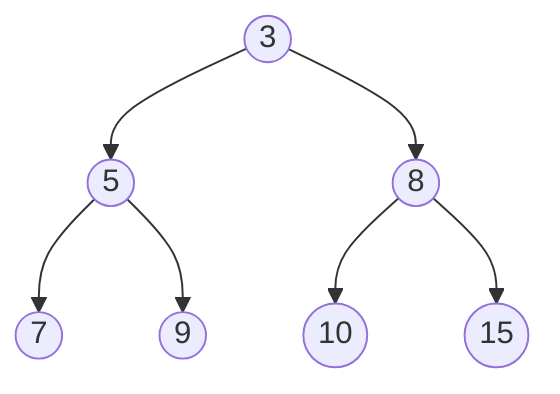
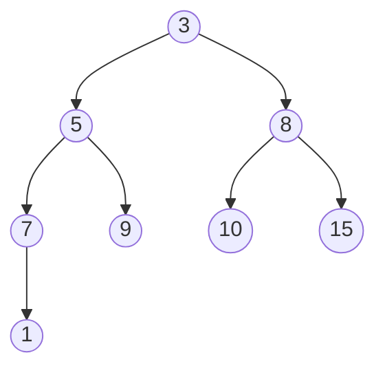
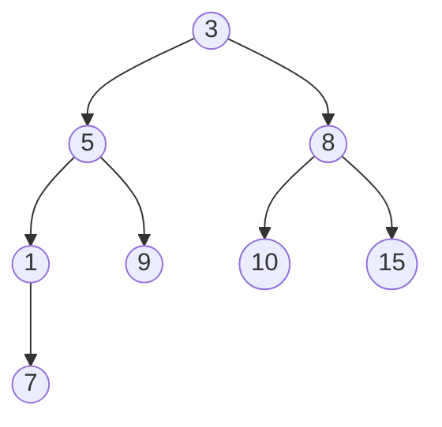

# ✅ Min-Heap Insert (Trickle Up) — Tree Visualization

### **Step 0 — Before Insert**

---

### **Step 1 — Insert 1 at the bottom**

---

### **Step 2 — 1 < 7 → Swap**

---

### **Step 3 — 1 < 8 → Swap**

---

### **Step 4 — 1 < 3 → Final Swap**

---

## ✔ These all render correctly

— No nested subgraphs
— No invalid structures
— Mermaid-compatible tree layout
— Easy to follow swaps

---

If you'd like, I can combine them into:
✨ A carousel-style sequence
✨ A side-by-side array + tree representation
✨ A compact animation-like flow

Just tell me!
