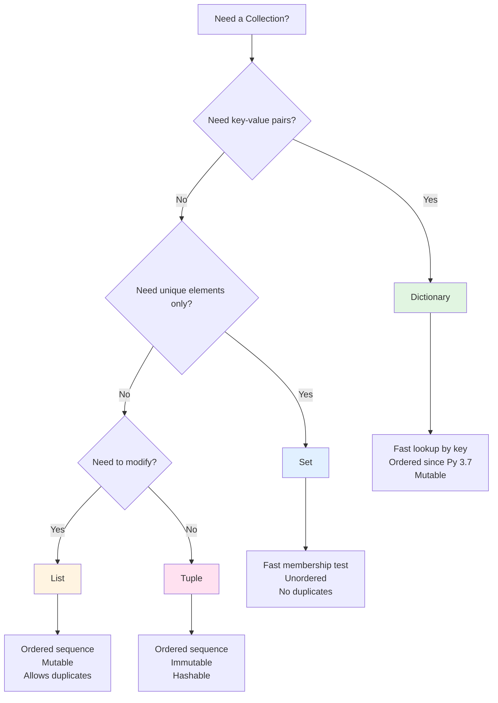

# Python Learning Guide

## Introduction to Python

Python is a high-level, interpreted programming language created by Guido van Rossum in 1991. It emphasizes code readability and simplicity, making it an ideal language for beginners while remaining powerful enough for advanced applications.

::: info Why Python?
**Philosophy**: Python follows the "Zen of Python" - a collection of guiding principles emphasizing simplicity, readability, and explicitness. Type `import this` in Python to see them all.

**Key Characteristics**:
- **Interpreted Language**: Code is executed line-by-line at runtime without prior compilation
- **Dynamically Typed**: Variable types are determined automatically during execution
- **Strong Typing**: Once assigned, types don't change implicitly (no automatic string-to-number conversion)
- **Multi-paradigm**: Supports procedural, object-oriented, and functional programming styles
- **Extensive Standard Library**: "Batteries included" philosophy with built-in modules for common tasks
:::

### How Python Works

::: details Execution Model
When you run a Python program:

1. **Source Code** (.py files) → Written by you
2. **Compilation** → Python compiles to bytecode (.pyc files)
3. **Python Virtual Machine (PVM)** → Interprets and executes bytecode
4. **Output** → Results displayed or processed

Unlike compiled languages (C, C++), Python doesn't create standalone executables. The interpreter must be present to run your code.
:::

## Getting Started

### Installation

::: code-group
```bash [Windows]
# Download from python.org
python --version
pip --version
```

```bash [macOS/Linux]
# Check if installed
python3 --version
pip3 --version

# Install via package manager (macOS)
brew install python

# Install via package manager (Ubuntu/Debian)
sudo apt update
sudo apt install python3 python3-pip
```
:::

### First Program

```python
print("Hello, World!")
```

::: tip Interactive Python
Use the Python REPL (Read-Eval-Print Loop) for quick testing:
```bash
python3
>>> print("Hello!")
>>> exit()
```
:::

## Variables and Data Types

### Understanding Variables

In Python, variables are **references** to objects in memory, not containers holding values. When you write `x = 10`, you're creating an integer object `10` in memory and making `x` point to it.

```python
# Variable assignment
x = 10              # x references integer object 10
y = x               # y references the same object
z = 10              # z references the same object (Python optimizes this)

# Check if they reference the same object
print(id(x))        # Memory address
print(x is y)       # True - same object
```

::: warning Variable Naming Rules
- Must start with letter or underscore: `name`, `_private`
- Can contain letters, numbers, underscores: `user_123`, `total_sum`
- Case-sensitive: `Name` ≠ `name`
- Cannot use reserved keywords: `if`, `for`, `class`, etc.
- Use `snake_case` for variables and functions (PEP 8 convention)
:::

### Basic Data Types

```python
# Numeric Types
integer = 42                    # int - unlimited precision
floating = 3.14159              # float - double precision
complex_num = 2 + 3j            # complex - real + imaginary

# Text Type
name = "Python"                 # str - immutable sequence of characters
multiline = """Multiple
lines of text"""                # Triple quotes for multiline

# Boolean Type
is_true = True                  # bool - True or False (note capitalization)
is_false = False

# None Type
empty = None                    # NoneType - represents absence of value
```

::: info Type System Explained
Python's type system is:

- **Dynamic**: Types are checked at runtime, not compile time
- **Strong**: Type errors are caught (can't add string + integer without conversion)
- **Duck Typed**: "If it walks like a duck and quacks like a duck, it's a duck" - objects are defined by behavior, not explicit type declarations
:::

### Type Checking and Conversion

```python
# Check types
print(type(42))                 # <class 'int'>
print(isinstance(42, int))      # True - recommended way

# Type conversion (casting)
num = int("100")                # String to integer
text = str(42)                  # Integer to string
decimal = float("3.14")         # String to float
bool_val = bool(1)              # Any type to boolean

# Be careful with conversions
int("hello")                    # ValueError!
int(3.9)                        # 3 (truncates, doesn't round)
```

## Collections: Deep Dive

Python provides four fundamental collection types, each with distinct characteristics and use cases. Understanding when to use each is crucial for writing efficient code.

### Collection Theory

::: info Memory and Performance
Collections in Python are implemented as:

- **Lists**: Dynamic arrays that can grow/shrink
- **Tuples**: Fixed-size arrays (immutable)
- **Dictionaries**: Hash tables with O(1) average lookup
- **Sets**: Hash tables storing only keys

**Time Complexity**:
| Operation | List | Tuple | Dict | Set |
|-----------|------|-------|------|-----|
| Access by index | O(1) | O(1) | - | - |
| Access by key | - | - | O(1) | - |
| Append/Add | O(1) | - | O(1) | O(1) |
| Insert | O(n) | - | - | - |
| Search | O(n) | O(n) | O(1) | O(1) |
| Delete | O(n) | - | O(1) | O(1) |
:::

### Lists: Ordered Mutable Sequences

Lists are Python's most versatile collection type. They maintain insertion order, allow duplicates, and can be modified after creation.

```python
# Creating lists
empty_list = []
numbers = [1, 2, 3, 4, 5]
mixed = [1, "hello", 3.14, True]        # Can hold different types
nested = [[1, 2], [3, 4], [5, 6]]       # Lists within lists

# Adding elements
fruits = ["apple", "banana"]
fruits.append("cherry")                  # Add to end - O(1)
fruits.insert(0, "mango")                # Insert at index - O(n)
fruits.extend(["orange", "grape"])       # Add multiple - O(k)

# Removing elements
fruits.remove("banana")                  # Remove first occurrence - O(n)
last = fruits.pop()                      # Remove and return last - O(1)
first = fruits.pop(0)                    # Remove and return by index - O(n)
del fruits[1]                            # Delete by index
fruits.clear()                           # Remove all elements

# Accessing elements
numbers = [10, 20, 30, 40, 50]
print(numbers[0])                        # First element: 10
print(numbers[-1])                       # Last element: 50
print(numbers[1:4])                      # Slice [20, 30, 40]
print(numbers[::2])                      # Every second: [10, 30, 50]
print(numbers[::-1])                     # Reverse: [50, 40, 30, 20, 10]

# List operations
numbers = [3, 1, 4, 1, 5]
print(len(numbers))                      # Length: 5
print(1 in numbers)                      # Membership: True
print(numbers.count(1))                  # Count occurrences: 2
print(numbers.index(4))                  # Find index: 2

numbers.sort()                           # Sort in place
numbers.reverse()                        # Reverse in place
sorted_nums = sorted(numbers)            # Return sorted copy
reversed_nums = list(reversed(numbers))  # Return reversed copy
```

::: details List Comprehensions - Advanced
List comprehensions provide a concise way to create lists based on existing sequences.

```python
# Basic syntax: [expression for item in iterable if condition]

# Generate squares
squares = [x**2 for x in range(10)]
# [0, 1, 4, 9, 16, 25, 36, 49, 64, 81]

# Filter and transform
evens = [x for x in range(20) if x % 2 == 0]
# [0, 2, 4, 6, 8, 10, 12, 14, 16, 18]

# Nested loops
pairs = [(x, y) for x in range(3) for y in range(3)]
# [(0,0), (0,1), (0,2), (1,0), (1,1), (1,2), (2,0), (2,1), (2,2)]

# Conditional expression
result = [x if x % 2 == 0 else -x for x in range(5)]
# [0, -1, 2, -3, 4]

# Flatten nested list
nested = [[1, 2], [3, 4], [5, 6]]
flat = [num for sublist in nested for num in sublist]
# [1, 2, 3, 4, 5, 6]
```
:::

::: tip When to Use Lists
✅ Use lists when you need:
- Ordered collection with index access
- Ability to modify elements (mutable)
- Allow duplicate values
- Dynamic size that can grow/shrink
- Stack or queue operations

❌ Avoid lists when you need:
- Fast membership testing (use sets)
- Key-value associations (use dictionaries)
- Immutable data (use tuples)
:::

### Tuples: Immutable Ordered Sequences

Tuples are similar to lists but cannot be modified after creation. This immutability makes them faster, hashable (can be dictionary keys), and suitable for protecting data.

```python
# Creating tuples
empty_tuple = ()
single = (42,)                           # Note the comma!
coordinates = (10, 20)
rgb = (255, 128, 0)
mixed = (1, "hello", 3.14)

# Accessing elements (same as lists)
print(coordinates[0])                    # 10
print(rgb[-1])                           # 0
print(mixed[1:])                         # ("hello", 3.14)

# Tuple unpacking
x, y = coordinates                       # x=10, y=20
r, g, b = rgb                            # r=255, g=128, b=0

# Extended unpacking
first, *middle, last = (1, 2, 3, 4, 5)  # first=1, middle=[2,3,4], last=5

# Tuple operations
t = (1, 2, 3)
print(len(t))                            # 3
print(2 in t)                            # True
print(t.count(2))                        # 1
print(t.index(3))                        # 2
combined = t + (4, 5)                    # (1, 2, 3, 4, 5)
repeated = t * 3                         # (1, 2, 3, 1, 2, 3, 1, 2, 3)

# Named tuples (from collections module)
from collections import namedtuple

Point = namedtuple('Point', ['x', 'y'])
p = Point(10, 20)
print(p.x, p.y)                          # 10 20
print(p[0], p[1])                        # 10 20 (still indexable)
```

::: info Why Immutability Matters
**Benefits of tuples over lists**:

1. **Performance**: Tuples are faster to create and iterate
2. **Safety**: Cannot be accidentally modified
3. **Hashable**: Can be used as dictionary keys or set elements
4. **Memory**: Slightly more memory efficient

```python
# Tuples as dictionary keys
locations = {
    (0, 0): "origin",
    (1, 0): "right",
    (0, 1): "up"
}

# Lists cannot be dictionary keys
# locations = {[0, 0]: "origin"}  # TypeError!
```
:::

::: tip When to Use Tuples
✅ Use tuples when you need:
- Immutable data that shouldn't change
- Dictionary keys or set elements
- Function return multiple values
- Slightly better performance than lists
- Data integrity protection

❌ Avoid tuples when you need:
- Frequent modifications (use lists)
- Only one element and might add more later
:::

### Dictionaries: Key-Value Mappings

Dictionaries are Python's implementation of hash tables, providing fast key-based lookups. They maintain insertion order (since Python 3.7) and are fundamental to Python's internals.

```python
# Creating dictionaries
empty_dict = {}
person = {
    "name": "Alice",
    "age": 30,
    "city": "New York"
}

# Using dict() constructor
person2 = dict(name="Bob", age=25, city="London")
from_pairs = dict([("a", 1), ("b", 2)])

# Adding and modifying
person["email"] = "alice@example.com"    # Add new key
person["age"] = 31                       # Update existing key
person.update({"phone": "123-456", "age": 32})  # Update multiple

# Accessing values
print(person["name"])                    # "Alice" - KeyError if missing
print(person.get("name"))                # "Alice"
print(person.get("country", "USA"))      # "USA" (default value)
print(person.setdefault("job", "Engineer"))  # Set if doesn't exist

# Removing elements
del person["email"]                      # Delete key
age = person.pop("age")                  # Remove and return value
person.pop("missing", None)              # Safe removal with default
last = person.popitem()                  # Remove and return last item
person.clear()                           # Remove all

# Dictionary views (live, dynamic)
person = {"name": "Alice", "age": 30, "city": "New York"}
keys = person.keys()                     # dict_keys(['name', 'age', 'city'])
values = person.values()                 # dict_values(['Alice', 30, 'New York'])
items = person.items()                   # dict_items([('name', 'Alice'), ...])

# Iterating
for key in person:                       # Iterate over keys
    print(key, person[key])

for key, value in person.items():        # Iterate over key-value pairs
    print(f"{key}: {value}")

for value in person.values():            # Iterate over values
    print(value)

# Checking membership
print("name" in person)                  # True - checks keys
print("Alice" in person.values())        # True - checks values

# Dictionary comprehension
squares = {x: x**2 for x in range(5)}
# {0: 0, 1: 1, 2: 4, 3: 9, 4: 16}

# Filter dictionary
person = {"name": "Alice", "age": 30, "city": "New York"}
filtered = {k: v for k, v in person.items() if isinstance(v, str)}
# {'name': 'Alice', 'city': 'New York'}
```

::: details Advanced Dictionary Techniques

**Nested Dictionaries**:
```python
users = {
    "user1": {"name": "Alice", "age": 30},
    "user2": {"name": "Bob", "age": 25}
}
print(users["user1"]["name"])            # "Alice"
```

**Default Dictionaries**:
```python
from collections import defaultdict

# Regular dict - need to check if key exists
word_count = {}
for word in ["apple", "banana", "apple"]:
    if word in word_count:
        word_count[word] += 1
    else:
        word_count[word] = 1

# defaultdict - automatic default values
word_count = defaultdict(int)            # default value: 0
for word in ["apple", "banana", "apple"]:
    word_count[word] += 1                # No checking needed
```

**Counter - Specialized Dictionary**:
```python
from collections import Counter

words = ["apple", "banana", "apple", "cherry", "banana", "apple"]
count = Counter(words)
print(count)                             # Counter({'apple': 3, 'banana': 2, 'cherry': 1})
print(count.most_common(2))              # [('apple', 3), ('banana', 2)]
```

**Merging Dictionaries**:
```python
dict1 = {"a": 1, "b": 2}
dict2 = {"c": 3, "d": 4}

# Python 3.9+
merged = dict1 | dict2                   # {'a': 1, 'b': 2, 'c': 3, 'd': 4}

# Python 3.5+
merged = {**dict1, **dict2}

# Update in place
dict1.update(dict2)
```
:::

::: tip When to Use Dictionaries
✅ Use dictionaries when you need:
- Fast lookups by key (O(1) average)
- Key-value associations
- Data modeling (like JSON objects)
- Caching and memoization
- Counting or grouping data

❌ Avoid dictionaries when you need:
- Ordered by value (use sorted lists)
- Only checking membership (use sets)
- Sequential access without keys
:::

### Sets: Unordered Unique Collections

Sets are unordered collections of unique elements implemented as hash tables. They excel at membership testing, removing duplicates, and mathematical set operations.

```python
# Creating sets
empty_set = set()                        # {} creates an empty dict!
numbers = {1, 2, 3, 4, 5}
from_list = set([1, 2, 2, 3, 3, 3])     # {1, 2, 3} - duplicates removed

# Adding elements
numbers.add(6)                           # Add single element
numbers.update([7, 8, 9])                # Add multiple
numbers.update({10}, [11, 12])           # Multiple iterables

# Removing elements
numbers.remove(5)                        # Remove - KeyError if missing
numbers.discard(5)                       # Remove - no error if missing
numbers.pop()                            # Remove arbitrary element
numbers.clear()                          # Remove all

# Set operations
a = {1, 2, 3, 4, 5}
b = {4, 5, 6, 7, 8}

# Union (all elements from both sets)
print(a | b)                             # {1, 2, 3, 4, 5, 6, 7, 8}
print(a.union(b))                        # Same

# Intersection (common elements)
print(a & b)                             # {4, 5}
print(a.intersection(b))                 # Same

# Difference (in a but not in b)
print(a - b)                             # {1, 2, 3}
print(a.difference(b))                   # Same

# Symmetric difference (in either but not both)
print(a ^ b)                             # {1, 2, 3, 6, 7, 8}
print(a.symmetric_difference(b))         # Same

# Subset and superset
c = {1, 2}
print(c <= a)                            # True - c is subset of a
print(c.issubset(a))                     # True
print(a >= c)                            # True - a is superset of c
print(a.issuperset(c))                   # True

# Disjoint (no common elements)
d = {10, 11}
print(a.isdisjoint(d))                   # True

# Membership testing (very fast!)
print(3 in a)                            # True - O(1) average
print(10 in a)                           # False

# Frozen sets (immutable sets)
immutable = frozenset([1, 2, 3])
# Can be used as dictionary keys or set elements
nested = {frozenset([1, 2]), frozenset([3, 4])}

# Set comprehension
squares = {x**2 for x in range(10)}
even_squares = {x**2 for x in range(10) if x % 2 == 0}
```

::: info Set Mathematics
Sets in Python implement mathematical set theory:

**Properties**:
- **Idempotent**: `A ∪ A = A`
- **Commutative**: `A ∪ B = B ∪ A`
- **Associative**: `(A ∪ B) ∪ C = A ∪ (B ∪ C)`
- **Distributive**: `A ∩ (B ∪ C) = (A ∩ B) ∪ (A ∩ C)`

**De Morgan's Laws**:
```python
a = {1, 2, 3}
b = {3, 4, 5}
universal = {1, 2, 3, 4, 5, 6}

# (A ∪ B)' = A' ∩ B'
not_union = universal - (a | b)
not_a_and_not_b = (universal - a) & (universal - b)
print(not_union == not_a_and_not_b)      # True
```
:::

::: tip When to Use Sets
✅ Use sets when you need:
- Remove duplicates from sequence
- Fast membership testing (O(1))
- Mathematical set operations
- Unique elements only
- Doesn't matter about order

❌ Avoid sets when you need:
- Maintain insertion order (use dict keys)
- Index access (use lists)
- Allow duplicates
- Store unhashable items (lists, dicts)
:::

### Collections Comparison Chart



### Collection Selection Guide

| Need | Use | Why |
|------|-----|-----|
| Store ordered items | **List** or **Tuple** | Index access, maintains order |
| Protect data from changes | **Tuple** | Immutable, hashable |
| Fast lookup by key | **Dictionary** | O(1) average lookup |
| Remove duplicates | **Set** | Automatically unique |
| Fast membership testing | **Set** | O(1) average contains check |
| JSON-like data structure | **Dictionary** | Key-value pairs |
| Mathematical set operations | **Set** | Union, intersection, etc. |
| Function return multiple values | **Tuple** | Convention for multiple returns |
| Stack (LIFO) | **List** | append() and pop() |
| Queue (FIFO) | **collections.deque** | Efficient popleft() |

## Control Flow

### Conditional Statements

```python
age = 18

if age < 13:
    print("Child")
elif age < 20:
    print("Teenager")
else:
    print("Adult")

# Ternary operator (conditional expression)
status = "Adult" if age >= 18 else "Minor"

# Multiple conditions
if age >= 18 and age < 65:
    print("Working age")

if age < 13 or age > 65:
    print("Dependent")
```

::: warning Indentation is Syntax
Python uses indentation (4 spaces recommended) to define code blocks. Unlike other languages that use braces `{}`, indentation is not just style—it's part of the syntax.

```python
# Correct
if True:
    print("Indented")
    print("Still in block")

# Wrong - IndentationError
if True:
print("No indent")
```
:::

### Loops

**For Loop** - Iterate over sequences:
```python
# Iterate over list
for fruit in ["apple", "banana", "cherry"]:
    print(fruit)

# Range - generate numbers
for i in range(5):                       # 0, 1, 2, 3, 4
    print(i)

for i in range(2, 10):                   # 2 through 9
    print(i)

for i in range(0, 10, 2):                # 0, 2, 4, 6, 8 (step of 2)
    print(i)

# Enumerate - get index and value
for index, fruit in enumerate(["apple", "banana"]):
    print(f"{index}: {fruit}")

# Zip - iterate multiple sequences
names = ["Alice", "Bob"]
ages = [30, 25]
for name, age in zip(names, ages):
    print(f"{name} is {age}")
```

**While Loop** - Continue while condition is true:
```python
count = 0
while count < 5:
    print(count)
    count += 1

# Infinite loop with break
while True:
    user_input = input("Enter 'quit' to exit: ")
    if user_input == 'quit':
        break
```

**Loop Control Statements**:
```python
for i in range(10):
    if i == 3:
        continue                         # Skip rest of iteration
    if i == 7:
        break                            # Exit loop entirely
    print(i)
else:
    print("Loop completed normally")     # Executes if no break
```

## Functions

### Function Basics

Functions are reusable blocks of code that perform specific tasks. They help organize code, promote reusability, and make programs easier to understand.

```python
# Simple function
def greet(name):
    """Greet a person by name."""      # Docstring - function documentation
    return f"Hello, {name}!"

# Call function
message = greet("Alice")
print(message)                           # "Hello, Alice!"

# Function without return (returns None)
def say_hello():
    print("Hello!")

result = say_hello()                     # Prints "Hello!"
print(result)                            # None

# Multiple return values (actually returns a tuple)
def get_coordinates():
    return 10, 20

x, y = get_coordinates()                 # Tuple unpacking
```

### Function Parameters

```python
# Default parameters
def power(base, exponent=2):
    """Calculate base raised to exponent."""
    return base ** exponent

print(power(5))                          # 25 (uses default exponent=2)
print(power(5, 3))                       # 125

# Keyword arguments
def describe_pet(animal, name, age=None):
    info = f"{name} is a {animal}"
    if age:
        info += f" and is {age} years old"
    print(info)

describe_pet("dog", "Buddy")             # Positional
describe_pet(name="Buddy", animal="dog") # Keyword
describe_pet("dog", name="Buddy", age=3) # Mixed

# Variable positional arguments (*args)
def sum_all(*numbers):
    """Sum any number of arguments."""
    return sum(numbers)

print(sum_all(1, 2, 3))                  # 6
print(sum_all(1, 2, 3, 4, 5))            # 15

# Variable keyword arguments (**kwargs)
def print_info(**info):
    """Print all keyword arguments."""
    for key, value in info.items():
        print(f"{key}: {value}")

print_info(name="Alice", age=30, city="NYC")

# Combining all parameter types
def complex_function(pos1, pos2, default=10, *args, **kwargs):
    print(f"Positional: {pos1}, {pos2}")
    print(f"Default: {default}")
    print(f"*args: {args}")
    print(f"**kwargs: {kwargs}")

complex_function(1, 2, 3, 4, 5, key1="a", key2="b")
```

::: details Lambda Functions
Lambda functions are small anonymous functions defined with the `lambda` keyword. They're useful for simple operations but should be used sparingly for readability.

```python
# Lambda syntax: lambda parameters: expression

# Simple lambda
square = lambda x: x ** 2
print(square(5))                         # 25

# Multiple parameters
add = lambda x, y: x + y
print(add(3, 4))                         # 7

# With map() - apply function to all elements
numbers = [1, 2, 3, 4, 5]
squared = list(map(lambda x: x**2, numbers))
print(squared)                           # [1, 4, 9, 16, 25]

# With filter() - keep elements where function returns True
evens = list(filter(lambda x: x % 2 == 0, numbers))
print(evens)                             # [2, 4]

# With sorted() - custom sorting
pairs = [(1, 'one'), (3, 'three'), (2, 'two')]
sorted_pairs = sorted(pairs, key=lambda x: x[1])
print(sorted_pairs)                      # [(1, 'one'), (3, 'three'), (2, 'two')]

# When to prefer regular functions
# Bad - hard to understand
result = (lambda x: (lambda y: x + y))(10)(20)

# Good - clear and readable
def add(x):
    def inner(y):
        return x + y
    return inner
result = add(10)(20)
```
:::

## Object-Oriented Programming

### Classes and Objects

Object-Oriented Programming (OOP) is a paradigm that organizes code around objects (data + behavior) rather than functions and logic. Python supports full OOP with classes, inheritance, encapsulation, and polymorphism.

```python
class Dog:
    """Represents a dog with a name and age."""
    
    # Class variable (shared by all instances)
    species = "Canis familiaris"
    
    # Constructor - initializes new objects
    def __init__(self, name, age):
        """Initialize dog with name and age."""
        self.name = name                 # Instance variable
        self.age = age                   # Instance variable
    
    # Instance method
    def bark(self):
        """Make the dog bark."""
        return f"{self.name} says Woof!"
    
    def birthday(self):
        """Increment dog's age."""
        self.age += 1
    
    # String representation
    def __str__(self):
        """Return human-readable string."""
        return f"{self.name} is {self.age} years old"
    
    # Object representation
    def __repr__(self):
        """Return developer-friendly string."""
        return f"Dog(name='{self.name}', age={self.age})"

# Create objects (instances)
buddy = Dog("Buddy", 3)
max_dog = Dog("Max", 5)

# Access attributes
print(buddy.name)                        # "Buddy"
print(buddy.species)                     # "Canis familiaris"

# Call methods
print(buddy.bark())                      # "Buddy says Woof!"
buddy.birthday()
print(buddy.age)                         # 4

print(str(buddy))                        # "Buddy is 4 years old"
print(repr(buddy))                       # "Dog(name='Buddy', age=4)"
```

### Inheritance

Inheritance allows creating new classes based on existing classes, promoting code reuse and establishing hierarchical relationships between classes.

```python
# Base class (parent)
class Animal:
    """Base class for all animals."""
    
    def __init__(self, name, age):
        self.name = name
        self.age = age
    
    def speak(self):
        """Make animal sound - to be overridden."""
        raise NotImplementedError("Subclass must implement speak()")
    
    def info(self):
        """Return basic animal info."""
        return f"{self.name} is {self.age} years old"

# Derived classes (children)
class Dog(Animal):
    """Dog inherits from Animal."""
    
    def __init__(self, name, age, breed):
        super().__init__(name, age)      # Call parent constructor
        self.breed = breed
    
    def speak(self):
        """Override parent method."""
        return f"{self.name} says Woof!"
    
    def fetch(self):
        """Dog-specific method."""
        return f"{self.name} fetches the ball!"

class Cat(Animal):
    """Cat inherits from Animal."""
    
    def speak(self):
        return f"{self.name} says Meow!"
    
    def scratch(self):
        return f"{self.name} scratches the furniture!"

# Usage
dog = Dog("Buddy", 3, "Golden Retriever")
cat = Cat("Whiskers", 2)

print(dog.info())                        # From Animal class
print(dog.speak())                       # From Dog class
print(dog.fetch())                       # Dog-specific

print(cat.info())                        # From Animal class
print(cat.speak())                       # From Cat class

# Polymorphism - same method, different behavior
animals = [dog, cat]
for animal in animals:
    print(animal.speak())                # Calls appropriate method
```

::: info OOP Principles

**Encapsulation**: Bundling data and methods that operate on that data
```python
class BankAccount:
    def __init__(self, balance):
        self.__balance = balance         # Private attribute (name mangling)
    
    def deposit(self, amount):
        if amount > 0:
            self.__balance += amount
    
    def get_balance(self):
        return self.__balance
```

**Inheritance**: Creating new classes from existing ones
- **Single inheritance**: One parent class
- **Multiple inheritance**: Multiple parent classes (use with caution)

**Polymorphism**: Same interface, different implementations
- Method overriding in child classes
- Duck typing - "if it walks like a duck..."

**Abstraction**: Hiding complex implementation details
- Abstract base classes with `abc` module
:::

## File Handling

### Reading Files

```python
# Best practice: using context manager (with statement)
with open("file.txt", "r") as file:
    content = file.read()                # Read entire file
# File automatically closed after with block

# Read line by line (memory efficient for large files)
with open("file.txt", "r") as file:
    for line in file:
        print(line.strip())              # Remove newline characters

# Read all lines into list
with open("file.txt", "r") as file:
    lines = file.readlines()             # List of lines

# Read specific number of characters
with open("file.txt", "r") as file:
    chunk = file.read(100)               # Read first 100 characters
```

### Writing Files

```python
# Write mode (overwrites existing file)
with open("output.txt", "w") as file:
    file.write("Hello, World!\n")
    file.write("Second line\n")

# Write multiple lines
lines = ["Line 1\n", "Line 2\n", "Line 3\n"]
with open("output.txt", "w") as file:
    file.writelines(lines)

# Append mode (adds to existing file)
with open("output.txt", "a") as file:
    file.write("Appended line\n")

# Writing with print
with open("output.txt", "w") as file:
    print("Using print function", file=file)
```

::: danger File Modes
| Mode | Description | Creates | Truncates | Read | Write |
|------|-------------|---------|-----------|------|-------|
| `'r'` | Read (default) | No | No | ✓ | ✗ |
| `'w'` | Write | Yes | Yes | ✗ | ✓ |
| `'a'` | Append | Yes | No | ✗ | ✓ |
| `'r+'` | Read and write | No | No | ✓ | ✓ |
| `'w+'` | Write and read | Yes | Yes | ✓ | ✓ |
| `'a+'` | Append and read | Yes | No | ✓ | ✓ |
| `'rb'` | Read binary | No | No | ✓ | ✗ |
| `'wb'` | Write binary | Yes | Yes | ✗ | ✓ |
:::

### Working with Paths

```python
from pathlib import Path

# Create path object
file_path = Path("data/file.txt")

# Check if file exists
if file_path.exists():
    print("File exists")

# Get file info
print(file_path.name)                    # "file.txt"
print(file_path.stem)                    # "file"
print(file_path.suffix)                  # ".txt"
print(file_path.parent)                  # "data"

# Read/write with Path
content = file_path.read_text()          # Read entire file
file_path.write_text("New content")      # Write to file

# List directory contents
directory = Path(".")
for item in directory.iterdir():
    print(item)

# Create directory
new_dir = Path("new_folder")
new_dir.mkdir(exist_ok=True)             # Create if doesn't exist
```

## Exception Handling

Exceptions are events that disrupt normal program flow. Proper exception handling makes programs more robust and user-friendly.

```python
# Basic try-except
try:
    result = 10 / 0
except ZeroDivisionError:
    print("Cannot divide by zero!")

# Multiple exception types
try:
    number = int(input("Enter a number: "))
    result = 10 / number
except ValueError:
    print("Invalid input! Please enter a number.")
except ZeroDivisionError:
    print("Cannot divide by zero!")

# Catch multiple exceptions together
try:
    # risky operation
    pass
except (ValueError, TypeError) as e:
    print(f"Error occurred: {e}")

# Generic exception handler (use sparingly)
try:
    # risky operation
    pass
except Exception as e:
    print(f"An error occurred: {e}")

# else clause (executes if no exception)
try:
    result = 10 / 2
except ZeroDivisionError:
    print("Error!")
else:
    print(f"Result: {result}")           # Executes if no exception

# finally clause (always executes)
try:
    file = open("data.txt", "r")
    content = file.read()
except FileNotFoundError:
    print("File not found")
finally:
    file.close()                         # Always closes file

# Raising exceptions
def validate_age(age):
    if age < 0:
        raise ValueError("Age cannot be negative")
    if age > 150:
        raise ValueError("Age seems invalid")
    return age

# Custom exceptions
class InsufficientFundsError(Exception):
    """Raised when account has insufficient funds."""
    pass

class BankAccount:
    def __init__(self, balance):
        self.balance = balance
    
    def withdraw(self, amount):
        if amount > self.balance:
            raise InsufficientFundsError("Not enough money")
        self.balance -= amount
```

::: info Common Exceptions

| Exception | When It Occurs |
|-----------|----------------|
| `ValueError` | Function receives argument of correct type but invalid value |
| `TypeError` | Operation applied to object of inappropriate type |
| `KeyError` | Dictionary key not found |
| `IndexError` | Sequence index out of range |
| `FileNotFoundError` | File or directory doesn't exist |
| `ZeroDivisionError` | Division or modulo by zero |
| `AttributeError` | Attribute reference or assignment fails |
| `ImportError` | Import statement fails |
| `NameError` | Variable name not found |
| `RuntimeError` | Generic error during execution |
:::

## Modules and Packages

### Understanding Modules

A module is a file containing Python code (functions, classes, variables). Modules help organize code and promote reusability.

```python
# Import entire module
import math
print(math.sqrt(16))                     # 4.0
print(math.pi)                           # 3.141592653589793

# Import specific items
from math import sqrt, pi, pow
print(sqrt(16))                          # No need for math. prefix

# Import with alias
import numpy as np
import pandas as pd

# Import all (not recommended - can cause naming conflicts)
from math import *

# View module contents
import math
print(dir(math))                         # List all attributes/functions
```

### Creating Your Own Modules

**mymodule.py:**
```python
"""My custom module for greetings."""

# Module-level variable
VERSION = "1.0.0"

# Function
def greet(name):
    """Greet a person by name."""
    return f"Hello, {name}!"

def farewell(name):
    """Say goodbye to a person."""
    return f"Goodbye, {name}!"

# Class
class Greeter:
    def __init__(self, greeting="Hello"):
        self.greeting = greeting
    
    def greet(self, name):
        return f"{self.greeting}, {name}!"

# Code that runs only when module is executed directly
if __name__ == "__main__":
    print("Testing module...")
    print(greet("Alice"))
```

**main.py:**
```python
import mymodule

print(mymodule.VERSION)                  # "1.0.0"
print(mymodule.greet("Bob"))             # "Hello, Bob!"

greeter = mymodule.Greeter("Hi")
print(greeter.greet("Charlie"))          # "Hi, Charlie!"
```

### Package Structure

A package is a directory containing modules and a special `__init__.py` file.

```
mypackage/
├── __init__.py
├── module1.py
├── module2.py
└── subpackage/
    ├── __init__.py
    └── module3.py
```

**Usage:**
```python
# Import from package
from mypackage import module1
from mypackage.subpackage import module3

# Import specific items
from mypackage.module1 import function_name
```

## Built-in Functions Reference

```python
# Input/Output
print("Hello")                           # Output to console
name = input("Enter name: ")             # Get user input (returns string)

# Type Conversion
int("42")                                # String to integer
float("3.14")                            # String to float
str(42)                                  # Any type to string
bool(1)                                  # Any type to boolean
list((1, 2, 3))                          # Tuple to list
tuple([1, 2, 3])                         # List to tuple
dict([("a", 1), ("b", 2)])               # List of pairs to dict
set([1, 2, 2, 3])                        # List to set (removes duplicates)

# Math Operations
abs(-5)                                  # Absolute value: 5
pow(2, 3)                                # Power: 8 (same as 2**3)
round(3.14159, 2)                        # Round to 2 decimals: 3.14
max(1, 5, 3)                             # Maximum: 5
min(1, 5, 3)                             # Minimum: 1
sum([1, 2, 3])                           # Sum: 6

# Sequence Operations
len([1, 2, 3])                           # Length: 3
sorted([3, 1, 2])                        # Return sorted list: [1, 2, 3]
reversed([1, 2, 3])                      # Return reversed iterator
list(range(5))                           # Create list: [0, 1, 2, 3, 4]

# Iteration Helpers
enumerate(['a', 'b', 'c'])               # Get (index, value) pairs
zip([1, 2], ['a', 'b'])                  # Combine iterables: [(1,'a'), (2,'b')]
map(str.upper, ['a', 'b'])               # Apply function to each element
filter(lambda x: x > 0, [-1, 0, 1, 2])   # Filter elements: [1, 2]

# Type Checking
type(42)                                 # Get type: <class 'int'>
isinstance(42, int)                      # Check type: True
isinstance("hello", (str, int))          # Check multiple types: True

# Object Inspection
dir(object)                              # List attributes and methods
help(function)                           # Display documentation
id(object)                               # Get memory address
hasattr(obj, 'attr')                     # Check if attribute exists
getattr(obj, 'attr', default)            # Get attribute value

# Other Useful Functions
all([True, True, False])                 # All true? False
any([False, False, True])                # Any true? True
chr(65)                                  # Number to character: 'A'
ord('A')                                 # Character to number: 65
eval("2 + 3")                            # Evaluate string as code: 5 (use carefully!)
exec("x = 5")                            # Execute string as code (use carefully!)
```

## Advanced Topics

### Comprehensions

```python
# List comprehension
squares = [x**2 for x in range(10)]
evens = [x for x in range(20) if x % 2 == 0]
matrix = [[i*j for j in range(3)] for i in range(3)]

# Dictionary comprehension
square_dict = {x: x**2 for x in range(5)}
filtered = {k: v for k, v in {"a": 1, "b": 2}.items() if v > 1}

# Set comprehension
unique_lengths = {len(word) for word in ["hello", "world", "hi"]}

# Generator expression (memory efficient)
squares_gen = (x**2 for x in range(1000000))  # Doesn't create entire list
```

### Decorators

Decorators are functions that modify the behavior of other functions.

```python
# Simple decorator
def my_decorator(func):
    def wrapper():
        print("Before function call")
        func()
        print("After function call")
    return wrapper

@my_decorator
def say_hello():
    print("Hello!")

say_hello()
# Output:
# Before function call
# Hello!
# After function call

# Decorator with arguments
def repeat(times):
    def decorator(func):
        def wrapper(*args, **kwargs):
            for _ in range(times):
                result = func(*args, **kwargs)
            return result
        return wrapper
    return decorator

@repeat(3)
def greet(name):
    print(f"Hello, {name}!")

greet("Alice")  # Prints greeting 3 times
```

### Generators

Generators are functions that yield values one at a time, useful for memory-efficient iteration.

```python
# Generator function
def countdown(n):
    while n > 0:
        yield n
        n -= 1

for num in countdown(5):
    print(num)  # 5, 4, 3, 2, 1

# Generator expression
squares = (x**2 for x in range(10))
print(next(squares))  # 0
print(next(squares))  # 1

# Infinite generator
def infinite_sequence():
    num = 0
    while True:
        yield num
        num += 1

gen = infinite_sequence()
print(next(gen))  # 0
print(next(gen))  # 1
```

## Best Practices

::: tip PEP 8 Style Guide

**Naming Conventions:**
- `snake_case` for functions and variables: `calculate_total`, `user_name`
- `PascalCase` for class names: `BankAccount`, `UserProfile`
- `UPPER_CASE` for constants: `MAX_SIZE`, `API_KEY`
- `_leading_underscore` for internal use: `_internal_method`
- `__double_leading` for name mangling: `__private_var`

**Code Layout:**
- 4 spaces per indentation level (not tabs)
- Maximum line length: 79 characters
- Two blank lines between top-level functions and classes
- One blank line between methods in a class
- Imports at top of file, grouped: standard library, third-party, local

**Comments:**
- Comments should explain "why", not "what"
- Use docstrings for functions, classes, and modules
- Keep comments up-to-date with code changes
:::

::: info Code Organization

**Typical Python File Structure:**
```python
"""Module docstring describing purpose."""

# 1. Standard library imports
import os
import sys

# 2. Third-party imports
import numpy as np
import pandas as pd

# 3. Local imports
from mymodule import myfunction

# 4. Constants
MAX_CONNECTIONS = 100
DEFAULT_TIMEOUT = 30

# 5. Exception classes
class CustomError(Exception):
    pass

# 6. Other classes
class MyClass:
    pass

# 7. Functions
def my_function():
    pass

# 8. Main execution
if __name__ == "__main__":
    main()
```
:::

::: warning Common Pitfalls

**Mutable Default Arguments:**
```python
# Bad - list is created once and shared
def append_to_list(item, my_list=[]):
    my_list.append(item)
    return my_list

# Good - create new list each time
def append_to_list(item, my_list=None):
    if my_list is None:
        my_list = []
    my_list.append(item)
    return my_list
```

**Checking for None:**
```python
# Bad
if variable == None:
    pass

# Good
if variable is None:
    pass
```

**Checking for Empty:**
```python
# Bad
if len(my_list) == 0:
    pass

# Good - relies on truthiness
if not my_list:
    pass
```
:::

## Essential Libraries

| Library | Purpose | Example Use |
|---------|---------|-------------|
| `numpy` | Numerical computing, arrays | `import numpy as np` |
| `pandas` | Data manipulation, analysis | `import pandas as pd` |
| `matplotlib` | Data visualization, plotting | `import matplotlib.pyplot as plt` |
| `requests` | HTTP requests, web APIs | `import requests` |
| `flask` | Web framework (lightweight) | Web applications |
| `django` | Web framework (full-featured) | Large web applications |
| `sqlite3` | Built-in database | Local data storage |
| `json` | JSON encoding/decoding | API data, config files |
| `csv` | CSV file handling | Spreadsheet data |
| `datetime` | Date and time manipulation | Timestamps, scheduling |
| `re` | Regular expressions | Pattern matching |
| `os` | Operating system interface | File operations, paths |
| `sys` | System-specific parameters | Command-line args |

## Python Cheat Sheet

```python
# Variables
x = 10
name = "Python"

# Collections
my_list = [1, 2, 3]
my_tuple = (1, 2, 3)
my_dict = {"key": "value"}
my_set = {1, 2, 3}

# Control Flow
if condition:
    pass
elif other_condition:
    pass
else:
    pass

# Loops
for item in sequence:
    pass

while condition:
    pass

# Functions
def function_name(param1, param2=default):
    return result

# Classes
class ClassName:
    def __init__(self, param):
        self.param = param
    
    def method(self):
        pass

# Exception Handling
try:
    risky_operation()
except SpecificError as e:
    handle_error(e)
finally:
    cleanup()

# File I/O
with open("file.txt", "r") as f:
    content = f.read()

# Common Patterns
if __name__ == "__main__":
    main()

# List Comprehension
result = [x*2 for x in range(10) if x % 2 == 0]

# String Formatting
f"Hello, {name}!"
```

## Next Steps

::: details Advanced Topics to Explore

**Core Python:**
- Decorators and function wrappers
- Context managers and `with` statement
- Generators and iterators
- Metaclasses and descriptors
- Type hints and annotations (Python 3.5+)
- Async/await and asynchronous programming

**Testing and Quality:**
- Unit testing with `unittest` or `pytest`
- Test-driven development (TDD)
- Code coverage and linting
- Documentation with Sphinx

**Development Tools:**
- Virtual environments (`venv`, `virtualenv`)
- Package management (`pip`, `poetry`)
- Version control (Git)
- Debugging techniques

**Specialized Topics:**
- Web development (Django, Flask, FastAPI)
- Data science (NumPy, Pandas, Scikit-learn)
- Machine learning (TensorFlow, PyTorch)
- Web scraping (BeautifulSoup, Scrapy)
- GUI development (Tkinter, PyQt)
- API development (REST, GraphQL)
- Database integration (SQLAlchemy)
:::

## Useful Resources

::: tip Learning Resources
- **Official Documentation**: [python.org/docs](https://docs.python.org/)
- **PEP 8 Style Guide**: [pep8.org](https://pep8.org/)
- **Real Python**: Tutorials and articles
- **Python Package Index**: [pypi.org](https://pypi.org/)
- **GitHub**: Explore open-source Python projects
:::

---

**Happy Coding! 🐍**

*Remember: Python emphasizes readability and simplicity. Write code that others (and future you) can understand easily!*