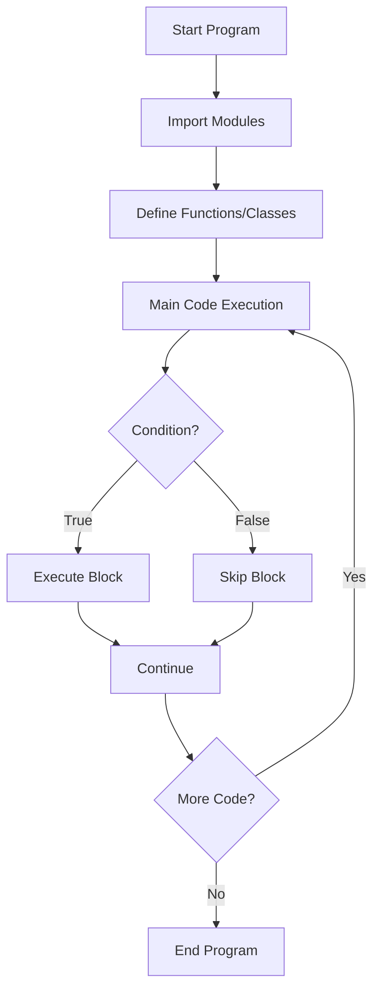
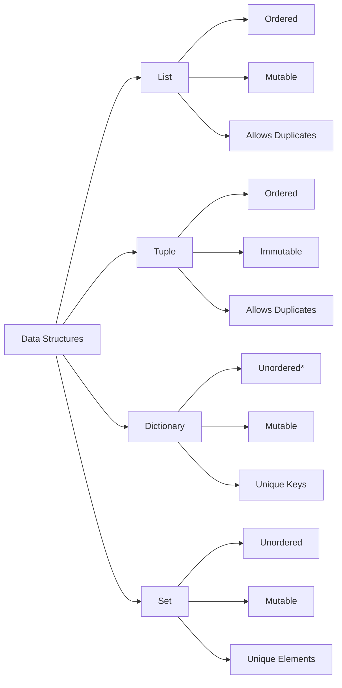
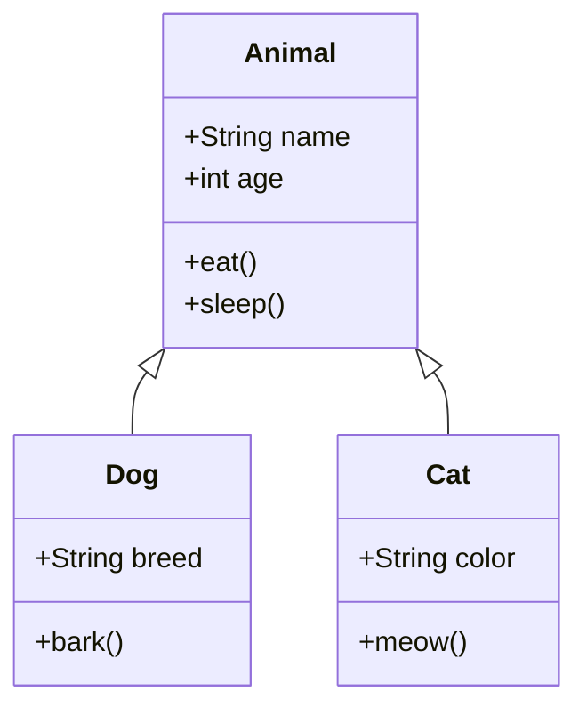

# Python Learning Guide

## Introduction to Python

Python is a high-level, interpreted programming language known for its simplicity and readability. It's widely used in web development, data science, automation, and more.

::: info Key Features
- **Easy to Learn**: Simple, English-like syntax
- **Interpreted**: No compilation needed
- **Dynamically Typed**: Variable types determined at runtime
- **Versatile**: Used in web, data science, AI, automation
:::

## Getting Started

### Installation

::: code-group
```bash [Windows]
# Download from python.org
python --version
```

```bash [macOS/Linux]
# Often pre-installed, or use package manager
python3 --version
```
:::

### First Program

```python
print("Hello, World!")
```

## Variables and Data Types

### Basic Types

```python
# Numbers
integer = 42
floating = 3.14
complex_num = 2 + 3j

# Strings
name = "Python"
multiline = """Multiple
lines"""

# Boolean
is_true = True
is_false = False

# None
empty = None
```

::: tip Type Checking
Use `type()` to check variable types:
```python
print(type(42))  # <class 'int'>
```
:::

### Type Conversion

```python
# String to integer
num = int("100")

# Integer to string
text = str(42)

# String to float
decimal = float("3.14")
```

## Data Structures

### Lists (Mutable)

```python
fruits = ["apple", "banana", "cherry"]

# Operations
fruits.append("orange")      # Add to end
fruits.insert(0, "mango")    # Insert at index
fruits.remove("banana")      # Remove item
fruits.pop()                 # Remove last item
fruits[0]                    # Access by index
fruits[1:3]                  # Slicing
len(fruits)                  # Length
```

### Tuples (Immutable)

```python
coordinates = (10, 20)
rgb = (255, 128, 0)

# Unpacking
x, y = coordinates
```

### Dictionaries (Key-Value Pairs)

```python
person = {
    "name": "Alice",
    "age": 30,
    "city": "New York"
}

# Operations
person["email"] = "alice@example.com"  # Add
person.get("name")                      # Get value
person.keys()                           # All keys
person.values()                         # All values
person.items()                          # Key-value pairs
```

### Sets (Unique Elements)

```python
numbers = {1, 2, 3, 4, 5}

# Operations
numbers.add(6)
numbers.remove(3)
numbers.union({7, 8})
numbers.intersection({4, 5, 6})
```

## Control Flow

### Conditional Statements

```python
age = 18

if age < 13:
    print("Child")
elif age < 20:
    print("Teenager")
else:
    print("Adult")
```

::: warning Indentation Matters
Python uses indentation (4 spaces) to define code blocks. Incorrect indentation causes errors.
:::

### Loops

**For Loop:**
```python
# Iterate over sequence
for fruit in ["apple", "banana", "cherry"]:
    print(fruit)

# Range
for i in range(5):        # 0 to 4
    print(i)

for i in range(2, 10, 2): # Start, stop, step
    print(i)
```

**While Loop:**
```python
count = 0
while count < 5:
    print(count)
    count += 1
```

**Loop Control:**
```python
for i in range(10):
    if i == 3:
        continue  # Skip this iteration
    if i == 7:
        break     # Exit loop
    print(i)
```

## Functions

### Defining Functions

```python
def greet(name):
    """Function to greet a person"""
    return f"Hello, {name}!"

# Call function
message = greet("Alice")
```

### Function Parameters

```python
# Default parameters
def power(base, exponent=2):
    return base ** exponent

power(5)      # 25 (uses default)
power(5, 3)   # 125

# Keyword arguments
def describe_pet(animal, name):
    print(f"{name} is a {animal}")

describe_pet(name="Buddy", animal="dog")

# Variable arguments
def sum_all(*args):
    return sum(args)

sum_all(1, 2, 3, 4)  # 10

# Keyword variable arguments
def print_info(**kwargs):
    for key, value in kwargs.items():
        print(f"{key}: {value}")

print_info(name="Alice", age=30)
```

### Lambda Functions

```python
# Anonymous functions
square = lambda x: x ** 2
add = lambda x, y: x + y

# Often used with map, filter
numbers = [1, 2, 3, 4, 5]
squares = list(map(lambda x: x**2, numbers))
evens = list(filter(lambda x: x % 2 == 0, numbers))
```

## Object-Oriented Programming

### Classes and Objects

```python
class Dog:
    # Class variable
    species = "Canis familiaris"
    
    # Constructor
    def __init__(self, name, age):
        self.name = name    # Instance variable
        self.age = age
    
    # Instance method
    def bark(self):
        return f"{self.name} says Woof!"
    
    # String representation
    def __str__(self):
        return f"{self.name} is {self.age} years old"

# Create object
my_dog = Dog("Buddy", 3)
print(my_dog.bark())
```

### Inheritance

```python
class Animal:
    def __init__(self, name):
        self.name = name
    
    def speak(self):
        pass

class Cat(Animal):
    def speak(self):
        return f"{self.name} says Meow!"

class Dog(Animal):
    def speak(self):
        return f"{self.name} says Woof!"

# Usage
cat = Cat("Whiskers")
print(cat.speak())
```

::: tip Encapsulation
Use `_variable` for protected and `__variable` for private attributes (convention).
:::

## File Handling

### Reading Files

```python
# Method 1: Using with (recommended)
with open("file.txt", "r") as file:
    content = file.read()

# Method 2: Read line by line
with open("file.txt", "r") as file:
    for line in file:
        print(line.strip())

# Method 3: Read all lines
with open("file.txt", "r") as file:
    lines = file.readlines()
```

### Writing Files

```python
# Write mode (overwrites)
with open("output.txt", "w") as file:
    file.write("Hello, World!\n")

# Append mode
with open("output.txt", "a") as file:
    file.write("New line\n")
```

::: danger File Modes
- `'r'` - Read (default)
- `'w'` - Write (overwrites)
- `'a'` - Append
- `'r+'` - Read and write
- `'b'` - Binary mode (e.g., `'rb'`)
:::

## Exception Handling

```python
try:
    result = 10 / 0
except ZeroDivisionError:
    print("Cannot divide by zero!")
except Exception as e:
    print(f"An error occurred: {e}")
else:
    print("No errors occurred")
finally:
    print("This always executes")
```

### Common Exceptions

| Exception | Description |
|-----------|-------------|
| `ValueError` | Invalid value |
| `TypeError` | Wrong type |
| `KeyError` | Key not in dictionary |
| `IndexError` | Index out of range |
| `FileNotFoundError` | File doesn't exist |

## Modules and Packages

### Importing Modules

```python
# Import entire module
import math
print(math.sqrt(16))

# Import specific functions
from math import sqrt, pi
print(sqrt(16))

# Import with alias
import numpy as np

# Import all (not recommended)
from math import *
```

### Creating Modules

**mymodule.py:**
```python
def greet(name):
    return f"Hello, {name}!"

PI = 3.14159
```

**main.py:**
```python
import mymodule

print(mymodule.greet("Alice"))
print(mymodule.PI)
```

## Common Built-in Functions

```python
# Input/Output
print("Hello")
input("Enter name: ")

# Type conversion
int(), float(), str(), list(), tuple(), dict(), set()

# Math
abs(-5)          # Absolute value
max(1, 5, 3)     # Maximum
min(1, 5, 3)     # Minimum
sum([1, 2, 3])   # Sum
round(3.14159, 2) # Round

# Sequences
len([1, 2, 3])   # Length
sorted([3, 1, 2]) # Sort
reversed([1, 2, 3]) # Reverse
enumerate(['a', 'b']) # Index and value
zip([1, 2], ['a', 'b']) # Combine

# Other
range(5)         # Sequence of numbers
type(42)         # Get type
isinstance(42, int) # Check type
```

## List Comprehensions

```python
# Basic syntax: [expression for item in iterable if condition]

# Squares of numbers
squares = [x**2 for x in range(10)]

# Filter even numbers
evens = [x for x in range(20) if x % 2 == 0]

# Dictionary comprehension
square_dict = {x: x**2 for x in range(5)}

# Set comprehension
unique_lengths = {len(word) for word in ["hello", "world", "python"]}
```

## Python Execution Flow



## Data Structure Comparison



## OOP Concepts



## Best Practices

::: tip PEP 8 Style Guide
- Use 4 spaces for indentation
- Maximum line length: 79 characters
- Use `snake_case` for functions and variables
- Use `PascalCase` for class names
- Use `UPPER_CASE` for constants
:::

::: info Code Organization
1. Imports at the top
2. Constants
3. Class definitions
4. Function definitions
5. Main code (often in `if __name__ == "__main__":`)
:::

## Useful Libraries

| Library | Purpose |
|---------|---------|
| `numpy` | Numerical computing |
| `pandas` | Data manipulation |
| `matplotlib` | Data visualization |
| `requests` | HTTP requests |
| `flask/django` | Web frameworks |
| `tensorflow/pytorch` | Machine learning |
| `beautifulsoup4` | Web scraping |
| `sqlite3` | Database |

## Next Steps

::: details Advanced Topics to Explore
- Decorators and generators
- Context managers
- Async programming
- Type hints and annotations
- Unit testing
- Virtual environments
- Package management (pip)
- REST APIs
- Database integration
:::

## Quick Reference

```python
# Variable assignment
x = 10

# Multiple assignment
a, b, c = 1, 2, 3

# String formatting
f"Hello, {name}!"
"Hello, {}".format(name)

# List operations
list.append(item)
list.extend([items])
list.sort()

# Dictionary operations
dict.update({key: value})
dict.pop(key)

# Common patterns
if __name__ == "__main__":
    main()
```

::: warning Remember
- Python is case-sensitive
- Indentation defines code blocks
- Use meaningful variable names
- Comment your code
- Handle exceptions appropriately
:::

---

**Happy Coding! 🐍**