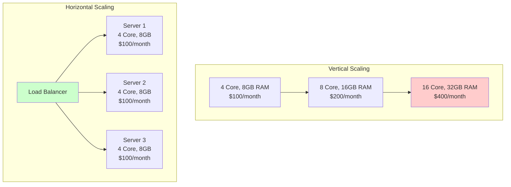
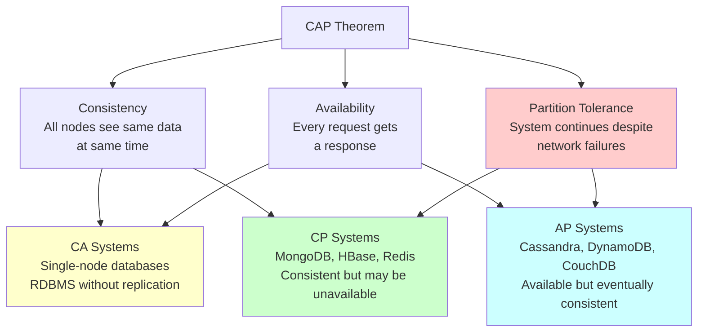
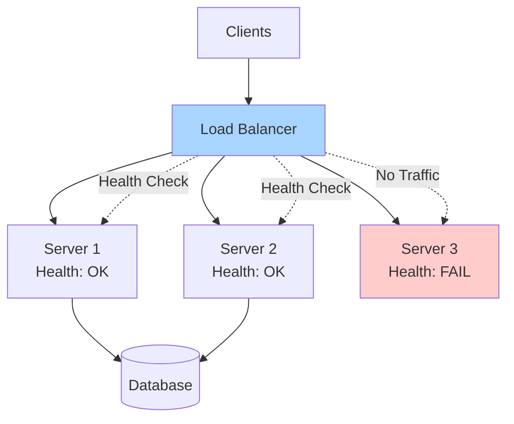
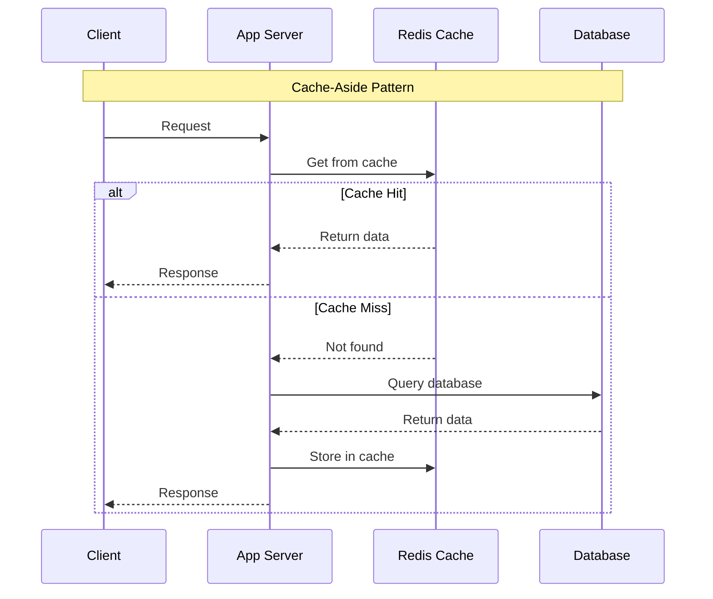

# Backend System Design Guide

## What is Backend System Design?

Backend system design focuses on architecting scalable, reliable, and maintainable server-side systems. It encompasses databases, APIs, services, message queues, caching, and infrastructure that power applications.

::: info Key Objectives
- **Scalability**: Handle growing traffic and data
- **Reliability**: System works correctly despite failures
- **Performance**: Fast response times and high throughput
- **Security**: Protect data and prevent attacks
- **Maintainability**: Easy to debug, update, and extend
:::

## Fundamental Concepts

### 1. Scalability Deep Dive



::: details Scaling Strategies

**Vertical Scaling (Scale Up)**
```
Pros:
- No code changes needed
- Simpler architecture
- No distributed system complexity
- Data consistency easier

Cons:
- Hardware limits (can't scale infinitely)
- Single point of failure
- Downtime during upgrades
- Expensive at higher tiers
- No geographic distribution

When to use:
- Monolithic applications
- Databases (initially)
- Legacy systems
- Small to medium traffic
```

**Horizontal Scaling (Scale Out)**
```
Pros:
- Nearly unlimited scaling
- Better fault tolerance
- Cost-effective (use commodity hardware)
- Geographic distribution possible
- Rolling updates without downtime

Cons:
- Requires stateless design
- Data consistency challenges
- More complex architecture
- Load balancing needed
- Session management complexity

When to use:
- Web applications
- Microservices
- High traffic systems
- Need geographic distribution
```

**Database Scaling**
```
Read Replicas:
- Master handles writes
- Slaves handle reads
- Async replication (eventual consistency)
- Good for read-heavy workloads

Sharding:
- Split data across multiple databases
- Each shard has subset of data
- Distribute by user_id, region, etc.
- Complex but highly scalable

Example sharding strategies:
1. Range-based: user_id 1-1M → Shard1, 1M-2M → Shard2
2. Hash-based: hash(user_id) % num_shards
3. Geographic: US → Shard1, EU → Shard2
4. Directory-based: Lookup table maps key to shard
```
:::

### 2. CAP Theorem (Choose 2 of 3)



::: info Real-World CAP Choices

**CP Systems (Consistency + Partition Tolerance)**
```
Choose when:
- Financial transactions (banking)
- Inventory management
- Booking systems
- Voting systems

Examples:
- MongoDB (with strong consistency)
- HBase
- Redis Cluster
- Zookeeper

Trade-off:
- System may become unavailable
- Better to be unavailable than inconsistent
```

**AP Systems (Availability + Partition Tolerance)**
```
Choose when:
- Social media feeds
- Analytics dashboards
- Logging systems
- Shopping carts
- Recommendation engines

Examples:
- Cassandra
- DynamoDB
- Riak
- CouchDB

Trade-off:
- Eventual consistency
- May show stale data temporarily
- Better to show old data than no data
```

**Real CAP:**
In practice, network partitions are rare but inevitable, so you're really choosing between:
- **CP**: Reject requests during partition (sacrifice availability)
- **AP**: Serve potentially stale data (sacrifice consistency)
:::

### 3. Database Patterns

#### ACID vs BASE

| Property | ACID (SQL) | BASE (NoSQL) |
|----------|------------|--------------|
| **Atomicity** | All or nothing | Basic availability |
| **Consistency** | Valid state always | Soft state |
| **Isolation** | Concurrent transactions isolated | Eventual consistency |
| **Durability** | Committed data persists | - |
| **Use Case** | Banking, orders | Social media, analytics |

::: details ACID Explained

**Atomicity**
```sql
BEGIN TRANSACTION;
  UPDATE accounts SET balance = balance - 100 WHERE id = 1;
  UPDATE accounts SET balance = balance + 100 WHERE id = 2;
COMMIT; -- Both succeed or both fail
```

**Consistency**
```sql
-- Constraints ensure valid state
ALTER TABLE orders ADD CONSTRAINT check_total 
  CHECK (total >= 0);
  
-- This will fail and rollback
UPDATE orders SET total = -100 WHERE id = 1;
```

**Isolation**
```sql
-- Isolation levels prevent dirty reads, phantom reads
SET TRANSACTION ISOLATION LEVEL SERIALIZABLE;

-- Transaction 1
BEGIN;
  SELECT balance FROM accounts WHERE id = 1; -- 1000
  -- Transaction 2 updates here
  SELECT balance FROM accounts WHERE id = 1; -- Still 1000 (repeatable read)
COMMIT;
```

**Durability**
```sql
COMMIT; -- Data written to disk, survives crashes
```
:::

::: details BASE Explained

**Basically Available**
```
System appears to work most of the time
May serve stale data
Some nodes may be down
```

**Soft State**
```
State may change without input
Background replication processes
Data converging to consistency
```

**Eventual Consistency**
```javascript
// Write to Cassandra
cassandra.insert({ user_id: 123, name: 'John' })

// Immediate read might return old data
cassandra.get(123) // Might be old name

// Eventually (milliseconds/seconds) all nodes have new data
setTimeout(() => {
  cassandra.get(123) // Definitely new name
}, 1000)
```
:::

### 4. API Design

::: tip REST API Best Practices

**Resource-Based URLs**
```
Good:
GET    /users              - List users
GET    /users/123          - Get user 123
POST   /users              - Create user
PUT    /users/123          - Update user 123 (full)
PATCH  /users/123          - Update user 123 (partial)
DELETE /users/123          - Delete user 123

GET    /users/123/posts    - Get posts by user 123
POST   /users/123/posts    - Create post for user 123

Bad:
GET    /getUsers
POST   /createUser
GET    /user?id=123
POST   /deleteUser/123
```

**HTTP Status Codes**
```
Success:
200 OK              - Request succeeded
201 Created         - Resource created
204 No Content      - Success, no response body

Client Errors:
400 Bad Request     - Invalid input
401 Unauthorized    - Authentication required
403 Forbidden       - Authenticated but not allowed
404 Not Found       - Resource doesn't exist
409 Conflict        - Conflict (e.g., duplicate)
422 Unprocessable   - Validation failed
429 Too Many        - Rate limit exceeded

Server Errors:
500 Internal Error  - Server error
502 Bad Gateway     - Upstream service error
503 Unavailable     - Temporary unavailable
504 Gateway Timeout - Upstream timeout
```

**Versioning**
```
Option 1: URL versioning (common)
GET /api/v1/users
GET /api/v2/users

Option 2: Header versioning
GET /api/users
Accept: application/vnd.api.v1+json

Option 3: Query parameter
GET /api/users?version=1
```

**Pagination**
```json
// Offset-based (simple but slow for large offsets)
GET /users?page=2&limit=20

Response:
{
  "data": [...],
  "pagination": {
    "page": 2,
    "limit": 20,
    "total": 500,
    "totalPages": 25
  }
}

// Cursor-based (better for large datasets)
GET /users?cursor=eyJpZCI6MTAwfQ&limit=20

Response:
{
  "data": [...],
  "pagination": {
    "nextCursor": "eyJpZCI6MTIwfQ",
    "hasMore": true
  }
}
```

**Filtering & Sorting**
```
GET /products?category=electronics&price_min=100&price_max=500
GET /products?sort=-price,name  // Descending price, then name
GET /products?fields=id,name,price  // Sparse fieldsets
```
:::

::: warning GraphQL vs REST

**REST**
```
Pros:
- Simple, well understood
- Caching easy (HTTP caching)
- Stateless
- Good tooling

Cons:
- Over-fetching (get unneeded data)
- Under-fetching (multiple requests)
- Versioning challenges

When to use:
- Public APIs
- Simple CRUD operations
- Need HTTP caching
- Microservices communication
```

**GraphQL**
```graphql
# Single request for exactly what you need
query {
  user(id: 123) {
    name
    email
    posts(limit: 5) {
      title
      comments(limit: 3) {
        text
        author { name }
      }
    }
  }
}
```

```
Pros:
- Get exactly what you need
- Single request for nested data
- Strong typing
- Introspection

Cons:
- More complex to implement
- Caching more difficult
- Can expose too much data
- Query complexity management

When to use:
- Mobile apps (reduce requests)
- Complex data requirements
- Rapid frontend iteration
- Internal APIs
```
:::

## Core Components

### 1. Load Balancers



::: details Load Balancing Algorithms

**Round Robin**
```python
servers = ['server1', 'server2', 'server3']
current = 0

def get_next_server():
    global current
    server = servers[current]
    current = (current + 1) % len(servers)
    return server

# Requests go: S1 → S2 → S3 → S1 → S2 → S3...
```

**Weighted Round Robin**
```python
# Server1: 50%, Server2: 30%, Server3: 20%
servers = [
    ('server1', 5),  # 5 out of 10
    ('server2', 3),  # 3 out of 10
    ('server3', 2)   # 2 out of 10
]

def get_weighted_server():
    total = sum(weight for _, weight in servers)
    rand = random.randint(0, total - 1)
    
    for server, weight in servers:
        if rand < weight:
            return server
        rand -= weight
```

**Least Connections**
```python
class LoadBalancer:
    def __init__(self):
        self.connections = {
            'server1': 0,
            'server2': 0,
            'server3': 0
        }
    
    def get_server(self):
        return min(self.connections, key=self.connections.get)
    
    def request_done(self, server):
        self.connections[server] -= 1
```

**IP Hash (Sticky Sessions)**
```python
def get_server(client_ip):
    hash_value = hash(client_ip)
    server_index = hash_value % len(servers)
    return servers[server_index]

# Same client always goes to same server
# Good for session persistence
```

**Least Response Time**
```python
class LoadBalancer:
    def __init__(self):
        self.response_times = {
            'server1': [],
            'server2': [],
            'server3': []
        }
    
    def get_server(self):
        avg_times = {
            server: sum(times) / len(times) if times else 0
            for server, times in self.response_times.items()
        }
        return min(avg_times, key=avg_times.get)
```
:::

::: info Layer 4 vs Layer 7 Load Balancing

**Layer 4 (Transport Layer)**
```
Routes based on:
- IP address
- Port number
- TCP/UDP

Pros:
- Fast (no packet inspection)
- Lower latency
- Handles any protocol

Cons:
- Can't route based on content
- No application-level decisions
- Can't modify requests

Use cases:
- High performance needed
- Non-HTTP protocols
- Simple routing
```

**Layer 7 (Application Layer)**
```
Routes based on:
- HTTP headers
- URL path
- Cookies
- Request body

Pros:
- Intelligent routing
- Can modify requests/responses
- SSL termination
- Content-based routing

Cons:
- Slower (full packet inspection)
- Higher CPU usage
- HTTP only (mostly)

Use cases:
- Microservices routing
- A/B testing
- Canary deployments
- API versioning
```

**Example Layer 7 Routing**
```nginx
# Nginx configuration
http {
    upstream api_v1 {
        server api-v1-1:8080;
        server api-v1-2:8080;
    }
    
    upstream api_v2 {
        server api-v2-1:8080;
        server api-v2-2:8080;
    }
    
    server {
        listen 80;
        
        location /api/v1 {
            proxy_pass http://api_v1;
        }
        
        location /api/v2 {
            proxy_pass http://api_v2;
        }
        
        # Route based on header
        location /api {
            if ($http_x_api_version = "v2") {
                proxy_pass http://api_v2;
            }
            proxy_pass http://api_v1;
        }
    }
}
```
:::

### 2. Caching Strategies



::: details Caching Patterns

**1. Cache-Aside (Lazy Loading)**
```python
def get_user(user_id):
    # Try cache first
    cached = cache.get(f'user:{user_id}')
    if cached:
        return cached
    
    # Cache miss - get from DB
    user = db.query('SELECT * FROM users WHERE id = ?', user_id)
    
    # Store in cache for 1 hour
    cache.set(f'user:{user_id}', user, ttl=3600)
    
    return user

# Pros: Only cache requested data, cache failure non-critical
# Cons: Cache miss penalty, stale data possible
```

**2. Write-Through**
```python
def update_user(user_id, data):
    # Update cache first
    cache.set(f'user:{user_id}', data, ttl=3600)
    
    # Then update database
    db.query('UPDATE users SET ... WHERE id = ?', user_id)
    
    return data

# Pros: Cache always consistent with DB, no stale data
# Cons: Write latency (2 operations), cache fills with unused data
```

**3. Write-Behind (Write-Back)**
```python
def update_user(user_id, data):
    # Update cache immediately
    cache.set(f'user:{user_id}', data, ttl=3600)
    
    # Queue database update for later
    queue.enqueue('db_update', {
        'table': 'users',
        'id': user_id,
        'data': data
    })
    
    return data

# Background worker processes queue
def worker():
    while True:
        job = queue.dequeue()
        db.query('UPDATE users SET ... WHERE id = ?', 
                 job['id'], job['data'])

# Pros: Fast writes, handles write bursts
# Cons: Data loss risk if cache fails, complex
```

**4. Read-Through**
```python
# Cache automatically loads data on miss
class ReadThroughCache:
    def __init__(self, cache, loader):
        self.cache = cache
        self.loader = loader
    
    def get(self, key):
        cached = self.cache.get(key)
        if cached:
            return cached
        
        # Cache loads data itself
        data = self.loader(key)
        self.cache.set(key, data)
        return data

# Usage
cache = ReadThroughCache(
    redis_client,
    loader=lambda user_id: db.get_user(user_id)
)

user = cache.get('user:123')

# Pros: Transparent to application
# Cons: First request slow, cache must know how to load
```

**5. Refresh-Ahead**
```python
import time

class RefreshAheadCache:
    def __init__(self, cache, loader, ttl=3600, refresh_threshold=0.8):
        self.cache = cache
        self.loader = loader
        self.ttl = ttl
        self.refresh_threshold = refresh_threshold
    
    def get(self, key):
        entry = self.cache.get_with_metadata(key)
        
        if not entry:
            # Cache miss
            data = self.loader(key)
            self.cache.set(key, data, ttl=self.ttl)
            return data
        
        # Check if nearing expiration
        age = time.time() - entry['created_at']
        if age > self.ttl * self.refresh_threshold:
            # Refresh in background
            background_refresh(key, self.loader, self.cache, self.ttl)
        
        return entry['data']

# Pros: Low latency, fresh data
# Cons: Extra cache reads, complexity
```
:::

::: tip Cache Eviction Policies

**LRU (Least Recently Used)**
```python
from collections import OrderedDict

class LRUCache:
    def __init__(self, capacity):
        self.cache = OrderedDict()
        self.capacity = capacity
    
    def get(self, key):
        if key not in self.cache:
            return None
        # Move to end (most recently used)
        self.cache.move_to_end(key)
        return self.cache[key]
    
    def put(self, key, value):
        if key in self.cache:
            self.cache.move_to_end(key)
        self.cache[key] = value
        if len(self.cache) > self.capacity:
            # Remove first item (least recently used)
            self.cache.popitem(last=False)
```

**LFU (Least Frequently Used)**
```python
class LFUCache:
    def __init__(self, capacity):
        self.capacity = capacity
        self.cache = {}
        self.freq = {}  # key -> frequency
    
    def get(self, key):
        if key not in self.cache:
            return None
        self.freq[key] += 1
        return self.cache[key]
    
    def put(self, key, value):
        if len(self.cache) >= self.capacity:
            # Find least frequent
            lfu_key = min(self.freq, key=self.freq.get)
            del self.cache[lfu_key]
            del self.freq[lfu_key]
        
        self.cache[key] = value
        self.freq[key] = self.freq.get(key, 0) + 1
```

**TTL (Time To Live)**
```python
import time

class TTLCache:
    def __init__(self):
        self.cache = {}
        self.expiry = {}
    
    def get(self, key):
        if key not in self.cache:
            return None
        
        # Check if expired
        if time.time() > self.expiry[key]:
            del self.cache[key]
            del self.expiry[key]
            return None
        
        return self.cache[key]
    
    def put(self, key, value, ttl=3600):
        self.cache[key] = value
        self.expiry[key] = time.time() + ttl
```
:::

::: warning Cache Stampede Problem

**Problem:**
```
Cache expires → 1000 concurrent requests → All hit database!

Timeline:
T=0: Cache expires
T=1: Request 1 hits cache (miss) → queries DB
T=1: Request 2 hits cache (miss) → queries DB
T=1: Request 3 hits cache (miss) → queries DB
...
T=1: Request 1000 hits cache (miss) → queries DB

Result: Database overload!
```

**Solution 1: Lock-Based**
```python
import threading

locks = {}

def get_user(user_id):
    cache_key = f'user:{user_id}'
    cached = cache.get(cache_key)
    if cached:
        return cached
    
    # Acquire lock for this key
    if cache_key not in locks:
        locks[cache_key] = threading.Lock()
    
    with locks[cache_key]:
        # Double-check cache (another thread might have filled it)
        cached = cache.get(cache_key)
        if cached:
            return cached
        
        # Only one thread hits database
        user = db.get_user(user_id)
        cache.set(cache_key, user, ttl=3600)
        return user
```

**Solution 2: Probabilistic Early Expiration**
```python
import random

def get_user(user_id):
    cache_key = f'user:{user_id}'
    entry = cache.get_with_ttl(cache_key)
    
    if not entry:
        user = db.get_user(user_id)
        cache.set(cache_key, user, ttl=3600)
        return user
    
    # Probabilistically refresh before expiration
    ttl_remaining = entry['ttl']
    if random.random() < (3600 - ttl_remaining) / 3600:
        # Refresh in background
        asyncio.create_task(refresh_cache(cache_key, user_id))
    
    return entry['data']
```

**Solution 3: Never Expire**
```python
def get_user(user_id):
    cache_key = f'user:{user_id}'
    cached = cache.get(cache_key)
    if cached:
        # Return cached, but refresh in background if old
        if cached['age'] > 3000:  # Refresh after 50min (TTL is 60min)
            background_refresh(user_id)
        return cached['data']
    
    user = db.get_user(user_id)
    cache.set(cache_key, {'data': user, 'age': 0}, ttl=None)
    return user
```
:::

### 3. Database Design

#### SQL Database Optimization

::: details Indexing Strategies

**B-Tree Index (Default)**
```sql
-- Single column index
CREATE INDEX idx_users_email ON users(email);

-- Composite index (order matters!)
CREATE INDEX idx_users_name_age ON users(last_name, first_name, age);

-- Queries that use this index:
SELECT * FROM users WHERE last_name = 'Smith';  -- ✅ Uses index
SELECT * FROM users WHERE last_name = 'Smith' AND first_name = 'John';  -- ✅ Uses index
SELECT * FROM users WHERE last_name = 'Smith' AND age = 30;  -- ✅ Uses index (skips first_name)
SELECT * FROM users WHERE first_name = 'John';  -- ❌ Doesn't use index (missing left prefix)
SELECT * FROM users WHERE age = 30;  -- ❌ Doesn't use index (missing left prefix)
```

**Covering Index**
```sql
-- Index includes all columns needed by query
CREATE INDEX idx_users_email_name ON users(email, first_name, last_name);

-- This query doesn't need to access table (index-only scan)
SELECT first_name, last_name FROM users WHERE email = 'user@example.com';
-- Fast! Data is in index itself
```

**Partial Index**
```sql
-- Index only active users
CREATE INDEX idx_active_users ON users(email) WHERE status = 'active';

-- Smaller index, faster queries for active users
SELECT * FROM users WHERE email = 'user@example.com' AND status = 'active';
```

**Full-Text Index**
```sql
-- PostgreSQL
CREATE INDEX idx_posts_content ON posts USING GIN(to_tsvector('english', content));

SELECT * FROM posts 
WHERE to_tsvector('english', content) @@ to_tsquery('english', 'postgres & performance');

-- MySQL
CREATE FULLTEXT INDEX idx_posts_content ON posts(content);

SELECT * FROM posts WHERE MATCH(content) AGAINST('postgres performance' IN BOOLEAN MODE);
```

**When NOT to Index**
```sql
-- Small tables (< 1000 rows)
-- Index overhead > benefit

-- High write, low read tables
-- Index slows down INSERT/UPDATE/DELETE

-- Columns with low cardinality
CREATE INDEX idx_users_gender ON users(gender);  -- ❌ Only 2-3 values
CREATE INDEX idx_users_boolean ON users(is_active);  -- ❌ Only true/false

-- Columns frequently updated
CREATE INDEX idx_users_last_login ON users(last_login);  -- ❌ Updates on every login
```
:::

::: details Query Optimization

**EXPLAIN ANALYZE**
```sql
-- PostgreSQL
EXPLAIN (ANALYZE, BUFFERS) SELECT * FROM orders 
WHERE user_id = 123 AND created_at > '2024-01-01';

/*
Output shows:
- Seq Scan vs Index Scan
- Cost estimates
- Actual time taken
- Rows processed
- Buffer hits/misses
*/

-- Look for:
1. Seq Scan on large tables → Add index
2. High cost → Optimize query
3. Many rows filtered out → Better WHERE clause
4. Nested loops → Consider JOIN type
```

**N+1 Query Problem**
```sql
-- Bad: N+1 queries
-- 1 query for users
SELECT * FROM users LIMIT 10;

-- N queries for each user's posts
SELECT * FROM posts WHERE user_id = 1;
SELECT * FROM posts WHERE user_id = 2;
...
SELECT * FROM posts WHERE user_id = 10;

-- Total: 11 queries!

-- Good: 2 queries with JOIN
SELECT users.*, posts.* 
FROM users 
LEFT JOIN posts ON posts.user_id = users.id 
WHERE users.id IN (1,2,3,4,5,6,7,8,9,10);

-- Or: 2 separate queries
SELECT * FROM users WHERE id IN (1,2,3,4,5,6,7,8,9,10);
SELECT * FROM posts WHERE user_id IN (1,2,3,4,5,6,7,8,9,10);
```

**Avoid SELECT ***
```sql
-- Bad
SELECT * FROM users;
-- Returns all columns, even if you only need name

-- Good
SELECT id, name, email FROM users;
-- Only fetches needed columns
-- Faster, less data transfer, can use covering index
```

**Use LIMIT**
```sql
-- Bad
SELECT * FROM logs ORDER BY created_at DESC;
-- Returns millions of rows

-- Good
SELECT * FROM logs ORDER BY created_at DESC LIMIT 100;
-- Returns only what you need
```

**Batch Operations**
```sql
-- Bad: Individual inserts
INSERT INTO users (name, email) VALUES ('John', 'john@example.com');
INSERT INTO users (name, email) VALUES ('Jane', 'jane@example.com');
-- ... 1000 times

-- Good: Batch insert
INSERT INTO users (name, email) VALUES 
  ('John', 'john@example.com'),
  ('Jane', 'jane@example.com'),
  ... -- All 1000 rows
;
-- Much faster!
```
:::

#### NoSQL Database Patterns

::: details MongoDB Patterns

**Schema Design**
```javascript
// Embedding (denormalization)
{
  _id: ObjectId("..."),
  name: "John Doe",
  email: "john@example.com",
  addresses: [  // Embedded documents
    { type: "home", street: "123 Main St", city: "NYC" },
    { type: "work", street: "456 Office Blvd", city: "SF" }
  ]
}

// When to embed:
// - One-to-few relationships
// - Data accessed together
// - Data doesn't grow unbounded

// Referencing (normalization)
// User document
{
  _id: ObjectId("user123"),
  name: "John Doe",
  email: "john@example.com"
}

// Order documents
{
  _id: ObjectId("order1"),
  user_id: ObjectId("user123"),  // Reference
  total: 99.99
}

// When to reference:
// - One-to-many with many being large
// - Many-to-many relationships
// - Data updated frequently
```

**Indexing**
```javascript
// Single field index
db.users.createIndex({ email: 1 })

// Compound index
db.users.createIndex({ last_name: 1, first_name: 1 })

// Text index for full-text search
db.posts.createIndex({ content: "text" })
db.posts.find({ $text: { $search: "mongodb performance" } })

// Geospatial index
db.places.createIndex({ location: "2dsphere" })
db.places.find({
  location: {
    $near: {
      $
```

===================


