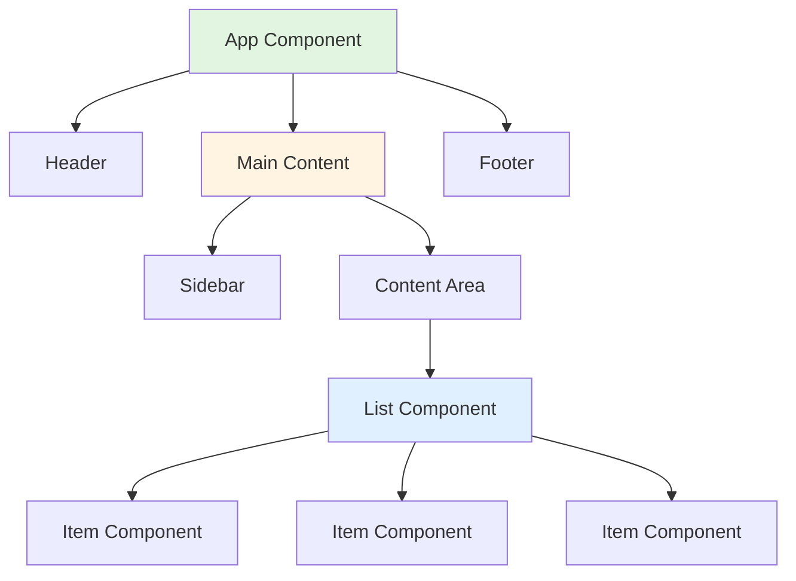
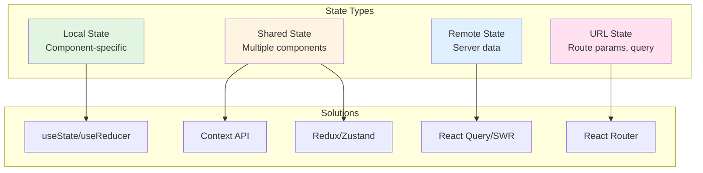
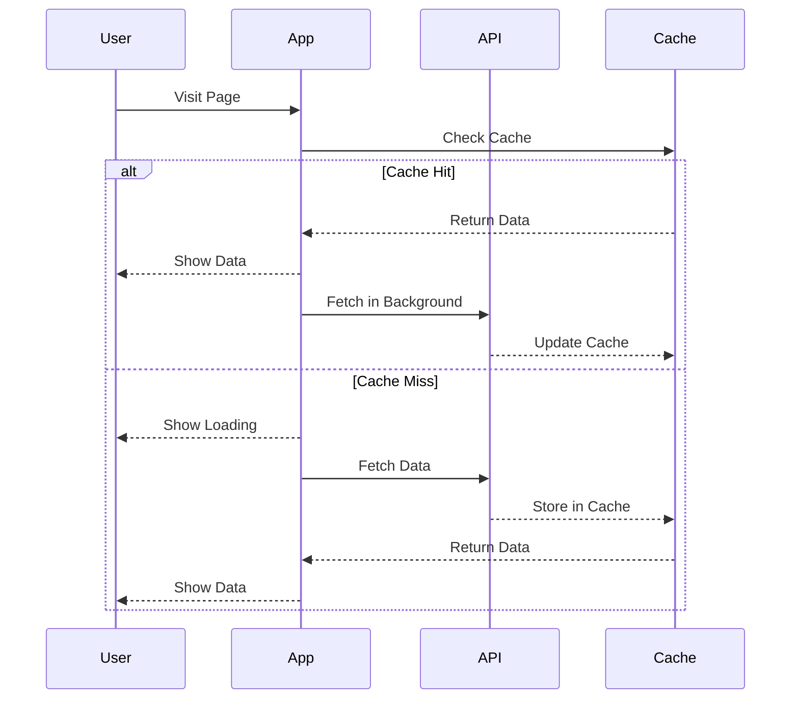
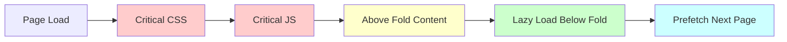
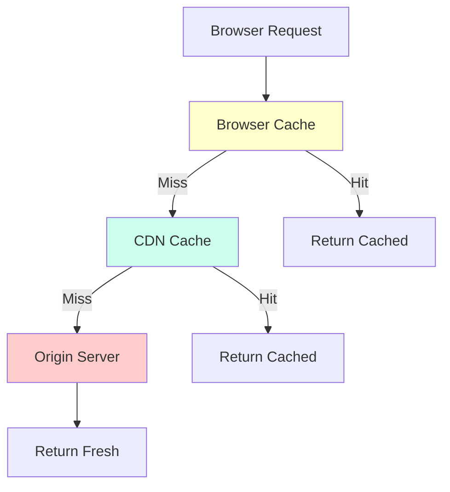
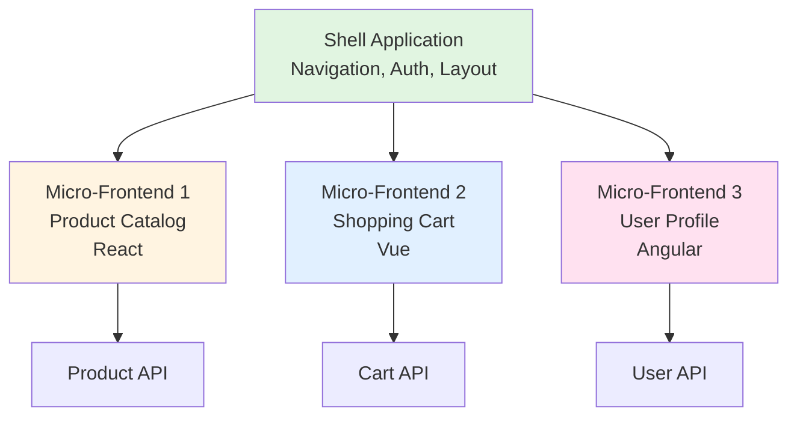
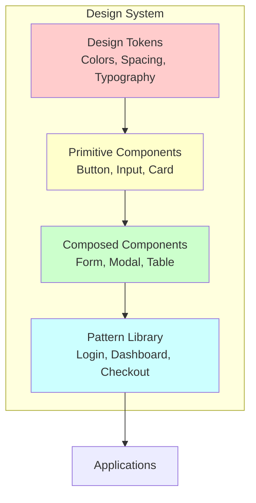
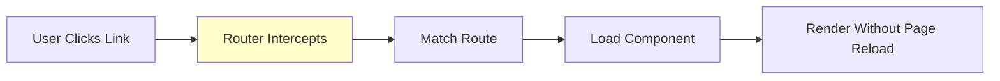
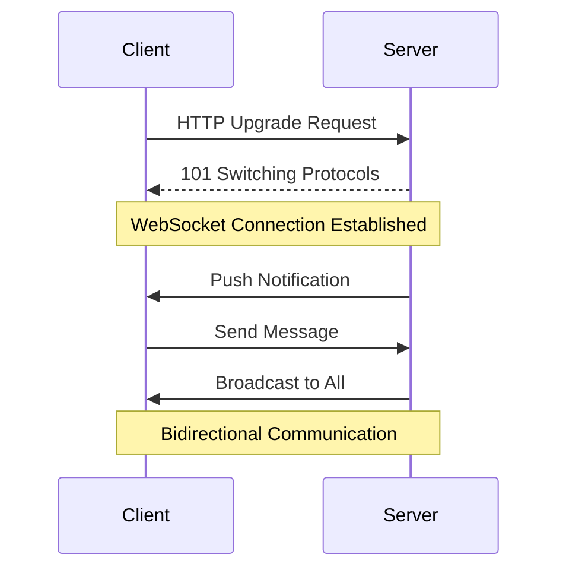

# Frontend System Design Guide

## What is Frontend System Design?

Frontend system design focuses on architecting scalable, performant, and maintainable user interfaces. It encompasses application architecture, state management, performance optimization, and user experience considerations.

::: info Key Objectives
- **Performance**: Fast load times and smooth interactions
- **Scalability**: Handle growing complexity and features
- **Maintainability**: Easy to understand, modify, and extend
- **Accessibility**: Usable by everyone, including people with disabilities
- **User Experience**: Intuitive, responsive, and delightful
:::

## Core Concepts

### 1. Component Architecture

The foundation of modern frontend applications.



::: tip Component Design Principles

**Single Responsibility**
Each component should do one thing well.

```jsx
// Bad - component does too much
function UserProfile() {
  // Fetches data, handles auth, renders UI, manages form
}

// Good - separated concerns
function UserProfile({ user }) {
  return <ProfileView user={user} />
}

function UserProfileContainer() {
  const user = useUser()
  const auth = useAuth()
  return <UserProfile user={user} />
}
```

**Composition over Inheritance**
Build complex UIs from simple, reusable components.

```jsx
// Good - composable
<Card>
  <CardHeader>Title</CardHeader>
  <CardBody>Content</CardBody>
  <CardFooter>Actions</CardFooter>
</Card>
```

**Props Down, Events Up**
Data flows down via props, events bubble up via callbacks.

```jsx
// Parent
function Parent() {
  const [value, setValue] = useState('')
  return <Child value={value} onChange={setValue} />
}

// Child
function Child({ value, onChange }) {
  return <input value={value} onChange={e => onChange(e.target.value)} />
}
```
:::

### 2. Component Types

::: details Presentational vs Container Components

**Presentational (Dumb/Stateless)**
- Focus on how things look
- Receive data via props
- No state or business logic
- Highly reusable

```jsx
function Button({ label, onClick, variant = 'primary' }) {
  return (
    <button className={`btn btn-${variant}`} onClick={onClick}>
      {label}
    </button>
  )
}
```

**Container (Smart/Stateful)**
- Focus on how things work
- Manage state and side effects
- Connect to data sources
- Pass data to presentational components

```jsx
function UserListContainer() {
  const [users, setUsers] = useState([])
  const [loading, setLoading] = useState(true)
  
  useEffect(() => {
    fetchUsers().then(data => {
      setUsers(data)
      setLoading(false)
    })
  }, [])
  
  return <UserList users={users} loading={loading} />
}
```
:::

::: details Controlled vs Uncontrolled Components

**Controlled**
React controls the form element state.

```jsx
function ControlledInput() {
  const [value, setValue] = useState('')
  
  return (
    <input 
      value={value} 
      onChange={e => setValue(e.target.value)} 
    />
  )
}
```

**Uncontrolled**
DOM controls the form element state.

```jsx
function UncontrolledInput() {
  const inputRef = useRef()
  
  const handleSubmit = () => {
    console.log(inputRef.current.value)
  }
  
  return <input ref={inputRef} />
}
```

**When to use:**
- Controlled: Form validation, dynamic fields, React state integration
- Uncontrolled: Simple forms, file inputs, third-party integrations
:::

### 3. State Management

Managing application state effectively is crucial for scalability.



::: info State Management Patterns

**Local State**: Use `useState` or `useReducer`
```jsx
function Counter() {
  const [count, setCount] = useState(0)
  return <button onClick={() => setCount(count + 1)}>{count}</button>
}
```

**Lifted State**: Share between siblings
```jsx
function Parent() {
  const [data, setData] = useState(null)
  return (
    <>
      <ChildA data={data} />
      <ChildB onUpdate={setData} />
    </>
  )
}
```

**Context API**: Global state without prop drilling
```jsx
const ThemeContext = createContext()

function App() {
  const [theme, setTheme] = useState('light')
  return (
    <ThemeContext.Provider value={{ theme, setTheme }}>
      <Component />
    </ThemeContext.Provider>
  )
}

function Component() {
  const { theme } = useContext(ThemeContext)
  return <div className={theme}>Content</div>
}
```

**External State Manager**: Complex global state
```jsx
// Zustand example
import create from 'zustand'

const useStore = create(set => ({
  count: 0,
  increment: () => set(state => ({ count: state.count + 1 }))
}))

function Counter() {
  const { count, increment } = useStore()
  return <button onClick={increment}>{count}</button>
}
```
:::

::: warning State Management Decision Tree
```
Need state? 
├─ Single component only? → useState/useReducer
├─ Few components nearby? → Lift state up
├─ Many nested components? → Context API
├─ Complex global state? → Redux/Zustand/Recoil
└─ Server data? → React Query/SWR/Apollo
```
:::

### 4. Data Fetching Strategies



::: details Fetching Patterns

**Client-Side Rendering (CSR)**
```jsx
function UserProfile() {
  const [user, setUser] = useState(null)
  const [loading, setLoading] = useState(true)
  
  useEffect(() => {
    fetch('/api/user')
      .then(res => res.json())
      .then(data => {
        setUser(data)
        setLoading(false)
      })
  }, [])
  
  if (loading) return <Spinner />
  return <Profile user={user} />
}
```

**Server-Side Rendering (SSR)**
```jsx
// Next.js example
export async function getServerSideProps() {
  const user = await fetchUser()
  return { props: { user } }
}

export default function UserProfile({ user }) {
  return <Profile user={user} />
}
```

**Static Site Generation (SSG)**
```jsx
// Next.js example
export async function getStaticProps() {
  const posts = await fetchPosts()
  return { 
    props: { posts },
    revalidate: 60 // Regenerate every 60s
  }
}

export default function Blog({ posts }) {
  return <PostList posts={posts} />
}
```

**Incremental Static Regeneration (ISR)**
```jsx
// Next.js - best of both worlds
export async function getStaticProps() {
  const data = await fetchData()
  return { 
    props: { data },
    revalidate: 10 // Update every 10s if requested
  }
}
```

**React Query Pattern**
```jsx
import { useQuery } from 'react-query'

function UserProfile() {
  const { data, isLoading, error } = useQuery('user', fetchUser, {
    staleTime: 5000, // Consider fresh for 5s
    cacheTime: 10 * 60 * 1000, // Keep in cache for 10min
    retry: 3
  })
  
  if (isLoading) return <Spinner />
  if (error) return <Error />
  return <Profile user={data} />
}
```
:::

## Performance Optimization

### 1. Rendering Optimization

::: tip React Rendering Optimization

**Memoization**
```jsx
// Prevent re-renders when props haven't changed
const MemoizedComponent = React.memo(function Component({ data }) {
  return <div>{data}</div>
})

// Memoize expensive calculations
function Component({ items }) {
  const total = useMemo(() => {
    return items.reduce((sum, item) => sum + item.price, 0)
  }, [items])
  
  return <div>Total: {total}</div>
}

// Memoize callback functions
function Parent() {
  const handleClick = useCallback(() => {
    console.log('clicked')
  }, [])
  
  return <Child onClick={handleClick} />
}
```

**Code Splitting**
```jsx
// Lazy load components
const HeavyComponent = lazy(() => import('./HeavyComponent'))

function App() {
  return (
    <Suspense fallback={<Loading />}>
      <HeavyComponent />
    </Suspense>
  )
}

// Route-based splitting
const Dashboard = lazy(() => import('./pages/Dashboard'))
const Profile = lazy(() => import('./pages/Profile'))

function App() {
  return (
    <Routes>
      <Route path="/dashboard" element={
        <Suspense fallback={<Loading />}>
          <Dashboard />
        </Suspense>
      } />
    </Routes>
  )
}
```

**Virtualization**
```jsx
// React Window - only render visible items
import { FixedSizeList } from 'react-window'

function LargeList({ items }) {
  return (
    <FixedSizeList
      height={600}
      itemCount={items.length}
      itemSize={50}
      width="100%"
    >
      {({ index, style }) => (
        <div style={style}>{items[index]}</div>
      )}
    </FixedSizeList>
  )
}
```

**Debouncing & Throttling**
```jsx
// Debounce - wait for user to stop typing
function SearchInput() {
  const [query, setQuery] = useState('')
  
  const debouncedSearch = useMemo(
    () => debounce((value) => {
      // API call here
      searchAPI(value)
    }, 300),
    []
  )
  
  const handleChange = (e) => {
    setQuery(e.target.value)
    debouncedSearch(e.target.value)
  }
  
  return <input value={query} onChange={handleChange} />
}

// Throttle - limit execution rate
function ScrollHandler() {
  const handleScroll = useMemo(
    () => throttle(() => {
      console.log('scrolled')
    }, 100),
    []
  )
  
  useEffect(() => {
    window.addEventListener('scroll', handleScroll)
    return () => window.removeEventListener('scroll', handleScroll)
  }, [handleScroll])
}
```
:::

### 2. Loading Strategies



::: details Loading Optimization Techniques

**Critical CSS Inline**
```html
<head>
  <style>
    /* Critical CSS here - above the fold styles */
    .header { /* ... */ }
  </style>
  <link rel="stylesheet" href="main.css" media="print" onload="this.media='all'">
</head>
```

**Progressive Enhancement**
```jsx
// Load basic content first, enhance later
function ProductPage() {
  const [enhanced, setEnhanced] = useState(false)
  
  useEffect(() => {
    // Load enhancement features after initial render
    import('./enhancements').then(() => setEnhanced(true))
  }, [])
  
  return (
    <div>
      <BasicProduct />
      {enhanced && <EnhancedFeatures />}
    </div>
  )
}
```

**Image Optimization**
```jsx
// Progressive loading with blur placeholder
function OptimizedImage({ src, alt }) {
  const [loaded, setLoaded] = useState(false)
  
  return (
    <div className="image-container">
      
       setLoaded(true)}
        loading="lazy"
        alt={alt}
      />
    </div>
  )
}

// Native lazy loading


// Responsive images

```

**Resource Hints**
```html
<!-- Preconnect to required origins -->
<link rel="preconnect" href="https://api.example.com">

<!-- DNS prefetch -->
<link rel="dns-prefetch" href="https://fonts.googleapis.com">

<!-- Preload critical resources -->
<link rel="preload" href="critical.css" as="style">
<link rel="preload" href="hero.jpg" as="image">

<!-- Prefetch next page resources -->
<link rel="prefetch" href="/next-page.html">

<!-- Prerender next likely page -->
<link rel="prerender" href="/checkout">
```
:::

### 3. Bundle Optimization

::: tip Bundle Size Optimization

**Tree Shaking**
```js
// Import only what you need
import { debounce } from 'lodash-es' // Good
import _ from 'lodash' // Bad - imports everything

// Named exports enable tree shaking
export const add = (a, b) => a + b
export const subtract = (a, b) => a - b

import { add } from './math' // Only includes add
```

**Dynamic Imports**
```jsx
// Load on demand
function Dashboard() {
  const [showAnalytics, setShowAnalytics] = useState(false)
  const [Analytics, setAnalytics] = useState(null)
  
  const loadAnalytics = async () => {
    const module = await import('./Analytics')
    setAnalytics(() => module.default)
    setShowAnalytics(true)
  }
  
  return (
    <div>
      <button onClick={loadAnalytics}>Show Analytics</button>
      {showAnalytics && Analytics && <Analytics />}
    </div>
  )
}
```

**Bundle Analysis**
```bash
# Webpack Bundle Analyzer
npm install --save-dev webpack-bundle-analyzer

# Analyze your bundle
npm run build -- --analyze
```

**Code Splitting Strategies**
```jsx
// Route-based
const routes = [
  { path: '/', component: lazy(() => import('./Home')) },
  { path: '/about', component: lazy(() => import('./About')) },
  { path: '/contact', component: lazy(() => import('./Contact')) }
]

// Component-based
const Modal = lazy(() => import('./Modal'))
const Chart = lazy(() => import('./Chart'))

// Vendor splitting (webpack)
optimization: {
  splitChunks: {
    chunks: 'all',
    cacheGroups: {
      vendor: {
        test: /[\\/]node_modules[\\/]/,
        name: 'vendors',
        priority: 10
      },
      common: {
        minChunks: 2,
        priority: 5,
        reuseExistingChunk: true
      }
    }
  }
}
```
:::

### 4. Caching Strategies



::: details Caching Techniques

**HTTP Caching Headers**
```js
// Cache static assets aggressively
// Cache-Control: public, max-age=31536000, immutable
<script src="/app.abc123.js"></script>

// Cache HTML minimally
// Cache-Control: public, max-age=0, must-revalidate
<html>...</html>

// Use ETag for validation
// ETag: "abc123"
// If-None-Match: "abc123"
// 304 Not Modified
```

**Service Worker Caching**
```js
// service-worker.js
const CACHE_NAME = 'app-v1'
const urlsToCache = [
  '/',
  '/styles.css',
  '/app.js'
]

// Install - cache resources
self.addEventListener('install', event => {
  event.waitUntil(
    caches.open(CACHE_NAME)
      .then(cache => cache.addAll(urlsToCache))
  )
})

// Fetch - serve from cache, fallback to network
self.addEventListener('fetch', event => {
  event.respondWith(
    caches.match(event.request)
      .then(response => response || fetch(event.request))
  )
})

// Strategies:
// 1. Cache First - fast, may be stale
// 2. Network First - fresh, may be slow
// 3. Cache then Network - show cached, update
// 4. Network Only - always fresh
// 5. Cache Only - offline-first
```

**Application Cache**
```jsx
// React Query - automatic caching
import { useQuery } from 'react-query'

function UserProfile() {
  const { data } = useQuery('user', fetchUser, {
    staleTime: 5 * 60 * 1000, // Fresh for 5 minutes
    cacheTime: 10 * 60 * 1000, // Keep in cache for 10 minutes
    refetchOnWindowFocus: true
  })
}

// SWR - automatic caching
import useSWR from 'swr'

function UserProfile() {
  const { data } = useSWR('/api/user', fetcher, {
    revalidateOnFocus: true,
    dedupingInterval: 2000
  })
}

// localStorage caching
const cache = {
  set: (key, value, ttl) => {
    const item = {
      value,
      expiry: Date.now() + ttl
    }
    localStorage.setItem(key, JSON.stringify(item))
  },
  get: (key) => {
    const item = JSON.parse(localStorage.getItem(key))
    if (!item) return null
    if (Date.now() > item.expiry) {
      localStorage.removeItem(key)
      return null
    }
    return item.value
  }
}
```
:::

## Architecture Patterns

### 1. Micro-Frontends

Breaking frontend monoliths into smaller, independently deployable apps.



::: details Micro-Frontend Patterns

**Build-Time Integration**
```js
// NPM packages - compose at build time
import ProductCatalog from '@company/product-catalog'
import ShoppingCart from '@company/shopping-cart'

function App() {
  return (
    <div>
      <ProductCatalog />
      <ShoppingCart />
    </div>
  )
}
```

**Run-Time Integration**
```html
<!-- Module Federation (Webpack 5) -->
<!-- host/webpack.config.js -->
new ModuleFederationPlugin({
  name: 'host',
  remotes: {
    productApp: 'productApp@http://localhost:3001/remoteEntry.js',
    cartApp: 'cartApp@http://localhost:3002/remoteEntry.js'
  }
})

<!-- Use remote modules -->
const ProductCatalog = lazy(() => import('productApp/Catalog'))
const ShoppingCart = lazy(() => import('cartApp/Cart'))
```

**iframe Integration**
```html
<!-- Simple but isolated -->
<iframe src="https://product.example.com" />

<!-- Communication via postMessage -->
<script>
  // Parent
  iframe.contentWindow.postMessage({ type: 'UPDATE', data: {...} }, '*')
  
  // Child
  window.addEventListener('message', (event) => {
    if (event.data.type === 'UPDATE') {
      // Handle update
    }
  })
</script>
```

**Web Components**
```js
// Define custom element
class ProductCatalog extends HTMLElement {
  connectedCallback() {
    this.innerHTML = '<div>Product Catalog</div>'
  }
}

customElements.define('product-catalog', ProductCatalog)

// Use anywhere
<product-catalog></product-catalog>
```

**Single-SPA**
```js
// Register applications
registerApplication({
  name: 'products',
  app: () => import('./products/main.js'),
  activeWhen: '/products'
})

registerApplication({
  name: 'cart',
  app: () => import('./cart/main.js'),
  activeWhen: '/cart'
})

start()
```

::: tip When to Use Micro-Frontends
✅ Large teams working independently
✅ Different parts can use different frameworks
✅ Independent deployment needed
✅ Different release cycles

❌ Small applications
❌ Single team
❌ Tight coupling between features
❌ Performance is critical
:::
:::

### 2. Component Library Architecture



::: details Building Component Libraries

**Design Tokens**
```js
// tokens.js - single source of truth
export const colors = {
  primary: {
    50: '#e3f2fd',
    500: '#2196f3',
    900: '#0d47a1'
  },
  grey: {
    50: '#fafafa',
    500: '#9e9e9e',
    900: '#212121'
  }
}

export const spacing = {
  xs: '4px',
  sm: '8px',
  md: '16px',
  lg: '24px',
  xl: '32px'
}

export const typography = {
  fontFamily: {
    sans: '"Inter", sans-serif',
    mono: '"Fira Code", monospace'
  },
  fontSize: {
    xs: '12px',
    sm: '14px',
    base: '16px',
    lg: '18px',
    xl: '20px'
  }
}
```

**Atomic Design**
```jsx
// Atoms - basic building blocks
function Button({ children, variant = 'primary', ...props }) {
  return (
    <button className={`btn btn-${variant}`} {...props}>
      {children}
    </button>
  )
}

// Molecules - groups of atoms
function SearchBox() {
  return (
    <div className="search-box">
      <Input placeholder="Search..." />
      <Button>Search</Button>
    </div>
  )
}

// Organisms - complex components
function Header() {
  return (
    <header>
      <Logo />
      <Navigation />
      <SearchBox />
      <UserMenu />
    </header>
  )
}

// Templates - page layouts
function PageTemplate({ header, sidebar, content }) {
  return (
    <div className="page">
      {header}
      <div className="body">
        {sidebar}
        {content}
      </div>
    </div>
  )
}

// Pages - specific instances
function HomePage() {
  return (
    <PageTemplate
      header={<Header />}
      sidebar={<Sidebar />}
      content={<HomeContent />}
    />
  )
}
```

**Component Documentation**
```jsx
/**
 * Button component
 * 
 * @param {string} variant - Button style: 'primary' | 'secondary' | 'danger'
 * @param {string} size - Button size: 'sm' | 'md' | 'lg'
 * @param {boolean} disabled - Disable button
 * @param {function} onClick - Click handler
 * @param {ReactNode} children - Button content
 * 
 * @example
 * <Button variant="primary" size="lg" onClick={handleClick}>
 *   Click Me
 * </Button>
 */

// Storybook stories
export default {
  title: 'Components/Button',
  component: Button
}

export const Primary = () => <Button variant="primary">Primary</Button>
export const Secondary = () => <Button variant="secondary">Secondary</Button>
export const Disabled = () => <Button disabled>Disabled</Button>
```
:::

### 3. Folder Structure

::: tip Recommended Structures

**Feature-Based**
```
src/
├── features/
│   ├── auth/
│   │   ├── components/
│   │   │   ├── LoginForm.jsx
│   │   │   └── SignupForm.jsx
│   │   ├── hooks/
│   │   │   └── useAuth.js
│   │   ├── api/
│   │   │   └── authAPI.js
│   │   └── index.js
│   ├── products/
│   │   ├── components/
│   │   ├── hooks/
│   │   ├── api/
│   │   └── index.js
│   └── cart/
├── shared/
│   ├── components/
│   │   ├── Button/
│   │   ├── Input/
│   │   └── Modal/
│   ├── hooks/
│   ├── utils/
│   └── constants/
├── App.jsx
└── index.js
```

**Type-Based**
```
src/
├── components/
│   ├── common/
│   │   ├── Button/
│   │   ├── Input/
│   │   └── Modal/
│   ├── layout/
│   │   ├── Header/
│   │   ├── Footer/
│   │   └── Sidebar/
│   └── features/
│       ├── ProductCard/
│       ├── UserProfile/
│       └── ShoppingCart/
├── pages/
│   ├── Home.jsx
│   ├── Products.jsx
│   └── Checkout.jsx
├── hooks/
├── utils/
├── services/
├── store/
└── styles/
```

**Domain-Driven**
```
src/
├── domains/
│   ├── user/
│   │   ├── User.model.js
│   │   ├── UserService.js
│   │   ├── UserRepository.js
│   │   └── components/
│   ├── product/
│   │   ├── Product.model.js
│   │   ├── ProductService.js
│   │   └── components/
│   └── order/
├── infrastructure/
│   ├── api/
│   ├── storage/
│   └── auth/
└── presentation/
    ├── components/
    ├── pages/
    └── layouts/
```
:::

## Routing & Navigation

### 1. Client-Side Routing



::: details Routing Patterns

**Basic Routing**
```jsx
import { BrowserRouter, Routes, Route, Link } from 'react-router-dom'

function App() {
  return (
    <BrowserRouter>
      <nav>
        <Link to="/">Home</Link>
        <Link to="/about">About</Link>
        <Link to="/products">Products</Link>
      </nav>
      
      <Routes>
        <Route path="/" element={<Home />} />
        <Route path="/about" element={<About />} />
        <Route path="/products" element={<Products />} />
        <Route path="/products/:id" element={<ProductDetail />} />
        <Route path="*" element={<NotFound />} />
      </Routes>
    </BrowserRouter>
  )
}

// Access route params
function ProductDetail() {
  const { id } = useParams()
  return <div>Product {id}</div>
}

// Access query params
function SearchResults() {
  const [searchParams] = useSearchParams()
  const query = searchParams.get('q')
  return <div>Results for: {query}</div>
}
```

**Nested Routes**
```jsx
<Routes>
  <Route path="/dashboard" element={<DashboardLayout />}>
    <Route index element={<DashboardHome />} />
    <Route path="analytics" element={<Analytics />} />
    <Route path="settings" element={<Settings />} />
  </Route>
</Routes>

function DashboardLayout() {
  return (
    <div>
      <DashboardNav />
      <Outlet /> {/* Nested routes render here */}
    </div>
  )
}
```

**Protected Routes**
```jsx
function ProtectedRoute({ children }) {
  const { user } = useAuth()
  const location = useLocation()
  
  if (!user) {
    return <Navigate to="/login" state={{ from: location }} replace />
  }
  
  return children
}

<Route path="/dashboard" element={
  <ProtectedRoute>
    <Dashboard />
  </ProtectedRoute>
} />
```

**Lazy Loading Routes**
```jsx
const Dashboard = lazy(() => import('./pages/Dashboard'))
const Profile = lazy(() => import('./pages/Profile'))
const Settings = lazy(() => import('./pages/Settings'))

function App() {
  return (
    <Suspense fallback={<PageLoader />}>
      <Routes>
        <Route path="/dashboard" element={<Dashboard />} />
        <Route path="/profile" element={<Profile />} />
        <Route path="/settings" element={<Settings />} />
      </Routes>
    </Suspense>
  )
}
```

**Programmatic Navigation**
```jsx
function LoginForm() {
  const navigate = useNavigate()
  
  const handleSubmit = async (credentials) => {
    await login(credentials)
    navigate('/dashboard', { replace: true })
  }
  
  return <form onSubmit={handleSubmit}>...</form>
}

// Navigate with state
navigate('/profile', { state: { from: 'settings' } })

// Access navigation state
function Profile() {
  const location = useLocation()
  const from = location.state?.from
}
```
:::

### 2. URL State Management

::: tip Using URL for State

**Benefits:**
- Shareable links
- Browser back/forward works
- Bookmarkable state
- SEO-friendly

**Query Parameters**
```jsx
// Filters, search, pagination
function ProductList() {
  const [searchParams, setSearchParams] = useSearchParams()
  
  const filters = {
    category: searchParams.get('category'),
    sort: searchParams.get('sort'),
    page: searchParams.get('page') || 1
  }
  
  const updateFilters = (newFilters) => {
    setSearchParams({
      ...Object.fromEntries(searchParams),
      ...newFilters
    })
  }
  
  return (
    <div>
      <FilterBar filters={filters} onChange={updateFilters} />
      <Products filters={filters} />
    </div>
  )
}

// URL: /products?category=electronics&sort=price&page=2
```

**Route Parameters**
```jsx
// Entity IDs, slugs
<Route path="/blog/:slug" element={<BlogPost />} />
<Route path="/user/:userId/posts/:postId" element={<Post />} />

function BlogPost() {
  const { slug } = useParams()
  // Fetch post by slug
}
```

**Hash Navigation**
```jsx
// Scroll to sections
<a href="#section-1">Jump to Section 1</a>

useEffect(() => {
  const hash = window.location.hash
  if (hash) {
    const element = document.querySelector(hash)
    element?.scrollIntoView({ behavior: 'smooth' })
  }
}, [])
```
:::

## Real-Time Features

### 1. WebSocket Integration



::: details WebSocket Implementation

**Basic WebSocket**
```jsx
function ChatRoom() {
  const [messages, setMessages] = useState([])
  const [ws, setWs] = useState(null)
  
  useEffect(() => {
    const websocket = new WebSocket('ws://localhost:8080')
    
    websocket.onopen = () => {
      console.log('Connected')
    }
    
    websocket.onmessage = (event) => {
      const message = JSON.parse(event.data)
      setMessages(prev => [...prev, message])
    }
    
    websocket.onerror = (error) => {
      console.error('WebSocket error:', error)
    }
    
    websocket.onclose = () => {
      console.log('Disconnected')
    }
    
    setWs(websocket)
    
    return () => {
      websocket.close()
    }
  }, [])
  
  const sendMessage = (text) => {
    if (ws && ws.readyState === WebSocket.OPEN) {
      ws.send(JSON.stringify({ text, timestamp: Date.now() }))
    }
  }
  
  return (
    <div>
      <MessageList messages={messages} />
      <MessageInput onSend={sendMessage} />
    </div>
  )
}
```

**Custom WebSocket Hook**
```jsx
function useWebSocket(url) {
  const [data, setData] = useState(null)
  const [status, setStatus] = useState('disconnected')
  const ws = useRef(null)
  
  useEffect(() => {
    ws.current = new WebSocket(url)
    
    ws.current.onopen = () => setStatus('connected')
    ws.current.onmessage = (event) => setData(JSON.parse(event.data))
    ws.current.onerror = () => setStatus('error')
    ws.current.onclose = () => setStatus('disconnected')
    
    return () => ws.current?.close()
  }, [url])
  
  const send = useCallback((message) => {
    if (ws.current?.readyState === WebSocket.OPEN) {
      ws.current.send(JSON.stringify(message))
    }
  }, [])
  
  return { data, status, send }
}

// Usage
function App() {
  const { data, status, send } = useWebSocket('ws://localhost:8080')
  
  return (
    <div>
      <div>Status: {status}</div>
      <div>Data: {JSON.stringify(data)}</div>
      <button onClick={() => send({ type: 'ping' })}>Ping</button>
    </div>
  )
}
```

**Socket.io Integration**
```jsx
import io from 'socket.io-client'

function useSocketIO(url) {
  const [socket, setSocket] = useState(null)
  
  useEffect(() => {
    const socketInstance = io(url, {
      reconnection: true,
      reconnectionDelay: 1000,
      reconnectionAttempts: 5
    })
    
    socketInstance.on('connect', () => {
      console.log('Connected to server')
    })
    
    socketInstance.on('disconnect', () => {
      console.log('Disconnected from server')
    })
    
    setSocket(socketInstance)
    
    return () => socketInstance.disconnect()
  }, [url])
  
  const emit = useCallback((event, data) => {
    socket?.emit(event, data)
  }, [socket])
  
  const on = useCallback((event, callback) => {
    socket?.on(event, callback)
    return () => socket?.off(event, callback)
  }, [socket])
  
  return { emit, on }
}

// Usage
function Chat() {
  const { emit, on } = useSocketIO('http://localhost:3000')
  const [messages, setMessages] = useState([])
  
  useEffect(() => {
    return on('message', (message) => {
      setMessages(prev => [...prev, message])
    })
  }, [on])
  
  const sendMessage = (text) => {
    emit('message', { text })
  }
  
  return <ChatUI messages={messages} onSend={sendMessage} />
}
```

**Reconnection Strategy**
```jsx
function useWebSocketWithReconnect(url) {
  const [status, setStatus] = useState('connecting')
  const ws = useRef(null)
  const reconnectTimeout = useRef(null)
  const reconnectAttempts = useRef(0)
  
  const connect = useCallback(() => {
    ws.current = new WebSocket(url)
    
    ws.current.onopen = () => {
      setStatus('connected')
      reconnectAttempts.current = 0
    }
    
    ws.current.onclose = () => {
      setStatus('disconnected')
      
      // Exponential backoff
      const delay = Math.min(1000 * Math.pow(2, reconnectAttempts.current), 30000)
      reconnectAttempts.current++
      
      reconnectTimeout.current = setTimeout(connect, delay)
    }
    
    ws.current.onerror = () => {
      setStatus('error')
    }
  }, [url])
  
  useEffect(() => {
    connect()
    return () => {
      clearTimeout(reconnectTimeout.current)
      ws.current?.close()
    }
  }, [connect])
  
  return { status, ws: ws.current }
}
```
:::

### 2. Server-Sent Events (SSE)

```jsx
// One-way server to client communication
function useSSE(url) {
  const [data, setData] = useState(null)
  const [status, setStatus] = useState('connecting')
  
  useEffect(() => {
    const eventSource = new EventSource(url)
    
    eventSource.onopen = () => {
      setStatus('connected')
    }
    
    eventSource.onmessage = (event) => {
      setData(JSON.parse(event.data))
    }
    
    eventSource.onerror = () => {
      setStatus('error')
      eventSource.close()
    }
    
    return () => {
      eventSource.close()
    }
  }, [url])
  
  return { data, status }
}

// Usage - Live notifications
function Notifications() {
  const { data } = useSSE('/api/notifications/stream')
  
  return (
    <div>
      {data && <Notification message={data.message} />}
    </div>
  )
}
```

### 3. Polling vs Real-Time

::: info Choosing the Right Approach

**Short Polling** - Request every N seconds
```jsx
function usePolling(fn, interval = 5000) {
  useEffect(() => {
    fn() // Initial call
    const id = setInterval(fn, interval)
    return () => clearInterval(id)
  }, [fn, interval])
}

// Usage
function Dashboard() {
  const [data, setData] = useState(null)
  
  usePolling(async () => {
    const result = await fetchData()
    setData(result)
  }, 10000)
}
```

**Long Polling** - Request waits for update
```jsx
async function longPoll() {
  try {
    const response = await fetch('/api/updates?timeout=30000')
    const data = await response.json()
    handleUpdate(data)
  } catch (error) {
    // Handle error
  } finally {
    longPoll() // Continue polling
  }
}
```

**When to Use:**
| Approach | Use Case | Pros | Cons |
|----------|----------|------|------|
| **Short Polling** | Infrequent updates | Simple, works everywhere | Wasteful, delayed updates |
| **Long Polling** | Medium frequency | Better than short polling | Server resources, complexity |
| **SSE** | Server to client only | Automatic reconnect, simple | One-way only |
| **WebSocket** | Real-time bidirectional | Low latency, efficient | Complex, requires WS support |
:::

## Error Handling

### 1. Error Boundaries

```jsx
class ErrorBoundary extends React.Component {
  constructor(props) {
    super(props)
    this.state = { hasError: false, error: null }
  }
  
  static getDerivedStateFromError(error) {
    return { hasError: true, error }
  }
  
  componentDidCatch(error, errorInfo) {
    // Log to error reporting service
    console.error('Error caught:', error, errorInfo)
    logErrorToService(error, errorInfo)
  }
  
  render() {
    if (this.state.hasError) {
      return (
        <div className="error-container">
          <h1>Something went wrong</h1>
          <p>{this.state.error?.message}</p>
          <button onClick={() => this.setState({ hasError: false })}>
            Try Again
          </button>
        </div>
      )
    }
    
    return this.props.children
  }
}

// Usage - wrap components that might error
<ErrorBoundary>
  <App />
</ErrorBoundary>

// Multiple boundaries for granular error handling
<ErrorBoundary fallback={<MainErrorView />}>
  <Header />
  <ErrorBoundary fallback={<SidebarErrorView />}>
    <Sidebar />
  </ErrorBoundary>
  <ErrorBoundary fallback={<ContentErrorView />}>
    <Content />
  </ErrorBoundary>
</ErrorBoundary>
```

### 2. Async Error Handling

```jsx
// API error handling
async function fetchWithErrorHandling(url, options = {}) {
  try {
    const response = await fetch(url, options)
    
    if (!response.ok) {
      throw new Error(`HTTP ${response.status}: ${response.statusText}`)
    }
    
    const data = await response.json()
    return { data, error: null }
  } catch (error) {
    return { data: null, error: error.message }
  }
}

// Usage in component
function UserProfile() {
  const [user, setUser] = useState(null)
  const [error, setError] = useState(null)
  const [loading, setLoading] = useState(true)
  
  useEffect(() => {
    fetchWithErrorHandling('/api/user')
      .then(({ data, error }) => {
        if (error) {
          setError(error)
        } else {
          setUser(data)
        }
      })
      .finally(() => setLoading(false))
  }, [])
  
  if (loading) return <Spinner />
  if (error) return <ErrorMessage message={error} />
  return <Profile user={user} />
}

// React Query error handling
function UserProfile() {
  const { data, error, isLoading } = useQuery('user', fetchUser, {
    retry: 3,
    retryDelay: attemptIndex => Math.min(1000 * 2 ** attemptIndex, 30000),
    onError: (error) => {
      toast.error(`Failed to load user: ${error.message}`)
    }
  })
  
  if (isLoading) return <Spinner />
  if (error) return <ErrorView error={error} />
  return <Profile user={data} />
}
```

### 3. Global Error Handler

```jsx
// Centralized error handling
const ErrorContext = createContext()

function ErrorProvider({ children }) {
  const [error, setError] = useState(null)
  
  const handleError = useCallback((error) => {
    console.error('Global error:', error)
    setError(error)
    
    // Log to service
    logToSentry(error)
  }, [])
  
  const clearError = useCallback(() => {
    setError(null)
  }, [])
  
  return (
    <ErrorContext.Provider value={{ error, handleError, clearError }}>
      {error ? (
        <GlobalErrorView error={error} onDismiss={clearError} />
      ) : (
        children
      )}
    </ErrorContext.Provider>
  )
}

// Usage
function useError() {
  const context = useContext(ErrorContext)
  if (!context) {
    throw new Error('useError must be used within ErrorProvider')
  }
  return context
}

function SomeComponent() {
  const { handleError } = useError()
  
  const handleSubmit = async () => {
    try {
      await submitForm()
    } catch (error) {
      handleError(error)
    }
  }
}
```

## Accessibility (a11y)

### 1. Semantic HTML

::: tip Best Practices

```jsx
// Good - semantic elements
<nav>
  <ul>
    <li><a href="/home">Home</a></li>
    <li><a href="/about">About</a></li>
  </ul>
</nav>

<main>
  <article>
    <h1>Article Title</h1>
    <p>Content...</p>
  </article>
</main>

<aside>
  <h2>Related Content</h2>
</aside>

// Bad - div soup
<div class="nav">
  <div class="link">Home</div>
  <div class="link">About</div>
</div>

<div class="main">
  <div class="article">
    <div class="title">Article Title</div>
    <div class="content">Content...</div>
  </div>
</div>
```
:::

### 2. ARIA Attributes

```jsx
// Button
<button
  aria-label="Close dialog"
  aria-pressed={isPressed}
  aria-disabled={isDisabled}
>
  <CloseIcon />
</button>

// Toggle
<button
  role="switch"
  aria-checked={isEnabled}
  onClick={() => setIsEnabled(!isEnabled)}
>
  Enable notifications
</button>

// Tabs
<div role="tablist">
  <button
    role="tab"
    aria-selected={activeTab === 'tab1'}
    aria-controls="panel1"
    id="tab1"
  >
    Tab 1
  </button>
</div>
<div
  role="tabpanel"
  aria-labelledby="tab1"
  id="panel1"
  hidden={activeTab !== 'tab1'}
>
  Panel content
</div>

// Form validation
<input
  type="email"
  aria-invalid={!!error}
  aria-describedby={error ? 'email-error' : undefined}
/>
{error && (
  <span id="email-error" role="alert">
    {error}
  </span>
)}

// Loading states
<div aria-live="polite" aria-busy={loading}>
  {loading ? 'Loading...' : 'Content loaded'}
</div>

// Modal
<div
  role="dialog"
  aria-modal="true"
  aria-labelledby="dialog-title"
  aria-describedby="dialog-description"
>
  <h2 id="dialog-title">Confirm Action</h2>
  <p id="dialog-description">Are you sure?</p>
</div>
```

### 3. Keyboard Navigation

```jsx
// Focus management
function Modal({ isOpen, onClose }) {
  const modalRef = useRef()
  const previousFocus = useRef()
  
  useEffect(() => {
    if (isOpen) {
      previousFocus.current = document.activeElement
      modalRef.current?.focus()
    } else {
      previousFocus.current?.focus()
    }
  }, [isOpen])
  
  const handleKeyDown = (e) => {
    if (e.key === 'Escape') {
      onClose()
    }
  }
  
  return (
    <div
      ref={modalRef}
      role="dialog"
      tabIndex={-1}
      onKeyDown={handleKeyDown}
    >
      {/* Modal content */}
    </div>
  )
}

// Focus trap
function useFocusTrap(ref) {
  useEffect(() => {
    const element = ref.current
    if (!element) return
    
    const focusableElements = element.querySelectorAll(
      'button, [href], input, select, textarea, [tabindex]:not([tabindex="-1"])'
    )
    
    const firstElement = focusableElements[0]
    const lastElement = focusableElements[focusableElements.length - 1]
    
    const handleTab = (e) => {
      if (e.key !== 'Tab') return
      
      if (e.shiftKey && document.activeElement === firstElement) {
        e.preventDefault()
        lastElement.focus()
      } else if (!e.shiftKey && document.activeElement === lastElement) {
        e.preventDefault()
        firstElement.focus()
      }
    }
    
    element.addEventListener('keydown', handleTab)
    return () => element.removeEventListener('keydown', handleTab)
  }, [ref])
}

// Skip links
<a href="#main-content" className="skip-link">
  Skip to main content
</a>

<main id="main-content" tabIndex={-1}>
  {/* Content */}
</main>

<style>{`
  .skip-link {
    position: absolute;
    top: -40px;
    left: 0;
    background: #000;
    color: #fff;
    padding: 8px;
    z-index: 100;
  }
  
  .skip-link:focus {
    top: 0;
  }
`}</style>
```

### 4. Screen Reader Optimization

```jsx
// Visually hidden but readable by screen readers
<span className="sr-only">
  Loading, please wait
</span>

<style>{`
  .sr-only {
    position: absolute;
    width: 1px;
    height: 1px;
    padding: 0;
    margin: -1px;
    overflow: hidden;
    clip: rect(0, 0, 0, 0);
    white-space: nowrap;
    border-width: 0;
  }
`}</style>

// Live regions for dynamic content
function Notifications() {
  const [message, setMessage] = useState('')
  
  return (
    <div
      role="status"
      aria-live="polite"
      aria-atomic="true"
    >
      {message}
    </div>
  )
}

// Descriptive buttons
// Bad
<button>Click here</button>

// Good
<button aria-label="Add product to cart">
  <PlusIcon />
</button>

// Link purpose
// Bad
<a href="/details">More</a>

// Good
<a href="/details" aria-label="More details about Product Name">
  More
</a>
```

## Testing Strategies

### 1. Unit Testing

```jsx
// Component testing with React Testing Library
import { render, screen, fireEvent } from '@testing-library/react'
import userEvent from '@testing-library/user-event'

describe('Button', () => {
  it('renders with correct text', () => {
    render(<Button>Click me</Button>)
    expect(screen.getByText('Click me')).toBeInTheDocument()
  })
  
  it('calls onClick when clicked', () => {
    const handleClick = jest.fn()
    render(<Button onClick={handleClick}>Click me</Button>)
    
    fireEvent.click(screen.getByText('Click me'))
    expect(handleClick).toHaveBeenCalledTimes(1)
  })
  
  it('is disabled when disabled prop is true', () => {
    render(<Button disabled>Click me</Button>)
    expect(screen.getByText('Click me')).toBeDisabled()
  })
})

// Hook testing
import { renderHook, act } from '@testing-library/react'

describe('useCounter', () => {
  it('increments counter', () => {
    const { result } = renderHook(() => useCounter())
    
    expect(result.current.count).toBe(0)
    
    act(() => {
      result.current.increment()
    })
    
    expect(result.current.count).toBe(1)
  })
})

// Async testing
it('loads and displays user data', async () => {
  const mockUser = { name: 'John Doe', email: 'john@example.com' }
  jest.spyOn(global, 'fetch').mockResolvedValue({
    json: async () => mockUser
  })
  
  render(<UserProfile userId="123" />)
  
  expect(screen.getByText(/loading/i)).toBeInTheDocument()
  
  const userName = await screen.findByText('John Doe')
  expect(userName).toBeInTheDocument()
  
  global.fetch.mockRestore()
})
```

### 2. Integration Testing

```jsx
// Test user flows
describe('Login flow', () => {
  it('allows user to login', async () => {
    const user = userEvent.setup()
    render(<App />)
    
    // Navigate to login
    await user.click(screen.getByText(/login/i))
    
    // Fill form
    await user.type(screen.getByLabelText(/email/i), 'user@example.com')
    await user.type(screen.getByLabelText(/password/i), 'password123')
    
    // Submit
    await user.click(screen.getByRole('button', { name: /submit/i }))
    
    // Verify redirect to dashboard
    expect(await screen.findByText(/dashboard/i)).toBeInTheDocument()
  })
})

// Test with context
function renderWithProviders(component) {
  return render(
    <AuthProvider>
      <ThemeProvider>
        <Router>
          {component}
        </Router>
      </ThemeProvider>
    </AuthProvider>
  )
}

it('displays user profile when authenticated', () => {
  renderWithProviders(<ProfilePage />)
  // assertions
})
```

### 3. E2E Testing

```js
// Cypress example
describe('E-Commerce checkout', () => {
  beforeEach(() => {
    cy.visit('/')
  })
  
  it('completes purchase flow', () => {
    // Add product to cart
    cy.contains('Product 1').click()
    cy.contains('Add to Cart').click()
    
    // Go to cart
    cy.get('[data-testid="cart-icon"]').click()
    
    // Proceed to checkout
    cy.contains('Checkout').click()
    
    // Fill shipping info
    cy.get('[name="name"]').type('John Doe')
    cy.get('[name="address"]').type('123 Main St')
    
    // Submit payment
    cy.get('[name="card"]').type('4242424242424242')
    cy.contains('Place Order').click()
    
    // Verify success
    cy.contains('Order Confirmed').should('be.visible')
  })
})

// Playwright example
import { test, expect } from '@playwright/test'

test('user can search products', async ({ page }) => {
  await page.goto('/')
  
  // Search
  await page.fill('[placeholder="Search"]', 'laptop')
  await page.click('[aria-label="Search"]')
  
  // Verify results
  await expect(page.locator('.product-card')).toHaveCount(10)
  await expect(page.locator('h1')).toContainText('Search Results')
})
```

### 4. Visual Regression Testing

```js
// Storybook + Chromatic
// Button.stories.jsx
export default {
  title: 'Components/Button',
  component: Button
}

export const Primary = () => <Button variant="primary">Primary</Button>
export const Secondary = () => <Button variant="secondary">Secondary</Button>
export const Disabled = () => <Button disabled>Disabled</Button>

// Percy snapshot testing
import percySnapshot from '@percy/cypress'

it('renders homepage correctly', () => {
  cy.visit('/')
  percySnapshot('Homepage')
})

// Playwright screenshots
await page.screenshot({ path: 'homepage.png', fullPage: true })

// Visual comparison
expect(await page.screenshot()).toMatchSnapshot('button-hover.png')
```

## SEO Optimization

### 1. Meta Tags

```jsx
// React Helmet
import { Helmet } from 'react-helmet-async'

function ProductPage({ product }) {
  return (
    <>
      <Helmet>
        <title>{product.name} | My Store</title>
        <meta name="description" content={product.description} />
        
        {/* Open Graph */}
        <meta property="og:title" content={product.name} />
        <meta property="og:description" content={product.description} />
        <meta property="og:image" content={product.image} />
        <meta property="og:url" content={`https://example.com/products/${product.id}`} />
        <meta property="og:type" content="product" />
        
        {/* Twitter Card */}
        <meta name="twitter:card" content="summary_large_image" />
        <meta name="twitter:title" content={product.name} />
        <meta name="twitter:description" content={product.description} />
        <meta name="twitter:image" content={product.image} />
        
        {/* Canonical URL */}
        <link rel="canonical" href={`https://example.com/products/${product.id}`} />
        
        {/* JSON-LD Structured Data */}
        <script type="application/ld+json">
          {JSON.stringify({
            "@context": "https://schema.org",
            "@type": "Product",
            "name": product.name,
```