# System Design Quick Reference

## What is System Design?

System design is the process of defining the architecture, components, modules, interfaces, and data flow for a system to satisfy specified requirements. It focuses on building scalable, reliable, and maintainable distributed systems.

::: info Key Goals
- **Scalability**: Handle increased load gracefully
- **Reliability**: System works correctly even with failures
- **Availability**: System is accessible when needed
- **Maintainability**: Easy to modify and extend
- **Performance**: Fast response times and high throughput
:::

## Core Concepts

### 1. Scalability

The ability of a system to handle growing amounts of work.

::: details Vertical vs Horizontal Scaling

**Vertical Scaling (Scale Up)**
- Add more power to existing machine (CPU, RAM, Disk)
- **Pros**: Simple, no code changes, consistent data
- **Cons**: Hardware limits, single point of failure, expensive
- **Use case**: Databases (PostgreSQL, MySQL)

**Horizontal Scaling (Scale Out)**
- Add more machines to handle load
- **Pros**: No limits, fault tolerant, cost-effective
- **Cons**: Complex, data consistency challenges, network overhead
- **Use case**: Web servers, application servers, microservices


:::

### 2. Availability

Percentage of time a system is operational and accessible.

**Availability Tiers:**
| Tier | Availability | Downtime/Year | Downtime/Month | Use Case |
|------|--------------|---------------|----------------|----------|
| 99% | Two nines | 3.65 days | 7.2 hours | Batch processing |
| 99.9% | Three nines | 8.76 hours | 43.2 minutes | Internal tools |
| 99.99% | Four nines | 52.56 minutes | 4.32 minutes | E-commerce |
| 99.999% | Five nines | 5.26 minutes | 25.9 seconds | Payment systems |
| 99.9999% | Six nines | 31.5 seconds | 2.59 seconds | Mission critical |

::: tip High Availability Strategies
- **Redundancy**: Multiple instances of components
- **Failover**: Automatic switch to backup on failure
- **Replication**: Data copied across multiple nodes
- **Load Balancing**: Distribute traffic across servers
- **Health Checks**: Monitor and route around failures
:::

### 3. Latency vs Throughput

**Latency**: Time to perform an action (response time)
**Throughput**: Number of actions per unit time (requests/second)

::: warning Trade-off
- Optimizing for low latency may reduce throughput
- Optimizing for high throughput may increase latency
- Example: Batch processing (high throughput, high latency) vs Real-time API (low latency, lower throughput)
:::

### 4. CAP Theorem

In a distributed system, you can only guarantee 2 out of 3:


::: info Modern Interpretation
Partition tolerance is mandatory in distributed systems (network failures happen). So the real choice is between:
- **CP**: Sacrifice availability for consistency
- **AP**: Sacrifice consistency for availability
:::

### 5. Consistency Patterns

**Strong Consistency**: All reads see the latest write immediately
- Use: Financial transactions, inventory management
- Example: Traditional RDBMS with ACID

**Eventual Consistency**: System becomes consistent over time
- Use: Social media feeds, DNS, caching
- Example: Cassandra, DynamoDB

**Weak Consistency**: No guarantee reads will see latest write
- Use: Live video, VoIP, multiplayer games
- Example: Memcached


## System Design Components

### Load Balancer

Distributes incoming traffic across multiple servers.


**Algorithms:**
- **Round Robin**: Distribute sequentially
- **Least Connections**: Send to server with fewest active connections
- **Least Response Time**: Send to fastest server
- **IP Hash**: Route based on client IP (sticky sessions)
- **Weighted Round Robin**: Based on server capacity

**Types:**
- **Layer 4 (Transport)**: Route based on IP/Port (fast, simple)
- **Layer 7 (Application)**: Route based on content (HTTP headers, URLs)

::: tip Use Cases
- Horizontal scaling of web servers
- High availability and fault tolerance
- SSL termination
- Session persistence
- Health monitoring
:::

### Caching

Store frequently accessed data in fast storage layer.


**Cache Strategies:**

::: details Cache-Aside (Lazy Loading)
Application manages cache. Most common pattern.

**Flow:**
1. Check cache for data
2. If miss, fetch from database
3. Write to cache
4. Return data

**Pros**: Only requested data cached, cache failure non-fatal
**Cons**: Cache miss penalty, stale data possible
**Use**: General-purpose caching
:::

::: details Write-Through
Write to cache and database simultaneously.

**Flow:**
1. Write to cache
2. Cache writes to database
3. Confirm success

**Pros**: Data consistency, no stale data
**Cons**: Write latency, wasted cache space
**Use**: Write-heavy applications needing consistency
:::

::: details Write-Behind (Write-Back)
Write to cache, asynchronously write to database.

**Flow:**
1. Write to cache
2. Confirm success
3. Background process writes to database

**Pros**: Fast writes, handles write bursts
**Cons**: Data loss risk, complexity
**Use**: High write throughput scenarios
:::

::: details Read-Through
Cache loads data automatically on miss.

**Flow:**
1. Check cache
2. If miss, cache loads from database
3. Return data

**Pros**: Transparent to application
**Cons**: First request slow, cache miss penalty
**Use**: Read-heavy applications
:::

**Cache Eviction Policies:**
- **LRU (Least Recently Used)**: Remove least recently accessed
- **LFU (Least Frequently Used)**: Remove least frequently accessed
- **FIFO (First In First Out)**: Remove oldest entries
- **TTL (Time To Live)**: Remove after expiration time

**Popular Caching Solutions:**
- **Redis**: In-memory data store, persistence, pub/sub
- **Memcached**: Simple, fast, no persistence
- **CDN**: Static content caching (CloudFront, Cloudflare)
- **Application Cache**: In-process caching (local memory)

### Database Design

#### SQL vs NoSQL

| Aspect | SQL (Relational) | NoSQL |
|--------|------------------|-------|
| **Schema** | Fixed, predefined | Flexible, dynamic |
| **Scalability** | Vertical (scale up) | Horizontal (scale out) |
| **Transactions** | ACID guaranteed | BASE (eventual consistency) |
| **Joins** | Complex joins supported | Limited or no joins |
| **Use Case** | Structured data, complex queries | Unstructured data, high scale |
| **Examples** | MySQL, PostgreSQL, Oracle | MongoDB, Cassandra, DynamoDB |

::: details When to Use SQL
- ✅ Structured data with relationships
- ✅ ACID compliance required
- ✅ Complex queries and joins
- ✅ Data integrity critical
- ✅ Examples: Banking, e-commerce orders, inventory
:::

::: details When to Use NoSQL
- ✅ Massive scale (millions of users)
- ✅ Flexible schema needed
- ✅ High write throughput
- ✅ Simple key-value lookups
- ✅ Examples: Social media posts, logs, IoT data, session store
:::

#### Database Replication


**Master-Slave (Primary-Replica)**
- Master: Handles all writes
- Slaves: Handle reads (replicated data)
- Pros: Read scalability, backup
- Cons: Replication lag, master bottleneck

**Master-Master (Multi-Master)**
- Multiple masters accept writes
- Pros: Better write scalability, high availability
- Cons: Conflict resolution needed, complexity

#### Database Partitioning (Sharding)

Splitting database into smaller pieces across multiple servers.


**Sharding Strategies:**

**Horizontal Sharding**: Split rows across shards
- Range-based: User IDs 1-1000, 1001-2000, etc.
- Hash-based: Hash(user_id) % num_shards
- Geographic: US users, EU users, Asia users

**Vertical Sharding**: Split columns/tables across shards
- User profile data → Shard 1
- User activity data → Shard 2

::: warning Challenges
- **Joins**: Difficult across shards
- **Resharding**: Expensive as data grows
- **Hotspots**: Uneven data distribution
- **Transactions**: Complex across shards
:::

#### Database Indexing

```mermaid
graph LR
    Q[Query: WHERE email='user@example.com'] --> I{Index Exists?}
    I -->|Yes| F1[Index Lookup: O log n]
    I -->|No| F2[Full Table Scan: O n]
    F1 --> R1[Fast ⚡]
    F2 --> R2[Slow 🐌]
    
    style F1 fill:#ccffcc
    style F2 fill:#ffcccc
```



**Index Types:**
- **B-Tree**: General purpose, range queries
- **Hash**: Exact match lookups
- **Full-Text**: Text search
- **Geospatial**: Location-based queries

::: tip Indexing Best Practices
✅ Index columns used in WHERE, JOIN, ORDER BY
✅ Composite indexes for multiple columns
✅ Avoid over-indexing (slows writes)
✅ Monitor query performance
✅ Use EXPLAIN to analyze queries
:::

### Message Queues

Asynchronous communication between services.


**Benefits:**
- **Decoupling**: Services don't need to know about each other
- **Scalability**: Add more consumers to handle load
- **Reliability**: Messages persist until processed
- **Async Processing**: Non-blocking operations

**Popular Solutions:**
- **RabbitMQ**: Feature-rich, AMQP protocol
- **Apache Kafka**: High throughput, distributed log
- **AWS SQS**: Managed queue service
- **Redis Pub/Sub**: Simple, fast, no persistence

::: details Queue Patterns

**Point-to-Point**: One consumer processes each message


**Publish-Subscribe**: Multiple consumers receive each message

:::

### API Gateway

Single entry point for all client requests.


**Responsibilities:**
- Request routing
- Authentication/Authorization
- Rate limiting
- Load balancing
- Response caching
- Request/response transformation
- Monitoring and logging

**Popular Solutions:**
- Kong
- AWS API Gateway
- Nginx
- Apigee

### Content Delivery Network (CDN)

Geographically distributed servers caching static content.


**Benefits:**
- Reduced latency (serve from nearby location)
- Reduced load on origin server
- Better availability
- DDoS protection

**Use Cases:**
- Images, videos, CSS, JavaScript
- Static websites
- Software downloads
- Streaming media

**Popular CDNs:**
- Cloudflare
- AWS CloudFront
- Akamai
- Fastly

## Architectural Patterns

### Monolithic Architecture

Single unified codebase and deployment.


::: tip Pros
- Simple to develop and deploy
- Easy to test
- No network overhead
- Good for small teams/projects
:::

::: warning Cons
- Tight coupling
- Difficult to scale specific features
- Single point of failure
- Long deployment cycles
- Technology lock-in
:::

### Microservices Architecture

Application as collection of loosely coupled services.


::: tip Pros
- Independent deployment
- Technology flexibility
- Easier to scale specific services
- Fault isolation
- Better for large teams
:::

::: warning Cons
- Complexity in coordination
- Network latency
- Data consistency challenges
- Monitoring and debugging harder
- DevOps overhead
:::

### Event-Driven Architecture

Services communicate through events.


**Benefits:**
- Loose coupling
- Scalability
- Flexibility
- Resilience

**Use Cases:**
- Real-time processing
- Microservices communication
- IoT systems
- Event sourcing

## Design Patterns

### 1. Database per Service

Each microservice has its own database.


**Pros**: Independence, technology flexibility
**Cons**: Distributed transactions, data consistency

### 2. API Composition

Aggregate data from multiple services.


### 3. CQRS (Command Query Responsibility Segregation)

Separate read and write operations.


**Benefits:**
- Optimize read and write independently
- Scale read and write separately
- Simpler queries

**Use Cases:**
- High read/write ratio difference
- Complex domain models
- Event sourcing

### 4. Circuit Breaker

Prevent cascading failures when service is down.


**States:**
- **Closed**: Normal operation, requests pass through
- **Open**: Too many failures, reject requests immediately
- **Half-Open**: Test if service recovered

### 5. Saga Pattern

Manage distributed transactions across services.

```mermaid
sequenceDiagram
    participant O as Order Service
    participant P as Payment Service
    participant I as Inventory Service
    participant S as Shipping Service
    
    O->>P: Process Payment
    P-->>O: Success
    O->>I: Reserve Items
    I-->>O: Success
    O->>S: Ship Order
    S--xO: Failure
    O->>I: Cancel Reservation (Compensate)
    O->>P: Refund Payment (Compensate)
```

**Types:**
- **Choreography**: Services publish events, others listen
- **Orchestration**: Central coordinator manages flow

## Performance Optimization

### 1. Database Optimization

::: details Query Optimization
- Use indexes strategically
- Avoid SELECT *, fetch only needed columns
- Use LIMIT for pagination
- Avoid N+1 queries (use joins or batch loading)
- Use database-specific features (materialized views)
- Analyze query plans with EXPLAIN
:::

::: details Connection Pooling
Reuse database connections instead of creating new ones.

**Benefits:**
- Reduced connection overhead
- Better resource utilization
- Controlled concurrent connections

**Configuration:**
- Pool size: Based on concurrent requests
- Max connections: Database limit
- Connection timeout: Prevent hanging
:::

### 2. Caching Strategy

```mermaid
graph TB
    Client --> CDN[CDN Cache<br/>Static Assets]
    CDN --> LB[Load Balancer]
    LB --> AC[Application Cache<br/>Session, Objects]
    AC --> DC[Database Cache<br/>Query Results]
    DC --> DB[(Database)]
    
    style CDN fill:#ffffcc
    style AC fill:#ffffcc
    style DC fill:#ffffcc
```

**Layered Caching:**
1. **Browser Cache**: HTML, CSS, JS, images
2. **CDN Cache**: Static content globally
3. **Application Cache**: Session data, computed results
4. **Database Cache**: Query results

### 3. Async Processing

Move long-running tasks to background.

```mermaid
sequenceDiagram
    Client->>API: Upload Video
    API->>Queue: Add Job
    API-->>Client: 202 Accepted (jobId)
    Worker->>Queue: Poll for Jobs
    Queue-->>Worker: Job Details
    Worker->>Storage: Process Video
    Worker->>DB: Update Status
    Client->>API: Check Status (jobId)
    API-->>Client: Processing Complete
```

**Use Cases:**
- Video/image processing
- Email sending
- Report generation
- Data imports/exports
- Batch operations

### 4. Compression

Reduce data size for transfer.

- **Gzip/Brotli**: Text compression (HTML, JSON, CSS)
- **Image Optimization**: WebP, JPEG optimization
- **Minification**: Remove whitespace from code
- **Protocol**: HTTP/2, HTTP/3 for efficient transfer

### 5. Rate Limiting

Control request rate to prevent abuse.

**Algorithms:**
- **Token Bucket**: Tokens added at fixed rate, consumed per request
- **Leaky Bucket**: Requests processed at fixed rate
- **Fixed Window**: Max requests per time window
- **Sliding Window**: Rolling time window

```mermaid
graph LR
    R[Request] --> RL{Rate Limit<br/>Exceeded?}
    RL -->|No| P[Process]
    RL -->|Yes| E[429 Too Many Requests]
    
    style E fill:#ffcccc
```

## Security Considerations

### 1. Authentication vs Authorization

**Authentication**: Verify identity (Who are you?)
- Username/password
- OAuth 2.0
- JWT tokens
- Multi-factor authentication

**Authorization**: Verify permissions (What can you do?)
- Role-based (RBAC)
- Attribute-based (ABAC)
- Access control lists (ACL)

### 2. API Security

::: tip Best Practices
- Use HTTPS everywhere
- Implement rate limiting
- Validate and sanitize input
- Use API keys/tokens
- Implement proper CORS
- Log and monitor API usage
- Use OAuth 2.0 for third-party access
:::

### 3. Data Security

- **Encryption at Rest**: Encrypt stored data
- **Encryption in Transit**: TLS/SSL
- **Hashing**: Passwords (bcrypt, Argon2)
- **Secrets Management**: Vault, AWS Secrets Manager
- **Data Masking**: Hide sensitive data in logs

### 4. Common Vulnerabilities

| Vulnerability | Description | Prevention |
|---------------|-------------|------------|
| SQL Injection | Malicious SQL code | Prepared statements, ORM |
| XSS | Inject malicious scripts | Input sanitization, CSP |
| CSRF | Force unwanted actions | CSRF tokens, SameSite cookies |
| DDoS | Overwhelm system | Rate limiting, CDN, WAF |
| MITM | Intercept communication | HTTPS, certificate pinning |

## Monitoring & Observability

### The Three Pillars

```mermaid
graph TB
    O[Observability] --> L[Logs]
    O --> M[Metrics]
    O --> T[Traces]
    
    L --> L1[What happened?<br/>Error logs, access logs]
    M --> M1[How much?<br/>CPU, memory, latency]
    T --> T1[Where's the delay?<br/>Request flow, bottlenecks]
    
    style O fill:#ccffee
```

### 1. Logging

**Log Levels:**
- ERROR: Critical issues
- WARN: Potential problems
- INFO: Important events
- DEBUG: Detailed information

**Best Practices:**
- Structured logging (JSON)
- Include correlation IDs
- Don't log sensitive data
- Centralized logging (ELK, Splunk)

### 2. Metrics

**Key Metrics:**
- **Latency**: Response time (p50, p95, p99)
- **Traffic**: Requests per second
- **Errors**: Error rate percentage
- **Saturation**: Resource utilization

**Tools:**
- Prometheus + Grafana
- DataDog
- New Relic
- CloudWatch

### 3. Distributed Tracing

Track requests across multiple services.

```mermaid
sequenceDiagram
    participant C as Client
    participant AG as API Gateway
    participant US as User Service
    participant OS as Order Service
    participant DB as Database
    
    Note over C,DB: TraceID: abc123
    C->>AG: Request (SpanID: 1)
    AG->>US: Get User (SpanID: 2)
    US->>DB: Query (SpanID: 3)
    DB-->>US: Result
    US-->>AG: User Data
    AG->>OS: Get Orders (SpanID: 4)
    OS->>DB: Query (SpanID: 5)
    DB-->>OS: Result
    OS-->>AG: Order Data
    AG-->>C: Response
```

**Tools:**
- Jaeger
- Zipkin
- AWS X-Ray
- Datadog APM

### 4. Health Checks

```mermaid
graph LR
    LB[Load Balancer] -->|Health Check| S1[Server 1 ✓]
    LB -->|Health Check| S2[Server 2 ✓]
    LB -->|Health Check| S3[Server 3 ✗]
    
    LB -->|Traffic| S1
    LB -->|Traffic| S2
    
    style S3 fill:#ffcccc
```

**Types:**
- **Liveness**: Is service running?
- **Readiness**: Can service handle traffic?
- **Startup**: Has service completed initialization?

## Design Interview Approach

### Step-by-Step Framework

::: info 1. Understand Requirements (5 min)
**Functional Requirements:**
- What features are needed?
- What are the main use cases?
- What are the inputs/outputs?

**Non-Functional Requirements:**
- Scale: How many users? How much data?
- Performance: Latency requirements?
- Availability: Uptime requirements?
:::

::: info 2. Capacity Estimation (5 min)
- **Users**: DAU, MAU
- **Traffic**: Requests/sec, Read/Write ratio
- **Storage**: Data size per user, retention period
- **Bandwidth**: Network throughput needed

**Example:**
- 100M users, 10% active daily = 10M DAU
- Each user makes 10 requests/day
- 10M × 10 / 86400 ≈ 1,200 requests/sec
- Storage: 10M users × 1KB = 10GB
:::

::: info 3. High-Level Design (10 min)
- Draw main components
- Data flow between components
- Client-server interaction
- Database schema

```mermaid
graph TB
    Client --> LB[Load Balancer]
    LB --> App[Application Servers]
    App --> Cache[Redis Cache]
    App --> DB[(Primary Database)]
    DB --> Replica[(Read Replicas)]
    App --> Queue[Message Queue]
    Worker[Background Workers] --> Queue
```
:::

::: info 4. Deep Dive (15-20 min)
- Database design (schema, sharding)
- Caching strategy
- API design
- Scalability considerations
- Trade-offs and alternatives

**Common Topics:**
- How to handle high traffic?
- How to ensure data consistency?
- How to handle failures?
- How to optimize for read/write?
:::

::: info 5. Wrap Up (5 min)
- Monitoring and alerting
- Security considerations
- Future improvements
- Bottlenecks and solutions
:::

## Common System Design Questions

### 1. URL Shortener (bit.ly)

**Requirements:**
- Shorten long URLs
- Redirect to original URL
- Custom aliases
- Analytics

**Key Decisions:**
- Hash function vs base62 encoding
- Storage: SQL vs NoSQL
- Cache popular URLs
- Rate limiting

```mermaid
graph LR
    User --> API[API Server]
    API --> Cache[Redis]
    API --> DB[(Database)]
    Cache -.->|Cache Miss| DB
    
    DB --> H[Short URL: abc123<br/>Long URL: example.com/very/long/url<br/>Clicks: 1000<br/>Created: 2024-01-01]
```

### 2. Design Instagram/Twitter

**Requirements:**
- Post photos/tweets
- Follow users
- News feed
- Like, comment

**Key Decisions:**
- Feed generation (pull vs push)
- Image storage (S3, CDN)
- Timeline caching
- Database schema (users, posts, follows)

### 3. Design WhatsApp/Messenger

**Requirements:**
- One-on-one messaging
- Group chat
- Online/offline status
- Message delivery

**Key Decisions:**
- WebSocket for real-time
- Message queue for offline delivery
- Database for message history
- Encryption

### 4. Design Netflix/YouTube

**Requirements:**
- Video upload
- Video streaming
- Recommendations
- Search

**Key Decisions:**
- CDN for video delivery
- Adaptive bitrate streaming
- Video transcoding (async)
- Search index (Elasticsearch)

### 5. Design Uber/Lyft

**Requirements:**
- Match riders and drivers
- Real-time location tracking
- ETA calculation
- Payment processing

**Key Decisions:**
- Geospatial indexing (quadtree, geohash)
- WebSocket for real-time updates
- Route optimization
- Surge pricing algorithm

## Quick Reference Tables

### Choose Your Database

| Use Case | Recommended DB | Reason |
|----------|----------------|--------|
| User profiles, transactions | PostgreSQL/MySQL | ACID, relations, complex queries |
| Session storage | Redis | Fast, TTL support, in-memory |
| Product catalog | MongoDB | Flexible schema, document-based |
| Time-series data | InfluxDB, TimescaleDB | Optimized for time-series |
| Search | Elasticsearch | Full-text search, fast queries |
| Social graph | Neo4j | Graph relationships |
| Logs, analytics | Cassandra, HBase | High write throughput, scale |
| File metadata | DynamoDB | Key-value, serverless, fast |
| Caching | Redis, Memcached | In-memory, fast access |

### Technology Stack Comparison

| Component | Options | When to Use |
|-----------|---------|-------------|
| **Load Balancer** | Nginx, HAProxy, AWS ALB | Nginx: General purpose<br/>HAProxy: TCP load balancing<br/>ALB: AWS managed |
| **Cache** | Redis, Memcached | Redis: Rich features, persistence<br/>Memcached: Simple, fast |
| **Message Queue** | RabbitMQ, Kafka, SQS | RabbitMQ: Complex routing<br/>Kafka: High throughput, streaming<br/>SQS: AWS managed |
| **API Gateway** | Kong, AWS API Gateway, Nginx | Kong: Open source, plugins<br/>API Gateway: Serverless<br/>Nginx: Simple, fast |
| **Search** | Elasticsearch, Solr, Algolia | Elasticsearch: General purpose<br/>Solr: Complex queries<br/>Algolia: Managed, fast |
| **CDN** | CloudFront, Cloudflare, Fastly | CloudFront: AWS integration<br/>Cloudflare: DDoS protection<br/>Fastly: Edge computing |

### Latency Numbers Every Programmer Should Know

| Operation | Time | Notes |
|-----------|------|-------|
| L1 cache reference | 0.5 ns | - |
| L2 cache reference | 7 ns | 14x L1 |
| Main memory reference | 100 ns | 200x L1, 14x L2 |
| Read 1 MB sequentially from memory | 250,000 ns | 250 μs |
| SSD random read | 150,000 ns | 150 μs |
| Read 1 MB sequentially from SSD | 1,000,000 ns | 1 ms |
| Disk seek | 10,000,000 ns | 10 ms, 20x SSD |
| Read 1 MB sequentially from disk | 20,000,000 ns | 20 ms, 80x memory |
| Send packet CA → Netherlands → CA | 150,000,000 ns | 150 ms |

::: tip Key Takeaways
- Memory is fast, disk is slow
- Sequential is faster than random
- Cache aggressively
- Minimize network calls
- Use async for slow operations
:::

### Powers of Two

| Power | Exact Value | Approx | Bytes |
|-------|-------------|--------|-------|
| 10 | 1,024 | 1 thousand | 1 KB |
| 20 | 1,048,576 | 1 million | 1 MB |
| 30 | 1,073,741,824 | 1 billion | 1 GB |
| 40 | 1,099,511,627,776 | 1 trillion | 1 TB |
| 50 | 1,125,899,906,842,624 | 1 quadrillion | 1 PB |

### Back-of-Envelope Calculations

::: details Example: Estimate Storage for Twitter
**Assumptions:**
- 300M daily active users
- 50% post tweets daily = 150M tweets/day
- Average tweet size: 300 bytes (text only)
- 10% tweets have images (average 200 KB)
- Keep data for 5 years

**Calculations:**
```
Text storage per day:
150M tweets × 300 bytes = 45 GB/day

Image storage per day:
15M images × 200 KB = 3 TB/day

Total per day: ~3 TB
Total for 5 years: 3 TB × 365 × 5 = 5.5 PB
```

**Considerations:**
- Compression can reduce by 30-50%
- Replication (3x) increases storage
- Backups add more storage needs
:::

## Advanced Topics

### 1. Distributed Consensus

**Problem**: How do distributed nodes agree on a value?

**Solutions:**
- **Paxos**: Complex but proven algorithm
- **Raft**: Easier to understand than Paxos
- **ZooKeeper**: Leader election, configuration management

**Use Cases:**
- Leader election
- Distributed locks
- Configuration management
- Service discovery

```mermaid
sequenceDiagram
    participant L as Leader
    participant F1 as Follower 1
    participant F2 as Follower 2
    
    Note over L,F2: Leader Election (Raft)
    L->>F1: Heartbeat
    L->>F2: Heartbeat
    F1-->>L: Ack
    F2-->>L: Ack
    
    Note over L,F2: Leader Fails
    F1->>F2: Request Vote
    F2-->>F1: Vote
    Note over F1: Becomes Leader
```

### 2. Data Replication Strategies

**Synchronous Replication**: Write confirmed after all replicas updated
- **Pros**: Strong consistency, no data loss
- **Cons**: High latency, availability issues if replica down

**Asynchronous Replication**: Write confirmed before replicas updated
- **Pros**: Low latency, better availability
- **Cons**: Possible data loss, eventual consistency

**Semi-Synchronous**: Wait for at least one replica
- **Pros**: Balance between consistency and performance
- **Cons**: Still some latency

```mermaid
sequenceDiagram
    participant C as Client
    participant M as Master
    participant R1 as Replica 1
    participant R2 as Replica 2
    
    Note over C,R2: Synchronous
    C->>M: Write
    M->>R1: Replicate
    M->>R2: Replicate
    R1-->>M: Ack
    R2-->>M: Ack
    M-->>C: Success (slow)
    
    Note over C,R2: Asynchronous
    C->>M: Write
    M-->>C: Success (fast)
    M->>R1: Replicate (async)
    M->>R2: Replicate (async)
```

### 3. Consistent Hashing

Distribute data across nodes that can dynamically change.

**Traditional Hashing Problem:**
- `hash(key) % num_servers`
- Adding/removing server requires rehashing most keys

**Consistent Hashing Solution:**
- Hash both servers and keys onto ring
- Key goes to next server clockwise
- Adding/removing server affects only adjacent keys

```mermaid
graph TB
    subgraph "Hash Ring"
        K1[Key: user123] --> S1[Server A]
        K2[Key: user456] --> S2[Server B]
        K3[Key: user789] --> S3[Server C]
        S1 --> S2
        S2 --> S3
        S3 --> S1
    end
    
    style K1 fill:#ffffcc
    style K2 fill:#ffffcc
    style K3 fill:#ffffcc
```

**Benefits:**
- Minimal key redistribution
- Easy to add/remove nodes
- Load balancing

**Use Cases:**
- Distributed caching
- Database sharding
- Load balancing

### 4. Rate Limiting Algorithms

**Token Bucket**:
```mermaid
graph LR
    T[Tokens Added<br/>at Fixed Rate] --> B[Bucket<br/>Max Capacity]
    B --> R[Request<br/>Consumes Token]
    R --> P[Process]
    R --> D[Drop if no tokens]
    
    style B fill:#ffffcc
```

- Tokens added at fixed rate
- Request consumes token
- Allows bursts up to bucket size

**Leaky Bucket**:
- Requests enter queue
- Processed at fixed rate
- Smooths out bursts

**Fixed Window**:
- Count requests in time window
- Reset counter at window boundary
- Simple but can allow burst at boundaries

**Sliding Window**:
- Rolling time window
- More accurate than fixed window
- More complex to implement

### 5. Bloom Filters

Space-efficient probabilistic data structure for membership testing.

**Characteristics:**
- Can have false positives (says yes when should be no)
- Never has false negatives (if says no, definitely no)
- Very space efficient

**Use Cases:**
- Check if username exists before database query
- Check if URL is malicious (browser)
- Avoid cache misses
- Check if data is in slow storage

```mermaid
graph LR
    E[Element] --> H1[Hash 1]
    E --> H2[Hash 2]
    E --> H3[Hash 3]
    
    H1 --> B[Bit Array]
    H2 --> B
    H3 --> B
    
    B --> R{All Bits<br/>Set?}
    R -->|Yes| M[Maybe Exists]
    R -->|No| N[Definitely Not]
    
    style B fill:#ffffcc
```

### 6. Webhooks vs Polling

**Polling**: Client repeatedly asks server for updates
- Simple to implement
- Wastes resources
- Delayed updates

**Webhooks**: Server pushes updates to client
- Real-time updates
- Efficient
- Requires public endpoint

```mermaid
sequenceDiagram
    participant C as Client
    participant S as Server
    
    Note over C,S: Polling
    loop Every 30 seconds
        C->>S: Any updates?
        S-->>C: No changes
    end
    C->>S: Any updates?
    S-->>C: Yes, here's data
    
    Note over C,S: Webhook
    S->>C: Here's new data (when available)
```

**WebSockets**: Bidirectional communication
- Real-time, two-way
- Persistent connection
- Higher resource usage

### 7. Database Optimization Techniques

**Denormalization**:
- Store redundant data to avoid joins
- Trade consistency for performance
- Good for read-heavy workloads

**Materialized Views**:
- Pre-computed query results
- Updated periodically
- Fast reads, stale data possible

**Database Federation**:
- Split databases by function
- User DB, Product DB, Order DB
- Each can scale independently

**Read Replicas**:
- Direct reads to replicas
- Master handles writes only
- Eventual consistency

### 8. API Design Best Practices

::: tip RESTful API Design
**HTTP Methods:**
- GET: Retrieve resource (idempotent)
- POST: Create resource
- PUT: Update entire resource (idempotent)
- PATCH: Partial update
- DELETE: Remove resource (idempotent)

**Status Codes:**
- 200 OK: Success
- 201 Created: Resource created
- 204 No Content: Success, no response body
- 400 Bad Request: Invalid input
- 401 Unauthorized: Authentication required
- 403 Forbidden: Authenticated but not authorized
- 404 Not Found: Resource doesn't exist
- 429 Too Many Requests: Rate limit exceeded
- 500 Internal Server Error: Server error
- 503 Service Unavailable: Temporary unavailable

**URL Design:**
```
GET    /users          - List users
GET    /users/123      - Get user 123
POST   /users          - Create user
PUT    /users/123      - Update user 123
DELETE /users/123      - Delete user 123
GET    /users/123/posts - Get user 123's posts
```
:::

**Versioning:**
- URL: `/v1/users`, `/v2/users`
- Header: `Accept: application/vnd.api.v1+json`
- Query param: `/users?version=1`

**Pagination:**
```json
GET /users?page=2&limit=20

Response:
{
  "data": [...],
  "page": 2,
  "limit": 20,
  "total": 500,
  "hasNext": true
}
```

**Filtering & Sorting:**
```
GET /users?status=active&sort=-created_at
GET /products?price_min=10&price_max=100
```

### 9. Idempotency

Operation can be applied multiple times without changing result.

**Why Important:**
- Network failures and retries
- Prevents duplicate operations
- Makes APIs safe to retry

**Implementation:**
- Use idempotency key (UUID)
- Store request ID with result
- Return cached result for duplicate requests

```mermaid
sequenceDiagram
    participant C as Client
    participant S as Server
    participant DB as Database
    
    C->>S: POST /payment (idempotency-key: abc123)
    S->>DB: Process payment, store key
    DB-->>S: Success
    S-->>C: 200 OK
    
    Note over C,S: Network failure, client retries
    
    C->>S: POST /payment (idempotency-key: abc123)
    S->>DB: Check if key exists
    DB-->>S: Already processed
    S-->>C: 200 OK (same result)
```

### 10. Data Partitioning Strategies

**Vertical Partitioning**: Split table by columns
- Hot columns in one table
- Cold columns in another
- Reduces I/O for common queries

**Horizontal Partitioning (Sharding)**: Split table by rows
- Range-based: User IDs 1-1M, 1M-2M
- Hash-based: hash(user_id) % shards
- Geographic: US users, EU users
- List-based: Premium users, Free users

**Consistent Hashing**: Distribute evenly across dynamic nodes

::: warning Challenges
- **Joins**: Expensive across partitions
- **Referential Integrity**: Hard to maintain
- **Rebalancing**: Expensive operation
- **Hotspots**: Uneven distribution
- **Transactions**: Complex across partitions
:::

## Real-World Trade-offs

### 1. Consistency vs Availability

**Choose Consistency (CP):**
- Financial transactions
- Inventory management
- Booking systems

**Choose Availability (AP):**
- Social media feeds
- Analytics dashboards
- Recommendations

### 2. Normalization vs Denormalization

**Normalize when:**
- Write-heavy workload
- Storage is expensive
- Data consistency critical

**Denormalize when:**
- Read-heavy workload
- Performance is critical
- Some inconsistency acceptable

### 3. SQL vs NoSQL

**SQL when:**
- Complex queries needed
- ACID transactions required
- Structured, related data
- Schema stability

**NoSQL when:**
- Massive scale needed
- Flexible schema
- Simple key-value lookups
- High write throughput

### 4. Microservices vs Monolith

**Monolith when:**
- Small team
- Simple application
- Tight coupling acceptable
- Quick to market

**Microservices when:**
- Large team/organization
- Complex domain
- Need independent scaling
- Different technology stacks

### 5. Synchronous vs Asynchronous

**Synchronous when:**
- Immediate response needed
- Simple request-response
- Critical path operations

**Asynchronous when:**
- Long-running operations
- Can tolerate delays
- Want to decouple services
- High throughput needed

## System Design Checklist

::: tip Before Interview
**Requirements:**
- [ ] Clarify functional requirements
- [ ] Clarify non-functional requirements (scale, performance)
- [ ] Define success metrics
- [ ] Identify constraints

**Estimation:**
- [ ] Calculate daily/monthly active users
- [ ] Estimate requests per second
- [ ] Calculate storage requirements
- [ ] Estimate bandwidth needs

**Design:**
- [ ] Draw high-level architecture
- [ ] Identify single points of failure
- [ ] Plan for scalability
- [ ] Design database schema
- [ ] Define API contracts
:::

::: warning During Interview
**Communication:**
- [ ] Think out loud
- [ ] Ask clarifying questions
- [ ] Explain trade-offs
- [ ] Discuss alternatives

**Coverage:**
- [ ] Address all requirements
- [ ] Explain component choices
- [ ] Discuss scaling strategies
- [ ] Cover failure scenarios
- [ ] Mention monitoring/logging
- [ ] Address security basics
:::

::: info After Design
**Follow-up Topics:**
- [ ] How to handle peak traffic?
- [ ] What if database goes down?
- [ ] How to ensure data consistency?
- [ ] Monitoring and alerting strategy
- [ ] How to deploy safely?
- [ ] Cost optimization
- [ ] Future improvements
:::

## Common Mistakes to Avoid

::: danger Pitfalls
1. **Jumping to solution**: Clarify requirements first
2. **Over-engineering**: Start simple, then optimize
3. **Ignoring constraints**: Ask about scale, budget, timeline
4. **Not explaining trade-offs**: Discuss pros and cons
5. **Forgetting about failures**: Plan for component failures
6. **No metrics/monitoring**: Always include observability
7. **Ignoring security**: Mention authentication, encryption
8. **Single point of failure**: Identify and eliminate
9. **Not asking questions**: Clarify ambiguities
10. **Poor time management**: Allocate time for each section
:::

## Glossary

**Horizontal Scaling**: Adding more machines
**Vertical Scaling**: Adding more power to machine
**Sharding**: Partitioning data across multiple databases
**Replication**: Copying data to multiple nodes
**Eventual Consistency**: System becomes consistent over time
**Strong Consistency**: All reads see latest write immediately
**ACID**: Atomicity, Consistency, Isolation, Durability
**BASE**: Basically Available, Soft state, Eventual consistency
**CAP Theorem**: Choose 2 of Consistency, Availability, Partition Tolerance
**Idempotency**: Same operation multiple times = same result
**Circuit Breaker**: Prevent cascading failures
**Saga**: Manage distributed transactions
**CQRS**: Separate read and write models
**CDN**: Content Delivery Network
**API Gateway**: Single entry point for APIs
**Load Balancer**: Distribute traffic across servers
**Message Queue**: Async communication between services
**Cache**: Fast storage layer for frequently accessed data
**Database Index**: Data structure for fast lookups
**Connection Pool**: Reuse database connections
**Rate Limiting**: Control request rate
**WebSocket**: Bidirectional real-time communication
**Webhook**: Server-initiated callback to client
**OAuth**: Authorization framework
**JWT**: JSON Web Token for authentication
**SSL/TLS**: Secure communication protocol

## Further Reading

::: details Books
- **Designing Data-Intensive Applications** by Martin Kleppmann
- **System Design Interview** by Alex Xu
- **The Art of Scalability** by Martin L. Abbott
- **Building Microservices** by Sam Newman
- **Database Internals** by Alex Petrov
:::

::: details Online Resources
- **System Design Primer** (GitHub)
- **High Scalability Blog**
- **AWS Architecture Center**
- **Google Cloud Architecture**
- **Microsoft Azure Architecture**
- **Martin Fowler's Blog**
:::

::: details Practice Platforms
- **LeetCode System Design**
- **Educative.io System Design**
- **ByteByteGo**
- **System Design Daily**
- **Exponent**
:::

---

**Remember**: System design is about trade-offs. There's rarely one "correct" answer. Focus on understanding requirements, making informed decisions, and explaining your reasoning clearly.

**Key Principles:**
1. Start simple, then scale
2. Understand requirements before designing
3. Make trade-offs explicit
4. Plan for failure
5. Measure everything
6. Security is not optional

*Happy Designing! 🚀*